# Import, tidy and transform Absorbance Data
Morgane de Toeuf

- [To Do](#to-do)
- [Set up](#set-up)
- [1 - Import data](#1---import-data)
  - [1.1 - Nmin, TDN](#11---nmin-tdn)
  - [1.2 - PMN](#12---pmn)
  - [1.3 - PNR](#13---pnr)
    - [1.3.1 - PNR mapping](#131---pnr-mapping)
    - [1.3.2 - PNR absorbance data](#132---pnr-absorbance-data)
- [2 - Verticalize plates](#2---verticalize-plates)
- [3 - tidy table](#3---tidy-table)
- [4 - Add plate metadata](#4---add-plate-metadata)
- [5 - Separate TDN](#5---separate-tdn)
- [6 - noTDN data, linear model: Nmin,
  PMN](#6---notdn-data-linear-model-nmin-pmn)
  - [6.1 - Suspicious wells removal](#61---suspicious-wells-removal)
    - [6.1.1 - Manual records, from the
      lab](#611---manual-records-from-the-lab)
    - [6.1.2 - Suspicious absorbance values
      (automated)](#612---suspicious-absorbance-values-automated)
  - [6.2 - Correction for blank](#62---correction-for-blank)
    - [6.2.1 - Standard curve](#621---standard-curve)
    - [6.2.2 - Sample wells](#622---sample-wells)
    - [6.2.3 - All corrected data](#623---all-corrected-data)
  - [6.3 - Compute regression equation (per
    plate)](#63---compute-regression-equation-per-plate)
    - [6.3.1 - QC standard curves - round
      1](#631---qc-standard-curves---round-1)
    - [6.3.2 - Compute per-dilution
      averages](#632---compute-per-dilution-averages)
    - [6.3.3 - QC standard curves - round
      2](#633---qc-standard-curves---round-2)
    - [6.3.4 - Multiple curve QC](#634---multiple-curve-qc)
  - [6.4 - From absorbance to
    concentration](#64---from-absorbance-to-concentration)
    - [6.4.1 - clean up environment](#641---clean-up-environment)
    - [6.4.2 - Apply regression
      equation](#642---apply-regression-equation)
  - [6.5 - Export noTDN](#65---export-notdn)
- [7 - TDN data, polynomial model](#7---tdn-data-polynomial-model)
  - [7.1 - Suspicious wells removal](#71---suspicious-wells-removal)
    - [7.1.1 - Manual records](#711---manual-records)
    - [7.1.2 - Suspicious absorbance values
      (automated)](#712---suspicious-absorbance-values-automated)
  - [7.2 - Correction for blank](#72---correction-for-blank)
    - [7.2.1 - Standard curve](#721---standard-curve)
    - [7.2.2 - Sample wells](#722---sample-wells)
    - [7.2.3 - All corrected data](#723---all-corrected-data)
  - [7.3 - Compute regression equation (per
    plate)](#73---compute-regression-equation-per-plate)
    - [7.3.1 - QC standard curves - round
      1](#731---qc-standard-curves---round-1)
    - [7.3.2 - Multiple curve QC](#732---multiple-curve-qc)
    - [7.3.3 - Confirm data and export](#733---confirm-data-and-export)
  - [7.4 - From absorbance to
    concentration](#74---from-absorbance-to-concentration)
    - [7.4.1 - Theoretical considerations - polynomial
      model](#741---theoretical-considerations---polynomial-model)
    - [7.4.2 - Application of the
      model](#742---application-of-the-model)
  - [7.5 - Export TDN](#75---export-tdn)

# To Do

- Add PNR data as well (Cloé)
- PMN: check in paper maps if there are wells to remove
- FOR Nmin t3
  - Check in lab notebook of Cloé: which dilutions for NH4? Courbes sont
    bizarrement décalées (facteur 2 quasi! ) –\> a l’air ok!
    (effectivement concentrations différentes, mais données probablement
    correctes)
- PNR !!!
  - Plate NO2_R6_1 and NO2_R6_2: missing extractant –\> take average
    from plates NO2_R6_3 and NO2_R6_4 if stable enough
  - Check if this solves the inter-plate variability.
- TDN:
  - Check how high is the highest absorbance value of 2x diluted samples
    for NO3 –\> can we remove H row?
  - Check why NO2_TDN_19, wells H6, H7 and H9 have abs = 0
    - not important wells, but if it is due to a failure in raw data,
      there may be other consequences
  - Consider adding a function to plate2N to question the best std model
  - Make a function to plot residuals of linear vs polynomial model:
    copy code already there, put it in a loop and save plots in a list
    –\> return list and use multiplot approach

# Set up

``` r
rm(list = ls())

# once in a while, redownload
#pak::pak("mdetoeuf/plate2N”) # if doesn't work --> try pak::pak_cleanup()
library(plate2N)
library(tidyverse)
library(roperators) # for %ni%
library(RColorBrewer)
library(patchwork)
```

# 1 - Import data

All object names ending with “abs” contain absorbance data, all object
names ending with “map” contain the mapping of the equivalent abs data
(sample id, or one of three options: “empty”, “Std” or “extr” for empty
wells, standard curve and extractant (K2SO4) respectively)

Here we import all our datasets, with various functions from the package
`plate2N`. The output is displayed each time a new function is used.

## 1.1 - Nmin, TDN

``` r
# Nmin for t1 and t2
(Nmin_t1t2_abs <- txt_to_tibble("raw_data/Nmin/"))
```

    # A tibble: 891 × 13
       row   X1    X2    X3    X4    X5    X6    X7    X8    X9    X10   X11   X12  
       <chr> <chr> <chr> <chr> <chr> <chr> <chr> <chr> <chr> <chr> <chr> <chr> <chr>
     1 NH4_… 1     2     3     4     5     6     7     8     9     10    11    12   
     2 A     0.039 0.046 0.049 0.042 0.042 0.041 0.042 0.039 0.043 0.042 0.038 0.038
     3 B     0.043 0.046 0.048 0.042 0.042 0.041 0.041 0.039 0.043 0.041 0.038 0.042
     4 C     0.047 0.045 0.049 0.042 0.041 0.040 0.041 0.039 0.044 0.041 0.038 0.046
     5 D     0.053 0.055 0.048 0.042 0.042 0.041 0.041 0.039 0.043 0.042 0.038 0.053
     6 E     0.059 0.041 0.042 0.041 0.041 0.046 0.041 0.039 0.043 0.041 0.038 0.061
     7 F     0.067 0.043 0.042 0.044 0.041 0.045 0.041 0.039 0.042 0.041 0.038 0.070
     8 G     0.096 0.042 0.042 0.041 0.041 0.045 0.041 0.039 0.042 0.040 0.038 0.103
     9 H     0.126 0.042 0.042 0.041 0.042 0.045 0.042 0.039 0.042 0.041 0.038 0.122
    10 NH4_… 1     2     3     4     5     6     7     8     9     10    11    12   
    # ℹ 881 more rows

``` r
(Nmin_t1t2_map <- csv_to_tibble("raw_data/Nmin/Nmin_maps.csv"))
```

    # A tibble: 891 × 13
       row   X1    X2    X3    X4    X5    X6    X7    X8    X9    X10   X11   X12  
       <chr> <chr> <chr> <chr> <chr> <chr> <chr> <chr> <chr> <chr> <chr> <chr> <chr>
     1 NH4_… 1     2     3     4     5     6     7     8     9     10    11    12   
     2 A     Std   81_t… 82_t… 83_t… 84_t… 85_t… 86_t… extr  87_t… 88_t… empty Std  
     3 B     Std   81_t… 82_t… 83_t… 84_t… 85_t… 86_t… extr  87_t… 88_t… empty Std  
     4 C     Std   81_t… 82_t… 83_t… 84_t… 85_t… 86_t… extr  87_t… 88_t… empty Std  
     5 D     Std   81_t… 82_t… 83_t… 84_t… 85_t… 86_t… extr  87_t… 88_t… empty Std  
     6 E     Std   89_t… 90_t… 91_t… 92_t… 93_t… 94_t… extr  95_t… 96_t… empty Std  
     7 F     Std   89_t… 90_t… 91_t… 92_t… 93_t… 94_t… extr  95_t… 96_t… empty Std  
     8 G     Std   89_t… 90_t… 91_t… 92_t… 93_t… 94_t… extr  95_t… 96_t… empty Std  
     9 H     Std   89_t… 90_t… 91_t… 92_t… 93_t… 94_t… extr  95_t… 96_t… empty Std  
    10 NH4_… 1     2     3     4     5     6     7     8     9     10    11    12   
    # ℹ 881 more rows

``` r
# Nmin for t3
Nmin_t3_abs <- csv_to_tibble("raw_data/Nmin_t3/Nmint3_data.csv")
Nmin_t3_map <- csv_to_tibble("raw_data/Nmin_t3/Nmint3_maps.csv")

# TDN (map csv not in the right format --> back to import_csv = manual import)
TDN_abs <- csv_to_tibble("raw_data/TDN/TDN_data.csv")
(TDN_map <- 
    read_csv(
      "raw_data/TDN/TDN_maps.csv", 
      col_names = FALSE, col_select = X14:X26, show_col_types = FALSE) |> 
    na.omit() |> 
    rename_with(~c("row", paste0("X", seq(1:12)))))
```

    # A tibble: 531 × 13
       row   X1    X2    X3    X4    X5    X6    X7    X8    X9    X10   X11   X12  
       <chr> <chr> <chr> <chr> <chr> <chr> <chr> <chr> <chr> <chr> <chr> <chr> <chr>
     1 NO2_… 1     2     3     4     5     6     7     8     9     10    11    12   
     2 A     Std   102_… 103_… 86_t… 101_… 84_t… 86_t… extr  95_t… 83_t… 93_t… Fiel…
     3 B     Std   102_… 103_… 86_t… 101_… 84_t… 86_t… extr  95_t… 83_t… 93_t… Fiel…
     4 C     Std   102_… 103_… 86_t… 101_… 84_t… 86_t… extr  95_t… 83_t… 93_t… Fiel…
     5 D     Std   102_… 103_… 86_t… 101_… 84_t… 86_t… extr  95_t… 83_t… 93_t… Fiel…
     6 E     Std   92_t… 82_t… 94_t… 87_t… 91_t… 100_… extr  88_t… 96_t… 95_t… Fiel…
     7 F     Std   92_t… 82_t… 94_t… 87_t… 91_t… 100_… extr  88_t… 96_t… 95_t… Fiel…
     8 G     Std   92_t… 82_t… 94_t… 87_t… 91_t… 100_… extr  88_t… 96_t… 95_t… Fiel…
     9 H     Std   92_t… 82_t… 94_t… 87_t… 91_t… 100_… extr  88_t… 96_t… 95_t… Fiel…
    10 NO2_… 1     2     3     4     5     6     7     8     9     10    11    12   
    # ℹ 521 more rows

``` r
# Example for Skanit-formatted csv
(Skanit_abs <- skanit_to_tibble("raw_data/Skanit_example/MR_R1_t0.csv")$abs)
```

    # A tibble: 90 × 13
       row   X1    X2    X3    X4    X5    X6    X7    X8    X9    X10   X11   X12  
       <chr> <chr> <chr> <chr> <chr> <chr> <chr> <chr> <chr> <chr> <chr> <chr> <chr>
     1 M12   1     2     3     4     5     6     7     8     9     10    11    12   
     2 A     1.44… 1.48… 1.43… 1.47… 1.51… 1.49… 1.50… 1.52… 1.53… 1.52… 1.51… 1.53…
     3 B     1.45… 1.52… 1.50… 1.49… 1.53… 1.56… 1.53… 1.53… 1.53… 1.54… 1.54… 1.54…
     4 C     1.51… 1.54… 1.52… 1.53… 1.56… 1.54… 1.56… 1.57… 1.55… 1.55… 1.56… 1.55…
     5 D     1.53… 1.55… 1.57… 1.52… 1.54… 1.56… 1.55… 1.56… 1.55… 1.56… 1.55… 1.57…
     6 E     1.53… 1.55… 1.55… 1.53… 1.55… 1.55… 1.55… 1.55… 1.58… 1.56… 1.56… 1.55…
     7 F     1.52… 1.57… 1.55… 1.53… 1.52… 1.56… 1.57… 1.58… 1.56… 1.55… 1.57… 1.55…
     8 G     1.53… 1.55… 1.53… 1.53… 1.56… 1.55… 1.57… 1.55… 1.55… 1.56… 1.56… 1.57…
     9 H     1.49… 1.54… 1.52… 1.51… 1.55… 1.55… 1.56… 1.57… 1.53… 1.56… 1.57… 1.58…
    10 M16   1     2     3     4     5     6     7     8     9     10    11    12   
    # ℹ 80 more rows

``` r
(Skanit_map <- skanit_to_tibble("raw_data/Skanit_example/MR_R1_t0.csv")$map)
```

    # A tibble: 90 × 13
       row   X1    X2    X3    X4    X5    X6    X7    X8    X9    X10   X11   X12  
       <chr> <chr> <chr> <chr> <chr> <chr> <chr> <chr> <chr> <chr> <chr> <chr> <chr>
     1 M12   1     2     3     4     5     6     7     8     9     10    11    12   
     2 A     Std0… Std0… Std0… Std0… Std0… Std0… Std0… Std0… Std0… Std0… Std0… Std0…
     3 B     Std0… Std0… Std0… Std0… Std0… Std0… Std0… Std0… Std0… Std0… Std0… Std0…
     4 C     Std0… Std0… Std0… Std0… Std0… Std0… Std0… Std0… Std0… Std0… Std0… Std0…
     5 D     Std0… Std0… Std0… Std0… Std0… Std0… Std0… Std0… Std0… Std0… Std0… Std0…
     6 E     Std0… Std0… Std0… Std0… Std0… Std0… Std0… Std0… Std0… Std0… Std0… Std0…
     7 F     Std0… Std0… Std0… Std0… Std0… Std0… Std0… Std0… Std0… Std0… Std0… Std0…
     8 G     Std0… Std0… Std0… Std0… Std0… Std0… Std0… Std0… Std0… Std0… Std0… Std0…
     9 H     Std0… Std0… Std0… Std0… Std0… Std0… Std0… Std0… Std0… Std0… Std0… Std0…
    10 M16   1     2     3     4     5     6     7     8     9     10    11    12   
    # ℹ 80 more rows

> [!TIP]
>
> ### For users of the Skanit file format
>
> The previous chunk (absorbance and plate map data) demonstrates the
> usage of the Skanit format version of the import, but the rest of this
> pipeline does not require the Skanit data, so it is no longer used
> passed this import step. However, the output format should, in theory,
> be strictly identical to other format options, so that the object
> `Skanit_abs` should, in theory, be interchangeable with `TDN_abs` or
> `Nmin_abs`. Please reach out if you encounter any difficulty.

## 1.2 - PMN

For PMN, import will be similar, but we generate the plate map from a
list of samples

``` r
sample_list <- read_csv("raw_data/PMN/PMN_sample_list.csv") |> 
  select(plate_id, short)
```

    Rows: 540 Columns: 9
    ── Column specification ────────────────────────────────────────────────────────
    Delimiter: ","
    chr (8): plate_id, Expe, Soil, incub_time, sampling_time, rep_tech, 1st_Well...
    dbl (1): Biol_unit_Nb

    ℹ Use `spec()` to retrieve the full column specification for this data.
    ℹ Specify the column types or set `show_col_types = FALSE` to quiet this message.

``` r
samples <- sample_list$short 
plate_ids <- sample_list$plate_id |> unique()
n_samples_per_plate <- length(samples) / length(plate_ids)

tibble_map_pmn <- map_plates(
  samples, 
  n_samples_per_plate, 
  plate_ids,column_curves = c(1,12), column_blank = 8)

#check it out
tibble_map_pmn
```

    # A tibble: 270 × 13
       row   X1    X2    X3    X4    X5    X6    X7    X8    X9    X10   X11   X12  
       <chr> <chr> <chr> <chr> <chr> <chr> <chr> <chr> <chr> <chr> <chr> <chr> <chr>
     1 NO3_… 1     2     3     4     5     6     7     8     9     10    11    12   
     2 A     Std   Fiel… Fiel… Fiel… Fiel… Fiel… Fiel… extr  Fiel… Fiel… Fiel… Std  
     3 B     Std   Fiel… Fiel… Fiel… Fiel… Fiel… Fiel… extr  Fiel… Fiel… Fiel… Std  
     4 C     Std   Fiel… Fiel… Fiel… Fiel… Fiel… Fiel… extr  Fiel… Fiel… Fiel… Std  
     5 D     Std   Fiel… Fiel… Fiel… Fiel… Fiel… Fiel… extr  Fiel… Fiel… Fiel… Std  
     6 E     Std   Fiel… Fiel… Fiel… Fiel… Fiel… Fiel… extr  empty empty empty Std  
     7 F     Std   Fiel… Fiel… Fiel… Fiel… Fiel… Fiel… extr  empty empty empty Std  
     8 G     Std   Fiel… Fiel… Fiel… Fiel… Fiel… Fiel… extr  empty empty empty Std  
     9 H     Std   Fiel… Fiel… Fiel… Fiel… Fiel… Fiel… extr  empty empty empty Std  
    10 NO3_… 1     2     3     4     5     6     7     8     9     10    11    12   
    # ℹ 260 more rows

``` r
tibble_map_pmn |> write_csv("../raw_data/PMN_map_fromR_to_check.csv")
```

After a manual check that all plate maps are correct (it was, but if
not, it is easy to move one or two cells in excel), we saved the file
under a different name for re-import. It seems that the headers were not
identified as such, so we filter out the first row.

``` r
PMN_map <- csv_to_tibble("raw_data/PMN/PMN_map_manually_checked.csv") |> 
  filter_out(row == "row")
PMN_abs <- txt_to_tibble("raw_data/PMN")
```

It appears that the plates are not in the same order between map and
abs, but this should not be a problem. Check it out anyway:

``` r
PMN_map ; PMN_abs
```

    # A tibble: 270 × 13
       row   X1    X2    X3    X4    X5    X6    X7    X8    X9    X10   X11   X12  
       <chr> <chr> <chr> <chr> <chr> <chr> <chr> <chr> <chr> <chr> <chr> <chr> <chr>
     1 NO3_… 1     2     3     4     5     6     7     8     9     10    11    12   
     2 A     Std   Fiel… Fiel… Fiel… Fiel… Fiel… Fiel… extr  Fiel… Fiel… Fiel… Std  
     3 B     Std   Fiel… Fiel… Fiel… Fiel… Fiel… Fiel… extr  Fiel… Fiel… Fiel… Std  
     4 C     Std   Fiel… Fiel… Fiel… Fiel… Fiel… Fiel… extr  Fiel… Fiel… Fiel… Std  
     5 D     Std   Fiel… Fiel… Fiel… Fiel… Fiel… Fiel… extr  Fiel… Fiel… Fiel… Std  
     6 E     Std   Fiel… Fiel… Fiel… Fiel… Fiel… Fiel… extr  empty empty empty Std  
     7 F     Std   Fiel… Fiel… Fiel… Fiel… Fiel… Fiel… extr  empty empty empty Std  
     8 G     Std   Fiel… Fiel… Fiel… Fiel… Fiel… Fiel… extr  empty empty empty Std  
     9 H     Std   Fiel… Fiel… Fiel… Fiel… Fiel… Fiel… extr  empty empty empty Std  
    10 NO3_… 1     2     3     4     5     6     7     8     9     10    11    12   
    # ℹ 260 more rows

    # A tibble: 270 × 13
       row   X1    X2    X3    X4    X5    X6    X7    X8    X9    X10   X11   X12  
       <chr> <chr> <chr> <chr> <chr> <chr> <chr> <chr> <chr> <chr> <chr> <chr> <chr>
     1 NH4_… 1     2     3     4     5     6     7     8     9     10    11    12   
     2 A     0.039 0.041 0.040 0.040 0.040 0.041 0.041 0.041 0.041 0.041 0.042 0.038
     3 B     0.043 0.040 0.040 0.040 0.039 0.041 0.040 0.042 0.041 0.042 0.042 0.043
     4 C     0.047 0.040 0.040 0.040 0.039 0.041 0.040 0.041 0.046 0.041 0.042 0.049
     5 D     0.060 0.040 0.040 0.040 0.039 0.040 0.039 0.040 0.043 0.041 0.041 0.056
     6 E     0.066 0.043 0.042 0.043 0.042 0.041 0.041 0.040 0.042 0.039 0.038 0.066
     7 F     0.075 0.042 0.042 0.043 0.042 0.041 0.041 0.041 0.042 0.039 0.041 0.075
     8 G     0.116 0.042 0.042 0.043 0.041 0.041 0.041 0.041 0.042 0.039 0.039 0.104
     9 H     0.139 0.043 0.044 0.042 0.041 0.042 0.041 0.041 0.042 0.039 0.039 0.131
    10 NH4_… 1     2     3     4     5     6     7     8     9     10    11    12   
    # ℹ 260 more rows

## 1.3 - PNR

### 1.3.1 - PNR mapping

For the slurry test, we also generate the plate map from a list of
samples. First, import it and extract relevant info

``` r
soil_sample_list <- read_csv("raw_data/PNR/PNR_sample_list.csv", show_col_types = FALSE) |> 
  mutate(
    zone = str_extract(samples, ".*_(\\w\\d)$", group = 1),
    biol_unit_nb = str_extract(samples, "(\\w*)_(\\w*)", group = 1),
    biol_unit_nb = as.double(case_when(biol_unit_nb == "Std_soil" ~ "210", .default = biol_unit_nb)),
    batch = rep(paste0("R", seq(1:8)),10) |> sort()
  ) 

# check it out
soil_sample_list
```

    # A tibble: 80 × 4
       samples     zone  biol_unit_nb batch
       <chr>       <chr>        <dbl> <chr>
     1 83_z3       z3              83 R1   
     2 87_z1       z1              87 R1   
     3 88_z1       z1              88 R1   
     4 90_z3       z3              90 R1   
     5 91_z3       z3              91 R1   
     6 92_z2       z2              92 R1   
     7 95_z3       z3              95 R1   
     8 97_z1       z1              97 R1   
     9 103_z2      z2             103 R1   
    10 Std_soil_R1 R1             210 R1   
    # ℹ 70 more rows

Now we only have once every sample. We need to duplicate them for each
incubation time: T0, T2, T4, T6, T24, T26 and 1x for ctrl, then pivot it
into 1 long list, and attribute to each slurry sample its extractant
identifier

``` r
slurry_samples <- soil_sample_list |> 
  mutate(
    T0 = paste0(soil_sample_list$samples, "_T0"),
    T6 = paste0(soil_sample_list$samples, "_T6"),
    T2 = paste0(soil_sample_list$samples, "_T2"),
    T24 = paste0(soil_sample_list$samples, "_T24"),
    T4 = paste0(soil_sample_list$samples, "_T4"),
    T26 = paste0(soil_sample_list$samples, "_T26"),
    ctrl = paste0(soil_sample_list$samples, "_ctrl")
  ) |> 
  pivot_longer(cols = T0:ctrl, names_to = "incubation",values_to = "slurry_sample") |> 
  mutate(
    extr_id = rep(c(rep("extr",6), "blank_ctrl"), 80)) 

# check it out
slurry_samples
```

    # A tibble: 560 × 7
       samples zone  biol_unit_nb batch incubation slurry_sample extr_id   
       <chr>   <chr>        <dbl> <chr> <chr>      <chr>         <chr>     
     1 83_z3   z3              83 R1    T0         83_z3_T0      extr      
     2 83_z3   z3              83 R1    T6         83_z3_T6      extr      
     3 83_z3   z3              83 R1    T2         83_z3_T2      extr      
     4 83_z3   z3              83 R1    T24        83_z3_T24     extr      
     5 83_z3   z3              83 R1    T4         83_z3_T4      extr      
     6 83_z3   z3              83 R1    T26        83_z3_T26     extr      
     7 83_z3   z3              83 R1    ctrl       83_z3_ctrl    blank_ctrl
     8 87_z1   z1              87 R1    T0         87_z1_T0      extr      
     9 87_z1   z1              87 R1    T6         87_z1_T6      extr      
    10 87_z1   z1              87 R1    T2         87_z1_T2      extr      
    # ℹ 550 more rows

Then we create a table with “fake samples” = blank controls (will take
the spot of 2 samples in the plate mapping, but will later be handled as
extractant).

``` r
blank_ctrl <- slurry_samples |> 
  select(batch) |> 
  unique() |> 
  mutate(slurry_sample = "blank_ctrl", reshuffle = 11)
```

We extract only “control” slurry samples (those that got the negative
control buffer, and did not undergo the incubation, add the “fake
samples” (blanks for control) then reorder them to fit the plate
mapping.

``` r
ctrl <- slurry_samples |> 
  filter(incubation == "ctrl") |> 
  mutate(
    reshuffle = rep(c(seq(1,9,2),seq(2,10,2)),8),
    col_to_order = "end"
  ) |> 
  bind_rows(blank_ctrl) |> bind_rows(blank_ctrl) |> 
  arrange(batch,reshuffle) 
```

Then we extract only the samples that received ammonium (the complement
to the negative controls) and format the table to fit the one of the
negative controls

``` r
nh4 <- slurry_samples |> 
  filter(incubation != "ctrl") |> 
  mutate(col_to_order = "begin", reshuffle = 0)
```

Finally, we reassemble all subsets: real, incubated samples with
negative control (including the “fake sample” bkanks)

``` r
map_list <- nh4 |> 
  bind_rows(ctrl) |> 
  arrange(batch,reshuffle) |> 
  mutate(
    plate_nb_per_batch = rep(sort(rep(1:4, 18)), 8),
    plate_id_generic = paste0(batch, "_", plate_nb_per_batch),
    plate_id_NO2 = paste0("NO2_", plate_id_generic),
    plate_id_NO3 = paste0("NO3_", plate_id_generic))

# check it out
map_list
```

    # A tibble: 576 × 13
       samples zone  biol_unit_nb batch incubation slurry_sample extr_id
       <chr>   <chr>        <dbl> <chr> <chr>      <chr>         <chr>  
     1 83_z3   z3              83 R1    T0         83_z3_T0      extr   
     2 83_z3   z3              83 R1    T6         83_z3_T6      extr   
     3 83_z3   z3              83 R1    T2         83_z3_T2      extr   
     4 83_z3   z3              83 R1    T24        83_z3_T24     extr   
     5 83_z3   z3              83 R1    T4         83_z3_T4      extr   
     6 83_z3   z3              83 R1    T26        83_z3_T26     extr   
     7 87_z1   z1              87 R1    T0         87_z1_T0      extr   
     8 87_z1   z1              87 R1    T6         87_z1_T6      extr   
     9 87_z1   z1              87 R1    T2         87_z1_T2      extr   
    10 87_z1   z1              87 R1    T24        87_z1_T24     extr   
    # ℹ 566 more rows
    # ℹ 6 more variables: col_to_order <chr>, reshuffle <dbl>,
    #   plate_nb_per_batch <int>, plate_id_generic <chr>, plate_id_NO2 <chr>,
    #   plate_id_NO3 <chr>

Now, we can finally construct the plate mapping

``` r
samples <- map_list$slurry_sample
plate_ids <- map_list$plate_id_generic |> unique()
#plate_ids_NO2 <- map_list$plate_id_NO2 |> unique()
#plate_ids_NO3 <- map_list$plate_id_NO3 |> unique()

n_samples_per_plate <- length(samples) / length(plate_ids)

tibble_map_pnr <- map_plates(
  samples = rep(samples,2), 
  n_samples_per_plate, 
  plate_ids = c(
    paste0("NO3_",plate_ids), 
    paste0("NO2_",plate_ids)), 
  column_curves = c(1,12), 
  column_blank = 2, rename_na = "blank_ctrl")

#check it out
tibble_map_pnr
```

    # A tibble: 576 × 13
       row   X1    X2    X3    X4    X5    X6    X7    X8    X9    X10   X11   X12  
       <chr> <chr> <chr> <chr> <chr> <chr> <chr> <chr> <chr> <chr> <chr> <chr> <chr>
     1 NO3_… 1     2     3     4     5     6     7     8     9     10    11    12   
     2 A     Std   extr  83_z… 83_z… 83_z… 87_z… 87_z… 87_z… 88_z… 88_z… 88_z… Std  
     3 B     Std   extr  83_z… 83_z… 83_z… 87_z… 87_z… 87_z… 88_z… 88_z… 88_z… Std  
     4 C     Std   extr  83_z… 83_z… 83_z… 87_z… 87_z… 87_z… 88_z… 88_z… 88_z… Std  
     5 D     Std   extr  83_z… 83_z… 83_z… 87_z… 87_z… 87_z… 88_z… 88_z… 88_z… Std  
     6 E     Std   extr  83_z… 83_z… 83_z… 87_z… 87_z… 87_z… 88_z… 88_z… 88_z… Std  
     7 F     Std   extr  83_z… 83_z… 83_z… 87_z… 87_z… 87_z… 88_z… 88_z… 88_z… Std  
     8 G     Std   extr  83_z… 83_z… 83_z… 87_z… 87_z… 87_z… 88_z… 88_z… 88_z… Std  
     9 H     Std   extr  83_z… 83_z… 83_z… 87_z… 87_z… 87_z… 88_z… 88_z… 88_z… Std  
    10 NO3_… 1     2     3     4     5     6     7     8     9     10    11    12   
    # ℹ 566 more rows

Only for double-checking: export it to csv for easier reading

``` r
tibble_map_pnr |> write_csv("../raw_data/PNR_map_fromR_to_check.csv")
```

Double-checked, all good

!! Uncomment if need to re-import!!

``` r
#(PNR_map <-  read_csv("raw_data/PNR/PNR_map_fromR_checked.csv", show_col_types = FALSE) |> rename(plate_id = row))

PNR_map <- tibble_map_pnr
```

### 1.3.2 - PNR absorbance data

``` r
PNR_raw_abs <- read_csv("raw_data/PNR/PNR_abs.csv", show_col_types = FALSE, skip = 5, comment = "INPUT") |> 
  filter(!if_all(everything(), is.na))
```

    New names:
    • `` -> `...1`
    • `` -> `...2`
    • `` -> `...3`
    • `` -> `...4`
    • `` -> `...5`
    • `` -> `...6`
    • `` -> `...7`
    • `` -> `...8`
    • `` -> `...9`
    • `` -> `...10`
    • `` -> `...11`
    • `` -> `...12`
    • `` -> `...13`

``` r
# replace names with something more handy
names(PNR_raw_abs) <- names(tibble_example)

# create table to construct plate_ids in the order of the file
plate_ids <- PNR_raw_abs |> 
  filter(str_extract(X5, "NO") == "NO") |> 
  select(X3, X5) |> 
  mutate(plate_ids = paste0(X5, "_", X3))

# cf structure: plate ids should appear from row 3, every 11th row
row_id <- seq(3,nrow(PNR_raw_abs), 11)

# replace those cells by plate ids
PNR_raw_abs$row[row_id] <- plate_ids$plate_ids

# then remove useless rows
PNR_abs <- PNR_raw_abs |> 
  filter(row %in% c(LETTERS[1:8], plate_ids$plate_ids))

# check it out
PNR_abs
```

    # A tibble: 576 × 13
       row         X1    X2 X3       X4 X5       X6    X7    X8    X9    X10    X11
       <chr>    <dbl> <dbl> <chr> <dbl> <chr> <dbl> <dbl> <dbl> <dbl>  <dbl>  <dbl>
     1 NO3_R1_1 1     2     3     4     5     6     7     8     9     10     11    
     2 A        0.076 0.079 0.17  0.177 0.18  0.146 0.138 0.14  0.137  0.132  0.136
     3 B        0.079 0.077 0.163 0.166 0.17  0.138 0.132 0.137 0.133  0.131  0.133
     4 C        0.084 0.076 0.159 0.164 0.166 0.14  0.13  0.136 0.132  0.131  0.132
     5 D        0.093 0.076 0.159 0.165 0.17  0.137 0.129 0.134 0.129  0.128  0.131
     6 E        0.104 0.075 0.176 0.211 0.214 0.14  0.168 0.163 0.137  0.166  0.171
     7 F        0.151 0.075 0.172 0.207 0.21  0.136 0.161 0.161 0.134  0.165  0.171
     8 G        0.24  0.075 0.176 0.207 0.211 0.137 0.164 0.163 0.13   0.164  0.171
     9 H        0.34  0.077 0.182 0.215 0.218 0.143 0.173 0.167 0.14   0.175  0.175
    10 NO3_R1_2 1     2     3     4     5     6     7     8     9     10     11    
    # ℹ 566 more rows
    # ℹ 1 more variable: X12 <dbl>

# 2 - Verticalize plates

Here, we transform data from plate format to “verticalized” format: 1
row per well position (well_id –\> 96 rows) and 1 column per “plate”
(actually 2 columns per physical plate: absorbance data plate and
mapping plate).

We do this separately for each data set. Because those distinct data
sets will be combined eventually, a prefix is added to column names to
reflect dataset + whether it is abs or map. Notice the “-” at the end of
the dataset prefix.

``` r
# Nmint1t2
Nmin_t1t2_vertical <- join_abs_map(
  list(Nmin_t1t2_abs, Nmin_t1t2_map), dataset = "Nmint1t2-")

# Nmint3
Nmin_t3_vertical <- join_abs_map(list(Nmin_t3_abs, Nmin_t3_map), dataset = "Nmint3-")

# TDN
TDN_vertical <- join_abs_map(list(TDN_abs, TDN_map), dataset = "TDN-")

# PMN
PMN_vertical <- join_abs_map(list(PMN_abs, PMN_map), dataset = "PMN-")

# PNR
PNR_vertical <- join_abs_map(list(PNR_abs, PNR_map), dataset = "PNR-")


## Check them out
Nmin_t1t2_vertical; Nmin_t3_vertical; TDN_vertical; PMN_vertical; PNR_vertical 
```

    # A tibble: 96 × 200
       row   column `Nmint1t2-abs-NH4_1F1` `Nmint1t2-abs-NH4_1F2_1`
       <chr> <chr>  <chr>                  <chr>                   
     1 A     1      0.039                  0.039                   
     2 A     2      0.046                  0.042                   
     3 A     3      0.049                  0.041                   
     4 A     4      0.042                  0.041                   
     5 A     5      0.042                  0.042                   
     6 A     6      0.041                  0.041                   
     7 A     7      0.042                  0.041                   
     8 A     8      0.039                  0.038                   
     9 A     9      0.043                  0.042                   
    10 A     10     0.042                  0.041                   
    # ℹ 86 more rows
    # ℹ 196 more variables: `Nmint1t2-abs-NH4_1F2_2` <chr>,
    #   `Nmint1t2-abs-NH4_1F3` <chr>, `Nmint1t2-abs-NH4_1F4` <chr>,
    #   `Nmint1t2-abs-NH4_1F5` <chr>, `Nmint1t2-abs-NH4_1G1` <chr>,
    #   `Nmint1t2-abs-NH4_1G2` <chr>, `Nmint1t2-abs-NH4_1G3` <chr>,
    #   `Nmint1t2-abs-NH4_1G4` <chr>, `Nmint1t2-abs-NH4_1G5` <chr>,
    #   `Nmint1t2-abs-NH4_2F1_1` <chr>, `Nmint1t2-abs-NH4_2F1_2` <chr>, …

    # A tibble: 96 × 74
       row   column `Nmint3-abs-NO3_R1R2_1` `Nmint3-abs-NO3_R2R3_1`
       <chr> <chr>  <chr>                   <chr>                  
     1 A     1      0.094                   0.134                  
     2 A     2      0.085                   0.089                  
     3 A     3      0.277                   0.151                  
     4 A     4      0.152                   0.147                  
     5 A     5      0.186                   0.182                  
     6 A     6      0.149                   0.304                  
     7 A     7      0.187                   0.205                  
     8 A     8      0.135                   0.22                   
     9 A     9      0.136                   0.227                  
    10 A     10     0.176                   0.086                  
    # ℹ 86 more rows
    # ℹ 70 more variables: `Nmint3-abs-NO3_R4R5_1` <chr>,
    #   `Nmint3-abs-NO3_R5R6_1` <chr>, `Nmint3-abs-NO3_R6R7_1` <chr>,
    #   `Nmint3-abs-NO3_R7R8_1` <chr>, `Nmint3-abs-NO2_R1R2_1` <chr>,
    #   `Nmint3-abs-NO2_R2R3_1` <chr>, `Nmint3-abs-NO2_R4R5_1` <chr>,
    #   `Nmint3-abs-NO2_R5R6_1` <chr>, `Nmint3-abs-NO2_R6R7_1` <chr>,
    #   `Nmint3-abs-NO2_R7R8_1` <chr>, `Nmint3-abs-NH4_R1R2_1` <chr>, …

    # A tibble: 96 × 120
       row   column `TDN-abs-NO3_TDN_01` `TDN-abs-NO3_TDN_02` `TDN-abs-NO3_TDN_03`
       <chr> <chr>  <chr>                <chr>                <chr>               
     1 A     1      0.095                0.097                0.113               
     2 A     2      0.537                0.552                0.53                
     3 A     3      0.528                0.559                0.528               
     4 A     4      0.562                0.555                0.521               
     5 A     5      0.51                 0.538                0.521               
     6 A     6      0.507                0.552                0.54                
     7 A     7      0.546                0.534                0.551               
     8 A     8      0.078                0.079                0.097               
     9 A     9      0.519                0.589                0.559               
    10 A     10     0.543                0.535                0.528               
    # ℹ 86 more rows
    # ℹ 115 more variables: `TDN-abs-NO3_TDN_04` <chr>, `TDN-abs-NO3_TDN_05` <chr>,
    #   `TDN-abs-NO3_TDN_06` <chr>, `TDN-abs-NO3_TDN_07` <chr>,
    #   `TDN-abs-NO3_TDN_08` <chr>, `TDN-abs-NO3_TDN_09` <chr>,
    #   `TDN-abs-NO3_TDN_10` <chr>, `TDN-abs-NO3_TDN_11` <chr>,
    #   `TDN-abs-NO3_TDN_12` <chr>, `TDN-abs-NO3_TDN_13` <chr>,
    #   `TDN-abs-NO3_TDN_14` <chr>, `TDN-abs-NO3_TDN_15` <chr>, …

    # A tibble: 96 × 62
       row   column `PMN-abs-NH4_PC1` `PMN-abs-NH4_PC2` `PMN-abs-NH4_PF1`
       <chr> <chr>  <chr>             <chr>             <chr>            
     1 A     1      0.039             0.039             0.039            
     2 A     2      0.041             0.040             0.043            
     3 A     3      0.040             0.044             0.043            
     4 A     4      0.040             0.044             0.043            
     5 A     5      0.040             0.041             0.043            
     6 A     6      0.041             0.044             0.042            
     7 A     7      0.041             0.044             0.044            
     8 A     8      0.041             0.041             0.041            
     9 A     9      0.041             0.043             0.043            
    10 A     10     0.041             0.044             0.043            
    # ℹ 86 more rows
    # ℹ 57 more variables: `PMN-abs-NH4_PF2` <chr>, `PMN-abs-NH4_PF3` <chr>,
    #   `PMN-abs-NH4_PF4` <chr>, `PMN-abs-NH4_PP1` <chr>, `PMN-abs-NH4_PP2` <chr>,
    #   `PMN-abs-NH4_PP3` <chr>, `PMN-abs-NH4_PP4` <chr>, `PMN-abs-NO2_PC1` <chr>,
    #   `PMN-abs-NO2_PC2` <chr>, `PMN-abs-NO2_PF1` <chr>, `PMN-abs-NO2_PF2` <chr>,
    #   `PMN-abs-NO2_PF3` <chr>, `PMN-abs-NO2_PF4` <chr>, `PMN-abs-NO2_PP1` <chr>,
    #   `PMN-abs-NO2_PP2` <chr>, `PMN-abs-NO2_PP3` <chr>, …

    # A tibble: 96 × 130
       row   column `PNR-abs-NO3_R1_1` `PNR-abs-NO3_R1_2` `PNR-abs-NO3_R1_3`
       <chr> <chr>  <chr>              <chr>              <chr>             
     1 A     1      0.076              0.075              0.076             
     2 A     2      0.079              0.076              0.084             
     3 A     3      0.17               0.107              0.1               
     4 A     4      0.177              0.112              0.104             
     5 A     5      0.18               0.119              0.111             
     6 A     6      0.146              0.136              0.12              
     7 A     7      0.138              0.132              0.123             
     8 A     8      0.14               0.133              0.124             
     9 A     9      0.137              0.1                0.109             
    10 A     10     0.132              0.104              0.108             
    # ℹ 86 more rows
    # ℹ 125 more variables: `PNR-abs-NO3_R1_4` <chr>, `PNR-abs-NO3_R2_1` <chr>,
    #   `PNR-abs-NO3_R2_2` <chr>, `PNR-abs-NO3_R2_3` <chr>,
    #   `PNR-abs-NO3_R2_4` <chr>, `PNR-abs-NO3_R3_1` <chr>,
    #   `PNR-abs-NO3_R3_2` <chr>, `PNR-abs-NO3_R3_3` <chr>,
    #   `PNR-abs-NO3_R3_4` <chr>, `PNR-abs-NO3_R4_1` <chr>,
    #   `PNR-abs-NO3_R4_2` <chr>, `PNR-abs-NO3_R4_3` <chr>, …

Then, we use the `dplyr::left_join()` function to join all plate data in
a single data table. Note the distinct column names with their dataset
and abs/map-related prefixes

``` r
# join all 3 in a single table with all "plate data"
all_vertical_Npools <- Nmin_t1t2_vertical |> 
  left_join(Nmin_t3_vertical, by = join_by(row, column)) |> 
  left_join(TDN_vertical, by = join_by(row, column)) |> 
  left_join(PMN_vertical, by = join_by(row, column)) |> 
  left_join(PNR_vertical, by = join_by(row, column))

# look at the structure of variable names
sample(names(all_vertical_Npools),size = 30)
```

     [1] "TDN-abs-NO3_TDN_29"     "Nmint1t2-abs-NO3_2F2_2" "PNR-abs-NO2_R3_2"      
     [4] "PMN-abs-NO2_PC1"        "Nmint1t2-map-NH4_2F3_1" "PNR-map-NO3_R1_1"      
     [7] "PNR-abs-NO3_R8_2"       "TDN-map-NO2_TDN_09"     "PMN-map-NO2_PC1"       
    [10] "Nmint1t2-map-NO2_2F5_2" "PNR-map-NO3_R2_2"       "PNR-abs-NO2_R1_1"      
    [13] "PMN-map-NH4_PF1"        "Nmint1t2-abs-NO3_2F3_2" "PNR-abs-NO3_R5_1"      
    [16] "Nmint1t2-abs-NH4_1G4"   "Nmint1t2-map-NH4_2F5_1" "Nmint1t2-abs-NO2_1F1"  
    [19] "TDN-abs-NO3_TDN_03"     "PNR-map-NO2_R1_4"       "TDN-abs-NO3_TDN_36_1"  
    [22] "Nmint1t2-abs-NO3_2F5_2" "PNR-map-NO3_R4_1"       "Nmint1t2-abs-NH4_2P3"  
    [25] "Nmint1t2-abs-NO2_1F5"   "Nmint1t2-abs-NO3_2P7_1" "PNR-map-NO2_R3_3"      
    [28] "PNR-map-NO2_R8_4"       "TDN-abs-NO2_TDN_18_1"   "TDN-abs-NO3_TDN_14"    

``` r
# check it out  
all_vertical_Npools
```

    # A tibble: 96 × 578
       row   column `Nmint1t2-abs-NH4_1F1` `Nmint1t2-abs-NH4_1F2_1`
       <chr> <chr>  <chr>                  <chr>                   
     1 A     1      0.039                  0.039                   
     2 A     2      0.046                  0.042                   
     3 A     3      0.049                  0.041                   
     4 A     4      0.042                  0.041                   
     5 A     5      0.042                  0.042                   
     6 A     6      0.041                  0.041                   
     7 A     7      0.042                  0.041                   
     8 A     8      0.039                  0.038                   
     9 A     9      0.043                  0.042                   
    10 A     10     0.042                  0.041                   
    # ℹ 86 more rows
    # ℹ 574 more variables: `Nmint1t2-abs-NH4_1F2_2` <chr>,
    #   `Nmint1t2-abs-NH4_1F3` <chr>, `Nmint1t2-abs-NH4_1F4` <chr>,
    #   `Nmint1t2-abs-NH4_1F5` <chr>, `Nmint1t2-abs-NH4_1G1` <chr>,
    #   `Nmint1t2-abs-NH4_1G2` <chr>, `Nmint1t2-abs-NH4_1G3` <chr>,
    #   `Nmint1t2-abs-NH4_1G4` <chr>, `Nmint1t2-abs-NH4_1G5` <chr>,
    #   `Nmint1t2-abs-NH4_2F1_1` <chr>, `Nmint1t2-abs-NH4_2F1_2` <chr>, …

# 3 - tidy table

What we want is to have one column for absorbance data (all plates),
another one for the mapping (all plates), i.e., a much longer table
(number of rows = 96 \* nb of plates).

`verticalize_to_tidy()` brings the verticalized plates into a tidy
format, extracting from column names dataset, plate_id , mapping data
and absorbance data into their own column, thus creating a very long
tidy table where each row corresponds to a unique well reported in a new
column called `unique_well_id`.

``` r
(all_raw_abs_tidy_Npools <- vertical_to_tidy(all_vertical_Npools))
```

    # A tibble: 27,648 × 8
       row   column well_id unique_well_id dataset  plate_id  abs   map  
       <chr> <chr>  <chr>   <chr>          <chr>    <chr>     <chr> <chr>
     1 A     1      A1      A1_NH4_1F1     Nmint1t2 NH4_1F1   0.039 Std  
     2 A     1      A1      A1_NH4_1F2_1   Nmint1t2 NH4_1F2_1 0.039 Std  
     3 A     1      A1      A1_NH4_1F2_2   Nmint1t2 NH4_1F2_2 0.039 Std  
     4 A     1      A1      A1_NH4_1F3     Nmint1t2 NH4_1F3   0.038 Std  
     5 A     1      A1      A1_NH4_1F4     Nmint1t2 NH4_1F4   0.039 Std  
     6 A     1      A1      A1_NH4_1F5     Nmint1t2 NH4_1F5   0.039 Std  
     7 A     1      A1      A1_NH4_1G1     Nmint1t2 NH4_1G1   0.039 Std  
     8 A     1      A1      A1_NH4_1G2     Nmint1t2 NH4_1G2   0.039 Std  
     9 A     1      A1      A1_NH4_1G3     Nmint1t2 NH4_1G3   0.038 Std  
    10 A     1      A1      A1_NH4_1G4     Nmint1t2 NH4_1G4   0.038 Std  
    # ℹ 27,638 more rows

# 4 - Add plate metadata

Now we have a tidy table that is, in theory, ready for export. In real
life, this data cannot be used on its own, and plate metadata is
necessary.

First, we import metadata for each dataset, and, if it is not already in
it, add a “dataset” column that will help with the next steps.

``` r
# import csvs
(Nmin_metadata <- read_csv(
  "raw_data/Nmin/Nmin_metadata.csv", show_col_types = FALSE
  ) |>
  mutate(dataset = "Nmint1t2"))
```

    # A tibble: 99 × 17
       plate_id  date  time  sampling_time std_column std_sp std_unit    std_prep
       <chr>     <lgl> <lgl> <chr>         <chr>      <chr>  <chr>       <chr>   
     1 NH4_1F1   NA    NA    t1            1-12       NH4    mg NH4+ L-1 H2O     
     2 NH4_1F2_1 NA    NA    t1            1-12       NH4    mg NH4+ L-1 H2O     
     3 NH4_1F2_2 NA    NA    t1            1-12       NH4    mg NH4+ L-1 H2O     
     4 NH4_1F3   NA    NA    t1            1-12       NH4    mg NH4+ L-1 H2O     
     5 NH4_1F4   NA    NA    t1            1-12       NH4    mg NH4+ L-1 H2O     
     6 NH4_1F5   NA    NA    t1            1-12       NH4    mg NH4+ L-1 H2O     
     7 NH4_1G1   NA    NA    t1            1-12       NH4    mg NH4+ L-1 H2O     
     8 NH4_1G2   NA    NA    t1            1-12       NH4    mg NH4+ L-1 H2O     
     9 NH4_1G3   NA    NA    t1            1-12       NH4    mg NH4+ L-1 H2O     
    10 NH4_1G4   NA    NA    t1            1-12       NH4    mg NH4+ L-1 H2O     
    # ℹ 89 more rows
    # ℹ 9 more variables: std_conc <chr>, sample_dilution <chr>,
    #   extractant_column <lgl>, extractant_sp <chr>, extractant_unit <chr>,
    #   extractant_conc <dbl>, empty_column <lgl>, wait_min <chr>, dataset <chr>

``` r
# check it out
str(Nmin_metadata)
```

    tibble [99 × 17] (S3: tbl_df/tbl/data.frame)
     $ plate_id         : chr [1:99] "NH4_1F1" "NH4_1F2_1" "NH4_1F2_2" "NH4_1F3" ...
     $ date             : logi [1:99] NA NA NA NA NA NA ...
     $ time             : logi [1:99] NA NA NA NA NA NA ...
     $ sampling_time    : chr [1:99] "t1" "t1" "t1" "t1" ...
     $ std_column       : chr [1:99] "1-12" "1-12" "1-12" "1-12" ...
     $ std_sp           : chr [1:99] "NH4" "NH4" "NH4" "NH4" ...
     $ std_unit         : chr [1:99] "mg NH4+ L-1" "mg NH4+ L-1" "mg NH4+ L-1" "mg NH4+ L-1" ...
     $ std_prep         : chr [1:99] "H2O" "H2O" "H2O" "H2O" ...
     $ std_conc         : chr [1:99] "0-0.5-1-2-3-4-8-10" "0-0.5-1-2-3-4-8-10" "0-0.5-1-2-3-4-8-10" "0-0.5-1-2-3-4-8-10" ...
     $ sample_dilution  : chr [1:99] "1x" "1x" "1x" "1x" ...
     $ extractant_column: logi [1:99] NA NA NA NA NA NA ...
     $ extractant_sp    : chr [1:99] "K2SO4" "K2SO4" "K2SO4" "K2SO4" ...
     $ extractant_unit  : chr [1:99] "M" "M" "M" "M" ...
     $ extractant_conc  : num [1:99] 0.5 0.5 0.5 0.5 0.5 0.5 0.5 0.5 0.5 0.5 ...
     $ empty_column     : logi [1:99] NA NA NA NA NA NA ...
     $ wait_min         : chr [1:99] "30 min" "30 min" "30 min" "30 min" ...
     $ dataset          : chr [1:99] "Nmint1t2" "Nmint1t2" "Nmint1t2" "Nmint1t2" ...

``` r
Nmin_t3_metadata <- read_csv(
  "raw_data/Nmin_t3/Nmint3_metadata.csv", show_col_types = FALSE
  ) |> 
  mutate(dataset = "Nmint3")

TDN_metadata <- read_csv(
  "raw_data/TDN/TDN_metadata.csv", show_col_types = FALSE
  ) |> 
  mutate(std_column = as.character(std_column)) |> 
  mutate(dataset = "TDN")

PMN_metadata <- read_csv("raw_data/PMN/PMN_metadata.csv", show_col_types = FALSE) |> 
  mutate(dataset = "PMN")

PNR_metadata <- read_csv("raw_data/PNR/PNR_metadata.csv", show_col_types = FALSE) |> 
  mutate(dataset = "PNR")
```

Then we join them in one big metadata file. ! this only works because
the 3 metadata files have strictly the same structure (same column names
in the same order, containing the same data type (string, numeric, …)).

``` r
# join csv's
(all_plate_metadata <- bind_rows(Nmin_metadata, Nmin_t3_metadata, TDN_metadata, PMN_metadata, PNR_metadata))
```

    # A tibble: 288 × 18
       plate_id  date  time  sampling_time std_column std_sp std_unit    std_prep
       <chr>     <chr> <lgl> <chr>         <chr>      <chr>  <chr>       <chr>   
     1 NH4_1F1   <NA>  NA    t1            1-12       NH4    mg NH4+ L-1 H2O     
     2 NH4_1F2_1 <NA>  NA    t1            1-12       NH4    mg NH4+ L-1 H2O     
     3 NH4_1F2_2 <NA>  NA    t1            1-12       NH4    mg NH4+ L-1 H2O     
     4 NH4_1F3   <NA>  NA    t1            1-12       NH4    mg NH4+ L-1 H2O     
     5 NH4_1F4   <NA>  NA    t1            1-12       NH4    mg NH4+ L-1 H2O     
     6 NH4_1F5   <NA>  NA    t1            1-12       NH4    mg NH4+ L-1 H2O     
     7 NH4_1G1   <NA>  NA    t1            1-12       NH4    mg NH4+ L-1 H2O     
     8 NH4_1G2   <NA>  NA    t1            1-12       NH4    mg NH4+ L-1 H2O     
     9 NH4_1G3   <NA>  NA    t1            1-12       NH4    mg NH4+ L-1 H2O     
    10 NH4_1G4   <NA>  NA    t1            1-12       NH4    mg NH4+ L-1 H2O     
    # ℹ 278 more rows
    # ℹ 10 more variables: std_conc <chr>, sample_dilution <chr>,
    #   extractant_column <dbl>, extractant_sp <chr>, extractant_unit <chr>,
    #   extractant_conc <dbl>, empty_column <chr>, wait_min <chr>, dataset <chr>,
    #   wavelength <chr>

Keep only relevant columns.

``` r
all_plate_metadata_keep <- all_plate_metadata |> 
  select(dataset, plate_id, std_sp, std_conc, std_unit, sample_dilution, date) 
```

Now, we can join metadata and plate data

``` r
raw_meta <- all_raw_abs_tidy_Npools |> 
  left_join(all_plate_metadata_keep, by = join_by(dataset, plate_id))
```

Optionally: export

``` r
raw_meta |> write_rds("output/data/1_Npools_raw_meta.rds")
```

# 5 - Separate TDN

Some steps will be specific of TDN (because we work with much higher
concentrations), so we separate the raw data according to TDN or not
TDN[^1].

First, prepare those subsets

``` r
raw_meta_TDN <- raw_meta |> filter(dataset == "TDN")
raw_meta_noTDN <- raw_meta |> filter_out(dataset == "TDN")
```

``` r
# all_raw_abs_TDN <- all_raw_abs_tidy_Npools |> filter(dataset == "TDN")
# all_raw_abs_noTDN <- all_raw_abs_tidy_Npools |> filter_out(dataset == "TDN")
# 
# all_plate_metadata_TDN <- all_plate_metadata_keep |> 
#   filter(dataset == "TDN")
# all_plate_metadata_noTDN <- all_plate_metadata_keep |> 
#   filter_out(dataset == "TDN")
```

# 6 - noTDN data, linear model: Nmin, PMN

## 6.1 - Suspicious wells removal

### 6.1.1 - Manual records, from the lab

wells that “we know” are failed wells, imported

``` r
(failed_wells <- read_csv("raw_data/failed_wells.csv", show_col_types = FALSE))
```

    # A tibble: 18 × 3
       dataset  plate_id   well_id
       <chr>    <chr>      <chr>  
     1 Nmint1t2 NO2_2P1    E12    
     2 Nmint3   NO2_R1R2_1 E3     
     3 Nmint3   NO2_R1R2_2 E3     
     4 Nmint3   NO3_R2R3_1 A1     
     5 Nmint3   NO3_R2R3_2 A1     
     6 PNR      NO3_R1_3   C4     
     7 PNR      NO2_R2_3   F10    
     8 PNR      NO3_R4_3   D5     
     9 PNR      NO2_R4_2   C7     
    10 PNR      NO3_R4_1   D5     
    11 PNR      NO3_R5_1   A1     
    12 PNR      NO3_R5_3   A1     
    13 PNR      NO3_R6_1   A7     
    14 PNR      NO3_R6_2   E8     
    15 PNR      NO3_R6_2   F8     
    16 PNR      NO3_R6_4   F12    
    17 PNR      NO2_R7_2   C2     
    18 PNR      NO2_R8_3   A2     

``` r
#raw_meta |> filter(dataset == "PNR")
raw_abs_tidy <- raw_meta_noTDN |> remove_wells(failed_wells)
```

### 6.1.2 - Suspicious absorbance values (automated)

Observe values for absorbance (iteratively)

``` r
suspicious_wells <- raw_abs_tidy |> 
  qc_raw_abs(
    min_abs = 0.03, max_abs = 1, 
    plot_col_facet = "std_sp", 
    show_plot = TRUE) 
```

    !! YAY !! All wells are in range for absorbance between 0.03 and 1

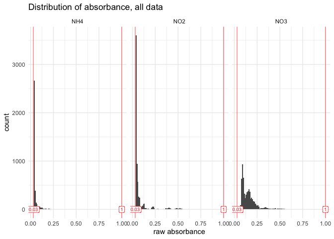

``` r
suspicious_wells |> slice_max(abs, n = 10)
```

    # A tibble: 0 × 5
    # ℹ 5 variables: dataset <chr>, plate_id <chr>, well_id <chr>, map <chr>,
    #   abs <chr>

> [!CAUTION]
>
> ### Check this step
>
> - All wells have raw absorbances within the desired range, nothing to
>   remove
>
> - Do check if indeed `suspicious_wells` remains empty when the script
>   or its raw data are updated
>
> - Should it not be empty, decide what to do: broader range ok? Remove
>   outliers?
>
> - Should some wells be removed, then re-run the `qc_raw_abs()` on the
>   updated data

``` r
# Once validated, store last version in a "validated" data
raw_abs_clean <- raw_abs_tidy
```

## 6.2 - Correction for blank

### 6.2.1 - Standard curve

Obtain curve concentrations from metadata

``` r
(curve_concentration <- extract_curve(all_plate_metadata_keep |> filter_out(dataset == "TDN")))
```

    # A tibble: 1,832 × 4
       dataset  plate_id  row   std_conc
       <chr>    <chr>     <chr>    <dbl>
     1 Nmint1t2 NH4_1F1   A          0  
     2 Nmint1t2 NH4_1F1   B          0.5
     3 Nmint1t2 NH4_1F1   C          1  
     4 Nmint1t2 NH4_1F1   D          2  
     5 Nmint1t2 NH4_1F1   E          3  
     6 Nmint1t2 NH4_1F1   F          4  
     7 Nmint1t2 NH4_1F1   G          8  
     8 Nmint1t2 NH4_1F1   H         10  
     9 Nmint1t2 NH4_1F2_1 A          0  
    10 Nmint1t2 NH4_1F2_1 B          0.5
    # ℹ 1,822 more rows

Extract Std wells, add unique curve ID, then add curve_concentration

``` r
#raw_abs_clean |> filter(dataset == "PNR")
#curve_concentration |> filter(dataset == "PNR")
std_data <- raw_abs_clean |> 
  extract_std_data() |> 
  select(!std_conc) |> 
  left_join(curve_concentration, by = join_by(row, dataset, plate_id))
```

Check unstrusted blanks (where the smallest value for a given curve is
not in row A (top_down pipetting) or in row H (bottom_up pipetting)

``` r
std_blank <- raw_abs_clean |> extract_std_blank()
std_blank$untrusted
```

    # A tibble: 8 × 8
    # Groups:   dataset, plate_id, column [8]
      well_id dataset  plate_id  column unique_curve_id row   unique_well_id   abs
      <chr>   <chr>    <chr>     <chr>  <chr>           <chr> <chr>          <dbl>
    1 A1      Nmint1t2 NH4_2F5_1 1      NH4_2F5_1_col1  A     A1_NH4_2F5_1   0.044
    2 A1      Nmint1t2 NH4_2F5_2 1      NH4_2F5_2_col1  A     A1_NH4_2F5_2   0.044
    3 A12     PMN      NH4_PP1   12     NH4_PP1_col12   A     A12_NH4_PP1    0.064
    4 A1      PMN      NO2_PP4   1      NO2_PP4_col1    A     A1_NO2_PP4     0.098
    5 A1      PNR      NO2_R2_1  1      NO2_R2_1_col1   A     A1_NO2_R2_1    0.038
    6 A12     PNR      NO2_R2_1  12     NO2_R2_1_col12  A     A12_NO2_R2_1   0.037
    7 A12     PNR      NO2_R2_4  12     NO2_R2_4_col12  A     A12_NO2_R2_4   0.037
    8 A1      PNR      NO3_R1_4  1      NO3_R1_4_col1   A     A1_NO3_R1_4    0.085

``` r
#blank$all |> filter(plate_id == "NO3_R2R3_1")
```

Check it out graphically.

``` r
# Subset: look at suspicious blanks
std_data |> 
  filter(unique_curve_id %in% std_blank$untrusted$unique_curve_id) |> 
  plot_std(through_origin = FALSE) +
  facet_wrap(~plate_id, scales = "free")
```

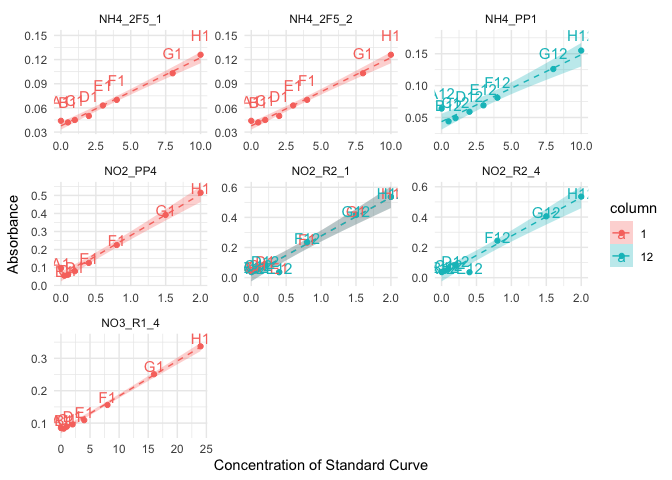

“Untrusted wells” are all A1 or A12 shown in 7 panels (but 8 cures) of
the plot above. Most of those wells are indeed to be removed as they
clearly fall outside of the curve drawn by the other wells. However, for
plates NO2_R2_1 and NO2_R2_4, the reason why A1 (or A12) is not the
smallest recorded absorbance is because another well is off, i.e., well
E12. Those A-wells thus should be kept. Therefore, we cannot compute the
average of standard blanks from `std_blank$trusted` as this would
exclude those wells as well.

Note that for NH4_PP1, the “untrusted” A-well is in column 12, so in
this case due to another issue (not the forgotten discharge of automated
pipette). Nevertheless, the misalignment with the curve is obvious
enough to be considered for removal.

> [!TIP]
>
> ### When we decide to trust some “untrusted” wells
>
> Should there be a choice, where only some of the untrusted wells need
> to be removed, but not all, the function `remove_wells()` can be used
> on `blank$all` to remove the selection of really-untrusted wells,
> which would generate a new version of “trusted wells”, from which the
> average values need to be computed manually.

Uncomment the following chunk in case all untrusted wells are, indeed,
to be removed

``` r
#std_blank_avg <- std_blank$trusted |> std_blank_average()
```

Find a way to compose a `to_remove` table that only contains the wells
that we want to remove

``` r
to_remove <- std_blank$untrusted |> 
  filter_out(dataset == "PNR" & plate_id != "NO3_R1_4")
```

Then create a new trusted version of `std_blank`.

``` r
std_blank_clean <- std_blank$all |> remove_wells(to_remove)
```

Checking how many blanks have been removed

``` r
nrow(std_blank$all) ; nrow(to_remove) ; nrow(std_blank_clean) 
```

    [1] 454

    [1] 5

    [1] 449

Then compute the average

``` r
(std_blank_avg <- std_blank_clean |> std_blank_average())
```

    # A tibble: 229 × 5
       dataset  plate_id  blank_avg blank_sdev blank_coeff_var_percent
       <chr>    <chr>         <dbl>      <dbl>                   <dbl>
     1 Nmint1t2 NH4_1F1      0.0385   0.000707                    1.84
     2 Nmint1t2 NH4_1F2_1    0.0385   0.000707                    1.84
     3 Nmint1t2 NH4_1F2_2    0.0385   0.000707                    1.84
     4 Nmint1t2 NH4_1F3      0.038    0                           0   
     5 Nmint1t2 NH4_1F4      0.0385   0.000707                    1.84
     6 Nmint1t2 NH4_1F5      0.0385   0.000707                    1.84
     7 Nmint1t2 NH4_1G1      0.0385   0.000707                    1.84
     8 Nmint1t2 NH4_1G2      0.0385   0.000707                    1.84
     9 Nmint1t2 NH4_1G3      0.038    0                           0   
    10 Nmint1t2 NH4_1G4      0.038    0                           0   
    # ℹ 219 more rows

> [!CAUTION]
>
> ### CAUTION
>
> We are here removing wells with the blank for the standard curve. This
> works because we had 2 curves per plate in those plates.
>
> - Should there have only been 1 curve per plate, it would be more
>   complex, as we cannot afford to have zero value for the blank of the
>   standard curve.
>
> - An option would be to see whether the inter-plate variation in
>   absorbance values for the standard curves is sufficiently small. If
>   so, then maybe the blank value of one plate could be replaced by the
>   mean of other plates.
>
> - In doing so, watch out for batch effect. Maybe inter-plate variation
>   is smallest during a single day of experimentation, etc.
>
> - To be tested and implemented in coding.

Now that we have all the trusted wells with blank values, we can finally
correct absorbance values for the standard curves

Because the logic is similar, we will first go into blank-correction of
sample data before finalizing work on the standard curves (applying
linear regression model)

### 6.2.2 - Sample wells

We will work separately for PNR because it has quite a few subtleties.

#### 6.2.2.1 - non-PNR data (Nmin, PMN)

Take a subset

``` r
raw_abs_clean_noPNR <- raw_abs_clean |> filter_out(dataset == "PNR")
```

First, extract data for wells containing extractant and have a look at
its variation

``` r
extr_data <- extract_extractant(raw_abs_clean_noPNR)
(blank_avg <- extractant_average(raw_abs_clean_noPNR) |> 
  arrange(desc(blank_coeff_var_percent)))
```

    # A tibble: 165 × 6
       dataset  plate_id   map   blank_avg blank_sdev blank_coeff_var_percent
       <chr>    <chr>      <chr>     <dbl>      <dbl>                   <dbl>
     1 PMN      NO2_PP4    extr     0.0494    0.0318                    64.3 
     2 Nmint1t2 NH4_2F2_2  extr     0.0405    0.00748                   18.5 
     3 Nmint3   NO3_R7R8_1 extr     0.0825    0.0135                    16.4 
     4 Nmint3   NO2_R4R5_1 extr     0.039     0.00270                    6.91
     5 Nmint1t2 NH4_2P2    extr     0.0401    0.00242                    6.02
     6 Nmint1t2 NO3_2F1_1  extr     0.0718    0.00377                    5.25
     7 PMN      NO2_PF2    extr     0.0376    0.00177                    4.70
     8 PMN      NO3_PP4    extr     0.0872    0.00399                    4.57
     9 Nmint1t2 NO2_2P6_1  extr     0.0372    0.00158                    4.24
    10 Nmint1t2 NO2_2F1_1  extr     0.0376    0.00151                    4.00
    # ℹ 155 more rows

``` r
plot_blank_var_distrib(blank_avg)
```


We see that a few plates have a very high coefficient of variation, we
will have to look at them individually. Let’s set the threshold for the
coefficient of variation at 5% (default)

``` r
threshold <- 5

suspicious_plates <- raw_abs_clean_noPNR |> 
  qc_raw_extr(suppress_warning = TRUE, max_coeff = threshold)

suspicious_extr <- suspicious_extr(
  raw_abs_clean_noPNR, suspicious_extr_per_plate = suspicious_plates, max_coeff = threshold)
```

    Joining with `by = join_by(plate_id, map)`

``` r
# check it out
suspicious_extr
```

    # A tibble: 60 × 13
       row   column well_id unique_well_id dataset  plate_id    abs map   std_sp
       <chr> <chr>  <chr>   <chr>          <chr>    <chr>     <dbl> <chr> <chr> 
     1 A     8      A8      A8_NH4_2F2_2   Nmint1t2 NH4_2F2_2 0.038 extr  NH4   
     2 B     8      B8      B8_NH4_2F2_2   Nmint1t2 NH4_2F2_2 0.037 extr  NH4   
     3 C     8      C8      C8_NH4_2F2_2   Nmint1t2 NH4_2F2_2 0.038 extr  NH4   
     4 D     8      D8      D8_NH4_2F2_2   Nmint1t2 NH4_2F2_2 0.038 extr  NH4   
     5 E     8      E8      E8_NH4_2F2_2   Nmint1t2 NH4_2F2_2 0.038 extr  NH4   
     6 F     8      F8      F8_NH4_2F2_2   Nmint1t2 NH4_2F2_2 0.038 extr  NH4   
     7 G     8      G8      G8_NH4_2F2_2   Nmint1t2 NH4_2F2_2 0.038 extr  NH4   
     8 H     8      H8      H8_NH4_2F2_2   Nmint1t2 NH4_2F2_2 0.059 extr  NH4   
     9 A     8      A8      A8_NH4_2P2     Nmint1t2 NH4_2P2   0.039 extr  NH4   
    10 B     8      B8      B8_NH4_2P2     Nmint1t2 NH4_2P2   0.039 extr  NH4   
    # ℹ 50 more rows
    # ℹ 4 more variables: std_conc <chr>, std_unit <chr>, sample_dilution <chr>,
    #   date <chr>

``` r
# plot outliers
suspicious_extr |> boxplot_outlier_extr(max_coeff = threshold)
```

    Joining with `by = join_by(plate_id)`

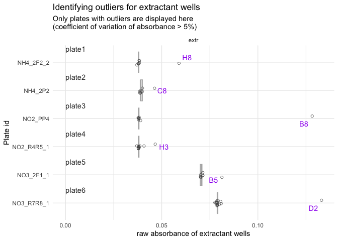

We have 6 plates that each have one or more obvious outlier well. We
will need to remove them manually.

First, we create a small tibble that will serve to construct the tibble
of wells to remove

``` r
plate_ids <- suspicious_extr |> 
  ungroup() |> 
  select(dataset, plate_id) |> unique() 
plate_ids <- plate_ids |> # save numbers for plate order in the plot
  mutate(plate_order = seq(1, nrow(plate_ids)))
```

Then, we create a vector with wells to remove (going through boxplots
from top to bottom).

> [!TIP]
>
> ### Manually remove blank outliers
>
> In the following chunk, you need to manually decide which wells to
> remove, based on the boxplots produced above.
>
> - Make sure to deal appropriately with plates that require 2 outliers
>   or no outlier to be removed (see example below)

``` r
#** !!! MANUAL INPUT !!! *

# Which plate needs 2 outliers removed?
plate_with_2_outliers <- 4
plate_without_outliers <- 9 # use a number > nb of plates if there is no such plate

# Which wells are outliers? 
well_ids <- c("H8", "C8", "B8", "G3", "H3", "B5", "D2") 
```

Then we finish constructing the tibble of wells to be removed

``` r
to_remove <- plate_ids |> 
  bind_rows(plate_ids |> filter(plate_order == plate_with_2_outliers)) |> 
  arrange(plate_order) |> 
  mutate(well_id = well_ids) |> 
  filter(plate_order != plate_without_outliers) |> #remove plate without outliers
  select(!plate_order)
```

Checking that we didn’t get confused: look at `to_remove` in parallel to
the boxplot

``` r
to_remove
```

    # A tibble: 7 × 3
      dataset  plate_id   well_id
      <chr>    <chr>      <chr>  
    1 Nmint1t2 NH4_2F2_2  H8     
    2 Nmint1t2 NH4_2P2    C8     
    3 PMN      NO2_PP4    B8     
    4 Nmint3   NO2_R4R5_1 G3     
    5 Nmint3   NO2_R4R5_1 H3     
    6 Nmint1t2 NO3_2F1_1  B5     
    7 Nmint3   NO3_R7R8_1 D2     

Looks good, so we remove it from extractant data and recompute the
average

``` r
extr_data_clean <- extr_data |> 
  remove_wells(to_remove) 

blank_avg_clean <- extractant_average(extractant_data = extr_data_clean) 
```

Check that biggest coeff_var indeed below threshold

``` r
blank_avg_clean |> arrange(desc(blank_coeff_var_percent)) |> head()
```

    # A tibble: 6 × 6
      dataset  plate_id   map   blank_avg blank_sdev blank_coeff_var_percent
      <chr>    <chr>      <chr>     <dbl>      <dbl>                   <dbl>
    1 PMN      NO2_PF2    extr     0.0376    0.00177                    4.70
    2 PMN      NO3_PP4    extr     0.0872    0.00399                    4.57
    3 Nmint1t2 NO2_2P6_1  extr     0.0372    0.00158                    4.24
    4 Nmint1t2 NO2_2F1_1  extr     0.0376    0.00151                    4.00
    5 Nmint1t2 NO2_2F6_1  extr     0.0368    0.00139                    3.78
    6 Nmint3   NO2_R2R3_1 extr     0.0395    0.00120                    3.03

Now that we are confident in the per-plate average value of raw
absorbance of extractant wells, we can finally blank-correct all sample
data

#### 6.2.2.2 - PNR data

Take a subset

``` r
raw_abs_clean_PNR <- raw_abs_clean |> filter(dataset == "PNR")
```

First, extract data for wells containing extractant and have a look at
its variation

``` r
extr_data <- extract_extractant(
  raw_abs_clean_PNR, extr_def = c("extr", "blank_ctrl"))
(blank_avg <- extractant_average(
  raw_abs_clean_PNR, extr_def = c("extr", "blank_ctrl")) |> 
  arrange(desc(blank_coeff_var_percent)))
```

    # A tibble: 80 × 6
       dataset plate_id map        blank_avg blank_sdev blank_coeff_var_percent
       <chr>   <chr>    <chr>          <dbl>      <dbl>                   <dbl>
     1 PNR     NO2_R4_2 extr          0.0392    0.00198                    5.05
     2 PNR     NO3_R3_2 extr          0.0978    0.00471                    4.82
     3 PNR     NO3_R6_2 extr          0.0968    0.00423                    4.38
     4 PNR     NO3_R3_1 extr          0.0978    0.00420                    4.30
     5 PNR     NO2_R5_4 blank_ctrl    0.0375    0.00151                    4.03
     6 PNR     NO2_R5_2 extr          0.0399    0.00136                    3.40
     7 PNR     NO3_R1_3 extr          0.0782    0.00255                    3.26
     8 PNR     NO3_R3_4 extr          0.0984    0.00288                    2.92
     9 PNR     NO2_R4_4 blank_ctrl    0.0375    0.00107                    2.85
    10 PNR     NO3_R3_3 extr          0.0974    0.00256                    2.63
    # ℹ 70 more rows

``` r
plot_blank_var_distrib(blank_avg)
```


Blanks have been recorded as one column per plate, but actually it was
the upper half (A2-D2) for the blank without incubation (T0), and the
lower half (E2-H2) for the blank after 26h of incubation (T26). The idea
was anyway to take the average of the two. Seeing that values are close,
I think it is good enough to keep them as one. The average will be taken
among 8 wells instead of average of 4 2x, then average again. There will
be a slight overweighing of one blank in case wells are removed from 1
and not the other, but for now I think that the difference will be
marginal enough, especially seeing that we have here relatively small
coefficients of variation.

With a 5% threshold for the coefficient of variation, only 1 plate is
above. Let’s look at it.

``` r
threshold <- 5

suspicious_plates <- raw_abs_clean_PNR |> 
  qc_raw_extr(suppress_warning = TRUE, max_coeff = threshold)

suspicious_extr <- suspicious_extr(
  raw_abs_clean_PNR, suspicious_extr_per_plate = suspicious_plates, max_coeff = threshold)
```

    Joining with `by = join_by(plate_id, map)`

``` r
# check it out
suspicious_extr
```

    # A tibble: 8 × 13
      row   column well_id unique_well_id dataset plate_id   abs map   std_sp
      <chr> <chr>  <chr>   <chr>          <chr>   <chr>    <dbl> <chr> <chr> 
    1 A     2      A2      A2_NO2_R4_2    PNR     NO2_R4_2 0.038 extr  NO2   
    2 B     2      B2      B2_NO2_R4_2    PNR     NO2_R4_2 0.039 extr  NO2   
    3 C     2      C2      C2_NO2_R4_2    PNR     NO2_R4_2 0.044 extr  NO2   
    4 D     2      D2      D2_NO2_R4_2    PNR     NO2_R4_2 0.038 extr  NO2   
    5 E     2      E2      E2_NO2_R4_2    PNR     NO2_R4_2 0.039 extr  NO2   
    6 F     2      F2      F2_NO2_R4_2    PNR     NO2_R4_2 0.038 extr  NO2   
    7 G     2      G2      G2_NO2_R4_2    PNR     NO2_R4_2 0.039 extr  NO2   
    8 H     2      H2      H2_NO2_R4_2    PNR     NO2_R4_2 0.039 extr  NO2   
    # ℹ 4 more variables: std_conc <chr>, std_unit <chr>, sample_dilution <chr>,
    #   date <chr>

``` r
# plot outliers
suspicious_extr |> boxplot_outlier_extr(max_coeff = threshold)
```

    Joining with `by = join_by(plate_id)`

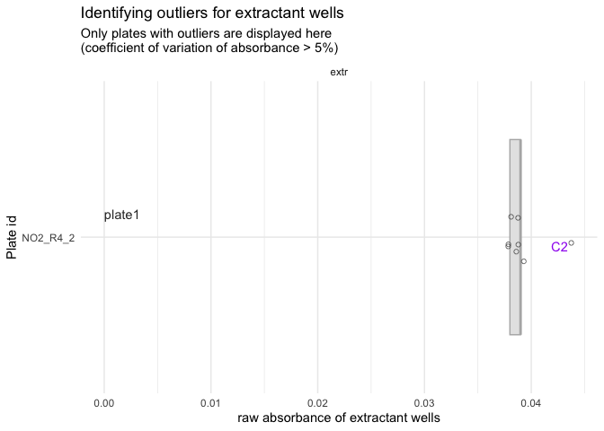

We can remove well C2 of that plate manually.

First, we create a small tibble that will serve to construct the tibble
of wells to remove

``` r
plate_ids <- suspicious_extr |> 
  ungroup() |> 
  select(dataset, plate_id) |> unique() 
plate_ids <- plate_ids |> # save numbers for plate order in the plot
  mutate(plate_order = seq(1, nrow(plate_ids)))
```

Then, we create a vector with wells to remove (going through boxplots
from top to bottom).

``` r
#** !!! MANUAL INPUT !!! *

# Which plate needs 2 outliers removed?
plate_with_2_outliers <- 4
plate_without_outliers <- 9 # use a number > nb of plates if there is no such plate

# Which wells are outliers? 
well_ids <- c("C2") 
```

Then we finish constructing the tibble of wells to be removed

``` r
to_remove <- plate_ids |> 
  bind_rows(plate_ids |> filter(plate_order == plate_with_2_outliers)) |> 
  arrange(plate_order) |> 
  mutate(well_id = well_ids) |> 
  filter(plate_order != plate_without_outliers) |> #remove plate without outliers
  select(!plate_order)
```

Checking that we didn’t get confused: look at `to_remove` in parallel to
the boxplot

``` r
to_remove
```

    # A tibble: 1 × 3
      dataset plate_id well_id
      <chr>   <chr>    <chr>  
    1 PNR     NO2_R4_2 C2     

Looks good, so we remove it from extractant data and recompute the
average

``` r
extr_data_clean <- extr_data |> 
  remove_wells(to_remove) 

blank_avg_clean <- extractant_average(
  extractant_data = extr_data_clean, extr_def = c("extr", "blank_ctrl"))
```

Check that biggest coeff_var indeed below threshold

``` r
blank_avg_clean |> arrange(desc(blank_coeff_var_percent)) |> head()
```

    # A tibble: 6 × 6
      dataset plate_id map        blank_avg blank_sdev blank_coeff_var_percent
      <chr>   <chr>    <chr>          <dbl>      <dbl>                   <dbl>
    1 PNR     NO3_R3_2 extr          0.0978    0.00471                    4.82
    2 PNR     NO3_R6_2 extr          0.0968    0.00423                    4.38
    3 PNR     NO3_R3_1 extr          0.0978    0.00420                    4.30
    4 PNR     NO2_R5_4 blank_ctrl    0.0375    0.00151                    4.03
    5 PNR     NO2_R5_2 extr          0.0399    0.00136                    3.40
    6 PNR     NO3_R1_3 extr          0.0782    0.00255                    3.26

Now that we are confident in the per-plate average value of raw
absorbance of extractant wells, we can finally blank-correct all sample
data

> [!CAUTION]
>
> ### When several blanks per plate
>
> Like hereunder, then the input plate, given to the argument
> `raw_wells_data` into `blank_correct_abs()` must contain an extra
> column called `extr_id` giving the info, for each well, which blank to
> use

Add extr_id info

``` r
clean_PNR_extr_id <- raw_abs_clean_PNR |> 
  left_join(slurry_samples |> 
    rename(map = slurry_sample) |> 
    select(map, extr_id)
    )
```

    Joining with `by = join_by(map)`

### 6.2.3 - All corrected data

Let’s just recall all corrected data. We have 2 separate tibbles
(because the experimental design was arranged to have separate blanks
for the curve and the samples)

``` r
# Standard curve, blank-corrected and clean
std_corrected 
```

    # A tibble: 3,204 × 17
       row   column well_id unique_well_id dataset  plate_id  unique_curve_id map  
       <chr> <chr>  <chr>   <chr>          <chr>    <chr>     <chr>           <chr>
     1 B     1      B1      B1_NH4_1F1     Nmint1t2 NH4_1F1   NH4_1F1_col1    Std  
     2 B     1      B1      B1_NH4_1F2_1   Nmint1t2 NH4_1F2_1 NH4_1F2_1_col1  Std  
     3 B     1      B1      B1_NH4_1F2_2   Nmint1t2 NH4_1F2_2 NH4_1F2_2_col1  Std  
     4 B     1      B1      B1_NH4_1F3     Nmint1t2 NH4_1F3   NH4_1F3_col1    Std  
     5 B     1      B1      B1_NH4_1F4     Nmint1t2 NH4_1F4   NH4_1F4_col1    Std  
     6 B     1      B1      B1_NH4_1F5     Nmint1t2 NH4_1F5   NH4_1F5_col1    Std  
     7 B     1      B1      B1_NH4_1G1     Nmint1t2 NH4_1G1   NH4_1G1_col1    Std  
     8 B     1      B1      B1_NH4_1G2     Nmint1t2 NH4_1G2   NH4_1G2_col1    Std  
     9 B     1      B1      B1_NH4_1G3     Nmint1t2 NH4_1G3   NH4_1G3_col1    Std  
    10 B     1      B1      B1_NH4_1G4     Nmint1t2 NH4_1G4   NH4_1G4_col1    Std  
    # ℹ 3,194 more rows
    # ℹ 9 more variables: abs_corrected <dbl>, std_sp <chr>, std_unit <chr>,
    #   sample_dilution <chr>, date <chr>, std_conc <dbl>, extr_id <chr>,
    #   blank_sdev <dbl>, blank_coeff_var_percent <dbl>

``` r
# Samples, blank-corrected and clean
samples_corrected_noPNR
```

    # A tibble: 6,551 × 16
       row   column well_id unique_well_id dataset  plate_id  map      abs_corrected
       <chr> <chr>  <chr>   <chr>          <chr>    <chr>     <chr>            <dbl>
     1 A     2      A2      A2_NH4_1F1     Nmint1t2 NH4_1F1   81_t1_z2      0.007   
     2 A     2      A2      A2_NH4_1F2_1   Nmint1t2 NH4_1F2_1 97_t1_z1      0.00350 
     3 A     2      A2      A2_NH4_1F3     Nmint1t2 NH4_1F3   89_t1_z3      0.00288 
     4 A     2      A2      A2_NH4_1F4     Nmint1t2 NH4_1F4   81_t1_z1      0.00725 
     5 A     2      A2      A2_NH4_1F5     Nmint1t2 NH4_1F5   Std_3_t1      0.0229  
     6 A     2      A2      A2_NH4_1G1     Nmint1t2 NH4_1G1   1_t1          0.00100 
     7 A     2      A2      A2_NH4_1G2     Nmint1t2 NH4_1G2   17_t1         0.000875
     8 A     2      A2      A2_NH4_1G3     Nmint1t2 NH4_1G3   33_t1         0.00288 
     9 A     2      A2      A2_NH4_1G4     Nmint1t2 NH4_1G4   49_t1         0.000125
    10 A     2      A2      A2_NH4_1G5     Nmint1t2 NH4_1G5   65_t1         0.00175 
    # ℹ 6,541 more rows
    # ℹ 8 more variables: std_sp <chr>, std_conc <chr>, std_unit <chr>,
    #   sample_dilution <chr>, date <chr>, extr_id <chr>, blank_sdev <dbl>,
    #   blank_coeff_var_percent <dbl>

``` r
samples_corrected_PNR
```

    # A tibble: 4,472 × 16
       row   column well_id unique_well_id dataset plate_id map        abs_corrected
       <chr> <chr>  <chr>   <chr>          <chr>   <chr>    <chr>              <dbl>
     1 A     3      A3      A3_NO3_R1_1    PNR     NO3_R1_1 83_z3_T0          0.0938
     2 A     3      A3      A3_NO3_R1_2    PNR     NO3_R1_2 90_z3_T0          0.0326
     3 A     3      A3      A3_NO3_R1_3    PNR     NO3_R1_3 95_z3_T0          0.0218
     4 A     3      A3      A3_NO3_R1_4    PNR     NO3_R1_4 Std_soil_…        0.121 
     5 A     3      A3      A3_NO3_R2_1    PNR     NO3_R2_1 82_z3_T0          0.0852
     6 A     3      A3      A3_NO3_R2_2    PNR     NO3_R2_2 87_z3_T0          0.0799
     7 A     3      A3      A3_NO3_R2_3    PNR     NO3_R2_3 93_z3_T0          0.0418
     8 A     3      A3      A3_NO3_R2_4    PNR     NO3_R2_4 Std_soil_…        0.176 
     9 A     3      A3      A3_NO3_R3_1    PNR     NO3_R3_1 81_z1_T0          0.0962
    10 A     3      A3      A3_NO3_R3_2    PNR     NO3_R3_2 89_z2_T0          0.0662
    # ℹ 4,462 more rows
    # ℹ 8 more variables: std_sp <chr>, std_conc <chr>, std_unit <chr>,
    #   sample_dilution <chr>, date <chr>, extr_id <chr>, blank_sdev <dbl>,
    #   blank_coeff_var_percent <dbl>

``` r
# check that both tables same columns, then bind_row is ok
sum(names(samples_corrected_noPNR) != names(samples_corrected_PNR))
```

    [1] 0

``` r
samples_corrected <- bind_rows(
  samples_corrected_noPNR, samples_corrected_PNR
)
```

## 6.3 - Compute regression equation (per plate)

### 6.3.1 - QC standard curves - round 1

Assumptions of a linear model: (taken
[here](https://towardsdatascience.com/all-the-statistical-tests-you-must-do-for-a-good-linear-regression-6ec1ac15e5d4/),
apparently from [Spanish
book](https://periodicos.ufpe.br/revistas/politicahoje/article/download/3808/31622))

- The residuals must follow a normal distribution.

- The residuals are homogeneous, there is homoscedasticity.

- There’s no outliers in the errors.

- There’s no autocorrelation in the errors.

!!! FORMULATE better and split in 2 chunks :-)

First, we perform a linear model on each curve individually (i.e.,
possibly several curves per plate).

Then we take a subset to examine individually: those curves where the
linear model doesn’t seem to perform ideally (e.g., non-significant
model (p-value \> 0.05), residuals not normally distributed, or
heteroscedasticity)

``` r
lm_table_raw <- lm_std_curve(std_corrected |> group_by(plate_id, column))

# extract all plates where "something" is not perfect 
(lm_table_suspicious <- lm_table_raw |> 
  suspicious_lm())
```

    # A tibble: 96 × 12
       dataset  plate_id  unique_curve_id std_sp   slope r_squared adj_r_squared
       <chr>    <chr>     <chr>           <chr>    <dbl>     <dbl>         <dbl>
     1 Nmint1t2 NH4_1F1   NH4_1F1_col1    NH4    0.00798     0.990         0.988
     2 Nmint1t2 NH4_1G2   NH4_1G2_col12   NH4    0.00600     0.988         0.986
     3 Nmint1t2 NH4_2F1_1 NH4_2F1_1_col12 NH4    0.00884     0.996         0.995
     4 Nmint1t2 NH4_2F1_2 NH4_2F1_2_col12 NH4    0.00884     0.996         0.995
     5 Nmint1t2 NH4_2F2_1 NH4_2F2_1_col1  NH4    0.00800     0.998         0.997
     6 Nmint1t2 NH4_2F2_2 NH4_2F2_2_col1  NH4    0.00800     0.998         0.997
     7 Nmint1t2 NH4_2F4_1 NH4_2F4_1_col1  NH4    0.00857     0.990         0.988
     8 Nmint1t2 NH4_2F4_2 NH4_2F4_2_col1  NH4    0.00857     0.990         0.988
     9 Nmint1t2 NH4_2P1   NH4_2P1_col1    NH4    0.00887     0.990         0.988
    10 Nmint1t2 NH4_2P2   NH4_2P2_col12   NH4    0.00800     0.995         0.994
    # ℹ 86 more rows
    # ℹ 5 more variables: lm_p <dbl>, normality_lm_residuals <chr>,
    #   shapiro_p <dbl>, homoscedasticity_lm_residuals <chr>, breusch_pagan_p <dbl>

Then, for visual support, we create a list of plots where we store each
individual plot of “suspicious” standard curves

``` r
suspicious_lm_plotlist <- plot_list_lm(
  lm_data = lm_table_suspicious,
  std_data = std_corrected)

# check one plot out
suspicious_lm_plotlist[[2]]
```

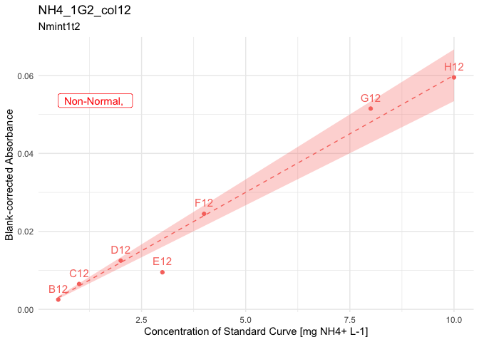

Now we can look at each plot individually. Because there are still 96
plots to review, we will look through them in 5 batches of 20 plots.

``` r
n_plots <- length(suspicious_lm_plotlist)
batch <- 20

batch_1 <- suspicious_lm_plotlist |> head(n = batch)
batch_2 <- suspicious_lm_plotlist |> tail(n = n_plots-batch) |> head(n = batch)
batch_3 <- suspicious_lm_plotlist |> tail(n = n_plots-(2*batch)) |> head(n = batch)
batch_4 <- suspicious_lm_plotlist |> tail(n = n_plots-(3*batch)) |> head(n = batch)
batch_5 <- suspicious_lm_plotlist |> tail(n = n_plots-(4*batch))

patchwork::wrap_plots(batch_1, axis_titles = "keep") +
     patchwork::plot_annotation(title = "Plots of suspicious Standard curves")
```

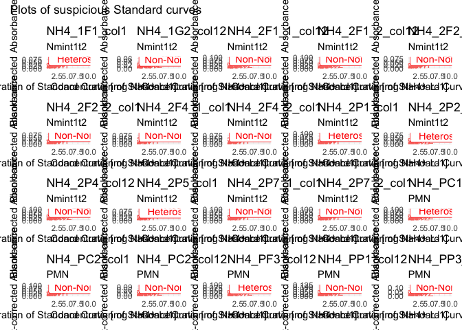

``` r
patchwork::wrap_plots(batch_2, axis_titles = "keep") +
     patchwork::plot_annotation(title = "Plots of suspicious Standard curves")
```


``` r
patchwork::wrap_plots(batch_3, axis_titles = "keep") +
     patchwork::plot_annotation(title = "Plots of suspicious Standard curves")
```


``` r
patchwork::wrap_plots(batch_4, axis_titles = "keep") +
     patchwork::plot_annotation(title = "Plots of suspicious Standard curves")
```


``` r
patchwork::wrap_plots(batch_5, axis_titles = "keep") +
     patchwork::plot_annotation(title = "Plots of suspicious Standard curves")
```

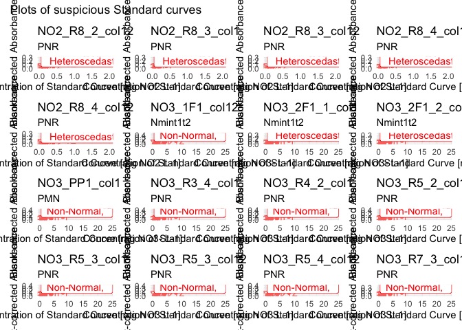

Most plates are from NH4 and NO2. Because most measurement of NH4 and
NO2 are close to zero, it might be relevant to just remove highest
points of the curve to get a better fit.

Let’s check how high the absorbance goes with these data sets, for each
N species, by comparing those highest values with the plots above.

``` r
samples_corrected |> filter(std_sp == "NH4") |> 
  arrange(desc(abs_corrected)) |> slice_head(n = 10)
```

    # A tibble: 10 × 16
       row   column well_id unique_well_id dataset plate_id   map      abs_corrected
       <chr> <chr>  <chr>   <chr>          <chr>   <chr>      <chr>            <dbl>
     1 A     6      A6      A6_NH4_R2R3_1  Nmint3  NH4_R2R3_1 std_R2_…        0.0384
     2 B     6      B6      B6_NH4_R2R3_1  Nmint3  NH4_R2R3_1 std_R2_…        0.0384
     3 C     6      C6      C6_NH4_R2R3_1  Nmint3  NH4_R2R3_1 std_R2_…        0.0374
     4 D     6      D6      D6_NH4_R2R3_1  Nmint3  NH4_R2R3_1 std_R2_…        0.0364
     5 E     9      E9      E9_NH4_R2R3_2  Nmint3  NH4_R2R3_2 std_R3_…        0.0351
     6 F     9      F9      F9_NH4_R2R3_2  Nmint3  NH4_R2R3_2 std_R3_…        0.0351
     7 G     9      G9      G9_NH4_R2R3_2  Nmint3  NH4_R2R3_2 std_R3_…        0.0341
     8 H     9      H9      H9_NH4_R2R3_2  Nmint3  NH4_R2R3_2 std_R3_…        0.0341
     9 E     4      E4      E4_NH4_R1R2_1  Nmint3  NH4_R1R2_1 std_R1_…        0.032 
    10 F     4      F4      F4_NH4_R1R2_1  Nmint3  NH4_R1R2_1 std_R1_…        0.032 
    # ℹ 8 more variables: std_sp <chr>, std_conc <chr>, std_unit <chr>,
    #   sample_dilution <chr>, date <chr>, extr_id <chr>, blank_sdev <dbl>,
    #   blank_coeff_var_percent <dbl>

``` r
samples_corrected |> filter(std_sp == "NO2") |> 
  arrange(desc(abs_corrected)) |> slice_head(n = 10)
```

    # A tibble: 10 × 16
       row   column well_id unique_well_id dataset  plate_id map       abs_corrected
       <chr> <chr>  <chr>   <chr>          <chr>    <chr>    <chr>             <dbl>
     1 A     3      A3      A3_NO2_PF2     PMN      NO2_PF2  Field_Au…         0.581
     2 A     2      A2      A2_NO2_1F5     Nmint1t2 NO2_1F5  Std_3_t1          0.177
     3 C     2      C2      C2_NO2_1F5     Nmint1t2 NO2_1F5  Std_3_t1          0.174
     4 D     2      D2      D2_NO2_1F5     Nmint1t2 NO2_1F5  Std_3_t1          0.173
     5 B     2      B2      B2_NO2_1F5     Nmint1t2 NO2_1F5  Std_3_t1          0.172
     6 E     5      E5      E5_NO2_R7_2    PNR      NO2_R7_2 90_z2_T26         0.147
     7 G     5      G5      G5_NO2_R7_2    PNR      NO2_R7_2 90_z2_T26         0.147
     8 H     5      H5      H5_NO2_R7_2    PNR      NO2_R7_2 90_z2_T26         0.147
     9 F     5      F5      F5_NO2_R7_2    PNR      NO2_R7_2 90_z2_T26         0.146
    10 E     5      E5      E5_NO2_R1_2    PNR      NO2_R1_2 90_z3_T26         0.14 
    # ℹ 8 more variables: std_sp <chr>, std_conc <chr>, std_unit <chr>,
    #   sample_dilution <chr>, date <chr>, extr_id <chr>, blank_sdev <dbl>,
    #   blank_coeff_var_percent <dbl>

We see that the highest absorbance for NO2 and NH4 is mostly far below
the most concentrated point of the standard curve –\> we can remove row
H for sure for those datasets, but row G probably not.

This is not totally true for NO2 of the PMN dataset, although funnily,
only one well is well far above the others, indicating a probable
outlier (reminder: we always ran the experiment in 4 replicates, so we
should expect 4 wells of similar concentration).

So, we can list wells to remove the H row of NO2 and NH4 std.

``` r
to_remove_nh4_no2_h <- std_corrected |> 
  filter(
    (std_sp == "NH4" & row %in% c("G", "H")) |
      (std_sp == "NO2" & row == "H")) |> 
  select(dataset, plate_id, well_id) 
```

Then, we can add the following single wells that were very obviously
misaligned with the curve (see multiplots above)

Nmint1t2

- NH4_1G2: E12

- NH4_2F4_1 & 2: C1

PNR

- NO2_R1_1, 3 & 4: B1 & B12

- NO2_R2_1,2,3,4: E1 & E12

- NO2_R8_1,2,3,4: H1 & H12

``` r
to_remove <- to_remove_nh4_no2_h |> 
  # wells for Nmint1t2
  bind_rows(tibble(
    dataset = c(rep("Nmint1t2", 3)), 
    plate_id = c("NH4_1G2", "NH4_2F4_1", "NH4_2F4_2"),
    well_id = c("E12", "C1", "C1")
  )) #

plate_ids_pnr_out <- paste0(
  "NO2_R", 
  c(
    sort(rep(paste0(1, "_", c(1,3,4)), 2)),
    sort(rep(paste0(2, "_", c(1:4)),2)),
    sort(rep(paste0(8, "_", c(1:4)), 2))
    )
)

well_ids_pnr_out <- c(
  rep(c("B1", "B12"), 3),
  rep(c("E1", "E12"), 4),
  rep(c("H1", "H12"), 4))


  # add wells for PNR
to_remove <- to_remove |> 
  bind_rows((tibble(
    dataset = rep("PNR", 22),
    plate_id = plate_ids_pnr_out,
    well_id = well_ids_pnr_out
  ))) |> 
  # remove duplicates (come from single H's being outlier + removing all H's for NO2)
  unique()
```

Before removing them, let’s look at suspicious plots for NO3 only, so we
can see the plots better

``` r
lm_table_suspicious_NO3 <- lm_table_suspicious |> 
  # extract N_sp from plate name. May be done differently, this is just one of many possible approaches
  separate_wider_delim(
    cols = unique_curve_id, delim = "_", 
    names = c("N_sp", "rest"), 
    too_many = "merge", cols_remove = FALSE) |> 
  select(!rest) |> 
  filter(N_sp == "NO3")

# Create plot list
lm_plot_list_NO3 <- plot_list_lm(
  lm_data = lm_table_suspicious_NO3,
  std_data = std_corrected)

patchwork::wrap_plots(lm_plot_list_NO3, axis_titles = "keep") +
     patchwork::plot_annotation(title = "Plots of suspicious Standard curves")
```

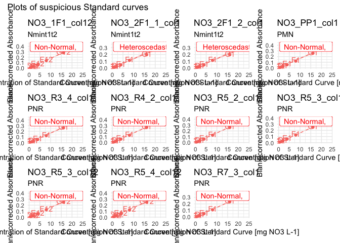

For the NO3 plates, the issue has to be solved differently, but those
are just a few –\> individual appraisal. We see here that we cannot
remove the H row, because some points seem to have an absorbance above
that of the G row of the standard.

``` r
samples_corrected |> 
  filter(std_sp == "NO3") |> 
  arrange(desc(abs_corrected)) |> 
  slice_head(n = 3)
```

    # A tibble: 3 × 16
      row   column well_id unique_well_id dataset  plate_id  map       abs_corrected
      <chr> <chr>  <chr>   <chr>          <chr>    <chr>     <chr>             <dbl>
    1 H     3      H3      H3_NO3_2F6_1   Nmint1t2 NO3_2F6_1 110_t2_M…         0.329
    2 H     10     H10     H10_NO3_2F6_2  Nmint1t2 NO3_2F6_2 110_t2_M…         0.326
    3 E     10     E10     E10_NO3_2F6_2  Nmint1t2 NO3_2F6_2 110_t2_M…         0.317
    # ℹ 8 more variables: std_sp <chr>, std_conc <chr>, std_unit <chr>,
    #   sample_dilution <chr>, date <chr>, extr_id <chr>, blank_sdev <dbl>,
    #   blank_coeff_var_percent <dbl>

For NO3_2F1, NO3_1F1 and NO3_PP1: there were probably 2 columns, so I
can look at both columns together

``` r
lm_table_raw |> 
  separate_wider_delim(
    cols = unique_curve_id, delim = "_", 
    names = c("n_sp", "plate", "rest"), 
    too_many = "merge", cols_remove = FALSE) |> 
  filter(n_sp == "NO3", plate %in% c("1F1", "2F1", "PP1")) |> 
  plot_list_lm(std_data = std_corrected) |> 
  patchwork::wrap_plots()
```

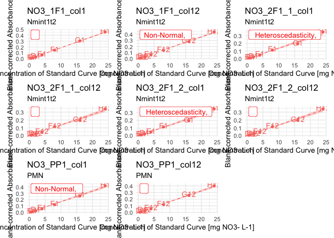

–\> for NO3_1F1 and NO3_PP1, we cannot do much, but maybe the average
will be enough to correct the defects

–\> remove B1 from NO3_2F1_1 and NO3_2F1_2

Then re-compute linear model table as “clean” version.

Then apply it

``` r
std_corrected_wash1 <- 
  std_corrected |> 
  remove_wells(
    to_remove |> 
      bind_rows(tibble(
        dataset = rep("Nmint1t2",2),
        plate_id = c("NO3_2F1_1", "NO3_2F1_2"),
        well_id = rep("B1",2)
        ))
    )
```

Run the quality check once more

``` r
lm_table_wash1 <- lm_std_curve(std_corrected_wash1 |> group_by(plate_id, column))

# extract all plates where "something" is not perfect 
lm_table_suspicious_wash1 <- lm_table_wash1 |> suspicious_lm()
#lm_table_suspicious_wash1 |> view()

suspicious_lm_plotlist_wash1 <- plot_list_lm(
  lm_data = lm_table_suspicious_wash1,
  std_data = std_corrected_wash1)

n_plots <- length(suspicious_lm_plotlist_wash1)
batch <- 15

batch_1 <- suspicious_lm_plotlist_wash1 |> head(n = batch)
batch_2 <- suspicious_lm_plotlist_wash1 |> tail(n = n_plots-batch) |> head(n = batch)
batch_3 <- suspicious_lm_plotlist_wash1 |> tail(n = n_plots-2*batch)

patchwork::wrap_plots(batch_1, axis_titles = "keep") +
     patchwork::plot_annotation(title = "Plots of suspicious Standard curves")
```

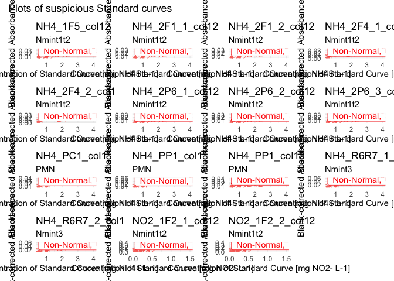

``` r
patchwork::wrap_plots(batch_2, axis_titles = "keep") +
     patchwork::plot_annotation(title = "Plots of suspicious Standard curves")
```

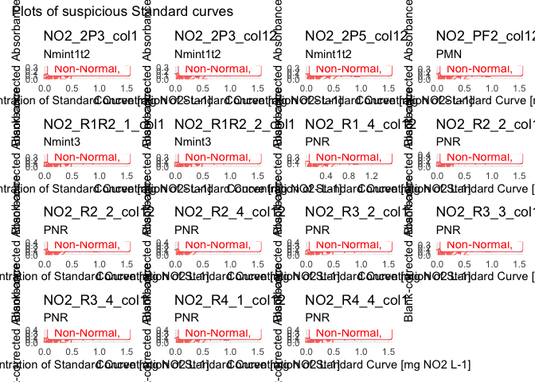

``` r
patchwork::wrap_plots(batch_3, axis_titles = "keep") +
     patchwork::plot_annotation(title = "Plots of suspicious Standard curves")
```


We still get 43 “suspicious” curves. But when we look at the p-values to
reject normality or heteroscedasticity, they are indeed below 0.05, but
it’s also not 10^-5 or something like that. The smallest p-value
(shapiro) is at 0.003.

Still, looking at the plots, there are 2 more wells that appear out of
place:

- NH4_PP1 & NH4_PC1: D1

``` r
to_remove <- tibble(
    dataset = c(rep("PMN", 2)), 
    plate_id = c("NH4_PP1", "NH4_PC1"),
    well_id = c("D1", "D1")
  )

std_corrected_wash2 <- std_corrected_wash1 |> remove_wells(to_remove)
```

Let’s compute the means per dilution and see…

### 6.3.2 - Compute per-dilution averages

Most plates in our dataset have 2 columns with the standard curves. It
seems that the ~1min delay between the 2 (column 1 and column 12 of the
plate) are responsible for a slight shift (example in plot below)

``` r
std_corrected_wash2 |> filter(plate_id == "NO3_2F3_1") |> rename(abs = abs_corrected) |> 
  plot_std()
```


So we will now compute the mean for same row (e.g., mean of H1 and H12)

> [!WARNING]
>
> ### WARNING
>
> The next step computes per plate per row means for the standard
> curves.
>
> If some wells have been swapped in some plates, this may cause
> problems. Make sure there was no pipetting issue, or correct raw data
> or solve it through code

``` r
std_dilution_avg <- std_dilution_average(std_corrected_wash2)
```

### 6.3.3 - QC standard curves - round 2

We repeat same steps as above: computation of linear model,
identification of suspicious curves and plotting. We only have 5 curves
left that are suspicious.

``` r
lm_std_avg <- lm_std_curve(std_dilution_avg |> rename(abs_corrected = abs_mean))
lm_suspicious_avg <- lm_std_avg |> suspicious_lm()

lm_plots_avg <- lm_suspicious_avg |> plot_list_lm(
  std_data = std_dilution_avg |> rename(abs_corrected = abs_mean))

lm_plots_avg |> patchwork::wrap_plots()
```


Now, we decide to get rid of just a few wells that really stick out, for
the following plates:

–\> remove G13 from NO3_2F1_1 and NO3_2F1_2

Let’s compose a “to_remove” tibble

``` r
to_remove <- std_dilution_avg |> 
  ungroup() |> 
  select(dataset, plate_id, well_id) |> 
  filter(
    (plate_id %in% c("NO3_2F1_1", "NO3_2F1_2")) & (well_id == "G13")
  )

std_corrected_wash3 <- std_dilution_avg |> 
  remove_wells(to_remove) |> 
  rename(abs_corrected = abs_mean)
```

One more run of QC to check if we are satisfied with the resulting
curves

``` r
lm_wash3 <- lm_std_curve(std_corrected_wash3)
lm_suspicious_wash3 <- lm_wash3 |> suspicious_lm()

lm_plots_wash3 <- plot_list_lm(lm_suspicious_wash3, std_corrected_wash3)
lm_plots_wash3 |> patchwork::wrap_plots()  
```


Ok, good enough!

Let’s store the last correction into a clean variable name to reduce
possible confusion, and let’s compute all the plots in a big list, for
storage purposes. We then export this as one output data in a single
list

``` r
std_data_clean <- std_corrected_wash3
lm_table_clean <- lm_wash3
lm_plots_clean <- plot_list_lm(lm_table_clean, std_data_clean)

lm_output <- list(
  "std_data_clean" = std_data_clean,
  "lm_table_clean" = lm_table_clean,
  "lm_plots_clean" = lm_plots_clean,
  "samples_corrected" = samples_corrected
)

# export optional
lm_output |> write_rds("output/data/1_lm_output_noTDN.rds")
```

### 6.3.4 - Multiple curve QC

First, let’s look at the distribution of p-values of the std curve
regressions

``` r
plot_p <- density_lm_param(
  lm_wash3, 
  p_or_r = "p", threshold = 0.05, 
  facetting_std_sp = TRUE, color_std_sp = FALSE)

plot_p
```

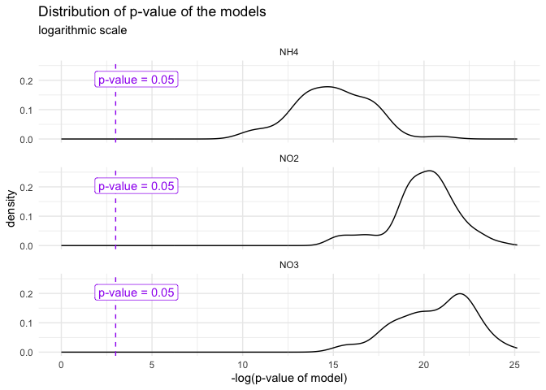

Then, same with adjusted R_squared

``` r
plot_adjR2 <- density_lm_param(
  lm_wash3, "adjR2", 0.95, facetting_std_sp = FALSE 
)

plot_adjR2
```


Now we plot all curves on same plot

``` r
#display.brewer.all(n = 6, type = "qual")
colors <- brewer.pal(n = 6, name = "Accent")[c(1,2,3,5)]
#"#7FC97F" "#BEAED4" "#FDC086" "#386CB0"

multi_curve_plot <- lm_output$std_data_clean |> 
  ggplot(aes(x = as.numeric(std_conc), y = abs_corrected, groups = plate_id, colour = dataset, fill = dataset)) +
  theme_minimal() + 
  theme(legend.position = "bottom") +
  geom_smooth(
    formula = y~x-1, method = "lm", se = TRUE, 
    alpha = 0, linetype = 1, linewidth = 0.15) +
  geom_point(alpha = 0.5) +
  scale_color_discrete(palette = colors) +
  scale_fill_discrete(palette = colors) +
  xlab("Standard Concentration [mg N-species / L]") +
  ylab("Blank-corrected absorbance") +
  labs(title = "Inter-plate variability of the Standard Curves")

multi_curve_plot +
  facet_wrap(~std_sp, scales = "free", ncol = 3)
```


``` r
multi_curve_plot +
  facet_wrap(dataset~std_sp, scales = "free", ncol = 3)
```


Now, finally, I decide that I am happy with my standard curves, so I can
move on to apply the equations on my data

## 6.4 - From absorbance to concentration

### 6.4.1 - clean up environment

To make sure that we don’t get confused on variable names and take old
versions from the QC pipeline

``` r
#rm(list = ls())
```

``` r
#lm_output <- read_rds("output/data/2_lm_output_noTDN.rds")
```

### 6.4.2 - Apply regression equation

Check that we are now left with only one curve per plate

``` r
if (
  (lm_output$std_data_clean |> group_by(plate_id) |>  n_groups()) == 
  (lm_output$std_data_clean |> group_by(unique_curve_id) |>  n_groups())
) {message("All good: there is exactly one curve per plate")} else {
  warning("Warning: there is at least one plate with several curves")
}
```

    All good: there is exactly one curve per plate

Regression equation is Abs = slope \* Concentration

Here, we

- connect regression data to sample absorbance data

- apply the regression equation to go from absorbance to concentration
  in mg N-sp per L

- convert unit to mg N per L

``` r
data_mg_N_L <- 
  # add slope + info regression (p-val and R2) to absorbance data
  reg_join_abs(
    lm_output$lm_table_clean, 
    lm_output$samples_corrected, 
    target_sp = "N") |> 
  # compute concentration from absorbance
  mutate(conc_mgNsp_L = abs_corrected / slope) |> 
  convert_molec(masses = molar_masses)

# check it out
data_mg_N_L
```

    # A tibble: 11,023 × 13
       dataset  plate_id  map      well_id abs_corrected std_sp target_sp std_unit  
       <chr>    <chr>     <chr>    <chr>           <dbl> <chr>  <chr>     <chr>     
     1 Nmint1t2 NH4_1F1   81_t1_z2 A2           0.007    NH4    N         mg NH4+ L…
     2 Nmint1t2 NH4_1F2_1 97_t1_z1 A2           0.00350  NH4    N         mg NH4+ L…
     3 Nmint1t2 NH4_1F3   89_t1_z3 A2           0.00288  NH4    N         mg NH4+ L…
     4 Nmint1t2 NH4_1F4   81_t1_z1 A2           0.00725  NH4    N         mg NH4+ L…
     5 Nmint1t2 NH4_1F5   Std_3_t1 A2           0.0229   NH4    N         mg NH4+ L…
     6 Nmint1t2 NH4_1G1   1_t1     A2           0.00100  NH4    N         mg NH4+ L…
     7 Nmint1t2 NH4_1G2   17_t1    A2           0.000875 NH4    N         mg NH4+ L…
     8 Nmint1t2 NH4_1G3   33_t1    A2           0.00288  NH4    N         mg NH4+ L…
     9 Nmint1t2 NH4_1G4   49_t1    A2           0.000125 NH4    N         mg NH4+ L…
    10 Nmint1t2 NH4_1G5   65_t1    A2           0.00175  NH4    N         mg NH4+ L…
    # ℹ 11,013 more rows
    # ℹ 5 more variables: slope <dbl>, adj_r_squared <dbl>, lm_p <dbl>,
    #   conc_mgNsp_L <dbl>, conc_mgN_L <dbl>

## 6.5 - Export noTDN

``` r
data_mg_N_L |> write_rds("output/data/1_mgNL_noTDN.rds")
```

# 7 - TDN data, polynomial model

Correct format of Date

``` r
raw_meta_TDN <- raw_meta_TDN |> 
  mutate(date = as.Date(date, tryFormats = c("%d/%m/%Y")))
```

## 7.1 - Suspicious wells removal

### 7.1.1 - Manual records

This section allows the removal of wells that “we know” are failed wells
(e.g., something went wrong during pipetting…).

For now, there are no such wells for the TDN dataset

To keep consistent with object names, we create a new tidy table

``` r
raw_abs_tidy <- raw_meta_TDN
```

### 7.1.2 - Suspicious absorbance values (automated)

Observe values for absorbance (iteratively)

``` r
suspicious_wells <- raw_abs_tidy |> 
  qc_raw_abs(
    min_abs = 0.03, max_abs = 4, 
    plot_col_facet = "std_sp", 
    show_plot = TRUE) 
```

    Warning in qc_raw_abs(raw_abs_tidy, min_abs = 0.03, max_abs = 4, plot_col_facet = "std_sp", : 3 wells out of 5428 are out of range for absorbance, i.e., not in the set boundaries of [0.03; 4]. 
    See table to identify suspicious wells. 

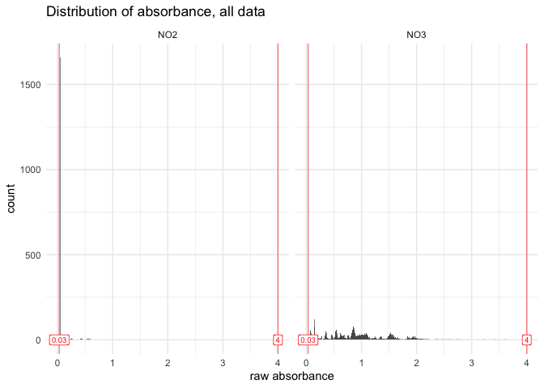

``` r
suspicious_wells |> slice_max(abs, n = 10)
```

    # A tibble: 3 × 5
      dataset plate_id   well_id map               abs  
      <chr>   <chr>      <chr>   <chr>             <chr>
    1 TDN     NO2_TDN_19 H6      Ur_K2SO4_200_C.1x 0    
    2 TDN     NO2_TDN_19 H7      Ur_K2SO4_200_F.1x 0    
    3 TDN     NO2_TDN_19 H9      Ur_K2SO4_5_C.1x   0    

For now, I decide to remove those wells as they were just meant for
testing anyway. To be reviewed

``` r
raw_abs_ok <- raw_abs_tidy |> remove_wells(suspicious_wells)
#raw_abs_ok|> filter(plate_id == string, map == "Std")
```

Check the QC once more

``` r
raw_abs_ok |> 
  qc_raw_abs(min_abs = 0.03, max_abs = 3, 
    plot_col_facet = "std_sp", 
    export_plot = "none") 
```

    Warning in qc_raw_abs(raw_abs_ok, min_abs = 0.03, max_abs = 3, plot_col_facet = "std_sp", : 13 wells out of 5425 are out of range for absorbance, i.e., not in the set boundaries of [0.03; 3]. 
    See table to identify suspicious wells. 

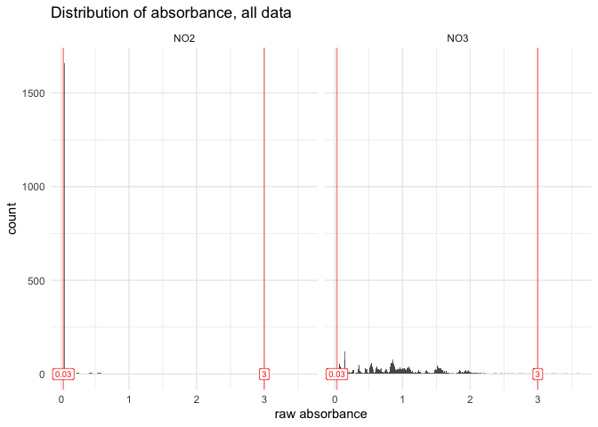

    # A tibble: 13 × 5
       dataset plate_id   well_id map   abs  
       <chr>   <chr>      <chr>   <chr> <chr>
     1 TDN     NO3_TDN_17 H1      Std   3.607
     2 TDN     NO3_TDN_18 H1      Std   3.416
     3 TDN     NO3_TDN_19 H1      Std   3.61 
     4 TDN     NO3_TDN_20 H1      Std   3.581
     5 TDN     NO3_TDN_21 H1      Std   3.398
     6 TDN     NO3_TDN_22 H1      Std   3.213
     7 TDN     NO3_TDN_23 H1      Std   3.362
     8 TDN     NO3_TDN_24 H1      Std   3.296
     9 TDN     NO3_TDN_25 H1      Std   3.244
    10 TDN     NO3_TDN_26 H1      Std   3.253
    11 TDN     NO3_TDN_27 H1      Std   3.222
    12 TDN     NO3_TDN_28 H1      Std   3.437
    13 TDN     NO3_TDN_29 H1      Std   3.126

``` r
# Once validated, store last version in a "validated" data
raw_abs_clean <- raw_abs_ok
```

It appears that only the most concentrated wells in the standard curve
for TDN (well H1) show absorbance levels above 3. We can later look at
those curves and see whether those points are outside of the linear
range. Not to worry now, though

## 7.2 - Correction for blank

### 7.2.1 - Standard curve

Obtain curve concentrations from metadata

``` r
curve_concentration <- extract_curve(all_plate_metadata_keep |> filter(dataset == "TDN"))
```

Extract Std wells, add unique curve ID, then add curve_concentration

``` r
(std_data <- raw_abs_clean |> 
  extract_std_data() |> 
  select(!std_conc) |> 
  left_join(curve_concentration, by = join_by(row, dataset, plate_id)))
```

    # A tibble: 472 × 14
    # Groups:   dataset, plate_id [59]
       row   column well_id unique_well_id dataset plate_id   unique_curve_id abs  
       <chr> <chr>  <chr>   <chr>          <chr>   <chr>      <chr>           <chr>
     1 A     1      A1      A1_NO3_TDN_01  TDN     NO3_TDN_01 NO3_TDN_01_col1 0.095
     2 A     1      A1      A1_NO3_TDN_02  TDN     NO3_TDN_02 NO3_TDN_02_col1 0.097
     3 A     1      A1      A1_NO3_TDN_03  TDN     NO3_TDN_03 NO3_TDN_03_col1 0.113
     4 A     1      A1      A1_NO3_TDN_04  TDN     NO3_TDN_04 NO3_TDN_04_col1 0.114
     5 A     1      A1      A1_NO3_TDN_05  TDN     NO3_TDN_05 NO3_TDN_05_col1 0.132
     6 A     1      A1      A1_NO3_TDN_06  TDN     NO3_TDN_06 NO3_TDN_06_col1 0.12 
     7 A     1      A1      A1_NO3_TDN_07  TDN     NO3_TDN_07 NO3_TDN_07_col1 0.095
     8 A     1      A1      A1_NO3_TDN_08  TDN     NO3_TDN_08 NO3_TDN_08_col1 0.09 
     9 A     1      A1      A1_NO3_TDN_09  TDN     NO3_TDN_09 NO3_TDN_09_col1 0.14 
    10 A     1      A1      A1_NO3_TDN_10  TDN     NO3_TDN_10 NO3_TDN_10_col1 0.143
    # ℹ 462 more rows
    # ℹ 6 more variables: map <chr>, std_sp <chr>, std_unit <chr>,
    #   sample_dilution <chr>, date <date>, std_conc <dbl>

In this case, there is little interest in checking untrusted blanks,
because we only had one std curve per plate, meaning we cannot compute
an average anyway.

Still, we can have a look at it (if some values in A-row are higher than
B-row, it’s a warning sign, and another correction may need to be
thought through, e.g., compute the intercept of the curve)

Check unstrusted blanks (where the smallest value for a given curve is
not in row A (top_down pipetting)

``` r
std_blank <- raw_abs_clean |> extract_std_blank()
std_blank$untrusted
```

    # A tibble: 0 × 8
    # Groups:   dataset, plate_id, column [0]
    # ℹ 8 variables: well_id <chr>, dataset <chr>, plate_id <chr>, column <chr>,
    #   unique_curve_id <chr>, row <chr>, unique_well_id <chr>, abs <dbl>

``` r
#std_blank$trusted
#blank$all |> filter(plate_id == "NO3_R2R3_1")
```

There are no untrusted wells, yay :-)

There is no need per se in computing the average, as there is only one
well per blank. We directly correct the data and give as “average” the
data from the single well containing absorbance of the blank of the std
curve. Because some formatting occurs in the background, we still use
the computation of the average (on a single point)

Because the logic is similar, we will first go into blank-correction of
sample data before finalizing work on the standard curves (applying
linear regression model)

### 7.2.2 - Sample wells

First, extract data for wells containing extractant and have a look at
its variation

``` r
extr_data <- extract_extractant(raw_abs_clean)
(blank_avg <- extractant_average(raw_abs_clean) |> 
  arrange(desc(blank_coeff_var_percent)))
```

    # A tibble: 59 × 6
       dataset plate_id     map   blank_avg blank_sdev blank_coeff_var_percent
       <chr>   <chr>        <chr>     <dbl>      <dbl>                   <dbl>
     1 TDN     NO3_TDN_38   extr     0.0714   0.00472                     6.61
     2 TDN     NO2_TDN_03   extr     0.0365   0.00141                     3.87
     3 TDN     NO3_TDN_07   extr     0.0921   0.00314                     3.40
     4 TDN     NO3_TDN_29   extr     0.147    0.00472                     3.22
     5 TDN     NO2_TDN_17   extr     0.0384   0.00106                     2.76
     6 TDN     NO3_TDN_36_1 extr     0.0708   0.00183                     2.59
     7 TDN     NO3_TDN_32   extr     0.133    0.00344                     2.59
     8 TDN     NO2_TDN_06   extr     0.0365   0.000926                    2.54
     9 TDN     NO3_TDN_04   extr     0.102    0.00253                     2.48
    10 TDN     NO3_TDN_25   extr     0.145    0.00329                     2.28
    # ℹ 49 more rows

``` r
plot_blank_var_distrib(blank_avg)
```

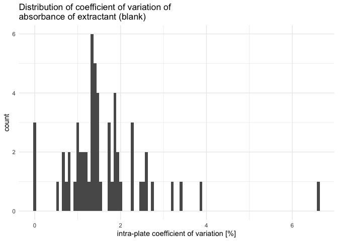

We see that one plate has a high coefficient of variation, we will have
to look at it individually. Let’s set the threshold for the coefficient
of variation at 5% (default)

``` r
threshold <- 5

suspicious_plates <- raw_abs_clean |> 
  qc_raw_extr(suppress_warning = TRUE, max_coeff = threshold)

suspicious_extr <- suspicious_extr(
  raw_abs_clean, suspicious_extr_per_plate = suspicious_plates, max_coeff = threshold)
```

    Joining with `by = join_by(plate_id, map)`

``` r
# check it out
suspicious_extr
```

    # A tibble: 8 × 13
      row   column well_id unique_well_id dataset plate_id     abs map   std_sp
      <chr> <chr>  <chr>   <chr>          <chr>   <chr>      <dbl> <chr> <chr> 
    1 A     8      A8      A8_NO3_TDN_38  TDN     NO3_TDN_38 0.07  extr  NO3   
    2 B     8      B8      B8_NO3_TDN_38  TDN     NO3_TDN_38 0.07  extr  NO3   
    3 C     8      C8      C8_NO3_TDN_38  TDN     NO3_TDN_38 0.069 extr  NO3   
    4 D     8      D8      D8_NO3_TDN_38  TDN     NO3_TDN_38 0.07  extr  NO3   
    5 E     8      E8      E8_NO3_TDN_38  TDN     NO3_TDN_38 0.083 extr  NO3   
    6 F     8      F8      F8_NO3_TDN_38  TDN     NO3_TDN_38 0.07  extr  NO3   
    7 G     8      G8      G8_NO3_TDN_38  TDN     NO3_TDN_38 0.069 extr  NO3   
    8 H     8      H8      H8_NO3_TDN_38  TDN     NO3_TDN_38 0.07  extr  NO3   
    # ℹ 4 more variables: std_conc <chr>, std_unit <chr>, sample_dilution <chr>,
    #   date <date>

``` r
# plot outliers
suspicious_extr |> boxplot_outlier_extr(max_coeff = threshold)
```

    Joining with `by = join_by(plate_id)`

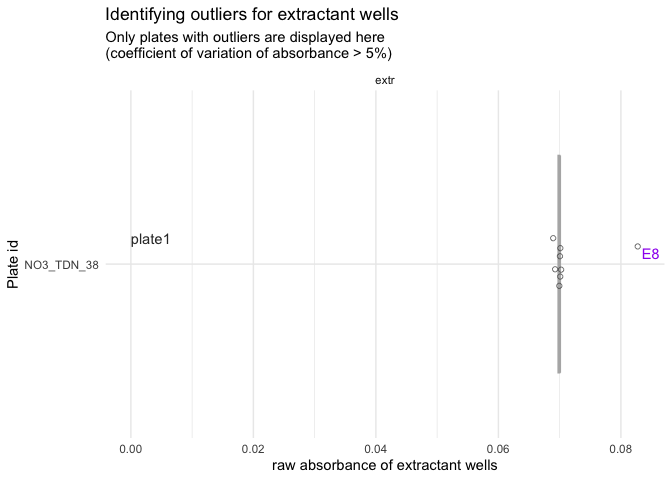

We have 1 plate that has one obvious outlier well. We will need to
remove it manually.

First, we create a small tibble that will serve to construct the tibble
of wells to remove

``` r
plate_ids <- suspicious_extr |> 
  ungroup() |> 
  select(dataset, plate_id) |> unique() 
plate_ids <- plate_ids |> # save numbers for plate order in the plot
  mutate(plate_order = seq(1, nrow(plate_ids)))
```

Then, we create a vector with wells to remove (going through boxplots
from top to bottom).

> [!TIP]
>
> ### Manually remove outliers
>
> > [!TIP]
> >
> > In the following chunk, you need to manually decide which wells to
> > remove, based on the boxplots produced above.
> >
> > - Make sure to deal appropriately with plates that require 2
> >   outliers or no outlier to be removed (see example below)

``` r
#** !!! MANUAL INPUT !!! *

# Which plate needs 2 outliers removed?
plate_with_2_outliers <- 3
plate_without_outliers <- 9 # use a number > nb of plates if there is no such plate

# Which wells are outliers? 
well_ids <- c("E8") # use NA for plates without outliers
```

Then we finish constructing the tibble of wells to be removed

``` r
#nb_plates <- plate_ids |> nrow()

to_remove <- plate_ids |> 
  bind_rows(plate_ids |> filter(plate_order == plate_with_2_outliers)) |> 
  arrange(plate_order) |> 
  mutate(well_id = well_ids) |> 
  filter(plate_order != plate_without_outliers) |> #remove plate without outliers
  select(!plate_order)
```

Checking that we didn’t get confused: look at `to_remove` in parallel to
the boxplot

``` r
to_remove
```

    # A tibble: 1 × 3
      dataset plate_id   well_id
      <chr>   <chr>      <chr>  
    1 TDN     NO3_TDN_38 E8     

Looks good, so we remove it from extractant data and recompute the
average

``` r
extr_data_clean <- extr_data |> 
  remove_wells(to_remove) 

blank_avg_clean <- extractant_average(extractant_data = extr_data_clean) 
```

Check that biggest coeff_var indeed below threshold

``` r
blank_avg_clean |> arrange(desc(blank_coeff_var_percent)) |> head()
```

    # A tibble: 6 × 6
      dataset plate_id     map   blank_avg blank_sdev blank_coeff_var_percent
      <chr>   <chr>        <chr>     <dbl>      <dbl>                   <dbl>
    1 TDN     NO2_TDN_03   extr     0.0365    0.00141                    3.87
    2 TDN     NO3_TDN_07   extr     0.0921    0.00314                    3.40
    3 TDN     NO3_TDN_29   extr     0.147     0.00472                    3.22
    4 TDN     NO2_TDN_17   extr     0.0384    0.00106                    2.76
    5 TDN     NO3_TDN_36_1 extr     0.0708    0.00183                    2.59
    6 TDN     NO3_TDN_32   extr     0.133     0.00344                    2.59

Now that we are confident in the per-plate average value of raw
absorbance of extractant wells, we can finally blank-correct all sample
data

### 7.2.3 - All corrected data

Let’s just recall all corrected data. We have 2 separate tibbles
(because the experimental design was arranged to have separate blanks
for the curve and the samples)

``` r
# Standard curve, blank-corrected and clean
std_corrected 
```

    # A tibble: 413 × 21
       row   column well_id unique_well_id dataset n_sp  TDN      nb bla   plate_id 
       <chr> <chr>  <chr>   <chr>          <chr>   <chr> <chr> <int> <chr> <chr>    
     1 B     1      B1      B1_NO3_TDN_01  TDN     NO3   TDN       1 <NA>  NO3_TDN_…
     2 B     1      B1      B1_NO3_TDN_02  TDN     NO3   TDN       2 <NA>  NO3_TDN_…
     3 B     1      B1      B1_NO3_TDN_03  TDN     NO3   TDN       3 <NA>  NO3_TDN_…
     4 B     1      B1      B1_NO3_TDN_04  TDN     NO3   TDN       4 <NA>  NO3_TDN_…
     5 B     1      B1      B1_NO3_TDN_05  TDN     NO3   TDN       5 <NA>  NO3_TDN_…
     6 B     1      B1      B1_NO3_TDN_06  TDN     NO3   TDN       6 <NA>  NO3_TDN_…
     7 B     1      B1      B1_NO3_TDN_07  TDN     NO3   TDN       7 <NA>  NO3_TDN_…
     8 B     1      B1      B1_NO3_TDN_08  TDN     NO3   TDN       8 <NA>  NO3_TDN_…
     9 B     1      B1      B1_NO3_TDN_09  TDN     NO3   TDN       9 <NA>  NO3_TDN_…
    10 B     1      B1      B1_NO3_TDN_10  TDN     NO3   TDN      10 <NA>  NO3_TDN_…
    # ℹ 403 more rows
    # ℹ 11 more variables: unique_curve_id <chr>, map <chr>, abs_corrected <dbl>,
    #   std_sp <chr>, std_unit <chr>, sample_dilution <chr>, date <date>,
    #   std_conc <dbl>, extr_id <chr>, blank_sdev <dbl>,
    #   blank_coeff_var_percent <dbl>

``` r
# Samples, blank-corrected and clean
samples_corrected 
```

    # A tibble: 4,485 × 16
       row   column well_id unique_well_id dataset plate_id   map      abs_corrected
       <chr> <chr>  <chr>   <chr>          <chr>   <chr>      <chr>            <dbl>
     1 A     2      A2      A2_NO3_TDN_01  TDN     NO3_TDN_01 102_t2_…         0.459
     2 A     2      A2      A2_NO3_TDN_02  TDN     NO3_TDN_02 92_t2_z…         0.471
     3 A     2      A2      A2_NO3_TDN_03  TDN     NO3_TDN_03 90_t2_z…         0.434
     4 A     2      A2      A2_NO3_TDN_04  TDN     NO3_TDN_04 90_t2_z…         0.433
     5 A     2      A2      A2_NO3_TDN_05  TDN     NO3_TDN_05 99_t2_z…         0.460
     6 A     2      A2      A2_NO3_TDN_06  TDN     NO3_TDN_06 81_t2_z…         0.438
     7 A     2      A2      A2_NO3_TDN_07  TDN     NO3_TDN_07 83_t2_z…         0.380
     8 A     2      A2      A2_NO3_TDN_08  TDN     NO3_TDN_08 81_t2_z…         0.375
     9 A     2      A2      A2_NO3_TDN_09  TDN     NO3_TDN_09 102_t2_…         0.759
    10 A     2      A2      A2_NO3_TDN_10  TDN     NO3_TDN_10 92_t2_z…         0.694
    # ℹ 4,475 more rows
    # ℹ 8 more variables: std_sp <chr>, std_conc <chr>, std_unit <chr>,
    #   sample_dilution <chr>, date <date>, extr_id <chr>, blank_sdev <dbl>,
    #   blank_coeff_var_percent <dbl>

## 7.3 - Compute regression equation (per plate)

> [!TIP]
>
> ### Polynomial model for high concentrations
>
> For the TDN data set, standard curve concentrations have been
> increased ten-fold. This resulted in highly concentrated solutions
> generating absorbance values above 3.
>
> - To be seen if we can remove the H row, but still, G rows are pretty
>   high as well
>
> - It appears that a polynomial model is more appropriated in this
>   case, as can be seen in the the next chunks (example of a single
>   curve)

``` r
# take data for a single curve and format it for the plotting
curve <- (std_corrected |> 
            group_by(plate_id, column) |> 
            filter(std_sp == "NO3") |> 
            rename(abs = abs_corrected) |> 
            group_split()
          )[[9]]

# check it out
curve
```

    # A tibble: 7 × 21
      row   column well_id unique_well_id dataset n_sp  TDN      nb bla   plate_id  
      <chr> <chr>  <chr>   <chr>          <chr>   <chr> <chr> <int> <chr> <chr>     
    1 B     1      B1      B1_NO3_TDN_09  TDN     NO3   TDN       9 <NA>  NO3_TDN_09
    2 C     1      C1      C1_NO3_TDN_09  TDN     NO3   TDN       9 <NA>  NO3_TDN_09
    3 D     1      D1      D1_NO3_TDN_09  TDN     NO3   TDN       9 <NA>  NO3_TDN_09
    4 E     1      E1      E1_NO3_TDN_09  TDN     NO3   TDN       9 <NA>  NO3_TDN_09
    5 F     1      F1      F1_NO3_TDN_09  TDN     NO3   TDN       9 <NA>  NO3_TDN_09
    6 G     1      G1      G1_NO3_TDN_09  TDN     NO3   TDN       9 <NA>  NO3_TDN_09
    7 H     1      H1      H1_NO3_TDN_09  TDN     NO3   TDN       9 <NA>  NO3_TDN_09
    # ℹ 11 more variables: unique_curve_id <chr>, map <chr>, abs <dbl>,
    #   std_sp <chr>, std_unit <chr>, sample_dilution <chr>, date <date>,
    #   std_conc <dbl>, extr_id <chr>, blank_sdev <dbl>,
    #   blank_coeff_var_percent <dbl>

``` r
# compute both models
lm_linear <- lm(abs ~ 0 + std_conc, data = curve)
lm_poly <- lm(abs ~ 0 + std_conc + I(std_conc^2), data = curve)

(sum_linear <- summary(lm_linear))
```


    Call:
    lm(formula = abs ~ 0 + std_conc, data = curve)

    Residuals:
         Min       1Q   Median       3Q      Max 
    -0.18370  0.04129  0.10244  0.13621  0.20977 

    Coefficients:
              Estimate Std. Error t value Pr(>|t|)    
    std_conc 0.0124279  0.0004877   25.48 2.41e-07 ***
    ---
    Signif. codes:  0 '***' 0.001 '**' 0.01 '*' 0.05 '.' 0.1 ' ' 1

    Residual standard error: 0.1477 on 6 degrees of freedom
    Multiple R-squared:  0.9908,    Adjusted R-squared:  0.9893 
    F-statistic: 649.5 on 1 and 6 DF,  p-value: 2.405e-07

``` r
(sum_poly <- summary(lm_poly))
```


    Call:
    lm(formula = abs ~ 0 + std_conc + I(std_conc^2), data = curve)

    Residuals:
            1         2         3         4         5         6         7 
    -0.003064  0.023935  0.025124  0.021264  0.002595 -0.028541  0.011591 

    Coefficients:
                    Estimate Std. Error t value Pr(>|t|)    
    std_conc       1.672e-02  2.846e-04   58.75 2.70e-08 ***
    I(std_conc^2) -2.127e-05  1.360e-06  -15.64 1.94e-05 ***
    ---
    Signif. codes:  0 '***' 0.001 '**' 0.01 '*' 0.05 '.' 0.1 ' ' 1

    Residual standard error: 0.0229 on 5 degrees of freedom
    Multiple R-squared:  0.9998,    Adjusted R-squared:  0.9997 
    F-statistic: 1.363e+04 on 2 and 5 DF,  p-value: 4.551e-10

Seeing the summary of both models: both are significant, but the p-value
of the coefficient for the second degree term (b in bx^2) in the
polynomial model is \<0.05, which indicates that that term significantly
contributes to the model. This becomes also very obvious when we look at
the plots (the polynomial model fits a lot better)

``` r
p_linear <- plot_std(curve, through_origin = TRUE, model = "linear") + 
  theme(legend.position = "none") + labs(title = "Linear model")
p_poly <- plot_std(curve, through_origin = TRUE, model = "poly") + 
  theme(legend.position = "none") + labs(title = "Polynomial model")

p_linear + p_poly
```


Let’s look at the Residual plot to confirm this intuition

``` r
res_linear <- residuals(sum_linear)
res_poly <- residuals(sum_poly)

# plot residuals for linear model
plot(curve$std_conc, res_linear, main = "Residuals Analysis", xlab = "Concentration", ylab = "Residuals", col = "grey30", pch = 16)
# add red line at y = 0
abline(h = 0, col = "red", lty = 2)
# add residuals for polynomial model
points(curve$std_conc, res_poly,  col = "magenta", pch = 15)
# add legend
points(0, y = -0.1, col = "grey30", pch = 16)
text(x = 6, y = -0.1, labels = "linear\nmodel", col = "grey30", adj = 0)
points(0, y = -0.15, col = "magenta", pch = 15)
text(x = 6, y = -0.15, labels = "polynomial\nmodel", col = "magenta", adj = 0)
```

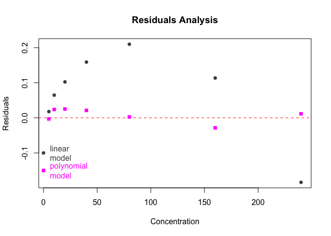

So, we will adopt the polynomial model for the TDN dataset

### 7.3.1 - QC standard curves - round 1

First, we perform a polynomial model on each NO3 curve individually

(! not sure that NO2 is very relevant, but for NO2, linear model is
fine)

``` r
# Select NO3 & group
grouped_data_NO3 <- std_corrected |> 
  group_by(unique_curve_id) |> 
  filter(std_sp == "NO3")

grouped_data_NO2 <- std_corrected |> 
  group_by(unique_curve_id) |> 
  filter(std_sp == "NO2")

lm_NO3_raw <- lm_std_curve(grouped_data_NO3, model = "poly") 
lm_NO2_raw <- lm_std_curve(grouped_data_NO2, model = "linear")
```

Then we take a subset to examine individually: those curves where the
linear model doesn’t seem to perform ideally (e.g., non-significant
model (p-value \> 0.05), residuals not normally distributed, or
heteroscedasticity, or, for polynomial model, p-value of one of the
coefficients \> 0.05)

``` r
# extract all plates where "something" is not perfect 
lm_suspicious_NO3 <- lm_NO3_raw |> suspicious_lm(model = "poly")
lm_suspicious_NO2 <- lm_NO2_raw |> 
  suspicious_lm()

nrow(lm_suspicious_NO3) ; nrow(lm_suspicious_NO2)
```

    [1] 7

    [1] 0

There are 7 suspicious curves for NO3 and none for NO2. So we just
accept NO2 curves without check. Just a quick look at \`lm_NO2_raw”

``` r
lm_NO2_raw
```

    # A tibble: 20 × 12
       dataset plate_id     unique_curve_id   std_sp slope r_squared adj_r_squared
       <chr>   <chr>        <chr>             <chr>  <dbl>     <dbl>         <dbl>
     1 TDN     NO2_TDN_01   NO2_TDN_01_col1   NO2    0.259     1.000         1.000
     2 TDN     NO2_TDN_02   NO2_TDN_02_col1   NO2    0.259     1.000         1.000
     3 TDN     NO2_TDN_03   NO2_TDN_03_col1   NO2    0.263     1.000         1.000
     4 TDN     NO2_TDN_04   NO2_TDN_04_col1   NO2    0.262     1.000         1.000
     5 TDN     NO2_TDN_05   NO2_TDN_05_col1   NO2    0.271     1.000         1.000
     6 TDN     NO2_TDN_06   NO2_TDN_06_col1   NO2    0.273     1.000         1.000
     7 TDN     NO2_TDN_07   NO2_TDN_07_col1   NO2    0.258     1.000         1.000
     8 TDN     NO2_TDN_08   NO2_TDN_08_col1   NO2    0.258     1.000         1.000
     9 TDN     NO2_TDN_09   NO2_TDN_09_col1   NO2    0.255     1             1.000
    10 TDN     NO2_TDN_10   NO2_TDN_10_col1   NO2    0.259     1.000         1.000
    11 TDN     NO2_TDN_11   NO2_TDN_11_col1   NO2    0.277     1.000         1.000
    12 TDN     NO2_TDN_12   NO2_TDN_12_col1   NO2    0.276     1.000         1.000
    13 TDN     NO2_TDN_13   NO2_TDN_13_col1   NO2    0.264     1.000         1.000
    14 TDN     NO2_TDN_14   NO2_TDN_14_col1   NO2    0.268     1.000         1.000
    15 TDN     NO2_TDN_15   NO2_TDN_15_col1   NO2    0.266     1.000         1.000
    16 TDN     NO2_TDN_16   NO2_TDN_16_col1   NO2    0.268     1.000         1.000
    17 TDN     NO2_TDN_17   NO2_TDN_17_col1   NO2    0.246     1.000         1.000
    18 TDN     NO2_TDN_18_1 NO2_TDN_18_1_col1 NO2    0.246     1.000         1.000
    19 TDN     NO2_TDN_18_2 NO2_TDN_18_2_col1 NO2    0.246     1.000         1.000
    20 TDN     NO2_TDN_19   NO2_TDN_19_col1   NO2    0.247     1.000         1.000
    # ℹ 5 more variables: lm_p <dbl>, normality_lm_residuals <chr>,
    #   shapiro_p <dbl>, homoscedasticity_lm_residuals <chr>, breusch_pagan_p <dbl>

For NO3, we go on with the QC of the 7 suspicious curves. For visual
support, we create a list of plots where we store each individual plot
of “suspicious” standard curves

``` r
suspicious_plots_NO3 <- plot_list_lm(
  lm_suspicious_NO3, 
  std_data = std_corrected, 
  model = "poly")

# check one plot out
#suspicious_plots_NO3[[1]]
```

Now we can look at each plot individually.

``` r
patchwork::wrap_plots(suspicious_plots_NO3, axis_titles = "keep") +
     patchwork::plot_annotation(title = "Plots of suspicious Standard curves")
```

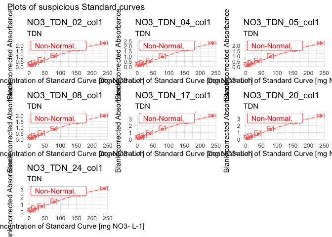

I’m not quite sure that I can or should remove wells here. Indeed, with
only 7 points, assessing normality is overstretching. It is probably
best to rely on observation?

I decide to keep all points for all curves in this dataset.

But I do want to look at the curves from the last plates (those I did
where the concentration was wrong)

``` r
plot_Mo_curves <- plot_list_lm(
  lm_data = lm_NO3_raw |> tail(n = 7), std_data = std_corrected, model = "poly"
)

patchwork::wrap_plots(plot_Mo_curves, axis_titles = "keep") +
     patchwork::plot_annotation(title = "Plots of suspicious Standard curves")
```

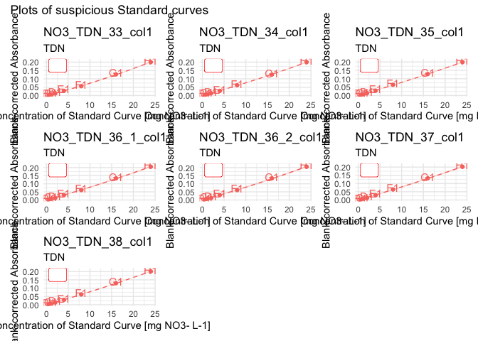

Interestingly, the models are all good, but we are in an upward-facing
parabole (which would change the computation of the solution (looking
for x based on y –\> take higher value: also the only one that is \> 0)

Still, extrapolation well past those concentrations seem unlikely. Let’s
see the overplotting later, but probably we have to ignore those plates

### 7.3.2 - Multiple curve QC

First, let’s look at the distribution of p-values and adjusted R^2 of
the std curve regressions

``` r
NO3_p <- density_lm_param(
  lm_NO3_raw, 
  p_or_r = "p", threshold = 0.05, 
  facetting_std_sp = TRUE, color_std_sp = FALSE)

NO3_adjR2 <- density_lm_param(
  lm_NO3_raw, "adjR2", 0.95, color_std_sp = FALSE 
)

NO2_p <- density_lm_param(
  lm_NO2_raw, 
  p_or_r = "p", threshold = 0.05, 
  facetting_std_sp = TRUE, color_std_sp = FALSE)

NO2_adjR2 <- density_lm_param(
  lm_NO2_raw, "adjR2", 0.95, color_std_sp = FALSE 
)
  

(NO3_p + NO2_p) / (NO3_adjR2 + NO2_adjR2)
```

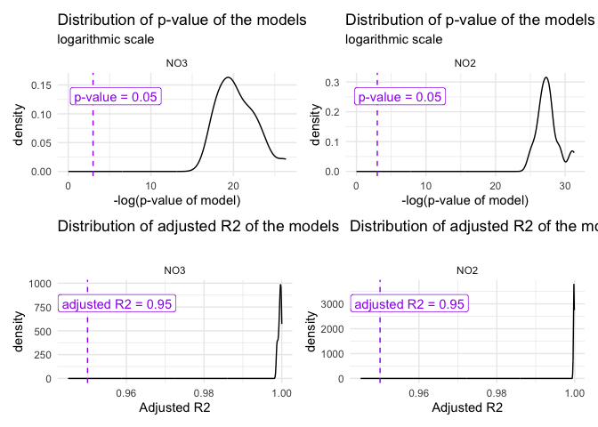

Now we plot all curves on same plot. I removed “my plates” bc there were
polluting the plot. Anyway, we will get rid of those data points!

``` r
colors <- c("#7FC97F", "#BEAED4", "#FDC086")

std_Sang <- std_corrected |> 
  # take only NO3 (bc polanomial model
  filter(std_sp == "NO3")  |> 
  filter_out(nb >32) 
  

annotation <- std_Sang |> 
  select(plate_id, nb, abs_corrected, std_conc, date) |> 
  slice_max(std_conc, with_ties = TRUE)

# plot
std_Sang |> 
  ggplot(aes(
    x = as.numeric(std_conc), 
    y = abs_corrected, groups = plate_id, 
    colour = date, fill = date)) +
  theme_minimal() + 
  theme(legend.position = "right") +
  geom_smooth(
    formula = y ~ 0 + x + I(x^2), method = "lm", se = TRUE, 
    alpha = 0, linetype = 1, linewidth = 0.15) +
  geom_point(alpha = 0.5) +
 # facet_wrap(~std_sp, scales = "free") +
#  scale_color_discrete(palette = colors[1:2]) +
 # scale_fill_discrete(palette = colors[1:2]) +
  xlab("Standard Concentration [mg N-species / L]") +
  ylab("Blank-corrected absorbance") +
  labs(title = "Inter-plate variability of the Standard Curves") +
  xlim(c(0, 300)) +
  annotate(
    geom = "text",
    x = annotation$std_conc*1.01, 
    y = annotation$abs_corrected, 
    label = annotation$date, size = 2,
    hjust = 0,
    color = annotation$date
  ) 
```


There is some batch effect, which can be due to several things:

- An error in the dilution of the stock solution cannot be excluded,
  though this alone would result in

  - clear, non-overlapping groups of curves done on the same day
    (dilution only done 1x per day)

  - no particular gradient based on date (random error in pipetting –\>
    random pattern)

- The gradient in date can only be explained by a gradient in reaction
  conditions which should act the same way on samples and standard
  curves, such as:

  - temperature

  - degradation of reagents (bulk preparation)

- The within day noise is possibly due also to slight changes in
  conditions

  - incubation time slightly different

  - delay since dilution and reagent preparation

    - is there some altering of the solution once it is thawed?

    - How long since the Grieß reagent has been mixed?

    - Degradation of VCl3?

    - etc.

For now I don’t see reasons to worry about those curves, we can proceed
to apply the regression equations

### 7.3.3 - Confirm data and export

Let’s store all necessary data into a clean variable name to reduce
possible confusion, and let’s compute all the plots in a big list, for
storage purposes. We then export this as one output data in a single
list

Now, we save this into an rds file, clean up the environment and
re-import the clean data, so no mistake is possible

``` r
lm_output |> write_rds("output/data/1_lm_output_TDN.rds")

#rm(list = ls())
#lm_output <- read_rds("output/data/1_lm_output_TDN.rds")
```

## 7.4 - From absorbance to concentration

### 7.4.1 - Theoretical considerations - polynomial model

Regression equation is
`Abs = poly_a * Concentration^2 + poly_b * Concentration`. There is no
additional term because we constrained the model to be fitted through
the origin. This equation can be transformed into
`poly_a * Concentration^2 + poly_b * Concentration - Abs = 0`.

The function `polyroot()` computes the roots to a second (or higher)
degree equation of the form `ax^2 + bx + c`. It takes as argument a
vector `z` of the type `z = c(c, b, a)`. Its output is a vector with the
roots of the equation expressed as a complex number. To extract the real
component, we use the function `Re()`.

A second degree equation, by definition, accepts 2 solutions for most
values of y and its shape is a parable. If a is negative, it is an
downward-facing parable (see plotting above). In the case of our model,
we already know that the smallest of the 2 solutions for x will be the
one we are looking for, for several reasons:

- we constrained the curve to go through the origin,

- all our points will be in the ascending part of the curve (before its
  maximum)

- So that if we draw a horizontal line at any absorbance value, its
  first intersection with the parable (smallest of x1, x2) will be the
  one within the range of our standard curves (the second one would be
  in the other half, descending part of the parable)

!!! This applies because we have a downward facing parable. We are
anyway in an ascending part. Should the parable, in another dataset,
have an upward-facing shape (e.g., very small concentrations), then the
reasoning is reverse: we would be in the right-hand half of the parable,
thus the highest solution from x1 and x2.

### 7.4.2 - Application of the model

Polyroot is difficult to apply rowwise for now… Until I find a more
elegant way, let’s just input the standard definition of the solution to
a second degree equation for the polynomial model:

`x = (-b +- sqrt(b^2 - 4*ac)) / (2*a)`, with c = -y

Here, we

- connect regression data to sample absorbance data

- apply the regression equation to go from absorbance to concentration
  in mg N-sp per L

- convert unit to mg N per L

``` r
# For NO3
data_NO3 <- lm_output$lm_NO3_clean |> 
  filter(std_sp == "NO3") |> 
  reg_join_abs(
    lm_output$samples_corrected |> filter(std_sp == "NO3"), 
    target_sp = "N") 

data_NO2 <- lm_output$lm_NO2_clean |> 
  filter(std_sp == "NO2") |> 
  reg_join_abs(
    lm_output$samples_corrected |> filter(std_sp == "NO2"), 
    target_sp = "N") 

#data_all <- 

data_mg_N_L <- full_join(data_NO3, data_NO2) |> 
  rowwise() |> 
  mutate(
    conc_mgNsp_L = case_when(
      std_sp == "NO2" ~ (abs_corrected / slope),
      std_sp == "NO3" ~ min(c(
        (-poly_b + sqrt(poly_b^2 - 4*poly_a*(-abs_corrected))) / (2*poly_a),
        (-poly_b - sqrt(poly_b^2 - 4*poly_a*(-abs_corrected))) / (2*poly_a)
      ))
    )
  ) |> 
  convert_molec(masses = molar_masses)
```

    Joining with `by = join_by(dataset, plate_id, map, well_id, abs_corrected,
    std_sp, target_sp, std_unit, adj_r_squared, lm_p)`

``` r
# Check it out
data_mg_N_L
```

    # A tibble: 4,485 × 18
    # Rowwise: 
       dataset plate_id   map        well_id abs_corrected std_sp target_sp std_unit
       <chr>   <chr>      <chr>      <chr>           <dbl> <chr>  <chr>     <chr>   
     1 TDN     NO3_TDN_01 102_t2_z1… A2              0.459 NO3    N         mg NO3-…
     2 TDN     NO3_TDN_02 92_t2_z2_… A2              0.471 NO3    N         mg NO3-…
     3 TDN     NO3_TDN_03 90_t2_z3_… A2              0.434 NO3    N         mg NO3-…
     4 TDN     NO3_TDN_04 90_t2_z1_… A2              0.433 NO3    N         mg NO3-…
     5 TDN     NO3_TDN_05 99_t2_z2_… A2              0.460 NO3    N         mg NO3-…
     6 TDN     NO3_TDN_06 81_t2_z2_… A2              0.438 NO3    N         mg NO3-…
     7 TDN     NO3_TDN_07 83_t2_z3_… A2              0.380 NO3    N         mg NO3-…
     8 TDN     NO3_TDN_08 81_t2_z1_… A2              0.375 NO3    N         mg NO3-…
     9 TDN     NO3_TDN_09 102_t2_z1… A2              0.759 NO3    N         mg NO3-…
    10 TDN     NO3_TDN_10 92_t2_z2_… A2              0.694 NO3    N         mg NO3-…
    # ℹ 4,475 more rows
    # ℹ 10 more variables: poly_a <dbl>, poly_a_p <dbl>, poly_b <dbl>,
    #   poly_b_p <dbl>, r_squared <dbl>, adj_r_squared <dbl>, lm_p <dbl>,
    #   slope <dbl>, conc_mgNsp_L <dbl>, conc_mgN_L <dbl>

## 7.5 - Export TDN

``` r
data_mg_N_L |> write_rds("output/data/1_mgNL_TDN.rds")
```

[^1]: TDN stands for Total Dissolved Nitrogen, i.e., NO3- is dosed after
    an oxidation of all N compounds to NO3-
