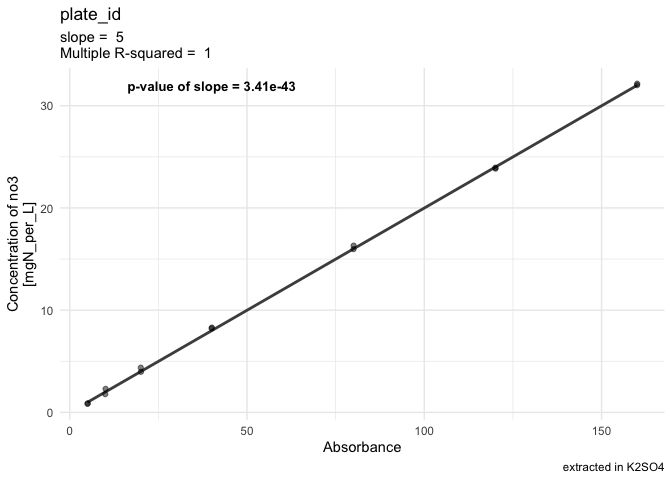

# V. Pipeline for Absorbance data


- [To Do](#to-do)
- [Algorithm in natural language](#algorithm-in-natural-language)
- [Code](#code)
  - [1 - Set up](#1---set-up)
  - [2 - Vectorize plate data](#2---vectorize-plate-data)
  - [3 - QC - warning if absorbances not in
    \[0.05,1.5\]](#3---qc---warning-if-absorbances-not-in-00515)
  - [4 - Correct absorbance values](#4---correct-absorbance-values)
    - [4.1 - Correct std curves for
      blanc](#41---correct-std-curves-for-blanc)
    - [4.2 - Correct samples for blanc](#42---correct-samples-for-blanc)
    - [4.3 - Join corrected absorbances back into data
      table](#43---join-corrected-absorbances-back-into-data-table)
- [°<sup>°°°</sup> Milestone : corrected data ready for downstream
  analysis
  °<sup>°°°</sup>](#-milestone--corrected-data-ready-for-downstream-analysis-)
  - [5 - Computing regression equation btw absorbance and
    concentration](#5---computing-regression-equation-btw-absorbance-and-concentration)
- [°<sup>°°°</sup> Milestone : all data ready for downstream analysis
  °<sup>°°°</sup>](#-milestone--all-data-ready-for-downstream-analysis-)
  - [6 - Exporting data](#6---exporting-data)

# To Do

- upstream steps = import “real” table (the code below creates a
  fictional plate to get started)
- export + downstream steps (different options based on analysis)

# Algorithm in natural language

- Plate info list:

  - plate number - element \<chr\>

  - column(s) with std curve(s) - vector \<chr\>

  - standard identity & unit - vector \<chr\> (element1 = name, element2
    = unit)

  - range of std concentration - vector \<num\>

  - column(s) with blanc - vector \<chr\>

  - blanc identity & unit of concentration - vector \<chr\> (element1 =
    name, element2 = unit)

  - concentration of blanc - element \<num\>

  - timestamp - date-time format (?)

  - wavelength in nm - element \<int\>

- vectorization of absorbance data, vectors are:

  - plate number

  - row

  - column

  - raw absorbance

  - legend (or ID)

- Correct absorbances for blanc

  - Return a warning message

    - when absorbances are below 0.05 or above 1.5

    - give the number of wells concerned,

    - give the max and min value of those wells

  - case when row concerns std curve: correct std absorbances for std
    blanc

    - find rows where concentration is zero (slice.min?)

    - take average of absorbance from those rows

    - substract to all absorbances of the std the average “zero” value
      and store it in a new column = “corrected_abs”

  - case when row concerns samples: Correct sample absorbances for blanc

    - find rows with blanc

    - compute variation coefficient

      - return a warning message when var.coeff \> 30%?

      - exclude wells based on this? Or human decision?

    - compute average of blancs

    - substract that value to all non-standard rows and store it in
      column “corrected_abs”

- Compute standard curve

  - Operation per plate

  - in plate df, filter rows corresponding to the std

  - 

# Code

## 1 - Set up

Loading packages

``` r
library(tidyverse)
```

    ── Attaching core tidyverse packages ──────────────────────── tidyverse 2.0.0 ──
    ✔ dplyr     1.1.4     ✔ readr     2.1.5
    ✔ forcats   1.0.1     ✔ stringr   1.6.0
    ✔ ggplot2   4.0.0     ✔ tibble    3.3.0
    ✔ lubridate 1.9.4     ✔ tidyr     1.3.1
    ✔ purrr     1.2.0     
    ── Conflicts ────────────────────────────────────────── tidyverse_conflicts() ──
    ✖ dplyr::filter() masks stats::filter()
    ✖ dplyr::lag()    masks stats::lag()
    ℹ Use the conflicted package (<http://conflicted.r-lib.org/>) to force all conflicts to become errors

``` r
library(roperators) # to be able to add %ni% for "not in"
```


    Attaching package: 'roperators'

    The following object is masked from 'package:tibble':

        num

    The following object is masked from 'package:ggplot2':

        %+%

Prep template data: fake tables for the sake of building the next steps
of the code. Once that code is working, then we can figure out how to
extract real plate data instead of this fake model one.

``` r
# create fake plate information, this info could be extracted from real data set, for ex each variable here becomes a column name, and we record one row per plate
plate_id <- "plate_id"
std_column <- c("1", "12")
std_id <- c("no3", "mgN_per_L", "H2O") # n species, unit, prepared in
std_conc <- c(0,1,2,4,8,16, 24, 32) # we need numerics
extractant_column <- "7"
extractant_id <- c("K2SO4", "M") # extractant, unit
extractant_conc <- 0.5 # we need numeric
timestamp <- timestamp() # see if the format of this is important
```

    ##------ Fri Mar 13 16:19:44 2026 ------##

``` r
wavelength <- "540 nm" # this is just to store info and will not be used for calculations, can be any format 
delay_min <- 30 # also just to store info, it is the incubation time of the manip (plate left under the hood before measurement). Called delay to not confuse with incubation times of PMN and PNR 


# create an empty table with NAs
matrix <- matrix(NA, nrow = 8, ncol = 12)
# give it names 1 to 12
colnames(matrix) <- as.character(c(1:12))

# turn it into a tibble and add column with letters
plate_empty <- as_tibble(matrix) |> 
  mutate(row = LETTERS[1:8], .before = 1)

# use this template to create a plate with random numbers
plate_abs <- plate_empty
for (col in 2:13) {
  plate_abs[col] = sample(1:100, 8) / 100
}

# optional step, just to test std curves: replace columns 1 and 12 by non-random numbers
plate_abs <- plate_abs |> 
  mutate(
    `1` = std_conc*5 + (sample(0:10, 8, replace = TRUE)/100)
    ,
    `12`= std_conc*5 + (sample(0:10, 8, replace = TRUE)/100)
  )

# same but create random id's for the plate map (whole columns, who cares...)
plate_map <- plate_empty
for (col in 2:13) {
  plate_map[col] = rep(str_flatten(sample(letters, 3)), 8)
}
```

## 2 - Vectorize plate data

We use pivot longer

``` r
# vectorize absorbance data
abs_longer <- plate_abs |> 
  pivot_longer(cols = `1`:`12`, names_to = "column", values_to = "abs") 

# vectorize well ids
map_longer <- plate_map |> 
  pivot_longer(cols = `1`:`12`, names_to = "column", values_to = "well_content") 
 
# join both according to info stored in "row" and in "column"
abs_data <- 
  left_join(abs_longer, map_longer, by = c("column", "row")) |> 
  # add info on plate id and well id
  mutate(
    plate_id = rep(plate_id),
    well_id = paste0(row, column),
    .before = 1) |> 
  # sort according to column
  arrange(column) 
```

## 3 - QC - warning if absorbances not in \[0.05,1.5\]

The ideal range for absorbance readings (Beer-lambert in linear range of
relationship between concentration and absorbance) is between 0.1 and 1.
But these are not super strict borders. I don’t want to send out a
warning message too soon, so we take higher values.

This chunk filters out only rows where absorbance is out of range, and
returns either a warning (when there are out-of-range values) or a happy
message (when there are none). In case of a warning, it also shares the
table with suspicious wells, so that the user can take an informed
decision.

<u>**To be thought through:**</u>

- What are options then? Remove suspicious wells (replace by NAs?) –\>
  deal with it if we are confronted with it

- another option could be, instead of returning a table, to return only
  the min and max values of absorbance and/or the number of wells that
  are out of range

- We could also visualize a histogram of absorbance with threshold
  values marked on the graph

``` r
#** Make sure empty wells contain NA, otherwise, lots of warning messages? To be tested *
#*

# initiate data frame that will contain suspicious well ids
suspicious_wells <- c() 
for (i in 1:nrow(abs_data)) {
  if (abs_data$abs[i] < 0.05 || abs_data$abs[i] > 1.5) {
    suspicious_wells <- append(suspicious_wells, abs_data$well_id[i])
    }
}

# Send a warning message
if (!is.null(suspicious_wells)) {
  warning("Some wells are out of range for absorbance, i.e., not in [0.05,1.5] \nSee table hereabove to identify suspicious wells")
  abs_data |> filter(well_id %in% suspicious_wells)
} else {
  message("°^° !! YAY !! °^° All wells are in range for absorbance")
}
```

    Warning: Some wells are out of range for absorbance, i.e., not in [0.05,1.5] 
    See table hereabove to identify suspicious wells

    # A tibble: 16 × 6
       plate_id well_id row   column    abs well_content
       <chr>    <chr>   <chr> <chr>   <dbl> <chr>       
     1 plate_id B1      B     1        5.07 yuo         
     2 plate_id C1      C     1       10.1  yuo         
     3 plate_id D1      D     1       20.1  yuo         
     4 plate_id E1      E     1       40    yuo         
     5 plate_id F1      F     1       80.1  yuo         
     6 plate_id G1      G     1      120.   yuo         
     7 plate_id H1      H     1      160.   yuo         
     8 plate_id B12     B     12       5.01 vji         
     9 plate_id C12     C     12      10.0  vji         
    10 plate_id D12     D     12      20.0  vji         
    11 plate_id E12     E     12      40.1  vji         
    12 plate_id F12     F     12      80.0  vji         
    13 plate_id G12     G     12     120.   vji         
    14 plate_id H12     H     12     160.   vji         
    15 plate_id E5      E     5        0.03 tya         
    16 plate_id G9      G     9        0.02 hld         

## 4 - Correct absorbance values

Now we correct absorbance values by subtracting blanc values from raw
values (absorbance of the light by the solution = absorbance by the
blank solution + absorbance by the substance to be quantified)

If the standard curves were prepared in water, then the blanc for the
standard curve is the absorbance of the well containing only water of
that curve. If it was prepared with the extractant, then the blanc is
the mean of the values of the wells where the extractant was added.

<u>**To be thought through:**</u>

- If it becomes relevant: make some sort of if condition, based on plate
  information (`blanc_id` and `std_id`)

- Make sure that the slice-min part in next chunk behaves as expected in
  the case of a tie

### 4.1 - Correct std curves for blanc

For now, this is a separate process to account for the fact that the
standard curve was prepared in H2O, not in the extractant (K2SO4 or
KCl).

First, we compute the blanc value and return a warning if blanc values
show too much variation (in the case of several plate-columns with
standard curves)

``` r
#** !! Adapt threshold parameter *

threshold <- 10 # max coeff_var that we accept [%] 


# Compute blanc value (as average in case of several values)
std_data <- abs_data |> 
  # take only plate-columns with standard curves
  filter(
    column %in% std_column) 
  
# extract ("slice") only rows with the smallest absorbance
  
std_blanc_all <- std_data |> 
  slice_min(
    abs, # slice min accordint to the valus in abs
    n = length(std_column),  # pick as many rows as the nb of columns with standard curve
    with_ties = FALSE # in case there are ties, it will add extra rows
    ) 

std_blanc_avg <-  std_blanc_all |> 
  summarise(blanc_abs = mean(abs), std_dev = sd(abs)) |> 
  mutate(
    coeff_var_percent = 100 * std_dev / blanc_abs)

# Warning if values are too divergent (decide what "threshold" is for the coefficient of variation ?)

# in case of several values...
if (length(std_column) != 1) { 
  # ... and of coefficient of variation > set threshold
  if (std_blanc_avg$coeff_var_percent[1] > threshold) {
    # send a warning
    warning(paste0("There is a big variation in absorbance values for the the blanc of the standard curve (more than ", threshold, "%).\nPick the most likely values / remove outliers manually.\nSee tables above to judge on values and find suspicious wells"))
    # and show suspicious wells
    std_blanc_all
  }
}
```

    Warning: There is a big variation in absorbance values for the the blanc of the standard curve (more than 10%).
    Pick the most likely values / remove outliers manually.
    See tables above to judge on values and find suspicious wells

    # A tibble: 2 × 6
      plate_id well_id row   column   abs well_content
      <chr>    <chr>   <chr> <chr>  <dbl> <chr>       
    1 plate_id A12     A     12      0.07 vji         
    2 plate_id A1      A     1       0.1  yuo         

``` r
std_blanc <- std_blanc_avg$blanc_abs
```

Now we can correct the absorbance values for the standard curves.

``` r
std_corrected <- std_data |> 
  filter(well_id %ni% std_blanc_all$well_id) |> 
  mutate(abs_corrected = abs - std_blanc) 

# just to check if it works... Yay :-)
#left_join(abs_data, std_corrected) |> view()
```

We could add those corrected values back into the main data table, but
actually those numbers are only useful to compute the regression
equation between corrected absorbance and concentration. For thematic
clarity purpose, this will be done in a later section (to keep all work
on blancs in one place)

### 4.2 - Correct samples for blanc

Same, but here we correct the values for samples with the average blanc
value of the extractant

``` r
# Compute blanc value (as average in case of several values)
extractant_data <- abs_data |> 
  # take only relevant plate-columns
  filter(
    column %in% extractant_column)  

extractant_avg <-  extractant_data |> 
  summarise(blanc_abs = mean(abs), std_dev = sd(abs)) |> 
  mutate(
    coeff_var_percent = 100 * std_dev / blanc_abs) 

# Warning if values are too divergent (decide what "threshold" is for the coefficient of variation ?)

# in case of several values...
if (length(extractant_column) != 1) { 
  # ... and of coefficient of variation > set threshold
  if (extractant_avg$coeff_var_percent[1] > threshold) {
    # send a warning
    warning(paste0("There is a big variation in absorbance values for the the blanc of the samples (extractant, coefficient of variation more than ", threshold, "%).\nPick the most likely values / remove outliers manually.\nSee tables above to judge on values and find suspicious wells"))
    # and show suspicious wells
    extractant_data
  }
}

extractant_blanc <- extractant_avg$blanc_abs
```

### 4.3 - Join corrected absorbances back into data table

Now we can correct the absorbance values for the samples and directly
store them in a new data table (additional column, less rows because we
keep neither std curves nor extractant)

! The parameter `.keep = "unused"` of the `mutate()` function is there
to get rid of the column “abs” that contained the raw data. This is just
to prevent mishaps later where the wrong data might be used. To change
this in order to keep the “abs” column, simply remove this argument or
use `.keep = "all"`.

``` r
abs_corrected <- abs_data |> 
     filter(
       well_id %ni% c(
         extractant_data$well_id,
         std_data$well_id)
       ) |> 
     mutate(
       abs_corrected = abs - extractant_blanc,
       .keep = "unused")
```

# °<sup>°°°</sup> Milestone : corrected data ready for downstream analysis °<sup>°°°</sup>

At this point, we could export the data table for downstream analysis
(Microresp, etc), although for most applications, the next step is still
needed: computing regression equation

## 5 - Computing regression equation btw absorbance and concentration

First, visualize the relationship

<u>**To be thought through:**</u>

- Now, to make sure that there is no inversion of the standard curve
  (e.g., we write from smallest to biggest, but we pipette the biggest
  in row A), I sort both vectors (concentration ans absorbances). But in
  the case of a pipetting mistake where one value of the curve would be
  off, we may not realize the issue if it means that the order of wells
  is reshuffled

- Propose something more elegant

- **Maybe best to not reorganize anything. If the correlation is
  negative, we will spot it in the graph!**

- Don’t have an optimal way (or I am not yet convinced that it is
  correct) to access the p-value of the model / the slope. The problem
  is: the number that comes out is not the same as displayed in the
  summary. But it would be quite long to check summaries of each
  individual plate…

``` r
# create data frame

# first, reorder std curve absorbance as follows
# first per plate-column, then in increasing fashion
#***

regression_data <- tibble(
  # sort concentration in increasing values, repeat it as many times as there are columns with std curve
  conc = rep(std_conc[2:8], length(std_column)),
  abs = std_data$abs[c(2:8, 10:16)]
  #abs = std_corrected$abs_corrected
  )

# Compute linear model. The "0 + " forces lm to be fitted to pass through the origin
lm_data <- lm(regression_data$abs ~ 0 +regression_data$conc) |> summary()

lm_coeff <- lm_data$coefficients |> 
  as.data.frame() |> 
 # rownames_to_column() |> # not needed when fitted to go through origin
  as_tibble()

names(lm_coeff) <- c(
  #"rowname", # not needed when fitted to go through origin
  "Estimate", "std_error", "t_value", "p_value_slope")

slope <- lm_coeff$Estimate |> signif(digits = 3)
p_val_slope <- lm_coeff$p_value_slope |> signif(digits = 3)
r_squared <- lm_data$r.squared |> signif(digits = 3)

# Unsure of this value. But as long as it's low... who cares?  
p_val_lm <- pf(lm_data$fstatistic[1], 
   df1 = lm_data$fstatistic[2],
   df2 = lm_data$fstatistic[3],
  lower.tail = FALSE) |> glimpse()
```

     Named num 3.41e-43
     - attr(*, "names")= chr "value"

``` r
color_p_val <- case_when(
  p_val_slope > 0.05 ~ "red",
  .default = "black"
)

size_p_val <- case_when(
  p_val_slope > 0.05 ~ 5,
  .default = 3.5
)

# Plot it
std_curve <-  regression_data |> 
  ggplot(aes(x = abs, y = conc)) + 
  theme_minimal() +
  geom_smooth(method = "lm", color = "grey30") +
  geom_jitter(alpha = 0.5) +
  labs(
    title = plate_id,
    subtitle = paste("slope = ", slope, "\nMultiple R-squared = ", r_squared),
    caption = paste0("extracted in ", extractant_id[1])) +
  ylab(paste0("Concentration of ", std_id[1], "\n[", std_id[2], "]")) +
  xlab("Absorbance") +
  annotate(
    geom = "text", 
    x = median(regression_data$abs),
    y = max(regression_data$conc),
    label = paste0("p-value of slope = ", p_val_slope),
    color = color_p_val,
    fontface = "bold",
    size = size_p_val)
#std_curve
```

# °<sup>°°°</sup> Milestone : all data ready for downstream analysis °<sup>°°°</sup>

At this point, each plate needs to be evaluated. This could go in
another script. In the case where there is a standard curve (anything
but MicroResp), we could store everything above in one or more function,
then code an iterative process to go through each plate with those
functions while

- storing the corrected absorbance data and append it to a central data
  table per manip for downstrem computation

- storing the slope, R-squared and p-values of the models in the
  original “plate-id” data frame

  - this could be added to the corrected dataframe, but it adds about 72
    times as much data, so better to have just one line per plate as
    this is per plate information

  - We could consider adding other information like suspicious wells and
    so on

- storing the graphs which probably is the quickest way for a quick
  assessment

  - the plots are made so that p-values higher than 0.05 should be
    spotted directly bc the annotation will appear bigger and in red

Then, after this iterative process, we have everything that we need for
the computation of the concentrations and other downstrem calculations

<u>**To be thought through:**</u>

- I haven’t really considered in great depths how the downstream
  pipeline would look like for the MicroResp experiment. To be defined.
  For my data analysis, it is meant for later, so I’ll get back to it,
  but not super soon *a priori*

- We could consider computing the concentration already at this step,
  but I like to have a cut here where we first assess all the things to
  look at (suspicious wells, suspicious standard curves, etc.), before
  we move on. This is kind of a failsafe to avoid blindly going through
  the analysis without considering potential issues

## 6 - Exporting data

Until I go through upstream steps (extracting “real” data from original
files) and consider the downstream steps more concretely, it is hard to
be sure about how / in which format, etc, to export the data. Still,
here is a list of items that need to be exported one way or another

``` r
abs_corrected
```

    # A tibble: 72 × 6
       plate_id well_id row   column well_content abs_corrected
       <chr>    <chr>   <chr> <chr>  <chr>                <dbl>
     1 plate_id A10     A     10     wem                 0.254 
     2 plate_id B10     B     10     wem                -0.336 
     3 plate_id C10     C     10     wem                -0.0963
     4 plate_id D10     D     10     wem                -0.186 
     5 plate_id E10     E     10     wem                -0.0363
     6 plate_id F10     F     10     wem                -0.266 
     7 plate_id G10     G     10     wem                 0.104 
     8 plate_id H10     H     10     wem                -0.0863
     9 plate_id A11     A     11     wmr                -0.376 
    10 plate_id B11     B     11     wmr                -0.406 
    # ℹ 62 more rows

``` r
slope
```

    [1] 5

``` r
r_squared
```

    [1] 1

``` r
p_val_slope # and possible p_val_lm if we get satisfied about this
```

    [1] 3.41e-43

``` r
# the last parameters, possibly in the form of an appended version of a table with all plate information (actually 1 line per plate, so I guess it can be seen as a vector)
std_curve
```

    `geom_smooth()` using formula = 'y ~ x'


