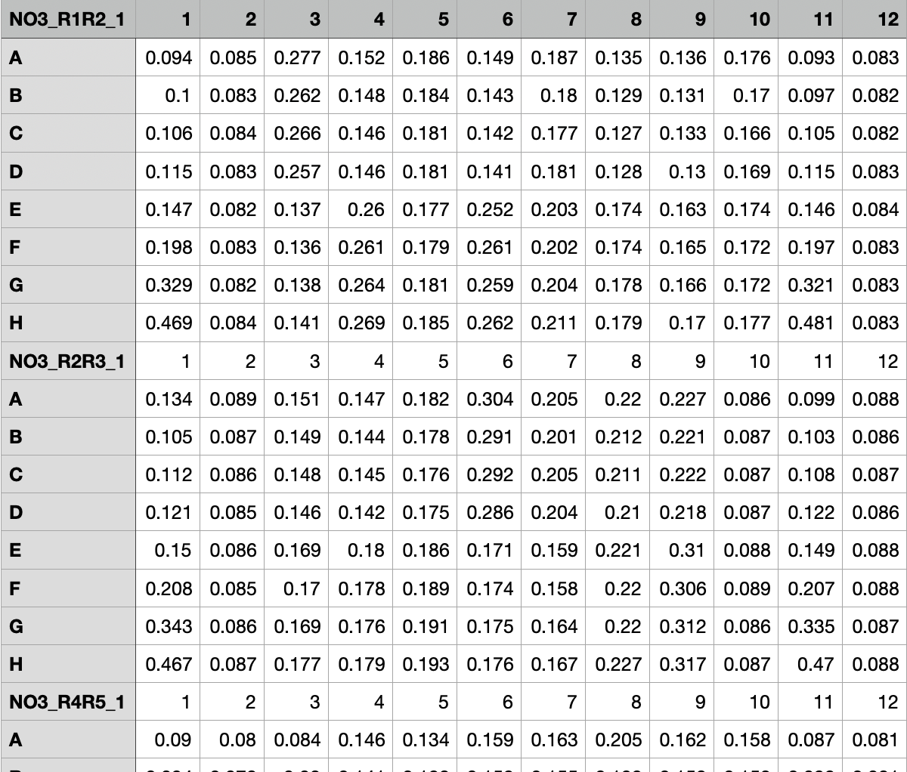
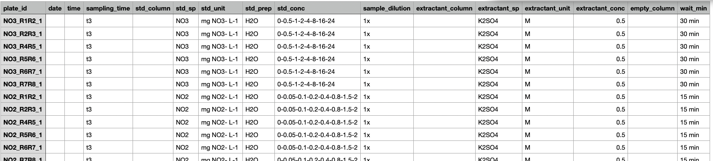

# Import and tidy raw data


- [To Do](#to-do)
- [Intro](#intro)
- [Set up](#set-up)
- [1 - Import data that is in a plate
  format](#1---import-data-that-is-in-a-plate-format)
  - [1.1 - First, raw absorbance data](#11---first-raw-absorbance-data)
  - [1.2 - Then, plate maps](#12---then-plate-maps)
  - [1.3 - Option: join data sets](#13---option-join-data-sets)
  - [1.4 - Verticalize and join absorbance and maps
    data](#14---verticalize-and-join-absorbance-and-maps-data)
  - [1.4 - Export tidy plate data](#14---export-tidy-plate-data)
- [2 - Import (and join) plate
  metadata](#2---import-and-join-plate-metadata)
  - [2.1 - Import metadata](#21---import-metadata)
  - [2.2 - Option: join metadata](#22---option-join-metadata)
  - [2.3 - Export metadata](#23---export-metadata)

# To Do

- For TDN: !! <u>**If we do the NO2**</u>, then need to deal with the
  fact that in plate NO2_TDN_18, there is another blanc for some samples
  (KCl 1M), but that is only in 4 wells…

# Intro

Unfortunately, absorbance data has been saved in many different formats
(txt, csv, xlsx), and files have a diversity of content (how many plates
are in 1 file), of naming rules, and of structure (how many rows and
columns before the cell A1 appears), …

So there are here 2 main ways to import absorbance data & 3 types of
data:

1.  Absorbance data stricto sensu = quantitative values for absorbance,
    data coming from plate reader

    - either as .TXT (see
      <a href="#fig-txt-screenshot" class="quarto-xref">Figure 1</a>)

    - or as .csv (see example in
      <a href="#fig-csv-screenshot" class="quarto-xref">Figure 2</a>)

2.  Plate map data, i.e., the map of well attribution to samples,
    standard curve and extractant (or blanc). Typically, this can have
    the same format as the .csv absorbance data (see
    <a href="#fig-csv-map-screenshot" class="quarto-xref">Figure 3</a>)

3.  Plate metadata, i.e., additional information that gives information
    that applies to the whole 96-well plate. Example: plate-id, N
    species that is dosed, wavelength, date or batch, concentration of
    the standard curve, nature and concentration of the extractant, etc.
    (see
    <a href="#fig-metadata-screenshot" class="quarto-xref">Figure 4</a>)

<div id="fig-txt-screenshot">


Figure 1: Typical structure of raw absorbance data as .TXT file as it is
given by the spectrophotometer

</div>

<div id="fig-csv-screenshot">



Figure 2: One example of structure of a .csv file containing absorbance
data. This is the basic structure that easily fits into this pipeline.
But other formats can often easily be adapted into this format as well.
Important in this set up is that plates are displayed on top of each
other (empty rows are easy to correct if needed), and that the plate_id
is in the top-left cell of each plate. It is also useful that the
plate_id start with the N species under study

</div>

<div id="fig-csv-map-screenshot">


Figure 3: One example of plate map data in the same .csv format as the
corresponding absorbance data

</div>

<div id="fig-metadata-screenshot">



Figure 4: Example of plate metadata. There could be more or less
columns, but consistency within one import episode is important as
several data frames will be appended, which will only work if they have
the same structure. Vital columns are plate_id, std_sp, std_unit,
std_conc (with concentrations separated by a “-” and the digit separator
a “.”

</div>

# Set up

Load packages

<details class="code-fold">
<summary>Code</summary>

``` r
library(tidyverse)
library(janitor) # for row_to_names()

# load functions
source("functions/import_abs_txt.R") # see if can be deleted eventually
source("functions/import_abs_csv.R") # see if can be deleted eventually
source("functions/join_maps_abs.R")
source("functions/import_data_plate.R")
```

</details>

# 1 - Import data that is in a plate format

This takes advantage of a home-made import function that transforms raw
data in a plate format into a verticalized format. It takes as input 3
possible formats: tibble, txt or csv.

The tibble option is useful if the original file is not formatted as in
the default structure. Then you can previously import the data, reformat
it, then run it through the function to take advantage of its
verticalization.

The `import_data_plate()` function returns a list, with the first
element named `abs_data_df`, containing the verticalized data.

## 1.1 - First, raw absorbance data

<details class="code-fold">
<summary>Code</summary>

``` r
# Nmin for t1 and t2
Nmin_abs <- import_data_plate(dataset = "Nmint1t2", format_abs = "txt", filepath = "raw_data/Nmin/")
# have a look
Nmin_abs$abs_data_df
```

</details>

    # A tibble: 96 × 102
       row   column dataset  NH4_1F1 NH4_1F2_1 NH4_1F2_2 NH4_1F3 NH4_1F4 NH4_1F5
       <chr> <chr>  <chr>      <dbl>     <dbl>     <dbl>   <dbl>   <dbl>   <dbl>
     1 A     1      Nmint1t2   0.039     0.039     0.039   0.038   0.039   0.039
     2 A     2      Nmint1t2   0.046     0.042     0.042   0.042   0.046   0.062
     3 A     3      Nmint1t2   0.049     0.041     0.041   0.042   0.041   0.042
     4 A     4      Nmint1t2   0.042     0.041     0.041   0.042   0.042   0.04 
     5 A     5      Nmint1t2   0.042     0.042     0.042   0.043   0.042   0.041
     6 A     6      Nmint1t2   0.041     0.041     0.041   0.043   0.042   0.043
     7 A     7      Nmint1t2   0.042     0.041     0.041   0.044   0.041   0.043
     8 A     8      Nmint1t2   0.039     0.038     0.038   0.039   0.039   0.039
     9 A     9      Nmint1t2   0.043     0.042     0.042   0.042   0.043   0.041
    10 A     10     Nmint1t2   0.042     0.041     0.041   0.042   0.042   0.046
    # ℹ 86 more rows
    # ℹ 93 more variables: NH4_1G1 <dbl>, NH4_1G2 <dbl>, NH4_1G3 <dbl>,
    #   NH4_1G4 <dbl>, NH4_1G5 <dbl>, NH4_2F1_1 <dbl>, NH4_2F1_2 <dbl>,
    #   NH4_2F2_1 <dbl>, NH4_2F2_2 <dbl>, NH4_2F3_1 <dbl>, NH4_2F3_2 <dbl>,
    #   NH4_2F4_1 <dbl>, NH4_2F4_2 <dbl>, NH4_2F5_1 <dbl>, NH4_2F5_2 <dbl>,
    #   NH4_2F6_1 <dbl>, NH4_2F6_2 <dbl>, NH4_2P1 <dbl>, NH4_2P2 <dbl>,
    #   NH4_2P3 <dbl>, NH4_2P4 <dbl>, NH4_2P5 <dbl>, NH4_2P6_1 <dbl>, …

<details class="code-fold">
<summary>Code</summary>

``` r
# Nmin for t3
Nmint3_abs <- import_data_plate(dataset = "Nmint3", format_abs = "csv", filepath = "raw_data/Nmin_t3/", filename_csv = "Nmint3_data.csv")

# TDN
TDN_abs <- import_data_plate(dataset = "TDN", format_abs = "csv", filepath = "raw_data/TDN/", filename_csv = "TDN_data.csv")
```

</details>

## 1.2 - Then, plate maps

Here, we need to use the tibble option as a format for the TDN data set
because the csv file for plate maps doesn’t respect the default
structure.

<details class="code-fold">
<summary>Code</summary>

``` r
# Nmin for t1 and t2
Nmin_maps <- import_data_plate(dataset = "Nmint1t2", format_abs = "csv", filepath = "raw_data/Nmin/", filename_csv = "Nmin_maps.csv")
# have a look
Nmin_maps$abs_data_df
```

</details>

    # A tibble: 96 × 102
       row   column dataset  NH4_1F1  NH4_1F2_1 NH4_1F2_2 NH4_1F3  NH4_1F4  NH4_1F5 
       <chr> <chr>  <chr>    <chr>    <chr>     <chr>     <chr>    <chr>    <chr>   
     1 A     1      Nmint1t2 Std      Std       Std       Std      Std      Std     
     2 A     2      Nmint1t2 81_t1_z2 97_t1_z1  empty     89_t1_z3 81_t1_z1 Std_3_t1
     3 A     3      Nmint1t2 82_t1_z2 98_t1_z1  empty     90_t1_z3 82_t1_z3 98_t1_z3
     4 A     4      Nmint1t2 83_t1_z2 99_t1_z1  empty     91_t1_z1 83_t1_z3 99_t1_z…
     5 A     5      Nmint1t2 84_t1_z1 100_t1_z1 empty     92_t1_z2 84_t1_z2 100_t1_…
     6 A     6      Nmint1t2 85_t1_z1 101_t1_z3 empty     93_t1_z2 85_t1_z2 101_t1_…
     7 A     7      Nmint1t2 86_t1_z3 102_t1_z3 empty     94_t1_z3 86_t1_z1 102_t1_…
     8 A     8      Nmint1t2 extr     extr      empty     extr     extr     extr    
     9 A     9      Nmint1t2 87_t1_z3 103_t1_z1 empty     95_t1_z2 87_t1_z1 103_t1_…
    10 A     10     Nmint1t2 88_t1_z3 104_t1_z1 empty     96_t1_z3 88_t1_z1 104_t1_…
    # ℹ 86 more rows
    # ℹ 93 more variables: NH4_1G1 <chr>, NH4_1G2 <chr>, NH4_1G3 <chr>,
    #   NH4_1G4 <chr>, NH4_1G5 <chr>, NO2_1F1 <chr>, NO2_1F2_1 <chr>,
    #   NO2_1F2_2 <chr>, NO2_1F3 <chr>, NO2_1F4 <chr>, NO2_1F5 <chr>,
    #   NO2_1G1 <chr>, NO2_1G2 <chr>, NO2_1G3 <chr>, NO2_1G4 <chr>, NO2_1G5 <chr>,
    #   NO3_1F1 <chr>, NO3_1F2_1 <chr>, NO3_1F2_2 <chr>, NO3_1F3 <chr>,
    #   NO3_1F4 <chr>, NO3_1F5 <chr>, NO3_1G1 <chr>, NO3_1G2 <chr>, …

<details class="code-fold">
<summary>Code</summary>

``` r
# Nmin for t3
Nmint3_maps <- import_data_plate(dataset = "Nmint3",
  format_abs = "csv", filepath = "raw_data/Nmin_t3/", filename_csv = "Nmint3_maps.csv")

# TDN
TDN_file <- read_csv("raw_data/TDN/TDN_maps.csv", col_names = FALSE,col_select = X14:X26, show_col_types = FALSE) |> 
  na.omit() |> 
  rename(X1 = X14)
TDN_maps <- import_data_plate(dataset = "TDN", format_abs = "tibble", tibble = TDN_file)
```

</details>

## 1.3 - Option: join data sets

It can be relevant to join data sets, or to keep them separate to export
them. I personally like joining data sets, and filter subsets when
needed, so that I reduce the number of saved files. Whichever, up to the
user.

2 Options. The first works only with 2 data frames. The second works
with multiple data frames.

<details class="code-fold">
<summary>Code</summary>

``` r
# firts option, only 2 data frames (possible to nest)
N_all_abs <- left_join(
  Nmin_abs$abs_data_df, 
  Nmint3_abs$abs_data_df)
```

</details>

    Joining with `by = join_by(row, column, dataset)`

<details class="code-fold">
<summary>Code</summary>

``` r
N_all_abs
```

</details>

    # A tibble: 96 × 138
       row   column dataset  NH4_1F1 NH4_1F2_1 NH4_1F2_2 NH4_1F3 NH4_1F4 NH4_1F5
       <chr> <chr>  <chr>      <dbl>     <dbl>     <dbl>   <dbl>   <dbl>   <dbl>
     1 A     1      Nmint1t2   0.039     0.039     0.039   0.038   0.039   0.039
     2 A     2      Nmint1t2   0.046     0.042     0.042   0.042   0.046   0.062
     3 A     3      Nmint1t2   0.049     0.041     0.041   0.042   0.041   0.042
     4 A     4      Nmint1t2   0.042     0.041     0.041   0.042   0.042   0.04 
     5 A     5      Nmint1t2   0.042     0.042     0.042   0.043   0.042   0.041
     6 A     6      Nmint1t2   0.041     0.041     0.041   0.043   0.042   0.043
     7 A     7      Nmint1t2   0.042     0.041     0.041   0.044   0.041   0.043
     8 A     8      Nmint1t2   0.039     0.038     0.038   0.039   0.039   0.039
     9 A     9      Nmint1t2   0.043     0.042     0.042   0.042   0.043   0.041
    10 A     10     Nmint1t2   0.042     0.041     0.041   0.042   0.042   0.046
    # ℹ 86 more rows
    # ℹ 129 more variables: NH4_1G1 <dbl>, NH4_1G2 <dbl>, NH4_1G3 <dbl>,
    #   NH4_1G4 <dbl>, NH4_1G5 <dbl>, NH4_2F1_1 <dbl>, NH4_2F1_2 <dbl>,
    #   NH4_2F2_1 <dbl>, NH4_2F2_2 <dbl>, NH4_2F3_1 <dbl>, NH4_2F3_2 <dbl>,
    #   NH4_2F4_1 <dbl>, NH4_2F4_2 <dbl>, NH4_2F5_1 <dbl>, NH4_2F5_2 <dbl>,
    #   NH4_2F6_1 <dbl>, NH4_2F6_2 <dbl>, NH4_2P1 <dbl>, NH4_2P2 <dbl>,
    #   NH4_2P3 <dbl>, NH4_2P4 <dbl>, NH4_2P5 <dbl>, NH4_2P6_1 <dbl>, …

<details class="code-fold">
<summary>Code</summary>

``` r
# Second option, multiple data frames. 
## First create a list
list_data <- list(Nmin_abs$abs_data_df, 
  Nmint3_abs$abs_data_df, 
  TDN_abs$abs_data_df)

## Then join from the list
N_all_abs <- plyr::join_all(list_data) |> as_tibble()
```

</details>

    Joining by: row, column, dataset
    Joining by: row, column, dataset

<details class="code-fold">
<summary>Code</summary>

``` r
N_all_abs 
```

</details>

    # A tibble: 96 × 196
       row   column dataset  NH4_1F1 NH4_1F2_1 NH4_1F2_2 NH4_1F3 NH4_1F4 NH4_1F5
       <chr> <chr>  <chr>      <dbl>     <dbl>     <dbl>   <dbl>   <dbl>   <dbl>
     1 A     1      Nmint1t2   0.039     0.039     0.039   0.038   0.039   0.039
     2 A     2      Nmint1t2   0.046     0.042     0.042   0.042   0.046   0.062
     3 A     3      Nmint1t2   0.049     0.041     0.041   0.042   0.041   0.042
     4 A     4      Nmint1t2   0.042     0.041     0.041   0.042   0.042   0.04 
     5 A     5      Nmint1t2   0.042     0.042     0.042   0.043   0.042   0.041
     6 A     6      Nmint1t2   0.041     0.041     0.041   0.043   0.042   0.043
     7 A     7      Nmint1t2   0.042     0.041     0.041   0.044   0.041   0.043
     8 A     8      Nmint1t2   0.039     0.038     0.038   0.039   0.039   0.039
     9 A     9      Nmint1t2   0.043     0.042     0.042   0.042   0.043   0.041
    10 A     10     Nmint1t2   0.042     0.041     0.041   0.042   0.042   0.046
    # ℹ 86 more rows
    # ℹ 187 more variables: NH4_1G1 <dbl>, NH4_1G2 <dbl>, NH4_1G3 <dbl>,
    #   NH4_1G4 <dbl>, NH4_1G5 <dbl>, NH4_2F1_1 <dbl>, NH4_2F1_2 <dbl>,
    #   NH4_2F2_1 <dbl>, NH4_2F2_2 <dbl>, NH4_2F3_1 <dbl>, NH4_2F3_2 <dbl>,
    #   NH4_2F4_1 <dbl>, NH4_2F4_2 <dbl>, NH4_2F5_1 <dbl>, NH4_2F5_2 <dbl>,
    #   NH4_2F6_1 <dbl>, NH4_2F6_2 <dbl>, NH4_2P1 <dbl>, NH4_2P2 <dbl>,
    #   NH4_2P3 <dbl>, NH4_2P4 <dbl>, NH4_2P5 <dbl>, NH4_2P6_1 <dbl>, …

Proceed the same way for maps

<details class="code-fold">
<summary>Code</summary>

``` r
# same for more than 2:
list_maps <- list(
  Nmin_maps$abs_data_df,
  Nmint3_maps$abs_data_df,
  TDN_maps$abs_data_df
)

N_all_maps <- plyr::join_all(list_maps) |> as_tibble()
```

</details>

    Joining by: row, column, dataset
    Joining by: row, column, dataset

<details class="code-fold">
<summary>Code</summary>

``` r
N_all_maps
```

</details>

    # A tibble: 96 × 196
       row   column dataset  NH4_1F1  NH4_1F2_1 NH4_1F2_2 NH4_1F3  NH4_1F4  NH4_1F5 
       <chr> <chr>  <chr>    <chr>    <chr>     <chr>     <chr>    <chr>    <chr>   
     1 A     1      Nmint1t2 Std      Std       Std       Std      Std      Std     
     2 A     2      Nmint1t2 81_t1_z2 97_t1_z1  empty     89_t1_z3 81_t1_z1 Std_3_t1
     3 A     3      Nmint1t2 82_t1_z2 98_t1_z1  empty     90_t1_z3 82_t1_z3 98_t1_z3
     4 A     4      Nmint1t2 83_t1_z2 99_t1_z1  empty     91_t1_z1 83_t1_z3 99_t1_z…
     5 A     5      Nmint1t2 84_t1_z1 100_t1_z1 empty     92_t1_z2 84_t1_z2 100_t1_…
     6 A     6      Nmint1t2 85_t1_z1 101_t1_z3 empty     93_t1_z2 85_t1_z2 101_t1_…
     7 A     7      Nmint1t2 86_t1_z3 102_t1_z3 empty     94_t1_z3 86_t1_z1 102_t1_…
     8 A     8      Nmint1t2 extr     extr      empty     extr     extr     extr    
     9 A     9      Nmint1t2 87_t1_z3 103_t1_z1 empty     95_t1_z2 87_t1_z1 103_t1_…
    10 A     10     Nmint1t2 88_t1_z3 104_t1_z1 empty     96_t1_z3 88_t1_z1 104_t1_…
    # ℹ 86 more rows
    # ℹ 187 more variables: NH4_1G1 <chr>, NH4_1G2 <chr>, NH4_1G3 <chr>,
    #   NH4_1G4 <chr>, NH4_1G5 <chr>, NO2_1F1 <chr>, NO2_1F2_1 <chr>,
    #   NO2_1F2_2 <chr>, NO2_1F3 <chr>, NO2_1F4 <chr>, NO2_1F5 <chr>,
    #   NO2_1G1 <chr>, NO2_1G2 <chr>, NO2_1G3 <chr>, NO2_1G4 <chr>, NO2_1G5 <chr>,
    #   NO3_1F1 <chr>, NO3_1F2_1 <chr>, NO3_1F2_2 <chr>, NO3_1F3 <chr>,
    #   NO3_1F4 <chr>, NO3_1F5 <chr>, NO3_1G1 <chr>, NO3_1G2 <chr>, …

So now we have those 2 data frames that have strictly the same
structure, with 96 rows and 196 columns, with 2 columns attributed to
the well identifier (“row” and “column”), and the remaining 194 columns
representing the 96-well plates.

## 1.4 - Verticalize and join absorbance and maps data

We use here the home-made function `join_maps_abs()` that first
verticalizes separately both data sets (absorbance vs maps data), then
joins them in a single data frame.

The target structure for the joined data frame is to have the following
columns:

- “row” (from the plate, i.e., from “A” or “H”)

- “column” (from the plate, i.e., from 1 to 12), here expressed within a
  single column

- “well_id” (= concatenation of row and column, i.e., from A1 to H12)

- “unique_well_id” (= concatenation of plate_id and well_id),

- “N_sp” (extracted from plate_id as the first block preceding the first
  “\_”. If your plate names are not structured so, we can adapt the code
  and/or get that information from somewhere else, e.g., the metadata

- “dataset” (as input in the import function hereabove,

- “plate_id”

- “plate_map” (sample name or extractant or std curve),

- “absorbance” (raw data coming out of the spectrophotometer).

Should you need any other column, this can be discussed. Bear in mind
that downstream analysis, including connecting this data to the metadata
(imported in next section), will happen in the next script.

<details class="code-fold">
<summary>Code</summary>

``` r
N_all_plate <- join_maps_abs(maps_df = N_all_maps, abs_df = N_all_abs)
# have a look
N_all_plate |> head()
```

</details>

    # A tibble: 6 × 9
      row   column well_id unique_well_id N_sp  dataset  plate_id plate_map
      <chr>  <dbl> <chr>   <chr>          <chr> <chr>    <chr>    <chr>    
    1 A          1 A1      NH4_1F1_A1     NH4   Nmint1t2 NH4_1F1  Std      
    2 B          1 B1      NH4_1F1_B1     NH4   Nmint1t2 NH4_1F1  Std      
    3 C          1 C1      NH4_1F1_C1     NH4   Nmint1t2 NH4_1F1  Std      
    4 D          1 D1      NH4_1F1_D1     NH4   Nmint1t2 NH4_1F1  Std      
    5 E          1 E1      NH4_1F1_E1     NH4   Nmint1t2 NH4_1F1  Std      
    6 F          1 F1      NH4_1F1_F1     NH4   Nmint1t2 NH4_1F1  Std      
    # ℹ 1 more variable: absorbance <dbl>

<details class="code-fold">
<summary>Code</summary>

``` r
N_all_plate |> tail()
```

</details>

    # A tibble: 6 × 9
      row   column well_id unique_well_id N_sp  dataset  plate_id   plate_map
      <chr>  <dbl> <chr>   <chr>          <chr> <chr>    <chr>      <chr>    
    1 C         12 C12     NO3_TDN_38_C12 NO3   Nmint1t2 NO3_TDN_38 <NA>     
    2 D         12 D12     NO3_TDN_38_D12 NO3   Nmint1t2 NO3_TDN_38 <NA>     
    3 E         12 E12     NO3_TDN_38_E12 NO3   Nmint1t2 NO3_TDN_38 <NA>     
    4 F         12 F12     NO3_TDN_38_F12 NO3   Nmint1t2 NO3_TDN_38 <NA>     
    5 G         12 G12     NO3_TDN_38_G12 NO3   Nmint1t2 NO3_TDN_38 <NA>     
    6 H         12 H12     NO3_TDN_38_H12 NO3   Nmint1t2 NO3_TDN_38 <NA>     
    # ℹ 1 more variable: absorbance <dbl>

## 1.4 - Export tidy plate data

Now that we have our final raw data frame for plate data, we can export
it to save it as a document to use for downstream analysis

<details class="code-fold">
<summary>Code</summary>

``` r
write_rds(N_all_plate, file = "output/data/N_all_plate_tidy.rds")
```

</details>

# 2 - Import (and join) plate metadata

This step is to import plate metadata, so data on a per-plate basis.

The file containing plate metadata can contain as much information on
plates as the user wants.

Absolutely necessary columns are:

- plate_id

  - ideally one row per plate id, corrections to the code may be needed
    otherwise

- std_unit

- std_conc

  - this contains a succession of all concentrations of the standard
    curve, expressed in the unit above

  - one cell is used for all concentrations, ideally in ascending order
    (or tweak the code)

  - concentrations should be separated by “-” and digits expressed with
    “.”, not with “,”

In the proposed code, N species can be deducted from plate names. Should
that not be the case, then an additional column would be a good place to
store that information:

- N_sp

Additional information can be encoded manually.

**!! I prefered not relying on manual encoding of concentrations for the
standard curve because we tend to run big chunks of code without paying
attention that modifications are needed. In that sense, such a critical
information coming directly from imported files, so that the code bugs
when the information is not imported, feels like a good failsafe. As
much as possible, I tried to only have moments of manual encoding when
either the decision needs to be interactive (e.g., based on a plot) or
when valid default values can be relied upon without major issues. !!!**

## 2.1 - Import metadata

The code for import in this case is very straight forward as there is no
major pivotting or other data manipulation required.

First, we import all metadata sets.

<details class="code-fold">
<summary>Code</summary>

``` r
# import csvs
Nmin_metadata <- read_csv("raw_data/Nmin/Nmin_metadata.csv", show_col_types = FALSE) |> mutate(dataset = "Nmint1t2")
Nmin_t3_metadata <- read_csv("raw_data/Nmin_t3/Nmint3_metadata.csv", show_col_types = FALSE) |> mutate(dataset = "Nmint3")
TDN_metadata <- read_csv("raw_data/TDN/TDN_metadata.csv", show_col_types = FALSE) |> mutate(std_column = as.character(std_column)) |> mutate(dataset = "TDN")
```

</details>

## 2.2 - Option: join metadata

Then we join the imported files. Here as well, joining is optional, you
can run all analyses separately / store separate files

<details class="code-fold">
<summary>Code</summary>

``` r
# join csv's
N_all_metadata <- bind_rows(Nmin_metadata, Nmin_t3_metadata, TDN_metadata)
# have a look
N_all_metadata
```

</details>

    # A tibble: 193 × 18
       plate_id  date  time  sampling_time std_column std_sp std_unit    std_prep
       <chr>     <chr> <lgl> <chr>         <chr>      <chr>  <chr>       <chr>   
     1 NH4_1F1   <NA>  NA    t1            1-12       NH4    mg NH4+ L-1 H2O     
     2 NH4_1F2_1 <NA>  NA    t1            1-12       NH4    mg NH4+ L-1 H2O     
     3 NH4_1F2_2 <NA>  NA    t1            1-12       NH4    mg NH4+ L-1 H2O     
     4 NH4_1F3   <NA>  NA    t1            1-12       NH4    mg NH4+ L-1 H2O     
     5 NH4_1F4   <NA>  NA    t1            1-12       NH4    mg NH4+ L-1 H2O     
     6 NH4_1F5   <NA>  NA    t1            1-12       NH4    mg NH4+ L-1 H2O     
     7 NH4_1G1   <NA>  NA    t1            1-12       NH4    mg NH4+ L-1 H2O     
     8 NH4_1G2   <NA>  NA    t1            1-12       NH4    mg NH4+ L-1 H2O     
     9 NH4_1G3   <NA>  NA    t1            1-12       NH4    mg NH4+ L-1 H2O     
    10 NH4_1G4   <NA>  NA    t1            1-12       NH4    mg NH4+ L-1 H2O     
    # ℹ 183 more rows
    # ℹ 10 more variables: std_conc <chr>, sample_dilution <chr>,
    #   extractant_column <dbl>, extractant_sp <chr>, extractant_unit <chr>,
    #   extractant_conc <dbl>, empty_column <chr>, wait_min <chr>, dataset <chr>,
    #   wavelength <chr>

## 2.3 - Export metadata

To be used in downstream analyses

<details class="code-fold">
<summary>Code</summary>

``` r
# export it
N_all_metadata |> write_rds("output/data/N_all_metadata.rds")
```

</details>
