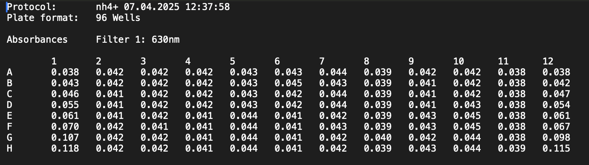
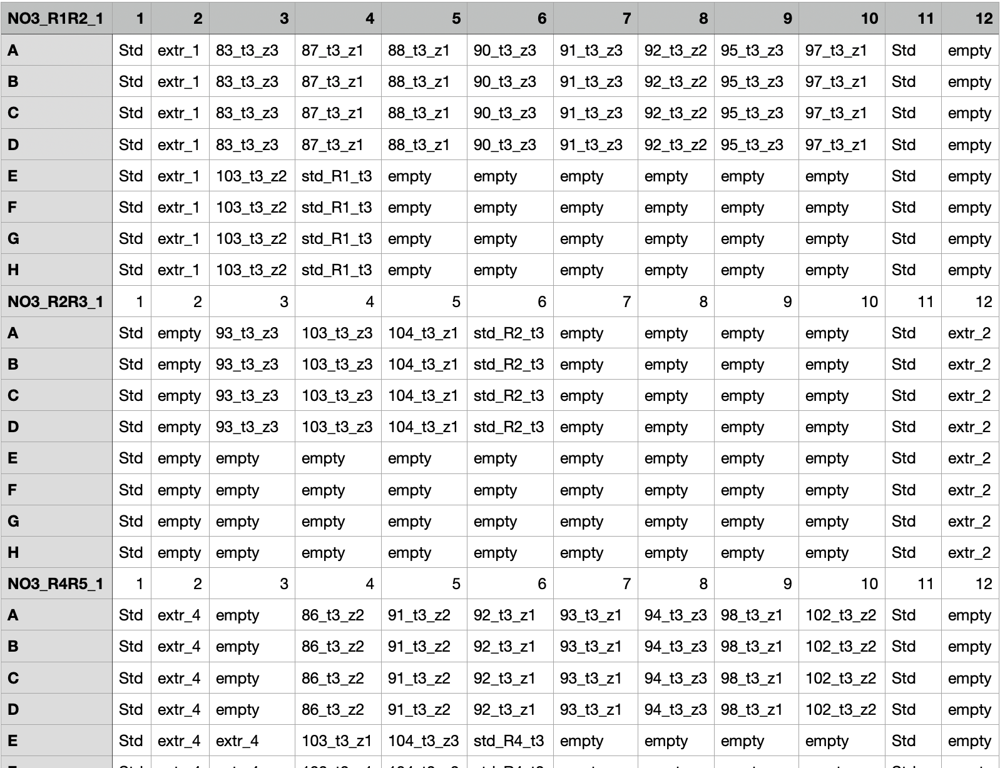

# To Do

-   

# Intro

Unfortunately, absorbance data has been saved in many different formats (txt, csv, xlsx), and files have a diversity of content (how many plates are in 1 file), of naming rules, and of structure (how many rows and columns before the cell A1 appears), ...

So there are here 2 main ways to import absorbance data & 3 types of data:

1.  Absorbance data stricto sensu = quantitative values for absorbance, data coming from plate reader

    -   either as .TXT (see @fig-txt-screenshot)

    -   or as .csv (see @fig-csv-screenshot)

::: callout-tip
## Adapt the structure of your CSV!

The structure of the file proposed for the csv format is not that of the file provided by the SkanIt software, but a "cleaned" format (see example in @fig-csv-screenshot). You may need to bring your raw data into a structure that fits the one proposed here.
:::

2.  Plate map data, i.e., the map of well attribution to samples, standard curve and extractant (or blanc). Typically, this can have the same format as the .csv absorbance data (see @fig-csv-map-screenshot)

3.  Plate metadata, i.e., additional information that gives information that applies to the whole 96-well plate. Example: plate-id, N species that is dosed, wavelength, date or batch, concentration of the standard curve, nature and concentration of the extractant, etc. (see @fig-metadata-screenshot)

{#fig-txt-screenshot}

{#fig-csv-screenshot width="440"}

{#fig-csv-map-screenshot width="538"}

![Example of plate metadata. There could be more or less columns, but consistency within one import episode is important as several data frames will be appended, which will only work if they have the same structure. Vital columns are [**plate_id, std_sp, std_unit, std_conc**]{.underline} (with concentrations separated by a "-" and the digit separator a "."](images/clipboard-3285939582.png){#fig-metadata-screenshot}

# Set up

Load packages

```{r}
#| message: false
#| warning: false
#| output: false

rm(list = ls())

library(tidyverse)
library(janitor) # for row_to_names()

# load functions
#source("functions/import_abs_txt.R") # see if can be deleted eventually
#source("functions/import_abs_csv.R") # see if can be deleted eventually
source("functions/join_maps_abs.R")
source("functions/import_data_plate.R")

```

# 1 - Import data that is in a plate format

This takes advantage of a home-made import function that transforms raw data in a plate format into a verticalized format. It takes as input 3 possible formats: tibble, txt or csv.

The tibble option is useful if the original file is not formatted as in the default structure. Then you can previously import the data, reformat it, then run it through the function to take advantage of its verticalization.

The `import_data_plate()` function returns a list, with the first element named `abs_data_df`, containing the verticalized data.

## 1.1 - First, raw absorbance data

```{r}

# Nmin for t1 and t2
Nmin_abs <- import_data_plate(dataset = "Nmint1t2", format_abs = "txt", filepath = "raw_data/Nmin/")
# have a look
Nmin_abs$abs_data_df

# Nmin for t3
Nmint3_abs <- import_data_plate(dataset = "Nmint3", format_abs = "csv", filepath = "raw_data/Nmin_t3/", filename_csv = "Nmint3_data.csv")

# TDN
TDN_abs <- import_data_plate(dataset = "TDN", format_abs = "csv", filepath = "raw_data/TDN/", filename_csv = "TDN_data.csv")
#TDN_abs$abs_data_df |> filter(dataset == "TDN")
```

## 1.2 - Then, plate maps

Here, we need to use the tibble option as a format for the TDN data set because the csv file for plate maps doesn't respect the default structure.

```{r}

# Nmin for t1 and t2
Nmin_maps <- import_data_plate(dataset = "Nmint1t2", format_abs = "csv", filepath = "raw_data/Nmin/", filename_csv = "Nmin_maps.csv")
# have a look
Nmin_maps$abs_data_df

# Nmin for t3
Nmint3_maps <- import_data_plate(dataset = "Nmint3",
  format_abs = "csv", filepath = "raw_data/Nmin_t3/", filename_csv = "Nmint3_maps.csv")

# TDN
TDN_file <- read_csv("raw_data/TDN/TDN_maps.csv", col_names = FALSE,col_select = X14:X26, show_col_types = FALSE) |> 
  na.omit() |> 
  rename(X1 = X14)
TDN_maps <- import_data_plate(dataset = "TDN", format_abs = "tibble", tibble = TDN_file)

```

## 1.3 - Option: join data sets

It can be relevant to join data sets, or to keep them separate to export them. I personally like joining data sets, and filter subsets when needed, so that I reduce the number of saved files. Whichever, up to the user.

2 Options. The first works only with 2 data frames. The second works with multiple data frames.

```{r}
# firts option, only 2 data frames (possible to nest)
N_all_abs <- left_join(
  Nmin_abs$abs_data_df, 
  Nmint3_abs$abs_data_df)
N_all_abs

# Second option, multiple data frames. 
## First create a list
list_data <- list(Nmin_abs$abs_data_df, 
  Nmint3_abs$abs_data_df, 
  TDN_abs$abs_data_df)

## Then join from the list
N_all_abs <- plyr::join_all(list_data) |> as_tibble()

```

Proceed the same way for maps

```{r}
# same for more than 2:
list_maps <- list(
  Nmin_maps$abs_data_df,
  Nmint3_maps$abs_data_df,
  TDN_maps$abs_data_df
)

N_all_maps <- plyr::join_all(list_maps) |> as_tibble()
N_all_maps
```

So now we have those 2 data frames that have strictly the same structure, with `r nrow(N_all_maps)` rows and `r ncol(N_all_maps)` columns, with 2 columns attributed to the well identifier ("row" and "column"), and the remaining `r ncol(N_all_maps) - 2` columns representing the 96-well plates.

## 1.4 - Verticalize and join absorbance and maps data

We use here the home-made function `join_maps_abs()` that first verticalizes separately both data sets (absorbance vs maps data), then joins them in a single data frame.

The target structure for the joined data frame is to have the following columns:

-   "row" (from the plate, i.e., from "A" or "H")

-   "column" (from the plate, i.e., from 1 to 12), here expressed within a single column

-   "well_id" (= concatenation of row and column, i.e., from A1 to H12)

-   "unique_well_id" (= concatenation of plate_id and well_id),

-   "N_sp" (extracted from plate_id as the first block preceding the first "\_". If your plate names are not structured so, we can adapt the code and/or get that information from somewhere else, e.g., the metadata

-   "dataset" (as input in the import function hereabove,

-   "plate_id"

-   "plate_map" (sample name or extractant or std curve),

-   "absorbance" (raw data coming out of the spectrophotometer).

Should you need any other column, this can be discussed. Bear in mind that downstream analysis, including connecting this data to the metadata (imported in next section), will happen in the next script.

```{r}

N_all_plate <- join_maps_abs(
  maps_df = N_all_maps, 
  abs_df = N_all_abs,
  correct_1000_factor = TRUE)

# have a look
N_all_plate |> head()
N_all_plate |> tail()

```

## 1.5 - Add dataset identifier

We have a data set that is almost ready. But we lost the information of which plate belongs to which data set. In case that information is not included in the plate names, we can easily retrieve it from previous steps.

```{r}
plate_names_all <- 
  Nmin_abs$plate_names |> 
  append(Nmint3_abs$plate_names) |> 
  append(TDN_abs$plate_names)

N_all_plate_tidy <- N_all_plate |> 
  mutate(
    dataset = case_when(
      plate_id %in% colnames(Nmin_abs$abs_data_df) ~ "Nmint1t2",
      plate_id %in% colnames(Nmint3_abs$abs_data_df) ~ "Nmint3",
      plate_id %in% colnames(TDN_abs$abs_data_df) ~ "TDN",
      .default = "unspecified"
    )
  )

# N_all_plate_tidy |> 
#     filter(plate_map %in% c(1,2,3,4,5,6,7,8,9,10))

```

## 1.6 - Export tidy plate data

Now that we have our final raw data frame for plate data, we can export it to save it as a document to use for downstream analysis

```{r}
write_rds(N_all_plate_tidy, file = "output/data/N_all_plate_tidy.rds")
```

# 2 - Import (and join) plate metadata

This step is to import plate metadata, so data on a per-plate basis.

The file containing plate metadata can contain as much information on plates as the user wants.

Absolutely necessary columns are:

-   plate_id

    -   ideally one row per plate id, corrections to the code may be needed otherwise

-   std_unit

-   std_conc

    -   this contains a succession of all concentrations of the standard curve, expressed in the unit above

    -   one cell is used for all concentrations, ideally in ascending order (or tweak the code)

    -   concentrations should be separated by "-" and digits expressed with ".", not with ","

In the proposed code, N species can be deducted from plate names. Should that not be the case, then an additional column would be a good place to store that information:

-   N_sp

Additional information can be encoded manually.

**!! I prefered not relying on manual encoding of concentrations for the standard curve because we tend to run big chunks of code without paying attention that modifications are needed. In that sense, such a critical information coming directly from imported files, so that the code bugs when the information is not imported, feels like a good failsafe. As much as possible, I tried to only have moments of manual encoding when either the decision needs to be interactive (e.g., based on a plot) or when valid default values can be relied upon without major issues. !!!**

## 2.1 - Import metadata

The code for import in this case is very straight forward as there is no major pivotting or other data manipulation required.

First, we import all metadata sets.

```{r}
# import csvs
Nmin_metadata <- read_csv("raw_data/Nmin/Nmin_metadata.csv", show_col_types = FALSE) |> mutate(dataset = "Nmint1t2")
Nmin_t3_metadata <- read_csv("raw_data/Nmin_t3/Nmint3_metadata.csv", show_col_types = FALSE) |> mutate(dataset = "Nmint3")
TDN_metadata <- read_csv("raw_data/TDN/TDN_metadata.csv", show_col_types = FALSE) |> mutate(std_column = as.character(std_column)) |> mutate(dataset = "TDN")
```

## 2.2 - Option: join metadata

Then we join the imported files. Here as well, joining is optional, you can run all analyses separately / store separate files

```{r}
# join csv's
N_all_metadata <- bind_rows(Nmin_metadata, Nmin_t3_metadata, TDN_metadata)
# have a look
N_all_metadata
```

## 2.3 - Export metadata

To be used in downstream analyses

```{r}

# export it
N_all_metadata |> write_rds("output/data/N_all_metadata.rds")
```
