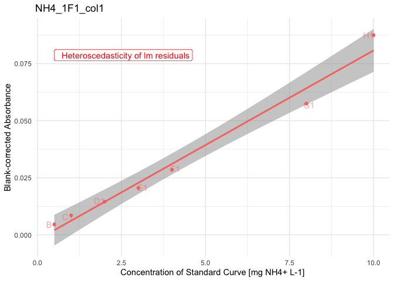

# 2.1.1 Absorbance Data QC
Morgane de Toeuf

- [TO DO](#to-do)
- [Set up](#set-up)
- [1 - Suspicious wells removal](#1---suspicious-wells-removal)
  - [1.1 - Manual records](#11---manual-records)
  - [1.2 - Suspicious absorbance values
    (automated)](#12---suspicious-absorbance-values-automated)
- [2 - Correction for blank](#2---correction-for-blank)
  - [2.1 - Standard curve](#21---standard-curve)
  - [2.2 - Sample wells](#22---sample-wells)
  - [2.3 - All corrected data](#23---all-corrected-data)
- [3 - Compute regression equation (per
  plate)](#3---compute-regression-equation-per-plate)
  - [3.1 - QC standard curves](#31---qc-standard-curves)
- [TO DO](#to-do-1)

# TO DO

- Check concentrations courbe std de Cloé

# Set up

Loading packages

``` r
rm(list = ls())

library(tidyverse)
```

    ── Attaching core tidyverse packages ──────────────────────── tidyverse 2.0.0 ──
    ✔ dplyr     1.2.1     ✔ readr     2.2.0
    ✔ forcats   1.0.1     ✔ stringr   1.6.0
    ✔ ggplot2   4.0.3     ✔ tibble    3.3.1
    ✔ lubridate 1.9.5     ✔ tidyr     1.3.2
    ✔ purrr     1.2.2     
    ── Conflicts ────────────────────────────────────────── tidyverse_conflicts() ──
    ✖ dplyr::filter() masks stats::filter()
    ✖ dplyr::lag()    masks stats::lag()
    ℹ Use the conflicted package (<http://conflicted.r-lib.org/>) to force all conflicts to become errors

``` r
library(plate2N)
library(roperators)
```


    Attaching package: 'roperators'

    The following object is masked from 'package:tibble':

        num

    The following object is masked from 'package:ggplot2':

        %+%

Loading data

``` r
all_raw_abs_tidy <- read_rds("output/data/1.1_all_raw_abs_tidy.rds")
all_plate_metadata <- read_rds("output/data/1.1_all_plate_metadata.rds")
```

Joining plate data and metadata

``` r
raw_meta <- all_raw_abs_tidy |> left_join(all_plate_metadata, by = join_by(dataset, plate_id))
#raw_meta |> filter(plate_id == string, map == "Std")
```

# 1 - Suspicious wells removal

## 1.1 - Manual records

This section allows the removal of wells that “we know” are failed wells
(e.g., something went wrong during pipetting…).

First, we create a template document to record identifiers of failed
wells. To unequivocally identify a well, 3 pieces of info are needed:
dataset, plate id, well id.

``` r
(template <- failed_wells_template(nrow = 30))
```

    # A tibble: 30 × 3
       dataset plate_id well_id
       <chr>   <chr>    <chr>  
     1 ""      ""       ""     
     2 ""      ""       ""     
     3 ""      ""       ""     
     4 ""      ""       ""     
     5 ""      ""       ""     
     6 ""      ""       ""     
     7 ""      ""       ""     
     8 ""      ""       ""     
     9 ""      ""       ""     
    10 ""      ""       ""     
    # ℹ 20 more rows

Then we export it as a csv for manual encoding

``` r
write_csv(template, file = "output/template/failed_wells_30.csv")
#write_excel_csv(template, file = "output/template/failed_wells_30.csv")
```

After filling that file manually, we re-import it and correct the tidy
data table

``` r
(failed_wells <- read_csv("raw_data/failed_wells.csv", show_col_types = FALSE))
```

    # A tibble: 1 × 3
      dataset  plate_id well_id
      <chr>    <chr>    <chr>  
    1 Nmint1t2 NO2_2P1  E12    

``` r
raw_abs_tidy <- raw_meta |> remove_wells(failed_wells)
#raw_abs_tidy |> filter(plate_id == string, map == "Std")
```

## 1.2 - Suspicious absorbance values (automated)

Observe values for absorbance (iteratively)

``` r
suspicious_wells <- raw_abs_tidy |> 
  qc_raw_abs(
    min_abs = 0.03, max_abs = 4, 
    plot_col_facet = "std_sp", 
    export_plot = "none") 
```

    Warning in qc_raw_abs(raw_abs_tidy, min_abs = 0.03, max_abs = 4, plot_col_facet = "std_sp", : 3 wells out of 13727 are out of range for absorbance, i.e., not in the set boundaries of [0.03; 4]. 
    See table to identify suspicious wells. 


``` r
suspicious_wells |> slice_max(abs, n = 10)
```

    # A tibble: 3 × 5
      dataset plate_id   well_id map               abs  
      <chr>   <chr>      <chr>   <chr>             <chr>
    1 TDN     NO2_TDN_19 H6      Ur_K2SO4_200_C.1x 0    
    2 TDN     NO2_TDN_19 H7      Ur_K2SO4_200_F.1x 0    
    3 TDN     NO2_TDN_19 H9      Ur_K2SO4_5_C.1x   0    

For now, I decide to remove those wells. To be reviewed

``` r
raw_abs_ok <- raw_abs_tidy |> remove_wells(suspicious_wells)
#raw_abs_ok|> filter(plate_id == string, map == "Std")
```

Check the QC once more

``` r
raw_abs_ok |> 
  qc_raw_abs(min_abs = 0.03, max_abs = 3, 
    plot_col_facet = "std_sp", 
    export_plot = "none") #|> 
```

    Warning in qc_raw_abs(raw_abs_ok, min_abs = 0.03, max_abs = 3, plot_col_facet = "std_sp", : 13 wells out of 13724 are out of range for absorbance, i.e., not in the set boundaries of [0.03; 3]. 
    See table to identify suspicious wells. 


    # A tibble: 13 × 5
       dataset plate_id   well_id map   abs  
       <chr>   <chr>      <chr>   <chr> <chr>
     1 TDN     NO3_TDN_17 H1      Std   3.607
     2 TDN     NO3_TDN_18 H1      Std   3.416
     3 TDN     NO3_TDN_19 H1      Std   3.61 
     4 TDN     NO3_TDN_20 H1      Std   3.581
     5 TDN     NO3_TDN_21 H1      Std   3.398
     6 TDN     NO3_TDN_22 H1      Std   3.213
     7 TDN     NO3_TDN_23 H1      Std   3.362
     8 TDN     NO3_TDN_24 H1      Std   3.296
     9 TDN     NO3_TDN_25 H1      Std   3.244
    10 TDN     NO3_TDN_26 H1      Std   3.253
    11 TDN     NO3_TDN_27 H1      Std   3.222
    12 TDN     NO3_TDN_28 H1      Std   3.437
    13 TDN     NO3_TDN_29 H1      Std   3.126

``` r
  #select(well_id, map) |> unique()

# Once validated, store last version in a "validated" data
raw_abs_clean <- raw_abs_ok
```

It appears that only the most concentrated wells in the standard curve
for TDN (well H1) show absorbance levels above 3. We can later look at
those curves and see whether those points are outside of the linear
range. Not to worry now, though

# 2 - Correction for blank

## 2.1 - Standard curve

Obtain curve concentrations from metadata

``` r
curve_concentration <- extract_curve(all_plate_metadata)
```

Extract Std wells, add unique curve ID, then add curve_concentration

``` r
std_data <- raw_abs_clean |> 
  extract_std_data() |> 
  select(!std_conc) |> 
  left_join(curve_concentration, by = join_by(row, plate_id))
```

Check unstrusted blanks (where the smallest value for a given curve is
not in row A (top_down pipetting) or in row H (bottom_up pipetting)

``` r
std_blank <- raw_abs_clean |> plate2N::extract_std_blanc()
std_blank$untrusted
```

    # A tibble: 4 × 8
    # Groups:   dataset, plate_id, column [4]
      well_id dataset  plate_id   column unique_curve_id row   unique_well_id   abs
      <chr>   <chr>    <chr>      <chr>  <chr>           <chr> <chr>          <dbl>
    1 A1      Nmint1t2 NH4_2F5_1  1      NH4_2F5_1_col1  A     A1_NH4_2F5_1   0.044
    2 A1      Nmint1t2 NH4_2F5_2  1      NH4_2F5_2_col1  A     A1_NH4_2F5_2   0.044
    3 A1      Nmint3   NO3_R2R3_1 1      NO3_R2R3_1_col1 A     A1_NO3_R2R3_1  0.134
    4 A1      Nmint3   NO3_R2R3_2 1      NO3_R2R3_2_col1 A     A1_NO3_R2R3_2  0.134

``` r
#blank$all |> filter(plate_id == "NO3_R2R3_1")
```

Check it out graphically.

``` r
# get unique curve id for the curves of interest (containing the suspicious wells)
#curve <- blank$untrusted$unique_curve_id

# all data --> too messy. 
std_data |> 
  plot_std() +
  facet_grid(dataset~std_sp)
```


``` r
# Subset: look at suspicious blanks
std_data |> 
  filter(unique_curve_id %in% std_blank$untrusted$unique_curve_id) |> 
  plot_std() +
  facet_wrap(~plate_id, scales = "free")
```


In this case, all “untrusted wells” are to be removed, as the values in
A1 are clearly out of the curve and probably come from a pipetting error
(failure to eject liquid with the automated pipette).

Should there be a choice, where only some of those wells need to be
removed, but not all, the function `remove_wells()` can be used on
`blank$all` to remove the selection of really-untrusted wells, which
would generate a new version of “trusted wells”, from which the average
values need to be recomputed manually.

``` r
# EXAMPLE, NOT NEEDED IN THIS PIPELINE
# get info on wells to remove

      # (suspicious_wells <- std_blank$untrusted |> 
      #   ungroup() |> 
      #   select(dataset, plate_id, well_id))

# Here, those wells are in blank$all, which we can use to remove the wells
      # blank <- std_blank$all |> ungroup() |> remove_wells(suspicious_wells)

# In this case, std_blank is the same as std_blank$trusted, but we could decide to keep some
      # sum(blank != std_blank$trusted)
      # 
      # std_blanc_avg <- blank |>
      #     dplyr::summarise(
      #       .by = c(dataset, plate_id),
      #       blanc_avg = mean(abs),
      #       blanc_sdev = stats::sd(abs)
      #     ) |>
      #     dplyr::mutate(blanc_coeff_var_percent = 100 * blanc_sdev / blanc_avg)
```

Checking how many blanks have been removed

``` r
nrow(std_blank$all) ; nrow(std_blank$untrusted) ; nrow(std_blank$trusted) 
```

    [1] 329

    [1] 4

    [1] 325

> [!CAUTION]
>
> ### CAUTION
>
> We are here removing wells with the blank for the standard curve. This
> works because we had 2 curves per plate in those plates.
>
> - Should there have only been 1 curve per plate, it would be more
>   complex, as we cannot afford to have zero value for the blank of the
>   standard curve.
>
> - An option would be to see whether the inter-plate variation in
>   absorbance values for the standard curves is sufficiently small. If
>   so, then maybe the blank value of one plate could be replaced by the
>   mean of other plates.
>
> - In doing so, watch out for batch effect. Maybe inter-plate variation
>   is smallest during a single day of experimentation, etc.
>
> - To be tested and implemented in coding.

Now that we have all the trusted wells with blank values, we can finally
correct absorbance values for the standard curves

``` r
# # 2,302 rows
# std_corrected <- raw_abs_clean |> 
#   correct_std_blank(std_blank_average = blank$average)

std_corrected <- 
  blank_correct_abs(
    raw_wells_data = std_data|> 
      ungroup() |> 
      filter_out(row == "A"),
    per_plate_avg_blank = std_blank$average |> rename(blank_avg = blanc_avg),
    map_to_exclude = ""
  )
```

    Joining with `by = join_by(dataset, plate_id)`
    Joining with `by = join_by(row, column, well_id, unique_well_id, dataset,
    plate_id, unique_curve_id, map, std_sp, std_unit, sample_dilution, std_conc)`

Because the logic is similar, we will first go into blank-correction of
sample data before finalizing work on the standard curves (applying
linear regression model)

## 2.2 - Sample wells

First, extract data for wells containing extractant and have a look at
its variation

``` r
extr_data <- extract_extractant(raw_abs_clean)
(extr_avg <- extractant_average(raw_abs_clean) |> 
  arrange(desc(extr_coeff_var_percent)))
```

    # A tibble: 194 × 5
       plate_id   map   extr_avg extr_sdev extr_coeff_var_percent
       <chr>      <chr>    <dbl>     <dbl>                  <dbl>
     1 NO3_2P6_2  extr    0.0941   0.0331                   35.1 
     2 NH4_2F2_2  extr    0.0405   0.00748                  18.5 
     3 NO3_R7R8_1 extr    0.0825   0.0135                   16.4 
     4 NO2_R4R5_1 extr    0.039    0.00270                   6.91
     5 NO3_TDN_38 extr    0.0714   0.00472                   6.61
     6 NH4_2P2    extr    0.0401   0.00242                   6.02
     7 NO3_2F1_1  extr    0.0718   0.00377                   5.25
     8 NO2_2P6_1  extr    0.0372   0.00158                   4.24
     9 NO2_2F1_1  extr    0.0376   0.00151                   4.00
    10 NO2_TDN_03 extr    0.0365   0.00141                   3.87
    # ℹ 184 more rows

``` r
plot_blank_var_distrib(extr_avg)
```


We see that a few plates have a very high coefficient of variation, we
will have to look at them individually. Let’s set the threshold for the
coefficient of variation at 5% (default)

``` r
threshold <- 5

suspicious_plates <- raw_abs_clean |> 
  qc_raw_extr(suppress_warning = TRUE, max_coeff = threshold)

suspicious_extr <- suspicious_extr(
  raw_abs_clean, suspicious_plate_id = suspicious_plates, max_coeff = threshold)

# check it out
suspicious_extr
```

    # A tibble: 68 × 12
    # Groups:   plate_id, map [7]
       row   column well_id unique_well_id dataset  plate_id  map     abs std_sp
       <chr> <chr>  <chr>   <chr>          <chr>    <chr>     <chr> <dbl> <chr> 
     1 A     8      A8      A8_NH4_2F2_2   Nmint1t2 NH4_2F2_2 extr  0.038 NH4   
     2 B     8      B8      B8_NH4_2F2_2   Nmint1t2 NH4_2F2_2 extr  0.037 NH4   
     3 C     8      C8      C8_NH4_2F2_2   Nmint1t2 NH4_2F2_2 extr  0.038 NH4   
     4 D     8      D8      D8_NH4_2F2_2   Nmint1t2 NH4_2F2_2 extr  0.038 NH4   
     5 E     8      E8      E8_NH4_2F2_2   Nmint1t2 NH4_2F2_2 extr  0.038 NH4   
     6 F     8      F8      F8_NH4_2F2_2   Nmint1t2 NH4_2F2_2 extr  0.038 NH4   
     7 G     8      G8      G8_NH4_2F2_2   Nmint1t2 NH4_2F2_2 extr  0.038 NH4   
     8 H     8      H8      H8_NH4_2F2_2   Nmint1t2 NH4_2F2_2 extr  0.059 NH4   
     9 A     8      A8      A8_NH4_2P2     Nmint1t2 NH4_2P2   extr  0.039 NH4   
    10 B     8      B8      B8_NH4_2P2     Nmint1t2 NH4_2P2   extr  0.039 NH4   
    # ℹ 58 more rows
    # ℹ 3 more variables: std_conc <chr>, std_unit <chr>, sample_dilution <chr>

``` r
# plot outliers
suspicious_extr |> boxplot_outlier_extr(max_coeff = threshold)
```


We have 5 plates that each have one or more obvious outlier well. We
will need to remove them manually.

First, we create a small tibble that will serve to construct the tibble
of wells to remove

``` r
plate_ids <- suspicious_extr |> 
  ungroup() |> 
  select(dataset, plate_id) |> unique() 
plate_ids <- plate_ids |> # save numbers for plate order in the plot
  mutate(plate_order = seq(1, nrow(plate_ids)))
```

Then, we create a vector with wells to remove (going through boxplots
from top to bottom).

> [!TIP]
>
> ### Manually remove outliers
>
> > [!TIP]
> >
> > In the following chunk, you need to manually decide which wells to
> > remove, based on the boxplots produced above.
> >
> > - Make sure to deal appropriately with plates that require 2
> >   outliers or no outlier to be removed (see example below)

``` r
#** !!! MANUAL INPUT !!! *

# Which plate needs 2 outliers removed?
plate_with_2_outliers <- 5
plate_without_outliers <- 9 # use a number > nb of plates if there is no such plate

# Which wells are outliers? 
well_ids <- c("H8", "C8", "H3", "B5", "C8", "D8", "D2", "E8") # use NA for plates without outliers
```

Then we finish constructing the tibble of wells to be removed

``` r
#nb_plates <- plate_ids |> nrow()

to_remove <- plate_ids |> 
  bind_rows(plate_ids |> filter(plate_order == plate_with_2_outliers)) |> 
  arrange(plate_order) |> 
  mutate(well_id = well_ids) |> 
  filter(plate_order != plate_without_outliers) |> #remove plate without outliers
  select(!plate_order)
```

And we remove it from extractant data

``` r
extr_data_clean <- extr_data |> 
  remove_wells(to_remove) 

extr_avg_clean <- extractant_average(extractant_data = extr_data_clean) 
```

Check that biggest coeff_var indeed below threshold

``` r
extr_avg_clean |> arrange(desc(extr_coeff_var_percent)) |> head()
```

    # A tibble: 6 × 5
      plate_id   map   extr_avg extr_sdev extr_coeff_var_percent
      <chr>      <chr>    <dbl>     <dbl>                  <dbl>
    1 NO3_2P6_2  extr    0.0763   0.00339                   4.44
    2 NO2_2P6_1  extr    0.0372   0.00158                   4.24
    3 NO2_2F1_1  extr    0.0376   0.00151                   4.00
    4 NO2_TDN_03 extr    0.0365   0.00141                   3.87
    5 NO2_2F6_1  extr    0.0368   0.00139                   3.78
    6 NO3_TDN_07 extr    0.0921   0.00314                   3.40

Now that we are confident in the per-plate average value of raw
absorbance of extractant wells, we can finally blank-correct all sample
data

``` r
abs_corrected <- 
  blank_correct_abs(
    raw_wells_data = raw_abs_clean, 
    per_plate_avg_blank = extr_avg_clean |> rename(blank_avg = extr_avg),
    map_to_exclude = c("empty","Std","extr")) 
```

    Joining with `by = join_by(plate_id)`
    Joining with `by = join_by(row, column, well_id, unique_well_id, dataset,
    plate_id, map, std_sp, std_conc, std_unit, sample_dilution)`

## 2.3 - All corrected data

Let’s just recall all corrected data. We have 2 separate tibbles
(because the experimental design was arranged to have separate blanks
for the curve and the samples)

``` r
# Standard curve, blank-corrected and clean
std_corrected 
```

    # A tibble: 2,302 × 15
       row   column well_id unique_well_id dataset  plate_id  unique_curve_id map  
       <chr> <chr>  <chr>   <chr>          <chr>    <chr>     <chr>           <chr>
     1 B     1      B1      B1_NH4_1F1     Nmint1t2 NH4_1F1   NH4_1F1_col1    Std  
     2 B     1      B1      B1_NH4_1F2_1   Nmint1t2 NH4_1F2_1 NH4_1F2_1_col1  Std  
     3 B     1      B1      B1_NH4_1F2_2   Nmint1t2 NH4_1F2_2 NH4_1F2_2_col1  Std  
     4 B     1      B1      B1_NH4_1F3     Nmint1t2 NH4_1F3   NH4_1F3_col1    Std  
     5 B     1      B1      B1_NH4_1F4     Nmint1t2 NH4_1F4   NH4_1F4_col1    Std  
     6 B     1      B1      B1_NH4_1F5     Nmint1t2 NH4_1F5   NH4_1F5_col1    Std  
     7 B     1      B1      B1_NH4_1G1     Nmint1t2 NH4_1G1   NH4_1G1_col1    Std  
     8 B     1      B1      B1_NH4_1G2     Nmint1t2 NH4_1G2   NH4_1G2_col1    Std  
     9 B     1      B1      B1_NH4_1G3     Nmint1t2 NH4_1G3   NH4_1G3_col1    Std  
    10 B     1      B1      B1_NH4_1G4     Nmint1t2 NH4_1G4   NH4_1G4_col1    Std  
    # ℹ 2,292 more rows
    # ℹ 7 more variables: abs_corrected <dbl>, std_sp <chr>, std_unit <chr>,
    #   sample_dilution <chr>, std_conc <chr>, blanc_sdev <dbl>,
    #   blanc_coeff_var_percent <dbl>

``` r
# Samples, blank-corrected and clean
abs_corrected
```

    # A tibble: 9,353 × 14
       row   column well_id unique_well_id dataset  plate_id  map      abs_corrected
       <chr> <chr>  <chr>   <chr>          <chr>    <chr>     <chr>            <dbl>
     1 A     2      A2      A2_NH4_1F1     Nmint1t2 NH4_1F1   81_t1_z2      0.007   
     2 A     2      A2      A2_NH4_1F2_1   Nmint1t2 NH4_1F2_1 97_t1_z1      0.00350 
     3 A     2      A2      A2_NH4_1F3     Nmint1t2 NH4_1F3   89_t1_z3      0.00288 
     4 A     2      A2      A2_NH4_1F4     Nmint1t2 NH4_1F4   81_t1_z1      0.00725 
     5 A     2      A2      A2_NH4_1F5     Nmint1t2 NH4_1F5   Std_3_t1      0.0229  
     6 A     2      A2      A2_NH4_1G1     Nmint1t2 NH4_1G1   1_t1          0.00100 
     7 A     2      A2      A2_NH4_1G2     Nmint1t2 NH4_1G2   17_t1         0.000875
     8 A     2      A2      A2_NH4_1G3     Nmint1t2 NH4_1G3   33_t1         0.00288 
     9 A     2      A2      A2_NH4_1G4     Nmint1t2 NH4_1G4   49_t1         0.000125
    10 A     2      A2      A2_NH4_1G5     Nmint1t2 NH4_1G5   65_t1         0.00175 
    # ℹ 9,343 more rows
    # ℹ 6 more variables: std_sp <chr>, std_conc <chr>, std_unit <chr>,
    #   sample_dilution <chr>, extr_sdev <dbl>, extr_coeff_var_percent <dbl>

# 3 - Compute regression equation (per plate)

## 3.1 - QC standard curves

Assumptions of a linear model:  
(taken here:
<https://towardsdatascience.com/all-the-statistical-tests-you-must-do-for-a-good-linear-regression-6ec1ac15e5d4/>,
apparently from Spanish book Dalson [FIGUEIREDO FILHO, Felipe NUNES,
Enivaldo CARVALHO DA ROCHA, Manoel LEORNARDO SANTOS, Mariana BATISTA e
José Alexandre SILVA JUNIOR in Revista Política Hoje, Vol.20, n. 1,
2001](https://periodicos.ufpe.br/revistas/politicahoje/article/download/3808/31622))

- The residuals must follow a normal distribution.

- The residuals are homogeneous, there’s homoscedasticity.

- There’s no outliers in the errors.

- There’s no autocorrelation in the errors.

- There’s no multicolinearity between the independent variables.

> [!WARNING]
>
> ### ATTENTION - ISSUE
>
> TO DO:
>
> - Figure out why the grouped table given as input to `lm_std_curve()`
>   has 329 groups, but the output table has 331 rows!
>
> - And why `lm_table_suspicious` has 47 rows, but
>   `suspicious_lm_plotlist` has 45 elements

!!! FORMULATE better and split in 2 chunks :-)

``` r
lm_table_raw <- lm_std_curve(std_corrected |> group_by(plate_id, column))

# extract all plates where "something" is not perfect 
lm_table_suspicious <- lm_table_raw |> 
  filter_out(
    normality_lm_residuals == "Normal" & 
      homoscedasticity_lm_residuals == "Homooscedasticity" &
      lm_p < 0.05)

# lm_data <- lm_table_suspicious 
# std_df <- std_corrected


suspicious_lm_plotlist <- plot_list_lm(
  lm_data = lm_table_suspicious,
  std_data = std_corrected)

suspicious_lm_plotlist$NH4_1F1_col1
```



# TO DO

- Linear model for standard curves (and further QC)

  - (qc7, see if something with residuals…)

  - intercurve variability with `plot_qc_std_all()`

- Apply linear model on sample data to get raw concentration data

  - std_regression()

  - abs_to_mgN_L()

- Bullet-point fill the vignette (basically copy-paste of this script)

- Start new script for data transformation (or not if too late in the
  week)
