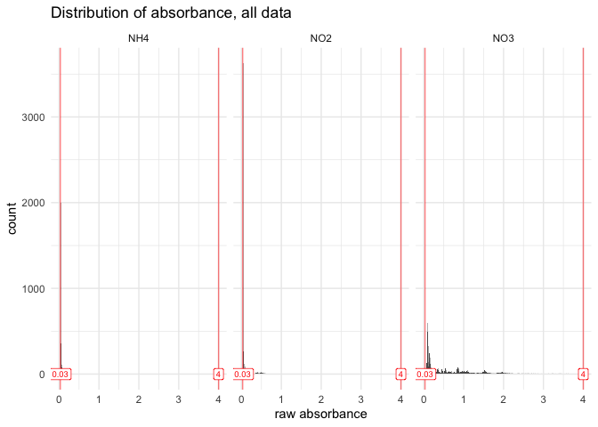
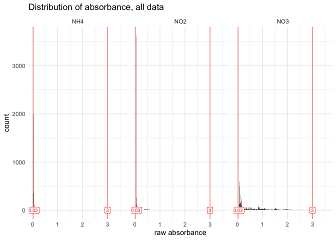
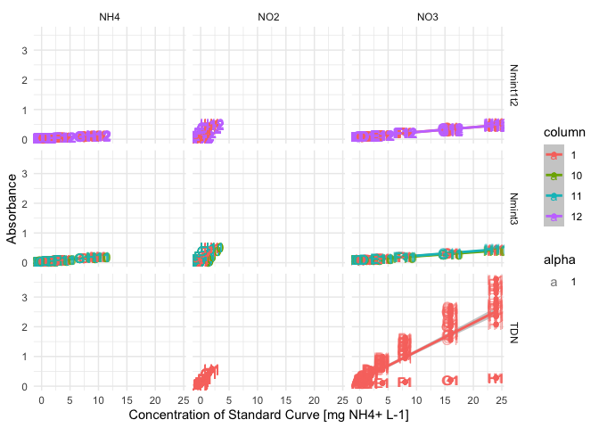
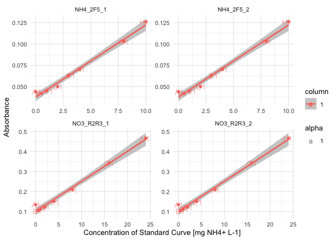

# 2.1.1 Absorbance Data QC
Morgane de Toeuf

- [TO DO](#to-do)
- [Set up](#set-up)
- [1 - Suspicious wells removal](#1---suspicious-wells-removal)
  - [1.1 - Manual records](#11---manual-records)
  - [1.2 - Suspicious absorbance values
    (automated)](#12---suspicious-absorbance-values-automated)
- [2 - Correction for blank](#2---correction-for-blank)
  - [2.1 - Standard curve](#21---standard-curve)

# TO DO

- Check concentrations courbe std de Cloé

# Set up

Loading packages

``` r
rm(list = ls())

library(tidyverse)
```

    ── Attaching core tidyverse packages ──────────────────────── tidyverse 2.0.0 ──
    ✔ dplyr     1.2.1     ✔ readr     2.2.0
    ✔ forcats   1.0.1     ✔ stringr   1.6.0
    ✔ ggplot2   4.0.3     ✔ tibble    3.3.1
    ✔ lubridate 1.9.5     ✔ tidyr     1.3.2
    ✔ purrr     1.2.2     
    ── Conflicts ────────────────────────────────────────── tidyverse_conflicts() ──
    ✖ dplyr::filter() masks stats::filter()
    ✖ dplyr::lag()    masks stats::lag()
    ℹ Use the conflicted package (<http://conflicted.r-lib.org/>) to force all conflicts to become errors

``` r
library(plate2N)
```

Loading data

``` r
all_raw_abs_tidy <- read_rds("output/data/1.1_all_raw_abs_tidy.rds")
all_plate_metadata <- read_rds("output/data/1.1_all_plate_metadata.rds")
```

Joining plate data and metadata

``` r
raw_meta <- all_raw_abs_tidy |> left_join(all_plate_metadata, by = join_by(dataset, plate_id))
#raw_meta |> filter(plate_id == string, map == "Std")
```

# 1 - Suspicious wells removal

## 1.1 - Manual records

This section allows the removal of wells that “we know” are failed wells
(e.g., something went wrong during pipetting…).

First, we create a template document to record identifiers of failed
wells. To unequivocally identify a well, 3 pieces of info are needed:
dataset, plate id, well id.

``` r
(template <- failed_wells_template(nrow = 30))
```

    # A tibble: 30 × 3
       dataset plate_id well_id
       <chr>   <chr>    <chr>  
     1 ""      ""       ""     
     2 ""      ""       ""     
     3 ""      ""       ""     
     4 ""      ""       ""     
     5 ""      ""       ""     
     6 ""      ""       ""     
     7 ""      ""       ""     
     8 ""      ""       ""     
     9 ""      ""       ""     
    10 ""      ""       ""     
    # ℹ 20 more rows

Then we export it as a csv for manual encoding

``` r
write_csv(template, file = "output/template/failed_wells_30.csv")
#write_excel_csv(template, file = "output/template/failed_wells_30.csv")
```

After filling that file manually, we re-import it and correct the tidy
data table

``` r
(failed_wells <- read_csv("raw_data/failed_wells.csv", show_col_types = FALSE))
```

    # A tibble: 1 × 3
      dataset  plate_id well_id
      <chr>    <chr>    <chr>  
    1 Nmint1t2 NO2_2P1  E12    

``` r
raw_abs_tidy <- raw_meta |> remove_wells(failed_wells)
#raw_abs_tidy |> filter(plate_id == string, map == "Std")
```

## 1.2 - Suspicious absorbance values (automated)

Observe values for absorbance (iteratively)

``` r
suspicious_wells <- raw_abs_tidy |> 
  qc_raw_abs(
    min_abs = 0.03, max_abs = 4, 
    plot_col_facet = "std_sp", 
    export_plot = "none") 
```

    Warning in qc_raw_abs(raw_abs_tidy, min_abs = 0.03, max_abs = 4, plot_col_facet = "std_sp", : 3 wells out of 13727 are out of range for absorbance, i.e., not in the set boundaries of [0.03; 4]. 
    See table to identify suspicious wells. 



``` r
suspicious_wells |> slice_max(abs, n = 10)
```

    # A tibble: 3 × 5
      dataset plate_id   well_id map               abs  
      <chr>   <chr>      <chr>   <chr>             <chr>
    1 TDN     NO2_TDN_19 H6      Ur_K2SO4_200_C.1x 0    
    2 TDN     NO2_TDN_19 H7      Ur_K2SO4_200_F.1x 0    
    3 TDN     NO2_TDN_19 H9      Ur_K2SO4_5_C.1x   0    

For now, I decide to remove those wells. To be reviewed

``` r
raw_abs_ok <- raw_abs_tidy |> remove_wells(suspicious_wells)
#raw_abs_ok|> filter(plate_id == string, map == "Std")
```

Check the QC once more

``` r
raw_abs_ok |> 
  qc_raw_abs(min_abs = 0.03, max_abs = 3, 
    plot_col_facet = "std_sp", 
    export_plot = "none") #|> 
```

    Warning in qc_raw_abs(raw_abs_ok, min_abs = 0.03, max_abs = 3, plot_col_facet = "std_sp", : 13 wells out of 13724 are out of range for absorbance, i.e., not in the set boundaries of [0.03; 3]. 
    See table to identify suspicious wells. 



    # A tibble: 13 × 5
       dataset plate_id   well_id map   abs  
       <chr>   <chr>      <chr>   <chr> <chr>
     1 TDN     NO3_TDN_17 H1      Std   3.607
     2 TDN     NO3_TDN_18 H1      Std   3.416
     3 TDN     NO3_TDN_19 H1      Std   3.61 
     4 TDN     NO3_TDN_20 H1      Std   3.581
     5 TDN     NO3_TDN_21 H1      Std   3.398
     6 TDN     NO3_TDN_22 H1      Std   3.213
     7 TDN     NO3_TDN_23 H1      Std   3.362
     8 TDN     NO3_TDN_24 H1      Std   3.296
     9 TDN     NO3_TDN_25 H1      Std   3.244
    10 TDN     NO3_TDN_26 H1      Std   3.253
    11 TDN     NO3_TDN_27 H1      Std   3.222
    12 TDN     NO3_TDN_28 H1      Std   3.437
    13 TDN     NO3_TDN_29 H1      Std   3.126

``` r
  #select(well_id, map) |> unique()
```

It appears that only the most concentrated wells in the standard curve
for TDN (well H1) show absorbance levels above 3. We can later look at
those curves and see whether those points are outside of the linear
range. Not to worry now, though

# 2 - Correction for blank

## 2.1 - Standard curve

Obtain curve concentrations from metadata

``` r
curve_concentration <- extract_curve(all_plate_metadata)
```

Extract Std wells, add unique curve ID, then add curve_concentration

``` r
std_data <- raw_abs_ok |> 
  extract_std_data() |> 
  select(!std_conc) |> 
  left_join(curve_concentration, by = join_by(row, plate_id))
```

Check unstrusted blanks (where the smallest value for a given curve is
not in row A (top_down pipetting) or in row H (bottom_up pipetting)

``` r
blank <- raw_abs_ok |> plate2N::extract_std_blanc()
blank$untrusted
```

    # A tibble: 4 × 6
    # Groups:   dataset, plate_id, column [4]
      well_id dataset  plate_id   column unique_curve_id   abs
      <chr>   <chr>    <chr>      <chr>  <chr>           <dbl>
    1 A1      Nmint1t2 NH4_2F5_1  1      NH4_2F5_1_col1  0.044
    2 A1      Nmint1t2 NH4_2F5_2  1      NH4_2F5_2_col1  0.044
    3 A1      Nmint3   NO3_R2R3_1 1      NO3_R2R3_1_col1 0.134
    4 A1      Nmint3   NO3_R2R3_2 1      NO3_R2R3_2_col1 0.134

``` r
#blank$all |> filter(plate_id == "NO3_R2R3_1")
```

Check it out graphically.

``` r
# get unique curve id for the curves of interest (containing the suspicious wells)
#curve <- blank$untrusted$unique_curve_id

# all data --> too messy. 
std_data |> 
  plot_std() +
  facet_grid(dataset~std_sp)
```



``` r
# Subset: look at suspicious blanks
std_data |> 
  filter(unique_curve_id %in% blank$untrusted$unique_curve_id) |> 
  plot_std() +
  facet_wrap(~plate_id, scales = "free")
```



In this case, all “untrusted wells” are to be removed, as the values in
A1 are clearly out of the curve and probably come from a pipetting error
(failure to eject liquid with the automated pipette).

Should there be a choice, where only some of those wells need to be
removed, but not all, the function `remove_wells()` can be used on
`blank$all` to remove the selection of really-untrusted wells, which
would generate a new version of “trusted wells”, from which the average
values need to be recomputed manually.

``` r
# EXAMPLE, NOT NEEDED IN THIS PIPELINE
# get info on wells to remove

      # (suspicious_wells <- blank$untrusted |> 
      #   ungroup() |> 
      #   select(dataset, plate_id, well_id))

# Here, those wells are in blank$all, which we can use to remove the wells
      # std_blank <- blank$all |> ungroup() |> remove_wells(suspicious_wells)

# In this case, std_blank is the same as blank$trusted, but we could decide to keep some
      # sum(std_blank != blank$trusted)
      # 
      # std_blanc_avg <- std_blank |>
      #     dplyr::summarise(
      #       .by = c(dataset, plate_id),
      #       blanc_avg = mean(abs),
      #       blanc_sdev = stats::sd(abs)
      #     ) |>
      #     dplyr::mutate(blanc_coeff_var_percent = 100 * blanc_sdev / blanc_avg)
```

Checking how many blanks have been removed

``` r
nrow(blank$all) ; nrow(blank$untrusted) ; nrow(blank$trusted) 
```

    [1] 329

    [1] 4

    [1] 325

> [!CAUTION]
>
> ### CAUTION
>
> We are here removing wells with the blank for the standard curve. This
> works because we had 2 curves per plate in those plates.
>
> - Should there have only been 1 curve per plate, it would be more
>   complex, as we cannot afford to have zero value for the blank of the
>   standard curve.
>
> - An option would be to see whether the inter-plate variation in
>   absorbance values for the standard curves is sufficiently small. If
>   so, then maybe the blank value of one plate could be replaced by the
>   mean of other plates.
>
> - In doing so, watch out for batch effect. Maybe inter-plate variation
>   is smallest during a single day of experimentation, etc.
>
> - To be tested and implemented in coding.

Now that we have all the trusted wells with blank values, we can finally
correct absorbance values for the curves

``` r
?correct_std_blank
# std_data <- raw_abs_ok |> 
#   extract_std_data() |> 
#   select(!std_conc) |> 
#   left_join(curve_concentration, by = join_by(row, plate_id))
```
