# 2.1 - From raw Absorbance to Concentration with a Linear Model (incl QC)
Morgane de Toeuf

- [TO DO](#to-do)
- [Set up](#set-up)
- [1 - Suspicious wells removal](#1---suspicious-wells-removal)
  - [1.1 - Manual records, from the
    lab](#11---manual-records-from-the-lab)
  - [1.2 - Suspicious absorbance values
    (automated)](#12---suspicious-absorbance-values-automated)
- [2 - Correction for blank](#2---correction-for-blank)
  - [2.1 - Standard curve](#21---standard-curve)
  - [2.2 - Sample wells](#22---sample-wells)
  - [2.3 - All corrected data](#23---all-corrected-data)
- [3 - Compute regression equation (per
  plate)](#3---compute-regression-equation-per-plate)
  - [3.1 - QC standard curves - round
    1](#31---qc-standard-curves---round-1)
  - [3.2 - Compute per-dilution
    averages](#32---compute-per-dilution-averages)
  - [3.3 - QC standard curves - round
    2](#33---qc-standard-curves---round-2)
  - [3.4 - Multiple curve QC](#34---multiple-curve-qc)
- [4 - From absorbance to
  concentration](#4---from-absorbance-to-concentration)
  - [4.1 - clean up environment](#41---clean-up-environment)
  - [4.2 - Apply regression equation](#42---apply-regression-equation)
- [5 - Export](#5---export)

# TO DO

- FOR Nmin t3
  - Check in lab notebook of Cloé: which dilutions for NH4? Courbes sont
    bizarrement décalées (facteur 2 quasi! ) –\> a l’air ok!
    (effectivement concentrations différentes, mais données probablement
    correctes)

# Set up

Loading packages

Loading data

``` r
all_raw_abs_tidy <- read_rds("output/data/1_all_raw_abs_noTDN.rds")
all_plate_metadata <- read_rds("output/data/1_all_plate_metadata_noTDN.rds")
```

Joining plate data and metadata

``` r
raw_meta <- all_raw_abs_tidy |> 
  left_join(all_plate_metadata, by = join_by(dataset, plate_id))
```

# 1 - Suspicious wells removal

## 1.1 - Manual records, from the lab

wells that “we know” are failed wells, imported

``` r
(failed_wells <- read_csv("raw_data/failed_wells.csv", show_col_types = FALSE))
```

    # A tibble: 9 × 3
      dataset  plate_id   well_id
      <chr>    <chr>      <chr>  
    1 Nmint1t2 NO2_2P1    E12    
    2 Nmint3   NO2_R1R2_1 E3     
    3 Nmint3   NO2_R1R2_2 E3     
    4 Nmint3   NO3_R2R3_1 A1     
    5 Nmint3   NO3_R2R3_2 A1     
    6 <NA>     <NA>       <NA>   
    7 <NA>     <NA>       <NA>   
    8 <NA>     <NA>       <NA>   
    9 <NA>     <NA>       <NA>   

``` r
raw_abs_tidy <- raw_meta |> remove_wells(failed_wells)
```

## 1.2 - Suspicious absorbance values (automated)

Observe values for absorbance (iteratively)

``` r
suspicious_wells <- raw_abs_tidy |> 
  qc_raw_abs(
    min_abs = 0.03, max_abs = 1, 
    plot_col_facet = "std_sp", 
    show_plot = TRUE) 
```

    !! YAY !! All wells are in range for absorbance between 0.03 and 1

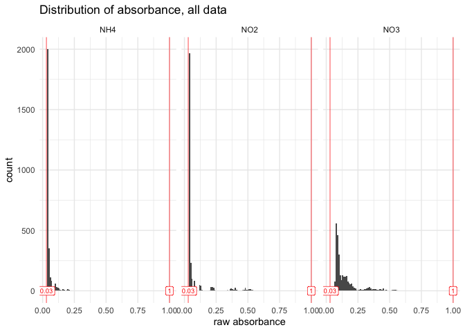

``` r
suspicious_wells |> slice_max(abs, n = 10)
```

    # A tibble: 0 × 5
    # ℹ 5 variables: dataset <chr>, plate_id <chr>, well_id <chr>, map <chr>,
    #   abs <chr>

> [!CAUTION]
>
> ### Check this step
>
> - All wells have raw absorbances within the desired range, nothing to
>   remove
>
> - Do check if indeed `suspicious_wells` remains empty when the script
>   or its raw data are updated
>
> - Should it not be empty, decide what to do: broader range ok? Remove
>   outliers?
>
> - Should some wells be removed, then re-run the `qc_raw_abs()` on the
>   updated data

``` r
# Once validated, store last version in a "validated" data
raw_abs_clean <- raw_abs_tidy
```

# 2 - Correction for blank

## 2.1 - Standard curve

Obtain curve concentrations from metadata

``` r
(curve_concentration <- extract_curve(all_plate_metadata))
```

    # A tibble: 1,080 × 4
       dataset  plate_id  row   std_conc
       <chr>    <chr>     <chr>    <dbl>
     1 Nmint1t2 NH4_1F1   A          0  
     2 Nmint1t2 NH4_1F1   B          0.5
     3 Nmint1t2 NH4_1F1   C          1  
     4 Nmint1t2 NH4_1F1   D          2  
     5 Nmint1t2 NH4_1F1   E          3  
     6 Nmint1t2 NH4_1F1   F          4  
     7 Nmint1t2 NH4_1F1   G          8  
     8 Nmint1t2 NH4_1F1   H         10  
     9 Nmint1t2 NH4_1F2_1 A          0  
    10 Nmint1t2 NH4_1F2_1 B          0.5
    # ℹ 1,070 more rows

Extract Std wells, add unique curve ID, then add curve_concentration

``` r
std_data <- raw_abs_clean |> 
  extract_std_data() |> 
  select(!std_conc) |> 
  left_join(curve_concentration, by = join_by(row, dataset, plate_id))
```

Check unstrusted blanks (where the smallest value for a given curve is
not in row A (top_down pipetting) or in row H (bottom_up pipetting)

``` r
std_blank <- raw_abs_clean |> extract_std_blank()
std_blank$untrusted
```

    # A tibble: 2 × 8
    # Groups:   dataset, plate_id, column [2]
      well_id dataset  plate_id  column unique_curve_id row   unique_well_id   abs
      <chr>   <chr>    <chr>     <chr>  <chr>           <chr> <chr>          <dbl>
    1 A1      Nmint1t2 NH4_2F5_1 1      NH4_2F5_1_col1  A     A1_NH4_2F5_1   0.044
    2 A1      Nmint1t2 NH4_2F5_2 1      NH4_2F5_2_col1  A     A1_NH4_2F5_2   0.044

``` r
#blank$all |> filter(plate_id == "NO3_R2R3_1")
```

Check it out graphically.

``` r
# Subset: look at suspicious blanks
std_data |> 
  filter(unique_curve_id %in% std_blank$untrusted$unique_curve_id) |> 
  plot_std(through_origin = FALSE) +
  facet_wrap(~plate_id, scales = "free")
```

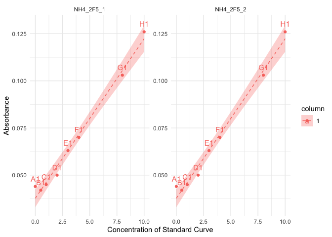

In this case, all “untrusted wells” (A1 in 4 panels of the last plot)
are to be removed, as the values in A1 are clearly out of the curve (not
rare: failure to eject liquid with the automated pipette).

> [!TIP]
>
> ### When we trust some “untrusted” wells
>
> Should there be a choice, where only some of those wells need to be
> removed, but not all, the function `remove_wells()` can be used on
> `blank$all` to remove the selection of really-untrusted wells, which
> would generate a new version of “trusted wells”, from which the
> average values need to be recomputed manually.

Checking how many blanks have been removed

``` r
nrow(std_blank$all) ; nrow(std_blank$untrusted) ; nrow(std_blank$trusted) 
```

    [1] 268

    [1] 2

    [1] 266

> [!CAUTION]
>
> ### CAUTION
>
> We are here removing wells with the blank for the standard curve. This
> works because we had 2 curves per plate in those plates.
>
> - Should there have only been 1 curve per plate, it would be more
>   complex, as we cannot afford to have zero value for the blank of the
>   standard curve.
>
> - An option would be to see whether the inter-plate variation in
>   absorbance values for the standard curves is sufficiently small. If
>   so, then maybe the blank value of one plate could be replaced by the
>   mean of other plates.
>
> - In doing so, watch out for batch effect. Maybe inter-plate variation
>   is smallest during a single day of experimentation, etc.
>
> - To be tested and implemented in coding.

Now that we have all the trusted wells with blank values, we can finally
correct absorbance values for the standard curves

Because the logic is similar, we will first go into blank-correction of
sample data before finalizing work on the standard curves (applying
linear regression model)

## 2.2 - Sample wells

First, extract data for wells containing extractant and have a look at
its variation

``` r
extr_data <- extract_extractant(raw_abs_clean)
(blank_avg <- extractant_average(raw_abs_clean) |> 
  arrange(desc(blank_coeff_var_percent)))
```

    # A tibble: 135 × 5
       plate_id   map   blank_avg blank_sdev blank_coeff_var_percent
       <chr>      <chr>     <dbl>      <dbl>                   <dbl>
     1 NH4_2F2_2  extr     0.0405    0.00748                   18.5 
     2 NO3_R7R8_1 extr     0.0825    0.0135                    16.4 
     3 NO2_R4R5_1 extr     0.039     0.00270                    6.91
     4 NH4_2P2    extr     0.0401    0.00242                    6.02
     5 NO3_2F1_1  extr     0.0718    0.00377                    5.25
     6 NO2_2P6_1  extr     0.0372    0.00158                    4.24
     7 NO2_2F1_1  extr     0.0376    0.00151                    4.00
     8 NO2_2F6_1  extr     0.0368    0.00139                    3.78
     9 NO2_R2R3_1 extr     0.0395    0.00120                    3.03
    10 NO2_2F6_2  extr     0.0365    0.00107                    2.93
    # ℹ 125 more rows

``` r
plot_blank_var_distrib(blank_avg)
```

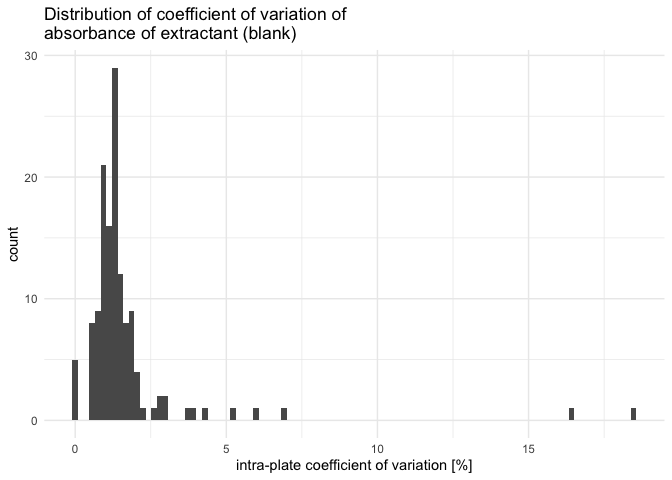

We see that a few plates have a very high coefficient of variation, we
will have to look at them individually. Let’s set the threshold for the
coefficient of variation at 5% (default)

``` r
threshold <- 5

suspicious_plates <- raw_abs_clean |> 
  qc_raw_extr(suppress_warning = TRUE, max_coeff = threshold)

suspicious_extr <- suspicious_extr(
  raw_abs_clean, suspicious_plate_id = suspicious_plates, max_coeff = threshold)

# check it out
suspicious_extr
```

    # A tibble: 52 × 13
    # Groups:   plate_id, map [5]
       row   column well_id unique_well_id dataset  plate_id  map     abs std_sp
       <chr> <chr>  <chr>   <chr>          <chr>    <chr>     <chr> <dbl> <chr> 
     1 A     8      A8      A8_NH4_2F2_2   Nmint1t2 NH4_2F2_2 extr  0.038 NH4   
     2 B     8      B8      B8_NH4_2F2_2   Nmint1t2 NH4_2F2_2 extr  0.037 NH4   
     3 C     8      C8      C8_NH4_2F2_2   Nmint1t2 NH4_2F2_2 extr  0.038 NH4   
     4 D     8      D8      D8_NH4_2F2_2   Nmint1t2 NH4_2F2_2 extr  0.038 NH4   
     5 E     8      E8      E8_NH4_2F2_2   Nmint1t2 NH4_2F2_2 extr  0.038 NH4   
     6 F     8      F8      F8_NH4_2F2_2   Nmint1t2 NH4_2F2_2 extr  0.038 NH4   
     7 G     8      G8      G8_NH4_2F2_2   Nmint1t2 NH4_2F2_2 extr  0.038 NH4   
     8 H     8      H8      H8_NH4_2F2_2   Nmint1t2 NH4_2F2_2 extr  0.059 NH4   
     9 A     8      A8      A8_NH4_2P2     Nmint1t2 NH4_2P2   extr  0.039 NH4   
    10 B     8      B8      B8_NH4_2P2     Nmint1t2 NH4_2P2   extr  0.039 NH4   
    # ℹ 42 more rows
    # ℹ 4 more variables: std_conc <chr>, std_unit <chr>, sample_dilution <chr>,
    #   date <chr>

``` r
# plot outliers
suspicious_extr |> boxplot_outlier_extr(max_coeff = threshold)
```

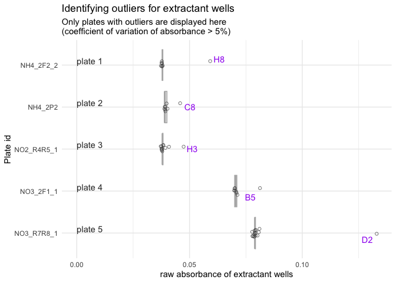

We have 5 plates that each have one or more obvious outlier well. We
will need to remove them manually.

First, we create a small tibble that will serve to construct the tibble
of wells to remove

``` r
plate_ids <- suspicious_extr |> 
  ungroup() |> 
  select(dataset, plate_id) |> unique() 
plate_ids <- plate_ids |> # save numbers for plate order in the plot
  mutate(plate_order = seq(1, nrow(plate_ids)))
```

Then, we create a vector with wells to remove (going through boxplots
from top to bottom).

> [!TIP]
>
> ### Manually remove outliers
>
> In the following chunk, you need to manually decide which wells to
> remove, based on the boxplots produced above.
>
> - Make sure to deal appropriately with plates that require 2 outliers
>   or no outlier to be removed (see example below)

``` r
#** !!! MANUAL INPUT !!! *

# Which plate needs 2 outliers removed?
plate_with_2_outliers <- 3
plate_without_outliers <- 9 # use a number > nb of plates if there is no such plate

# Which wells are outliers? 
well_ids <- c("H8", "C8", "G3", "H3", "B5", "D2") 
```

Then we finish constructing the tibble of wells to be removed

``` r
to_remove <- plate_ids |> 
  bind_rows(plate_ids |> filter(plate_order == plate_with_2_outliers)) |> 
  arrange(plate_order) |> 
  mutate(well_id = well_ids) |> 
  filter(plate_order != plate_without_outliers) |> #remove plate without outliers
  select(!plate_order)
```

Checking that we didn’t get confused: look at `to_remove` in parallel to
the boxplot

``` r
to_remove
```

    # A tibble: 6 × 3
      dataset  plate_id   well_id
      <chr>    <chr>      <chr>  
    1 Nmint1t2 NH4_2F2_2  H8     
    2 Nmint1t2 NH4_2P2    C8     
    3 Nmint3   NO2_R4R5_1 G3     
    4 Nmint3   NO2_R4R5_1 H3     
    5 Nmint1t2 NO3_2F1_1  B5     
    6 Nmint3   NO3_R7R8_1 D2     

Looks good, so we remove it from extractant data and recompute the
average

``` r
extr_data_clean <- extr_data |> 
  remove_wells(to_remove) 

blank_avg_clean <- extractant_average(extractant_data = extr_data_clean) 
```

Check that biggest coeff_var indeed below threshold

``` r
blank_avg_clean |> arrange(desc(blank_coeff_var_percent)) |> head()
```

    # A tibble: 6 × 5
      plate_id   map   blank_avg blank_sdev blank_coeff_var_percent
      <chr>      <chr>     <dbl>      <dbl>                   <dbl>
    1 NO2_2P6_1  extr     0.0372    0.00158                    4.24
    2 NO2_2F1_1  extr     0.0376    0.00151                    4.00
    3 NO2_2F6_1  extr     0.0368    0.00139                    3.78
    4 NO2_R2R3_1 extr     0.0395    0.00120                    3.03
    5 NO2_2F6_2  extr     0.0365    0.00107                    2.93
    6 NO2_R6R7_2 extr     0.0368    0.00105                    2.84

Now that we are confident in the per-plate average value of raw
absorbance of extractant wells, we can finally blank-correct all sample
data

## 2.3 - All corrected data

Let’s just recall all corrected data. We have 2 separate tibbles
(because the experimental design was arranged to have separate blanks
for the curve and the samples)

``` r
# Standard curve, blank-corrected and clean
std_corrected 
```

    # A tibble: 1,889 × 16
       row   column well_id unique_well_id dataset  plate_id  unique_curve_id map  
       <chr> <chr>  <chr>   <chr>          <chr>    <chr>     <chr>           <chr>
     1 B     1      B1      B1_NH4_1F1     Nmint1t2 NH4_1F1   NH4_1F1_col1    Std  
     2 B     1      B1      B1_NH4_1F2_1   Nmint1t2 NH4_1F2_1 NH4_1F2_1_col1  Std  
     3 B     1      B1      B1_NH4_1F2_2   Nmint1t2 NH4_1F2_2 NH4_1F2_2_col1  Std  
     4 B     1      B1      B1_NH4_1F3     Nmint1t2 NH4_1F3   NH4_1F3_col1    Std  
     5 B     1      B1      B1_NH4_1F4     Nmint1t2 NH4_1F4   NH4_1F4_col1    Std  
     6 B     1      B1      B1_NH4_1F5     Nmint1t2 NH4_1F5   NH4_1F5_col1    Std  
     7 B     1      B1      B1_NH4_1G1     Nmint1t2 NH4_1G1   NH4_1G1_col1    Std  
     8 B     1      B1      B1_NH4_1G2     Nmint1t2 NH4_1G2   NH4_1G2_col1    Std  
     9 B     1      B1      B1_NH4_1G3     Nmint1t2 NH4_1G3   NH4_1G3_col1    Std  
    10 B     1      B1      B1_NH4_1G4     Nmint1t2 NH4_1G4   NH4_1G4_col1    Std  
    # ℹ 1,879 more rows
    # ℹ 8 more variables: abs_corrected <dbl>, std_sp <chr>, std_unit <chr>,
    #   sample_dilution <chr>, date <chr>, std_conc <dbl>, blank_sdev <dbl>,
    #   blank_coeff_var_percent <dbl>

``` r
# Samples, blank-corrected and clean
samples_corrected
```

    # A tibble: 4,871 × 15
       row   column well_id unique_well_id dataset  plate_id  map      abs_corrected
       <chr> <chr>  <chr>   <chr>          <chr>    <chr>     <chr>            <dbl>
     1 A     2      A2      A2_NH4_1F1     Nmint1t2 NH4_1F1   81_t1_z2      0.007   
     2 A     2      A2      A2_NH4_1F2_1   Nmint1t2 NH4_1F2_1 97_t1_z1      0.00350 
     3 A     2      A2      A2_NH4_1F3     Nmint1t2 NH4_1F3   89_t1_z3      0.00288 
     4 A     2      A2      A2_NH4_1F4     Nmint1t2 NH4_1F4   81_t1_z1      0.00725 
     5 A     2      A2      A2_NH4_1F5     Nmint1t2 NH4_1F5   Std_3_t1      0.0229  
     6 A     2      A2      A2_NH4_1G1     Nmint1t2 NH4_1G1   1_t1          0.00100 
     7 A     2      A2      A2_NH4_1G2     Nmint1t2 NH4_1G2   17_t1         0.000875
     8 A     2      A2      A2_NH4_1G3     Nmint1t2 NH4_1G3   33_t1         0.00288 
     9 A     2      A2      A2_NH4_1G4     Nmint1t2 NH4_1G4   49_t1         0.000125
    10 A     2      A2      A2_NH4_1G5     Nmint1t2 NH4_1G5   65_t1         0.00175 
    # ℹ 4,861 more rows
    # ℹ 7 more variables: std_sp <chr>, std_conc <chr>, std_unit <chr>,
    #   sample_dilution <chr>, date <chr>, blank_sdev <dbl>,
    #   blank_coeff_var_percent <dbl>

# 3 - Compute regression equation (per plate)

## 3.1 - QC standard curves - round 1

Assumptions of a linear model: (taken
[here](https://towardsdatascience.com/all-the-statistical-tests-you-must-do-for-a-good-linear-regression-6ec1ac15e5d4/),
apparently from [Spanish
book](https://periodicos.ufpe.br/revistas/politicahoje/article/download/3808/31622))

- The residuals must follow a normal distribution.

- The residuals are homogeneous, there is homoscedasticity.

- There’s no outliers in the errors.

- There’s no autocorrelation in the errors.

!!! FORMULATE better and split in 2 chunks :-)

First, we perform a linear model on each curve individually (i.e.,
possibly several curves per plate).

Then we take a subset to examine individually: those curves where the
linear model doesn’t seem to perform ideally (e.g., non-significant
model (p-value \> 0.05), residuals not normally distributed, or
heteroscedasticity)

``` r
lm_table_raw <- lm_std_curve(std_corrected |> group_by(plate_id, column))

# extract all plates where "something" is not perfect 
(lm_table_suspicious <- lm_table_raw |> 
  suspicious_lm())
```

    # A tibble: 44 × 11
       plate_id  unique_curve_id std_sp   slope r_squared adj_r_squared         lm_p
       <chr>     <chr>           <chr>    <dbl>     <dbl>         <dbl>        <dbl>
     1 NH4_1F1   NH4_1F1_col1    NH4    0.00798     0.990         0.988      3.19e-7
     2 NH4_1G2   NH4_1G2_col12   NH4    0.00600     0.988         0.986      5.56e-7
     3 NH4_2F1_1 NH4_2F1_1_col12 NH4    0.00884     0.996         0.995      1.94e-8
     4 NH4_2F1_2 NH4_2F1_2_col12 NH4    0.00884     0.996         0.995      1.94e-8
     5 NH4_2F2_1 NH4_2F2_1_col1  NH4    0.00800     0.998         0.997      3.95e-9
     6 NH4_2F2_2 NH4_2F2_2_col1  NH4    0.00800     0.998         0.997      3.95e-9
     7 NH4_2F4_1 NH4_2F4_1_col1  NH4    0.00857     0.990         0.988      3.62e-7
     8 NH4_2F4_2 NH4_2F4_2_col1  NH4    0.00857     0.990         0.988      3.62e-7
     9 NH4_2P1   NH4_2P1_col1    NH4    0.00887     0.990         0.988      3.57e-7
    10 NH4_2P2   NH4_2P2_col12   NH4    0.00800     0.995         0.994      4.21e-8
    # ℹ 34 more rows
    # ℹ 4 more variables: normality_lm_residuals <chr>, shapiro_p <dbl>,
    #   homoscedasticity_lm_residuals <chr>, breusch_pagan_p <dbl>

Then, for visual support, we create a list of plots where we store each
individual plot of “suspicious” standard curves

``` r
suspicious_lm_plotlist <- plot_list_lm(
  lm_data = lm_table_suspicious,
  std_data = std_corrected)

# check one plot out
suspicious_lm_plotlist[[2]]
```

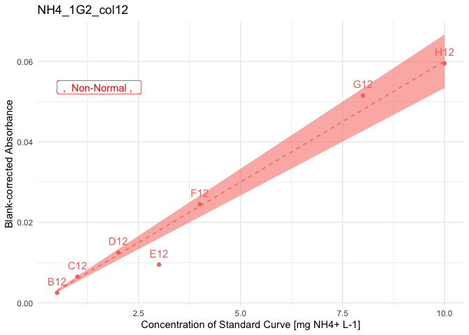

Now we can look at each plot individually. Because there are still 45
plots to review, we will look through them in 3 batches of 15 plots.

``` r
n_plots <- length(suspicious_lm_plotlist)
batch <- 15

batch_1 <- suspicious_lm_plotlist |> head(n = batch)
batch_2 <- suspicious_lm_plotlist |> tail(n = n_plots-batch) |> head(n = batch)
batch_3 <- suspicious_lm_plotlist |> tail(n = n_plots-(2*batch)) 

patchwork::wrap_plots(batch_1, axis_titles = "keep") +
     patchwork::plot_annotation(title = "Plots of suspicious Standard curves")
```

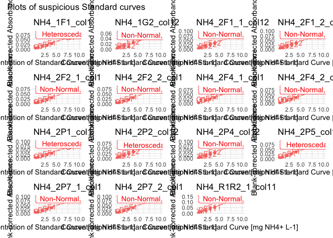

``` r
patchwork::wrap_plots(batch_2, axis_titles = "keep") +
     patchwork::plot_annotation(title = "Plots of suspicious Standard curves")
```

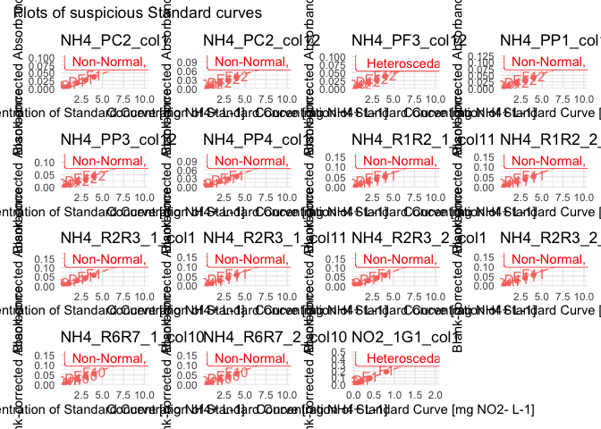

``` r
patchwork::wrap_plots(batch_3, axis_titles = "keep") +
     patchwork::plot_annotation(title = "Plots of suspicious Standard curves")
```

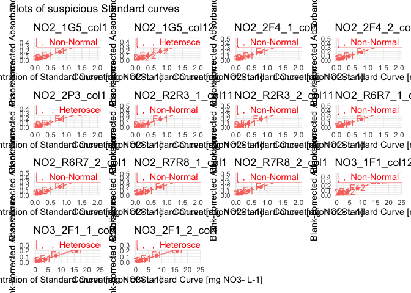

Most plates are from NH4 and NO2. Because most measurement of NH4 and
NO2 are close to zero, it might be relevant to just remove highest
points of the curve to get a better fit.

Let’s check how high the absorbance goes with these data sets, for each
N species. When comparing those highest values with the plots above, we
see that the highest absorbance for NO2 and NH4 is far below the most
concentrated point of the standard curve –\> we can remove row H for
sure, but row G probably not.

This is not the case for NO3, or at least not for the TDN dataset, or
part of it.

``` r
samples_corrected |> filter(std_sp == "NO2") |> 
  arrange(desc(abs_corrected)) |> slice_head(n = 3)
```

    # A tibble: 3 × 15
      row   column well_id unique_well_id dataset  plate_id map      abs_corrected
      <chr> <chr>  <chr>   <chr>          <chr>    <chr>    <chr>            <dbl>
    1 A     2      A2      A2_NO2_1F5     Nmint1t2 NO2_1F5  Std_3_t1         0.177
    2 C     2      C2      C2_NO2_1F5     Nmint1t2 NO2_1F5  Std_3_t1         0.174
    3 D     2      D2      D2_NO2_1F5     Nmint1t2 NO2_1F5  Std_3_t1         0.173
    # ℹ 7 more variables: std_sp <chr>, std_conc <chr>, std_unit <chr>,
    #   sample_dilution <chr>, date <chr>, blank_sdev <dbl>,
    #   blank_coeff_var_percent <dbl>

``` r
samples_corrected |> filter(std_sp == "NH4") |> 
  arrange(desc(abs_corrected)) |> slice_head(n = 3)
```

    # A tibble: 3 × 15
      row   column well_id unique_well_id dataset plate_id   map       abs_corrected
      <chr> <chr>  <chr>   <chr>          <chr>   <chr>      <chr>             <dbl>
    1 A     6      A6      A6_NH4_R2R3_1  Nmint3  NH4_R2R3_1 std_R2_t3        0.0384
    2 B     6      B6      B6_NH4_R2R3_1  Nmint3  NH4_R2R3_1 std_R2_t3        0.0384
    3 C     6      C6      C6_NH4_R2R3_1  Nmint3  NH4_R2R3_1 std_R2_t3        0.0374
    # ℹ 7 more variables: std_sp <chr>, std_conc <chr>, std_unit <chr>,
    #   sample_dilution <chr>, date <chr>, blank_sdev <dbl>,
    #   blank_coeff_var_percent <dbl>

Let’s first list wells to remove the H row of NO2 and NH4 std., and add
the following (see multiplots above)

- NH4_1G2: E12

- NH4_2F4_1 & 2: C1

``` r
to_remove_nh4_no2_h <- std_corrected |> 
  filter(
    (std_sp == "NH4" & row %in% c("G", "H")) |
      (std_sp == "NO2" & row == "H")) |> 
  select(dataset, plate_id, well_id) |> 
  bind_rows(tibble(
    dataset = rep("Nmint1t2", 3),
    plate_id = c("NH4_1G2", "NH4_2F4_1", "NH4_2F4_2"),
    well_id = c("E12", "C1", "C1")
  ))
```

Then, let’s look at suspicious plots for NO3 only, so we can see the
plots better

``` r
lm_table_suspicious_NO3 <- lm_table_suspicious |> 
  # extract N_sp from plate name. May be done differently, this is just one of many possible approaches
  separate_wider_delim(
    cols = unique_curve_id, delim = "_", 
    names = c("N_sp", "rest"), 
    too_many = "merge", cols_remove = FALSE) |> 
  select(!rest) |> 
  filter(N_sp == "NO3")

# Create plot list
lm_plot_list_NO3 <- plot_list_lm(
  lm_data = lm_table_suspicious_NO3,
  std_data = std_corrected)

patchwork::wrap_plots(lm_plot_list_NO3, axis_titles = "keep") +
     patchwork::plot_annotation(title = "Plots of suspicious Standard curves")
```

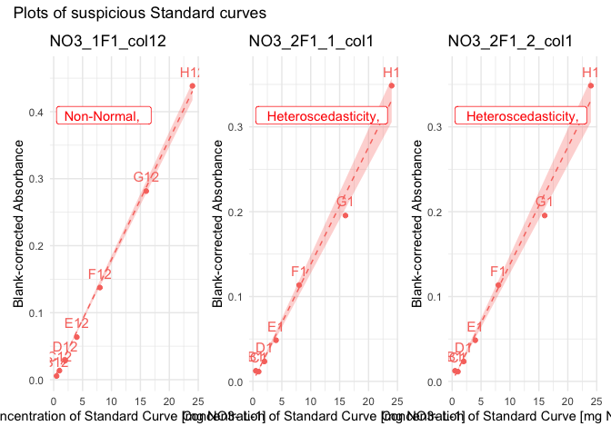

For the NO3 plates, the issue has to be solved differently, but those
are just a few –\> individual appraisal. We see here that we cannot
remove the H row, because some points seem to have an absorbance above
that of the G row of the standard.

``` r
samples_corrected |> 
  filter(std_sp == "NO3") |> 
  arrange(desc(abs_corrected)) |> 
  slice_head(n = 3)
```

    # A tibble: 3 × 15
      row   column well_id unique_well_id dataset  plate_id  map       abs_corrected
      <chr> <chr>  <chr>   <chr>          <chr>    <chr>     <chr>             <dbl>
    1 H     3      H3      H3_NO3_2F6_1   Nmint1t2 NO3_2F6_1 110_t2_M…         0.329
    2 H     10     H10     H10_NO3_2F6_2  Nmint1t2 NO3_2F6_2 110_t2_M…         0.326
    3 E     10     E10     E10_NO3_2F6_2  Nmint1t2 NO3_2F6_2 110_t2_M…         0.317
    # ℹ 7 more variables: std_sp <chr>, std_conc <chr>, std_unit <chr>,
    #   sample_dilution <chr>, date <chr>, blank_sdev <dbl>,
    #   blank_coeff_var_percent <dbl>

For NO3_2F1 and NO3_1F1: there were probably 2 columns, so I can look at
both columns together

``` r
lm_table_raw |> 
  separate_wider_delim(
    cols = unique_curve_id, delim = "_", 
    names = c("n_sp", "plate", "rest"), 
    too_many = "merge", cols_remove = FALSE) |> 
  filter(n_sp == "NO3", plate %in% c("1F1", "2F1")) |> 
  plot_list_lm(std_data = std_corrected) |> 
  patchwork::wrap_plots()
```

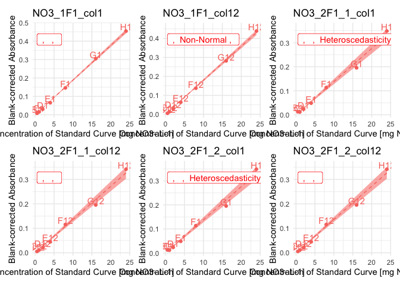

–\> remove B1 from NO3_2F1_1 and NO3_2F1_2

–\> for NO3_1F1, we cannot do much, but maybe the average will be enough
to correct the defects

Then re-compute linear model table as “clean” version.

Then apply it

``` r
std_corrected_wash1 <- 
  std_corrected |> 
  remove_wells(
    to_remove_nh4_no2_h |> 
      bind_rows(tibble(
        dataset = rep("Nmint1t2",2),
        plate_id = c("NO3_2F1_1", "NO3_2F1_2"),
        well_id = rep("B1",2)
        ))
    )
```

Run the quality check once more

``` r
lm_table_wash1 <- lm_std_curve(std_corrected_wash1 |> group_by(plate_id, column))

# extract all plates where "something" is not perfect 
lm_table_suspicious_wash1 <- lm_table_wash1 |> suspicious_lm()

suspicious_lm_plotlist_wash1 <- plot_list_lm(
  lm_data = lm_table_suspicious_wash1,
  std_data = std_corrected_wash1)

n_plots <- length(suspicious_lm_plotlist_wash1)
batch <- 9

batch_1 <- suspicious_lm_plotlist_wash1 |> head(n = batch)
batch_2 <- suspicious_lm_plotlist_wash1 |> tail(n = n_plots-batch) |> head(n = batch)

patchwork::wrap_plots(batch_1, axis_titles = "keep") +
     patchwork::plot_annotation(title = "Plots of suspicious Standard curves")
```

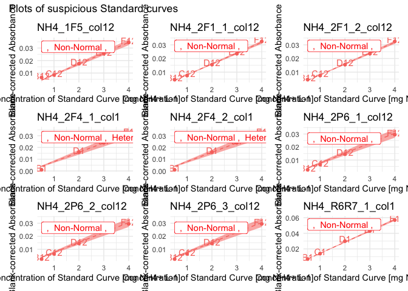

``` r
patchwork::wrap_plots(batch_2, axis_titles = "keep") +
     patchwork::plot_annotation(title = "Plots of suspicious Standard curves")
```

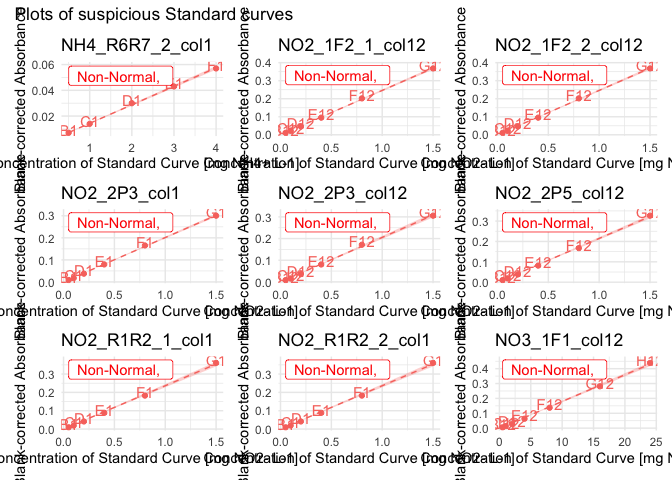

We still get 18 “suspicious” curves. But when we look at the p-values to
reject normality or heteroscedasticity, they are indeed below 0.05, but
it’s also not 10^-5 or something like that. The smallest p-value
(shapiro) is at 0.003.

Let’s compute the means per dilution and see…

## 3.2 - Compute per-dilution averages

Most plates in our dataset have 2 columns with the standard curves. It
seems that the ~1min delay between the 2 (column 1 and column 12 of the
plate) are responsible for a slight shift (example in plot below)

``` r
std_corrected_wash1 |> filter(plate_id == "NO3_2F3_1") |> rename(abs = abs_corrected) |> 
  plot_std()
```

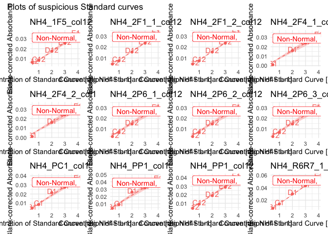

So we will now compute the mean for same row (e.g., mean of H1 and H12)

> [!WARNING]
>
> ### WARNING
>
> The next step computes per plate per row means for the standard
> curves.
>
> If some wells have been swapped in some plates, this may cause
> problems. Make sure there was no pipetting issue, or correct raw data
> or solve it through code

``` r
std_dilution_avg <- std_dilution_average(std_corrected_wash1)
```

## 3.3 - QC standard curves - round 2

We repeat same steps as above: computation of linear model,
identification of suspicious curves and plotting. We only have 5 curves
left that are suspicious.

``` r
lm_std_avg <- lm_std_curve(std_dilution_avg |> rename(abs_corrected = abs_mean))
lm_suspicious_avg <- lm_std_avg |> suspicious_lm()

lm_plots_avg <- lm_suspicious_avg |> plot_list_lm(
  std_data = std_dilution_avg |> rename(abs_corrected = abs_mean))

lm_plots_avg |> patchwork::wrap_plots()
```

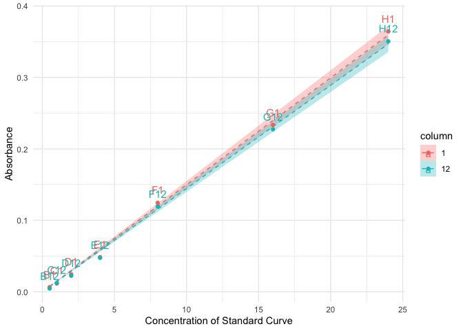

Now, we decide to get rid of just a few wells that really stick out, for
the following plates:

–\> remove G13 from NO3_2F1_1 and NO3_2F1_2

Let’s compose a “to_remove” tibble

``` r
to_remove <- std_dilution_avg |> 
  ungroup() |> 
  select(dataset, plate_id, well_id) |> 
  filter(
    (plate_id %in% c("NO3_2F1_1", "NO3_2F1_2")) & (well_id == "G13")
  )

std_corrected_wash2 <- std_dilution_avg |> 
  remove_wells(to_remove) |> 
  rename(abs_corrected = abs_mean)
```

One more run of QC to check if we are satisfied with the resulting
curves

``` r
lm_wash2 <- lm_std_curve(std_corrected_wash2)
lm_suspicious_wash2 <- lm_wash2 |> suspicious_lm()

lm_plots_wash2 <- plot_list_lm(lm_suspicious_wash2, std_corrected_wash2)
lm_plots_wash2 |> patchwork::wrap_plots()  
```

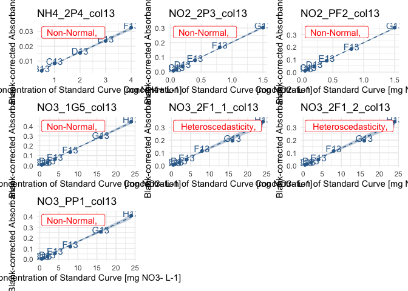

Ok, good enough!

Let’s store the last correction into a clean variable name to reduce
possible confusion, and let’s compute all the plots in a big list, for
storage purposes. We then export this as one output data in a single
list

``` r
std_data_clean <- std_corrected_wash2
lm_table_clean <- lm_wash2
lm_plots_clean <- plot_list_lm(lm_table_clean, std_data_clean)

lm_output <- list(
  "std_data_clean" = std_data_clean,
  "lm_table_clean" = lm_table_clean,
  "lm_plots_clean" = lm_plots_clean,
  "samples_corrected" = samples_corrected
)

lm_output |> write_rds("output/data/2_lm_output_noTDN.rds")
```

## 3.4 - Multiple curve QC

First, let’s look at the distribution of p-values of the std curve
regressions

``` r
p_threshold <- 0.05

lm_output$lm_table_clean |> 
  separate_wider_delim(
    cols = unique_curve_id, delim = "_", 
    names = c("n_sp", "rest"), too_many = "merge") |>
  ggplot(aes(x = -log(lm_p))) + 
  theme_minimal() +
  # geom_histogram() +
  geom_density() +
  geom_vline(aes(xintercept = -log(p_threshold)), linetype = 2, colour = "purple") +
  annotate(
    geom = "label", label = paste0("p-val = ", p_threshold),
    x = -log(p_threshold), y = 0.15, hjust = 0.25, colour = "purple" ) +
  facet_wrap(~n_sp, nrow = 3) +
  xlim(0,max(-log(lm_output$lm_table_clean$lm_p))) +
  xlab("-log(p-value of linear model)") +
  labs(
    title = "Distribution of p-values of the linear model",
    subtitle = "logarithmic scale"
  )
```

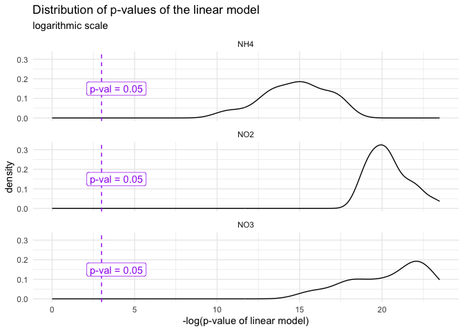

Then, same with R_squared (or adjusted?)

``` r
threshold <- 95

lm_output$lm_table_clean |> 
  separate_wider_delim(
    cols = unique_curve_id, delim = "_", 
    names = c("n_sp", "rest"), too_many = "merge") |>
  ggplot(aes(x = adj_r_squared, colour = n_sp, fill = n_sp)) + 
  theme_minimal() +
  #geom_histogram() +
  geom_density(alpha = 0.3) +
  geom_vline(aes(xintercept = 0.95), linetype = 2, colour = "purple") +
  annotate(
    geom = "label", label = paste0("adjusted R2 = ", threshold, "%"),
    x = threshold/100, y = 500, hjust = 0.25, colour = "purple" ) +
  #facet_wrap(~n_sp, nrow = 3, scales = "free_y") +
  xlim(
    0.945,
    max(lm_output$lm_table_clean$adj_r_squared)) +
  xlab("Adjusted R2") +
  labs(
    title = "Distribution of adjusted R2 values of the linear model"
  )
```

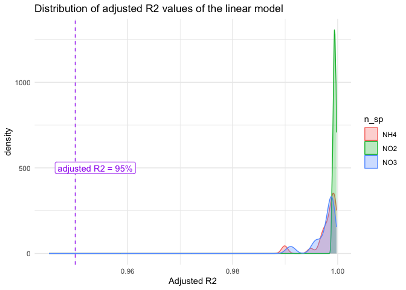

Now we plot all curves on same plot

``` r
colors <- c("#7FC97F", "#BEAED4", "#FDC086")

lm_output$std_data_clean |> 
  ggplot(aes(x = as.numeric(std_conc), y = abs_corrected, groups = plate_id, colour = dataset, fill = dataset)) +
  theme_minimal() + 
  theme(legend.position = "bottom") +
  geom_smooth(
    formula = y~x-1, method = "lm", se = TRUE, 
    alpha = 0, linetype = 1, linewidth = 0.15) +
  geom_point(alpha = 0.5) +
  facet_wrap(~std_sp, scales = "free") +
  scale_color_discrete(palette = colors[1:2]) +
  scale_fill_discrete(palette = colors[1:2]) +
  xlab("Standard Concentration [mg N-species / L]") +
  ylab("Blank-corrected absorbance") +
  labs(title = "Inter-plate variability of the Standard Curves")
```

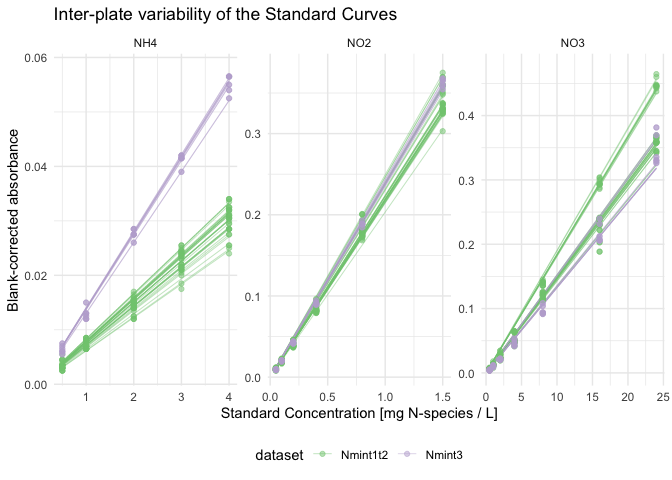

Now, finally, I decide that I am happy with my standard curves, so I can
move on to apply the equations on my data

# 4 - From absorbance to concentration

## 4.1 - clean up environment

To make sure that we don’t get confused on variable names and take old
versions from the QC pipeline

``` r
rm(list = ls())
```

``` r
lm_output <- read_rds("output/data/2_lm_output_noTDN.rds")
```

## 4.2 - Apply regression equation

Check that we are now left with only one curve per plate

``` r
if (
  (lm_output$std_data_clean |> group_by(plate_id) |>  n_groups()) == 
  (lm_output$std_data_clean |> group_by(unique_curve_id) |>  n_groups())
) {message("All good: there is exactly one curve per plate")} else {
  warning("Warning: there is at least one plate with several curves")
}
```

    All good: there is exactly one curve per plate

Regression equation is Abs = slope \* Concentration

Here, we

- connect regression data to sample absorbance data

- apply the regression equation to go from absorbance to concentration
  in mg N-sp per L

- convert unit to mg N per L

``` r
data_mg_N_L <- 
  # add slope + info regression (p-val and R2) to absorbance data
  reg_join_abs(
    lm_output$lm_table_clean, 
    lm_output$samples_corrected, 
    target_sp = "N") |> 
  # compute concentration from absorbance
  mutate(conc_mgNsp_L = abs_corrected / slope) |> 
  convert_molec(masses = molar_masses)

# check it out
data_mg_N_L
```

    # A tibble: 4,871 × 12
       dataset  plate_id  map      abs_corrected std_sp target_sp std_unit     slope
       <chr>    <chr>     <chr>            <dbl> <chr>  <chr>     <chr>        <dbl>
     1 Nmint1t2 NH4_1F1   81_t1_z2      0.007    NH4    N         mg NH4+ L… 0.00739
     2 Nmint1t2 NH4_1F2_1 97_t1_z1      0.00350  NH4    N         mg NH4+ L… 0.00713
     3 Nmint1t2 NH4_1F3   89_t1_z3      0.00288  NH4    N         mg NH4+ L… 0.00776
     4 Nmint1t2 NH4_1F4   81_t1_z1      0.00725  NH4    N         mg NH4+ L… 0.00697
     5 Nmint1t2 NH4_1F5   Std_3_t1      0.0229   NH4    N         mg NH4+ L… 0.00834
     6 Nmint1t2 NH4_1G1   1_t1          0.00100  NH4    N         mg NH4+ L… 0.00612
     7 Nmint1t2 NH4_1G2   17_t1         0.000875 NH4    N         mg NH4+ L… 0.00620
     8 Nmint1t2 NH4_1G3   33_t1         0.00288  NH4    N         mg NH4+ L… 0.00645
     9 Nmint1t2 NH4_1G4   49_t1         0.000125 NH4    N         mg NH4+ L… 0.00677
    10 Nmint1t2 NH4_1G5   65_t1         0.00175  NH4    N         mg NH4+ L… 0.00686
    # ℹ 4,861 more rows
    # ℹ 4 more variables: adj_r_squared <dbl>, lm_p <dbl>, conc_mgNsp_L <dbl>,
    #   conc_mgN_L <dbl>

# 5 - Export

``` r
data_mg_N_L |> write_rds("output/data/2_mgNL_noTDN.rds")
```
