# 2.1 - From raw Absorbance to Concentration with a Linear Model (incl QC)
Morgane de Toeuf

- [TO DO](#to-do)
- [Set up](#set-up)
- [1 - Suspicious wells removal](#1---suspicious-wells-removal)
  - [1.1 - Manual records, from the
    lab](#11---manual-records-from-the-lab)
  - [1.2 - Suspicious absorbance values
    (automated)](#12---suspicious-absorbance-values-automated)
- [2 - Correction for blank](#2---correction-for-blank)
  - [2.1 - Standard curve](#21---standard-curve)
  - [2.2 - Sample wells](#22---sample-wells)
    - [2.2.1 - non-PNR data (Nmin, PMN)](#221---non-pnr-data-nmin-pmn)
    - [2.2.2 - PNR data](#222---pnr-data)
  - [2.3 - All corrected data](#23---all-corrected-data)
- [3 - Compute regression equation (per
  plate)](#3---compute-regression-equation-per-plate)
  - [3.1 - QC standard curves - round
    1](#31---qc-standard-curves---round-1)
  - [3.2 - Compute per-dilution
    averages](#32---compute-per-dilution-averages)
  - [3.3 - QC standard curves - round
    2](#33---qc-standard-curves---round-2)
  - [3.4 - Multiple curve QC](#34---multiple-curve-qc)
- [4 - From absorbance to
  concentration](#4---from-absorbance-to-concentration)
  - [4.1 - clean up environment](#41---clean-up-environment)
  - [4.2 - Apply regression equation](#42---apply-regression-equation)
- [5 - Export](#5---export)

# TO DO

- PMN: check in paper maps if there are wells to remove
- FOR Nmin t3
  - Check in lab notebook of Cloé: which dilutions for NH4? Courbes sont
    bizarrement décalées (facteur 2 quasi! ) –\> a l’air ok!
    (effectivement concentrations différentes, mais données probablement
    correctes)
- PNR !!!
  - Plate NO2_R6_1 and NO2_R6_2: missing extractant –\> take average
    from plates NO2_R6_3 and NO2_R6_4 if stable enough
  - Check if this solves the inter-plate variability.

# Set up

Loading packages

Loading data

``` r
all_raw_abs_tidy <- read_rds("output/data/1_all_raw_abs_noTDN.rds")
all_plate_metadata <- read_rds("output/data/1_all_plate_metadata_noTDN.rds")

slurry_samples <- read_rds("output/data/1_slurry_sample_PNR.rds")
```

Joining plate data and metadata

``` r
#all_raw_abs_tidy |> filter(dataset == "PNR")
raw_meta <- all_raw_abs_tidy |> 
  left_join(all_plate_metadata, by = join_by(dataset, plate_id))
```

# 1 - Suspicious wells removal

## 1.1 - Manual records, from the lab

wells that “we know” are failed wells, imported

``` r
(failed_wells <- read_csv("raw_data/failed_wells.csv", show_col_types = FALSE))
```

    # A tibble: 18 × 3
       dataset  plate_id   well_id
       <chr>    <chr>      <chr>  
     1 Nmint1t2 NO2_2P1    E12    
     2 Nmint3   NO2_R1R2_1 E3     
     3 Nmint3   NO2_R1R2_2 E3     
     4 Nmint3   NO3_R2R3_1 A1     
     5 Nmint3   NO3_R2R3_2 A1     
     6 PNR      NO3_R1_3   C4     
     7 PNR      NO2_R2_3   F10    
     8 PNR      NO3_R4_3   D5     
     9 PNR      NO2_R4_2   C7     
    10 PNR      NO3_R4_1   D5     
    11 PNR      NO3_R5_1   A1     
    12 PNR      NO3_R5_3   A1     
    13 PNR      NO3_R6_1   A7     
    14 PNR      NO3_R6_2   E8     
    15 PNR      NO3_R6_2   F8     
    16 PNR      NO3_R6_4   F12    
    17 PNR      NO2_R7_2   C2     
    18 PNR      NO2_R8_3   A2     

``` r
#raw_meta |> filter(dataset == "PNR")
raw_abs_tidy <- raw_meta |> remove_wells(failed_wells)
```

## 1.2 - Suspicious absorbance values (automated)

Observe values for absorbance (iteratively)

``` r
suspicious_wells <- raw_abs_tidy |> 
  qc_raw_abs(
    min_abs = 0.03, max_abs = 1, 
    plot_col_facet = "std_sp", 
    show_plot = TRUE) 
```

    !! YAY !! All wells are in range for absorbance between 0.03 and 1


``` r
suspicious_wells |> slice_max(abs, n = 10)
```

    # A tibble: 0 × 5
    # ℹ 5 variables: dataset <chr>, plate_id <chr>, well_id <chr>, map <chr>,
    #   abs <chr>

> [!CAUTION]
>
> ### Check this step
>
> - All wells have raw absorbances within the desired range, nothing to
>   remove
>
> - Do check if indeed `suspicious_wells` remains empty when the script
>   or its raw data are updated
>
> - Should it not be empty, decide what to do: broader range ok? Remove
>   outliers?
>
> - Should some wells be removed, then re-run the `qc_raw_abs()` on the
>   updated data

``` r
# Once validated, store last version in a "validated" data
raw_abs_clean <- raw_abs_tidy
```

# 2 - Correction for blank

## 2.1 - Standard curve

Obtain curve concentrations from metadata

``` r
(curve_concentration <- extract_curve(all_plate_metadata))
```

    # A tibble: 1,832 × 4
       dataset  plate_id  row   std_conc
       <chr>    <chr>     <chr>    <dbl>
     1 Nmint1t2 NH4_1F1   A          0  
     2 Nmint1t2 NH4_1F1   B          0.5
     3 Nmint1t2 NH4_1F1   C          1  
     4 Nmint1t2 NH4_1F1   D          2  
     5 Nmint1t2 NH4_1F1   E          3  
     6 Nmint1t2 NH4_1F1   F          4  
     7 Nmint1t2 NH4_1F1   G          8  
     8 Nmint1t2 NH4_1F1   H         10  
     9 Nmint1t2 NH4_1F2_1 A          0  
    10 Nmint1t2 NH4_1F2_1 B          0.5
    # ℹ 1,822 more rows

Extract Std wells, add unique curve ID, then add curve_concentration

``` r
#raw_abs_clean |> filter(dataset == "PNR")
#curve_concentration |> filter(dataset == "PNR")
std_data <- raw_abs_clean |> 
  extract_std_data() |> 
  select(!std_conc) |> 
  left_join(curve_concentration, by = join_by(row, dataset, plate_id))
```

Check unstrusted blanks (where the smallest value for a given curve is
not in row A (top_down pipetting) or in row H (bottom_up pipetting)

``` r
std_blank <- raw_abs_clean |> extract_std_blank()
std_blank$untrusted
```

    # A tibble: 8 × 8
    # Groups:   dataset, plate_id, column [8]
      well_id dataset  plate_id  column unique_curve_id row   unique_well_id   abs
      <chr>   <chr>    <chr>     <chr>  <chr>           <chr> <chr>          <dbl>
    1 A1      Nmint1t2 NH4_2F5_1 1      NH4_2F5_1_col1  A     A1_NH4_2F5_1   0.044
    2 A1      Nmint1t2 NH4_2F5_2 1      NH4_2F5_2_col1  A     A1_NH4_2F5_2   0.044
    3 A12     PMN      NH4_PP1   12     NH4_PP1_col12   A     A12_NH4_PP1    0.064
    4 A1      PMN      NO2_PP4   1      NO2_PP4_col1    A     A1_NO2_PP4     0.098
    5 A1      PNR      NO2_R2_1  1      NO2_R2_1_col1   A     A1_NO2_R2_1    0.038
    6 A12     PNR      NO2_R2_1  12     NO2_R2_1_col12  A     A12_NO2_R2_1   0.037
    7 A12     PNR      NO2_R2_4  12     NO2_R2_4_col12  A     A12_NO2_R2_4   0.037
    8 A1      PNR      NO3_R1_4  1      NO3_R1_4_col1   A     A1_NO3_R1_4    0.085

``` r
#blank$all |> filter(plate_id == "NO3_R2R3_1")
```

Check it out graphically.

``` r
# Subset: look at suspicious blanks
std_data |> 
  filter(unique_curve_id %in% std_blank$untrusted$unique_curve_id) |> 
  plot_std(through_origin = FALSE) +
  facet_wrap(~plate_id, scales = "free")
```


“Untrusted wells” are all A1 or A12 shown in 7 panels (but 8 cures) of
the plot above. Most of those wells are indeed to be removed as they
clearly fall outside of the curve drawn by the other wells. However, for
plates NO2_R2_1 and NO2_R2_4, the reason why A1 (or A12) is not the
smallest recorded absorbance is because another well is off, i.e., well
E12. Those A-wells thus should be kept. Therefore, we cannot compute the
average of standard blanks from `std_blank$trusted` as this would
exclude those wells as well.

Note that for NH4_PP1, the “untrusted” A-well is in column 12, so in
this case due to another issue (not the forgotten discharge of automated
pipette). Nevertheless, the misalignment with the curve is obvious
enough to be considered for removal.

> [!TIP]
>
> ### When we decide to trust some “untrusted” wells
>
> Should there be a choice, where only some of the untrusted wells need
> to be removed, but not all, the function `remove_wells()` can be used
> on `blank$all` to remove the selection of really-untrusted wells,
> which would generate a new version of “trusted wells”, from which the
> average values need to be computed manually.

Uncomment the following chunk in case all untrusted wells are, indeed,
to be removed

``` r
#std_blank_avg <- std_blank$trusted |> std_blank_average()
```

Find a way to compose a `to_remove` table that only contains the wells
that we want to remove

``` r
to_remove <- std_blank$untrusted |> 
  filter_out(dataset == "PNR" & plate_id != "NO3_R1_4")
```

Then create a new trusted version of `std_blank`.

``` r
std_blank_clean <- std_blank$all |> remove_wells(to_remove)
```

Checking how many blanks have been removed

``` r
nrow(std_blank$all) ; nrow(to_remove) ; nrow(std_blank_clean) 
```

    [1] 454

    [1] 5

    [1] 449

Then compute the average

``` r
(std_blank_avg <- std_blank_clean |> std_blank_average())
```

    # A tibble: 229 × 5
       dataset  plate_id  blank_avg blank_sdev blank_coeff_var_percent
       <chr>    <chr>         <dbl>      <dbl>                   <dbl>
     1 Nmint1t2 NH4_1F1      0.0385   0.000707                    1.84
     2 Nmint1t2 NH4_1F2_1    0.0385   0.000707                    1.84
     3 Nmint1t2 NH4_1F2_2    0.0385   0.000707                    1.84
     4 Nmint1t2 NH4_1F3      0.038    0                           0   
     5 Nmint1t2 NH4_1F4      0.0385   0.000707                    1.84
     6 Nmint1t2 NH4_1F5      0.0385   0.000707                    1.84
     7 Nmint1t2 NH4_1G1      0.0385   0.000707                    1.84
     8 Nmint1t2 NH4_1G2      0.0385   0.000707                    1.84
     9 Nmint1t2 NH4_1G3      0.038    0                           0   
    10 Nmint1t2 NH4_1G4      0.038    0                           0   
    # ℹ 219 more rows

> [!CAUTION]
>
> ### CAUTION
>
> We are here removing wells with the blank for the standard curve. This
> works because we had 2 curves per plate in those plates.
>
> - Should there have only been 1 curve per plate, it would be more
>   complex, as we cannot afford to have zero value for the blank of the
>   standard curve.
>
> - An option would be to see whether the inter-plate variation in
>   absorbance values for the standard curves is sufficiently small. If
>   so, then maybe the blank value of one plate could be replaced by the
>   mean of other plates.
>
> - In doing so, watch out for batch effect. Maybe inter-plate variation
>   is smallest during a single day of experimentation, etc.
>
> - To be tested and implemented in coding.

Now that we have all the trusted wells with blank values, we can finally
correct absorbance values for the standard curves

Because the logic is similar, we will first go into blank-correction of
sample data before finalizing work on the standard curves (applying
linear regression model)

## 2.2 - Sample wells

We will work separately for PNR because it has quite a few subtleties.

### 2.2.1 - non-PNR data (Nmin, PMN)

Take a subset

``` r
raw_abs_clean_noPNR <- raw_abs_clean |> filter_out(dataset == "PNR")
```

First, extract data for wells containing extractant and have a look at
its variation

``` r
extr_data <- extract_extractant(raw_abs_clean_noPNR)
(blank_avg <- extractant_average(raw_abs_clean_noPNR) |> 
  arrange(desc(blank_coeff_var_percent)))
```

    # A tibble: 165 × 6
       dataset  plate_id   map   blank_avg blank_sdev blank_coeff_var_percent
       <chr>    <chr>      <chr>     <dbl>      <dbl>                   <dbl>
     1 PMN      NO2_PP4    extr     0.0494    0.0318                    64.3 
     2 Nmint1t2 NH4_2F2_2  extr     0.0405    0.00748                   18.5 
     3 Nmint3   NO3_R7R8_1 extr     0.0825    0.0135                    16.4 
     4 Nmint3   NO2_R4R5_1 extr     0.039     0.00270                    6.91
     5 Nmint1t2 NH4_2P2    extr     0.0401    0.00242                    6.02
     6 Nmint1t2 NO3_2F1_1  extr     0.0718    0.00377                    5.25
     7 PMN      NO2_PF2    extr     0.0376    0.00177                    4.70
     8 PMN      NO3_PP4    extr     0.0872    0.00399                    4.57
     9 Nmint1t2 NO2_2P6_1  extr     0.0372    0.00158                    4.24
    10 Nmint1t2 NO2_2F1_1  extr     0.0376    0.00151                    4.00
    # ℹ 155 more rows

``` r
plot_blank_var_distrib(blank_avg)
```

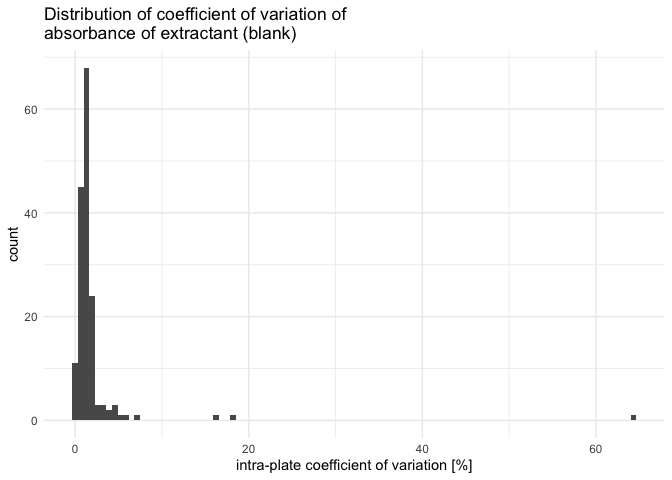

We see that a few plates have a very high coefficient of variation, we
will have to look at them individually. Let’s set the threshold for the
coefficient of variation at 5% (default)

``` r
threshold <- 5

suspicious_plates <- raw_abs_clean_noPNR |> 
  qc_raw_extr(suppress_warning = TRUE, max_coeff = threshold)

suspicious_extr <- suspicious_extr(
  raw_abs_clean_noPNR, suspicious_extr_per_plate = suspicious_plates, max_coeff = threshold)
```

    Joining with `by = join_by(plate_id, map)`

``` r
# check it out
suspicious_extr
```

    # A tibble: 60 × 13
       row   column well_id unique_well_id dataset  plate_id  map     abs std_sp
       <chr> <chr>  <chr>   <chr>          <chr>    <chr>     <chr> <dbl> <chr> 
     1 A     8      A8      A8_NH4_2F2_2   Nmint1t2 NH4_2F2_2 extr  0.038 NH4   
     2 B     8      B8      B8_NH4_2F2_2   Nmint1t2 NH4_2F2_2 extr  0.037 NH4   
     3 C     8      C8      C8_NH4_2F2_2   Nmint1t2 NH4_2F2_2 extr  0.038 NH4   
     4 D     8      D8      D8_NH4_2F2_2   Nmint1t2 NH4_2F2_2 extr  0.038 NH4   
     5 E     8      E8      E8_NH4_2F2_2   Nmint1t2 NH4_2F2_2 extr  0.038 NH4   
     6 F     8      F8      F8_NH4_2F2_2   Nmint1t2 NH4_2F2_2 extr  0.038 NH4   
     7 G     8      G8      G8_NH4_2F2_2   Nmint1t2 NH4_2F2_2 extr  0.038 NH4   
     8 H     8      H8      H8_NH4_2F2_2   Nmint1t2 NH4_2F2_2 extr  0.059 NH4   
     9 A     8      A8      A8_NH4_2P2     Nmint1t2 NH4_2P2   extr  0.039 NH4   
    10 B     8      B8      B8_NH4_2P2     Nmint1t2 NH4_2P2   extr  0.039 NH4   
    # ℹ 50 more rows
    # ℹ 4 more variables: std_conc <chr>, std_unit <chr>, sample_dilution <chr>,
    #   date <chr>

``` r
# plot outliers
suspicious_extr |> boxplot_outlier_extr(max_coeff = threshold)
```

    Joining with `by = join_by(plate_id)`

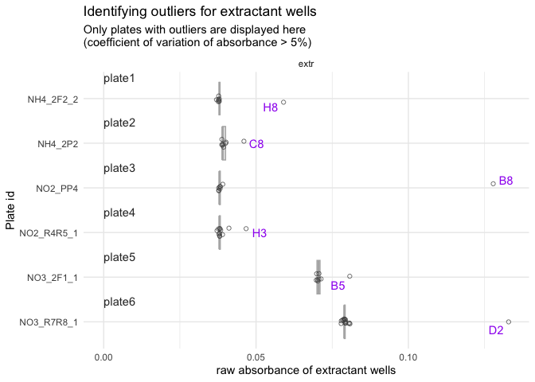

We have 6 plates that each have one or more obvious outlier well. We
will need to remove them manually.

First, we create a small tibble that will serve to construct the tibble
of wells to remove

``` r
plate_ids <- suspicious_extr |> 
  ungroup() |> 
  select(dataset, plate_id) |> unique() 
plate_ids <- plate_ids |> # save numbers for plate order in the plot
  mutate(plate_order = seq(1, nrow(plate_ids)))
```

Then, we create a vector with wells to remove (going through boxplots
from top to bottom).

> [!TIP]
>
> ### Manually remove blank outliers
>
> In the following chunk, you need to manually decide which wells to
> remove, based on the boxplots produced above.
>
> - Make sure to deal appropriately with plates that require 2 outliers
>   or no outlier to be removed (see example below)

``` r
#** !!! MANUAL INPUT !!! *

# Which plate needs 2 outliers removed?
plate_with_2_outliers <- 4
plate_without_outliers <- 9 # use a number > nb of plates if there is no such plate

# Which wells are outliers? 
well_ids <- c("H8", "C8", "B8", "G3", "H3", "B5", "D2") 
```

Then we finish constructing the tibble of wells to be removed

``` r
to_remove <- plate_ids |> 
  bind_rows(plate_ids |> filter(plate_order == plate_with_2_outliers)) |> 
  arrange(plate_order) |> 
  mutate(well_id = well_ids) |> 
  filter(plate_order != plate_without_outliers) |> #remove plate without outliers
  select(!plate_order)
```

Checking that we didn’t get confused: look at `to_remove` in parallel to
the boxplot

``` r
to_remove
```

    # A tibble: 7 × 3
      dataset  plate_id   well_id
      <chr>    <chr>      <chr>  
    1 Nmint1t2 NH4_2F2_2  H8     
    2 Nmint1t2 NH4_2P2    C8     
    3 PMN      NO2_PP4    B8     
    4 Nmint3   NO2_R4R5_1 G3     
    5 Nmint3   NO2_R4R5_1 H3     
    6 Nmint1t2 NO3_2F1_1  B5     
    7 Nmint3   NO3_R7R8_1 D2     

Looks good, so we remove it from extractant data and recompute the
average

``` r
extr_data_clean <- extr_data |> 
  remove_wells(to_remove) 

blank_avg_clean <- extractant_average(extractant_data = extr_data_clean) 
```

Check that biggest coeff_var indeed below threshold

``` r
blank_avg_clean |> arrange(desc(blank_coeff_var_percent)) |> head()
```

    # A tibble: 6 × 6
      dataset  plate_id   map   blank_avg blank_sdev blank_coeff_var_percent
      <chr>    <chr>      <chr>     <dbl>      <dbl>                   <dbl>
    1 PMN      NO2_PF2    extr     0.0376    0.00177                    4.70
    2 PMN      NO3_PP4    extr     0.0872    0.00399                    4.57
    3 Nmint1t2 NO2_2P6_1  extr     0.0372    0.00158                    4.24
    4 Nmint1t2 NO2_2F1_1  extr     0.0376    0.00151                    4.00
    5 Nmint1t2 NO2_2F6_1  extr     0.0368    0.00139                    3.78
    6 Nmint3   NO2_R2R3_1 extr     0.0395    0.00120                    3.03

Now that we are confident in the per-plate average value of raw
absorbance of extractant wells, we can finally blank-correct all sample
data

### 2.2.2 - PNR data

Take a subset

``` r
raw_abs_clean_PNR <- raw_abs_clean |> filter(dataset == "PNR")
```

First, extract data for wells containing extractant and have a look at
its variation

``` r
extr_data <- extract_extractant(
  raw_abs_clean_PNR, extr_def = c("extr", "blank_ctrl"))
(blank_avg <- extractant_average(
  raw_abs_clean_PNR, extr_def = c("extr", "blank_ctrl")) |> 
  arrange(desc(blank_coeff_var_percent)))
```

    # A tibble: 80 × 6
       dataset plate_id map        blank_avg blank_sdev blank_coeff_var_percent
       <chr>   <chr>    <chr>          <dbl>      <dbl>                   <dbl>
     1 PNR     NO2_R4_2 extr          0.0392    0.00198                    5.05
     2 PNR     NO3_R3_2 extr          0.0978    0.00471                    4.82
     3 PNR     NO3_R6_2 extr          0.0968    0.00423                    4.38
     4 PNR     NO3_R3_1 extr          0.0978    0.00420                    4.30
     5 PNR     NO2_R5_4 blank_ctrl    0.0375    0.00151                    4.03
     6 PNR     NO2_R5_2 extr          0.0399    0.00136                    3.40
     7 PNR     NO3_R1_3 extr          0.0782    0.00255                    3.26
     8 PNR     NO3_R3_4 extr          0.0984    0.00288                    2.92
     9 PNR     NO2_R4_4 blank_ctrl    0.0375    0.00107                    2.85
    10 PNR     NO3_R3_3 extr          0.0974    0.00256                    2.63
    # ℹ 70 more rows

``` r
plot_blank_var_distrib(blank_avg)
```


Blanks have been recorded as one column per plate, but actually it was
the upper half (A2-D2) for the blank without incubation (T0), and the
lower half (E2-H2) for the blank after 26h of incubation (T26). The idea
was anyway to take the average of the two. Seeing that values are close,
I think it is good enough to keep them as one. The average will be taken
among 8 wells instead of average of 4 2x, then average again. There will
be a slight overweighing of one blank in case wells are removed from 1
and not the other, but for now I think that the difference will be
marginal enough, especially seeing that we have here relatively small
coefficients of variation.

With a 5% threshold for the coefficient of variation, only 1 plate is
above. Let’s look at it.

``` r
threshold <- 5

suspicious_plates <- raw_abs_clean_PNR |> 
  qc_raw_extr(suppress_warning = TRUE, max_coeff = threshold)

suspicious_extr <- suspicious_extr(
  raw_abs_clean_PNR, suspicious_extr_per_plate = suspicious_plates, max_coeff = threshold)
```

    Joining with `by = join_by(plate_id, map)`

``` r
# check it out
suspicious_extr
```

    # A tibble: 8 × 13
      row   column well_id unique_well_id dataset plate_id map     abs std_sp
      <chr> <chr>  <chr>   <chr>          <chr>   <chr>    <chr> <dbl> <chr> 
    1 A     2      A2      A2_NO2_R4_2    PNR     NO2_R4_2 extr  0.038 NO2   
    2 B     2      B2      B2_NO2_R4_2    PNR     NO2_R4_2 extr  0.039 NO2   
    3 C     2      C2      C2_NO2_R4_2    PNR     NO2_R4_2 extr  0.044 NO2   
    4 D     2      D2      D2_NO2_R4_2    PNR     NO2_R4_2 extr  0.038 NO2   
    5 E     2      E2      E2_NO2_R4_2    PNR     NO2_R4_2 extr  0.039 NO2   
    6 F     2      F2      F2_NO2_R4_2    PNR     NO2_R4_2 extr  0.038 NO2   
    7 G     2      G2      G2_NO2_R4_2    PNR     NO2_R4_2 extr  0.039 NO2   
    8 H     2      H2      H2_NO2_R4_2    PNR     NO2_R4_2 extr  0.039 NO2   
    # ℹ 4 more variables: std_conc <chr>, std_unit <chr>, sample_dilution <chr>,
    #   date <chr>

``` r
# plot outliers
suspicious_extr |> boxplot_outlier_extr(max_coeff = threshold)
```

    Joining with `by = join_by(plate_id)`


We can remove well C2 of that plate manually.

First, we create a small tibble that will serve to construct the tibble
of wells to remove

``` r
plate_ids <- suspicious_extr |> 
  ungroup() |> 
  select(dataset, plate_id) |> unique() 
plate_ids <- plate_ids |> # save numbers for plate order in the plot
  mutate(plate_order = seq(1, nrow(plate_ids)))
```

Then, we create a vector with wells to remove (going through boxplots
from top to bottom).

``` r
#** !!! MANUAL INPUT !!! *

# Which plate needs 2 outliers removed?
plate_with_2_outliers <- 4
plate_without_outliers <- 9 # use a number > nb of plates if there is no such plate

# Which wells are outliers? 
well_ids <- c("C2") 
```

Then we finish constructing the tibble of wells to be removed

``` r
to_remove <- plate_ids |> 
  bind_rows(plate_ids |> filter(plate_order == plate_with_2_outliers)) |> 
  arrange(plate_order) |> 
  mutate(well_id = well_ids) |> 
  filter(plate_order != plate_without_outliers) |> #remove plate without outliers
  select(!plate_order)
```

Checking that we didn’t get confused: look at `to_remove` in parallel to
the boxplot

``` r
to_remove
```

    # A tibble: 1 × 3
      dataset plate_id well_id
      <chr>   <chr>    <chr>  
    1 PNR     NO2_R4_2 C2     

Looks good, so we remove it from extractant data and recompute the
average

``` r
extr_data_clean <- extr_data |> 
  remove_wells(to_remove) 

blank_avg_clean <- extractant_average(
  extractant_data = extr_data_clean, extr_def = c("extr", "blank_ctrl"))
```

Check that biggest coeff_var indeed below threshold

``` r
blank_avg_clean |> arrange(desc(blank_coeff_var_percent)) |> head()
```

    # A tibble: 6 × 6
      dataset plate_id map        blank_avg blank_sdev blank_coeff_var_percent
      <chr>   <chr>    <chr>          <dbl>      <dbl>                   <dbl>
    1 PNR     NO3_R3_2 extr          0.0978    0.00471                    4.82
    2 PNR     NO3_R6_2 extr          0.0968    0.00423                    4.38
    3 PNR     NO3_R3_1 extr          0.0978    0.00420                    4.30
    4 PNR     NO2_R5_4 blank_ctrl    0.0375    0.00151                    4.03
    5 PNR     NO2_R5_2 extr          0.0399    0.00136                    3.40
    6 PNR     NO3_R1_3 extr          0.0782    0.00255                    3.26

Now that we are confident in the per-plate average value of raw
absorbance of extractant wells, we can finally blank-correct all sample
data

> [!CAUTION]
>
> ### When several blanks per plate
>
> Like hereunder, then the input plate, given to the argument
> `raw_wells_data` into `blank_correct_abs()` must contain an extra
> column called `extr_id` giving the info, for each well, which blank to
> use

Add extr_id info

``` r
clean_PNR_extr_id <- raw_abs_clean_PNR |> 
  left_join(slurry_samples |> 
    rename(map = slurry_sample) |> 
    select(map, extr_id)
    )
```

    Joining with `by = join_by(map)`

## 2.3 - All corrected data

Let’s just recall all corrected data. We have 2 separate tibbles
(because the experimental design was arranged to have separate blanks
for the curve and the samples)

``` r
# Standard curve, blank-corrected and clean
std_corrected 
```

    # A tibble: 3,204 × 17
       row   column well_id unique_well_id dataset  plate_id  unique_curve_id map  
       <chr> <chr>  <chr>   <chr>          <chr>    <chr>     <chr>           <chr>
     1 B     1      B1      B1_NH4_1F1     Nmint1t2 NH4_1F1   NH4_1F1_col1    Std  
     2 B     1      B1      B1_NH4_1F2_1   Nmint1t2 NH4_1F2_1 NH4_1F2_1_col1  Std  
     3 B     1      B1      B1_NH4_1F2_2   Nmint1t2 NH4_1F2_2 NH4_1F2_2_col1  Std  
     4 B     1      B1      B1_NH4_1F3     Nmint1t2 NH4_1F3   NH4_1F3_col1    Std  
     5 B     1      B1      B1_NH4_1F4     Nmint1t2 NH4_1F4   NH4_1F4_col1    Std  
     6 B     1      B1      B1_NH4_1F5     Nmint1t2 NH4_1F5   NH4_1F5_col1    Std  
     7 B     1      B1      B1_NH4_1G1     Nmint1t2 NH4_1G1   NH4_1G1_col1    Std  
     8 B     1      B1      B1_NH4_1G2     Nmint1t2 NH4_1G2   NH4_1G2_col1    Std  
     9 B     1      B1      B1_NH4_1G3     Nmint1t2 NH4_1G3   NH4_1G3_col1    Std  
    10 B     1      B1      B1_NH4_1G4     Nmint1t2 NH4_1G4   NH4_1G4_col1    Std  
    # ℹ 3,194 more rows
    # ℹ 9 more variables: abs_corrected <dbl>, std_sp <chr>, std_unit <chr>,
    #   sample_dilution <chr>, date <chr>, std_conc <dbl>, extr_id <chr>,
    #   blank_sdev <dbl>, blank_coeff_var_percent <dbl>

``` r
# Samples, blank-corrected and clean
samples_corrected_noPNR
```

    # A tibble: 6,551 × 16
       row   column well_id unique_well_id dataset  plate_id  map      abs_corrected
       <chr> <chr>  <chr>   <chr>          <chr>    <chr>     <chr>            <dbl>
     1 A     2      A2      A2_NH4_1F1     Nmint1t2 NH4_1F1   81_t1_z2      0.007   
     2 A     2      A2      A2_NH4_1F2_1   Nmint1t2 NH4_1F2_1 97_t1_z1      0.00350 
     3 A     2      A2      A2_NH4_1F3     Nmint1t2 NH4_1F3   89_t1_z3      0.00288 
     4 A     2      A2      A2_NH4_1F4     Nmint1t2 NH4_1F4   81_t1_z1      0.00725 
     5 A     2      A2      A2_NH4_1F5     Nmint1t2 NH4_1F5   Std_3_t1      0.0229  
     6 A     2      A2      A2_NH4_1G1     Nmint1t2 NH4_1G1   1_t1          0.00100 
     7 A     2      A2      A2_NH4_1G2     Nmint1t2 NH4_1G2   17_t1         0.000875
     8 A     2      A2      A2_NH4_1G3     Nmint1t2 NH4_1G3   33_t1         0.00288 
     9 A     2      A2      A2_NH4_1G4     Nmint1t2 NH4_1G4   49_t1         0.000125
    10 A     2      A2      A2_NH4_1G5     Nmint1t2 NH4_1G5   65_t1         0.00175 
    # ℹ 6,541 more rows
    # ℹ 8 more variables: std_sp <chr>, std_conc <chr>, std_unit <chr>,
    #   sample_dilution <chr>, date <chr>, extr_id <chr>, blank_sdev <dbl>,
    #   blank_coeff_var_percent <dbl>

``` r
samples_corrected_PNR
```

    # A tibble: 4,472 × 16
       row   column well_id unique_well_id dataset plate_id map        abs_corrected
       <chr> <chr>  <chr>   <chr>          <chr>   <chr>    <chr>              <dbl>
     1 A     3      A3      A3_NO3_R1_1    PNR     NO3_R1_1 83_z3_T0          0.0938
     2 A     3      A3      A3_NO3_R1_2    PNR     NO3_R1_2 90_z3_T0          0.0326
     3 A     3      A3      A3_NO3_R1_3    PNR     NO3_R1_3 95_z3_T0          0.0218
     4 A     3      A3      A3_NO3_R1_4    PNR     NO3_R1_4 Std_soil_…        0.121 
     5 A     3      A3      A3_NO3_R2_1    PNR     NO3_R2_1 82_z3_T0          0.0852
     6 A     3      A3      A3_NO3_R2_2    PNR     NO3_R2_2 87_z3_T0          0.0799
     7 A     3      A3      A3_NO3_R2_3    PNR     NO3_R2_3 93_z3_T0          0.0418
     8 A     3      A3      A3_NO3_R2_4    PNR     NO3_R2_4 Std_soil_…        0.176 
     9 A     3      A3      A3_NO3_R3_1    PNR     NO3_R3_1 81_z1_T0          0.0962
    10 A     3      A3      A3_NO3_R3_2    PNR     NO3_R3_2 89_z2_T0          0.0662
    # ℹ 4,462 more rows
    # ℹ 8 more variables: std_sp <chr>, std_conc <chr>, std_unit <chr>,
    #   sample_dilution <chr>, date <chr>, extr_id <chr>, blank_sdev <dbl>,
    #   blank_coeff_var_percent <dbl>

``` r
# check that both tables same columns, then bind_row is ok
sum(names(samples_corrected_noPNR) != names(samples_corrected_PNR))
```

    [1] 0

``` r
samples_corrected <- bind_rows(
  samples_corrected_noPNR, samples_corrected_PNR
)
```

# 3 - Compute regression equation (per plate)

## 3.1 - QC standard curves - round 1

Assumptions of a linear model: (taken
[here](https://towardsdatascience.com/all-the-statistical-tests-you-must-do-for-a-good-linear-regression-6ec1ac15e5d4/),
apparently from [Spanish
book](https://periodicos.ufpe.br/revistas/politicahoje/article/download/3808/31622))

- The residuals must follow a normal distribution.

- The residuals are homogeneous, there is homoscedasticity.

- There’s no outliers in the errors.

- There’s no autocorrelation in the errors.

!!! FORMULATE better and split in 2 chunks :-)

First, we perform a linear model on each curve individually (i.e.,
possibly several curves per plate).

Then we take a subset to examine individually: those curves where the
linear model doesn’t seem to perform ideally (e.g., non-significant
model (p-value \> 0.05), residuals not normally distributed, or
heteroscedasticity)

``` r
lm_table_raw <- lm_std_curve(std_corrected |> group_by(plate_id, column))

# extract all plates where "something" is not perfect 
(lm_table_suspicious <- lm_table_raw |> 
  suspicious_lm())
```

    # A tibble: 96 × 12
       dataset  plate_id  unique_curve_id std_sp   slope r_squared adj_r_squared
       <chr>    <chr>     <chr>           <chr>    <dbl>     <dbl>         <dbl>
     1 Nmint1t2 NH4_1F1   NH4_1F1_col1    NH4    0.00798     0.990         0.988
     2 Nmint1t2 NH4_1G2   NH4_1G2_col12   NH4    0.00600     0.988         0.986
     3 Nmint1t2 NH4_2F1_1 NH4_2F1_1_col12 NH4    0.00884     0.996         0.995
     4 Nmint1t2 NH4_2F1_2 NH4_2F1_2_col12 NH4    0.00884     0.996         0.995
     5 Nmint1t2 NH4_2F2_1 NH4_2F2_1_col1  NH4    0.00800     0.998         0.997
     6 Nmint1t2 NH4_2F2_2 NH4_2F2_2_col1  NH4    0.00800     0.998         0.997
     7 Nmint1t2 NH4_2F4_1 NH4_2F4_1_col1  NH4    0.00857     0.990         0.988
     8 Nmint1t2 NH4_2F4_2 NH4_2F4_2_col1  NH4    0.00857     0.990         0.988
     9 Nmint1t2 NH4_2P1   NH4_2P1_col1    NH4    0.00887     0.990         0.988
    10 Nmint1t2 NH4_2P2   NH4_2P2_col12   NH4    0.00800     0.995         0.994
    # ℹ 86 more rows
    # ℹ 5 more variables: lm_p <dbl>, normality_lm_residuals <chr>,
    #   shapiro_p <dbl>, homoscedasticity_lm_residuals <chr>, breusch_pagan_p <dbl>

Then, for visual support, we create a list of plots where we store each
individual plot of “suspicious” standard curves

``` r
suspicious_lm_plotlist <- plot_list_lm(
  lm_data = lm_table_suspicious,
  std_data = std_corrected)

# check one plot out
suspicious_lm_plotlist[[2]]
```


Now we can look at each plot individually. Because there are still 96
plots to review, we will look through them in 5 batches of 20 plots.

``` r
n_plots <- length(suspicious_lm_plotlist)
batch <- 20

batch_1 <- suspicious_lm_plotlist |> head(n = batch)
batch_2 <- suspicious_lm_plotlist |> tail(n = n_plots-batch) |> head(n = batch)
batch_3 <- suspicious_lm_plotlist |> tail(n = n_plots-(2*batch)) |> head(n = batch)
batch_4 <- suspicious_lm_plotlist |> tail(n = n_plots-(3*batch)) |> head(n = batch)
batch_5 <- suspicious_lm_plotlist |> tail(n = n_plots-(4*batch))

patchwork::wrap_plots(batch_1, axis_titles = "keep") +
     patchwork::plot_annotation(title = "Plots of suspicious Standard curves")
```


``` r
patchwork::wrap_plots(batch_2, axis_titles = "keep") +
     patchwork::plot_annotation(title = "Plots of suspicious Standard curves")
```

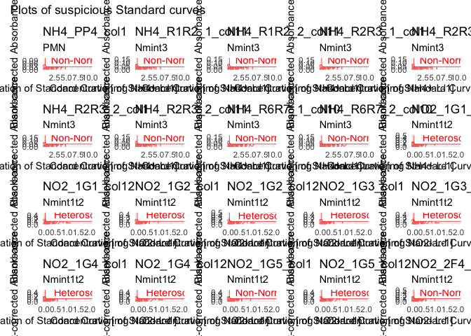

``` r
patchwork::wrap_plots(batch_3, axis_titles = "keep") +
     patchwork::plot_annotation(title = "Plots of suspicious Standard curves")
```

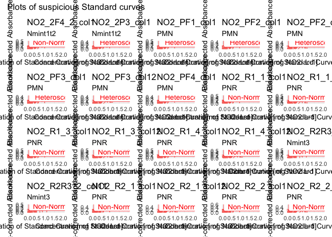

``` r
patchwork::wrap_plots(batch_4, axis_titles = "keep") +
     patchwork::plot_annotation(title = "Plots of suspicious Standard curves")
```

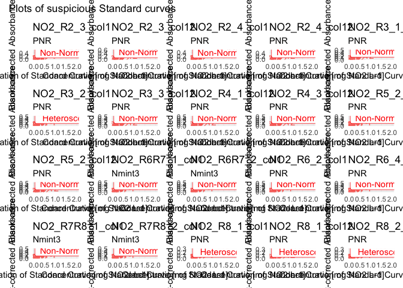

``` r
patchwork::wrap_plots(batch_5, axis_titles = "keep") +
     patchwork::plot_annotation(title = "Plots of suspicious Standard curves")
```


Most plates are from NH4 and NO2. Because most measurement of NH4 and
NO2 are close to zero, it might be relevant to just remove highest
points of the curve to get a better fit.

Let’s check how high the absorbance goes with these data sets, for each
N species, by comparing those highest values with the plots above.

``` r
samples_corrected |> filter(std_sp == "NH4") |> 
  arrange(desc(abs_corrected)) |> slice_head(n = 10)
```

    # A tibble: 10 × 16
       row   column well_id unique_well_id dataset plate_id   map      abs_corrected
       <chr> <chr>  <chr>   <chr>          <chr>   <chr>      <chr>            <dbl>
     1 A     6      A6      A6_NH4_R2R3_1  Nmint3  NH4_R2R3_1 std_R2_…        0.0384
     2 B     6      B6      B6_NH4_R2R3_1  Nmint3  NH4_R2R3_1 std_R2_…        0.0384
     3 C     6      C6      C6_NH4_R2R3_1  Nmint3  NH4_R2R3_1 std_R2_…        0.0374
     4 D     6      D6      D6_NH4_R2R3_1  Nmint3  NH4_R2R3_1 std_R2_…        0.0364
     5 E     9      E9      E9_NH4_R2R3_2  Nmint3  NH4_R2R3_2 std_R3_…        0.0351
     6 F     9      F9      F9_NH4_R2R3_2  Nmint3  NH4_R2R3_2 std_R3_…        0.0351
     7 G     9      G9      G9_NH4_R2R3_2  Nmint3  NH4_R2R3_2 std_R3_…        0.0341
     8 H     9      H9      H9_NH4_R2R3_2  Nmint3  NH4_R2R3_2 std_R3_…        0.0341
     9 E     4      E4      E4_NH4_R1R2_1  Nmint3  NH4_R1R2_1 std_R1_…        0.032 
    10 F     4      F4      F4_NH4_R1R2_1  Nmint3  NH4_R1R2_1 std_R1_…        0.032 
    # ℹ 8 more variables: std_sp <chr>, std_conc <chr>, std_unit <chr>,
    #   sample_dilution <chr>, date <chr>, extr_id <chr>, blank_sdev <dbl>,
    #   blank_coeff_var_percent <dbl>

``` r
samples_corrected |> filter(std_sp == "NO2") |> 
  arrange(desc(abs_corrected)) |> slice_head(n = 10)
```

    # A tibble: 10 × 16
       row   column well_id unique_well_id dataset  plate_id map       abs_corrected
       <chr> <chr>  <chr>   <chr>          <chr>    <chr>    <chr>             <dbl>
     1 A     3      A3      A3_NO2_PF2     PMN      NO2_PF2  Field_Au…         0.581
     2 A     2      A2      A2_NO2_1F5     Nmint1t2 NO2_1F5  Std_3_t1          0.177
     3 C     2      C2      C2_NO2_1F5     Nmint1t2 NO2_1F5  Std_3_t1          0.174
     4 D     2      D2      D2_NO2_1F5     Nmint1t2 NO2_1F5  Std_3_t1          0.173
     5 B     2      B2      B2_NO2_1F5     Nmint1t2 NO2_1F5  Std_3_t1          0.172
     6 E     5      E5      E5_NO2_R7_2    PNR      NO2_R7_2 90_z2_T26         0.147
     7 G     5      G5      G5_NO2_R7_2    PNR      NO2_R7_2 90_z2_T26         0.147
     8 H     5      H5      H5_NO2_R7_2    PNR      NO2_R7_2 90_z2_T26         0.147
     9 F     5      F5      F5_NO2_R7_2    PNR      NO2_R7_2 90_z2_T26         0.146
    10 E     5      E5      E5_NO2_R1_2    PNR      NO2_R1_2 90_z3_T26         0.14 
    # ℹ 8 more variables: std_sp <chr>, std_conc <chr>, std_unit <chr>,
    #   sample_dilution <chr>, date <chr>, extr_id <chr>, blank_sdev <dbl>,
    #   blank_coeff_var_percent <dbl>

We see that the highest absorbance for NO2 and NH4 is mostly far below
the most concentrated point of the standard curve –\> we can remove row
H for sure for those datasets, but row G probably not.

This is not totally true for NO2 of the PMN dataset, although funnily,
only one well is well far above the others, indicating a probable
outlier (reminder: we always ran the experiment in 4 replicates, so we
should expect 4 wells of similar concentration).

So, we can list wells to remove the H row of NO2 and NH4 std.

``` r
to_remove_nh4_no2_h <- std_corrected |> 
  filter(
    (std_sp == "NH4" & row %in% c("G", "H")) |
      (std_sp == "NO2" & row == "H")) |> 
  select(dataset, plate_id, well_id) 
```

Then, we can add the following single wells that were very obviously
misaligned with the curve (see multiplots above)

Nmint1t2

- NH4_1G2: E12

- NH4_2F4_1 & 2: C1

PNR

- NO2_R1_1, 3 & 4: B1 & B12

- NO2_R2_1,2,3,4: E1 & E12

- NO2_R8_1,2,3,4: H1 & H12

``` r
to_remove <- to_remove_nh4_no2_h |> 
  # wells for Nmint1t2
  bind_rows(tibble(
    dataset = c(rep("Nmint1t2", 3)), 
    plate_id = c("NH4_1G2", "NH4_2F4_1", "NH4_2F4_2"),
    well_id = c("E12", "C1", "C1")
  )) #

plate_ids_pnr_out <- paste0(
  "NO2_R", 
  c(
    sort(rep(paste0(1, "_", c(1,3,4)), 2)),
    sort(rep(paste0(2, "_", c(1:4)),2)),
    sort(rep(paste0(8, "_", c(1:4)), 2))
    )
)

well_ids_pnr_out <- c(
  rep(c("B1", "B12"), 3),
  rep(c("E1", "E12"), 4),
  rep(c("H1", "H12"), 4))


  # add wells for PNR
to_remove <- to_remove |> 
  bind_rows((tibble(
    dataset = rep("PNR", 22),
    plate_id = plate_ids_pnr_out,
    well_id = well_ids_pnr_out
  ))) |> 
  # remove duplicates (come from single H's being outlier + removing all H's for NO2)
  unique()
```

Before removing them, let’s look at suspicious plots for NO3 only, so we
can see the plots better

``` r
lm_table_suspicious_NO3 <- lm_table_suspicious |> 
  # extract N_sp from plate name. May be done differently, this is just one of many possible approaches
  separate_wider_delim(
    cols = unique_curve_id, delim = "_", 
    names = c("N_sp", "rest"), 
    too_many = "merge", cols_remove = FALSE) |> 
  select(!rest) |> 
  filter(N_sp == "NO3")

# Create plot list
lm_plot_list_NO3 <- plot_list_lm(
  lm_data = lm_table_suspicious_NO3,
  std_data = std_corrected)

patchwork::wrap_plots(lm_plot_list_NO3, axis_titles = "keep") +
     patchwork::plot_annotation(title = "Plots of suspicious Standard curves")
```


For the NO3 plates, the issue has to be solved differently, but those
are just a few –\> individual appraisal. We see here that we cannot
remove the H row, because some points seem to have an absorbance above
that of the G row of the standard.

``` r
samples_corrected |> 
  filter(std_sp == "NO3") |> 
  arrange(desc(abs_corrected)) |> 
  slice_head(n = 3)
```

    # A tibble: 3 × 16
      row   column well_id unique_well_id dataset  plate_id  map       abs_corrected
      <chr> <chr>  <chr>   <chr>          <chr>    <chr>     <chr>             <dbl>
    1 H     3      H3      H3_NO3_2F6_1   Nmint1t2 NO3_2F6_1 110_t2_M…         0.329
    2 H     10     H10     H10_NO3_2F6_2  Nmint1t2 NO3_2F6_2 110_t2_M…         0.326
    3 E     10     E10     E10_NO3_2F6_2  Nmint1t2 NO3_2F6_2 110_t2_M…         0.317
    # ℹ 8 more variables: std_sp <chr>, std_conc <chr>, std_unit <chr>,
    #   sample_dilution <chr>, date <chr>, extr_id <chr>, blank_sdev <dbl>,
    #   blank_coeff_var_percent <dbl>

For NO3_2F1, NO3_1F1 and NO3_PP1: there were probably 2 columns, so I
can look at both columns together

``` r
lm_table_raw |> 
  separate_wider_delim(
    cols = unique_curve_id, delim = "_", 
    names = c("n_sp", "plate", "rest"), 
    too_many = "merge", cols_remove = FALSE) |> 
  filter(n_sp == "NO3", plate %in% c("1F1", "2F1", "PP1")) |> 
  plot_list_lm(std_data = std_corrected) |> 
  patchwork::wrap_plots()
```


–\> for NO3_1F1 and NO3_PP1, we cannot do much, but maybe the average
will be enough to correct the defects

–\> remove B1 from NO3_2F1_1 and NO3_2F1_2

Then re-compute linear model table as “clean” version.

Then apply it

``` r
std_corrected_wash1 <- 
  std_corrected |> 
  remove_wells(
    to_remove |> 
      bind_rows(tibble(
        dataset = rep("Nmint1t2",2),
        plate_id = c("NO3_2F1_1", "NO3_2F1_2"),
        well_id = rep("B1",2)
        ))
    )
```

Run the quality check once more

``` r
lm_table_wash1 <- lm_std_curve(std_corrected_wash1 |> group_by(plate_id, column))

# extract all plates where "something" is not perfect 
lm_table_suspicious_wash1 <- lm_table_wash1 |> suspicious_lm()
#lm_table_suspicious_wash1 |> view()

suspicious_lm_plotlist_wash1 <- plot_list_lm(
  lm_data = lm_table_suspicious_wash1,
  std_data = std_corrected_wash1)

n_plots <- length(suspicious_lm_plotlist_wash1)
batch <- 15

batch_1 <- suspicious_lm_plotlist_wash1 |> head(n = batch)
batch_2 <- suspicious_lm_plotlist_wash1 |> tail(n = n_plots-batch) |> head(n = batch)
batch_3 <- suspicious_lm_plotlist_wash1 |> tail(n = n_plots-2*batch)

patchwork::wrap_plots(batch_1, axis_titles = "keep") +
     patchwork::plot_annotation(title = "Plots of suspicious Standard curves")
```


``` r
patchwork::wrap_plots(batch_2, axis_titles = "keep") +
     patchwork::plot_annotation(title = "Plots of suspicious Standard curves")
```


``` r
patchwork::wrap_plots(batch_3, axis_titles = "keep") +
     patchwork::plot_annotation(title = "Plots of suspicious Standard curves")
```

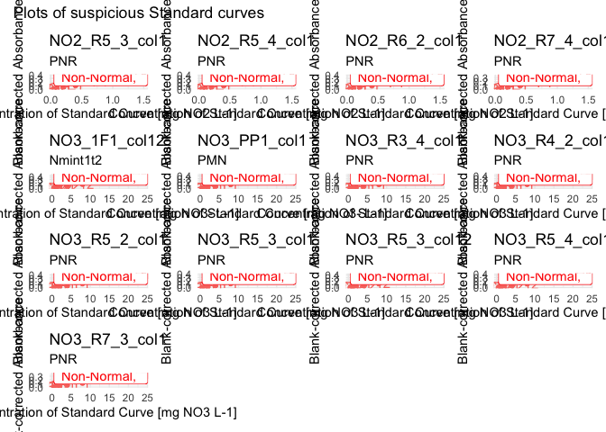

We still get 43 “suspicious” curves. But when we look at the p-values to
reject normality or heteroscedasticity, they are indeed below 0.05, but
it’s also not 10^-5 or something like that. The smallest p-value
(shapiro) is at 0.003.

Still, looking at the plots, there are 2 more wells that appear out of
place:

- NH4_PP1 & NH4_PC1: D1

``` r
to_remove <- tibble(
    dataset = c(rep("PMN", 2)), 
    plate_id = c("NH4_PP1", "NH4_PC1"),
    well_id = c("D1", "D1")
  )

std_corrected_wash2 <- std_corrected_wash1 |> remove_wells(to_remove)
```

Let’s compute the means per dilution and see…

## 3.2 - Compute per-dilution averages

Most plates in our dataset have 2 columns with the standard curves. It
seems that the ~1min delay between the 2 (column 1 and column 12 of the
plate) are responsible for a slight shift (example in plot below)

``` r
std_corrected_wash2 |> filter(plate_id == "NO3_2F3_1") |> rename(abs = abs_corrected) |> 
  plot_std()
```


So we will now compute the mean for same row (e.g., mean of H1 and H12)

> [!WARNING]
>
> ### WARNING
>
> The next step computes per plate per row means for the standard
> curves.
>
> If some wells have been swapped in some plates, this may cause
> problems. Make sure there was no pipetting issue, or correct raw data
> or solve it through code

``` r
std_dilution_avg <- std_dilution_average(std_corrected_wash2)
```

## 3.3 - QC standard curves - round 2

We repeat same steps as above: computation of linear model,
identification of suspicious curves and plotting. We only have 5 curves
left that are suspicious.

``` r
lm_std_avg <- lm_std_curve(std_dilution_avg |> rename(abs_corrected = abs_mean))
lm_suspicious_avg <- lm_std_avg |> suspicious_lm()

lm_plots_avg <- lm_suspicious_avg |> plot_list_lm(
  std_data = std_dilution_avg |> rename(abs_corrected = abs_mean))

lm_plots_avg |> patchwork::wrap_plots()
```

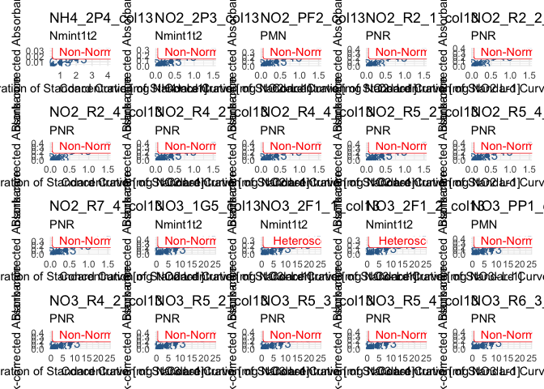

Now, we decide to get rid of just a few wells that really stick out, for
the following plates:

–\> remove G13 from NO3_2F1_1 and NO3_2F1_2

Let’s compose a “to_remove” tibble

``` r
to_remove <- std_dilution_avg |> 
  ungroup() |> 
  select(dataset, plate_id, well_id) |> 
  filter(
    (plate_id %in% c("NO3_2F1_1", "NO3_2F1_2")) & (well_id == "G13")
  )

std_corrected_wash3 <- std_dilution_avg |> 
  remove_wells(to_remove) |> 
  rename(abs_corrected = abs_mean)
```

One more run of QC to check if we are satisfied with the resulting
curves

``` r
lm_wash3 <- lm_std_curve(std_corrected_wash3)
lm_suspicious_wash3 <- lm_wash3 |> suspicious_lm()

lm_plots_wash3 <- plot_list_lm(lm_suspicious_wash3, std_corrected_wash3)
lm_plots_wash3 |> patchwork::wrap_plots()  
```

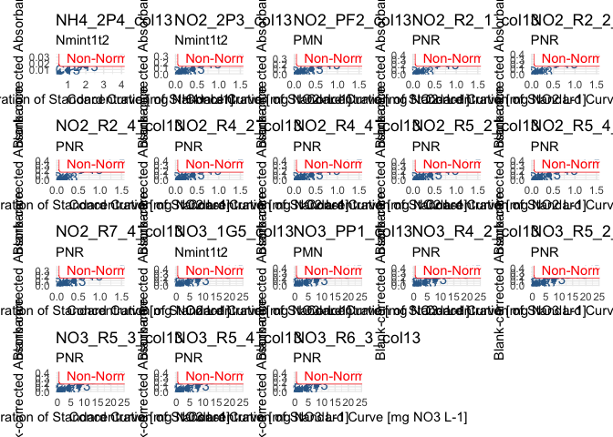

Ok, good enough!

Let’s store the last correction into a clean variable name to reduce
possible confusion, and let’s compute all the plots in a big list, for
storage purposes. We then export this as one output data in a single
list

``` r
std_data_clean <- std_corrected_wash3
lm_table_clean <- lm_wash3
lm_plots_clean <- plot_list_lm(lm_table_clean, std_data_clean)

lm_output <- list(
  "std_data_clean" = std_data_clean,
  "lm_table_clean" = lm_table_clean,
  "lm_plots_clean" = lm_plots_clean,
  "samples_corrected" = samples_corrected
)

lm_output |> write_rds("output/data/2_lm_output_noTDN.rds")
```

## 3.4 - Multiple curve QC

First, let’s look at the distribution of p-values of the std curve
regressions

``` r
plot_p <- density_lm_param(
  lm_wash3, 
  p_or_r = "p", threshold = 0.05, 
  facetting_std_sp = TRUE, color_std_sp = FALSE)

plot_p
```


Then, same with adjusted R_squared

``` r
plot_adjR2 <- density_lm_param(
  lm_wash3, "adjR2", 0.95, facetting_std_sp = FALSE 
)

plot_adjR2
```

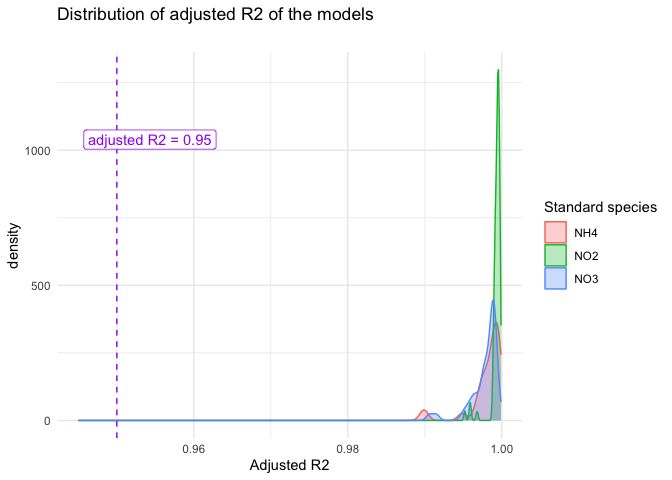

Now we plot all curves on same plot

``` r
#display.brewer.all(n = 6, type = "qual")
colors <- brewer.pal(n = 6, name = "Accent")[c(1,2,3,5)]
#"#7FC97F" "#BEAED4" "#FDC086" "#386CB0"

multi_curve_plot <- lm_output$std_data_clean |> 
  ggplot(aes(x = as.numeric(std_conc), y = abs_corrected, groups = plate_id, colour = dataset, fill = dataset)) +
  theme_minimal() + 
  theme(legend.position = "bottom") +
  geom_smooth(
    formula = y~x-1, method = "lm", se = TRUE, 
    alpha = 0, linetype = 1, linewidth = 0.15) +
  geom_point(alpha = 0.5) +
  scale_color_discrete(palette = colors) +
  scale_fill_discrete(palette = colors) +
  xlab("Standard Concentration [mg N-species / L]") +
  ylab("Blank-corrected absorbance") +
  labs(title = "Inter-plate variability of the Standard Curves")

multi_curve_plot +
  facet_wrap(~std_sp, scales = "free", ncol = 3)
```

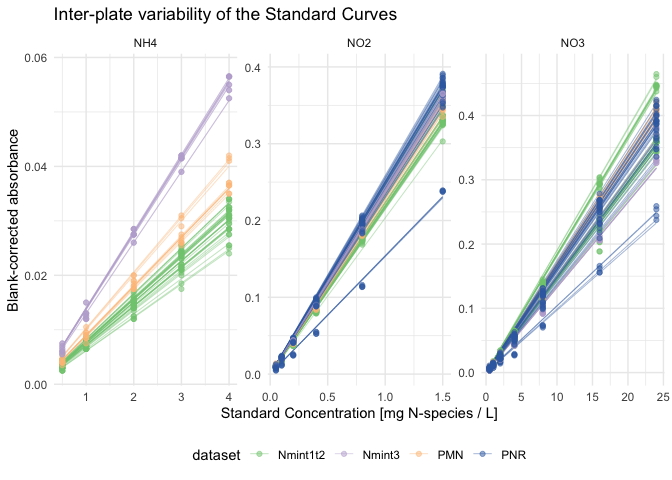

``` r
multi_curve_plot +
  facet_wrap(dataset~std_sp, scales = "free", ncol = 3)
```

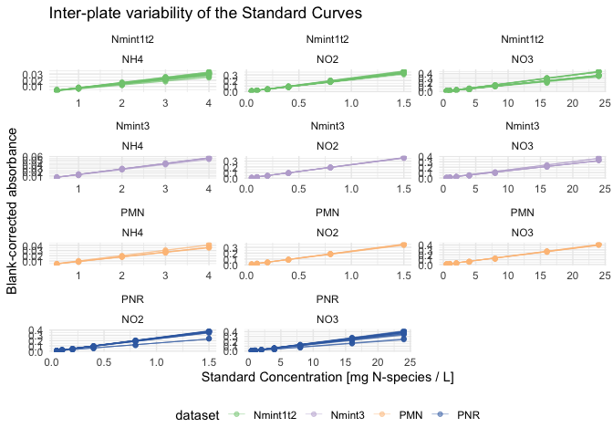

Now, finally, I decide that I am happy with my standard curves, so I can
move on to apply the equations on my data

# 4 - From absorbance to concentration

## 4.1 - clean up environment

To make sure that we don’t get confused on variable names and take old
versions from the QC pipeline

``` r
rm(list = ls())
```

``` r
lm_output <- read_rds("output/data/2_lm_output_noTDN.rds")
```

## 4.2 - Apply regression equation

Check that we are now left with only one curve per plate

``` r
if (
  (lm_output$std_data_clean |> group_by(plate_id) |>  n_groups()) == 
  (lm_output$std_data_clean |> group_by(unique_curve_id) |>  n_groups())
) {message("All good: there is exactly one curve per plate")} else {
  warning("Warning: there is at least one plate with several curves")
}
```

    All good: there is exactly one curve per plate

Regression equation is Abs = slope \* Concentration

Here, we

- connect regression data to sample absorbance data

- apply the regression equation to go from absorbance to concentration
  in mg N-sp per L

- convert unit to mg N per L

``` r
data_mg_N_L <- 
  # add slope + info regression (p-val and R2) to absorbance data
  reg_join_abs(
    lm_output$lm_table_clean, 
    lm_output$samples_corrected, 
    target_sp = "N") |> 
  # compute concentration from absorbance
  mutate(conc_mgNsp_L = abs_corrected / slope) |> 
  convert_molec(masses = molar_masses)

# check it out
data_mg_N_L
```

    # A tibble: 11,023 × 13
       dataset  plate_id  map      well_id abs_corrected std_sp target_sp std_unit  
       <chr>    <chr>     <chr>    <chr>           <dbl> <chr>  <chr>     <chr>     
     1 Nmint1t2 NH4_1F1   81_t1_z2 A2           0.007    NH4    N         mg NH4+ L…
     2 Nmint1t2 NH4_1F2_1 97_t1_z1 A2           0.00350  NH4    N         mg NH4+ L…
     3 Nmint1t2 NH4_1F3   89_t1_z3 A2           0.00288  NH4    N         mg NH4+ L…
     4 Nmint1t2 NH4_1F4   81_t1_z1 A2           0.00725  NH4    N         mg NH4+ L…
     5 Nmint1t2 NH4_1F5   Std_3_t1 A2           0.0229   NH4    N         mg NH4+ L…
     6 Nmint1t2 NH4_1G1   1_t1     A2           0.00100  NH4    N         mg NH4+ L…
     7 Nmint1t2 NH4_1G2   17_t1    A2           0.000875 NH4    N         mg NH4+ L…
     8 Nmint1t2 NH4_1G3   33_t1    A2           0.00288  NH4    N         mg NH4+ L…
     9 Nmint1t2 NH4_1G4   49_t1    A2           0.000125 NH4    N         mg NH4+ L…
    10 Nmint1t2 NH4_1G5   65_t1    A2           0.00175  NH4    N         mg NH4+ L…
    # ℹ 11,013 more rows
    # ℹ 5 more variables: slope <dbl>, adj_r_squared <dbl>, lm_p <dbl>,
    #   conc_mgNsp_L <dbl>, conc_mgN_L <dbl>

# 5 - Export

``` r
data_mg_N_L |> write_rds("output/data/2_mgNL_noTDN.rds")
```
