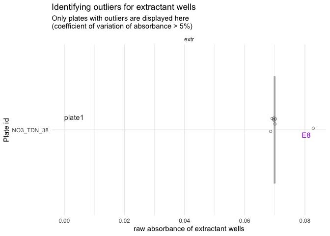
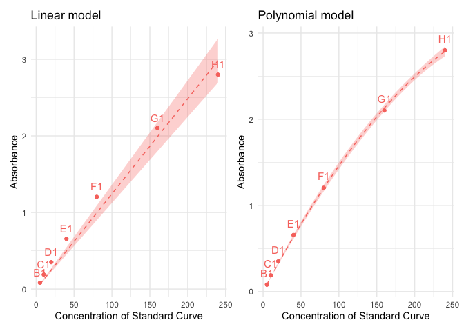
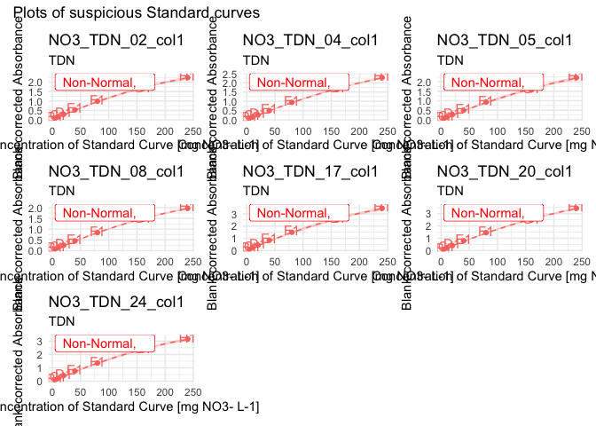
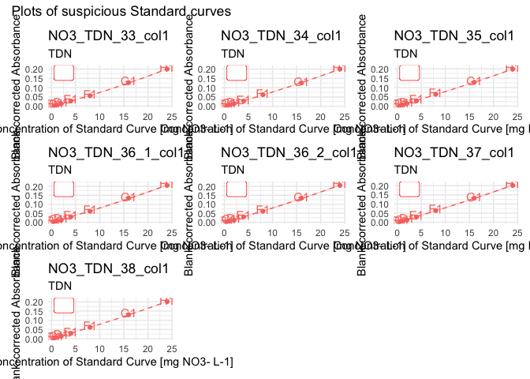
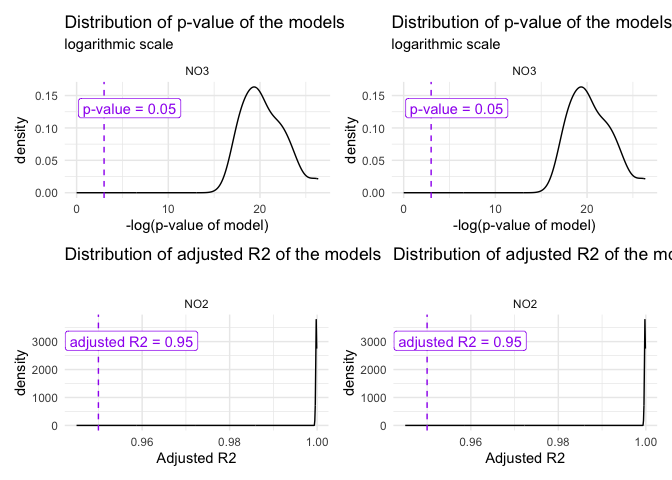
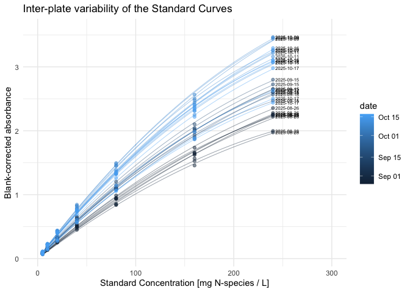

# 2.2 From Absorbance to Concentration with a Polynomial Model (incl QC)
Morgane de Toeuf

- [TO DO](#to-do)
- [Set up](#set-up)
- [1 - Suspicious wells removal](#1---suspicious-wells-removal)
  - [1.1 - Manual records](#11---manual-records)
  - [1.2 - Suspicious absorbance values
    (automated)](#12---suspicious-absorbance-values-automated)
- [2 - Correction for blank](#2---correction-for-blank)
  - [2.1 - Standard curve](#21---standard-curve)
  - [2.2 - Sample wells](#22---sample-wells)
  - [2.3 - All corrected data](#23---all-corrected-data)
- [3 - Compute regression equation (per
  plate)](#3---compute-regression-equation-per-plate)
  - [3.1 - QC standard curves - round
    1](#31---qc-standard-curves---round-1)
  - [3.2 - Multiple curve QC](#32---multiple-curve-qc)
  - [3.3 - Confirm data and export](#33---confirm-data-and-export)
- [4 - From absorbance to
  concentration](#4---from-absorbance-to-concentration)
  - [4.1 - Theoretical considerations - polynomial
    model](#41---theoretical-considerations---polynomial-model)
  - [4.2 - Application of the model](#42---application-of-the-model)
- [5 - Export](#5---export)

# TO DO

- Check how high is the highest absorbance value of 2x diluted samples
  for NO3 –\> can we remove H row?

- Check why NO2_TDN_19, wells H6, H7 and H9 have abs = 0

  - not important wells, but if it is due to a failure in raw data,
    there may be other consequences

- Consider adding a function to plate2N to question the best std model

- Make a function to plot residuals of linear vs polynomial model: copy
  code already there, put it in a loop and save plots in a list –\>
  return list and use multiplot approach

# Set up

Loading packages

``` r
rm(list = ls())

library(tidyverse)
```

    ── Attaching core tidyverse packages ──────────────────────── tidyverse 2.0.0 ──
    ✔ dplyr     1.2.1     ✔ readr     2.2.0
    ✔ forcats   1.0.1     ✔ stringr   1.6.0
    ✔ ggplot2   4.0.3     ✔ tibble    3.3.1
    ✔ lubridate 1.9.5     ✔ tidyr     1.3.2
    ✔ purrr     1.2.2     
    ── Conflicts ────────────────────────────────────────── tidyverse_conflicts() ──
    ✖ dplyr::filter() masks stats::filter()
    ✖ dplyr::lag()    masks stats::lag()
    ℹ Use the conflicted package (<http://conflicted.r-lib.org/>) to force all conflicts to become errors

``` r
library(plate2N)
library(roperators)
```


    Attaching package: 'roperators'

    The following object is masked from 'package:tibble':

        num

    The following object is masked from 'package:ggplot2':

        %+%

``` r
library(patchwork)
```

Loading data

``` r
all_raw_abs_tidy <- read_rds("output/data/1_all_raw_abs_TDN.rds")
all_plate_metadata <- read_rds("output/data/1_all_plate_metadata_TDN.rds")
```

Joining plate data and metadata

``` r
raw_meta <- all_raw_abs_tidy |> 
  left_join(all_plate_metadata, by = join_by(dataset, plate_id)) |> 
  mutate(date = as.Date(date, tryFormats = c("%d/%m/%Y")))
```

# 1 - Suspicious wells removal

## 1.1 - Manual records

This section allows the removal of wells that “we know” are failed wells
(e.g., something went wrong during pipetting…).

For now, there are no such wells for the TDN dataset

To keep consistent with object names, we create a new tidy table

``` r
raw_abs_tidy <- raw_meta
```

## 1.2 - Suspicious absorbance values (automated)

Observe values for absorbance (iteratively)

``` r
suspicious_wells <- raw_abs_tidy |> 
  qc_raw_abs(
    min_abs = 0.03, max_abs = 4, 
    plot_col_facet = "std_sp", 
    show_plot = TRUE) 
```

    Warning in qc_raw_abs(raw_abs_tidy, min_abs = 0.03, max_abs = 4, plot_col_facet = "std_sp", : 3 wells out of 5428 are out of range for absorbance, i.e., not in the set boundaries of [0.03; 4]. 
    See table to identify suspicious wells. 


``` r
suspicious_wells |> slice_max(abs, n = 10)
```

    # A tibble: 3 × 5
      dataset plate_id   well_id map               abs  
      <chr>   <chr>      <chr>   <chr>             <chr>
    1 TDN     NO2_TDN_19 H6      Ur_K2SO4_200_C.1x 0    
    2 TDN     NO2_TDN_19 H7      Ur_K2SO4_200_F.1x 0    
    3 TDN     NO2_TDN_19 H9      Ur_K2SO4_5_C.1x   0    

For now, I decide to remove those wells as they were just meant for
testing anyway. To be reviewed

``` r
raw_abs_ok <- raw_abs_tidy |> remove_wells(suspicious_wells)
#raw_abs_ok|> filter(plate_id == string, map == "Std")
```

Check the QC once more

``` r
raw_abs_ok |> 
  qc_raw_abs(min_abs = 0.03, max_abs = 3, 
    plot_col_facet = "std_sp", 
    export_plot = "none") 
```

    Warning in qc_raw_abs(raw_abs_ok, min_abs = 0.03, max_abs = 3, plot_col_facet = "std_sp", : 13 wells out of 5425 are out of range for absorbance, i.e., not in the set boundaries of [0.03; 3]. 
    See table to identify suspicious wells. 


    # A tibble: 13 × 5
       dataset plate_id   well_id map   abs  
       <chr>   <chr>      <chr>   <chr> <chr>
     1 TDN     NO3_TDN_17 H1      Std   3.607
     2 TDN     NO3_TDN_18 H1      Std   3.416
     3 TDN     NO3_TDN_19 H1      Std   3.61 
     4 TDN     NO3_TDN_20 H1      Std   3.581
     5 TDN     NO3_TDN_21 H1      Std   3.398
     6 TDN     NO3_TDN_22 H1      Std   3.213
     7 TDN     NO3_TDN_23 H1      Std   3.362
     8 TDN     NO3_TDN_24 H1      Std   3.296
     9 TDN     NO3_TDN_25 H1      Std   3.244
    10 TDN     NO3_TDN_26 H1      Std   3.253
    11 TDN     NO3_TDN_27 H1      Std   3.222
    12 TDN     NO3_TDN_28 H1      Std   3.437
    13 TDN     NO3_TDN_29 H1      Std   3.126

``` r
# Once validated, store last version in a "validated" data
raw_abs_clean <- raw_abs_ok
```

It appears that only the most concentrated wells in the standard curve
for TDN (well H1) show absorbance levels above 3. We can later look at
those curves and see whether those points are outside of the linear
range. Not to worry now, though

# 2 - Correction for blank

## 2.1 - Standard curve

Obtain curve concentrations from metadata

``` r
curve_concentration <- extract_curve(all_plate_metadata)
```

Extract Std wells, add unique curve ID, then add curve_concentration

``` r
(std_data <- raw_abs_clean |> 
  extract_std_data() |> 
  select(!std_conc) |> 
  left_join(curve_concentration, by = join_by(row, dataset, plate_id)))
```

    # A tibble: 472 × 14
    # Groups:   dataset, plate_id [59]
       row   column well_id unique_well_id dataset plate_id   unique_curve_id map  
       <chr> <chr>  <chr>   <chr>          <chr>   <chr>      <chr>           <chr>
     1 A     1      A1      A1_NO3_TDN_01  TDN     NO3_TDN_01 NO3_TDN_01_col1 Std  
     2 A     1      A1      A1_NO3_TDN_02  TDN     NO3_TDN_02 NO3_TDN_02_col1 Std  
     3 A     1      A1      A1_NO3_TDN_03  TDN     NO3_TDN_03 NO3_TDN_03_col1 Std  
     4 A     1      A1      A1_NO3_TDN_04  TDN     NO3_TDN_04 NO3_TDN_04_col1 Std  
     5 A     1      A1      A1_NO3_TDN_05  TDN     NO3_TDN_05 NO3_TDN_05_col1 Std  
     6 A     1      A1      A1_NO3_TDN_06  TDN     NO3_TDN_06 NO3_TDN_06_col1 Std  
     7 A     1      A1      A1_NO3_TDN_07  TDN     NO3_TDN_07 NO3_TDN_07_col1 Std  
     8 A     1      A1      A1_NO3_TDN_08  TDN     NO3_TDN_08 NO3_TDN_08_col1 Std  
     9 A     1      A1      A1_NO3_TDN_09  TDN     NO3_TDN_09 NO3_TDN_09_col1 Std  
    10 A     1      A1      A1_NO3_TDN_10  TDN     NO3_TDN_10 NO3_TDN_10_col1 Std  
    # ℹ 462 more rows
    # ℹ 6 more variables: abs <chr>, std_sp <chr>, std_unit <chr>,
    #   sample_dilution <chr>, date <date>, std_conc <dbl>

In this case, there is little interest in checking untrusted blanks,
because we only had one std curve per plate, meaning we cannot compute
an average anyway.

Still, we can have a look at it (if some values in A-row are higher than
B-row, it’s a warning sign, and another correction may need to be
thought through, e.g., compute the intercept of the curve)

Check unstrusted blanks (where the smallest value for a given curve is
not in row A (top_down pipetting)

``` r
std_blank <- raw_abs_clean |> extract_std_blank()
std_blank$untrusted
```

    # A tibble: 0 × 8
    # Groups:   dataset, plate_id, column [0]
    # ℹ 8 variables: well_id <chr>, dataset <chr>, plate_id <chr>, column <chr>,
    #   unique_curve_id <chr>, row <chr>, unique_well_id <chr>, abs <dbl>

``` r
#std_blank$trusted
#blank$all |> filter(plate_id == "NO3_R2R3_1")
```

There are no untrusted wells, yay :-)

There is no need per se in computing the average, as there is only one
well per blank. We directly correct the data and give as “average” the
data from the single well containing absorbance of the blank of the std
curve. Because some formatting occurs in the background, we still use
the computation of the average (on a single point)

Because the logic is similar, we will first go into blank-correction of
sample data before finalizing work on the standard curves (applying
linear regression model)

## 2.2 - Sample wells

First, extract data for wells containing extractant and have a look at
its variation

``` r
extr_data <- extract_extractant(raw_abs_clean)
(blank_avg <- extractant_average(raw_abs_clean) |> 
  arrange(desc(blank_coeff_var_percent)))
```

    # A tibble: 59 × 6
       dataset plate_id     map   blank_avg blank_sdev blank_coeff_var_percent
       <chr>   <chr>        <chr>     <dbl>      <dbl>                   <dbl>
     1 TDN     NO3_TDN_38   extr     0.0714   0.00472                     6.61
     2 TDN     NO2_TDN_03   extr     0.0365   0.00141                     3.87
     3 TDN     NO3_TDN_07   extr     0.0921   0.00314                     3.40
     4 TDN     NO3_TDN_29   extr     0.147    0.00472                     3.22
     5 TDN     NO2_TDN_17   extr     0.0384   0.00106                     2.76
     6 TDN     NO3_TDN_36_1 extr     0.0708   0.00183                     2.59
     7 TDN     NO3_TDN_32   extr     0.133    0.00344                     2.59
     8 TDN     NO2_TDN_06   extr     0.0365   0.000926                    2.54
     9 TDN     NO3_TDN_04   extr     0.102    0.00253                     2.48
    10 TDN     NO3_TDN_25   extr     0.145    0.00329                     2.28
    # ℹ 49 more rows

``` r
plot_blank_var_distrib(blank_avg)
```


We see that one plate has a high coefficient of variation, we will have
to look at it individually. Let’s set the threshold for the coefficient
of variation at 5% (default)

``` r
threshold <- 5

suspicious_plates <- raw_abs_clean |> 
  qc_raw_extr(suppress_warning = TRUE, max_coeff = threshold)

suspicious_extr <- suspicious_extr(
  raw_abs_clean, suspicious_extr_per_plate = suspicious_plates, max_coeff = threshold)
```

    Joining with `by = join_by(plate_id, map)`

``` r
# check it out
suspicious_extr
```

    # A tibble: 8 × 13
      row   column well_id unique_well_id dataset plate_id   map     abs std_sp
      <chr> <chr>  <chr>   <chr>          <chr>   <chr>      <chr> <dbl> <chr> 
    1 A     8      A8      A8_NO3_TDN_38  TDN     NO3_TDN_38 extr  0.07  NO3   
    2 B     8      B8      B8_NO3_TDN_38  TDN     NO3_TDN_38 extr  0.07  NO3   
    3 C     8      C8      C8_NO3_TDN_38  TDN     NO3_TDN_38 extr  0.069 NO3   
    4 D     8      D8      D8_NO3_TDN_38  TDN     NO3_TDN_38 extr  0.07  NO3   
    5 E     8      E8      E8_NO3_TDN_38  TDN     NO3_TDN_38 extr  0.083 NO3   
    6 F     8      F8      F8_NO3_TDN_38  TDN     NO3_TDN_38 extr  0.07  NO3   
    7 G     8      G8      G8_NO3_TDN_38  TDN     NO3_TDN_38 extr  0.069 NO3   
    8 H     8      H8      H8_NO3_TDN_38  TDN     NO3_TDN_38 extr  0.07  NO3   
    # ℹ 4 more variables: std_conc <chr>, std_unit <chr>, sample_dilution <chr>,
    #   date <date>

``` r
# plot outliers
suspicious_extr |> boxplot_outlier_extr(max_coeff = threshold)
```

    Joining with `by = join_by(plate_id)`



We have 1 plate that has one obvious outlier well. We will need to
remove it manually.

First, we create a small tibble that will serve to construct the tibble
of wells to remove

``` r
plate_ids <- suspicious_extr |> 
  ungroup() |> 
  select(dataset, plate_id) |> unique() 
plate_ids <- plate_ids |> # save numbers for plate order in the plot
  mutate(plate_order = seq(1, nrow(plate_ids)))
```

Then, we create a vector with wells to remove (going through boxplots
from top to bottom).

> [!TIP]
>
> ### Manually remove outliers
>
> > [!TIP]
> >
> > In the following chunk, you need to manually decide which wells to
> > remove, based on the boxplots produced above.
> >
> > - Make sure to deal appropriately with plates that require 2
> >   outliers or no outlier to be removed (see example below)

``` r
#** !!! MANUAL INPUT !!! *

# Which plate needs 2 outliers removed?
plate_with_2_outliers <- 3
plate_without_outliers <- 9 # use a number > nb of plates if there is no such plate

# Which wells are outliers? 
well_ids <- c("E8") # use NA for plates without outliers
```

Then we finish constructing the tibble of wells to be removed

``` r
#nb_plates <- plate_ids |> nrow()

to_remove <- plate_ids |> 
  bind_rows(plate_ids |> filter(plate_order == plate_with_2_outliers)) |> 
  arrange(plate_order) |> 
  mutate(well_id = well_ids) |> 
  filter(plate_order != plate_without_outliers) |> #remove plate without outliers
  select(!plate_order)
```

Checking that we didn’t get confused: look at `to_remove` in parallel to
the boxplot

``` r
to_remove
```

    # A tibble: 1 × 3
      dataset plate_id   well_id
      <chr>   <chr>      <chr>  
    1 TDN     NO3_TDN_38 E8     

Looks good, so we remove it from extractant data and recompute the
average

``` r
extr_data_clean <- extr_data |> 
  remove_wells(to_remove) 

blank_avg_clean <- extractant_average(extractant_data = extr_data_clean) 
```

Check that biggest coeff_var indeed below threshold

``` r
blank_avg_clean |> arrange(desc(blank_coeff_var_percent)) |> head()
```

    # A tibble: 6 × 6
      dataset plate_id     map   blank_avg blank_sdev blank_coeff_var_percent
      <chr>   <chr>        <chr>     <dbl>      <dbl>                   <dbl>
    1 TDN     NO2_TDN_03   extr     0.0365    0.00141                    3.87
    2 TDN     NO3_TDN_07   extr     0.0921    0.00314                    3.40
    3 TDN     NO3_TDN_29   extr     0.147     0.00472                    3.22
    4 TDN     NO2_TDN_17   extr     0.0384    0.00106                    2.76
    5 TDN     NO3_TDN_36_1 extr     0.0708    0.00183                    2.59
    6 TDN     NO3_TDN_32   extr     0.133     0.00344                    2.59

Now that we are confident in the per-plate average value of raw
absorbance of extractant wells, we can finally blank-correct all sample
data

## 2.3 - All corrected data

Let’s just recall all corrected data. We have 2 separate tibbles
(because the experimental design was arranged to have separate blanks
for the curve and the samples)

``` r
# Standard curve, blank-corrected and clean
std_corrected 
```

    # A tibble: 413 × 21
       row   column well_id unique_well_id dataset n_sp  TDN      nb bla   plate_id 
       <chr> <chr>  <chr>   <chr>          <chr>   <chr> <chr> <int> <chr> <chr>    
     1 B     1      B1      B1_NO3_TDN_01  TDN     NO3   TDN       1 <NA>  NO3_TDN_…
     2 B     1      B1      B1_NO3_TDN_02  TDN     NO3   TDN       2 <NA>  NO3_TDN_…
     3 B     1      B1      B1_NO3_TDN_03  TDN     NO3   TDN       3 <NA>  NO3_TDN_…
     4 B     1      B1      B1_NO3_TDN_04  TDN     NO3   TDN       4 <NA>  NO3_TDN_…
     5 B     1      B1      B1_NO3_TDN_05  TDN     NO3   TDN       5 <NA>  NO3_TDN_…
     6 B     1      B1      B1_NO3_TDN_06  TDN     NO3   TDN       6 <NA>  NO3_TDN_…
     7 B     1      B1      B1_NO3_TDN_07  TDN     NO3   TDN       7 <NA>  NO3_TDN_…
     8 B     1      B1      B1_NO3_TDN_08  TDN     NO3   TDN       8 <NA>  NO3_TDN_…
     9 B     1      B1      B1_NO3_TDN_09  TDN     NO3   TDN       9 <NA>  NO3_TDN_…
    10 B     1      B1      B1_NO3_TDN_10  TDN     NO3   TDN      10 <NA>  NO3_TDN_…
    # ℹ 403 more rows
    # ℹ 11 more variables: unique_curve_id <chr>, map <chr>, abs_corrected <dbl>,
    #   std_sp <chr>, std_unit <chr>, sample_dilution <chr>, date <date>,
    #   std_conc <dbl>, extr_id <chr>, blank_sdev <dbl>,
    #   blank_coeff_var_percent <dbl>

``` r
# Samples, blank-corrected and clean
samples_corrected 
```

    # A tibble: 4,485 × 16
       row   column well_id unique_well_id dataset plate_id   map      abs_corrected
       <chr> <chr>  <chr>   <chr>          <chr>   <chr>      <chr>            <dbl>
     1 A     2      A2      A2_NO3_TDN_01  TDN     NO3_TDN_01 102_t2_…         0.459
     2 A     2      A2      A2_NO3_TDN_02  TDN     NO3_TDN_02 92_t2_z…         0.471
     3 A     2      A2      A2_NO3_TDN_03  TDN     NO3_TDN_03 90_t2_z…         0.434
     4 A     2      A2      A2_NO3_TDN_04  TDN     NO3_TDN_04 90_t2_z…         0.433
     5 A     2      A2      A2_NO3_TDN_05  TDN     NO3_TDN_05 99_t2_z…         0.460
     6 A     2      A2      A2_NO3_TDN_06  TDN     NO3_TDN_06 81_t2_z…         0.438
     7 A     2      A2      A2_NO3_TDN_07  TDN     NO3_TDN_07 83_t2_z…         0.380
     8 A     2      A2      A2_NO3_TDN_08  TDN     NO3_TDN_08 81_t2_z…         0.375
     9 A     2      A2      A2_NO3_TDN_09  TDN     NO3_TDN_09 102_t2_…         0.759
    10 A     2      A2      A2_NO3_TDN_10  TDN     NO3_TDN_10 92_t2_z…         0.694
    # ℹ 4,475 more rows
    # ℹ 8 more variables: std_sp <chr>, std_conc <chr>, std_unit <chr>,
    #   sample_dilution <chr>, date <date>, extr_id <chr>, blank_sdev <dbl>,
    #   blank_coeff_var_percent <dbl>

# 3 - Compute regression equation (per plate)

> [!TIP]
>
> ### Polynomial model for high concentrations
>
> For the TDN data set, standard curve concentrations have been
> increased ten-fold. This resulted in highly concentrated solutions
> generating absorbance values above 3.
>
> - To be seen if we can remove the H row, but still, G rows are pretty
>   high as well
>
> - It appears that a polynomial model is more appropriated in this
>   case, as can be seen in the the next chunks (example of a single
>   curve)

``` r
# take data for a single curve and format it for the plotting
curve <- (std_corrected |> 
            group_by(plate_id, column) |> 
            filter(std_sp == "NO3") |> 
            rename(abs = abs_corrected) |> 
            group_split()
          )[[9]]

# check it out
curve
```

    # A tibble: 7 × 21
      row   column well_id unique_well_id dataset n_sp  TDN      nb bla   plate_id  
      <chr> <chr>  <chr>   <chr>          <chr>   <chr> <chr> <int> <chr> <chr>     
    1 B     1      B1      B1_NO3_TDN_09  TDN     NO3   TDN       9 <NA>  NO3_TDN_09
    2 C     1      C1      C1_NO3_TDN_09  TDN     NO3   TDN       9 <NA>  NO3_TDN_09
    3 D     1      D1      D1_NO3_TDN_09  TDN     NO3   TDN       9 <NA>  NO3_TDN_09
    4 E     1      E1      E1_NO3_TDN_09  TDN     NO3   TDN       9 <NA>  NO3_TDN_09
    5 F     1      F1      F1_NO3_TDN_09  TDN     NO3   TDN       9 <NA>  NO3_TDN_09
    6 G     1      G1      G1_NO3_TDN_09  TDN     NO3   TDN       9 <NA>  NO3_TDN_09
    7 H     1      H1      H1_NO3_TDN_09  TDN     NO3   TDN       9 <NA>  NO3_TDN_09
    # ℹ 11 more variables: unique_curve_id <chr>, map <chr>, abs <dbl>,
    #   std_sp <chr>, std_unit <chr>, sample_dilution <chr>, date <date>,
    #   std_conc <dbl>, extr_id <chr>, blank_sdev <dbl>,
    #   blank_coeff_var_percent <dbl>

``` r
# compute both models
lm_linear <- lm(abs ~ 0 + std_conc, data = curve)
lm_poly <- lm(abs ~ 0 + std_conc + I(std_conc^2), data = curve)

(sum_linear <- summary(lm_linear))
```


    Call:
    lm(formula = abs ~ 0 + std_conc, data = curve)

    Residuals:
         Min       1Q   Median       3Q      Max 
    -0.18370  0.04129  0.10244  0.13621  0.20977 

    Coefficients:
              Estimate Std. Error t value Pr(>|t|)    
    std_conc 0.0124279  0.0004877   25.48 2.41e-07 ***
    ---
    Signif. codes:  0 '***' 0.001 '**' 0.01 '*' 0.05 '.' 0.1 ' ' 1

    Residual standard error: 0.1477 on 6 degrees of freedom
    Multiple R-squared:  0.9908,    Adjusted R-squared:  0.9893 
    F-statistic: 649.5 on 1 and 6 DF,  p-value: 2.405e-07

``` r
(sum_poly <- summary(lm_poly))
```


    Call:
    lm(formula = abs ~ 0 + std_conc + I(std_conc^2), data = curve)

    Residuals:
            1         2         3         4         5         6         7 
    -0.003064  0.023935  0.025124  0.021264  0.002595 -0.028541  0.011591 

    Coefficients:
                    Estimate Std. Error t value Pr(>|t|)    
    std_conc       1.672e-02  2.846e-04   58.75 2.70e-08 ***
    I(std_conc^2) -2.127e-05  1.360e-06  -15.64 1.94e-05 ***
    ---
    Signif. codes:  0 '***' 0.001 '**' 0.01 '*' 0.05 '.' 0.1 ' ' 1

    Residual standard error: 0.0229 on 5 degrees of freedom
    Multiple R-squared:  0.9998,    Adjusted R-squared:  0.9997 
    F-statistic: 1.363e+04 on 2 and 5 DF,  p-value: 4.551e-10

Seeing the summary of both models: both are significant, but the p-value
of the coefficient for the second degree term (b in bx^2) in the
polynomial model is \<0.05, which indicates that that term significantly
contributes to the model. This becomes also very obvious when we look at
the plots (the polynomial model fits a lot better)

``` r
p_linear <- plot_std(curve, through_origin = TRUE, model = "linear") + 
  theme(legend.position = "none") + labs(title = "Linear model")
p_poly <- plot_std(curve, through_origin = TRUE, model = "poly") + 
  theme(legend.position = "none") + labs(title = "Polynomial model")

p_linear + p_poly
```



Let’s look at the Residual plot to confirm this intuition

``` r
res_linear <- residuals(sum_linear)
res_poly <- residuals(sum_poly)

# plot residuals for linear model
plot(curve$std_conc, res_linear, main = "Residuals Analysis", xlab = "Concentration", ylab = "Residuals", col = "grey30", pch = 16)
# add red line at y = 0
abline(h = 0, col = "red", lty = 2)
# add residuals for polynomial model
points(curve$std_conc, res_poly,  col = "magenta", pch = 15)
# add legend
points(0, y = -0.1, col = "grey30", pch = 16)
text(x = 6, y = -0.1, labels = "linear\nmodel", col = "grey30", adj = 0)
points(0, y = -0.15, col = "magenta", pch = 15)
text(x = 6, y = -0.15, labels = "polynomial\nmodel", col = "magenta", adj = 0)
```


So, we will adopt the polynomial model for the TDN dataset

## 3.1 - QC standard curves - round 1

First, we perform a polynomial model on each NO3 curve individually

(! not sure that NO2 is very relevant, but for NO2, linear model is
fine)

``` r
# Select NO3 & group
grouped_data_NO3 <- std_corrected |> 
  group_by(unique_curve_id) |> 
  filter(std_sp == "NO3")

grouped_data_NO2 <- std_corrected |> 
  group_by(unique_curve_id) |> 
  filter(std_sp == "NO2")

lm_NO3_raw <- lm_std_curve(grouped_data_NO3, model = "poly") 
lm_NO2_raw <- lm_std_curve(grouped_data_NO2, model = "linear")
```

Then we take a subset to examine individually: those curves where the
linear model doesn’t seem to perform ideally (e.g., non-significant
model (p-value \> 0.05), residuals not normally distributed, or
heteroscedasticity, or, for polynomial model, p-value of one of the
coefficients \> 0.05)

``` r
# extract all plates where "something" is not perfect 
lm_suspicious_NO3 <- lm_NO3_raw |> suspicious_lm(model = "poly")
lm_suspicious_NO2 <- lm_NO2_raw |> 
  suspicious_lm()

nrow(lm_suspicious_NO3) ; nrow(lm_suspicious_NO2)
```

    [1] 7

    [1] 0

There are 7 suspicious curves for NO3 and none for NO2. So we just
accept NO2 curves without check. Just a quick look at \`lm_NO2_raw”

``` r
lm_NO2_raw
```

    # A tibble: 20 × 12
       dataset plate_id     unique_curve_id   std_sp slope r_squared adj_r_squared
       <chr>   <chr>        <chr>             <chr>  <dbl>     <dbl>         <dbl>
     1 TDN     NO2_TDN_01   NO2_TDN_01_col1   NO2    0.259     1.000         1.000
     2 TDN     NO2_TDN_02   NO2_TDN_02_col1   NO2    0.259     1.000         1.000
     3 TDN     NO2_TDN_03   NO2_TDN_03_col1   NO2    0.263     1.000         1.000
     4 TDN     NO2_TDN_04   NO2_TDN_04_col1   NO2    0.262     1.000         1.000
     5 TDN     NO2_TDN_05   NO2_TDN_05_col1   NO2    0.271     1.000         1.000
     6 TDN     NO2_TDN_06   NO2_TDN_06_col1   NO2    0.273     1.000         1.000
     7 TDN     NO2_TDN_07   NO2_TDN_07_col1   NO2    0.258     1.000         1.000
     8 TDN     NO2_TDN_08   NO2_TDN_08_col1   NO2    0.258     1.000         1.000
     9 TDN     NO2_TDN_09   NO2_TDN_09_col1   NO2    0.255     1             1.000
    10 TDN     NO2_TDN_10   NO2_TDN_10_col1   NO2    0.259     1.000         1.000
    11 TDN     NO2_TDN_11   NO2_TDN_11_col1   NO2    0.277     1.000         1.000
    12 TDN     NO2_TDN_12   NO2_TDN_12_col1   NO2    0.276     1.000         1.000
    13 TDN     NO2_TDN_13   NO2_TDN_13_col1   NO2    0.264     1.000         1.000
    14 TDN     NO2_TDN_14   NO2_TDN_14_col1   NO2    0.268     1.000         1.000
    15 TDN     NO2_TDN_15   NO2_TDN_15_col1   NO2    0.266     1.000         1.000
    16 TDN     NO2_TDN_16   NO2_TDN_16_col1   NO2    0.268     1.000         1.000
    17 TDN     NO2_TDN_17   NO2_TDN_17_col1   NO2    0.246     1.000         1.000
    18 TDN     NO2_TDN_18_1 NO2_TDN_18_1_col1 NO2    0.246     1.000         1.000
    19 TDN     NO2_TDN_18_2 NO2_TDN_18_2_col1 NO2    0.246     1.000         1.000
    20 TDN     NO2_TDN_19   NO2_TDN_19_col1   NO2    0.247     1.000         1.000
    # ℹ 5 more variables: lm_p <dbl>, normality_lm_residuals <chr>,
    #   shapiro_p <dbl>, homoscedasticity_lm_residuals <chr>, breusch_pagan_p <dbl>

For NO3, we go on with the QC of the 7 suspicious curves. For visual
support, we create a list of plots where we store each individual plot
of “suspicious” standard curves

``` r
suspicious_plots_NO3 <- plot_list_lm(
  lm_suspicious_NO3, 
  std_data = std_corrected, 
  model = "poly")

# check one plot out
#suspicious_plots_NO3[[1]]
```

Now we can look at each plot individually.

``` r
patchwork::wrap_plots(suspicious_plots_NO3, axis_titles = "keep") +
     patchwork::plot_annotation(title = "Plots of suspicious Standard curves")
```



I’m not quite sure that I can or should remove wells here. Indeed, with
only 7 points, assessing normality is overstretching. It is probably
best to rely on observation?

I decide to keep all points for all curves in this dataset.

But I do want to look at the curves from the last plates (those I did
where the concentration was wrong)

``` r
plot_Mo_curves <- plot_list_lm(
  lm_data = lm_NO3_raw |> tail(n = 7), std_data = std_corrected, model = "poly"
)

patchwork::wrap_plots(plot_Mo_curves, axis_titles = "keep") +
     patchwork::plot_annotation(title = "Plots of suspicious Standard curves")
```



Interestingly, the models are all good, but we are in an upward-facing
parabole (which would change the computation of the solution (looking
for x based on y –\> take higher value: also the only one that is \> 0)

Still, extrapolation well past those concentrations seem unlikely. Let’s
see the overplotting later, but probably we have to ignore those plates

## 3.2 - Multiple curve QC

First, let’s look at the distribution of p-values and adjusted R^2 of
the std curve regressions

``` r
NO3_p <- density_lm_param(
  lm_NO3_raw, 
  p_or_r = "p", threshold = 0.05, 
  facetting_std_sp = TRUE, color_std_sp = FALSE)

NO3_adjR2 <- density_lm_param(
  lm_NO2_raw, "adjR2", 0.95, color_std_sp = FALSE 
)

NO2_p <- density_lm_param(
  lm_NO3_raw, 
  p_or_r = "p", threshold = 0.05, 
  facetting_std_sp = TRUE, color_std_sp = FALSE)

NO2_adjR2 <- density_lm_param(
  lm_NO2_raw, "adjR2", 0.95, color_std_sp = FALSE 
)
  

(NO3_p + NO2_p) / (NO3_adjR2 + NO2_adjR2)
```



Now we plot all curves on same plot. I removed “my plates” bc there were
polluting the plot. Anyway, we will get rid of those data points!

``` r
colors <- c("#7FC97F", "#BEAED4", "#FDC086")

std_Sang <- std_corrected |> 
  # take only NO3 (bc polanomial model
  filter(std_sp == "NO3")  |> 
  filter_out(nb >32) 
  

annotation <- std_Sang |> 
  select(plate_id, nb, abs_corrected, std_conc, date) |> 
  slice_max(std_conc, with_ties = TRUE)

# plot
std_Sang |> 
  ggplot(aes(
    x = as.numeric(std_conc), 
    y = abs_corrected, groups = plate_id, 
    colour = date, fill = date)) +
  theme_minimal() + 
  theme(legend.position = "right") +
  geom_smooth(
    formula = y ~ 0 + x + I(x^2), method = "lm", se = TRUE, 
    alpha = 0, linetype = 1, linewidth = 0.15) +
  geom_point(alpha = 0.5) +
 # facet_wrap(~std_sp, scales = "free") +
#  scale_color_discrete(palette = colors[1:2]) +
 # scale_fill_discrete(palette = colors[1:2]) +
  xlab("Standard Concentration [mg N-species / L]") +
  ylab("Blank-corrected absorbance") +
  labs(title = "Inter-plate variability of the Standard Curves") +
  xlim(c(0, 300)) +
  annotate(
    geom = "text",
    x = annotation$std_conc*1.01, 
    y = annotation$abs_corrected, 
    label = annotation$date, size = 2,
    hjust = 0,
    color = annotation$date
  ) 
```



There is some batch effect, which can be due to several things:

- An error in the dilution of the stock solution cannot be excluded,
  though this alone would result in

  - clear, non-overlapping groups of curves done on the same day
    (dilution only done 1x per day)

  - no particular gradient based on date (random error in pipetting –\>
    random pattern)

- The gradient in date can only be explained by a gradient in reaction
  conditions which should act the same way on samples and standard
  curves, such as:

  - temperature

  - degradation of reagents (bulk preparation)

- The within day noise is possibly due also to slight changes in
  conditions

  - incubation time slightly different

  - delay since dilution and reagent preparation

    - is there some altering of the solution once it is thawed?

    - How long since the Grieß reagent has been mixed?

    - Degradation of VCl3?

    - etc.

For now I don’t see reasons to worry about those curves, we can proceed
to apply the regression equations

## 3.3 - Confirm data and export

Let’s store all necessary data into a clean variable name to reduce
possible confusion, and let’s compute all the plots in a big list, for
storage purposes. We then export this as one output data in a single
list

Now, we save this into an rds file, clean up the environment and
re-import the clean data, so no mistake is possible

``` r
lm_output |> write_rds("output/data/2_lm_output_TDN.rds")

rm(list = ls())
lm_output <- read_rds("output/data/2_lm_output_TDN.rds")
```

# 4 - From absorbance to concentration

## 4.1 - Theoretical considerations - polynomial model

Regression equation is
`Abs = poly_a * Concentration^2 + poly_b * Concentration`. There is no
additional term because we constrained the model to be fitted through
the origin. This equation can be transformed into
`poly_a * Concentration^2 + poly_b * Concentration - Abs = 0`.

The function `polyroot()` computes the roots to a second (or higher)
degree equation of the form `ax^2 + bx + c`. It takes as argument a
vector `z` of the type `z = c(c, b, a)`. Its output is a vector with the
roots of the equation expressed as a complex number. To extract the real
component, we use the function `Re()`.

A second degree equation, by definition, accepts 2 solutions for most
values of y and its shape is a parable. If a is negative, it is an
downward-facing parable (see plotting above). In the case of our model,
we already know that the smallest of the 2 solutions for x will be the
one we are looking for, for several reasons:

- we constrained the curve to go through the origin,

- all our points will be in the ascending part of the curve (before its
  maximum)

- So that if we draw a horizontal line at any absorbance value, its
  first intersection with the parable (smallest of x1, x2) will be the
  one within the range of our standard curves (the second one would be
  in the other half, descending part of the parable)

!!! This applies because we have a downward facing parable. We are
anyway in an ascending part. Should the parable, in another dataset,
have an upward-facing shape (e.g., very small concentrations), then the
reasoning is reverse: we would be in the right-hand half of the parable,
thus the highest solution from x1 and x2.

## 4.2 - Application of the model

Polyroot is difficult to apply rowwise for now… Until I find a more
elegant way, let’s just input the standard definition of the solution to
a second degree equation for the polynomial model:

`x = (-b +- sqrt(b^2 - 4*ac)) / (2*a)`, with c = -y

Here, we

- connect regression data to sample absorbance data

- apply the regression equation to go from absorbance to concentration
  in mg N-sp per L

- convert unit to mg N per L

``` r
# For NO3
data_NO3 <- lm_output$lm_NO3_clean |> 
  filter(std_sp == "NO3") |> 
  reg_join_abs(
    lm_output$samples_corrected |> filter(std_sp == "NO3"), 
    target_sp = "N") 

data_NO2 <- lm_output$lm_NO2_clean |> 
  filter(std_sp == "NO2") |> 
  reg_join_abs(
    lm_output$samples_corrected |> filter(std_sp == "NO2"), 
    target_sp = "N") 

#data_all <- 

data_mg_N_L <- full_join(data_NO3, data_NO2) |> 
  rowwise() |> 
  mutate(
    conc_mgNsp_L = case_when(
      std_sp == "NO2" ~ (abs_corrected / slope),
      std_sp == "NO3" ~ min(c(
        (-poly_b + sqrt(poly_b^2 - 4*poly_a*(-abs_corrected))) / (2*poly_a),
        (-poly_b - sqrt(poly_b^2 - 4*poly_a*(-abs_corrected))) / (2*poly_a)
      ))
    )
  ) |> 
  convert_molec(masses = molar_masses)
```

    Joining with `by = join_by(dataset, plate_id, map, well_id, abs_corrected,
    std_sp, target_sp, std_unit, adj_r_squared, lm_p)`

``` r
# Check it out
data_mg_N_L
```

    # A tibble: 4,485 × 18
    # Rowwise: 
       dataset plate_id   map        well_id abs_corrected std_sp target_sp std_unit
       <chr>   <chr>      <chr>      <chr>           <dbl> <chr>  <chr>     <chr>   
     1 TDN     NO3_TDN_01 102_t2_z1… A2              0.459 NO3    N         mg NO3-…
     2 TDN     NO3_TDN_02 92_t2_z2_… A2              0.471 NO3    N         mg NO3-…
     3 TDN     NO3_TDN_03 90_t2_z3_… A2              0.434 NO3    N         mg NO3-…
     4 TDN     NO3_TDN_04 90_t2_z1_… A2              0.433 NO3    N         mg NO3-…
     5 TDN     NO3_TDN_05 99_t2_z2_… A2              0.460 NO3    N         mg NO3-…
     6 TDN     NO3_TDN_06 81_t2_z2_… A2              0.438 NO3    N         mg NO3-…
     7 TDN     NO3_TDN_07 83_t2_z3_… A2              0.380 NO3    N         mg NO3-…
     8 TDN     NO3_TDN_08 81_t2_z1_… A2              0.375 NO3    N         mg NO3-…
     9 TDN     NO3_TDN_09 102_t2_z1… A2              0.759 NO3    N         mg NO3-…
    10 TDN     NO3_TDN_10 92_t2_z2_… A2              0.694 NO3    N         mg NO3-…
    # ℹ 4,475 more rows
    # ℹ 10 more variables: poly_a <dbl>, poly_a_p <dbl>, poly_b <dbl>,
    #   poly_b_p <dbl>, r_squared <dbl>, adj_r_squared <dbl>, lm_p <dbl>,
    #   slope <dbl>, conc_mgNsp_L <dbl>, conc_mgN_L <dbl>

# 5 - Export

``` r
data_mg_N_L |> write_rds("output/data/2_mgNL_TDN.rds")
```
