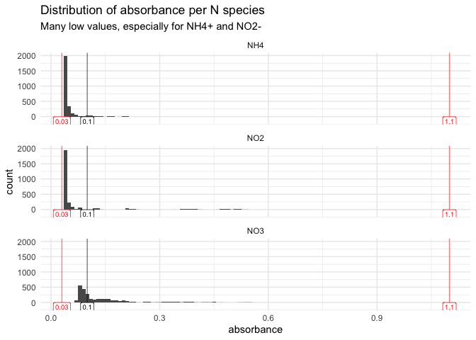
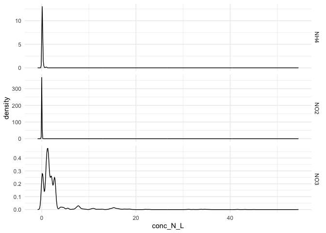
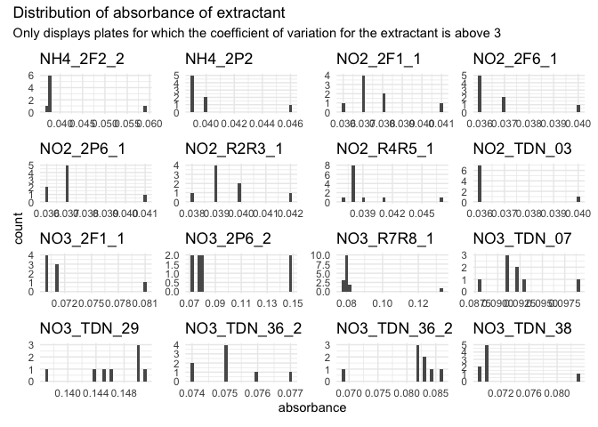
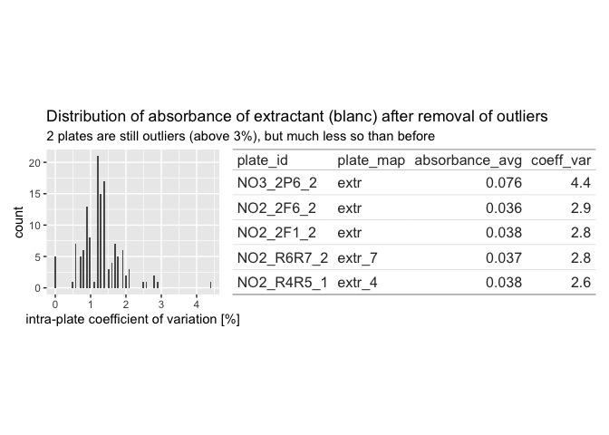
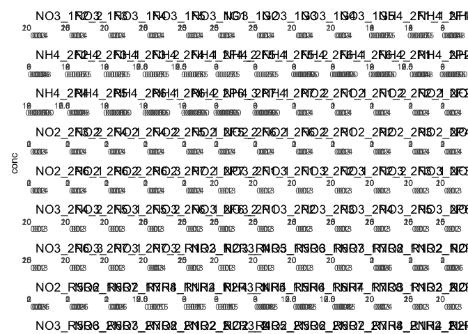
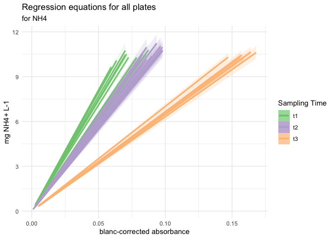
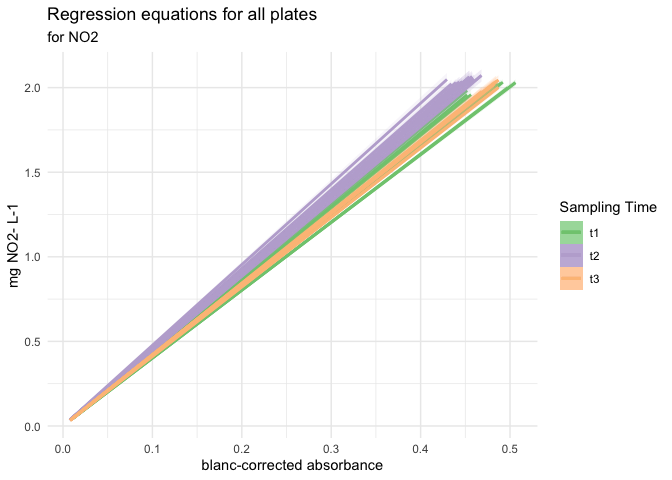
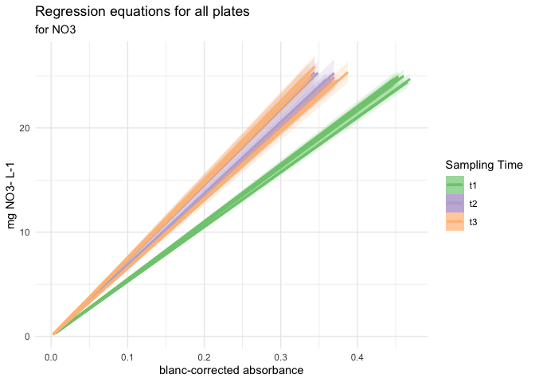
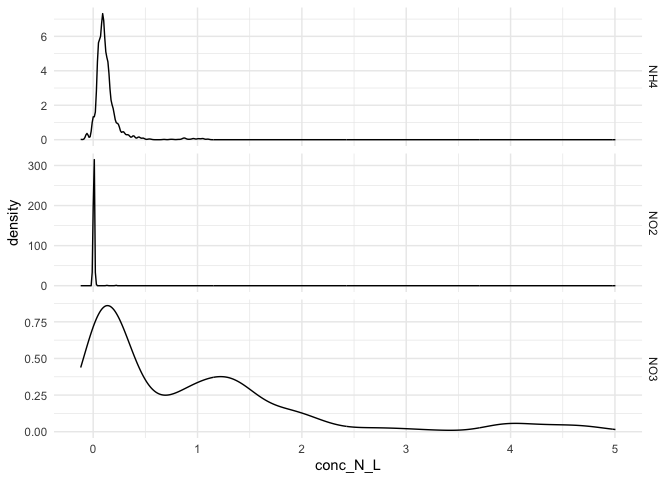

# V. Pipeline for Absorbance data


- [To Do](#to-do)
- [Intro](#intro)
- [Code](#code)
  - [1 - Set up](#1---set-up)
  - [2 - QC suspicious wells](#2---qc-suspicious-wells)
  - [3 - Correct absorbance values](#3---correct-absorbance-values)
    - [3.1 - Correct std curves for
      blanc](#31---correct-std-curves-for-blanc)
    - [3.2 - Correct samples for blanc](#32---correct-samples-for-blanc)
- [°<sup>°°°</sup> Milestone : corrected data ready for downstream
  analysis
  °<sup>°°°</sup>](#-milestone--corrected-data-ready-for-downstream-analysis-)
- [4 - Compute regression equation btw absorbance and
  concentration](#4---compute-regression-equation-btw-absorbance-and-concentration)
  - [4.1 - Quality check of standard curves (NH4 only for
    now)](#41---quality-check-of-standard-curves-nh4-only-for-now)
  - [4.2 - Perform linear model and infer
    slope](#42---perform-linear-model-and-infer-slope)
  - [4.3 - Compute concentrations in N
    species](#43---compute-concentrations-in-n-species)
- [°<sup>°°°</sup> Milestone : all data ready for downstream analysis
  °<sup>°°°</sup>](#-milestone--all-data-ready-for-downstream-analysis-)
- [°°° —- START HERE — °°°°](#---start-here--)
- [°°° —- Below this: draft, to be picked up —
  °°°°](#---below-this-draft-to-be-picked-up--)
  - [6 - Exporting data](#6---exporting-data)
- [Algorithm in natural language](#algo_natural)

# To Do

- export + downstream steps (different options based on analysis)

# Intro

For an explanation of the pipeline in English, see last section
“Algorithm in natural language”. It is not 100% up to date, but it shows
the main steps of the pipeline

# Code

## 1 - Set up

Loading packages

``` r
library(tidyverse)
```

    ── Attaching core tidyverse packages ──────────────────────── tidyverse 2.0.0 ──
    ✔ dplyr     1.1.4     ✔ readr     2.1.5
    ✔ forcats   1.0.1     ✔ stringr   1.6.0
    ✔ ggplot2   4.0.0     ✔ tibble    3.3.0
    ✔ lubridate 1.9.4     ✔ tidyr     1.3.1
    ✔ purrr     1.2.0     
    ── Conflicts ────────────────────────────────────────── tidyverse_conflicts() ──
    ✖ dplyr::filter() masks stats::filter()
    ✖ dplyr::lag()    masks stats::lag()
    ℹ Use the conflicted package (<http://conflicted.r-lib.org/>) to force all conflicts to become errors

``` r
library(roperators) # to be able to add %ni% for "not in"
```


    Attaching package: 'roperators'

    The following object is masked from 'package:tibble':

        num

    The following object is masked from 'package:ggplot2':

        %+%

``` r
library(patchwork) # for wrap_plots
library(RColorBrewer) # to find and set color palette

source("functions/extract_curve.R")
source("functions/plot_qc_std_all.R")
```

Prep template data: fake tables for the sake of building the next steps
of the code. Once that code is working, then we can figure out how to
extract real plate data instead of this fake model one.

``` r
# import tidy data and metadata
Nmin_data <- read_rds("output/data/Nmin_tidy.rds")
Nmin_metadata <- read_rds("output/data/Nmin_metadata.rds")

# remove empty wells
Nmin_full <- Nmin_data |> filter(plate_map != "empty")
```

Set up pipetting direction for the std curve

``` r
top_down_pipetting <- LETTERS[2:8]
#bottom_up_pipetting <- LETTERS[8:2]
pipetting_direction <- top_down_pipetting
```

## 2 - QC suspicious wells

**–\> Issues a warning if absorbances not in specified range,
e.g. \[0.03,1.1\]**

The ideal range for absorbance readings (Beer-Lambert in linear range of
relationship between concentration and absorbance) is between 0.1 and 1.
But these are not super strict borders. I don’t want to send out a
warning message too soon, so we take higher values.

This chunk filters out only rows where absorbance is out of range, and
returns either a warning (when there are out-of-range values) or a happy
message (when there are none). In case of a warning, it also shares the
table with suspicious wells, so that the user can take an informed
decision.

<u>**To be thought through:**</u>

- What are options then? Remove suspicious wells (replace by NAs?) –\>
  deal with it if we are confronted with it

- another option could be, instead of returning a table, to return only
  the min and max values of absorbance and/or the number of wells that
  are out of range

- 

``` r
#** Make sure empty wells contain NA, otherwise, lots of warning messages? To be tested *
#*

# the threshold can be moved a little
min_abs <- 0.03
max_abs <- 1.1

# initiate data frame that will contain suspicious well ids
suspicious_rows <- c() 
for (i in 1:nrow(Nmin_full)) {
  if (Nmin_full$absorbance[i] < min_abs || Nmin_full$absorbance[i] > max_abs) {
    print(Nmin_full$absorbance[i])
    suspicious_rows <- append(suspicious_rows, i)
    }
}
# Send a warning message
if (!is.null(suspicious_rows)) {
  warning(paste0("Some wells are out of range for absorbance, i.e., not in [", min_abs, "; ",max_abs, "] allowed \nSee table hereabove to identify suspicious wells"))
  
  Nmin_full |> filter(row_number() %in% suspicious_rows)
} else {
  message(paste0("°^° !! YAY !! °^° All wells are in range for absorbance between ", min_abs, " and ", max_abs))
}
```

    °^° !! YAY !! °^° All wells are in range for absorbance between 0.03 and 1.1

``` r
# ok with a threshold min of 0.03, but more than 4000 when threshold of 0.05
#out_of_range <- Nmin_full |> filter(row_number() %in% suspicious_rows) 

# but they're all NH4 or NO2 --> acceptable!
# out_of_range |> filter(
#   str_split_i(plate_id, pattern = "_", 1) %ni% c("NH4", "NO2")
#   )
```

Other approach: Report on min and max well values + distribution so user
can evaluate, see
<a href="#fig-plot_QC_wells" class="quarto-xref">Figure 1</a>

``` r
plot_QC_wells <- Nmin_full |> 
  ggplot(aes(x = absorbance)) +
  theme_minimal() +
  #geom_boxplot(aes(x = N_sp, y = absorbance))
  geom_histogram(binwidth = 0.01) +
  geom_vline(aes(xintercept = min_abs), color = "red", alpha = 0.5) +
  geom_vline(aes(xintercept = 0.1), color = "black", alpha = 0.5) +
  geom_vline(aes(xintercept = max_abs), color = "red", alpha = 0.5) +
  annotate(geom = "label", x = min_abs, y = -150, label = min_abs, color = "red", size = 2.5) +
  annotate(geom = "label", x = max_abs, y = -150, label = max_abs, color = "red", size = 2.5) +
  annotate(geom = "label", x = 0.1, y = -150, label = "0.1", color = "black", size = 2.5) +
 # geom_density() +
  facet_wrap(~N_sp, nrow = 3) +
  labs(
    title = "Distribution of absorbance per N species",
    subtitle = "Many low values, especially for NH4+ and NO2-")

plot_QC_wells
```

<div id="fig-plot_QC_wells">

<div class="cell-output-display">

<div id="fig-plot_QC_wells">



(a) This figures shows raw numbers of uncorrected absorbance (no blanc
correction). It contains all values, including values of blanc wells and
values of the standard curve. Low values are expected for NO2-, less so
for NH4+

</div>

</div>

Figure 1: QC of Suspicious wells - Distribution of raw absorbance per N
species

</div>

## 3 - Correct absorbance values

Now we correct absorbance values by subtracting blanc values from raw
values (absorbance of the light by the solution = absorbance by the
blank solution + absorbance by the substance to be quantified)

If the standard curves were prepared in water, then the blanc for the
standard curve is the absorbance of the well containing only water of
that curve. If it was prepared with the extractant, then the blanc is
the mean of the values of the wells where the extractant was added.

<u>**To be thought through:**</u>

- If it becomes relevant: make some sort of if condition, based on plate
  information (`blanc_id` and `std_id`)

- Make sure that the slice-min part in next chunk behaves as expected in
  the case of a tie

### 3.1 - Correct std curves for blanc

For now, this is a separate process to account for the fact that the
standard curve was prepared in H2O, not in the extractant (K2SO4 or
KCl).

First, we extract the rows containing data related to Standard curves
only

``` r
std_data <- Nmin_full |> 
  # take only plate-columns with standard curves
  filter(
    plate_map == "Std") |> 
  group_by(plate_id)
std_data
```

    # A tibble: 2,160 × 8
    # Groups:   plate_id [135]
       row   column well_id unique_well_id N_sp  plate_id plate_map absorbance
       <chr>  <dbl> <chr>   <chr>          <chr> <chr>    <chr>          <dbl>
     1 A          1 A1      NH4_1F1_A1     NH4   NH4_1F1  Std            0.039
     2 B          1 B1      NH4_1F1_B1     NH4   NH4_1F1  Std            0.043
     3 C          1 C1      NH4_1F1_C1     NH4   NH4_1F1  Std            0.047
     4 D          1 D1      NH4_1F1_D1     NH4   NH4_1F1  Std            0.053
     5 E          1 E1      NH4_1F1_E1     NH4   NH4_1F1  Std            0.059
     6 F          1 F1      NH4_1F1_F1     NH4   NH4_1F1  Std            0.067
     7 G          1 G1      NH4_1F1_G1     NH4   NH4_1F1  Std            0.096
     8 H          1 H1      NH4_1F1_H1     NH4   NH4_1F1  Std            0.126
     9 A         12 A12     NH4_1F1_A12    NH4   NH4_1F1  Std            0.038
    10 B         12 B12     NH4_1F1_B12    NH4   NH4_1F1  Std            0.042
    # ℹ 2,150 more rows

A typical pipetting error with the automated pipette is to forget to
expell the first bit (containing air) before the “real” pipetting
starts. In this case, the first well to be pipetted (typically well A1)
will receive a wrong amount of reagent, which in turn may impact
stoechiometry and volume, thus absorbance reads. The next chunk allows
the identification of minimum values within a standard curve that are
not situated in the first or last row of the plate (usually the standard
curve is pipetted in ascending or descending order).

With this information, for example, we can exclude wells where first row
is bigger than second row (issue in pipetting).

–\> In the chunk below we get 3 suspicious curves. So we can exclude
those combinations of plate and column from the computation of the
average blanc. So we will only take the value from the other std curve.
Here, we always pipetted 2 per plate.

–\> This option of course is not valid in the case where only one
standard curve is pipetted per plate. In that case, one option is to
check whether absorbance values are fairly constant between plates. If
so, it is a fair correction to take the inter-plate average value (or a
standardized version of it… we’ll cross that bridge when we get to it)

``` r
# Identify plates, wells, columns where there was an issue: the min value for the Std curve is not in row A or row H (in case pipetting was in the opposite direction...)

#suspicious_blancs <- # in case we need to store it somewhere
std_data |> 
  group_by(plate_id, column) |> 
  slice_min(absorbance) |> 
  filter(row %ni% c("A", "H")) 
```

    # A tibble: 4 × 8
    # Groups:   plate_id, column [4]
      row   column well_id unique_well_id N_sp  plate_id   plate_map absorbance
      <chr>  <dbl> <chr>   <chr>          <chr> <chr>      <chr>          <dbl>
    1 B          1 B1      NH4_2F5_1_B1   NH4   NH4_2F5_1  Std            0.042
    2 B          1 B1      NH4_2F5_2_B1   NH4   NH4_2F5_2  Std            0.042
    3 B          1 B1      NO3_R2R3_1_B1  NO3   NO3_R2R3_1 Std            0.105
    4 B          1 B1      NO3_R2R3_2_B1  NO3   NO3_R2R3_2 Std            0.105

Now, we can compute the average blanc values, but disregard those
suspicious wells

First, we check that we indeed have 2 columns with std curve on every
plate

``` r
# check that we have 2 columns with Std per plate --> option to remove suspicious blancs
# nb of std columns to check
nb_std <- 2

# sum for next code returns a number that is double the nb of rows
nb_std_per_plate <- std_data |> 
  summarise(
    min(absorbance),
    n_std = n()/8
    ) 
# check if true
nrow(nb_std_per_plate) == sum(nb_std_per_plate$n_std)/nb_std # TRUE --> ok!
```

    [1] TRUE

``` r
nb_std_per_plate |> ggplot(aes(x = n_std)) + geom_histogram() + labs(title = "if only 1 bin, good news :-)") # also good check
```

    `stat_bin()` using `bins = 30`. Pick better value `binwidth`.


Second, we can take a subset of `std_data` that contains only the rows
with blancs, and only those that we trust (normally row A or H only)

``` r
# extract ("slice") only rows with the smallest absorbance
std_blanc_all <- std_data |> 
  slice_min(
    absorbance, # slice min according to the valus in abs
    n = nb_std,  # pick as many rows as the nb of columns with standard curve
    with_ties = FALSE # in case there are ties, it will add extra rows
    ) 
std_blanc_all
```

    # A tibble: 270 × 8
    # Groups:   plate_id [135]
       row   column well_id unique_well_id N_sp  plate_id  plate_map absorbance
       <chr>  <dbl> <chr>   <chr>          <chr> <chr>     <chr>          <dbl>
     1 A         12 A12     NH4_1F1_A12    NH4   NH4_1F1   Std            0.038
     2 A          1 A1      NH4_1F1_A1     NH4   NH4_1F1   Std            0.039
     3 A         12 A12     NH4_1F2_1_A12  NH4   NH4_1F2_1 Std            0.038
     4 A          1 A1      NH4_1F2_1_A1   NH4   NH4_1F2_1 Std            0.039
     5 A         12 A12     NH4_1F2_2_A12  NH4   NH4_1F2_2 Std            0.038
     6 A          1 A1      NH4_1F2_2_A1   NH4   NH4_1F2_2 Std            0.039
     7 A          1 A1      NH4_1F3_A1     NH4   NH4_1F3   Std            0.038
     8 A         12 A12     NH4_1F3_A12    NH4   NH4_1F3   Std            0.038
     9 A         12 A12     NH4_1F4_A12    NH4   NH4_1F4   Std            0.038
    10 A          1 A1      NH4_1F4_A1     NH4   NH4_1F4   Std            0.039
    # ℹ 260 more rows

``` r
# check that we will remove the "correct" suspicious blancs in a moment
std_blanc_trusted <- std_blanc_all |> 
  # remove anything not first or last row of plate <=> suspicious
  filter(row %in% c("A", "H"))

# see that we get 3 less rows now
std_blanc_trusted
```

    # A tibble: 266 × 8
    # Groups:   plate_id [135]
       row   column well_id unique_well_id N_sp  plate_id  plate_map absorbance
       <chr>  <dbl> <chr>   <chr>          <chr> <chr>     <chr>          <dbl>
     1 A         12 A12     NH4_1F1_A12    NH4   NH4_1F1   Std            0.038
     2 A          1 A1      NH4_1F1_A1     NH4   NH4_1F1   Std            0.039
     3 A         12 A12     NH4_1F2_1_A12  NH4   NH4_1F2_1 Std            0.038
     4 A          1 A1      NH4_1F2_1_A1   NH4   NH4_1F2_1 Std            0.039
     5 A         12 A12     NH4_1F2_2_A12  NH4   NH4_1F2_2 Std            0.038
     6 A          1 A1      NH4_1F2_2_A1   NH4   NH4_1F2_2 Std            0.039
     7 A          1 A1      NH4_1F3_A1     NH4   NH4_1F3   Std            0.038
     8 A         12 A12     NH4_1F3_A12    NH4   NH4_1F3   Std            0.038
     9 A         12 A12     NH4_1F4_A12    NH4   NH4_1F4   Std            0.038
    10 A          1 A1      NH4_1F4_A1     NH4   NH4_1F4   Std            0.039
    # ℹ 256 more rows

Third, we compute the blanc value (average) and return a warning if
blanc values show too much variation (in the case of several
plate-columns with standard curves)

``` r
#** !! Adapt threshold parameter *

# Change parameter "2" in something computed?

std_blanc_avg <-  std_blanc_trusted |> 
  summarise(
    blanc_avg = mean(absorbance), 
    blanc_sdev = sd(absorbance)) |> 
  mutate(
    blanc_coeff_var_percent = 100 * blanc_sdev / blanc_avg)
std_blanc_avg
```

    # A tibble: 135 × 4
       plate_id  blanc_avg blanc_sdev blanc_coeff_var_percent
       <chr>         <dbl>      <dbl>                   <dbl>
     1 NH4_1F1      0.0385   0.000707                    1.84
     2 NH4_1F2_1    0.0385   0.000707                    1.84
     3 NH4_1F2_2    0.0385   0.000707                    1.84
     4 NH4_1F3      0.038    0                           0   
     5 NH4_1F4      0.0385   0.000707                    1.84
     6 NH4_1F5      0.0385   0.000707                    1.84
     7 NH4_1G1      0.0385   0.000707                    1.84
     8 NH4_1G2      0.0385   0.000707                    1.84
     9 NH4_1G3      0.038    0                           0   
    10 NH4_1G4      0.038    0                           0   
    # ℹ 125 more rows

``` r
# Do we accept this "worse" level of variation?
# Find an automatized way to look at it?
std_blanc_avg |> 
  slice_max(blanc_coeff_var_percent, n = 10)
```

    # A tibble: 10 × 4
       plate_id   blanc_avg blanc_sdev blanc_coeff_var_percent
       <chr>          <dbl>      <dbl>                   <dbl>
     1 NO2_1F3       0.0385    0.00354                    9.18
     2 NO2_1G2       0.037     0.00141                    3.82
     3 NH4_2F2_1     0.038     0.00141                    3.72
     4 NH4_2F2_2     0.038     0.00141                    3.72
     5 NO3_2P4       0.0835    0.00212                    2.54
     6 NO3_1G3       0.0875    0.00212                    2.42
     7 NO3_R7R8_1    0.0875    0.00212                    2.42
     8 NO3_R7R8_2    0.0875    0.00212                    2.42
     9 NO3_R4R5_1    0.0885    0.00212                    2.40
    10 NO3_R4R5_2    0.0885    0.00212                    2.40

``` r
# coeff variation above 3% are only a few, all below 10%, and only for NO2 and NH4, acceptable

# Warning if values are too divergent (decide what "threshold" is for the coefficient of variation ?)

threshold <- 5 # max coeff_var that we accept [%] 

# in case of several values...
if (#length(std_column) != 1 # replace by something else
  TRUE) {
  # ... and of coefficient of variation > set threshold
  if (max(std_blanc_avg$blanc_coeff_var_percent,na.rm = TRUE) > threshold) {
    # send a warning
    warning(paste0("There are plates showing a big variation in absorbance values the blanc of the standard curve (more than ", threshold, "%).\nPick the most likely values / remove outliers manually.\nSee tables above to judge on values and find suspicious wells"))
    # and show suspicious wells
    std_blanc_avg |> 
      filter(blanc_coeff_var_percent > threshold)
      #slice_max(blanc_coeff_var_percent, n = 10)
  }
}
```

    Warning: There are plates showing a big variation in absorbance values the blanc of the standard curve (more than 5%).
    Pick the most likely values / remove outliers manually.
    See tables above to judge on values and find suspicious wells

    # A tibble: 1 × 4
      plate_id blanc_avg blanc_sdev blanc_coeff_var_percent
      <chr>        <dbl>      <dbl>                   <dbl>
    1 NO2_1F3     0.0385    0.00354                    9.18

``` r
std_blanc_avg |> 
  slice_max(blanc_coeff_var_percent, n = 10)
```

    # A tibble: 10 × 4
       plate_id   blanc_avg blanc_sdev blanc_coeff_var_percent
       <chr>          <dbl>      <dbl>                   <dbl>
     1 NO2_1F3       0.0385    0.00354                    9.18
     2 NO2_1G2       0.037     0.00141                    3.82
     3 NH4_2F2_1     0.038     0.00141                    3.72
     4 NH4_2F2_2     0.038     0.00141                    3.72
     5 NO3_2P4       0.0835    0.00212                    2.54
     6 NO3_1G3       0.0875    0.00212                    2.42
     7 NO3_R7R8_1    0.0875    0.00212                    2.42
     8 NO3_R7R8_2    0.0875    0.00212                    2.42
     9 NO3_R4R5_1    0.0885    0.00212                    2.40
    10 NO3_R4R5_2    0.0885    0.00212                    2.40

If we are troubled by the big variation within plate, we can check out
the identified suspicious plates. In this case, I find it not so
dramatic. We are just dealing with small values…

We can look at suspicious blancs in their plate context.

<u>**To be thought through:**</u>

- We could maybe use `patchwork::wrap_table()` to visualize them in the
  nice way. Maybe to do later…

``` r
nb_of_plates_to_look_at <- 3

std_blanc_big_coeff <- std_blanc_avg |> 
  slice_max(blanc_coeff_var_percent, n = nb_of_plates_to_look_at)

for (plate in 1:length(std_blanc_big_coeff)) {
  print(std_data |> filter(plate_id == std_blanc_big_coeff$plate_id[plate]))
}
```

    # A tibble: 16 × 8
    # Groups:   plate_id [1]
       row   column well_id unique_well_id N_sp  plate_id plate_map absorbance
       <chr>  <dbl> <chr>   <chr>          <chr> <chr>    <chr>          <dbl>
     1 A          1 A1      NO2_1F3_A1     NO2   NO2_1F3  Std            0.041
     2 B          1 B1      NO2_1F3_B1     NO2   NO2_1F3  Std            0.048
     3 C          1 C1      NO2_1F3_C1     NO2   NO2_1F3  Std            0.06 
     4 D          1 D1      NO2_1F3_D1     NO2   NO2_1F3  Std            0.081
     5 E          1 E1      NO2_1F3_E1     NO2   NO2_1F3  Std            0.129
     6 F          1 F1      NO2_1F3_F1     NO2   NO2_1F3  Std            0.23 
     7 G          1 G1      NO2_1F3_G1     NO2   NO2_1F3  Std            0.399
     8 H          1 H1      NO2_1F3_H1     NO2   NO2_1F3  Std            0.522
     9 A         12 A12     NO2_1F3_A12    NO2   NO2_1F3  Std            0.036
    10 B         12 B12     NO2_1F3_B12    NO2   NO2_1F3  Std            0.048
    11 C         12 C12     NO2_1F3_C12    NO2   NO2_1F3  Std            0.058
    12 D         12 D12     NO2_1F3_D12    NO2   NO2_1F3  Std            0.08 
    13 E         12 E12     NO2_1F3_E12    NO2   NO2_1F3  Std            0.128
    14 F         12 F12     NO2_1F3_F12    NO2   NO2_1F3  Std            0.23 
    15 G         12 G12     NO2_1F3_G12    NO2   NO2_1F3  Std            0.396
    16 H         12 H12     NO2_1F3_H12    NO2   NO2_1F3  Std            0.525
    # A tibble: 16 × 8
    # Groups:   plate_id [1]
       row   column well_id unique_well_id N_sp  plate_id plate_map absorbance
       <chr>  <dbl> <chr>   <chr>          <chr> <chr>    <chr>          <dbl>
     1 A          1 A1      NO2_1G2_A1     NO2   NO2_1G2  Std            0.038
     2 B          1 B1      NO2_1G2_B1     NO2   NO2_1G2  Std            0.048
     3 C          1 C1      NO2_1G2_C1     NO2   NO2_1G2  Std            0.059
     4 D          1 D1      NO2_1G2_D1     NO2   NO2_1G2  Std            0.08 
     5 E          1 E1      NO2_1G2_E1     NO2   NO2_1G2  Std            0.127
     6 F          1 F1      NO2_1G2_F1     NO2   NO2_1G2  Std            0.223
     7 G          1 G1      NO2_1G2_G1     NO2   NO2_1G2  Std            0.39 
     8 H          1 H1      NO2_1G2_H1     NO2   NO2_1G2  Std            0.487
     9 A         12 A12     NO2_1G2_A12    NO2   NO2_1G2  Std            0.036
    10 B         12 B12     NO2_1G2_B12    NO2   NO2_1G2  Std            0.048
    11 C         12 C12     NO2_1G2_C12    NO2   NO2_1G2  Std            0.058
    12 D         12 D12     NO2_1G2_D12    NO2   NO2_1G2  Std            0.079
    13 E         12 E12     NO2_1G2_E12    NO2   NO2_1G2  Std            0.131
    14 F         12 F12     NO2_1G2_F12    NO2   NO2_1G2  Std            0.225
    15 G         12 G12     NO2_1G2_G12    NO2   NO2_1G2  Std            0.402
    16 H         12 H12     NO2_1G2_H12    NO2   NO2_1G2  Std            0.489
    # A tibble: 16 × 8
    # Groups:   plate_id [1]
       row   column well_id unique_well_id N_sp  plate_id  plate_map absorbance
       <chr>  <dbl> <chr>   <chr>          <chr> <chr>     <chr>          <dbl>
     1 A          1 A1      NH4_2F2_1_A1   NH4   NH4_2F2_1 Std            0.039
     2 B          1 B1      NH4_2F2_1_B1   NH4   NH4_2F2_1 Std            0.041
     3 C          1 C1      NH4_2F2_1_C1   NH4   NH4_2F2_1 Std            0.045
     4 D          1 D1      NH4_2F2_1_D1   NH4   NH4_2F2_1 Std            0.052
     5 E          1 E1      NH4_2F2_1_E1   NH4   NH4_2F2_1 Std            0.059
     6 F          1 F1      NH4_2F2_1_F1   NH4   NH4_2F2_1 Std            0.068
     7 G          1 G1      NH4_2F2_1_G1   NH4   NH4_2F2_1 Std            0.101
     8 H          1 H1      NH4_2F2_1_H1   NH4   NH4_2F2_1 Std            0.121
     9 A         12 A12     NH4_2F2_1_A12  NH4   NH4_2F2_1 Std            0.037
    10 B         12 B12     NH4_2F2_1_B12  NH4   NH4_2F2_1 Std            0.042
    11 C         12 C12     NH4_2F2_1_C12  NH4   NH4_2F2_1 Std            0.044
    12 D         12 D12     NH4_2F2_1_D12  NH4   NH4_2F2_1 Std            0.052
    13 E         12 E12     NH4_2F2_1_E12  NH4   NH4_2F2_1 Std            0.059
    14 F         12 F12     NH4_2F2_1_F12  NH4   NH4_2F2_1 Std            0.067
    15 G         12 G12     NH4_2F2_1_G12  NH4   NH4_2F2_1 Std            0.102
    16 H         12 H12     NH4_2F2_1_H12  NH4   NH4_2F2_1 Std            0.117
    # A tibble: 16 × 8
    # Groups:   plate_id [1]
       row   column well_id unique_well_id N_sp  plate_id  plate_map absorbance
       <chr>  <dbl> <chr>   <chr>          <chr> <chr>     <chr>          <dbl>
     1 A          1 A1      NH4_2F2_2_A1   NH4   NH4_2F2_2 Std            0.039
     2 B          1 B1      NH4_2F2_2_B1   NH4   NH4_2F2_2 Std            0.041
     3 C          1 C1      NH4_2F2_2_C1   NH4   NH4_2F2_2 Std            0.045
     4 D          1 D1      NH4_2F2_2_D1   NH4   NH4_2F2_2 Std            0.052
     5 E          1 E1      NH4_2F2_2_E1   NH4   NH4_2F2_2 Std            0.059
     6 F          1 F1      NH4_2F2_2_F1   NH4   NH4_2F2_2 Std            0.068
     7 G          1 G1      NH4_2F2_2_G1   NH4   NH4_2F2_2 Std            0.101
     8 H          1 H1      NH4_2F2_2_H1   NH4   NH4_2F2_2 Std            0.121
     9 A         12 A12     NH4_2F2_2_A12  NH4   NH4_2F2_2 Std            0.037
    10 B         12 B12     NH4_2F2_2_B12  NH4   NH4_2F2_2 Std            0.042
    11 C         12 C12     NH4_2F2_2_C12  NH4   NH4_2F2_2 Std            0.044
    12 D         12 D12     NH4_2F2_2_D12  NH4   NH4_2F2_2 Std            0.052
    13 E         12 E12     NH4_2F2_2_E12  NH4   NH4_2F2_2 Std            0.059
    14 F         12 F12     NH4_2F2_2_F12  NH4   NH4_2F2_2 Std            0.067
    15 G         12 G12     NH4_2F2_2_G12  NH4   NH4_2F2_2 Std            0.102
    16 H         12 H12     NH4_2F2_2_H12  NH4   NH4_2F2_2 Std            0.117

Now we can correct the absorbance values for the standard curves.

``` r
if (is.unsorted(pipetting_direction)) {
  lowest_well <- "H"
} else {lowest_well = "A"}

std_corrected <- std_data |>  
    # keep only data that is not from blanc wells
  filter(
    unique_well_id %ni% std_blanc_all$unique_well_id,
    row != lowest_well
    ) |> 
  select(plate_id, well_id, absorbance) |> 
    pivot_wider(names_from = well_id, values_from = absorbance) |> 
    left_join(std_blanc_avg |> select(plate_id, blanc_avg)) |> 
    relocate(blanc_avg, .before = 2) |> 
    pivot_longer(
      cols = !c(plate_id,blanc_avg), 
      names_to = "well_id",
      values_to = "absorbance",
      values_drop_na = TRUE
      ) |> 
  mutate(abs_corrected = absorbance - blanc_avg, .keep = "unused") |> 
  # this will the rows containing the blancs, but with "NA" for obs_corrected (so the right_join will not drop observations when they are missing)
  right_join(std_data) |> 
  # not vital, just for readibility: rearrange column order
  relocate(row, column, well_id, plate_id, unique_well_id, N_sp, plate_map, absorbance) |> 
  # remove rows where no corrected absorbance data (untrusted or blancs)
  filter(!is.na(abs_corrected)) |> 
  # create unique curve_id which will be needed for downstream analysis
  mutate(unique_curve_id = paste0(plate_id, "_c", column))
```

    Joining with `by = join_by(plate_id)`
    Joining with `by = join_by(plate_id, well_id)`

``` r
#std_corrected |> filter(is.na(abs_corrected))
```

We could add those corrected values back into the main data table, but
actually those numbers are only useful to compute the regression
equation between corrected absorbance and concentration. For thematic
clarity purpose, this will be done in a later section (to keep all work
on blancs in one place)

### 3.2 - Correct samples for blanc

First, we extract the raws with extractant

``` r
extr_data <- Nmin_full |> 
  filter(str_split_i(plate_map, "_", 1) == "extr") |> 
  group_by(plate_id, plate_map)
extr_data
```

    # A tibble: 1,272 × 8
    # Groups:   plate_id, plate_map [135]
       row   column well_id unique_well_id N_sp  plate_id  plate_map absorbance
       <chr>  <dbl> <chr>   <chr>          <chr> <chr>     <chr>          <dbl>
     1 A          8 A8      NH4_1F1_A8     NH4   NH4_1F1   extr           0.039
     2 B          8 B8      NH4_1F1_B8     NH4   NH4_1F1   extr           0.039
     3 C          8 C8      NH4_1F1_C8     NH4   NH4_1F1   extr           0.039
     4 D          8 D8      NH4_1F1_D8     NH4   NH4_1F1   extr           0.039
     5 E          8 E8      NH4_1F1_E8     NH4   NH4_1F1   extr           0.039
     6 F          8 F8      NH4_1F1_F8     NH4   NH4_1F1   extr           0.039
     7 G          8 G8      NH4_1F1_G8     NH4   NH4_1F1   extr           0.039
     8 H          8 H8      NH4_1F1_H8     NH4   NH4_1F1   extr           0.039
     9 A          8 A8      NH4_1F2_1_A8   NH4   NH4_1F2_1 extr           0.038
    10 B          8 B8      NH4_1F2_1_B8   NH4   NH4_1F2_1 extr           0.038
    # ℹ 1,262 more rows

Then we do some quality check: how big is the variation? Do we have
suspicious wells?

Looking at the distribution of absorbance, it appears that some wells
have very different scoring.

``` r
extr_avg <- extr_data |> 
  summarise(
    extr_avg = mean(absorbance),
    extr_sdev = sd(absorbance)) |> 
  mutate(extr_coeff_var_percent = 100 * extr_sdev / extr_avg)
```

    `summarise()` has grouped output by 'plate_id'. You can override using the
    `.groups` argument.

``` r
extr_avg
```

    # A tibble: 135 × 5
    # Groups:   plate_id [135]
       plate_id  plate_map extr_avg extr_sdev extr_coeff_var_percent
       <chr>     <chr>        <dbl>     <dbl>                  <dbl>
     1 NH4_1F1   extr        0.039   0                         0    
     2 NH4_1F2_1 extr        0.0385  0.000535                  1.39 
     3 NH4_1F2_2 extr        0.039   0.000535                  1.37 
     4 NH4_1F3   extr        0.0391  0.000354                  0.904
     5 NH4_1F4   extr        0.0388  0.000463                  1.19 
     6 NH4_1F5   extr        0.0391  0.000354                  0.904
     7 NH4_1G1   extr        0.039   0                         0    
     8 NH4_1G2   extr        0.0391  0.000354                  0.904
     9 NH4_1G3   extr        0.0381  0.000354                  0.927
    10 NH4_1G4   extr        0.0399  0.000354                  0.887
    # ℹ 125 more rows

``` r
extr_avg |> 
  ggplot(aes(x = extr_coeff_var_percent)) +
  geom_histogram(bins = 100) +
  #geom_density() +
  #geom_boxplot() +
  labs(
    title = "Distribution of absorbance of extractant (blanc)",
    subtitle = "anything above 5% seems to be an outlier (even above 3%)") +
  xlab("intra-plate coefficient of variation [%]")
```



Let’s prepare a warning for plates containing these outliers

``` r
# set coeff max that we want to accept
threshold_coeff <- 3

  if (max(extr_avg$extr_coeff_var_percent,na.rm = TRUE) > threshold_coeff) {
    # store id of problematic plates
    suspicious_plates <- extr_avg |> 
      filter(extr_coeff_var_percent > threshold_coeff) |> 
      select(plate_id) |> as.vector() |> magrittr::extract2(1)
    # send a warning
    warning(paste0("There is a big variation in absorbance values for the blanc  (more than ", threshold_coeff, "%).\nRemove the most unlikely values / remove outliers manually.\nSee tables above to judge on values. \nSuspicious plates are stored in vector called suspicious_plates"))
    # and show suspicious wells
    extr_avg |> 
      filter(extr_coeff_var_percent > threshold_coeff) |> 
      arrange(desc(extr_coeff_var_percent))
  }
```

    Warning: There is a big variation in absorbance values for the blanc  (more than 3%).
    Remove the most unlikely values / remove outliers manually.
    See tables above to judge on values. 
    Suspicious plates are stored in vector called suspicious_plates

    # A tibble: 10 × 5
    # Groups:   plate_id [10]
       plate_id   plate_map extr_avg extr_sdev extr_coeff_var_percent
       <chr>      <chr>        <dbl>     <dbl>                  <dbl>
     1 NO3_2P6_2  extr        0.0941   0.0331                   35.1 
     2 NH4_2F2_2  extr        0.0405   0.00748                  18.5 
     3 NO3_R7R8_1 extr_7      0.0825   0.0135                   16.4 
     4 NO2_R4R5_1 extr_4      0.039    0.00270                   6.91
     5 NH4_2P2    extr        0.0401   0.00242                   6.02
     6 NO3_2F1_1  extr        0.0718   0.00377                   5.25
     7 NO2_2P6_1  extr        0.0372   0.00158                   4.24
     8 NO2_2F1_1  extr        0.0376   0.00151                   4.00
     9 NO2_2F6_1  extr        0.0368   0.00139                   3.78
    10 NO2_R2R3_1 extr_2      0.0395   0.00120                   3.03

``` r
suspicious_plates
```

     [1] "NH4_2F2_2"  "NH4_2P2"    "NO2_2F1_1"  "NO2_2F6_1"  "NO2_2P6_1" 
     [6] "NO2_R2R3_1" "NO2_R4R5_1" "NO3_2F1_1"  "NO3_2P6_2"  "NO3_R7R8_1"

Let’s now have a look at those plates

``` r
extr_suspicious <- extr_data |> 
  filter(plate_id %in% suspicious_plates)
extr_suspicious
```

    # A tibble: 92 × 8
    # Groups:   plate_id, plate_map [10]
       row   column well_id unique_well_id N_sp  plate_id  plate_map absorbance
       <chr>  <dbl> <chr>   <chr>          <chr> <chr>     <chr>          <dbl>
     1 A          8 A8      NH4_2F2_2_A8   NH4   NH4_2F2_2 extr           0.038
     2 B          8 B8      NH4_2F2_2_B8   NH4   NH4_2F2_2 extr           0.037
     3 C          8 C8      NH4_2F2_2_C8   NH4   NH4_2F2_2 extr           0.038
     4 D          8 D8      NH4_2F2_2_D8   NH4   NH4_2F2_2 extr           0.038
     5 E          8 E8      NH4_2F2_2_E8   NH4   NH4_2F2_2 extr           0.038
     6 F          8 F8      NH4_2F2_2_F8   NH4   NH4_2F2_2 extr           0.038
     7 G          8 G8      NH4_2F2_2_G8   NH4   NH4_2F2_2 extr           0.038
     8 H          8 H8      NH4_2F2_2_H8   NH4   NH4_2F2_2 extr           0.059
     9 A          8 A8      NH4_2P2_A8     NH4   NH4_2P2   extr           0.039
    10 B          8 B8      NH4_2P2_B8     NH4   NH4_2P2   extr           0.039
    # ℹ 82 more rows

``` r
plots <- extr_suspicious |> 
  group_map(
    .f = ~ggplot(.x, aes(x = absorbance)) + 
      geom_histogram() +
      theme_minimal() +
      labs(title = .y)
    ) 
wrap_plots(plots, axis_titles = "collect")
```

    `stat_bin()` using `bins = 30`. Pick better value `binwidth`.
    `stat_bin()` using `bins = 30`. Pick better value `binwidth`.
    `stat_bin()` using `bins = 30`. Pick better value `binwidth`.
    `stat_bin()` using `bins = 30`. Pick better value `binwidth`.
    `stat_bin()` using `bins = 30`. Pick better value `binwidth`.
    `stat_bin()` using `bins = 30`. Pick better value `binwidth`.
    `stat_bin()` using `bins = 30`. Pick better value `binwidth`.
    `stat_bin()` using `bins = 30`. Pick better value `binwidth`.
    `stat_bin()` using `bins = 30`. Pick better value `binwidth`.
    `stat_bin()` using `bins = 30`. Pick better value `binwidth`.

<div id="fig-suspicious-plates">



Figure 2: Distribution of absorbance in suspicious plates. From this we
can manually identify then remove outliers

</div>

We have to remove outliers manually: it is really a personal
appreciation that works. Watch out, in the case of plates with several
blancs like here, that a bimodal distribution might not be an issue
(e.g., plate NO2_R4R5 in
<a href="#fig-suspicious-plates" class="quarto-xref">Figure 2</a>,
although in this case the bimodal aspect comes split accross
extractants, but actually with very close values).

Based on visual appreciation, here is the list of plates that we want to
correct. One way to do it is to impose, for each plate, a threshold
value that we can later use to filter out outlier wells.

(FYI: by default, the function `wrap_plots()` orders plots by row, so
that the order of plates in `extr_suspicious` corresponds to the plots
read from left to right, then next row, etc.)

In the next chunk, we manually enter a vector of values to use as max
threshold (exclude values above it). For plates where we decide to keep
all values, we put a value of 1 as threshold.

**!! In case you want to exclude lower values only, then just change the
`>` into `<`. But if you want to exclude some upper values, and some
lower values, consider updating the code.**

``` r
# print it to check in which order the plates are
suspicious_plates
```

     [1] "NH4_2F2_2"  "NH4_2P2"    "NO2_2F1_1"  "NO2_2F6_1"  "NO2_2P6_1" 
     [6] "NO2_R2R3_1" "NO2_R4R5_1" "NO3_2F1_1"  "NO3_2P6_2"  "NO3_R7R8_1"

``` r
cut_threshold <- c(0.040, 0.041, 0.039, 0.038, 0.038, 0.041, 0.042, 0.072, 0.09, 0.09)

grouped_rows_suspicious <- group_rows(extr_suspicious)
grouped_rows_suspicious
```

    <list_of<integer>[10]>
    [[1]]
    [1] 1 2 3 4 5 6 7 8

    [[2]]
    [1]  9 10 11 12 13 14 15 16

    [[3]]
    [1] 17 18 19 20 21 22 23 24

    [[4]]
    [1] 25 26 27 28 29 30 31 32

    [[5]]
    [1] 33 34 35 36 37 38 39 40

    [[6]]
    [1] 41 42 43 44 45 46 47 48

    [[7]]
     [1] 49 50 51 52 53 54 55 56 57 58 59 60

    [[8]]
    [1] 61 62 63 64 65 66 67 68

    [[9]]
    [1] 69 70 71 72 73 74 75 76

    [[10]]
     [1] 77 78 79 80 81 82 83 84 85 86 87 88 89 90 91 92

``` r
rep_threshold <- c()
#i = 1
for (i in 1:length(grouped_rows_suspicious)) {
  to_append <- rep(cut_threshold[i], length(grouped_rows_suspicious[[i]]))
  rep_threshold <- append(rep_threshold, to_append)
}

extr_untrusted <- extr_suspicious |> 
  ungroup() |> 
  mutate(cut_threshold = rep_threshold) |> 
  filter(absorbance > cut_threshold)
```

Now we can use the list of untrusted wells to filter them out of the
extractant data, and look at the improved distribution of intra-plate
variation.

``` r
# filtering out untrusted values
extr_trusted <- extr_data |> 
  ungroup() |> 
  filter(unique_well_id %ni% extr_untrusted$unique_well_id) 
extr_trusted
```

    # A tibble: 1,261 × 8
       row   column well_id unique_well_id N_sp  plate_id  plate_map absorbance
       <chr>  <dbl> <chr>   <chr>          <chr> <chr>     <chr>          <dbl>
     1 A          8 A8      NH4_1F1_A8     NH4   NH4_1F1   extr           0.039
     2 B          8 B8      NH4_1F1_B8     NH4   NH4_1F1   extr           0.039
     3 C          8 C8      NH4_1F1_C8     NH4   NH4_1F1   extr           0.039
     4 D          8 D8      NH4_1F1_D8     NH4   NH4_1F1   extr           0.039
     5 E          8 E8      NH4_1F1_E8     NH4   NH4_1F1   extr           0.039
     6 F          8 F8      NH4_1F1_F8     NH4   NH4_1F1   extr           0.039
     7 G          8 G8      NH4_1F1_G8     NH4   NH4_1F1   extr           0.039
     8 H          8 H8      NH4_1F1_H8     NH4   NH4_1F1   extr           0.039
     9 A          8 A8      NH4_1F2_1_A8   NH4   NH4_1F2_1 extr           0.038
    10 B          8 B8      NH4_1F2_1_B8   NH4   NH4_1F2_1 extr           0.038
    # ℹ 1,251 more rows

``` r
warning(paste0(
  "From ", 
  nrow(extr_data), 
  " wells in total for extractant, ", 
  nrow(extr_data) - nrow(extr_trusted),
  " have been removed because their absorbance value appeared to be an outlier from a within-plate perspective. \nThis amounts to a removal of ",
  round(100*(nrow(extr_data) - nrow(extr_trusted))/nrow(extr_data), digits = 1),
  "% of extractant wells based on an intervention tolerance threshold of ",
  threshold_coeff,
  "% for the intra-plate coefficient of variation"))
```

    Warning: From 1272 wells in total for extractant, 11 have been removed because their absorbance value appeared to be an outlier from a within-plate perspective. 
    This amounts to a removal of 0.9% of extractant wells based on an intervention tolerance threshold of 3% for the intra-plate coefficient of variation

``` r
# re-compute extr_average per plate
extr_avg_trusted <- extr_trusted |> 
  summarise(
    extr_avg = mean(absorbance),
    extr_sdev = sd(absorbance),
    .by = c(plate_id, plate_map)) |> 
  mutate(
    extr_coeff_var_percent = round((100 * extr_sdev / extr_avg), digits = 1),
    extr_avg = round(extr_avg, digits = 3),
    extr_sdev = round(extr_sdev, digits = 3)) |> 
  arrange(desc(extr_coeff_var_percent))

plot <- extr_avg_trusted |> 
  ggplot(aes(x = extr_coeff_var_percent)) +
  geom_histogram(bins = 100) +
  #geom_density() +
  #geom_boxplot() +
  labs(
    title = "Distribution of absorbance of extractant (blanc) after removal of outliers",
    subtitle = "2 plates are still outliers (above 3%), but much less so than before") +
  xlab("intra-plate coefficient of variation [%]")

extr_avg_trusted_prettier <- extr_avg_trusted |> 
  mutate(
    absorbance_avg = round(extr_avg, digits = 3),
    coeff_var = extr_coeff_var_percent,
    .keep = "unused") |> 
  select(!extr_sdev)

plot + wrap_table(
  extr_avg_trusted_prettier |> filter(coeff_var > 2.5),
  panel = "full", space = "full")

#extr_avg_trusted
```

<div id="fig-distrib-variation-extr-improved">



Figure 3: Distribution of variation of absorbance of extractant (blanc)
after removal of outliers

</div>

Now that we have computed a trusted version of the average of absorbance
per plate per “blanc”, we can correct sample absorbance values.

``` r
Nmin_corrected <- 
  Nmin_full |> 
  # keep only sample data
  filter(
    # filter out wells containing Std
    plate_map != "Std",
    # filtr out extractant data
    str_split_i(plate_map, "_", 1) != "extr"
    ) |> 
  select(plate_id, well_id, absorbance) |> 
  # make it wider to have only one row per plate
  pivot_wider(names_from = well_id, values_from = absorbance) |> 
  # so that we can add average of extractant that is valid for all wells of the plate concerned
  left_join(extr_avg_trusted |> select(plate_id, extr_avg)) |> 
  # relocate extractant for easier manipulation afterwards
  relocate(extr_avg, .before = 2) |> 
  # repivot so that computation of corrected absorbance is easy (work with columns)
  pivot_longer(
    cols = !c(plate_id, extr_avg),
    names_to = "well_id",
    values_to = "absorbance",
    values_drop_na = TRUE
  ) |> 
  # correct absorbance, with the keep = "unused" argument, we prevent the 
  # probable downstrem miskate of using absorbance instead of corrected absorbance
  mutate(abs_corrected = absorbance - extr_avg, .keep = "unused") |> 
  # get the rest of the well and plate data again
  right_join(Nmin_full) |> 
  # now we don't need data from std wells or extractant wells, so we can remove them
  filter(
    plate_map != "Std",
    str_split_i(plate_map, "_", 1) != "extr")
```

    Joining with `by = join_by(plate_id)`
    Joining with `by = join_by(plate_id, well_id)`

# °<sup>°°°</sup> Milestone : corrected data ready for downstream analysis °<sup>°°°</sup>

At this point, we could export the data table for downstream analysis
(Microresp, etc), although for most applications, the next step is still
needed: computing regression equation

# 4 - Compute regression equation btw absorbance and concentration

## 4.1 - Quality check of standard curves (NH4 only for now)

First we need to do some quality check of the Standard curve

- checking that metadata and data have the same nb of plates

- check that there are no negative values for the corrected absorbance

``` r
# First check: do we have the same number of plates in data and in metadata?
n_groups(std_corrected) == nrow(Nmin_metadata) # yes :-)
```

    [1] TRUE

``` r
# do we have negative values? (check last column)
std_corrected |> 
  arrange(abs_corrected) # no, nice :-)
```

    # A tibble: 1,886 × 10
    # Groups:   plate_id [135]
       row   column well_id plate_id  unique_well_id N_sp  plate_map absorbance
       <chr>  <dbl> <chr>   <chr>     <chr>          <chr> <chr>          <dbl>
     1 B          1 B1      NH4_2F4_1 NH4_2F4_1_B1   NH4   Std            0.039
     2 B          1 B1      NH4_2F4_2 NH4_2F4_2_B1   NH4   Std            0.039
     3 B         12 B12     NH4_2P7_1 NH4_2P7_1_B12  NH4   Std            0.041
     4 B         12 B12     NH4_2P7_2 NH4_2P7_2_B12  NH4   Std            0.041
     5 B          1 B1      NH4_1G1   NH4_1G1_B1     NH4   Std            0.041
     6 B         12 B12     NH4_1G2   NH4_1G2_B12    NH4   Std            0.041
     7 B          1 B1      NH4_2F1_1 NH4_2F1_1_B1   NH4   Std            0.041
     8 B          1 B1      NH4_2F1_2 NH4_2F1_2_B1   NH4   Std            0.041
     9 B         12 B12     NH4_2F6_1 NH4_2F6_1_B12  NH4   Std            0.041
    10 B         12 B12     NH4_2F6_2 NH4_2F6_2_B12  NH4   Std            0.041
    # ℹ 1,876 more rows
    # ℹ 2 more variables: abs_corrected <dbl>, unique_curve_id <chr>

- Is it indeed a curve? If yes –\> proceed. But quite probably that some
  curves are not monotonous (stricly increasing or decreasing)

<!-- -->

    -   First, identify those curves with `unsorted_curves`.

    -   

``` r
# extracted unsorted curves
unsorted_curves <- std_corrected |> 
  group_by(plate_id, column) |> 
  arrange(row) |> 
  summarise(
    suspicious = is.unsorted(abs_corrected),
    .groups = "keep"
  ) |> 
  filter(suspicious) |> 
  mutate(unique_curve_id = paste0(plate_id, "_c", column))

# plot them all
#i = 1
file = Nmin_metadata
plots <- list()
for (i in 1:nrow(unsorted_curves)) {
  
  curve <- std_corrected |> 
    #filter(unique_curve_id == unsorted_curves$unique_curve_id[i]) |> 
    filter(plate_id == unsorted_curves$plate_id[i]) 
  
  conc <- tibble(
    conc = extract_curve(file, N_sp = curve$N_sp[1])[2:8],
    row = pipetting_direction
  )
  
  curve <- curve |> 
    left_join(conc)
  nudge <- (max(curve$conc) - min(curve$conc))/30
  
  plot <- 
    curve |> 
    ggplot(aes(x = abs_corrected, y = conc)) + 
    theme_minimal() +
    geom_smooth(
      method = "lm", se = FALSE, formula = y~x-1,
      color = "grey70") +
    geom_point(color = "grey30", alpha = 1) + 
      annotate(geom = "text", x = curve$abs_corrected, y = curve$conc-nudge,
               label = curve$well_id, size = 3) +
    labs(title = curve$plate_id[1]) 
    
  plots[[i]] <- plot
}
```

    Joining with `by = join_by(row)`
    Joining with `by = join_by(row)`
    Joining with `by = join_by(row)`
    Joining with `by = join_by(row)`
    Joining with `by = join_by(row)`
    Joining with `by = join_by(row)`
    Joining with `by = join_by(row)`
    Joining with `by = join_by(row)`

``` r
wrap_plots(plots,axis_titles = "collect")
```


Now we can manually encode a vector containing all outlier wells, based
on visual appraisal of graphs

``` r
outlier_wells <- c(NA, "E12", "C1", "C1", "E12", NA, NA, NA)

#unsorted_curves$outlier <- outlier_wells
outlier_curves <- 
  unsorted_curves |> 
    ungroup() |> 
    mutate(
      outliers = outlier_wells,
      unique_well_id = case_when(
        is.na(outliers) ~ NA,
        .default = paste0(plate_id, "_", outliers))
    )
outlier_curves
```

    # A tibble: 8 × 6
      plate_id  column suspicious unique_curve_id outliers unique_well_id
      <chr>      <dbl> <lgl>      <chr>           <chr>    <chr>         
    1 NH4_1G1       12 TRUE       NH4_1G1_c12     <NA>     <NA>          
    2 NH4_1G2       12 TRUE       NH4_1G2_c12     E12      NH4_1G2_E12   
    3 NH4_2F4_1      1 TRUE       NH4_2F4_1_c1    C1       NH4_2F4_1_C1  
    4 NH4_2F4_2      1 TRUE       NH4_2F4_2_c1    C1       NH4_2F4_2_C1  
    5 NO2_2P1       12 TRUE       NO2_2P1_c12     E12      NO2_2P1_E12   
    6 NO3_2F1_1      1 TRUE       NO3_2F1_1_c1    <NA>     <NA>          
    7 NO3_2F1_2      1 TRUE       NO3_2F1_2_c1    <NA>     <NA>          
    8 NO3_2P2        1 TRUE       NO3_2P2_c1      <NA>     <NA>          

``` r
# correct std data
std_tidy <- std_corrected |> 
  filter(unique_well_id %ni% outlier_curves$unique_well_id)
```

Now that we have a new version of the std data, we can look at all
curves again –\> make a function!

``` r
unsorted_curves <- std_tidy |> 
  group_by(plate_id, column) |> 
  arrange(row) |> 
  summarise(
    suspicious = is.unsorted(abs_corrected),
    .groups = "keep"
  ) |> 
  filter(suspicious) |> 
  mutate(unique_curve_id = paste0(plate_id, "_c", column))

# plot them all
#i = 1
file = Nmin_metadata
plots <- list()
for (i in 1:nrow(unsorted_curves)) {
  
  curve <- std_corrected |> 
    #filter(unique_curve_id == unsorted_curves$unique_curve_id[i]) |> 
    filter(plate_id == unsorted_curves$plate_id[i]) 
  
  conc <- tibble(
    conc = extract_curve(file, N_sp = curve$N_sp[1])[2:8],
    row = pipetting_direction
  )
  
  curve <- curve |> 
    left_join(conc)
  nudge <- (max(curve$conc) - min(curve$conc))/30
  
  plot <- 
    curve |> 
    ggplot(aes(x = abs_corrected, y = conc)) + 
    theme_minimal() +
    geom_smooth(method = "lm", se = FALSE, color = "grey70") +
    geom_point(color = "grey30", alpha = 1) + 
      annotate(geom = "text", x = curve$abs_corrected, y = curve$conc-nudge,
               label = curve$well_id, size = 3) +
    labs(title = curve$plate_id[1]) 
    
  plots[[i]] <- plot
}
```

    Joining with `by = join_by(row)`
    Joining with `by = join_by(row)`
    Joining with `by = join_by(row)`
    Joining with `by = join_by(row)`

``` r
wrap_plots(plots,axis_titles = "collect")
```

    `geom_smooth()` using formula = 'y ~ x'
    `geom_smooth()` using formula = 'y ~ x'
    `geom_smooth()` using formula = 'y ~ x'
    `geom_smooth()` using formula = 'y ~ x'


At this stage, we are satisfied with the curves.

We can visualize all curves for a given N species, to have an idea of
inter-curve variability

The next chunk works, but it produces a very difficult to read plot with
multiple panels (135 actually).

``` r
# conc <- tibble(
#     conc_nh4 = extract_curve(Nmin_metadata, N_sp = "NH4")[2:8],
#     conc_no2 = extract_curve(Nmin_metadata, N_sp = "NO2")[2:8],
#     conc_no3 = extract_curve(Nmin_metadata, N_sp = "NO3")[2:8],
#     row = pipetting_direction)
# conc

i = 1
metadata = Nmin_metadata
data = std_tidy
plots = list()
for (i in 1:nrow(metadata)) {
  
  plate <- metadata$plate_id[i]
  N_sp <- str_split_i(plate, "_", 1)
  
  conc <- tibble(
    conc = extract_curve(metadata, N_sp = N_sp)[2:8],
    row = pipetting_direction
  )
  conc
  
  curve <- data |> 
    filter(plate_id == plate) |> 
    left_join(conc) 
  
  plot <- curve |> 
    ggplot(aes(x = abs_corrected, y = conc, color = column)) + 
    theme_minimal() +
    geom_smooth(method = "lm", se = TRUE, formula = y~x-1, color = "grey70", alpha = 0.2) +
    geom_point(color = "grey30", alpha = 1) + 
      annotate(geom = "text", x = curve$abs_corrected, y = curve$conc-nudge,
               label = curve$well_id, size = 3) +
    labs(title = curve$plate_id[1])
  
  plots[[i]] <- plot
}
```

    Joining with `by = join_by(row)`
    Joining with `by = join_by(row)`
    Joining with `by = join_by(row)`
    Joining with `by = join_by(row)`
    Joining with `by = join_by(row)`
    Joining with `by = join_by(row)`
    Joining with `by = join_by(row)`
    Joining with `by = join_by(row)`
    Joining with `by = join_by(row)`
    Joining with `by = join_by(row)`
    Joining with `by = join_by(row)`
    Joining with `by = join_by(row)`
    Joining with `by = join_by(row)`
    Joining with `by = join_by(row)`
    Joining with `by = join_by(row)`
    Joining with `by = join_by(row)`
    Joining with `by = join_by(row)`
    Joining with `by = join_by(row)`
    Joining with `by = join_by(row)`
    Joining with `by = join_by(row)`
    Joining with `by = join_by(row)`
    Joining with `by = join_by(row)`
    Joining with `by = join_by(row)`
    Joining with `by = join_by(row)`
    Joining with `by = join_by(row)`
    Joining with `by = join_by(row)`
    Joining with `by = join_by(row)`
    Joining with `by = join_by(row)`
    Joining with `by = join_by(row)`
    Joining with `by = join_by(row)`
    Joining with `by = join_by(row)`
    Joining with `by = join_by(row)`
    Joining with `by = join_by(row)`
    Joining with `by = join_by(row)`
    Joining with `by = join_by(row)`
    Joining with `by = join_by(row)`
    Joining with `by = join_by(row)`
    Joining with `by = join_by(row)`
    Joining with `by = join_by(row)`
    Joining with `by = join_by(row)`
    Joining with `by = join_by(row)`
    Joining with `by = join_by(row)`
    Joining with `by = join_by(row)`
    Joining with `by = join_by(row)`
    Joining with `by = join_by(row)`
    Joining with `by = join_by(row)`
    Joining with `by = join_by(row)`
    Joining with `by = join_by(row)`
    Joining with `by = join_by(row)`
    Joining with `by = join_by(row)`
    Joining with `by = join_by(row)`
    Joining with `by = join_by(row)`
    Joining with `by = join_by(row)`
    Joining with `by = join_by(row)`
    Joining with `by = join_by(row)`
    Joining with `by = join_by(row)`
    Joining with `by = join_by(row)`
    Joining with `by = join_by(row)`
    Joining with `by = join_by(row)`
    Joining with `by = join_by(row)`
    Joining with `by = join_by(row)`
    Joining with `by = join_by(row)`
    Joining with `by = join_by(row)`
    Joining with `by = join_by(row)`
    Joining with `by = join_by(row)`
    Joining with `by = join_by(row)`
    Joining with `by = join_by(row)`
    Joining with `by = join_by(row)`
    Joining with `by = join_by(row)`
    Joining with `by = join_by(row)`
    Joining with `by = join_by(row)`
    Joining with `by = join_by(row)`
    Joining with `by = join_by(row)`
    Joining with `by = join_by(row)`
    Joining with `by = join_by(row)`
    Joining with `by = join_by(row)`
    Joining with `by = join_by(row)`
    Joining with `by = join_by(row)`
    Joining with `by = join_by(row)`
    Joining with `by = join_by(row)`
    Joining with `by = join_by(row)`
    Joining with `by = join_by(row)`
    Joining with `by = join_by(row)`
    Joining with `by = join_by(row)`
    Joining with `by = join_by(row)`
    Joining with `by = join_by(row)`
    Joining with `by = join_by(row)`
    Joining with `by = join_by(row)`
    Joining with `by = join_by(row)`
    Joining with `by = join_by(row)`
    Joining with `by = join_by(row)`
    Joining with `by = join_by(row)`
    Joining with `by = join_by(row)`
    Joining with `by = join_by(row)`
    Joining with `by = join_by(row)`
    Joining with `by = join_by(row)`
    Joining with `by = join_by(row)`
    Joining with `by = join_by(row)`
    Joining with `by = join_by(row)`
    Joining with `by = join_by(row)`
    Joining with `by = join_by(row)`
    Joining with `by = join_by(row)`
    Joining with `by = join_by(row)`
    Joining with `by = join_by(row)`
    Joining with `by = join_by(row)`
    Joining with `by = join_by(row)`
    Joining with `by = join_by(row)`
    Joining with `by = join_by(row)`
    Joining with `by = join_by(row)`
    Joining with `by = join_by(row)`
    Joining with `by = join_by(row)`
    Joining with `by = join_by(row)`
    Joining with `by = join_by(row)`
    Joining with `by = join_by(row)`
    Joining with `by = join_by(row)`
    Joining with `by = join_by(row)`
    Joining with `by = join_by(row)`
    Joining with `by = join_by(row)`
    Joining with `by = join_by(row)`
    Joining with `by = join_by(row)`
    Joining with `by = join_by(row)`
    Joining with `by = join_by(row)`
    Joining with `by = join_by(row)`
    Joining with `by = join_by(row)`
    Joining with `by = join_by(row)`
    Joining with `by = join_by(row)`
    Joining with `by = join_by(row)`
    Joining with `by = join_by(row)`
    Joining with `by = join_by(row)`
    Joining with `by = join_by(row)`
    Joining with `by = join_by(row)`
    Joining with `by = join_by(row)`
    Joining with `by = join_by(row)`
    Joining with `by = join_by(row)`
    Joining with `by = join_by(row)`

``` r
wrap_plots(plots,axis_titles = "collect")
```



Let’s find a neater way to look at it by overplotting, using the
function `plot_qc_std_all`.

First, for NH4+
(<a href="#fig-QC-std-all-nh4" class="quarto-xref">Figure 4</a>), then
for NO2-
(<a href="#fig-QC-std-all-no2" class="quarto-xref">Figure 5</a>) and for
NO3- (<a href="#fig-QC-std-all-no3" class="quarto-xref">Figure 6</a>)

``` r
# Choice of color palette

#display.brewer.all(n = 3)
color_time <- brewer.pal(n = 3, "Accent")
names(color_time) <- c("t1", "t2", "t3")

plot_qc_std_all(
  data = std_tidy |> filter(N_sp == "NH4"),
  metadata = Nmin_metadata |> filter(std_sp == "NH4"),
  color_time = color_time,
  pipetting_direction = top_down_pipetting)
```

<div id="fig-QC-std-all-nh4">



Figure 4: QC for Standard curves. We se low intra-batch but higher
inter-batch variability. Seeing this, I’d actually recommend considering
increasing incubation time or concentrations: absorbance is very low

</div>

``` r
plot_qc_std_all(
  data = std_tidy |> filter(N_sp == "NO2"),
  metadata = Nmin_metadata |> filter(std_sp == "NO2"),
  color_time = color_time,
  pipetting_direction = top_down_pipetting)
```

<div id="fig-QC-std-all-no2">



Figure 5: QC for Standard curves. We se low intra- and interbatch
variability. Seeing this, I’d actually recommend considering increasing
incubation time or concentrations: absorbance is very low

</div>

``` r
plot_qc_std_all(
  data = std_tidy |> filter(N_sp == "NO3"),
  metadata = Nmin_metadata |> filter(std_sp == "NO3"),
  color_time = color_time,
  pipetting_direction = top_down_pipetting)
```

<div id="fig-QC-std-all-no3">



Figure 6: QC for Standard curves. We se low intra- and interbatch
variability. Seeing this, I’d actually recommend considering increasing
incubation time or concentrations: absorbance is very low

</div>

## 4.2 - Perform linear model and infer slope

- Regression & compute concentrations

  - loop per plate:

    - extract plate

    - compute regression

    - store coefficients, R2 and p-val in a df

  - QC after loop

``` r
#i = 1
metadata = Nmin_metadata
data = Nmin_corrected
std_data = std_tidy
plots <- list()
lm_output <- tibble(
  plate_id = character(), slope = double(), p_val_slope = double(), r_squared_mult = double()
)
for (i in 1:nrow(metadata)) {
#for (i in 1:6) {

  plate <- metadata$plate_id[i]
  N_sp <- str_split_i(plate, "_", 1)
  
  conc <- tibble(
    conc = extract_curve(metadata, N_sp = N_sp)[2:8],
    row = pipetting_direction
  )
  #conc
  
  curve <- std_data |> 
    filter(plate_id == plate) |> 
    left_join(conc, by = join_by(row)) 
  #curve
  
  meta_line <- metadata |> filter(plate_id == plate)
  
  curve_lm <- lm(data = curve, conc ~ 0 + abs_corrected) |> summary() 
  #curve_lm

  lm_coeff <- curve_lm$coefficients |> as.data.frame() |> as_tibble()
  
  names(lm_coeff) <- c(
  #"rowname", # not needed when fitted to go through origin
  "Estimate", "std_error", "t_value", "p_value_slope")
  #lm_coeff
  
  slope = lm_coeff$Estimate |> signif(digits = 3)
  p_val_slope = lm_coeff$p_value_slope |> signif(digits = 3)
  r_squared_mult = curve_lm$r.squared |> signif(digits = 3)
  
  color_p_val <- case_when(
    p_val_slope > 0.05 ~ "red",
    .default = "black"
  )
  
  size_p_val <- case_when(
    p_val_slope > 0.05 ~ 4,
    .default = 2.8
  )
    unit <-  meta_line |> 
      select(std_unit) |> magrittr::extract2(1)
    extractant <- meta_line |> select(extractant_sp, extractant_unit, extractant_conc) 

  # Plot it
  std_curve <-  curve |> 
    ggplot(aes(x = abs_corrected, y = conc)) + 
    theme_minimal() +
    geom_smooth(method = "lm", color = "grey30", formula = y~x-1) +
    geom_jitter(alpha = 0.5) +
    labs(
      title = plate,
      subtitle = paste("slope = ", slope, "\nMultiple R-squared = ", r_squared_mult),
      caption = paste0(
        "extracted in ", 
        extractant$extractant_conc[1], extractant$extractant_unit[1],
        " ",
        extractant)) +
    ylab(paste0("Concentration of ", curve$N_sp[1], "\n[", unit, "]")) +
    xlab("Blanc-corrected absorbance") +
    annotate(
      geom = "text", 
      x = median(curve$abs_corrected),
      y = max(curve$conc),
      label = paste0("p-value of\nslope = ", p_val_slope),
      color = color_p_val,
      fontface = "bold",
      size = size_p_val)
  std_curve
  
  plots[[plate]] <- std_curve 
  #plots[[plate]]
  
  lm_output <- bind_rows(
    lm_output,
    tibble(
      plate_id = plate,
      slope = slope,
      p_val_slope = p_val_slope,
      r_squared_mult = r_squared_mult
      )
  )
#i = i +1
}

max_nb_plots <- 16
nb_of_iterations <- length(plots) %/% max_nb_plots
rest_to_plot <- length(plots) %% max_nb_plots

#i = 1
multi_plots = list()
if (nb_of_iterations > 0) {
  for (i in 1:nb_of_iterations) {
    first_plot_index <- (i-1)*max_nb_plots + 1
    last_plot_index <- first_plot_index + max_nb_plots -1
    multi_plots[[i]] <- wrap_plots(plots[first_plot_index:last_plot_index], axis_titles = "collect")
    #i = i +1
  } 
  if (rest_to_plot > 0) { 
    first_plot_index <- (i-1)*max_nb_plots + 1
    last_plot_index <- first_plot_index + rest_to_plot -1
  multi_plots[[i+1]] <- wrap_plots(plots[first_plot_index:last_plot_index], axis_titles = "collect")
  }
} else {
  first_plot_index <- 1
  last_plot_index <- rest_to_plot
  multi_plots[[1]] <- wrap_plots(plots[first_plot_index:last_plot_index], axis_titles = "collect")
}

# Now save the QC somewhere
filenames <- "QC_singles_page"
filepath <- "output/figures/QC/"

#i = 1
for (i in 1:length(multi_plots)) {
single_file <- paste0(filepath, filenames, i, ".pdf")

#dev.new()
#pdf(single_file, width = 8, height = 6)

ggsave(plot = multi_plots[[i]], single_file, width = 12, height = 8)

#dev.off()
}

# Validate p-values of all curves
bad_p_val <- lm_output |> arrange(desc(p_val_slope)) |> filter(p_val_slope >= 0.05)

if (nrow(bad_p_val) == 0) {
  message(paste0(
    "!! YAY !!\nThe linear model is significative for all plates (p-value < 0.05). You can proceed with the inference of concentrations."
  ))
} else {
  warning(paste0(
    "!!!!! Watch out !!!! The linear model is not significative at p-value < 0.05 for ",
    bad_p_val, 
    " curve",
    if (nrow(bad_p_val > 1)) {"s"},
    ".\nCheck out the table hereabove to identify suspicious plates and decide what to do."
  ))
}
```

    !! YAY !!
    The linear model is significative for all plates (p-value < 0.05). You can proceed with the inference of concentrations.

## 4.3 - Compute concentrations in N species

Setting up parameters. We will need molar masses

``` r
# N and N-species molar masses [g/mol]
# n_molar_g_mol <- 14.0069
# no3_molar_g_mol <- 62.0051
# no2_molar_g_mol <- 46.0057
# nh4_molar_g_mol <- 36.0775

molar_masses <- c(
  "N" = 14.0069,
  "NO3" = 62.0051,
  "NO2" = 46.0057,
  "NH4" = 36.0775
)
```

First, we compute `Nmin_regressed`, a data frame with the computed
concentration expressed in mg Nsp per L (eg., mg NH4+ per L).

**!! the concentration in mg N/L for NO3 is as this stage still a gross
measurement that also contains the amouns of NO2 that was present in the
sample but was oxidised to NO3. In theory we have to make a substraction
(NO3 neat = NO3 gross - NO2). But**

- **we can only do this once we’ve agregated data on each sample (so an
  average of the 4 wells = technical replicates)**

- in practice we see that concentrations in NO2 are so low that it’s ok,
  in first approximation, to have a look at this value for now.

``` r
#i = 1
metadata <- Nmin_metadata
data <- Nmin_corrected |> group_by(plate_id)

# create a table to be iteratively completed
Nmin_regressed <- data |> filter(FALSE) |> mutate(conc_mgNsp_L = double(), conc_N_L = double())
for (i in 1:n_groups(data)) {
  # get plate details
  plate <- metadata$plate_id[i]
  N_sp <- str_split_i(plate, "_", 1)
  slope <- lm_output |> 
    filter(plate_id == plate) |> 
    select(slope) |> magrittr::extract2(1)
  
  # compute concentration in mg Nsp per L
  plate_data <- data |> 
    filter(plate_id == plate) |> 
    mutate(
      conc_mgNsp_L = slope * abs_corrected,
      conc_N_L = conc_mgNsp_L * molar_masses["N"] / molar_masses[N_sp]
        )
  Nmin_regressed <- bind_rows(Nmin_regressed, plate_data)
  #i = i+1
}
```

To finally convert these numbers from mg N /L into mg N / g dry soil, we
need to integrate the 2 variables from external data sets: soil dry
matter and the soil:exctractant ratio. This is thus something for
another script. We can nevertheless have a first look at plots and see
that indeed NO2 is mostly at 0, there is some noise in NH4, and clear
variations in NO3.

``` r
Nmin_regressed |> 
  ggplot(aes(x = plate_map, y = conc_N_L)) +
  theme_minimal()+
  geom_boxplot() +
  facet_wrap(~N_sp, nrow = 3)
```


``` r
Nmin_regressed |> 
  ggplot(aes(x = conc_N_L)) +
  theme_minimal()+
  geom_density() +
  facet_wrap(~N_sp, nrow = 3, scales = "free_y", strip.position = "right")
```



Let us now format then export the table for later use. We will need the
last step of computation to happen per sample, so that technical reps
(wells) should be pivotted onto a single line. We’ll have a lot of NAs
bc each plate will only have values at either A, B, C, D or E, F, G, H.
We could find a way to fuse it probably…

``` r
Nmin_conc <- Nmin_regressed |> 
  mutate(
    rep_tech = case_when(
      row %in% c("A", "E") ~ "rt1",
      row %in% c("B", "F") ~ "rt2",
      row %in% c("C", "G") ~ "rt3",
      row %in% c("D", "H") ~ "rt4"
      )
    ) |> 
  #filter(plate_id == "NH4_1F1") |> 
  select(!(c(well_id:unique_well_id, absorbance:conc_mgNsp_L))) |> 
  
  # the next 3 lines should be activated in case we get an error saying that there are duplicates observations (typically there are either 2x the same sample in one plate, or there is a mistake in the plate map). Once the problem is solved, these 3 lines can be deactivated again.
  # ungroup() |> 
  # dplyr::summarise(n = dplyr::n(), .by = c(plate_id, N_sp, plate_map, rep_tech)) |>
  # dplyr::filter(n > 1L)
  
  pivot_wider(
    id_cols = c(plate_id, N_sp, plate_map),
    names_from = rep_tech,
    values_from = conc_N_L,
    names_prefix = "conc_N_L"
    
  )
```

Export

``` r
lm_output |> write_rds("output/data/Nmin_std_curves_lm.rds")
Nmin_conc |> write_rds("output/data/Nmin_conc.rds")
```

# °<sup>°°°</sup> Milestone : all data ready for downstream analysis °<sup>°°°</sup>

# °°° —- START HERE — °°°°

# °°° —- Below this: draft, to be picked up — °°°°

At this point, each plate needs to be evaluated. This could go in
another script. In the case where there is a standard curve (anything
but MicroResp), we could store everything above in one or more function,
then code an iterative process to go through each plate with those
functions while

- storing the corrected absorbance data and append it to a central data
  table per manip for downstrem computation

- storing the slope, R-squared and p-values of the models in the
  original “plate-id” data frame

  - this could be added to the corrected dataframe, but it adds about 72
    times as much data, so better to have just one line per plate as
    this is per plate information

  - We could consider adding other information like suspicious wells and
    so on

- storing the graphs which probably is the quickest way for a quick
  assessment

  - the plots are made so that p-values higher than 0.05 should be
    spotted directly bc the annotation will appear bigger and in red

Then, after this iterative process, we have everything that we need for
the computation of the concentrations and other downstrem calculations

<u>**To be thought through:**</u>

- I haven’t really considered in great depths how the downstream
  pipeline would look like for the MicroResp experiment. To be defined.
  For my data analysis, it is meant for later, so I’ll get back to it,
  but not super soon *a priori*

- We could consider computing the concentration already at this step,
  but I like to have a cut here where we first assess all the things to
  look at (suspicious wells, suspicious standard curves, etc.), before
  we move on. This is kind of a failsafe to avoid blindly going through
  the analysis without considering potential issues

## 6 - Exporting data

Until I go through upstream steps (extracting “real” data from original
files) and consider the downstream steps more concretely, it is hard to
be sure about how / in which format, etc, to export the data. Still,
here is a list of items that need to be exported one way or another

# Algorithm in natural language

- Plate info list:

  - plate number - element \<chr\>

  - column(s) with std curve(s) - vector \<chr\>

  - standard identity & unit - vector \<chr\> (element1 = name, element2
    = unit)

  - range of std concentration - vector \<num\>

  - column(s) with blanc - vector \<chr\>

  - blanc identity & unit of concentration - vector \<chr\> (element1 =
    name, element2 = unit)

  - concentration of blanc - element \<num\>

  - timestamp - date-time format (?)

  - wavelength in nm - element \<int\>

- vectorization of absorbance data, vectors are:

  - plate number

  - row

  - column

  - raw absorbance

  - legend (or ID)

- Correct absorbances for blanc

  - Return a warning message

    - when absorbances are below 0.05 or above 1.5

    - give the number of wells concerned,

    - give the max and min value of those wells

  - case when row concerns std curve: correct std absorbances for std
    blanc

    - find rows where concentration is zero (slice.min?)

    - take average of absorbance from those rows

    - substract to all absorbances of the std the average “zero” value
      and store it in a new column = “corrected_abs”

  - case when row concerns samples: Correct sample absorbances for blanc

    - find rows with blanc

    - compute variation coefficient

      - return a warning message when var.coeff \> 30%?

      - exclude wells based on this? Or human decision?

    - compute average of blancs

    - substract that value to all non-standard rows and store it in
      column “corrected_abs”

- Compute standard curve

  - Operation per plate

  - in plate df, filter rows corresponding to the std
