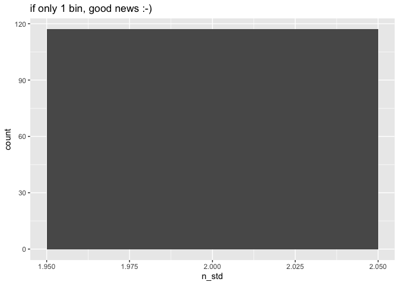

# V. Pipeline for Absorbance data


- [To Do](#to-do)
- [Intro](#intro)
- [Code](#code)
  - [1 - Set up](#1---set-up)
  - [3 - QC suspicious wells](#3---qc-suspicious-wells)
  - [4 - Correct absorbance values](#4---correct-absorbance-values)
    - [4.1 - Correct std curves for
      blanc](#41---correct-std-curves-for-blanc)
- [°°° —- START HERE — °°°°](#---start-here--)
  - [4.2 - Correct samples for blanc](#42---correct-samples-for-blanc)
  - [4.3 - Join corrected absorbances back into data
    table](#43---join-corrected-absorbances-back-into-data-table)
- [°<sup>°°°</sup> Milestone : corrected data ready for downstream
  analysis
  °<sup>°°°</sup>](#-milestone--corrected-data-ready-for-downstream-analysis-)
  - [5 - Computing regression equation btw absorbance and
    concentration](#5---computing-regression-equation-btw-absorbance-and-concentration)
- [°<sup>°°°</sup> Milestone : all data ready for downstream analysis
  °<sup>°°°</sup>](#-milestone--all-data-ready-for-downstream-analysis-)
  - [6 - Exporting data](#6---exporting-data)
- [Algorithm in natural language](#algo_natural)

# To Do

- upstream steps = import “real” table (the code below creates a
  fictional plate to get started)
- export + downstream steps (different options based on analysis)

# Intro

For an explanation of the pipeline in English, see last section
“Algorithm in natural language”. It is not 100% up to date, but it shows
the main steps of the pipeline

# Code

## 1 - Set up

Loading packages

``` r
library(tidyverse)
```

    ── Attaching core tidyverse packages ──────────────────────── tidyverse 2.0.0 ──
    ✔ dplyr     1.1.4     ✔ readr     2.1.5
    ✔ forcats   1.0.1     ✔ stringr   1.6.0
    ✔ ggplot2   4.0.0     ✔ tibble    3.3.0
    ✔ lubridate 1.9.4     ✔ tidyr     1.3.1
    ✔ purrr     1.2.0     
    ── Conflicts ────────────────────────────────────────── tidyverse_conflicts() ──
    ✖ dplyr::filter() masks stats::filter()
    ✖ dplyr::lag()    masks stats::lag()
    ℹ Use the conflicted package (<http://conflicted.r-lib.org/>) to force all conflicts to become errors

``` r
library(roperators) # to be able to add %ni% for "not in"
```


    Attaching package: 'roperators'

    The following object is masked from 'package:tibble':

        num

    The following object is masked from 'package:ggplot2':

        %+%

Prep template data: fake tables for the sake of building the next steps
of the code. Once that code is working, then we can figure out how to
extract real plate data instead of this fake model one.

``` r
# import tidy data
Nmin_data <- read_rds("output/data/Nmin_tidy.rds")

# remove empty wells
Nmin_full <- Nmin_data |> filter(plate_map != "empty")
```

## 3 - QC suspicious wells

**–\> Issues a warning if absorbances not in specified range,
e.g. \[0.03,1.1\]**

The ideal range for absorbance readings (Beer-Lambert in linear range of
relationship between concentration and absorbance) is between 0.1 and 1.
But these are not super strict borders. I don’t want to send out a
warning message too soon, so we take higher values.

This chunk filters out only rows where absorbance is out of range, and
returns either a warning (when there are out-of-range values) or a happy
message (when there are none). In case of a warning, it also shares the
table with suspicious wells, so that the user can take an informed
decision.

<u>**To be thought through:**</u>

- What are options then? Remove suspicious wells (replace by NAs?) –\>
  deal with it if we are confronted with it

- another option could be, instead of returning a table, to return only
  the min and max values of absorbance and/or the number of wells that
  are out of range

- 

``` r
#** Make sure empty wells contain NA, otherwise, lots of warning messages? To be tested *
#*

# the threshold can be moved a little
min_abs <- 0.03
max_abs <- 1.1

# initiate data frame that will contain suspicious well ids
suspicious_rows <- c() 
for (i in 1:nrow(Nmin_full)) {
  if (Nmin_full$absorbance[i] < min_abs || Nmin_full$absorbance[i] > max_abs) {
    print(Nmin_full$absorbance[i])
    suspicious_rows <- append(suspicious_rows, i)
    }
}
# Send a warning message
if (!is.null(suspicious_rows)) {
  warning(paste0("Some wells are out of range for absorbance, i.e., not in [", min_abs, "; ",max_abs, "] allowed \nSee table hereabove to identify suspicious wells"))
  
  Nmin_full |> filter(row_number() %in% suspicious_rows)
} else {
  message(paste0("°^° !! YAY !! °^° All wells are in range for absorbance between ", min_abs, " and ", max_abs))
}
```

    °^° !! YAY !! °^° All wells are in range for absorbance between 0.03 and 1.1

``` r
# ok with a threshold min of 0.03, but more than 4000 when threshold of 0.05
#out_of_range <- Nmin_full |> filter(row_number() %in% suspicious_rows) 

# but they're all NH4 or NO2 --> acceptable!
# out_of_range |> filter(
#   str_split_i(plate_id, pattern = "_", 1) %ni% c("NH4", "NO2")
#   )
```

Other approach: Report on min and max well values + distribution so user
can evaluate, see
<a href="#fig-plot_QC_wells" class="quarto-xref">Figure 1</a>

``` r
plot_QC_wells <- Nmin_full |> 
  ggplot(aes(x = absorbance)) +
  theme_minimal() +
  #geom_boxplot(aes(x = N_sp, y = absorbance))
  geom_histogram(binwidth = 0.01) +
  geom_vline(aes(xintercept = min_abs), color = "red", alpha = 0.5) +
  geom_vline(aes(xintercept = 0.1), color = "black", alpha = 0.5) +
  geom_vline(aes(xintercept = max_abs), color = "red", alpha = 0.5) +
  annotate(geom = "label", x = min_abs, y = -150, label = min_abs, color = "red", size = 2.5) +
  annotate(geom = "label", x = max_abs, y = -150, label = max_abs, color = "red", size = 2.5) +
  annotate(geom = "label", x = 0.1, y = -150, label = "0.1", color = "black", size = 2.5) +
 # geom_density() +
  facet_wrap(~N_sp, nrow = 3) +
  labs(
    title = "Distribution of absorbance per N species",
    subtitle = "Many low values, especially for NH4+ and NO2-")

plot_QC_wells
```

<div id="fig-plot_QC_wells">

<div class="cell-output-display">

<div id="fig-plot_QC_wells">


(a) This figures shows raw numbers of uncorrected absorbance (no blanc
correction). It contains all values, including values of blanc wells and
values of the standard curve. Low values are expected for NO2-, less so
for NH4+

</div>

</div>

Figure 1: QC of Suspicious wells - Distribution of raw absorbance per N
species

</div>

## 4 - Correct absorbance values

Now we correct absorbance values by subtracting blanc values from raw
values (absorbance of the light by the solution = absorbance by the
blank solution + absorbance by the substance to be quantified)

If the standard curves were prepared in water, then the blanc for the
standard curve is the absorbance of the well containing only water of
that curve. If it was prepared with the extractant, then the blanc is
the mean of the values of the wells where the extractant was added.

<u>**To be thought through:**</u>

- If it becomes relevant: make some sort of if condition, based on plate
  information (`blanc_id` and `std_id`)

- Make sure that the slice-min part in next chunk behaves as expected in
  the case of a tie

### 4.1 - Correct std curves for blanc

For now, this is a separate process to account for the fact that the
standard curve was prepared in H2O, not in the extractant (K2SO4 or
KCl).

First, we extract the rows containing data related to Standard curves
only

``` r
std_data <- Nmin_full |> 
  # take only plate-columns with standard curves
  filter(
    plate_map == "Std") |> 
  group_by(plate_id)
std_data
```

    # A tibble: 1,872 × 8
    # Groups:   plate_id [117]
       row   column well_id unique_well_id N_sp  plate_id plate_map absorbance
       <chr>  <dbl> <chr>   <chr>          <chr> <chr>    <chr>          <dbl>
     1 A          1 A1      NH4_1F1_A1     NH4   NH4_1F1  Std            0.039
     2 B          1 B1      NH4_1F1_B1     NH4   NH4_1F1  Std            0.043
     3 C          1 C1      NH4_1F1_C1     NH4   NH4_1F1  Std            0.047
     4 D          1 D1      NH4_1F1_D1     NH4   NH4_1F1  Std            0.053
     5 E          1 E1      NH4_1F1_E1     NH4   NH4_1F1  Std            0.059
     6 F          1 F1      NH4_1F1_F1     NH4   NH4_1F1  Std            0.067
     7 G          1 G1      NH4_1F1_G1     NH4   NH4_1F1  Std            0.096
     8 H          1 H1      NH4_1F1_H1     NH4   NH4_1F1  Std            0.126
     9 A         12 A12     NH4_1F1_A12    NH4   NH4_1F1  Std            0.038
    10 B         12 B12     NH4_1F1_B12    NH4   NH4_1F1  Std            0.042
    # ℹ 1,862 more rows

A typical pipetting error with the automated pipette is to forget to
expell the first bit (containing air) before the “real” pipetting
starts. In this case, the first well to be pipetted (typically well A1)
will receive a wrong amount of reagent, which in turn may impact
stoechiometry and volume, thus absorbance reads. The next chunk allows
the identification of minimum values within a standard curve that are
not situated in the first or last row of the plate (usually the standard
curve is pipetted in ascending or descending order).

With this information, for example, we can exclude wells where first row
is bigger than second row (issue in pipetting).

–\> In the chunk below we get 3 suspicious curves. So we can exclude
those combinations of plate and column from the computation of the
average blanc. So we will only take the value from the other std curve.
Here, we always pipetted 2 per plate.

–\> This option of course is not valid in the case where only one
standard curve is pipetted per plate. In that case, one option is to
check whether absorbance values are fairly constant between plates. If
so, it is a fair correction to take the inter-plate average value (or a
standardized version of it… we’ll cross that bridge when we get to it)

``` r
# Identify plates, wells, columns where there was an issue: the min value for the Std curve is not in row A or row H (in case pipetting was in the opposite direction...)

#suspicious_blancs <- # in case we need to store it somewhere
std_data |> 
  group_by(plate_id, column) |> 
  slice_min(absorbance) |> 
  filter(row %ni% c("A", "H")) 
```

    # A tibble: 3 × 8
    # Groups:   plate_id, column [3]
      row   column well_id unique_well_id N_sp  plate_id  plate_map absorbance
      <chr>  <dbl> <chr>   <chr>          <chr> <chr>     <chr>          <dbl>
    1 B          1 B1      NH4_2F5_1_B1   NH4   NH4_2F5_1 Std            0.042
    2 B          1 B1      NH4_2F5_2_B1   NH4   NH4_2F5_2 Std            0.042
    3 B          1 B1      NO3_R2R3_B1    NO3   NO3_R2R3  Std            0.105

Now, we can compute the average blanc values, but disregard those
suspicious wells

First, we check that we indeed have 2 columns with std curve on every
plate

``` r
# check that we have 2 columns with Std per plate --> option to remove suspicious blancs
# nb of std columns to check
nb_std <- 2

# sum for next code returns a number that is double the nb of rows
nb_std_per_plate <- std_data |> 
  summarise(
    min(absorbance),
    n_std = n()/8
    ) 
# check if true
nrow(nb_std_per_plate) == sum(nb_std_per_plate$n_std)/nb_std # TRUE --> ok!
```

    [1] TRUE

``` r
nb_std_per_plate |> ggplot(aes(x = n_std)) + geom_histogram() + labs(title = "if only 1 bin, good news :-)") # also good check
```

    `stat_bin()` using `bins = 30`. Pick better value `binwidth`.



Second, we can take a subset of `std_data` that contains only the rows
with blancs, and only those that we trust (normally row A or H only)

``` r
# extract ("slice") only rows with the smallest absorbance
std_blanc_all <- std_data |> 
  slice_min(
    absorbance, # slice min according to the valus in abs
    n = nb_std,  # pick as many rows as the nb of columns with standard curve
    with_ties = FALSE # in case there are ties, it will add extra rows
    ) 
std_blanc_all
```

    # A tibble: 234 × 8
    # Groups:   plate_id [117]
       row   column well_id unique_well_id N_sp  plate_id  plate_map absorbance
       <chr>  <dbl> <chr>   <chr>          <chr> <chr>     <chr>          <dbl>
     1 A         12 A12     NH4_1F1_A12    NH4   NH4_1F1   Std            0.038
     2 A          1 A1      NH4_1F1_A1     NH4   NH4_1F1   Std            0.039
     3 A         12 A12     NH4_1F2_1_A12  NH4   NH4_1F2_1 Std            0.038
     4 A          1 A1      NH4_1F2_1_A1   NH4   NH4_1F2_1 Std            0.039
     5 A         12 A12     NH4_1F2_2_A12  NH4   NH4_1F2_2 Std            0.038
     6 A          1 A1      NH4_1F2_2_A1   NH4   NH4_1F2_2 Std            0.039
     7 A          1 A1      NH4_1F3_A1     NH4   NH4_1F3   Std            0.038
     8 A         12 A12     NH4_1F3_A12    NH4   NH4_1F3   Std            0.038
     9 A         12 A12     NH4_1F4_A12    NH4   NH4_1F4   Std            0.038
    10 A          1 A1      NH4_1F4_A1     NH4   NH4_1F4   Std            0.039
    # ℹ 224 more rows

``` r
# check that we will remove the "correct" suspicious blancs in a moment
std_blanc_trusted <- std_blanc_all |> 
  # remove anything not first or last row of plate <=> suspicious
  filter(row %in% c("A", "H"))

# see that we get 3 less rows now
std_blanc_trusted
```

    # A tibble: 231 × 8
    # Groups:   plate_id [117]
       row   column well_id unique_well_id N_sp  plate_id  plate_map absorbance
       <chr>  <dbl> <chr>   <chr>          <chr> <chr>     <chr>          <dbl>
     1 A         12 A12     NH4_1F1_A12    NH4   NH4_1F1   Std            0.038
     2 A          1 A1      NH4_1F1_A1     NH4   NH4_1F1   Std            0.039
     3 A         12 A12     NH4_1F2_1_A12  NH4   NH4_1F2_1 Std            0.038
     4 A          1 A1      NH4_1F2_1_A1   NH4   NH4_1F2_1 Std            0.039
     5 A         12 A12     NH4_1F2_2_A12  NH4   NH4_1F2_2 Std            0.038
     6 A          1 A1      NH4_1F2_2_A1   NH4   NH4_1F2_2 Std            0.039
     7 A          1 A1      NH4_1F3_A1     NH4   NH4_1F3   Std            0.038
     8 A         12 A12     NH4_1F3_A12    NH4   NH4_1F3   Std            0.038
     9 A         12 A12     NH4_1F4_A12    NH4   NH4_1F4   Std            0.038
    10 A          1 A1      NH4_1F4_A1     NH4   NH4_1F4   Std            0.039
    # ℹ 221 more rows

Third, we compute the blanc value (average) and return a warning if
blanc values show too much variation (in the case of several
plate-columns with standard curves)

``` r
#** !! Adapt threshold parameter *

# Change parameter "2" in something computed?

std_blanc_avg <-  std_blanc_trusted |> 
  summarise(
    blanc_avg = mean(absorbance), 
    blanc_sdev = sd(absorbance)) |> 
  mutate(
    blanc_coeff_var_percent = 100 * blanc_sdev / blanc_avg)
std_blanc_avg
```

    # A tibble: 117 × 4
       plate_id  blanc_avg blanc_sdev blanc_coeff_var_percent
       <chr>         <dbl>      <dbl>                   <dbl>
     1 NH4_1F1      0.0385   0.000707                    1.84
     2 NH4_1F2_1    0.0385   0.000707                    1.84
     3 NH4_1F2_2    0.0385   0.000707                    1.84
     4 NH4_1F3      0.038    0                           0   
     5 NH4_1F4      0.0385   0.000707                    1.84
     6 NH4_1F5      0.0385   0.000707                    1.84
     7 NH4_1G1      0.0385   0.000707                    1.84
     8 NH4_1G2      0.0385   0.000707                    1.84
     9 NH4_1G3      0.038    0                           0   
    10 NH4_1G4      0.038    0                           0   
    # ℹ 107 more rows

``` r
# Do we accept this "worse" level of variation?
# Find an automatized way to look at it?
std_blanc_avg |> 
  slice_max(blanc_coeff_var_percent, n = 10)
```

    # A tibble: 12 × 4
       plate_id  blanc_avg blanc_sdev blanc_coeff_var_percent
       <chr>         <dbl>      <dbl>                   <dbl>
     1 NO2_1F3      0.0385   0.00354                     9.18
     2 NO2_1G2      0.037    0.00141                     3.82
     3 NH4_2F2_1    0.038    0.00141                     3.72
     4 NH4_2F2_2    0.038    0.00141                     3.72
     5 NO3_2P4      0.0835   0.00212                     2.54
     6 NO3_1G3      0.0875   0.00212                     2.42
     7 NO3_R7R8     0.0875   0.00212                     2.42
     8 NO3_R4R5     0.0885   0.00212                     2.40
     9 NO3_1F3      0.0915   0.00212                     2.32
    10 NO2_1F1      0.0365   0.000707                    1.94
    11 NO2_1G1      0.0365   0.000707                    1.94
    12 NO2_1G3      0.0365   0.000707                    1.94

``` r
# coeff variation above 3% are only a few, all below 10%, and only for NO2 and NH4, acceptable

# Warning if values are too divergent (decide what "threshold" is for the coefficient of variation ?)

threshold <- 5 # max coeff_var that we accept [%] 

# in case of several values...
if (#length(std_column) != 1 # replace by something else
  TRUE) {
  # ... and of coefficient of variation > set threshold
  if (max(std_blanc_avg$blanc_coeff_var_percent,na.rm = TRUE) > threshold) {
    # send a warning
    warning(paste0("There is a big variation in absorbance values for the the blanc of the standard curve (more than ", threshold, "%).\nPick the most likely values / remove outliers manually.\nSee tables above to judge on values and find suspicious wells"))
    # and show suspicious wells
    std_blanc_avg |> slice_max(blanc_coeff_var_percent, n = 10)
  }
}
```

    Warning: There is a big variation in absorbance values for the the blanc of the standard curve (more than 5%).
    Pick the most likely values / remove outliers manually.
    See tables above to judge on values and find suspicious wells

    # A tibble: 12 × 4
       plate_id  blanc_avg blanc_sdev blanc_coeff_var_percent
       <chr>         <dbl>      <dbl>                   <dbl>
     1 NO2_1F3      0.0385   0.00354                     9.18
     2 NO2_1G2      0.037    0.00141                     3.82
     3 NH4_2F2_1    0.038    0.00141                     3.72
     4 NH4_2F2_2    0.038    0.00141                     3.72
     5 NO3_2P4      0.0835   0.00212                     2.54
     6 NO3_1G3      0.0875   0.00212                     2.42
     7 NO3_R7R8     0.0875   0.00212                     2.42
     8 NO3_R4R5     0.0885   0.00212                     2.40
     9 NO3_1F3      0.0915   0.00212                     2.32
    10 NO2_1F1      0.0365   0.000707                    1.94
    11 NO2_1G1      0.0365   0.000707                    1.94
    12 NO2_1G3      0.0365   0.000707                    1.94

``` r
std_blanc_avg |> 
  slice_max(blanc_coeff_var_percent, n = 10)
```

    # A tibble: 12 × 4
       plate_id  blanc_avg blanc_sdev blanc_coeff_var_percent
       <chr>         <dbl>      <dbl>                   <dbl>
     1 NO2_1F3      0.0385   0.00354                     9.18
     2 NO2_1G2      0.037    0.00141                     3.82
     3 NH4_2F2_1    0.038    0.00141                     3.72
     4 NH4_2F2_2    0.038    0.00141                     3.72
     5 NO3_2P4      0.0835   0.00212                     2.54
     6 NO3_1G3      0.0875   0.00212                     2.42
     7 NO3_R7R8     0.0875   0.00212                     2.42
     8 NO3_R4R5     0.0885   0.00212                     2.40
     9 NO3_1F3      0.0915   0.00212                     2.32
    10 NO2_1F1      0.0365   0.000707                    1.94
    11 NO2_1G1      0.0365   0.000707                    1.94
    12 NO2_1G3      0.0365   0.000707                    1.94

If we are troubled by the big variation within plate, we can check out
the identified suspicious plates. In this case, I find it not so
dramatic. We are just dealing with small values…

``` r
std_blanc_big_coeff <- std_blanc_avg |> 
  slice_max(blanc_coeff_var_percent, n = 10)

for (plate in 1:length(std_blanc_big_coeff)) {
  print(std_data |> filter(plate_id == std_blanc_big_coeff$plate_id[plate]))
}
```

    # A tibble: 16 × 8
    # Groups:   plate_id [1]
       row   column well_id unique_well_id N_sp  plate_id plate_map absorbance
       <chr>  <dbl> <chr>   <chr>          <chr> <chr>    <chr>          <dbl>
     1 A          1 A1      NO2_1F3_A1     NO2   NO2_1F3  Std            0.041
     2 B          1 B1      NO2_1F3_B1     NO2   NO2_1F3  Std            0.048
     3 C          1 C1      NO2_1F3_C1     NO2   NO2_1F3  Std            0.06 
     4 D          1 D1      NO2_1F3_D1     NO2   NO2_1F3  Std            0.081
     5 E          1 E1      NO2_1F3_E1     NO2   NO2_1F3  Std            0.129
     6 F          1 F1      NO2_1F3_F1     NO2   NO2_1F3  Std            0.23 
     7 G          1 G1      NO2_1F3_G1     NO2   NO2_1F3  Std            0.399
     8 H          1 H1      NO2_1F3_H1     NO2   NO2_1F3  Std            0.522
     9 A         12 A12     NO2_1F3_A12    NO2   NO2_1F3  Std            0.036
    10 B         12 B12     NO2_1F3_B12    NO2   NO2_1F3  Std            0.048
    11 C         12 C12     NO2_1F3_C12    NO2   NO2_1F3  Std            0.058
    12 D         12 D12     NO2_1F3_D12    NO2   NO2_1F3  Std            0.08 
    13 E         12 E12     NO2_1F3_E12    NO2   NO2_1F3  Std            0.128
    14 F         12 F12     NO2_1F3_F12    NO2   NO2_1F3  Std            0.23 
    15 G         12 G12     NO2_1F3_G12    NO2   NO2_1F3  Std            0.396
    16 H         12 H12     NO2_1F3_H12    NO2   NO2_1F3  Std            0.525
    # A tibble: 16 × 8
    # Groups:   plate_id [1]
       row   column well_id unique_well_id N_sp  plate_id plate_map absorbance
       <chr>  <dbl> <chr>   <chr>          <chr> <chr>    <chr>          <dbl>
     1 A          1 A1      NO2_1G2_A1     NO2   NO2_1G2  Std            0.038
     2 B          1 B1      NO2_1G2_B1     NO2   NO2_1G2  Std            0.048
     3 C          1 C1      NO2_1G2_C1     NO2   NO2_1G2  Std            0.059
     4 D          1 D1      NO2_1G2_D1     NO2   NO2_1G2  Std            0.08 
     5 E          1 E1      NO2_1G2_E1     NO2   NO2_1G2  Std            0.127
     6 F          1 F1      NO2_1G2_F1     NO2   NO2_1G2  Std            0.223
     7 G          1 G1      NO2_1G2_G1     NO2   NO2_1G2  Std            0.39 
     8 H          1 H1      NO2_1G2_H1     NO2   NO2_1G2  Std            0.487
     9 A         12 A12     NO2_1G2_A12    NO2   NO2_1G2  Std            0.036
    10 B         12 B12     NO2_1G2_B12    NO2   NO2_1G2  Std            0.048
    11 C         12 C12     NO2_1G2_C12    NO2   NO2_1G2  Std            0.058
    12 D         12 D12     NO2_1G2_D12    NO2   NO2_1G2  Std            0.079
    13 E         12 E12     NO2_1G2_E12    NO2   NO2_1G2  Std            0.131
    14 F         12 F12     NO2_1G2_F12    NO2   NO2_1G2  Std            0.225
    15 G         12 G12     NO2_1G2_G12    NO2   NO2_1G2  Std            0.402
    16 H         12 H12     NO2_1G2_H12    NO2   NO2_1G2  Std            0.489
    # A tibble: 16 × 8
    # Groups:   plate_id [1]
       row   column well_id unique_well_id N_sp  plate_id  plate_map absorbance
       <chr>  <dbl> <chr>   <chr>          <chr> <chr>     <chr>          <dbl>
     1 A          1 A1      NH4_2F2_1_A1   NH4   NH4_2F2_1 Std            0.039
     2 B          1 B1      NH4_2F2_1_B1   NH4   NH4_2F2_1 Std            0.041
     3 C          1 C1      NH4_2F2_1_C1   NH4   NH4_2F2_1 Std            0.045
     4 D          1 D1      NH4_2F2_1_D1   NH4   NH4_2F2_1 Std            0.052
     5 E          1 E1      NH4_2F2_1_E1   NH4   NH4_2F2_1 Std            0.059
     6 F          1 F1      NH4_2F2_1_F1   NH4   NH4_2F2_1 Std            0.068
     7 G          1 G1      NH4_2F2_1_G1   NH4   NH4_2F2_1 Std            0.101
     8 H          1 H1      NH4_2F2_1_H1   NH4   NH4_2F2_1 Std            0.121
     9 A         12 A12     NH4_2F2_1_A12  NH4   NH4_2F2_1 Std            0.037
    10 B         12 B12     NH4_2F2_1_B12  NH4   NH4_2F2_1 Std            0.042
    11 C         12 C12     NH4_2F2_1_C12  NH4   NH4_2F2_1 Std            0.044
    12 D         12 D12     NH4_2F2_1_D12  NH4   NH4_2F2_1 Std            0.052
    13 E         12 E12     NH4_2F2_1_E12  NH4   NH4_2F2_1 Std            0.059
    14 F         12 F12     NH4_2F2_1_F12  NH4   NH4_2F2_1 Std            0.067
    15 G         12 G12     NH4_2F2_1_G12  NH4   NH4_2F2_1 Std            0.102
    16 H         12 H12     NH4_2F2_1_H12  NH4   NH4_2F2_1 Std            0.117
    # A tibble: 16 × 8
    # Groups:   plate_id [1]
       row   column well_id unique_well_id N_sp  plate_id  plate_map absorbance
       <chr>  <dbl> <chr>   <chr>          <chr> <chr>     <chr>          <dbl>
     1 A          1 A1      NH4_2F2_2_A1   NH4   NH4_2F2_2 Std            0.039
     2 B          1 B1      NH4_2F2_2_B1   NH4   NH4_2F2_2 Std            0.041
     3 C          1 C1      NH4_2F2_2_C1   NH4   NH4_2F2_2 Std            0.045
     4 D          1 D1      NH4_2F2_2_D1   NH4   NH4_2F2_2 Std            0.052
     5 E          1 E1      NH4_2F2_2_E1   NH4   NH4_2F2_2 Std            0.059
     6 F          1 F1      NH4_2F2_2_F1   NH4   NH4_2F2_2 Std            0.068
     7 G          1 G1      NH4_2F2_2_G1   NH4   NH4_2F2_2 Std            0.101
     8 H          1 H1      NH4_2F2_2_H1   NH4   NH4_2F2_2 Std            0.121
     9 A         12 A12     NH4_2F2_2_A12  NH4   NH4_2F2_2 Std            0.037
    10 B         12 B12     NH4_2F2_2_B12  NH4   NH4_2F2_2 Std            0.042
    11 C         12 C12     NH4_2F2_2_C12  NH4   NH4_2F2_2 Std            0.044
    12 D         12 D12     NH4_2F2_2_D12  NH4   NH4_2F2_2 Std            0.052
    13 E         12 E12     NH4_2F2_2_E12  NH4   NH4_2F2_2 Std            0.059
    14 F         12 F12     NH4_2F2_2_F12  NH4   NH4_2F2_2 Std            0.067
    15 G         12 G12     NH4_2F2_2_G12  NH4   NH4_2F2_2 Std            0.102
    16 H         12 H12     NH4_2F2_2_H12  NH4   NH4_2F2_2 Std            0.117

Now we can correct the absorbance values for the standard curves.

``` r
std_corrected <- 
  std_data |>  
    # keep only data that is not from blanc wells
  filter(unique_well_id %ni% std_blanc_all$unique_well_id) |> 
  select(plate_id, well_id, absorbance) |> 
    pivot_wider(names_from = well_id, values_from = absorbance) |> 
    left_join(std_blanc_avg |> select(plate_id, blanc_avg)) |> 
    relocate(blanc_avg, .before = 2) |> 
    pivot_longer(
      cols = !c(plate_id,blanc_avg), 
      names_to = "well_id",
      values_to = "absorbance",
      values_drop_na = TRUE
      ) |> 
  mutate(abs_corrected = absorbance - blanc_avg, .keep = "unused") |> 
  right_join(std_data) |> 
  # not vital, just for readibility: rearrange column order
  relocate(row, column, well_id, plate_id, unique_well_id, N_sp, plate_map, absorbance)
```

    Joining with `by = join_by(plate_id)`
    Joining with `by = join_by(plate_id, well_id)`

We could add those corrected values back into the main data table, but
actually those numbers are only useful to compute the regression
equation between corrected absorbance and concentration. For thematic
clarity purpose, this will be done in a later section (to keep all work
on blancs in one place)

# °°° —- START HERE — °°°°

### 4.2 - Correct samples for blanc

Same, but here we correct the values for samples with the average blanc
value of the extractant

### 4.3 - Join corrected absorbances back into data table

Now we can correct the absorbance values for the samples and directly
store them in a new data table (additional column, less rows because we
keep neither std curves nor extractant)

! The parameter `.keep = "unused"` of the `mutate()` function is there
to get rid of the column “abs” that contained the raw data. This is just
to prevent mishaps later where the wrong data might be used. To change
this in order to keep the “abs” column, simply remove this argument or
use `.keep = "all"`.

# °<sup>°°°</sup> Milestone : corrected data ready for downstream analysis °<sup>°°°</sup>

At this point, we could export the data table for downstream analysis
(Microresp, etc), although for most applications, the next step is still
needed: computing regression equation

## 5 - Computing regression equation btw absorbance and concentration

First, visualize the relationship

<u>**To be thought through:**</u>

- Now, to make sure that there is no inversion of the standard curve
  (e.g., we write from smallest to biggest, but we pipette the biggest
  in row A), I sort both vectors (concentration ans absorbances). But in
  the case of a pipetting mistake where one value of the curve would be
  off, we may not realize the issue if it means that the order of wells
  is reshuffled

- Propose something more elegant

- **Maybe best to not reorganize anything. If the correlation is
  negative, we will spot it in the graph!**

- Don’t have an optimal way (or I am not yet convinced that it is
  correct) to access the p-value of the model / the slope. The problem
  is: the number that comes out is not the same as displayed in the
  summary. But it would be quite long to check summaries of each
  individual plate…

# °<sup>°°°</sup> Milestone : all data ready for downstream analysis °<sup>°°°</sup>

At this point, each plate needs to be evaluated. This could go in
another script. In the case where there is a standard curve (anything
but MicroResp), we could store everything above in one or more function,
then code an iterative process to go through each plate with those
functions while

- storing the corrected absorbance data and append it to a central data
  table per manip for downstrem computation

- storing the slope, R-squared and p-values of the models in the
  original “plate-id” data frame

  - this could be added to the corrected dataframe, but it adds about 72
    times as much data, so better to have just one line per plate as
    this is per plate information

  - We could consider adding other information like suspicious wells and
    so on

- storing the graphs which probably is the quickest way for a quick
  assessment

  - the plots are made so that p-values higher than 0.05 should be
    spotted directly bc the annotation will appear bigger and in red

Then, after this iterative process, we have everything that we need for
the computation of the concentrations and other downstrem calculations

<u>**To be thought through:**</u>

- I haven’t really considered in great depths how the downstream
  pipeline would look like for the MicroResp experiment. To be defined.
  For my data analysis, it is meant for later, so I’ll get back to it,
  but not super soon *a priori*

- We could consider computing the concentration already at this step,
  but I like to have a cut here where we first assess all the things to
  look at (suspicious wells, suspicious standard curves, etc.), before
  we move on. This is kind of a failsafe to avoid blindly going through
  the analysis without considering potential issues

## 6 - Exporting data

Until I go through upstream steps (extracting “real” data from original
files) and consider the downstream steps more concretely, it is hard to
be sure about how / in which format, etc, to export the data. Still,
here is a list of items that need to be exported one way or another

# Algorithm in natural language

- Plate info list:

  - plate number - element \<chr\>

  - column(s) with std curve(s) - vector \<chr\>

  - standard identity & unit - vector \<chr\> (element1 = name, element2
    = unit)

  - range of std concentration - vector \<num\>

  - column(s) with blanc - vector \<chr\>

  - blanc identity & unit of concentration - vector \<chr\> (element1 =
    name, element2 = unit)

  - concentration of blanc - element \<num\>

  - timestamp - date-time format (?)

  - wavelength in nm - element \<int\>

- vectorization of absorbance data, vectors are:

  - plate number

  - row

  - column

  - raw absorbance

  - legend (or ID)

- Correct absorbances for blanc

  - Return a warning message

    - when absorbances are below 0.05 or above 1.5

    - give the number of wells concerned,

    - give the max and min value of those wells

  - case when row concerns std curve: correct std absorbances for std
    blanc

    - find rows where concentration is zero (slice.min?)

    - take average of absorbance from those rows

    - substract to all absorbances of the std the average “zero” value
      and store it in a new column = “corrected_abs”

  - case when row concerns samples: Correct sample absorbances for blanc

    - find rows with blanc

    - compute variation coefficient

      - return a warning message when var.coeff \> 30%?

      - exclude wells based on this? Or human decision?

    - compute average of blancs

    - substract that value to all non-standard rows and store it in
      column “corrected_abs”

- Compute standard curve

  - Operation per plate

  - in plate df, filter rows corresponding to the std
