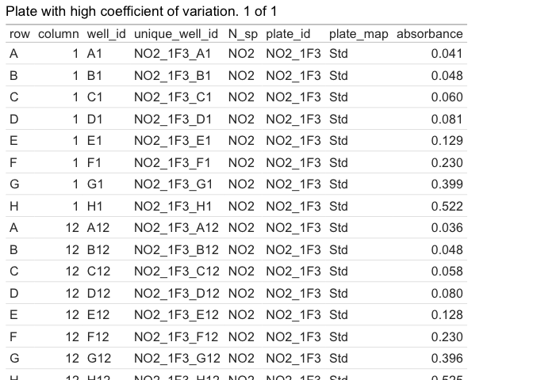
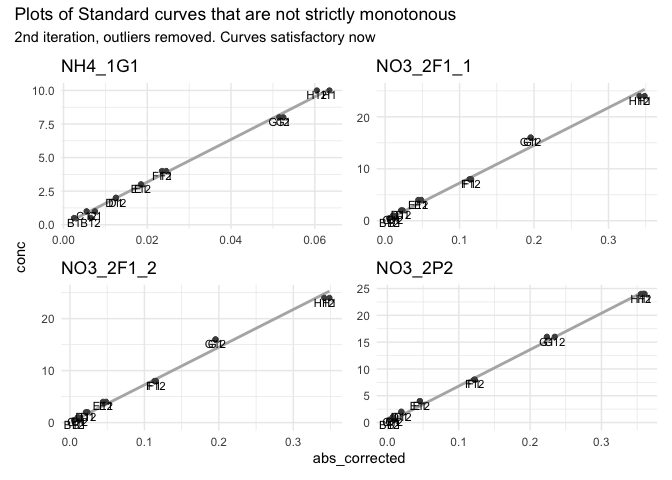
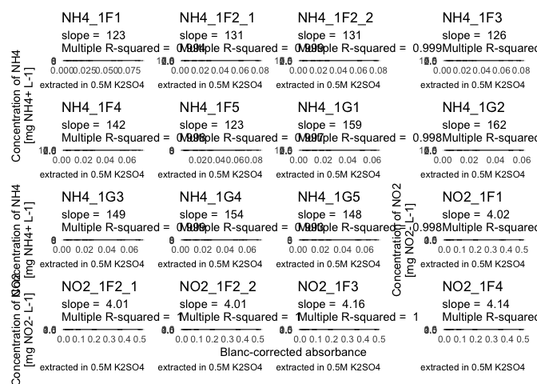
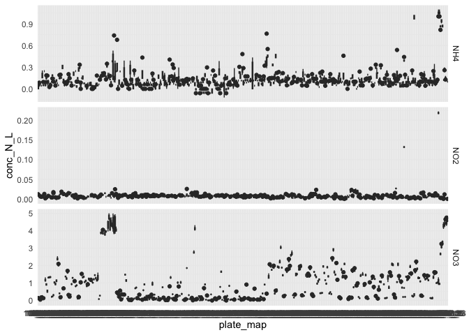

# V. Pipeline for Absorbance data


- [To Do](#to-do)
- [Intro](#intro)
- [Code](#code)
  - [1 - Set up](#1---set-up)
  - [2 - QC suspicious wells](#2---qc-suspicious-wells)
  - [3 - Correct absorbance values](#3---correct-absorbance-values)
    - [3.1 - Correct std curves for
      blanc](#31---correct-std-curves-for-blanc)
    - [3.2 - Correct samples for blanc](#32---correct-samples-for-blanc)
- [°<sup>°°°</sup> Milestone : blanc-corrected data
  °<sup>°°°</sup>](#-milestone--blanc-corrected-data-)
- [4 - Compute regression equation btw absorbance and
  concentration](#4---compute-regression-equation-btw-absorbance-and-concentration)
  - [4.1 - Quality check of standard curves (NH4 only for
    now)](#41---quality-check-of-standard-curves-nh4-only-for-now)
  - [4.2 - Perform linear model and infer
    slope](#42---perform-linear-model-and-infer-slope)
  - [4.3 - Compute concentrations in N
    species](#43---compute-concentrations-in-n-species)
- [°<sup>°°°</sup> Milestone : all data ready for downstream analysis
  °<sup>°°°</sup>](#-milestone--all-data-ready-for-downstream-analysis-)
- [°°° —- START HERE — °°°°](#---start-here--)
- [°°° —- Below this: draft, to be picked up —
  °°°°](#---below-this-draft-to-be-picked-up--)
  - [6 - Exporting data](#6---exporting-data)
- [Algorithm in natural language](#algo_natural)

# To Do

- Turn as much as possible into functions

# Intro

For an explanation of the pipeline in plain English, see last section
“Algorithm in natural language”. It is not 100% up to date, but it shows
the main steps of the pipeline

# Code

## 1 - Set up

Loading packages and homemade functions

``` r
library(tidyverse)
library(roperators) # to be able to add %ni% for "not in"
library(patchwork) # for wrap_plots and wrap_tables
library(RColorBrewer) # to find and set color palette

source("functions/extract_curve.R")
source("functions/plot_qc_std_all.R")
source("functions/qc1_initial_range_abs.R")
source("functions/qc2_plot_range_abs.R")
source("functions/qc3_nb_curves_per_plate.R")
source("functions/subset_data.R")
source("functions/qc4_std_blanc_variation.R")
source("functions/correct_abs_std.R")
source("functions/qc5_extr_blanc_variation.R")
source("functions/qc6_extr_trusted.R")
source("functions/qc7_std_find_outlier.R")
source("functions/correct_abs_samples.R")
source("functions/plot_qc_std_multiple.R")
source("functions/std_regression.R")
source("functions/abs_to_mgN_L.R")
```

Loading data

``` r
# import tidy data and metadata
Nmin_data <- read_rds("output/data/Nmin_tidy.rds")
Nmin_metadata <- read_rds("output/data/Nmin_metadata.rds")

# remove empty wells
Nmin_full <- Nmin_data |> filter(plate_map != "empty")

# extracting data for the standard curves only
#std_data <- extract_std_data(Nmin_data)
```

Set up pipetting direction for the std curve.

<u>**!! THIS IS SOMETHING TO CHECK / UPDATE BY THE USER**</u>

(although failing to do so will become obvious latest with the std
curves that will be plotted as decreasing curves)

## 2 - QC suspicious wells

**–\> Issues a warning if absorbances not in specified range,
e.g. \[0.03,1.1\]**

The ideal range for absorbance readings (Beer-Lambert in linear range of
relationship between concentration and absorbance) is between 0.1 and 1.
But these are not super strict borders. I don’t want to send out a
warning message too soon, so we take higher values.

This chunk filters out only rows where absorbance is out of range, and
returns either a warning (when there are out-of-range values) or a happy
message (when there are none). In case of a warning, it also shares the
table with suspicious wells, so that the user can take an informed
decision.

<u>**To be thought through:**</u>

- What are options then? Remove suspicious wells (replace by NAs?) –\>
  deal with it if we are confronted with it

- another option could be, instead of returning a table, to return only
  the min and max values of absorbance and/or the number of wells that
  are out of range

``` r
qc1_initial_range_abs(Nmin_data, min_abs = 0.03, max_abs = 1.1)
```

    °^° !! YAY !! °^° All wells are in range for absorbance between 0.03 and 1.1

``` r
#> ok with a threshold min of 0.03, but more than 4000 when threshold of 0.05
#out_of_range <- Nmin_full |> filter(row_number() %in% suspicious_rows) 

#> but they're all NH4 or NO2 --> acceptable!
# out_of_range |> filter(
#   str_split_i(plate_id, pattern = "_", 1) %ni% c("NH4", "NO2")
#   )
```

Other approach: Report on min and max well values + distribution so user
can evaluate, see
<a href="#fig-plot_QC_wells" class="quarto-xref">Figure 1</a>

``` r
qc2_plot_range_abs(Nmin_data) +
  labs(subtitle = "Many low values, especially for NH4+ and NO2-")
```

<div id="fig-plot_QC_wells">

<div class="cell-output-display">

<div id="fig-plot_QC_wells">


(a) This figures shows raw numbers of uncorrected absorbance (no blanc
correction). It contains all values, including values of blanc wells and
values of the standard curve. Low values are expected for NO2-, less so
for NH4+

</div>

</div>

Figure 1: QC of Suspicious wells - Distribution of raw absorbance per N
species

</div>

## 3 - Correct absorbance values

Now we correct absorbance values by subtracting blanc values from raw
values (absorbance of the light by the solution = absorbance by the
blank solution + absorbance by the substance to be quantified)

If the standard curves were prepared in water, then the blanc for the
standard curve is the absorbance of the well containing only water of
that curve. If it was prepared with the extractant, then the blanc is
the mean of the values of the wells where the extractant was added.

<u>**To be thought through:**</u>

- If it becomes relevant: make some sort of if condition, based on plate
  information (`blanc_id` and `std_id`)

- Make sure that the slice-min part in 2nd next chunk behaves as
  expected in the case of a tie

### 3.1 - Correct std curves for blanc

For now, this is a separate process to account for the fact that the
standard curve was prepared in H2O, not in the extractant (K2SO4 or
KCl).

First, we extract the rows containing data related to Standard curves
only

``` r
# done now in next function
```

A typical pipetting error with the automated pipette is to forget to
expell the first bit (containing air) before the “real” pipetting
starts. In this case, the first well to be pipetted (typically well A1)
will receive a wrong amount of reagent, which in turn may impact
stoechiometry and volume, thus absorbance reads. The next chunk allows
the identification of minimum values within a standard curve that are
not situated in the first or last row of the plate (usually the standard
curve is pipetted in ascending or descending order).

With this information, for example, we can exclude wells where first row
is bigger than second row (issue in pipetting).

–\> In the chunk below we get 3 suspicious curves. So we can exclude
those combinations of plate and column from the computation of the
average blanc. So we will only take the value from the other std curve.
Here, we always pipetted 2 per plate (yay!).

–\> This option of course is not valid in the case where only one
standard curve is pipetted per plate. In that case, one option is to
check whether absorbance values are fairly constant between plates. If
so, it is a fair correction to take the inter-plate average value (or a
standardized version of it… we’ll cross that bridge when we get to it)

``` r
# Identify plates, wells, columns where there was an issue: the min value for the Std curve is not in row A or row H (in case pipetting was in the opposite direction...)

#suspicious_blancs <- # in case we need to store it somewhere
# std_data |> 
#   group_by(plate_id, column) |> 
#   slice_min(absorbance) |> 
#   filter(row %ni% c("A", "H")) 
```

Now, we can compute the average blanc values, but disregard those
suspicious wells

First, we check that we indeed have 2 columns with std curve on every
plate

``` r
# check that we have 2 columns with Std per plate --> option to remove suspicious blancs
qc3_nb_curve_per_plate(Nmin_data, nb_std = 2)
```

    !! YAY !! There is/are indeed on average exactly 2 standard curves per plate. It is very likely that there are exactly 2 curves per plate. To be sure, check the distribution of number of standard curves per plate. If there is only 1 value at 2, then it is confirmed.


Second, we can take a subset of `std_data` that contains only the rows
with blancs, and only those that we trust (normally row A or H only)

``` r
QC4 <- qc4_std_blanc_variation(Nmin_data, nb_std = 2)
```

    Warning in qc4_std_blanc_variation(Nmin_data, nb_std = 2): There are 270 standard curves in this data set, thus in theory also 270 wells containing the blanc for those curves. 
    Of those 270, 4 are untrusted (see comments in the function definition for details on untrusted wells). Try ?qc4_std_blanc_variation().  
    We are thus a priori trusting 266 wells out of 270.

    Warning in qc4_std_blanc_variation(Nmin_data, nb_std = 2): Even after removal of untrusted wells, there are plates showing a big variation in absorbance values for the blanc of the standard curve (more than 5%).
    Pick the most likely values / remove outliers manually.
    See table to judge on values and find suspicious wells

``` r
lapply(QC4, print)
```

    [1] "There are 270 standard curves in this data set, thus in theory also 270 wells containing the blanc for those curves. \nOf those 270, 4 are untrusted (see comments in the function definition for details on untrusted wells). Try ?qc4_std_blanc_variation().  \nWe are thus a priori trusting 266 wells out of 270."
    [1] "Even after removal of untrusted wells, there are plates showing a big variation in absorbance values for the blanc of the standard curve (more than 5%).\nPick the most likely values / remove outliers manually.\nSee table to judge on values and find suspicious wells"




    $untrusted_msg
    [1] "There are 270 standard curves in this data set, thus in theory also 270 wells containing the blanc for those curves. \nOf those 270, 4 are untrusted (see comments in the function definition for details on untrusted wells). Try ?qc4_std_blanc_variation().  \nWe are thus a priori trusting 266 wells out of 270."

    $outlier_warning
    [1] "Even after removal of untrusted wells, there are plates showing a big variation in absorbance values for the blanc of the standard curve (more than 5%).\nPick the most likely values / remove outliers manually.\nSee table to judge on values and find suspicious wells"

    $suspicious_curve_coeff_var


    $NO2_1F3


``` r
#** DECIDE WHAT TO DO WITH THIS INFO. SO FAR, I HAVEN'T HAD THE CASE THAT I NEED TO REMOVE FURTHER WELLS BEYOND THE "UNTRUSTED" ONES. SO CODE FOR THIS STILL REMAINS TO BE WRITTEN, ALTHOUGH INSPIRATION CAN BE TAKEN FROM FURTHER QC STEPS * 
```

Third, we compute the blanc value (average) and return a warning if
blanc values show too much variation (in the case of several
plate-columns with standard curves)

If we are troubled by the big variation within plate, we can check out
the identified suspicious plates. In this case, I find it not so
dramatic. We are just dealing with small values which tend to
artificially increase the coefficient of variation (division by small
numbers…).

We can look at suspicious blancs in their plate context to decide how
bad the situation is.

Now we can correct the absorbance values for the standard curves.

<u>**!! HEREUNDER: CANDIDATE FOR TURNING INTO A FUNCTION !! - CORRECTION
OF BAD WELLS FOR BLANC OF STD CURVE**</u>

``` r
std_corrected <- correct_abs_std(Nmin_data)
```

    Joining with `by = join_by(plate_id)`
    Joining with `by = join_by(plate_id, well_id)`

We could add those corrected values back into the main data table, but
actually those numbers are only useful to compute the regression
equation between corrected absorbance and concentration. For thematic
clarity purpose, this will be done in a later section (to keep all work
on blancs in one place)

### 3.2 - Correct samples for blanc

First, we extract the rows with extractant

Then we do some quality check: how big is the variation? Do we have
suspicious wells?

Looking at the distribution of absorbance, it appears that some wells
have very different scoring, see
<a href="#fig-hist-extr-coeff-var" class="quarto-xref">Figure 2</a>

``` r
#** Look at this (and the next chunk) iteratively a couple of times to decide where to put the threshold. *
  QC5 <- qc5_extr_blanc_variation(Nmin_data,max_coeff = 3)
```

    `summarise()` has grouped output by 'plate_id'. You can override using the
    `.groups` argument.

    Warning in qc5_extr_blanc_variation(Nmin_data, max_coeff = 3): There is a big variation in absorbance values for the blanc  (more than 3%).
    Remove the most unlikely values / remove outliers manually.
    See table above to judge on values. 
    Suspicious plates are stored in vector called suspicious_plate_id

``` r
  QC5$distrib_coeff +
  labs(subtitle = "anything above 5% seems to be an outlier (even above 3%)")
```

<div id="fig-hist-extr-coeff-var">


Figure 2: Distribution of coefficient of variation of absorbance of
extractant (blanc)

</div>

Let’s prepare a warning for plates containing these outliers

Let’s now have a look at those suspicious plates

``` r
#** To play around with the maximum coefficient of variation, change argument max_coeff in the function call *
#*
QC5$multiple_plot 
```

    `stat_bin()` using `bins = 30`. Pick better value `binwidth`.
    `stat_bin()` using `bins = 30`. Pick better value `binwidth`.
    `stat_bin()` using `bins = 30`. Pick better value `binwidth`.
    `stat_bin()` using `bins = 30`. Pick better value `binwidth`.
    `stat_bin()` using `bins = 30`. Pick better value `binwidth`.
    `stat_bin()` using `bins = 30`. Pick better value `binwidth`.
    `stat_bin()` using `bins = 30`. Pick better value `binwidth`.
    `stat_bin()` using `bins = 30`. Pick better value `binwidth`.
    `stat_bin()` using `bins = 30`. Pick better value `binwidth`.
    `stat_bin()` using `bins = 30`. Pick better value `binwidth`.

<div id="fig-suspicious-plates">


Figure 3: Distribution of absorbance in suspicious plates. From this we
can manually identify then remove outliers

</div>

We have to remove outliers manually: it is really a personal
appreciation that works. Watch out, in the case of plates with several
blancs like here, that a bimodal distribution might not be an issue
(e.g., plate NO2_R4R5 in
<a href="#fig-suspicious-plates" class="quarto-xref">Figure 3</a>,
although in this case the bimodal aspect comes split accross
extractants, but actually with very close values).

Based on visual appreciation, here is the list of plates that we want to
correct. One way to do it is to impose, for each plate, a threshold
value that we can later use to filter out outlier wells.

(FYI: by default, the function `wrap_plots()` orders plots by row, so
that the order of plates in `extr_suspicious` corresponds to the plots
read from left to right, then next row, etc.)

In the next chunk, we manually enter a vector of values to use as max
threshold (exclude values above it). For plates where we decide to keep
all values, we put a value of 1 as threshold.

**!! In case you want to exclude lower values only, then just change the
`>` into `<`. But if you want to exclude some upper values, and some
lower values, consider updating the code.**

``` r
#** !! Manually input the threshold values of your choosing (read plots from left to right, then from up to down (rowise reading)) *

# print it to check in which order the plates are
# suspicious_plates

# Or manual input
cut_threshold <- c(0.040, 0.041, 0.039, 0.038, 0.038, 0.041, 0.042, 0.072, 0.09, 0.09)


QC6 <- qc6_extr_trusted(QC5, cut_threshold = cut_threshold)
```

    Warning in qc6_extr_trusted(QC5, cut_threshold = cut_threshold): From 1272 wells in total for extractant, 11 have been removed because their absorbance value appeared to be an outlier from a within-plate perspective. 
    This amounts to a removal of 0.9% of extractant wells based on an intervention tolerance threshold of 3% for the intra-plate coefficient of variation

Now we can use the list of untrusted wells to filter them out of the
extractant data, and look at the improved distribution of intra-plate
variation.

``` r
QC6$extr_distrib_coeff +
  labs(subtitle = "1 plate is still outlier (above 3%), but much less so than before")
```

<div id="fig-distrib-variation-extr-improved">


Figure 4: Distribution of variation of absorbance of extractant (blanc)
after removal of outliers

</div>

Now that we have computed a trusted version of the average of absorbance
per plate per “blanc”, we can correct sample absorbance values.

``` r
corrected_data <- correct_abs_samples(Nmin_data, QC6 = QC6)
```

    Joining with `by = join_by(plate_id)`
    Joining with `by = join_by(plate_id, well_id, absorbance)`

# °<sup>°°°</sup> Milestone : blanc-corrected data °<sup>°°°</sup>

# 4 - Compute regression equation btw absorbance and concentration

## 4.1 - Quality check of standard curves (NH4 only for now)

First we need to do some quality check of the Standard curve

- checking that metadata and data have the same nb of plates

- check that there are no negative values for the corrected absorbance

<!-- -->

- Is it indeed a curve? If yes –\> proceed. But quite probably that some
  curves are not monotonous (stricly increasing or decreasing)

<!-- -->

    -   First, identify those curves with `unsorted_curves`.

    -   

``` r
QC7.1 <- qc7_std_find_outlier(std_corrected = std_corrected, metadata = Nmin_metadata)
```

    Joining with `by = join_by(row)`
    Joining with `by = join_by(row)`
    Joining with `by = join_by(row)`
    Joining with `by = join_by(row)`
    Joining with `by = join_by(row)`
    Joining with `by = join_by(row)`
    Joining with `by = join_by(row)`
    Joining with `by = join_by(row)`

``` r
#** Same principle as above: visually identify obvious outliers, and list them in the vector below. !! Only works for one well per plate for now. If several --> work iteratively or update code *

QC7.1$multiplot + plot_annotation(subtitle = "1st iteration, no outlier removed yet")
```


Now we can manually encode a vector containing all outlier wells, based
on visual appraisal of graphs

<u>**!!! PUT THIS LITTLE CHUNK IN A FUNCTION**</u>

``` r
#** !!! MANUALLY ENCODE THE OBJECT CALLED outlier_wells base on last plot - read it from left to right then from up to down *

# Default just to be sure that the code can work, create an empty vector of the correct length
outlier_wells <- rep(NA, nrow(QC7.1$unsorted_curves))

# Or Manual encoding
outlier_wells <- c(NA, "E12", "C1", "C1", "E12", NA, NA, NA)

# connect id of problematic curves (plate id of "unsorted" curves) to ourlier_wells
outlier_curves <- 
  QC7.1$unsorted_curves |> 
    ungroup() |> 
    mutate(
      outliers = outlier_wells,
      unique_well_id = case_when(
        is.na(outliers) ~ NA,
        .default = paste0(plate_id, "_", outliers))
    )
#outlier_curves

# tidy std data with ourlier wells removed
std_tidy <- std_corrected |> 
  filter(unique_well_id %ni% outlier_curves$unique_well_id)

# Run it once more, approve of wells... evtl re-run previous bit
QC7.2 <- qc7_std_find_outlier(std_corrected = std_tidy, metadata = Nmin_metadata)
```

    Joining with `by = join_by(row)`
    Joining with `by = join_by(row)`
    Joining with `by = join_by(row)`
    Joining with `by = join_by(row)`

``` r
# Look at plos and decide if happy
QC7.2$multiplot + plot_annotation(subtitle = "2nd iteration, outliers removed. Curves satisfactory now")
```



Now that we have a new version of the std data, we can look at all
curves again –\> make a function!

At this stage, we are satisfied with the curves.

We can visualize all curves for a given N species, to have an idea of
inter-curve variability

The next chunk works, but it produces a very difficult to read plot with
multiple panels (135 actually).

``` r
# conc <- tibble(
#     conc_nh4 = extract_curve(Nmin_metadata, N_sp = "NH4")[2:8],
#     conc_no2 = extract_curve(Nmin_metadata, N_sp = "NO2")[2:8],
#     conc_no3 = extract_curve(Nmin_metadata, N_sp = "NO3")[2:8],
#     row = pipetting_direction)
# conc

plot_qc_std_multiple(metadata = Nmin_metadata, std_data = std_tidy)
```

    Joining with `by = join_by(row)`
    Joining with `by = join_by(row)`
    Joining with `by = join_by(row)`
    Joining with `by = join_by(row)`
    Joining with `by = join_by(row)`
    Joining with `by = join_by(row)`
    Joining with `by = join_by(row)`
    Joining with `by = join_by(row)`
    Joining with `by = join_by(row)`
    Joining with `by = join_by(row)`
    Joining with `by = join_by(row)`
    Joining with `by = join_by(row)`
    Joining with `by = join_by(row)`
    Joining with `by = join_by(row)`
    Joining with `by = join_by(row)`
    Joining with `by = join_by(row)`
    Joining with `by = join_by(row)`
    Joining with `by = join_by(row)`
    Joining with `by = join_by(row)`
    Joining with `by = join_by(row)`
    Joining with `by = join_by(row)`
    Joining with `by = join_by(row)`
    Joining with `by = join_by(row)`
    Joining with `by = join_by(row)`
    Joining with `by = join_by(row)`
    Joining with `by = join_by(row)`
    Joining with `by = join_by(row)`
    Joining with `by = join_by(row)`
    Joining with `by = join_by(row)`
    Joining with `by = join_by(row)`
    Joining with `by = join_by(row)`
    Joining with `by = join_by(row)`
    Joining with `by = join_by(row)`
    Joining with `by = join_by(row)`
    Joining with `by = join_by(row)`
    Joining with `by = join_by(row)`
    Joining with `by = join_by(row)`
    Joining with `by = join_by(row)`
    Joining with `by = join_by(row)`
    Joining with `by = join_by(row)`
    Joining with `by = join_by(row)`
    Joining with `by = join_by(row)`
    Joining with `by = join_by(row)`
    Joining with `by = join_by(row)`
    Joining with `by = join_by(row)`
    Joining with `by = join_by(row)`
    Joining with `by = join_by(row)`
    Joining with `by = join_by(row)`
    Joining with `by = join_by(row)`
    Joining with `by = join_by(row)`
    Joining with `by = join_by(row)`
    Joining with `by = join_by(row)`
    Joining with `by = join_by(row)`
    Joining with `by = join_by(row)`
    Joining with `by = join_by(row)`
    Joining with `by = join_by(row)`
    Joining with `by = join_by(row)`
    Joining with `by = join_by(row)`
    Joining with `by = join_by(row)`
    Joining with `by = join_by(row)`
    Joining with `by = join_by(row)`
    Joining with `by = join_by(row)`
    Joining with `by = join_by(row)`
    Joining with `by = join_by(row)`
    Joining with `by = join_by(row)`
    Joining with `by = join_by(row)`
    Joining with `by = join_by(row)`
    Joining with `by = join_by(row)`
    Joining with `by = join_by(row)`
    Joining with `by = join_by(row)`
    Joining with `by = join_by(row)`
    Joining with `by = join_by(row)`
    Joining with `by = join_by(row)`
    Joining with `by = join_by(row)`
    Joining with `by = join_by(row)`
    Joining with `by = join_by(row)`
    Joining with `by = join_by(row)`
    Joining with `by = join_by(row)`
    Joining with `by = join_by(row)`
    Joining with `by = join_by(row)`
    Joining with `by = join_by(row)`
    Joining with `by = join_by(row)`
    Joining with `by = join_by(row)`
    Joining with `by = join_by(row)`
    Joining with `by = join_by(row)`
    Joining with `by = join_by(row)`
    Joining with `by = join_by(row)`
    Joining with `by = join_by(row)`
    Joining with `by = join_by(row)`
    Joining with `by = join_by(row)`
    Joining with `by = join_by(row)`
    Joining with `by = join_by(row)`
    Joining with `by = join_by(row)`
    Joining with `by = join_by(row)`
    Joining with `by = join_by(row)`
    Joining with `by = join_by(row)`
    Joining with `by = join_by(row)`
    Joining with `by = join_by(row)`
    Joining with `by = join_by(row)`
    Joining with `by = join_by(row)`
    Joining with `by = join_by(row)`
    Joining with `by = join_by(row)`
    Joining with `by = join_by(row)`
    Joining with `by = join_by(row)`
    Joining with `by = join_by(row)`
    Joining with `by = join_by(row)`
    Joining with `by = join_by(row)`
    Joining with `by = join_by(row)`
    Joining with `by = join_by(row)`
    Joining with `by = join_by(row)`
    Joining with `by = join_by(row)`
    Joining with `by = join_by(row)`
    Joining with `by = join_by(row)`
    Joining with `by = join_by(row)`
    Joining with `by = join_by(row)`
    Joining with `by = join_by(row)`
    Joining with `by = join_by(row)`
    Joining with `by = join_by(row)`
    Joining with `by = join_by(row)`
    Joining with `by = join_by(row)`
    Joining with `by = join_by(row)`
    Joining with `by = join_by(row)`
    Joining with `by = join_by(row)`
    Joining with `by = join_by(row)`
    Joining with `by = join_by(row)`
    Joining with `by = join_by(row)`
    Joining with `by = join_by(row)`
    Joining with `by = join_by(row)`
    Joining with `by = join_by(row)`
    Joining with `by = join_by(row)`
    Joining with `by = join_by(row)`
    Joining with `by = join_by(row)`
    Joining with `by = join_by(row)`
    Joining with `by = join_by(row)`
    Joining with `by = join_by(row)`


Let’s find a neater way to look at it by overplotting, using the
function `plot_qc_std_all`.

First, for NH4+
(<a href="#fig-QC-std-all-nh4" class="quarto-xref">Figure 5</a>), then
for NO2-
(<a href="#fig-QC-std-all-no2" class="quarto-xref">Figure 6</a>) and for
NO3- (<a href="#fig-QC-std-all-no3" class="quarto-xref">Figure 7</a>)

``` r
# Choice of color palette

#display.brewer.all(n = 3)
color_time <- brewer.pal(n = 3, "Accent")
names(color_time) <- c("t1", "t2", "t3")

plot_qc_std_all(
  data = std_tidy |> filter(N_sp == "NH4"),
  metadata = Nmin_metadata |> filter(std_sp == "NH4"),
  color_time = color_time,
  pipetting_direction = "top_down")
```

<div id="fig-QC-std-all-nh4">


Figure 5: QC for Standard curves. We se low intra-batch but higher
inter-batch variability. Seeing this, I’d actually recommend considering
increasing incubation time or concentrations: absorbance is very low

</div>

``` r
plot_qc_std_all(
  data = std_tidy |> filter(N_sp == "NO2"),
  metadata = Nmin_metadata |> filter(std_sp == "NO2"),
  color_time = color_time,
  pipetting_direction = "top_down")
```

<div id="fig-QC-std-all-no2">


Figure 6: QC for Standard curves. We se low intra- and interbatch
variability. Seeing this, I’d actually recommend considering increasing
incubation time or concentrations: absorbance is very low

</div>

``` r
plot_qc_std_all(
  data = std_tidy |> filter(N_sp == "NO3"),
  metadata = Nmin_metadata |> filter(std_sp == "NO3"),
  color_time = color_time,
  pipetting_direction = "top_down")
```

<div id="fig-QC-std-all-no3">


Figure 7: QC for Standard curves. We se low intra- and interbatch
variability. Seeing this, I’d actually recommend considering increasing
incubation time or concentrations: absorbance is very low

</div>

## 4.2 - Perform linear model and infer slope

- Regression & compute concentrations

  - loop per plate:

    - extract plate

    - compute regression

    - store coefficients, R2 and p-val in a df

  - QC after loop

``` r
#i = 1
std_reg <- std_regression(
  data = corrected_data, 
  metadata = Nmin_metadata,
  std_data = std_tidy,
  pipetting_direction = "top_down",
  max_nb_plots = 16,
  save_pdf = TRUE, 
  filepath = "output/figures/QC/")
```

    !! YAY !!
    The linear model is significative for all plates (p-value < 0.05). You can proceed with the inference of concentrations.

``` r
# Here we have the simplified output of the linear model
std_reg$lm_output
```

    # A tibble: 135 × 4
       plate_id  slope p_val_slope r_squared_mult
       <chr>     <dbl>       <dbl>          <dbl>
     1 NH4_1F1     123    4.93e-16          0.994
     2 NH4_1F2_1   131    1.19e-20          0.999
     3 NH4_1F2_2   131    1.19e-20          0.999
     4 NH4_1F3     126    2.57e-18          0.998
     5 NH4_1F4     142    3.13e-19          0.998
     6 NH4_1F5     123    9.33e-18          0.997
     7 NH4_1G1     159    4.73e-19          0.998
     8 NH4_1G2     162    4.73e-18          0.998
     9 NH4_1G3     149    9.35e-20          0.999
    10 NH4_1G4     154    1.4 e-15          0.993
    # ℹ 125 more rows

``` r
# plots are saved as pdf. But just for illustration, let's look at one
std_reg$multi_plots[[1]]
```



## 4.3 - Compute concentrations in N species

Setting up parameters. We will need molar masses

``` r
# N and N-species molar masses [g/mol]
# n_molar_g_mol <- 14.0069
# no3_molar_g_mol <- 62.0051
# no2_molar_g_mol <- 46.0057
# nh4_molar_g_mol <- 36.0775

data_transformed <- abs_to_mgN_L(
  data = corrected_data,
  metadata = Nmin_metadata,
  lm_output = std_reg$lm_output)

# check out the first result
data_transformed$data
```

    # A tibble: 4,868 × 11
    # Groups:   plate_id [135]
       plate_id extr_avg well_id abs_corrected row   column unique_well_id N_sp 
       <chr>       <dbl> <chr>           <dbl> <chr>  <dbl> <chr>          <chr>
     1 NH4_1F1     0.039 A2            0.007   A          2 NH4_1F1_A2     NH4  
     2 NH4_1F1     0.039 B2            0.007   B          2 NH4_1F1_B2     NH4  
     3 NH4_1F1     0.039 C2            0.006   C          2 NH4_1F1_C2     NH4  
     4 NH4_1F1     0.039 D2            0.016   D          2 NH4_1F1_D2     NH4  
     5 NH4_1F1     0.039 E2            0.00200 E          2 NH4_1F1_E2     NH4  
     6 NH4_1F1     0.039 F2            0.00400 F          2 NH4_1F1_F2     NH4  
     7 NH4_1F1     0.039 G2            0.00300 G          2 NH4_1F1_G2     NH4  
     8 NH4_1F1     0.039 H2            0.00300 H          2 NH4_1F1_H2     NH4  
     9 NH4_1F1     0.039 A3            0.01    A          3 NH4_1F1_A3     NH4  
    10 NH4_1F1     0.039 B3            0.009   B          3 NH4_1F1_B3     NH4  
    # ℹ 4,858 more rows
    # ℹ 3 more variables: plate_map <chr>, conc_mgNsp_L <dbl>, conc_N_L <dbl>

``` r
# the next 2 will be pu in separate chunks to get a figure nb
```

``` r
#|label: fig-all-conc-boxplot
#|fig-cap: "Overview of all transformed data per N species - boxplot"

data_transformed$boxplot
```



``` r
#|label: fig-all-conc-density
#|fig-cap: "Overview of all transformed data per N species - density curves"

data_transformed$density
```


First, we compute `Nmin_regressed`, a data frame with the computed
concentration expressed in mg Nsp per L (eg., mg NH4+ per L).

**!! the concentration in mg N/L for NO3 is as this stage still a gross
measurement that also contains the amouns of NO2 that was present in the
sample but was oxidised to NO3. In theory we have to make a substraction
(NO3 neat = NO3 gross - NO2). But**

- **we can only do this once we’ve agregated data on each sample (so an
  average of the 4 wells = technical replicates)**

- in practice we see that concentrations in NO2 are so low that it’s ok,
  in first approximation, to have a look at this value for now.

To finally convert these numbers from mg N /L into mg N / g dry soil, we
need to integrate the 2 variables from external data sets: soil dry
matter and the soil:exctractant ratio. This is thus something for
another script. We can nevertheless have a first look at plots and see
that indeed NO2 is mostly at 0, there is some noise in NH4, and clear
variations in NO3.

Let us now format then export the table for later use. We will need the
last step of computation to happen per sample, so that technical reps
(wells) should be pivotted onto a single line. We’ll have a lot of NAs
bc each plate will only have values at either A, B, C, D or E, F, G, H.
We could find a way to fuse it probably…

``` r
# pivot for export
  data_export <- data_transformed$data |> 
    mutate(
      rep_tech = case_when(
        row %in% c("A", "E") ~ "rt1",
        row %in% c("B", "F") ~ "rt2",
        row %in% c("C", "G") ~ "rt3",
        row %in% c("D", "H") ~ "rt4"
      )
    ) |> 
    #filter(plate_id == "NH4_1F1") |> 
    select(!(c(well_id:unique_well_id, conc_mgNsp_L))) |> 
    
    # the next 3 lines should be activated in case we get an error saying that there are duplicates observations (typically there are either 2x the same sample in one plate, or there is a mistake in the plate map). Once the problem is solved, these 3 lines can be deactivated again.
    # ungroup() |> 
    # dplyr::summarise(n = dplyr::n(), .by = c(plate_id, N_sp, plate_map, rep_tech)) |>
    # dplyr::filter(n > 1L)
    
    pivot_wider(
      id_cols = c(plate_id, N_sp, plate_map),
      names_from = rep_tech,
      values_from = conc_N_L,
      names_prefix = "conc_N_L"
      
    )
data_export
```

    # A tibble: 1,217 × 7
    # Groups:   plate_id [135]
       plate_id N_sp  plate_map conc_N_Lrt1 conc_N_Lrt2 conc_N_Lrt3 conc_N_Lrt4
       <chr>    <chr> <chr>           <dbl>       <dbl>       <dbl>       <dbl>
     1 NH4_1F1  NH4   81_t1_z2       0.334       0.334       0.287       0.764 
     2 NH4_1F1  NH4   89_t1_z1       0.0955      0.191       0.143       0.143 
     3 NH4_1F1  NH4   82_t1_z2       0.478       0.430       0.478       0.430 
     4 NH4_1F1  NH4   90_t1_z2       0.143       0.143       0.143       0.143 
     5 NH4_1F1  NH4   83_t1_z2       0.143       0.143       0.143       0.143 
     6 NH4_1F1  NH4   91_t1_z2       0.0955      0.239       0.0955      0.0955
     7 NH4_1F1  NH4   84_t1_z1       0.143       0.143       0.0955      0.143 
     8 NH4_1F1  NH4   92_t1_z3       0.0955      0.0955      0.0955      0.143 
     9 NH4_1F1  NH4   85_t1_z1       0.0955      0.0955      0.0478      0.0955
    10 NH4_1F1  NH4   93_t1_z1       0.334       0.287       0.287       0.287 
    # ℹ 1,207 more rows

Export

``` r
std_reg$lm_output |> write_rds("output/data/Nmin_std_curves_lm.rds")
data_export |> write_rds("output/data/Nmin_conc.rds")
```

# °<sup>°°°</sup> Milestone : all data ready for downstream analysis °<sup>°°°</sup>

# °°° —- START HERE — °°°°

# °°° —- Below this: draft, to be picked up — °°°°

At this point, each plate needs to be evaluated. This could go in
another script. In the case where there is a standard curve (anything
but MicroResp), we could store everything above in one or more function,
then code an iterative process to go through each plate with those
functions while

- storing the corrected absorbance data and append it to a central data
  table per manip for downstrem computation

- storing the slope, R-squared and p-values of the models in the
  original “plate-id” data frame

  - this could be added to the corrected dataframe, but it adds about 72
    times as much data, so better to have just one line per plate as
    this is per plate information

  - We could consider adding other information like suspicious wells and
    so on

- storing the graphs which probably is the quickest way for a quick
  assessment

  - the plots are made so that p-values higher than 0.05 should be
    spotted directly bc the annotation will appear bigger and in red

Then, after this iterative process, we have everything that we need for
the computation of the concentrations and other downstrem calculations

<u>**To be thought through:**</u>

- I haven’t really considered in great depths how the downstream
  pipeline would look like for the MicroResp experiment. To be defined.
  For my data analysis, it is meant for later, so I’ll get back to it,
  but not super soon *a priori*

- We could consider computing the concentration already at this step,
  but I like to have a cut here where we first assess all the things to
  look at (suspicious wells, suspicious standard curves, etc.), before
  we move on. This is kind of a failsafe to avoid blindly going through
  the analysis without considering potential issues

## 6 - Exporting data

Until I go through upstream steps (extracting “real” data from original
files) and consider the downstream steps more concretely, it is hard to
be sure about how / in which format, etc, to export the data. Still,
here is a list of items that need to be exported one way or another

# Algorithm in natural language

- Plate info list:

  - plate number - element \<chr\>

  - column(s) with std curve(s) - vector \<chr\>

  - standard identity & unit - vector \<chr\> (element1 = name, element2
    = unit)

  - range of std concentration - vector \<num\>

  - column(s) with blanc - vector \<chr\>

  - blanc identity & unit of concentration - vector \<chr\> (element1 =
    name, element2 = unit)

  - concentration of blanc - element \<num\>

  - timestamp - date-time format (?)

  - wavelength in nm - element \<int\>

- vectorization of absorbance data, vectors are:

  - plate number

  - row

  - column

  - raw absorbance

  - legend (or ID)

- Correct absorbances for blanc

  - Return a warning message

    - when absorbances are below 0.05 or above 1.5

    - give the number of wells concerned,

    - give the max and min value of those wells

  - case when row concerns std curve: correct std absorbances for std
    blanc

    - find rows where concentration is zero (slice.min?)

    - take average of absorbance from those rows

    - substract to all absorbances of the std the average “zero” value
      and store it in a new column = “corrected_abs”

  - case when row concerns samples: Correct sample absorbances for blanc

    - find rows with blanc

    - compute variation coefficient

      - return a warning message when var.coeff \> 30%?

      - exclude wells based on this? Or human decision?

    - compute average of blancs

    - substract that value to all non-standard rows and store it in
      column “corrected_abs”

- Compute standard curve

  - Operation per plate

  - in plate df, filter rows corresponding to the std
