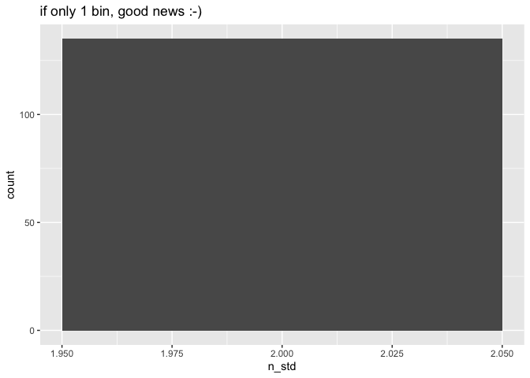
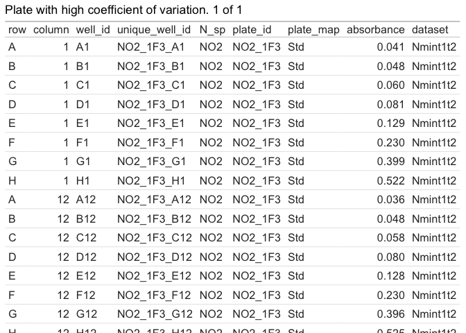
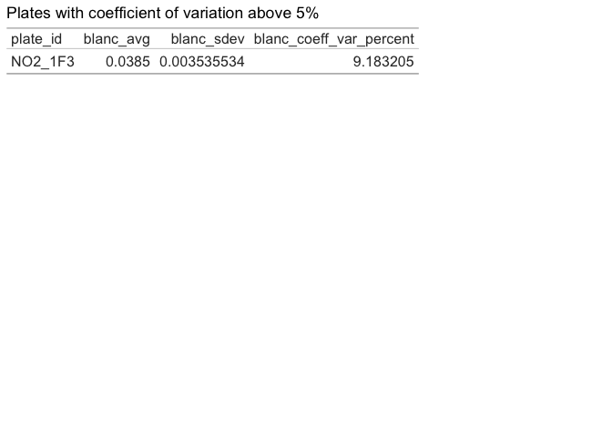
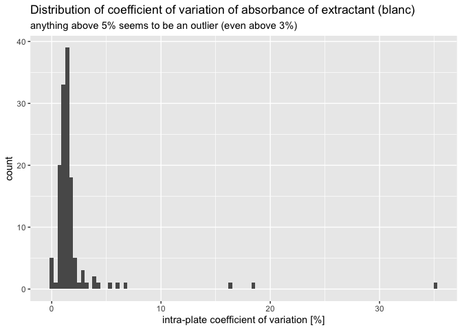
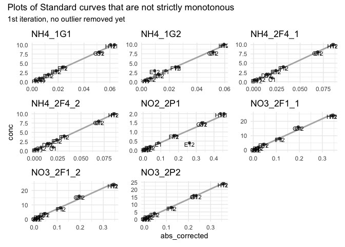
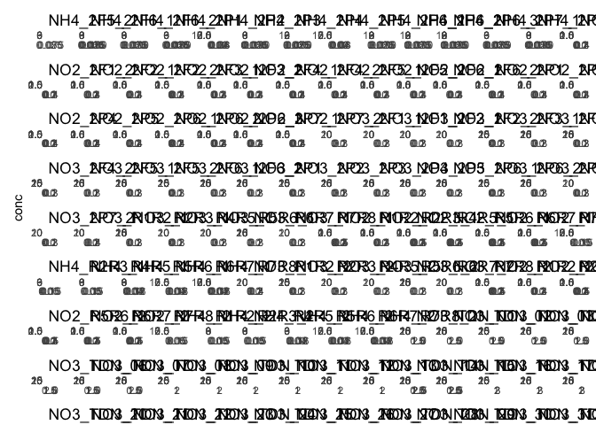
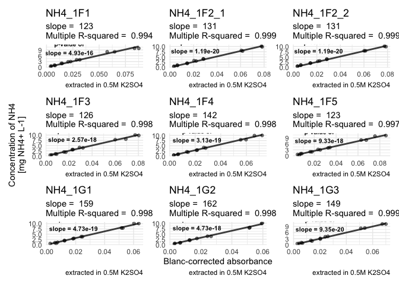
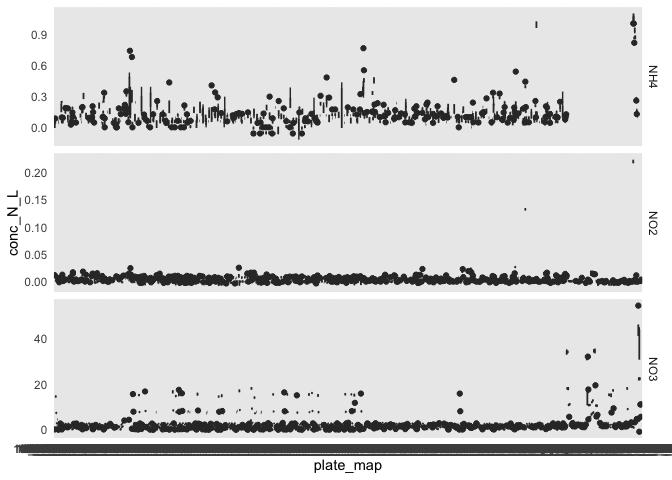

# V. Pipeline for Absorbance data


- [To Do](#to-do)
- [Intro](#intro)
- [1 - Set up](#1---set-up)
  - [1.1 - Loading packages and homemade
    functions](#11---loading-packages-and-homemade-functions)
  - [1.2 - Loading data](#12---loading-data)
- [2 - preliminary QC : suspicious
  wells](#2---preliminary-qc--suspicious-wells)
- [3 - Blanc-correction of absorbance
  values](#3---blanc-correction-of-absorbance-values)
  - [3.1 - Correct standard curves for
    blanc](#31---correct-standard-curves-for-blanc)
  - [3.2 - Correcting samples for
    blanc](#32---correcting-samples-for-blanc)
- [°<sup>°°°</sup> Milestone : blanc-corrected data
  °<sup>°°°</sup>](#-milestone--blanc-corrected-data-)
- [4 - Compute regression equation btw absorbance and
  concentration](#4---compute-regression-equation-btw-absorbance-and-concentration)
  - [4.1 - Quality check of standard
    curves](#41---quality-check-of-standard-curves)
    - [4.1.1 - removing outliers](#411---removing-outliers)
    - [4.1.2 - Inter-curve variability](#412---inter-curve-variability)
  - [4.2 - Perform linear model and infer
    slope](#42---perform-linear-model-and-infer-slope)
  - [4.3 - Compute concentrations in N
    species](#43---compute-concentrations-in-n-species)
- [5 - Export](#5---export)
- [°<sup>°°°</sup> Milestone : all data ready for downstream analysis
  °<sup>°°°</sup>](#-milestone--all-data-ready-for-downstream-analysis-)

# To Do

- Improve visualization for multiple plots –\> make a loop to produce
  several pages?
- improve rendering of
  <a href="#lst-qc4" class="quarto-xref">Listing 6</a>
  - have the table(s) called in successive chunks with labels –\> can
    call them in comments above
  - change the printing of warning / message? (seems to appear twice)
- Change function for superposed plots so that it is easy to modulate
  which column of metadata goes into the color-coding of the curves

# Intro

To keep this pipeline easily readable and reproducible, most operations
are “hidden” in functions. Until I learn how to create a package
(upcoming…), you’ll have to download the folder containing functions. It
should be in the current working directory. If not, update the path
below.

In this pipeline we refer to

- “curve” = all wells and associated data that refer to one standard
  curve (typically a whole column on the plate).

- “plate” = one 96-well plate used for the experiment. It is, together
  with rows and columns, one of the smallest scales of extracting data.
  Although data at this stage is no longer formated in the shape of a
  plate, the plate still constitutes a unit. All wells on that plate
  share the same blanc and the same standard curve, they will thus be
  treated as one for many computation steps.

- “row” can be used to designate the row (i.e., observation) of a table
  or data set. But it also designates the row of a plate and, as such,
  becomes data recorded in a column called “row”. This dual meaning can
  lead to some confusion. I try to use “row-plate” when refering to the
  rows (A, B, C…) of a 96-well plate. But it is possible that I forgot
  to do that sometimes and simply used “row”. Context should help.

- “suspicious”. We refer to suspicious curves or suspicious wells or
  suspicious plates: they need to be examined and may contain /
  constitute outliers

- “(un)trusted”: this is one step further than “suspicion”. A decision
  has been taken. This refers to wells that have been or will be removed
  (untrusted) or kept (trusted)

> [!TIP]
>
> ### Your input is needed!
>
> The pipeline is highly automated. Nevertheless, as a user, you’ll have
> to take a few decisions:
>
> - adapting path for import of data
>   (<a href="#lst-load" class="quarto-xref">Listing 1</a>)
> - Playing around with the range of absorbance to accept
>   (<a href="#lst-qc1-initial-range" class="quarto-xref">Listing 3</a>)
> - Playing around with max acceptable coefficient of variation for
>   extractant
>   (<a href="#lst-hist-extr-coeff-var" class="quarto-xref">Listing 8</a>)
> - Based on observations from
>   <a href="#fig-suspicious-plates" class="quarto-xref">Figure 3</a>,
>   thresholds can be set in <a href="#lst-cut-threshold-extractant"
>   class="quarto-xref">Listing 9</a> to exclude outlier wells from
>   extractant data
> - Based on visual appraisal of graphs
>   <a href="#fig-unsorted-curves" class="quarto-xref">Figure 5</a>,
>   encode identifier of outlier wells
>   <a href="#lst-outlier-std" class="quarto-xref">Listing 11</a>
> - adapting path for export of data
>   (<a href="#lst-export" class="quarto-xref">Listing 12</a>)

# 1 - Set up

## 1.1 - Loading packages and homemade functions

<details class="code-fold">
<summary>Code</summary>

``` r
library(tidyverse)
library(roperators) # to be able to add %ni% for "not in"
library(patchwork) # for wrap_plots and wrap_tables
library(RColorBrewer) # to find and set color palette

source("functions/extract_curve.R")
source("functions/plot_qc_std_all.R")
source("functions/qc1_initial_range_abs.R")
source("functions/qc2_plot_range_abs.R")
source("functions/qc3_nb_curves_per_plate.R")
source("functions/subset_data.R")
source("functions/qc4_std_blanc_variation.R")
source("functions/correct_abs_std.R")
source("functions/qc5_extr_blanc_variation.R")
source("functions/qc6_extr_trusted.R")
source("functions/qc7_std_find_outlier.R")
source("functions/correct_abs_samples.R")
source("functions/plot_qc_std_multiple.R")
source("functions/std_regression.R")
source("functions/abs_to_mgN_L.R")
```

</details>

## 1.2 - Loading data

> [!TIP]
>
> ### Your input is needed!
>
> The paths in the next chunk should be replaced by your own data,
> possibly generated in previous pipeline

<div id="lst-load">

Listing 1: Load data (possibly generated in previous pipeline)

<details class="code-fold">
<summary>Code</summary>

``` r
# import tidy data and metadata
Nmin_data <- read_rds("output/data/Nmin_tidy.rds")
Nmin_metadata <- read_rds("output/data/Nmin_metadata.rds")
```

</details>

</div>

# 2 - preliminary QC : suspicious wells

The ideal range for absorbance readings (Beer-Lambert in linear range of
relationship between concentration and absorbance) is between 0.1 and 1.
But these are not super strict borders. I don’t want to send out a
warning message too soon, so we take higher values as a default,
especially because with NO2-, we expect virtually zero in a lot of
wells.

The following chunk filters out only rows where absorbance is out of
range, and returns either a warning (when there are out-of-range values)
or a happy message (when there are none). In case of a warning, it also
shares the table with suspicious wells, so that the user can take an
informed decision.

> [!TIP]
>
> ### To be thought through
>
> If wells are out of range of “acceptable” absorbance values, you’ll
> get a warning.
>
> - You can play around with the min and max of the “acceptable” range
>   (<a href="#lst-qc1-initial-range" class="quarto-xref">Listing 3</a>)
>
> - You can also evaluate this range with having a look at
>   <a href="#fig-plot_QC_wells" class="quarto-xref">Figure 1</a>
>
> <!-- -->
>
> - What if some wells are out of range? Ware options then? Remove
>   suspicious wells (replace by NAs?)

<div id="lst-qc1-initial-range">

Listing 2: Here you can play around with the range of `acceptable`
absorbance values

<details class="code-fold">
<summary>Code</summary>

``` r
qc1_initial_range_abs(Nmin_data, min_abs = 0.03, max_abs = 1.1)
```

</details>

</div>

    °^° !! YAY !! °^° All wells are in range for absorbance between 0.03 and 1.1

<div id="lst-qc1-initial-range">

Listing 3: Here you can play around with the range of `acceptable`
absorbance values

<details class="code-fold">
<summary>Code</summary>

``` r
#> ok with a threshold min of 0.03, but more than 4000 when threshold of 0.05
#out_of_range <- Nmin_full |> filter(row_number() %in% suspicious_rows) 

#> but they're all NH4 or NO2 --> acceptable!
# out_of_range |> filter(
#   str_split_i(plate_id, pattern = "_", 1) %ni% c("NH4", "NO2")
#   )
```

</details>

</div>

<details class="code-fold">
<summary>Code</summary>

``` r
qc2_plot_range_abs(Nmin_data) +
  labs(subtitle = "Many low values, especially for NH4+ and NO2-")
```

</details>

<div id="fig-plot_QC_wells">

<div class="cell-output-display">

<div id="fig-plot_QC_wells">


(a) This figures shows raw numbers of uncorrected absorbance (no blanc
correction). It contains all values, including values of blanc wells and
values of the standard curve. Low values are expected for NO2-, less so
for NH4+

</div>

</div>

Figure 1: QC of Suspicious wells - Distribution of raw absorbance per N
species

</div>

# 3 - Blanc-correction of absorbance values

Now we correct absorbance values by subtracting blanc values from raw
values (absorbance of the light by the solution = absorbance by the
blank solution + absorbance by the substance to be quantified)

## 3.1 - Correct standard curves for blanc

For now, this is a separate process (std curves vs samples) to account
for the fact that the standard curve was prepared in H2O, not in the
extractant (K2SO4 or KCl), so it needs its own blanc-correction.

<u>**To be thought through:**</u>

- If it becomes relevant: make some sort of if condition, based on plate
  information (`blanc_id` and `std_id`)

A typical pipetting error with the automated pipette is to forget to
expell the first bit (containing air) before the “real” pipetting
starts. In this case, the first well to be pipetted (typically well A1)
will receive a wrong amount of reagent, which in turn may impact
stoechiometry and volume, thus absorbance reads. The next chunk allows
the identification of minimum values within a standard curve that are
not situated in the first or last row of the plate (usually the standard
curve is pipetted in ascending or descending order).

With this information, for example, we can exclude wells where the first
row shows a higher absorbance than the second row.

–\> In the chunk below we get suspicious curves. So we can exclude those
combinations of plate and column from the computation of the average
blanc. So we will only take the value from the remaining std curve.
Here, we always pipetted 2 per plate (yay!).

–\> This option of course is not valid in the case where only one
standard curve is pipetted per plate. In that case, one option is to
check whether absorbance values are fairly constant between plates. If
so, it is a fair correction to take the inter-plate average value (or a
standardized version of it… we’ll cross that bridge when we get to it)

Once we disregard those suspicious wells, we can compute the average
blanc values.

First, we check that we indeed have 2 columns with std curve on every
plate

<details class="code-fold">
<summary>Code</summary>

``` r
# check that we have 2 columns with Std per plate --> option to remove suspicious blancs
qc3_nb_curve_per_plate(Nmin_data, nb_std = 2)
```

</details>

    !! YAY !! There is/are indeed on average exactly 2 standard curves per plate. It is very likely that there are exactly 2 curves per plate. To be sure, check the distribution of number of standard curves per plate. If there is only 1 value at 2, then it is confirmed.



Second, we can take a subset of `std_data` that contains only the rows
with blancs, and only those that we trust (normally row A or H only)

<div id="lst-qc4">

Listing 4: QC 4 - Variation of Standard blanc

<details class="code-fold">
<summary>Code</summary>

``` r
QC4 <- qc4_std_blanc_variation(Nmin_data, nb_std = 2)
```

</details>

</div>

    Warning in qc4_std_blanc_variation(Nmin_data, nb_std = 2): There are 270 standard curves in this data set, thus in theory also 270 wells containing the blanc for those curves. 
    Of those 270, 4 are untrusted (see comments in the function definition for details on untrusted wells). Try ?qc4_std_blanc_variation().  
    We are thus a priori trusting 266 wells out of 270.

    Warning in qc4_std_blanc_variation(Nmin_data, nb_std = 2): Even after removal of untrusted wells, there are plates showing a big variation in absorbance values for the blanc of the standard curve (more than 5%).
    Pick the most likely values / remove outliers manually.
    See table to judge on values and find suspicious wells

<div id="lst-qc4">

Listing 5: QC 4 - Variation of Standard blanc

<details class="code-fold">
<summary>Code</summary>

``` r
lapply(QC4, print)
```

</details>

</div>

    [1] "There are 270 standard curves in this data set, thus in theory also 270 wells containing the blanc for those curves. \nOf those 270, 4 are untrusted (see comments in the function definition for details on untrusted wells). Try ?qc4_std_blanc_variation().  \nWe are thus a priori trusting 266 wells out of 270."
    [1] "Even after removal of untrusted wells, there are plates showing a big variation in absorbance values for the blanc of the standard curve (more than 5%).\nPick the most likely values / remove outliers manually.\nSee table to judge on values and find suspicious wells"




    $untrusted_msg
    [1] "There are 270 standard curves in this data set, thus in theory also 270 wells containing the blanc for those curves. \nOf those 270, 4 are untrusted (see comments in the function definition for details on untrusted wells). Try ?qc4_std_blanc_variation().  \nWe are thus a priori trusting 266 wells out of 270."

    $outlier_warning
    [1] "Even after removal of untrusted wells, there are plates showing a big variation in absorbance values for the blanc of the standard curve (more than 5%).\nPick the most likely values / remove outliers manually.\nSee table to judge on values and find suspicious wells"

    $suspicious_curve_coeff_var




    $NO2_1F3


<div id="lst-qc4">

Listing 6: QC 4 - Variation of Standard blanc

<details class="code-fold">
<summary>Code</summary>

``` r
#** DECIDE WHAT TO DO WITH THIS INFO. SO FAR, I HAVEN'T HAD THE CASE THAT I NEED TO REMOVE FURTHER WELLS BEYOND THE "UNTRUSTED" ONES. SO CODE FOR THIS STILL REMAINS TO BE WRITTEN, ALTHOUGH INSPIRATION CAN BE TAKEN FROM FURTHER QC STEPS * 
```

</details>

</div>

Third, we compute the blanc value (average) and return a warning if
blanc values show too much variation (in the case of several
plate-columns with standard curves)

If we are troubled by the big variation within plate, we can check out
the identified suspicious plates. In this case, I find it not so
dramatic. We are just dealing with small values which tend to
artificially increase the coefficient of variation (division by small
numbers…).

We can look at suspicious blancs in their full plate context to decide
how bad the situation is (see printed table).

Now we can blanc-correct the absorbance values for the whole standard
curves.

<details class="code-fold">
<summary>Code</summary>

``` r
std_corrected <- correct_abs_std(Nmin_data)
```

</details>

    Joining with `by = join_by(plate_id)`
    Joining with `by = join_by(plate_id, well_id)`

We could add those corrected values back into the main data table, but
actually those numbers are only useful to compute the regression
equation between corrected absorbance and concentration. For thematic
clarity purpose, this will be done in a later section (to keep all work
on blancs in one place). So we have now just save the output into the
object `std_corrected` so we can get back to it later.

## 3.2 - Correcting samples for blanc

While the mathematical approach is similar to correcting the blanc of
the standard curve, the computational steps are somewhat different
because the data is organised differently on the plates.

First, we extract the plate-rows containing extractant, then we do some
quality check: how big is the variation? Do we have suspicious wells?
All this happens with “QC 5” in the following chunk.

Looking at the distribution of the coefficient of variation per plate,
it appears that some plates have very different scoring, see
<a href="#fig-hist-extr-coeff-var" class="quarto-xref">Figure 2</a>

<div id="lst-hist-extr-coeff-var">

Listing 7: Playing around with maximum acceptable coefficient of
variation for the absorbance of extractant (blanc)

<details class="code-fold">
<summary>Code</summary>

``` r
#** Look at this (and the next chunk) iteratively a couple of times to decide where to put the threshold. *
  QC5 <- qc5_extr_blanc_variation(Nmin_data,max_coeff = 3)
```

</details>

</div>

    `summarise()` has grouped output by 'plate_id'. You can override using the
    `.groups` argument.

    Warning in qc5_extr_blanc_variation(Nmin_data, max_coeff = 3): There is a big variation in absorbance values for the blanc  (more than 3%).
    Remove the most unlikely values / remove outliers manually.
    See table above to judge on values. 
    Suspicious plates are stored in vector called suspicious_plate_id

<div id="lst-hist-extr-coeff-var">

Listing 8: Playing around with maximum acceptable coefficient of
variation for the absorbance of extractant (blanc)

<details class="code-fold">
<summary>Code</summary>

``` r
  QC5$distrib_coeff +
  labs(subtitle = "anything above 5% seems to be an outlier (even above 3%)")
```

</details>

</div>

<div id="fig-hist-extr-coeff-var">



Figure 2: Distribution of coefficient of variation of absorbance of
extractant (blanc)

</div>

Let’s now have a look at those suspicious plates

<details class="code-fold">
<summary>Code</summary>

``` r
#** To play around with the maximum coefficient of variation, change argument max_coeff in the function call *
#*
QC5$multiple_plot 
```

</details>

    `stat_bin()` using `bins = 30`. Pick better value `binwidth`.
    `stat_bin()` using `bins = 30`. Pick better value `binwidth`.
    `stat_bin()` using `bins = 30`. Pick better value `binwidth`.
    `stat_bin()` using `bins = 30`. Pick better value `binwidth`.
    `stat_bin()` using `bins = 30`. Pick better value `binwidth`.
    `stat_bin()` using `bins = 30`. Pick better value `binwidth`.
    `stat_bin()` using `bins = 30`. Pick better value `binwidth`.
    `stat_bin()` using `bins = 30`. Pick better value `binwidth`.
    `stat_bin()` using `bins = 30`. Pick better value `binwidth`.
    `stat_bin()` using `bins = 30`. Pick better value `binwidth`.

<div id="fig-suspicious-plates">


Figure 3: Distribution of absorbance in suspicious plates. From this we
can manually identify then remove outliers

</div>

We have to remove outliers manually: it is really a visual appreciation
that works (see
<a href="#fig-suspicious-plates" class="quarto-xref">Figure 3</a>). Only
“suspicious” plates from above are displayed.

- Watch out, in the case of plates with several blancs like here (coming
  from several batches of soil extraction), that a bimodal distribution
  might not necessary be an issue.

- Also look at the scale of the axes: bins will always spread over the
  whole x-axis, even if the distance is only of 0.001…

Based on visual appreciation, here is the list of plates that we want to
correct. One way to do it is to impose, for each plate, a threshold
value that we can later use to filter out outlier wells (wells above the
threshold value).

> [!TIP]
>
> ### Manually remove outliers!
>
> In the following chunk, you need to input threshold values as a vector
> with one number per “suspicious” plate. If you decide to keep all
> values, you can set a threshold of 1.00.
>
> - look at
>   <a href="#fig-suspicious-plates" class="quarto-xref">Figure 3</a> to
>   decide on threshold values. By default, the function `wrap_plots()`
>   orders plots by row, so that the order of plates in
>   `extr_suspicious` corresponds to the plots read from left to right,
>   then next row, etc.
>
> - The function call only allows to exclude values above the threshold
>   for now. If your outliers are rather the lower values, you’ll need
>   to have a look in the source code of the function
>   `qc6_extr_trusted()`, and update it somehow.

**!! In case you want to exclude lower values only, then just change the
`>` into `<`. But if you want to exclude some upper values, and some
lower values, consider updating the code.**

<div id="lst-cut-threshold-extractant">

Listing 9: Set up threshold and remove outlier wells for absorbance of
extractant

<details class="code-fold">
<summary>Code</summary>

``` r
#** !! Manually input the threshold values of your choosing (read plots from left to right, then from up to down (rowise reading)) *

# print it to check in which order the plates are
# suspicious_plates

# Or manual input
cut_threshold <- c(0.040, 0.041, 0.039, 0.038, 0.038, 0.041, 0.042, 0.072, 0.09, 0.09)


QC6 <- qc6_extr_trusted(QC5, cut_threshold = cut_threshold)
```

</details>

</div>

    Warning in qc6_extr_trusted(QC5, cut_threshold = cut_threshold): From 1272 wells in total for extractant, 11 have been removed because their absorbance value appeared to be an outlier from a within-plate perspective. 
    This amounts to a removal of 0.9% of extractant wells based on an intervention tolerance threshold of 3% for the intra-plate coefficient of variation

Now we can use the list of untrusted wells to filter them out of the
extractant data, and look at the improved distribution of intra-plate
variation.

<details class="code-fold">
<summary>Code</summary>

``` r
QC6$extr_distrib_coeff +
  labs(subtitle = "1 plate is still outlier (above 3%), but much less so than before")
```

</details>

<div id="fig-distrib-variation-extr-improved">


Figure 4: Distribution of variation of absorbance of extractant (blanc)
after removal of outliers

</div>

Now that we have computed a trusted version of the average of absorbance
per plate per “blanc”, we can correct sample absorbance values.

<details class="code-fold">
<summary>Code</summary>

``` r
corrected_data <- correct_abs_samples(Nmin_data, QC6 = QC6)
```

</details>

    Joining with `by = join_by(plate_id)`
    Joining with `by = join_by(plate_id, well_id, absorbance)`

# °<sup>°°°</sup> Milestone : blanc-corrected data °<sup>°°°</sup>

# 4 - Compute regression equation btw absorbance and concentration

## 4.1 - Quality check of standard curves

The next chunk will first perfom a basic quality check of the standard
curve

- checking that metadata and data have the same nb of plates

- check that there are no negative values for the corrected absorbance

### 4.1.1 - removing outliers

Then, it will look for curves that are not monotonous, i.e., not
strictly increasing (or decreasing, depending on pipetting).
Non-monotonous curves are referred to in the code as “unsorted_curves”
(absorbance values are not sorted). Aberrant wells responsible for the
non-monotony can be spotted on the plots in
<a href="#fig-unsorted-curves" class="quarto-xref">Figure 5</a>

<details class="code-fold">
<summary>Code</summary>

``` r
QC7.1 <- qc7_std_find_outlier(std_corrected = std_corrected, metadata = Nmin_metadata)
```

</details>

    Joining with `by = join_by(row)`
    Joining with `by = join_by(row)`
    Joining with `by = join_by(row)`
    Joining with `by = join_by(row)`
    Joining with `by = join_by(row)`
    Joining with `by = join_by(row)`
    Joining with `by = join_by(row)`
    Joining with `by = join_by(row)`

<details class="code-fold">
<summary>Code</summary>

``` r
#** Same principle as above: visually identify obvious outliers, and list them in the vector below. !! Only works for one well per plate for now. If several --> work iteratively or update code *

QC7.1$multiplot + plot_annotation(subtitle = "1st iteration, no outlier removed yet")
```

</details>

<div id="fig-unsorted-curves">



Figure 5: Non-monotonous curves - helps to identify potential outliers

</div>

> [!TIP]
>
> ### Manually remove outliers!
>
> In the following chunk, we can manually encode a vector containing all
> outlier wells, based on visual appraisal of graphs
> <a href="#fig-unsorted-curves" class="quarto-xref">Figure 5</a>
>
> - For the plates where you want to keep all wells, encode NA
>
> - For the plates where you want to remove <u>**one**</u> well, encode
>   its identifier (e.g., “E12”)
>
> - Currently, you have to encode exactly one value per suspicious
>   curve. If you want to remove 2 wells, proceed either iteratively or
>   go to the source code of the function `qc7_std_find_outlier()`.

Once outlier wells are encoded, the following chunk will update input
data (`std_tidy` will replace `std_corrected`). You can then look again
at the remaining “suspicious” curves and see the improvement, then
decide to proceed for one more iteration or keep the tidy data as is.

<div id="lst-outlier-std">

Listing 10: Manually encode identifier of outlier wells

<details class="code-fold">
<summary>Code</summary>

``` r
#** !!! MANUALLY ENCODE THE OBJECT CALLED outlier_wells base on last plot - read it from left to right then from up to down *

# Default just to be sure that the code can work, create an empty vector of the correct length
outlier_wells <- rep(NA, nrow(QC7.1$unsorted_curves))

# Or Manual encoding
outlier_wells <- c(NA, "E12", "C1", "C1", "E12", NA, NA, NA)

# connect id of problematic curves (plate id of "unsorted" curves) to ourlier_wells
outlier_curves <- 
  QC7.1$unsorted_curves |> 
    ungroup() |> 
    mutate(
      outliers = outlier_wells,
      unique_well_id = case_when(
        is.na(outliers) ~ NA,
        .default = paste0(plate_id, "_", outliers))
    )
#outlier_curves

# tidy std data with ourlier wells removed
std_tidy <- std_corrected |> 
  filter(unique_well_id %ni% outlier_curves$unique_well_id)

# Run it once more, approve of wells... evtl re-run previous bit
QC7.2 <- qc7_std_find_outlier(std_corrected = std_tidy, metadata = Nmin_metadata)
```

</details>

</div>

    Joining with `by = join_by(row)`
    Joining with `by = join_by(row)`
    Joining with `by = join_by(row)`
    Joining with `by = join_by(row)`

<div id="lst-outlier-std">

Listing 11: Manually encode identifier of outlier wells

<details class="code-fold">
<summary>Code</summary>

``` r
# Look at plos and decide if happy
QC7.2$multiplot + plot_annotation(subtitle = "2nd iteration, outliers removed. Curves satisfactory now")
```

</details>

</div>


### 4.1.2 - Inter-curve variability

At this stage, we should be satisfied with the curves.

We can visualize all curves for a given N species, to have an idea of
inter-curve variability.

The next chunk works, but it produces a very difficult to read plot with
multiple panels (135 actually).

<details class="code-fold">
<summary>Code</summary>

``` r
plot_qc_std_multiple(metadata = Nmin_metadata, std_data = std_tidy)
```

</details>



Let’s find a neater way to look at it by overplotting, using the
function `plot_qc_std_all`.

First, for NH4+
(<a href="#fig-QC-std-all-nh4" class="quarto-xref">Figure 6</a>), then
for NO2-
(<a href="#fig-QC-std-all-no2" class="quarto-xref">Figure 7</a>) and for
NO3- (<a href="#fig-QC-std-all-no3" class="quarto-xref">Figure 8</a>).

For now, the visual is made to attribute color-coding to the factor
“sampling-time” which is related to lab experimental batches, so I
expected it to show some variability. To change the attribution of
colors, either go to the source code to improve options, or rename
whatever column containing the factor of interest into “sampling_time”
prior to sending the metadata into the pipeline.

<details class="code-fold">
<summary>Code</summary>

``` r
# Choice of color palette

#display.brewer.all(n = 3)
color_time <- brewer.pal(n = 3, "Accent")
names(color_time) <- c("t1", "t2", "t3")

plot_qc_std_all(
  data = std_tidy |> filter(N_sp == "NH4"),
  metadata = Nmin_metadata |> filter(std_sp == "NH4"),
  color_time = color_time,
  pipetting_direction = "top_down")
```

</details>

<div id="fig-QC-std-all-nh4">


Figure 6: QC for Standard curves. We se low intra-batch but higher
inter-batch variability. Seeing this, I’d actually recommend considering
increasing incubation time or concentrations: absorbance is very low

</div>

<details class="code-fold">
<summary>Code</summary>

``` r
plot_qc_std_all(
  data = std_tidy |> filter(N_sp == "NO2"),
  metadata = Nmin_metadata |> filter(std_sp == "NO2"),
  color_time = color_time,
  pipetting_direction = "top_down")
```

</details>

<div id="fig-QC-std-all-no2">


Figure 7: QC for Standard curves. We se low intra- and interbatch
variability. Seeing this, I’d actually recommend considering increasing
incubation time or concentrations: absorbance is very low

</div>

<details class="code-fold">
<summary>Code</summary>

``` r
plot_qc_std_all(
  data = std_tidy |> filter(N_sp == "NO3"),
  metadata = Nmin_metadata |> filter(std_sp == "NO3"),
  color_time = color_time,
  pipetting_direction = "top_down")
```

</details>

<div id="fig-QC-std-all-no3">


Figure 8: QC for Standard curves. We se low intra- and interbatch
variability. Seeing this, I’d actually recommend considering increasing
incubation time or concentrations: absorbance is very low

</div>

## 4.2 - Perform linear model and infer slope

The next chunk computes the regression on the data from the standard
curve, to obtain, for each plate: the slope, the multiple R-squared and
the p-value associated to the linear model. It also plots all curves in
a series of successive multi-plots (~pages) that are saved individually
into a pdf (if the argument `save_pdf` is set to `TRUE`.). Only one of
those plots is rendered here for illustration. The nb of plots per page
can be modulated with the argument `max_nb_plots` (set to 16 by
default).

<details class="code-fold">
<summary>Code</summary>

``` r
std_reg <- std_regression(
  data = corrected_data, 
  metadata = Nmin_metadata,
  std_data = std_tidy,
  pipetting_direction = "top_down",
  max_nb_plots = 9,
  save_pdf = TRUE, 
  filepath = "output/figures/QC/")
```

</details>

    !! YAY !!
    The linear model is significative for all plates (p-value < 0.05). You can proceed with the inference of concentrations.

<details class="code-fold">
<summary>Code</summary>

``` r
# Here we have the simplified output of the linear model
std_reg$lm_output
```

</details>

    # A tibble: 135 × 4
       plate_id  slope p_val_slope r_squared_mult
       <chr>     <dbl>       <dbl>          <dbl>
     1 NH4_1F1     123    4.93e-16          0.994
     2 NH4_1F2_1   131    1.19e-20          0.999
     3 NH4_1F2_2   131    1.19e-20          0.999
     4 NH4_1F3     126    2.57e-18          0.998
     5 NH4_1F4     142    3.13e-19          0.998
     6 NH4_1F5     123    9.33e-18          0.997
     7 NH4_1G1     159    4.73e-19          0.998
     8 NH4_1G2     162    4.73e-18          0.998
     9 NH4_1G3     149    9.35e-20          0.999
    10 NH4_1G4     154    1.4 e-15          0.993
    # ℹ 125 more rows

<details class="code-fold">
<summary>Code</summary>

``` r
# plots are saved as pdf. But just for illustration, let's look at one
std_reg$multi_plots[[1]]
```

</details>



## 4.3 - Compute concentrations in N species

Finally, we can transform the data, using the slope obtained above to
compute the concentration. For now, this pipeline was meant for dosage
of N fractions, all going through the dosage of NO2-, NO3- or NH4+.

–\> For dosing anything else, the source code will need to be adapted,
but it should be fairly simple.

The function `abs_to_mgN_L` first transforms corrected absorbances into
concentration in mg of N species per L (e.g., mg NH4+/L), which is then
converted to the next unit: mg N/L. The output of the function is
multiple: it contains the transformed data in the same vertical format
as has been used throughout this pipeline. Finally, the function also
outputs 2 plot formats to have a rough visualization of the range of the
transformed data.

> [!TIP]
>
> ### NO3 not final yet
>
> The concentration in mg N/L for NO3 is at this stage still a gross
> measurement that also contains the amouns of NO2 that was present in
> the sample but was oxidised to NO3. In theory we have to make a
> substraction (NO3 neat = NO3 gross - NO2). But
>
> - we can only do this once we’ve agregated data on each sample (so an
>   average of the 4 wells = technical replicates)
>
> - in practice we see that concentrations in NO2 are so low that it’s
>   ok, in first approximation, to have a look at this value for now.

To finally convert these numbers from mg N /L into mg N / g dry soil, we
need to integrate the 2 variables from external data sets: soil dry
matter and the soil:exctractant ratio. This is thus something for
another script. We can nevertheless have a first look at plots and see
that indeed NO2 is mostly at 0, there is some noise in NH4, and clear
variations in NO3.

<details class="code-fold">
<summary>Code</summary>

``` r
data_transformed <- abs_to_mgN_L(
  data = corrected_data,
  metadata = Nmin_metadata,
  lm_output = std_reg$lm_output)

# check out the first result
data_transformed$data
```

</details>

    # A tibble: 4,868 × 11
    # Groups:   plate_id [135]
       plate_id extr_avg well_id abs_corrected row   column unique_well_id N_sp 
       <chr>       <dbl> <chr>           <dbl> <chr>  <dbl> <chr>          <chr>
     1 NH4_1F1     0.039 A2            0.007   A          2 NH4_1F1_A2     NH4  
     2 NH4_1F1     0.039 B2            0.007   B          2 NH4_1F1_B2     NH4  
     3 NH4_1F1     0.039 C2            0.006   C          2 NH4_1F1_C2     NH4  
     4 NH4_1F1     0.039 D2            0.016   D          2 NH4_1F1_D2     NH4  
     5 NH4_1F1     0.039 E2            0.00200 E          2 NH4_1F1_E2     NH4  
     6 NH4_1F1     0.039 F2            0.00400 F          2 NH4_1F1_F2     NH4  
     7 NH4_1F1     0.039 G2            0.00300 G          2 NH4_1F1_G2     NH4  
     8 NH4_1F1     0.039 H2            0.00300 H          2 NH4_1F1_H2     NH4  
     9 NH4_1F1     0.039 A3            0.01    A          3 NH4_1F1_A3     NH4  
    10 NH4_1F1     0.039 B3            0.009   B          3 NH4_1F1_B3     NH4  
    # ℹ 4,858 more rows
    # ℹ 3 more variables: plate_map <chr>, conc_mgNsp_L <dbl>, conc_N_L <dbl>

<details class="code-fold">
<summary>Code</summary>

``` r
# the next 2 will be pu in separate chunks to get a figure nb
```

</details>

<details class="code-fold">
<summary>Code</summary>

``` r
#|label: fig-all-conc-boxplot
#|fig-cap: "Overview of all transformed data per N species - boxplot"

data_transformed$boxplot
```

</details>



<details class="code-fold">
<summary>Code</summary>

``` r
#|label: fig-all-conc-density
#|fig-cap: "Overview of all transformed data per N species - density curves"

data_transformed$density
```

</details>


Let us now format then export the table for later use. We will need the
last step of computation to happen per sample, so that technical reps
(wells) should be pivotted onto a single line. We’ll have a lot of NAs
bc each plate will only have values at either A, B, C, D or E, F, G, H.
We could find a way to fuse it probably…

<details class="code-fold">
<summary>Code</summary>

``` r
# pivot for export
  data_export <- data_transformed$data |> 
    mutate(
      rep_tech = case_when(
        row %in% c("A", "E") ~ "rt1",
        row %in% c("B", "F") ~ "rt2",
        row %in% c("C", "G") ~ "rt3",
        row %in% c("D", "H") ~ "rt4"
      )
    ) |> 
    #filter(plate_id == "NH4_1F1") |> 
    select(!(c(well_id:unique_well_id, conc_mgNsp_L))) |> 
    
    # the next 3 lines should be activated in case we get an error saying that there are duplicates observations (typically there are either 2x the same sample in one plate, or there is a mistake in the plate map). Once the problem is solved, these 3 lines can be deactivated again.
    # ungroup() |> 
    # dplyr::summarise(n = dplyr::n(), .by = c(plate_id, N_sp, plate_map, rep_tech)) |>
    # dplyr::filter(n > 1L)
    
    pivot_wider(
      id_cols = c(plate_id, N_sp, plate_map),
      names_from = rep_tech,
      values_from = conc_N_L,
      names_prefix = "conc_N_L"
      
    )
data_export
```

</details>

    # A tibble: 1,217 × 7
    # Groups:   plate_id [135]
       plate_id N_sp  plate_map conc_N_Lrt1 conc_N_Lrt2 conc_N_Lrt3 conc_N_Lrt4
       <chr>    <chr> <chr>           <dbl>       <dbl>       <dbl>       <dbl>
     1 NH4_1F1  NH4   81_t1_z2       0.334       0.334       0.287       0.764 
     2 NH4_1F1  NH4   89_t1_z1       0.0955      0.191       0.143       0.143 
     3 NH4_1F1  NH4   82_t1_z2       0.478       0.430       0.478       0.430 
     4 NH4_1F1  NH4   90_t1_z2       0.143       0.143       0.143       0.143 
     5 NH4_1F1  NH4   83_t1_z2       0.143       0.143       0.143       0.143 
     6 NH4_1F1  NH4   91_t1_z2       0.0955      0.239       0.0955      0.0955
     7 NH4_1F1  NH4   84_t1_z1       0.143       0.143       0.0955      0.143 
     8 NH4_1F1  NH4   92_t1_z3       0.0955      0.0955      0.0955      0.143 
     9 NH4_1F1  NH4   85_t1_z1       0.0955      0.0955      0.0478      0.0955
    10 NH4_1F1  NH4   93_t1_z1       0.334       0.287       0.287       0.287 
    # ℹ 1,207 more rows

# 5 - Export

<div id="lst-export">

Listing 12: Encode path and file name for export

<details class="code-fold">
<summary>Code</summary>

``` r
std_reg$lm_output |> write_rds("output/data/Nmin_std_curves_lm.rds")
data_export |> write_rds("output/data/Nmin_conc.rds")
```

</details>

</div>

# °<sup>°°°</sup> Milestone : all data ready for downstream analysis °<sup>°°°</sup>
