# 3.1 Field, t2 - Import and tidy data


- [To Do](#to-do)
- [Set up](#set-up)
- [1 - Import data](#1---import-data)
  - [1.1 - Non-absorbance data from
    AELab](#11---non-absorbance-data-from-aelab)
    - [1.1.1 - Raw data](#111---raw-data)
    - [1.1.2 - Lab data on a per plot
      basis](#112---lab-data-on-a-per-plot-basis)
    - [1.1.3 - Lab data to get water content needed for
      PMN.](#113---lab-data-to-get-water-content-needed-for-pmn)
    - [1.1.4 - Lab data to get water content and fresh weight for
      PNR](#114---lab-data-to-get-water-content-and-fresh-weight-for-pnr)
- [°°° !!! START HERE !!! °°°](#--start-here--)
  - [1.2 - Microresp Data (TO DO?)](#12---microresp-data-to-do)
  - [1.3 - Absorbance data](#13---absorbance-data)
    - [1.3.1 - Nmin t2: Subset t2, field data
      set](#131---nmin-t2-subset-t2-field-data-set)
    - [1.3.2 - PMN: Subset field](#132---pmn-subset-field)
    - [1.3.3 - TDN: Subset field](#133---tdn-subset-field)
    - [1.3.4 - TO DO: PNR](#134---to-do-pnr)
  - [1.4 - Data from the CRA-W](#14---data-from-the-cra-w)
    - [1.4.1 - Yield data](#141---yield-data)
- [2 - Tidy data: per-sample outlier
  removal](#2---tidy-data-per-sample-outlier-removal)
  - [2.1 - Nmin](#21---nmin)
    - [2.1.1 - NO3](#211---no3)
    - [2.1.2 - NH4](#212---nh4)
    - [2.1.3 - NO2](#213---no2)
    - [2.1.4 - Standard Soils](#214---standard-soils)
    - [2.1.5 - All outliers removed
      Nmin](#215---all-outliers-removed-nmin)
  - [2.3 - PMN](#23---pmn)
    - [2.3.1 - NO3](#231---no3)
    - [2.3.2 - NH4](#232---nh4)
    - [2.3.3 - NO2](#233---no2)
    - [2.3.4 - All outliers removed
      PMN](#234---all-outliers-removed-pmn)
  - [2.4 - TDN](#24---tdn)
    - [2.4.1 - NO3](#241---no3)
    - [2.4.2 - NO2](#242---no2)
    - [2.4.3 - Standard soil](#243---standard-soil)
    - [2.4.3 - All outliers removed
      TDN](#243---all-outliers-removed-tdn)
  - [2.5 - PNR - TO DO](#25---pnr---to-do)
    - [2.5.1 - NO3](#251---no3)
    - [2.5.2 - NO2](#252---no2)
    - [2.5.3 - All outliers removed
      PNR](#253---all-outliers-removed-pnr)
- [3 - Per-sample mean](#3---per-sample-mean)
  - [3.1 - Nmin](#31---nmin)
  - [3.2 - PMN](#32---pmn)
  - [3.3 - TDN](#33---tdn)
  - [3.4 - PNR](#34---pnr)
- [4 - Export](#4---export)

# To Do

- Import MicroResp
- Import PNR
- Nmin t3?
- soil CRA

# Set up

<details class="code-fold">
<summary>Code</summary>

``` r
rm(list = ls())

library(plate2N) # for remove_wells
library(tidyverse)
library(janitor)
library(roperators) # for %ni%
library(ggrepel) # for geom_text_repel()
library(ggridges) # for geom_density_ridges()
library(patchwork) # for the "+" layout and plot_layout()

# functions
source("functions/plot_qc_sample_conc.R")
```

</details>

# 1 - Import data

## 1.1 - Non-absorbance data from AELab

### 1.1.1 - Raw data

<details class="code-fold">
<summary>Code</summary>

``` r
# import other "wet lab" raw data
raw_data_field <- read_csv(
  "../raw_data/2024_raw.csv", show_col_types = TRUE,
  col_types = list(
    Soil = col_factor(),
    crop_diversity = col_factor(),
    CS = col_factor(),
    bloc = col_factor()
  ),
  na = c("", "NA", "Na")
  ) |> clean_names() |> 
  rename(sample_short = short) |> 
  filter(expe == "Field")
```

</details>

    New names:
    Rows: 660 Columns: 173
    ── Column specification
    ──────────────────────────────────────────────────────── Delimiter: "," chr
    (28): Expe, short, CRA_trial, SdC, sampling_time, zone, incub_time, Res... dbl
    (139): Biol_unit_Nb, WHC_Tare_tube_g, WHC_gFW_g, WHC_Tare_dish_g, WHC_gS... lgl
    (2): Yd_grain_W_unit, Yd_Comment fct (4): Soil, crop_diversity, CS, bloc
    ℹ Use `spec()` to retrieve the full column specification for this data. ℹ
    Specify the column types or set `show_col_types = FALSE` to quiet this message.
    • `` -> `...173`

### 1.1.2 - Lab data on a per plot basis

(biological units = plots of t2, with 3 zones per plot)

<details class="code-fold">
<summary>Code</summary>

``` r
raw_field_t2_lab <- raw_data_field |> 
  filter(sampling_time == "t2") |> 
  arrange(biol_unit_nb, zone) |> 
  # remove useless columns
  select(
    biol_unit_nb:sample_short, 
    soil:zone,
    sample_name, #useful?
   starts_with(c("whc", "run", "flush", "yd_rs", "rt"))
    )

# Check it out
raw_field_t2_lab
```

</details>

    # A tibble: 80 × 53
       biol_unit_nb expe  sample_short soil  crop_diversity cs    bloc 
              <dbl> <chr> <chr>        <fct> <fct>          <fct> <fct>
     1           81 Field t2_81_z1     ABC   IC             IC    B2   
     2           81 Field t2_81_z2     ABC   IC             IC    B2   
     3           81 Field t2_81_z3     ABC   IC             IC    B2   
     4           82 Field t2_82_z1     ABC   SC             W     B2   
     5           82 Field t2_82_z2     ABC   SC             W     B2   
     6           82 Field t2_82_z3     ABC   SC             W     B2   
     7           83 Field t2_83_z1     ABC   SC             W     B3   
     8           83 Field t2_83_z2     ABC   SC             W     B3   
     9           83 Field t2_83_z3     ABC   SC             W     B3   
    10           84 Field t2_84_z1     ABC   IC             IC    B4   
    # ℹ 70 more rows
    # ℹ 46 more variables: sampling_time <chr>, zone <chr>, sample_name <chr>,
    #   whc_tare_tube_g <dbl>, whc_g_fw_g <dbl>, whc_tare_dish_g <dbl>,
    #   whc_g_sw_g <dbl>, whc_g_dw_g <dbl>, whc_comment <chr>, run_id_mr <chr>,
    #   flush_dm_tare_tr1 <dbl>, flush_dm_g_fw_tr1 <dbl>, flush_dm_g_dw_tr1 <dbl>,
    #   flush_dm_tare_tr2 <dbl>, flush_dm_g_fw_tr2 <dbl>, flush_dm_g_dw_tr2 <dbl>,
    #   flush_dm_tare_tr3 <dbl>, flush_dm_g_fw_tr3 <dbl>, …

### 1.1.3 - Lab data to get water content needed for PMN.

Unfortunately, WC was not computed separately, but can only be derived
from the WHC manip.

! Although WC was computed per bloc (4 blocs per soil), PMN was done on
a pooled sample from the 4 blocs. So we compute here only one mean value
of wc per soil, that is the mean of the 4 blocs.

<details class="code-fold">
<summary>Code</summary>

``` r
pmn_wc <- raw_data_field |> 
  select(biol_unit_nb, expe, soil, bloc, sampling_time, starts_with("whc")) |> 
  filter(sampling_time == "t0", !is.na(whc_tare_tube_g)) |> 
  #dm = g dry soil / g fresh soil       
  # wc = 1 - dm
  mutate(
    dm = (whc_g_dw_g - whc_tare_dish_g) / (whc_g_fw_g - whc_tare_tube_g),
    wc = 1-dm,
    .keep = "unused",
    .after = sampling_time
  ) |> 
  group_by(soil) |> 
  summarize(
    dm = mean(dm),
    wc = mean(wc)
  )
```

</details>

### 1.1.4 - Lab data to get water content and fresh weight for PNR

# °°° !!! START HERE !!! °°°

## 1.2 - Microresp Data (TO DO?)

Then, MicroResp data may need to be added, probably with its own
pipeline

## 1.3 - Absorbance data

This data needs tidying, because we still have 4 values per sample
(corresponding to the 4 wells given to each sample for analytical
replicates on the absorbance plate.

First, we import the dataset

<details class="code-fold">
<summary>Code</summary>

``` r
raw_Nmin <- read_rds("output/data/2_mgNL_noTDN.rds")
raw_TDN <- read_rds("output/data/2_mgNL_TDN.rds")
```

</details>

Then we make sure that each data set contains relevant categorical data:

- biological unit nb

- experiment (to filter on)

- sampling time (idem)

- cs (except PMN)

- soil

- zone

### 1.3.1 - Nmin t2: Subset t2, field data set

Then we take a subset (t2 only, field only).

This complex pipeline is only necessary because I was not very
consistent in plate-naming structure.

<details class="code-fold">
<summary>Code</summary>

``` r
cs_map <- raw_field_t2_lab |> 
  select(biol_unit_nb, cs, soil) |> 
  unique() 


raw_field_t2_Nmin <- raw_Nmin |> 
  filter(dataset == "Nmint1t2") |> #select(plate_id) |> unique() |> print(n = 40)
  # create sampling_time and expe variables from plate_ids (first number and first letter after N species)
  mutate(
    # paste "t" and the sampling time as number: for t1 and t2: is stored in plate data (--> str_extract)
    sampling_time = paste0(
      "t", 
      str_extract(plate_id, "^\\w\\w\\d_(\\d)(\\w).*", group = 1)
      ),
    # for expe: will work for t1 and t2, 
    expe = str_extract(plate_id, "^\\w\\w\\d_(\\d)(\\w).*", group = 2),
    # rephrase "F" into "Field" 
    expe = case_when(expe %in% c("F") ~ "Field", .default = expe),
    .before = plate_id,
    zone = str_extract(map, ".*_(\\w\\d)$", group = 1)
      ) |> 
  # filter based on sampling_time
  filter(sampling_time == "t2", expe == "Field") |> 
  separate_wider_delim(
    cols = map,
    names = c("biol_unit_nb"),
    delim = "_",
    too_many = "drop", 
    cols_remove = FALSE
  ) |> 
  mutate(
    biol_unit_nb = as.double(biol_unit_nb),
    # for some reason, biol_unit_nb of Std soil is 112 in lab data vs 110 in abs data
    biol_unit_nb = case_when(biol_unit_nb == 110 ~ 112, .default = biol_unit_nb)) |> 
  # add info on crop stand and soil
  left_join(cs_map) |> 
  relocate(cs, soil, .before = sampling_time)
```

</details>

    Joining with `by = join_by(biol_unit_nb)`

<details class="code-fold">
<summary>Code</summary>

``` r
# Check it out
raw_field_t2_Nmin
```

</details>

    # A tibble: 892 × 19
       dataset  cs    soil  sampling_time expe  zone  plate_id  biol_unit_nb map    
       <chr>    <fct> <fct> <chr>         <chr> <chr> <chr>            <dbl> <chr>  
     1 Nmint1t2 IC    Auto  t2            Field z1    NH4_2F1_1          102 102_t2…
     2 Nmint1t2 W     Ref   t2            Field z3    NH4_2F2_1           90 90_t2_…
     3 Nmint1t2 W     Auto  t2            Field z2    NH4_2F3_1           99 99_t2_…
     4 Nmint1t2 W     ABC   t2            Field z3    NH4_2F4_1           83 83_t2_…
     5 Nmint1t2 W     ABC   t2            Field z2    NH4_2F5_1           88 88_t2_…
     6 Nmint1t2 IC    Ref   t2            Field z1    NH4_2F6_1           89 89_t2_…
     7 Nmint1t2 IC    ABC   t2            Field z2    NH4_2F1_1           86 86_t2_…
     8 Nmint1t2 W     Ref   t2            Field z2    NH4_2F2_1           96 96_t2_…
     9 Nmint1t2 IC    Auto  t2            Field z2    NH4_2F3_1          104 104_t2…
    10 Nmint1t2 W     Auto  t2            Field z2    NH4_2F4_1          101 101_t2…
    # ℹ 882 more rows
    # ℹ 10 more variables: well_id <chr>, abs_corrected <dbl>, std_sp <chr>,
    #   target_sp <chr>, std_unit <chr>, slope <dbl>, adj_r_squared <dbl>,
    #   lm_p <dbl>, conc_mgNsp_L <dbl>, conc_mgN_L <dbl>

### 1.3.2 - PMN: Subset field

<details class="code-fold">
<summary>Code</summary>

``` r
raw_field_PMN <- raw_Nmin |> 
  filter(dataset == "PMN") |> 
  separate_wider_delim(
    cols = map,
    names = c("expe", "soil", "incubation_time", "tech_rep"),
    delim = "_",
    cols_remove = FALSE
  ) |> 
  mutate(
    sampling_time = rep("t0"),
    biol_unit_nb = paste0(expe, "_", soil),
    .before = well_id) |> 
  filter_out(expe == "Pot")
```

</details>

Check out both subsets. First, Nmin data

<details class="code-fold">
<summary>Code</summary>

``` r
raw_field_t2_Nmin
```

</details>

    # A tibble: 892 × 19
       dataset  cs    soil  sampling_time expe  zone  plate_id  biol_unit_nb map    
       <chr>    <fct> <fct> <chr>         <chr> <chr> <chr>            <dbl> <chr>  
     1 Nmint1t2 IC    Auto  t2            Field z1    NH4_2F1_1          102 102_t2…
     2 Nmint1t2 W     Ref   t2            Field z3    NH4_2F2_1           90 90_t2_…
     3 Nmint1t2 W     Auto  t2            Field z2    NH4_2F3_1           99 99_t2_…
     4 Nmint1t2 W     ABC   t2            Field z3    NH4_2F4_1           83 83_t2_…
     5 Nmint1t2 W     ABC   t2            Field z2    NH4_2F5_1           88 88_t2_…
     6 Nmint1t2 IC    Ref   t2            Field z1    NH4_2F6_1           89 89_t2_…
     7 Nmint1t2 IC    ABC   t2            Field z2    NH4_2F1_1           86 86_t2_…
     8 Nmint1t2 W     Ref   t2            Field z2    NH4_2F2_1           96 96_t2_…
     9 Nmint1t2 IC    Auto  t2            Field z2    NH4_2F3_1          104 104_t2…
    10 Nmint1t2 W     Auto  t2            Field z2    NH4_2F4_1          101 101_t2…
    # ℹ 882 more rows
    # ℹ 10 more variables: well_id <chr>, abs_corrected <dbl>, std_sp <chr>,
    #   target_sp <chr>, std_unit <chr>, slope <dbl>, adj_r_squared <dbl>,
    #   lm_p <dbl>, conc_mgNsp_L <dbl>, conc_mgN_L <dbl>

Then, PMN data

<details class="code-fold">
<summary>Code</summary>

``` r
raw_field_PMN
```

</details>

    # A tibble: 720 × 19
       dataset plate_id expe  soil  incubation_time tech_rep map       sampling_time
       <chr>   <chr>    <chr> <chr> <chr>           <chr>    <chr>     <chr>        
     1 PMN     NH4_PF1  Field Ref   i0              rt1      Field_Re… t0           
     2 PMN     NH4_PF2  Field Ref   i0              rt2      Field_Re… t0           
     3 PMN     NH4_PF3  Field Ref   i0              rt3      Field_Re… t0           
     4 PMN     NH4_PF4  Field Ref   i0              rt4      Field_Re… t0           
     5 PMN     NH4_PF1  Field Auto  i0              rt1      Field_Au… t0           
     6 PMN     NH4_PF2  Field Auto  i0              rt2      Field_Au… t0           
     7 PMN     NH4_PF3  Field Auto  i0              rt3      Field_Au… t0           
     8 PMN     NH4_PF4  Field Auto  i0              rt4      Field_Au… t0           
     9 PMN     NH4_PF1  Field ABC   i0              rt1      Field_AB… t0           
    10 PMN     NH4_PF2  Field ABC   i0              rt2      Field_AB… t0           
    # ℹ 710 more rows
    # ℹ 11 more variables: biol_unit_nb <chr>, well_id <chr>, abs_corrected <dbl>,
    #   std_sp <chr>, target_sp <chr>, std_unit <chr>, slope <dbl>,
    #   adj_r_squared <dbl>, lm_p <dbl>, conc_mgNsp_L <dbl>, conc_mgN_L <dbl>

### 1.3.3 - TDN: Subset field

First, keep only field data

<details class="code-fold">
<summary>Code</summary>

``` r
field_TDN <- raw_TDN |> 
  # get only field data
  mutate(
    plate_nb = str_extract(plate_id, ".*_TDN_(\\d\\d).*", group = 1) |> as.double(),
    .before = map) |> 
  filter((std_sp == "NO3" & plate_nb < 17) | (std_sp == "NO2" & plate_nb < 9)) |> 
  mutate(expe = rep("Field")) |> 
  # make a separation btw Standard soils and samples bc different mapping logic
  mutate(
    sample_std = case_when(
      str_extract(map, "(Field)_.*", group = 1) == "Field" ~ "std_soil",
      .default = "sample"),
    .before = map
  ) 
```

</details>

Then, separate between sample and standard soil:

<details class="code-fold">
<summary>Code</summary>

``` r
field_TDN_sample <- field_TDN |> filter(sample_std == "sample")
field_TDN_std <- field_TDN |> filter(sample_std == "std_soil")
```

</details>

For those 2 subsets, different logic to extract biol_unit_nb,
sampling_time, zone, CFE/NF, dilution

<details class="code-fold">
<summary>Code</summary>

``` r
# First, samples
field_TDN_sample_separated <- field_TDN_sample |> 
  separate_wider_delim(
    map, delim = c("_"), cols_remove = FALSE ,
    names = c("biol_unit_nb", "sampling_time", "zone", "fumigation_dilution")
  ) |> 
  mutate(biol_unit_nb = as.double(biol_unit_nb))

# Then, Std soil
field_TDN_std_separated <- field_TDN_std |> 
  separate_wider_delim(
    map, delim = "_", cols_remove = FALSE,
    names = c("field", "sampling_time", "std", "zone", "fumigation_dilution")
  ) |> 
  select(!c(field, std)) |> 
  mutate(biol_unit_nb = 112, .before = sampling_time)
```

</details>

Then we rejoin them, separate fumigation_dilution and fetch the
categorical data on crop stand (cs) and soil from cs_map

<details class="code-fold">
<summary>Code</summary>

``` r
field_TDN_clean <- field_TDN_sample_separated |> 
  bind_rows(field_TDN_std_separated) |> 
  separate_wider_delim(
    fumigation_dilution, delim = ".", 
    names = c("fumigation", "dilution")
  ) |> 
  left_join(cs_map) 
```

</details>

    Joining with `by = join_by(biol_unit_nb)`

<details class="code-fold">
<summary>Code</summary>

``` r
# Check it out
field_TDN_clean
```

</details>

    # A tibble: 1,920 × 28
       dataset plate_id   plate_nb sample_std biol_unit_nb sampling_time zone 
       <chr>   <chr>         <dbl> <chr>             <dbl> <chr>         <chr>
     1 TDN     NO3_TDN_01        1 sample              102 t2            z1   
     2 TDN     NO3_TDN_02        2 sample               92 t2            z2   
     3 TDN     NO3_TDN_03        3 sample               90 t2            z3   
     4 TDN     NO3_TDN_04        4 sample               90 t2            z1   
     5 TDN     NO3_TDN_05        5 sample               99 t2            z2   
     6 TDN     NO3_TDN_06        6 sample               81 t2            z2   
     7 TDN     NO3_TDN_07        7 sample               83 t2            z3   
     8 TDN     NO3_TDN_08        8 sample               81 t2            z1   
     9 TDN     NO3_TDN_09        9 sample              102 t2            z1   
    10 TDN     NO3_TDN_10       10 sample               92 t2            z2   
    # ℹ 1,910 more rows
    # ℹ 21 more variables: fumigation <chr>, dilution <chr>, map <chr>,
    #   well_id <chr>, abs_corrected <dbl>, std_sp <chr>, target_sp <chr>,
    #   std_unit <chr>, poly_a <dbl>, poly_a_p <dbl>, poly_b <dbl>, poly_b_p <dbl>,
    #   r_squared <dbl>, adj_r_squared <dbl>, lm_p <dbl>, slope <dbl>,
    #   conc_mgNsp_L <dbl>, conc_mgN_L <dbl>, expe <chr>, cs <fct>, soil <fct>

### 1.3.4 - TO DO: PNR

## 1.4 - Data from the CRA-W

### 1.4.1 - Yield data

In the row data, there is a column under the headers containing units.
So we skip this in the import, re-adding column names

<details class="code-fold">
<summary>Code</summary>

``` r
colnames <- read_csv("../raw_data/SYCBIO_Froment-feverole_2024_MDeToeuf.csv",n_max = 0) |> clean_names() |> names()
```

</details>

    New names:
    Rows: 0 Columns: 21
    ── Column specification
    ──────────────────────────────────────────────────────── Delimiter: "," chr
    (21): N°, Année, SdC, Culture, Code parcelle, Code placeau, Date de réco...
    ℹ Use `spec()` to retrieve the full column specification for this data. ℹ
    Specify the column types or set `show_col_types = FALSE` to quiet this message.
    • `` -> `...15`
    • `` -> `...16`
    • `` -> `...17`

<details class="code-fold">
<summary>Code</summary>

``` r
yield_raw <- read_csv(
  "../raw_data/SYCBIO_Froment-feverole_2024_MDeToeuf.csv", skip = 2, col_names = colnames, show_col_types = FALSE)
```

</details>

Now we tidy this data set:

- rename –\> translate headers + add unit

- Remove empty rows (missing IC samples in Ref soil)

- Recompute (check) computed values

  - For yield: from kg / plot to t/ha :

    - /1000 : kg –\> t

    - X 10000 : m2 –\> ha (in denominator)

    - /(10 X plot_width) : nb of square meters per plot (width x 10m of
      harvesting)

- (then keep only recomputed ones, remove original raw)

<details class="code-fold">
<summary>Code</summary>

``` r
yield_full <- yield_raw |> 
  rename(
    year = annee,
    crop = culture,
    biol_unit_nb = code_placeau,
    harvest_date = date_de_recolte,
    yield_per_plot = rdt_brut_parcelle,
    harvester_width_m = largeur_de_mesure,
    water_content_1_percent = humidite_1,
    water_content_2_percent = humidite_2,
    test_weight_1_kg_per_hl = ps_1,
    test_weight_2_kg_per_hl = ps_2,
    protein_percent_dw = mpt_nx5_7
  ) |> 
  filter_out(is.na(yield_per_plot)) |> 
  rowwise() |> 
  mutate(
    soil = case_when(sd_c == 3 ~ "ABC", sd_c == 2 ~ "Auto", sd_c == 1 ~ "Ref", .default = "which_soil?" ),
    crop = case_when(crop == "Froment" ~ "Wheat", crop == "Féverole" ~ "Faba bean", .default = "which crop?"),
    test_weight_kg_per_hl = mean(c(test_weight_1_kg_per_hl, test_weight_2_kg_per_hl), na.rm = TRUE),
    water_content_percent = mean(c(water_content_1_percent, water_content_2_percent), na.rm = TRUE),
    grain_yield_t_per_ha = yield_per_plot/harvester_width_m,
    grain_yield_15p_t_per_ha = grain_yield_t_per_ha * (100 - water_content_percent) / 85) 

# Check computed values
```

</details>

Then check re-computed values: all rounding errors. Still, prefer to
compute it here

<details class="code-fold">
<summary>Code</summary>

``` r
# Water content
sum(yield_full$hum_moy != yield_full$water_content_percent)
```

</details>

    [1] 2

<details class="code-fold">
<summary>Code</summary>

``` r
yield_full |> filter(hum_moy != water_content_percent) |> select(biol_unit_nb, hum_moy, water_content_percent)
```

</details>

    # A tibble: 2 × 3
    # Rowwise: 
      biol_unit_nb hum_moy water_content_percent
             <dbl>   <dbl>                 <dbl>
    1           90    14.4                  14.4
    2           95    15.1                  15.0

<details class="code-fold">
<summary>Code</summary>

``` r
# test weight
sum(yield_full$ps_moy != yield_full$test_weight_kg_per_hl)
```

</details>

    [1] 7

<details class="code-fold">
<summary>Code</summary>

``` r
yield_full |> filter(ps_moy != test_weight_kg_per_hl) |> select(biol_unit_nb, ps_moy, test_weight_kg_per_hl)
```

</details>

    # A tibble: 7 × 3
    # Rowwise: 
      biol_unit_nb ps_moy test_weight_kg_per_hl
             <dbl>  <dbl>                 <dbl>
    1           89   65.3                  65.3
    2           90   76.9                  76.8
    3           91   75.9                  75.8
    4           92   80.3                  80.2
    5           93   77.4                  77.4
    6           94   73.2                  73.2
    7           96   79.7                  79.6

<details class="code-fold">
<summary>Code</summary>

``` r
# yield in tons per ha
sum(yield_full$rdt_brut_ha != yield_full$grain_yield_t_per_ha)
```

</details>

    [1] 24

<details class="code-fold">
<summary>Code</summary>

``` r
yield_full |> filter(rdt_brut_ha != grain_yield_t_per_ha) |> select(biol_unit_nb, rdt_brut_ha, grain_yield_t_per_ha)
```

</details>

    # A tibble: 24 × 3
    # Rowwise: 
       biol_unit_nb rdt_brut_ha grain_yield_t_per_ha
              <dbl>       <dbl>                <dbl>
     1           81        1.01                1.01 
     2           84        1.07                1.07 
     3           85        0.95                0.947
     4           86        0.97                0.967
     5           87        1.11                1.11 
     6           88        1.01                1.01 
     7           81        0.57                0.573
     8           84        0.35                0.353
     9           86        0.31                0.307
    10           87        0.56                0.56 
    # ℹ 14 more rows

<details class="code-fold">
<summary>Code</summary>

``` r
#yield 15% humidity
sum(yield_full$rdt_15_percent_ha != yield_full$grain_yield_15p_t_per_ha)
```

</details>

    [1] 32

<details class="code-fold">
<summary>Code</summary>

``` r
yield_full |> filter(rdt_15_percent_ha != grain_yield_15p_t_per_ha) |> select(biol_unit_nb, rdt_15_percent_ha, grain_yield_15p_t_per_ha)
```

</details>

    # A tibble: 32 × 3
    # Rowwise: 
       biol_unit_nb rdt_15_percent_ha grain_yield_15p_t_per_ha
              <dbl>             <dbl>                    <dbl>
     1           81              1                       1.00 
     2           82              1.07                    1.07 
     3           83              0.93                    0.927
     4           84              1.05                    1.05 
     5           85              0.93                    0.927
     6           86              0.95                    0.950
     7           87              1.11                    1.11 
     8           88              0.99                    0.992
     9           81              0.55                    0.554
    10           84              0.34                    0.343
    # ℹ 22 more rows

Now, keep only useful columns

<details class="code-fold">
<summary>Code</summary>

``` r
yield_tidy <- yield_full |> 
  select(
    year, crop, soil, biol_unit_nb, harvest_date, 
    grain_yield_15p_t_per_ha, protein_percent_dw,
    grain_yield_t_per_ha, water_content_percent, test_weight_kg_per_hl)
```

</details>

# 2 - Tidy data: per-sample outlier removal

> [!NOTE]
>
> ### Not all graphs are displayed
>
> Many graphs are created to do this analysis. There is quite some
> computing needed to display each graph, so I set as “comment” those
> that are part of the iterative process of outlier removal, and only
> display “satisfying” graphs

## 2.1 - Nmin

So we will compute the per-sample average, for the field dataset. But
first, let’s have a look at the distribution of concentrations before
taking the average: are there clear outliers?

### 2.1.1 - NO3

<details class="code-fold">
<summary>Code</summary>

``` r
boxplot_no3 <- raw_field_t2_Nmin |> 
  filter(biol_unit_nb != 112, std_sp == "NO3") |> 
  boxplot_conc(x = "zone") + labs(title = "NO3") + 
  theme(axis.text.x = element_text(angle = 90)) +
  facet_wrap(soil~biol_unit_nb, nrow = 3, scales = "free_x")

ridges_no3 <- raw_field_t2_Nmin |> 
  filter(biol_unit_nb != 112, std_sp == "NO3") |>  # exclude sand and conv soil std
  plot_ridges_conc(y = "map",colour = "zone", groups = "map") + 
  facet_wrap(~soil, ncol = 3) + labs(title = "NO3")

#boxplot_no3 + ridges_no3
```

</details>

Those are obvious outliers (wave really bimodal, outlier point clear)

- 93_t2_z1: D6

- 89_t2_z3: F11

<details class="code-fold">
<summary>Code</summary>

``` r
to_remove <- raw_field_t2_Nmin |> 
  filter(std_sp == "NO3" &
    ((map == "93_t2_z1" & well_id == "D6") | (map == "89_t2_z3" & well_id == "F11")))

Nmin_wash1 <- raw_field_t2_Nmin |> remove_wells(to_remove) 

boxplot_no3_outlierfree <- Nmin_wash1 |> 
  filter(biol_unit_nb != 112, std_sp == "NO3") |> 
  boxplot_conc(x = "zone") + labs(title = "NO3, outliers removed") + 
  theme(axis.text.x = element_text(angle = 90)) +
  facet_wrap(soil~biol_unit_nb, nrow = 3, scales = "free_x")

boxplot_no3 + boxplot_no3_outlierfree
```

</details>

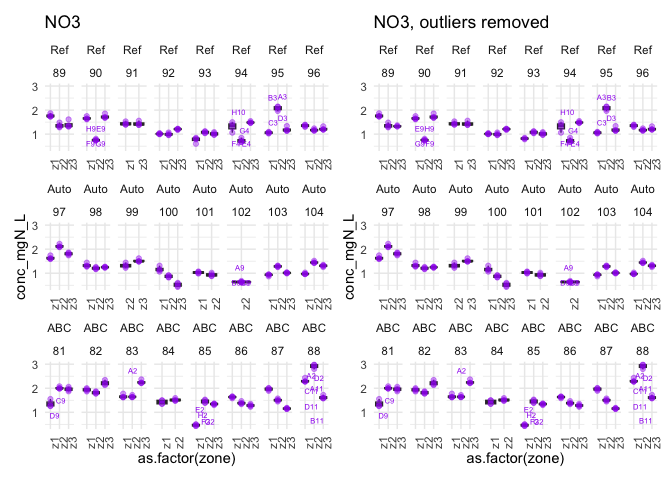

<details class="code-fold">
<summary>Code</summary>

``` r
ridges_no3_outlierfree <- Nmin_wash1 |> 
  filter(biol_unit_nb != 112, std_sp == "NO3") |>  # exclude sand and conv soil std
  plot_ridges_conc(y = "map",colour = "zone", groups = "map") + 
  facet_wrap(~soil, ncol = 3) + labs(title = "NO3, outliers removed")

ridges_no3 + ridges_no3_outlierfree + plot_layout(guides = "collect")
```

</details>

    Picking joint bandwidth of 0.0329

    Picking joint bandwidth of 0.0251

    Picking joint bandwidth of 0.0317

    Picking joint bandwidth of 0.0299

    Picking joint bandwidth of 0.0251

    Picking joint bandwidth of 0.0317


### 2.1.2 - NH4

Now same, for NH4.

<details class="code-fold">
<summary>Code</summary>

``` r
boxplot_nh4 <- Nmin_wash1 |> 
  filter(biol_unit_nb != 112, std_sp == "NH4") |> 
  boxplot_conc(x = "zone") + labs(title = "NH4") + 
  theme(axis.text.x = element_text(angle = 90)) +
  facet_wrap(soil~biol_unit_nb, nrow = 3, scales = "free_x")
  
ridges_nh4 <- Nmin_wash1 |> 
  filter(biol_unit_nb != 112, std_sp == "NH4") |>  # exclude sand and conv soil std
  plot_ridges_conc(y = "map",colour = "zone", groups = "map") + 
  facet_wrap(~soil, ncol = 3) + labs(title = "NH4")

#boxplot_nh4 + ridges_nh4
```

</details>

Here are those where I would remove

- 95_t2_z1: F11

- 92_t2_z2: D9

- 89_t2_z3: G11

- 99_t2_z3: E10

- 82_t2_z2: H9

<details class="code-fold">
<summary>Code</summary>

``` r
to_remove <- Nmin_wash1 |> 
  filter(std_sp == "NH4" & (
           (map == "95_t2_z1" & well_id == "F11") |
           (map == "92_t2_z2" & well_id == "D9") |
           (map == "89_t2_z3" & well_id == "G11") |
           (map == "99_t2_z3" & well_id == "E10") |
           (map == "82_t2_z2" & well_id == "H9")))

Nmin_wash2 <- Nmin_wash1 |> remove_wells(to_remove) 

boxplot_nh4_outlierfree <- Nmin_wash2 |> 
  filter(biol_unit_nb != 112, std_sp == "NH4") |> 
  boxplot_conc(x = "zone") + labs(title = "NH4, outliers removed") + 
  theme(axis.text.x = element_text(angle = 90)) +
  facet_wrap(soil~biol_unit_nb, nrow = 3, scales = "free_x")

ridges_nh4_outlierfree <- Nmin_wash2 |> 
  filter(biol_unit_nb != 112, std_sp == "NH4") |>  # exclude sand and conv soil std
  plot_ridges_conc(y = "map",colour = "zone", groups = "map") + 
  facet_wrap(~soil, ncol = 3) + labs(title = "NH4, outliers removed")

boxplot_nh4 + boxplot_nh4_outlierfree
```

</details>

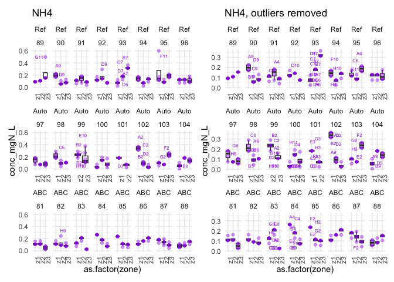

<details class="code-fold">
<summary>Code</summary>

``` r
ridges_nh4 + ridges_nh4_outlierfree + plot_layout(guides = "collect")
```

</details>

    Picking joint bandwidth of 0.023

    Picking joint bandwidth of 0.0332

    Picking joint bandwidth of 0.0271

    Picking joint bandwidth of 0.0264

    Picking joint bandwidth of 0.0313

    Picking joint bandwidth of 0.029

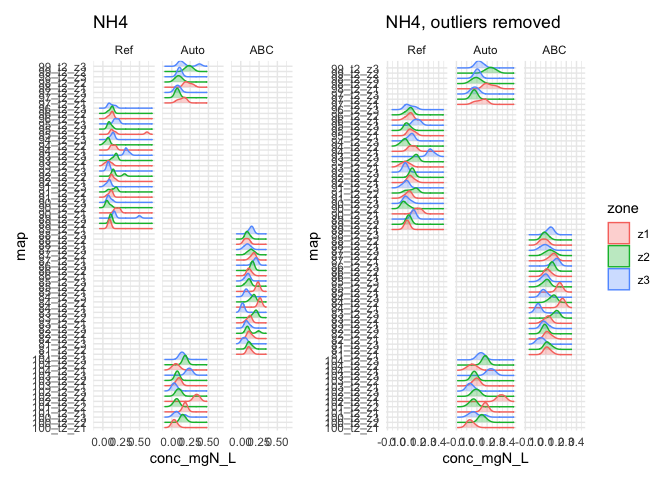

### 2.1.3 - NO2

Because NO2 readings are virtually zero, there is only little point in
removing outliers. Nevertheless, we can have a look at the data

Per sample

<details class="code-fold">
<summary>Code</summary>

``` r
boxplot_no2 <- Nmin_wash2 |> 
  filter(biol_unit_nb != 112, std_sp == "NO2") |> 
  boxplot_conc(x = "zone") + labs(title = "NO2") + 
  theme(axis.text.x = element_text(angle = 90)) +
  facet_wrap(soil~biol_unit_nb, nrow = 3, scales = "free_x")

ridges_no2 <- Nmin_wash2 |> 
  filter(biol_unit_nb != 112, std_sp == "NO2") |>  # exclude sand and conv soil std
  plot_ridges_conc(y = "map",colour = "zone", groups = "map") + 
  facet_wrap(~soil, ncol = 3) + labs(title = "NO2")

#boxplot_no2 + ridges_no2 + plot_layout(guides = "collect")
```

</details>

- 86_t2_z3: H4

<details class="code-fold">
<summary>Code</summary>

``` r
to_remove <- Nmin_wash2 |> 
  filter(std_sp == "NO2" & map == "86_t2_z3" & well_id == "H4")

Nmin_wash3 <- Nmin_wash2 |> remove_wells(to_remove)

boxplot_no2_2 <- Nmin_wash3 |> 
  filter(biol_unit_nb != 112, std_sp == "NO2") |> 
  boxplot_conc(x = "zone") + labs(title = "NO2, outliers removed") + 
  theme(axis.text.x = element_text(angle = 90)) +
  facet_wrap(soil~biol_unit_nb, nrow = 3, scales = "free_x")

ridges_no2_2 <- Nmin_wash3 |> 
  filter(biol_unit_nb != 112, std_sp == "NO2") |>  # exclude sand and conv soil std
  plot_ridges_conc(y = "map",colour = "zone", groups = "map") + 
  facet_wrap(~soil, ncol = 3) + labs(title = "NO2, outliers removed")

#boxplot_no2_2 + ridges_no2_2 + plot_layout(guides = "collect")

boxplot_no2 + boxplot_no2_2 
```

</details>

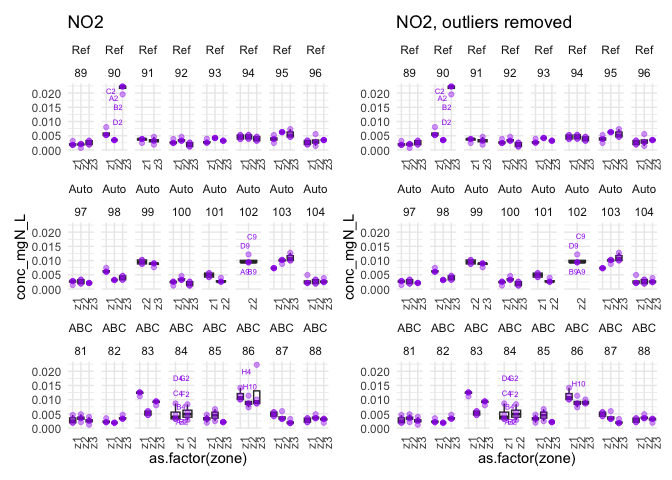

<details class="code-fold">
<summary>Code</summary>

``` r
ridges_no2 + ridges_no2_2 + plot_layout(guides = "collect")
```

</details>

    Picking joint bandwidth of 0.000921

    Picking joint bandwidth of 0.000743

    Picking joint bandwidth of 0.00066

    Picking joint bandwidth of 0.000921

    Picking joint bandwidth of 0.000743

    Picking joint bandwidth of 0.000578

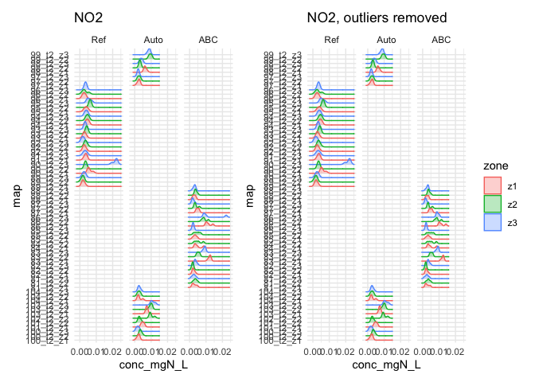

### 2.1.4 - Standard Soils

Here we look at all Nmin species in one go because there are a lot less
“samples” to look at

<details class="code-fold">
<summary>Code</summary>

``` r
boxplot_std <- Nmin_wash3 |> 
  filter(biol_unit_nb == 112) |> 
  boxplot_conc(x = "zone") + labs(title = "Standard Soil") +
  facet_wrap(~std_sp, nrow = 3, scales = "free_y")

ridges_std <- Nmin_wash3 |> 
  filter(biol_unit_nb == 112) |>  # exclude sand and conv soil std
  plot_ridges_conc(y = "map",colour = "zone", groups = "map") + 
  facet_wrap(~std_sp, ncol = 3, scales = "free_x") + labs(title = "Standard Soil")

boxplot_std + ridges_std
```

</details>

    Picking joint bandwidth of 0.0244

    Picking joint bandwidth of 0.00117

    Picking joint bandwidth of 0.0666

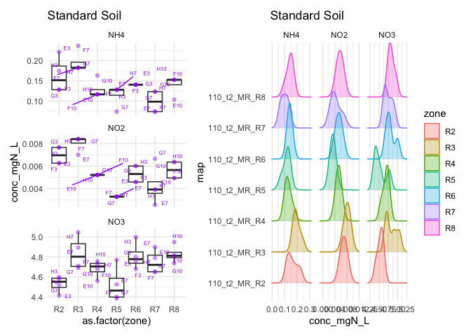

Nothing to modify!

### 2.1.5 - All outliers removed Nmin

Visually, I am satisfied with this outlier removal, so I save this
cleaned table

<details class="code-fold">
<summary>Code</summary>

``` r
Field_t2_Nmin_clean <- Nmin_wash3
```

</details>

## 2.3 - PMN

### 2.3.1 - NO3

<details class="code-fold">
<summary>Code</summary>

``` r
boxplot_pmn_no3 <- raw_field_PMN |> 
  filter(std_sp == "NO3") |> 
  boxplot_conc(x = "tech_rep") + labs(title = "NO3") +
  facet_wrap(soil~incubation_time, scales = "free_y", ncol = 5)  

ridges_pmn_no3 <- raw_field_PMN |> 
  filter(std_sp == "NO3") |> 
  plot_ridges_conc(groups = "soil", colour = "tech_rep", y = "map") + 
  facet_wrap(~incubation_time, nrow = 1) + labs(title = "NO3")

#boxplot_pmn_no3 + ridges_pmn_no3 
```

</details>

- Field_Ref_i3_rt2: E2

- Field_Ref_i2_rt4: B9

- Field_Auto_i2_rt2: A10

- Field_Auto_i2_rt1: A10

- Field_ABC_i3_rt3: E4

<details class="code-fold">
<summary>Code</summary>

``` r
to_remove <- raw_field_PMN |> 
  filter((std_sp == "NO3") & 
    ((map == "Field_Ref_i3_rt2" & well_id == "E2") | 
       (map == "Field_Ref_i2_rt4" & well_id == "B9") |
       (map == "Field_Auto_i2_rt2" & well_id == "A10") |
       (map == "Field_Auto_i2_rt1" & well_id == "A10") |
       (map == "Field_ABC_i3_rt3" & well_id == "E4")) 
  )

PMN_wash1 <- raw_field_PMN |> remove_wells(to_remove)

# check it out again
boxplot_pmn_no3_outlierfree <- PMN_wash1 |> 
  filter(std_sp == "NO3") |> 
  boxplot_conc(x = "tech_rep") + 
  labs(title = "NO3, outlier removed") +
  facet_wrap(soil~incubation_time, scales = "free_y", ncol = 5) 

ridges_pmn_no3_outlierfree <- PMN_wash1 |> 
  filter(std_sp == "NO3") |> 
  plot_ridges_conc(groups = "soil", colour = "tech_rep", y = "map") + 
  facet_wrap(~incubation_time, nrow = 1) + labs(title = "NO3, outlier removed")

#boxplot_pmn_no3_outlierfree + ridges_pmn_no3_outlierfree
```

</details>

Compare before/after

<details class="code-fold">
<summary>Code</summary>

``` r
boxplot_pmn_no3 + boxplot_pmn_no3_outlierfree 
```

</details>

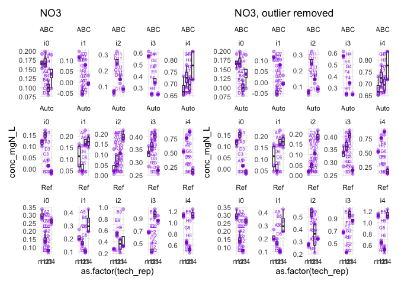

<details class="code-fold">
<summary>Code</summary>

``` r
ridges_pmn_no3 + ridges_pmn_no3_outlierfree + plot_layout(guides = "collect")
```

</details>

    Picking joint bandwidth of 0.00903

    Picking joint bandwidth of 0.0162

    Picking joint bandwidth of 0.0243

    Picking joint bandwidth of 0.0138

    Picking joint bandwidth of 0.0233

    Picking joint bandwidth of 0.00903

    Picking joint bandwidth of 0.0162

    Picking joint bandwidth of 0.015

    Picking joint bandwidth of 0.0106

    Picking joint bandwidth of 0.0233

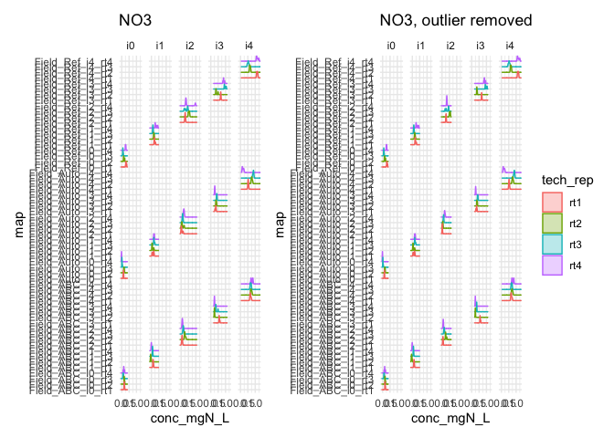

### 2.3.2 - NH4

<details class="code-fold">
<summary>Code</summary>

``` r
boxplot_pmn_nh4 <- PMN_wash1 |> 
  filter(std_sp == "NH4") |> 
  boxplot_conc(x = "tech_rep") + facet_wrap(soil~incubation_time, ncol = 5) + 
  labs(title = "NH4")

ridges_pmn_nh4 <- PMN_wash1 |> 
  filter(std_sp == "NH4") |> 
  plot_ridges_conc(groups = "soil", colour = "tech_rep", y = "map") + 
  facet_wrap(~incubation_time, nrow = 1) + labs(title = "NH4")


#boxplot_pmn_nh4 + ridges_pmn_nh4 
```

</details>

- Field_Auto_i0_rt3: B3

<details class="code-fold">
<summary>Code</summary>

``` r
to_remove <- PMN_wash1 |> filter(
  std_sp == "NH4"& map == "Field_Auto_i0_rt3" & well_id == "B3")

PMN_wash2 <- PMN_wash1 |> remove_wells(to_remove)

boxplot_pmn_nh4_outlierfree <- PMN_wash2 |> 
  filter(std_sp == "NH4") |> 
  boxplot_conc(x = "tech_rep") + facet_wrap(soil~incubation_time, ncol = 5) + 
  labs(title = "NH4, outliers removed")

ridges_pmn_nh4_outlierfree <- PMN_wash2 |> 
  filter(std_sp == "NH4") |> 
  plot_ridges_conc(groups = "soil", colour = "tech_rep", y = "map") + 
  facet_wrap(~incubation_time, nrow = 1) + labs(title = "NH4, outliers removed")


#boxplot_pmn_nh4_outlierfree + ridges_pmn_nh4_outlierfree
```

</details>

Compare before/after

<details class="code-fold">
<summary>Code</summary>

``` r
boxplot_pmn_nh4 + boxplot_pmn_nh4_outlierfree 
```

</details>

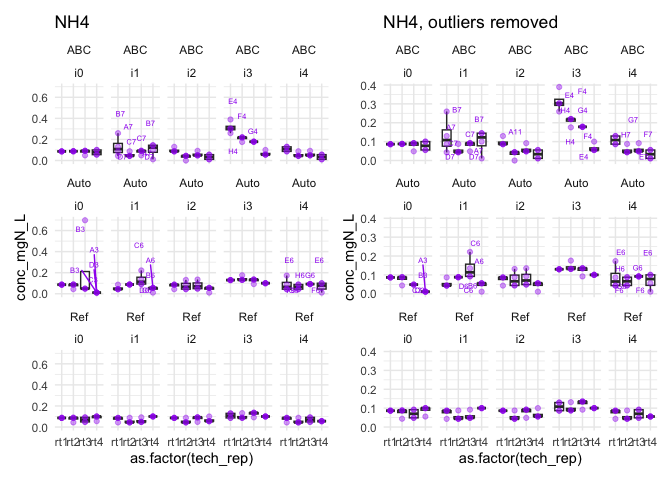

<details class="code-fold">
<summary>Code</summary>

``` r
ridges_pmn_nh4 + ridges_pmn_nh4_outlierfree + plot_layout(guides = "collect")
```

</details>

    Picking joint bandwidth of 0.032

    Picking joint bandwidth of 0.0232

    Picking joint bandwidth of 0.0147

    Picking joint bandwidth of 0.0345

    Picking joint bandwidth of 0.0211

    Picking joint bandwidth of 0.028

    Picking joint bandwidth of 0.0232

    Picking joint bandwidth of 0.0147

    Picking joint bandwidth of 0.0345

    Picking joint bandwidth of 0.0211

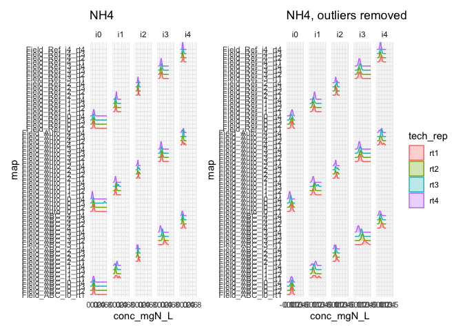

### 2.3.3 - NO2

<details class="code-fold">
<summary>Code</summary>

``` r
boxplot_pmn_no2 <- PMN_wash2 |> 
  filter(std_sp == "NO2") |> 
  boxplot_conc(x = "tech_rep") + facet_wrap(soil~incubation_time, ncol = 5) + 
  labs(title = "NO2")

ridges_pmn_no2 <- PMN_wash2 |> 
  filter(std_sp == "NO2") |> 
  plot_ridges_conc(groups = "soil", colour = "tech_rep", y = "map") + 
  facet_wrap(~incubation_time, nrow = 1) + labs(title = "NO2")


#boxplot_pmn_no2 + ridges_pmn_no2 
```

</details>

Possibly masking other outliers, so maybe a second round is needed

- Field_Auto_i0_rt2: A3

<details class="code-fold">
<summary>Code</summary>

``` r
to_remove <- PMN_wash2 |> filter(
  std_sp == "NO2" & map == "Field_Auto_i0_rt2" & well_id == "A3")

PMN_wash3 <- PMN_wash2 |> remove_wells(to_remove)
```

</details>

Run it once more

<details class="code-fold">
<summary>Code</summary>

``` r
boxplot_pmn_no2 <- PMN_wash3 |> 
  filter(std_sp == "NO2") |> 
  boxplot_conc(x = "tech_rep") + facet_wrap(soil~incubation_time, ncol = 5) + 
  labs(title = "NO2")

ridges_pmn_no2 <- PMN_wash3 |> 
  filter(std_sp == "NO2") |> 
  plot_ridges_conc(groups = "soil", colour = "tech_rep", y = "map") + 
  facet_wrap(~incubation_time, nrow = 1) + labs(title = "NO2")


#boxplot_pmn_no2 + ridges_pmn_no2 
```

</details>

- Field_Ref_i4_rt3: H5

- Field_Auto_i1_rt4: B6

<details class="code-fold">
<summary>Code</summary>

``` r
to_remove <- PMN_wash3 |> filter(
  (std_sp == "NO2") &
    ((map == "Field_Ref_i4_rt3" & well_id == "H5") |
    (map == "Field_Auto_i1_rt4" & well_id == "B6")))

PMN_wash4 <- PMN_wash3 |> remove_wells(to_remove)

boxplot_pmn_no2_outlierfree <- PMN_wash4 |> 
  filter(std_sp == "NO2") |> 
  boxplot_conc(x = "tech_rep") + facet_wrap(soil~incubation_time, ncol = 5) + 
  labs(title = "NO2, outliers removed")

ridges_pmn_no2_outlierfree <- PMN_wash4 |> 
  filter(std_sp == "NO2") |> 
  plot_ridges_conc(groups = "soil", colour = "tech_rep", y = "map") + 
  facet_wrap(~incubation_time, nrow = 1) + labs(title = "NO2, outliers removed")


#boxplot_pmn_no2_outlierfree + ridges_pmn_no2_outlierfree 
```

</details>

Compare before / after

<details class="code-fold">
<summary>Code</summary>

``` r
boxplot_pmn_no2 + boxplot_pmn_no2_outlierfree 
```

</details>

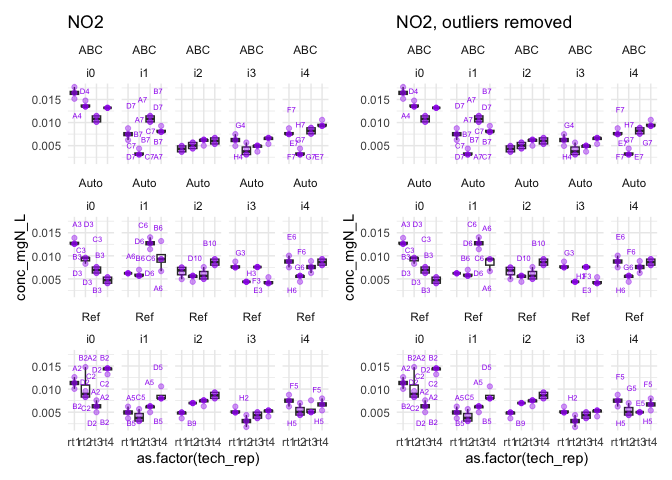

<details class="code-fold">
<summary>Code</summary>

``` r
ridges_pmn_no2 + ridges_pmn_no2_outlierfree + plot_layout(guides = "collect")
```

</details>

    Picking joint bandwidth of 0.00114

    Picking joint bandwidth of 0.000698

    Picking joint bandwidth of 8e-04

    Picking joint bandwidth of 0.000927

    Picking joint bandwidth of 0.000345

    Picking joint bandwidth of 0.00114

    Picking joint bandwidth of 0.000687

    Picking joint bandwidth of 8e-04

    Picking joint bandwidth of 0.000927

    Picking joint bandwidth of 0.000618

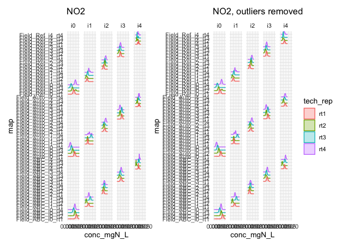

### 2.3.4 - All outliers removed PMN

Visually, I am satisfied with this outlier removal, so I save this
cleaned table

<details class="code-fold">
<summary>Code</summary>

``` r
field_t2_PMN_clean <- PMN_wash4
```

</details>

## 2.4 - TDN

Tiny correction to the dataframe to help readibility of graphs

<details class="code-fold">
<summary>Code</summary>

``` r
tdn_simpler <- field_TDN_clean |> 
  filter(dilution == "2x", std_sp == "NO3") |> 
  mutate(sample = paste0(biol_unit_nb, "_", zone))
```

</details>

### 2.4.1 - NO3

<details class="code-fold">
<summary>Code</summary>

``` r
boxplot_tdn_no3 <- tdn_simpler |> 
  filter(biol_unit_nb != 112) |> 
  boxplot_conc(x = "sample", colour = "zone") + labs(title = "NO3") + 
  theme(axis.text.x = element_text(angle = 90)) +
  facet_wrap(fumigation~soil, ncol = 3, scales = "free")

ridges_tdn_no3 <- tdn_simpler |> 
  filter(biol_unit_nb != 112) |> 
  plot_ridges_conc(y = "sample",colour = "zone", groups = "map") + 
  facet_wrap(fumigation~soil, ncol = 3, scales = "free") + labs(title = "NO3")

#boxplot_tdn_no3 + ridges_tdn_no3 + plot_layout(guides = "collect")
```

</details>

- 95_t2_z2_CFE.2x: D11,

- 100_t2_z1_CFE.2x: C5

- 83_t2_z2_CFE.2x: C10

- 82_t2_z3_CFE.2x: C5

- 96_t2_z3_NF.2x: C10

- 94_t2_z3_NF.2x: B4

- 90_t2_z3_NF.2x: D2

- 99_t2_z2_NF.2x: D2

- 86_t2_z3_NF.2x: B7

- 82_t2_z1_NF.2x: B4

<details class="code-fold">
<summary>Code</summary>

``` r
to_remove <- tdn_simpler |> 
  filter((std_sp == "NO3") &(
    (map == "95_t2_z2_CFE.2x" & well_id == "D11") | 
      (map == "100_t2_z1_CFE.2x" & well_id == "C5") | 
      (map == "83_t2_z2_CFE.2x" & well_id == "C10") | 
      (map == "82_t2_z3_CFE.2x" & well_id == "C5") | 
      (map == "96_t2_z3_NF.2x" & well_id == "C10") | 
      (map == "94_t2_z3_NF.2x" & well_id == "B4") | 
      (map == "90_t2_z3_NF.2x" & well_id == "D2") | 
      (map == "99_t2_z2_NF.2x" & well_id == "D2") | 
      (map == "86_t2_z3_NF.2x" & well_id == "B7") | 
      (map == "82_t2_z1_NF.2x" & well_id == "B4")))

TDN_wash1 <- tdn_simpler |> remove_wells(to_remove)

boxplot_tdn_no3_outlierfree <- TDN_wash1 |> 
  filter(biol_unit_nb != 112) |> 
  boxplot_conc(x = "sample", colour = "zone") + labs(title = "NO3, outliers removed") + 
  theme(axis.text.x = element_text(angle = 90)) +
  facet_wrap(fumigation~soil, ncol = 3, scales = "free")

ridges_tdn_no3_outlierfree <- TDN_wash1 |> 
  filter(biol_unit_nb != 112) |> 
  plot_ridges_conc(y = "sample",colour = "zone", groups = "map") + 
  facet_wrap(fumigation~soil, ncol = 3, scales = "free") + labs(title = "NO3, outliers removed")

boxplot_tdn_no3 + boxplot_tdn_no3_outlierfree + plot_layout(guides = "collect")
```

</details>


<details class="code-fold">
<summary>Code</summary>

``` r
ridges_tdn_no3 + ridges_tdn_no3_outlierfree + plot_layout(guides = "collect")
```

</details>

    Picking joint bandwidth of 0.0477

    Picking joint bandwidth of 0.0545

    Picking joint bandwidth of 0.0533

    Picking joint bandwidth of 0.0409

    Picking joint bandwidth of 0.0392

    Picking joint bandwidth of 0.0522

    Picking joint bandwidth of 0.0469

    Picking joint bandwidth of 0.0534

    Picking joint bandwidth of 0.0482

    Picking joint bandwidth of 0.0377

    Picking joint bandwidth of 0.0347

    Picking joint bandwidth of 0.0482

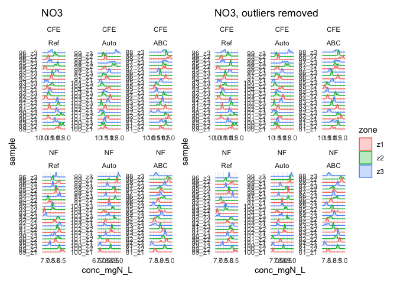

### 2.4.2 - NO2

We skip this for now as I don’t think that NO2 is relevant!

### 2.4.3 - Standard soil

<details class="code-fold">
<summary>Code</summary>

``` r
boxplot_tdn_std <- TDN_wash1 |> 
  filter(biol_unit_nb == 112) |> 
  boxplot_conc(x = "sample") + labs(title = "Standard soil") + 
  theme(axis.text.x = element_text(angle = 90)) +
  facet_wrap(~fumigation, scales = "free")

ridges_tdn_std <- TDN_wash1 |> 
  filter(biol_unit_nb == 112) |> 
  plot_ridges_conc(y = "sample",colour = "zone", groups = "map") + 
  facet_wrap(~fumigation, ncol = 3, scales = "free") + labs(title = "Standard soil")

boxplot_tdn_std + ridges_tdn_std + plot_layout(guides = "collect")
```

</details>

    Picking joint bandwidth of 0.0597

    Picking joint bandwidth of 0.0635

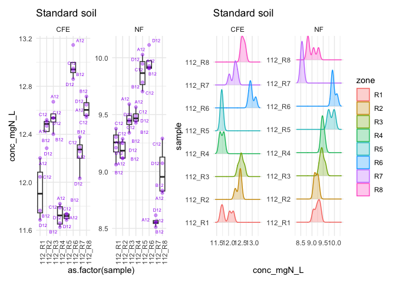

All good.

### 2.4.3 - All outliers removed TDN

Save the new data

<details class="code-fold">
<summary>Code</summary>

``` r
Field_t2_TDN_clean <- TDN_wash1
```

</details>

## 2.5 - PNR - TO DO

### 2.5.1 - NO3

### 2.5.2 - NO2

### 2.5.3 - All outliers removed PNR

# 3 - Per-sample mean

## 3.1 - Nmin

<details class="code-fold">
<summary>Code</summary>

``` r
conc_mean_Nmin <- Field_t2_Nmin_clean |> 
  select(map, plate_id, biol_unit_nb, zone, std_sp, conc_mgN_L) |> 
  group_by(plate_id, map, biol_unit_nb, zone, std_sp) |> 
  summarise(
    mean = mean(conc_mgN_L),
    st_dev = sd(conc_mgN_L)) |> 
  mutate(coef_var = 100*st_dev / mean) |> 
  rename(conc_mgN_L = mean) |> ungroup()
```

</details>

    `summarise()` has regrouped the output.
    ℹ Summaries were computed grouped by plate_id, map, biol_unit_nb, zone, and
      std_sp.
    ℹ Output is grouped by plate_id, map, biol_unit_nb, and zone.
    ℹ Use `summarise(.groups = "drop_last")` to silence this message.
    ℹ Use `summarise(.by = c(plate_id, map, biol_unit_nb, zone, std_sp))` for
      per-operation grouping (`?dplyr::dplyr_by`) instead.

<details class="code-fold">
<summary>Code</summary>

``` r
#biggest coef var quite high
conc_mean_Nmin |> arrange(desc(coef_var))
```

</details>

    # A tibble: 223 × 8
       plate_id  map       biol_unit_nb zone  std_sp conc_mgN_L  st_dev coef_var
       <chr>     <chr>            <dbl> <chr> <chr>       <dbl>   <dbl>    <dbl>
     1 NH4_2F6_2 104_t2_z1          104 z1    NH4       0.0549  0.0399      72.6
     2 NH4_2F4_1 100_t2_z3          100 z3    NH4       0.0863  0.0620      71.9
     3 NH4_2F4_1 100_t2_z1          100 z1    NH4       0.0370  0.0246      66.7
     4 NH4_2F4_1 102_t2_z3          102 z3    NH4       0.0370  0.0246      66.7
     5 NH4_2F4_1 81_t2_z3            81 z3    NH4       0.0493  0.0285      57.7
     6 NO2_2F2_1 96_t2_z2            96 z2    NO2       0.00314 0.00176     55.9
     7 NH4_2F4_1 93_t2_z1            93 z1    NH4       0.0739  0.0402      54.4
     8 NO2_2F1_1 84_t2_z1            84 z1    NO2       0.00493 0.00258     52.2
     9 NO2_2F6_2 104_t2_z1          104 z1    NO2       0.00282 0.00141     50  
    10 NO2_2F2_1 84_t2_z2            84 z2    NO2       0.00524 0.00239     45.5
    # ℹ 213 more rows

<details class="code-fold">
<summary>Code</summary>

``` r
# but not too bad when look only at NO3
conc_mean_Nmin |> arrange(desc(std_sp), desc(coef_var))
```

</details>

    # A tibble: 223 × 8
       plate_id  map       biol_unit_nb zone  std_sp conc_mgN_L st_dev coef_var
       <chr>     <chr>            <dbl> <chr> <chr>       <dbl>  <dbl>    <dbl>
     1 NO3_2F4_1 100_t2_z3          100 z3    NO3         0.518 0.0795    15.4 
     2 NO3_2F2_2 94_t2_z1            94 z1    NO3         1.31  0.187     14.3 
     3 NO3_2F4_1 94_t2_z2            94 z2    NO3         0.735 0.0805    11.0 
     4 NO3_2F4_2 81_t2_z1            81 z1    NO3         1.37  0.136      9.95
     5 NO3_2F4_1 100_t2_z1          100 z1    NO3         1.17  0.106      9.06
     6 NO3_2F1_1 95_t2_z3            95 z3    NO3         1.20  0.0958     8.01
     7 NO3_2F3_1 85_t2_z1            85 z1    NO3         0.464 0.0365     7.87
     8 NO3_2F3_1 99_t2_z2            99 z2    NO3         1.32  0.0907     6.87
     9 NO3_2F4_1 101_t2_z2          101 z2    NO3         0.937 0.0638     6.81
    10 NO3_2F3_2 89_t2_z2            89 z2    NO3         1.36  0.0877     6.46
    # ℹ 213 more rows

<details class="code-fold">
<summary>Code</summary>

``` r
conc_mean_Nmin |> filter(coef_var > 10) |> 
  ggplot(aes(x = coef_var)) + geom_histogram() + facet_wrap(~std_sp, ncol = 1)
```

</details>

    `stat_bin()` using `bins = 30`. Pick better value `binwidth`.


We still have quite a few samples with a high between-wells coefficient
of variation, but mostly with NO2 and NH4 (very low values). With only 3
to 4 wells and sometimes very low values, this is unavoidable, so we
move on

Now, finally, we re-join this mean value to the rest of the relevant
information from the absorbance dataset

<details class="code-fold">
<summary>Code</summary>

``` r
conc_Nmin_export_ready <- conc_mean_Nmin |> 
  select(!st_dev:coef_var) |> 
  inner_join(
    raw_field_t2_Nmin |> 
      select(!c(well_id:abs_corrected, starts_with("conc"), slope:lm_p, target_sp)) |> 
      unique())
```

</details>

    Joining with `by = join_by(plate_id, map, biol_unit_nb, zone, std_sp)`

## 3.2 - PMN

<details class="code-fold">
<summary>Code</summary>

``` r
conc_mean_PMN <- field_t2_PMN_clean |> 
  select(map, plate_id, biol_unit_nb, std_sp, conc_mgN_L) |> 
  group_by(map, biol_unit_nb, std_sp) |> 
  summarise(
    mean = mean(conc_mgN_L),
    st_dev = sd(conc_mgN_L)) |> 
  mutate(
    coef_var = 100*st_dev / mean,
    soil = str_extract(biol_unit_nb, "_(\\w*)", group = 1)) |> 
  rename(conc_mgN_L = mean)
```

</details>

    `summarise()` has regrouped the output.
    ℹ Summaries were computed grouped by map, biol_unit_nb, and std_sp.
    ℹ Output is grouped by map and biol_unit_nb.
    ℹ Use `summarise(.groups = "drop_last")` to silence this message.
    ℹ Use `summarise(.by = c(map, biol_unit_nb, std_sp))` for per-operation
      grouping (`?dplyr::dplyr_by`) instead.

<details class="code-fold">
<summary>Code</summary>

``` r
conc_mean_PMN |> arrange(desc(std_sp), desc(coef_var))
```

</details>

    # A tibble: 180 × 7
    # Groups:   map, biol_unit_nb [60]
       map               biol_unit_nb std_sp conc_mgN_L  st_dev coef_var soil 
       <chr>             <chr>        <chr>       <dbl>   <dbl>    <dbl> <chr>
     1 Field_ABC_i1_rt4  Field_ABC    NO3       0.00165 0.0198    1200   ABC  
     2 Field_Auto_i1_rt2 Field_Auto   NO3       0.0742  0.0566      76.2 Auto 
     3 Field_Auto_i0_rt3 Field_Auto   NO3       0.0199  0.0133      66.7 Auto 
     4 Field_Auto_i1_rt1 Field_Auto   NO3       0.110   0.0582      52.8 Auto 
     5 Field_Auto_i2_rt2 Field_Auto   NO3       0.0461  0.0206      44.7 Auto 
     6 Field_Auto_i2_rt1 Field_Auto   NO3       0.0170  0.00759     44.7 Auto 
     7 Field_Ref_i2_rt3  Field_Ref    NO3       0.348   0.116       33.3 Ref  
     8 Field_Auto_i4_rt4 Field_Auto   NO3       0.167   0.0521      31.3 Auto 
     9 Field_ABC_i0_rt4  Field_ABC    NO3       0.140   0.0379      27.0 ABC  
    10 Field_Ref_i1_rt4  Field_Ref    NO3       0.318   0.0816      25.6 Ref  
    # ℹ 170 more rows

<details class="code-fold">
<summary>Code</summary>

``` r
field_t2_PMN_clean |> filter(map == "Field_ABC_i1_rt4", std_sp == "NO3")
```

</details>

    # A tibble: 4 × 19
      dataset plate_id expe  soil  incubation_time tech_rep map        sampling_time
      <chr>   <chr>    <chr> <chr> <chr>           <chr>    <chr>      <chr>        
    1 PMN     NO3_PF4  Field ABC   i1              rt4      Field_ABC… t0           
    2 PMN     NO3_PF4  Field ABC   i1              rt4      Field_ABC… t0           
    3 PMN     NO3_PF4  Field ABC   i1              rt4      Field_ABC… t0           
    4 PMN     NO3_PF4  Field ABC   i1              rt4      Field_ABC… t0           
    # ℹ 11 more variables: biol_unit_nb <chr>, well_id <chr>, abs_corrected <dbl>,
    #   std_sp <chr>, target_sp <chr>, std_unit <chr>, slope <dbl>,
    #   adj_r_squared <dbl>, lm_p <dbl>, conc_mgNsp_L <dbl>, conc_mgN_L <dbl>

<details class="code-fold">
<summary>Code</summary>

``` r
conc_mean_PMN |> filter(coef_var > 10) |> 
  ggplot(aes(x = coef_var)) + geom_histogram() + xlim(0,100)
```

</details>

    `stat_bin()` using `bins = 30`. Pick better value `binwidth`.

    Warning: Removed 1 row containing non-finite outside the scale range
    (`stat_bin()`).

    Warning: Removed 2 rows containing missing values or values outside the scale range
    (`geom_bar()`).


Same here, there are still quite a few samples with a high coefficient
of variation, but with only 3 to 4 wells and sometimes very low values,
this is unavoidable, so we move on

Now, we can add the data on wc to get a full dataset

<details class="code-fold">
<summary>Code</summary>

``` r
conc_PMN_export_ready <- conc_mean_PMN |> 
  # get dm and wc
  left_join(pmn_wc) |> 
  # get important categorical variables
  left_join(
    field_t2_PMN_clean |> 
      select(map, dataset, expe, incubation_time, tech_rep, sampling_time) |> 
      unique())
```

</details>

    Joining with `by = join_by(soil)`
    Joining with `by = join_by(map)`

## 3.3 - TDN

<details class="code-fold">
<summary>Code</summary>

``` r
conc_mean_TDN <- Field_t2_TDN_clean |> 
  select(map, biol_unit_nb, std_sp, conc_mgN_L, fumigation) |> 
  group_by(std_sp, fumigation, biol_unit_nb, map) |> 
  summarise(
    mean = mean(conc_mgN_L),
    st_dev = sd(conc_mgN_L)) |> 
  mutate(
    coef_var = 100*st_dev / mean) |> 
  rename(conc_mgN_L = mean)
```

</details>

    `summarise()` has regrouped the output.
    ℹ Summaries were computed grouped by std_sp, fumigation, biol_unit_nb, and map.
    ℹ Output is grouped by std_sp, fumigation, and biol_unit_nb.
    ℹ Use `summarise(.groups = "drop_last")` to silence this message.
    ℹ Use `summarise(.by = c(std_sp, fumigation, biol_unit_nb, map))` for
      per-operation grouping (`?dplyr::dplyr_by`) instead.

<details class="code-fold">
<summary>Code</summary>

``` r
conc_mean_TDN |> arrange(desc(std_sp), desc(coef_var))
```

</details>

    # A tibble: 160 × 7
    # Groups:   std_sp, fumigation, biol_unit_nb [50]
       std_sp fumigation biol_unit_nb map                 conc_mgN_L st_dev coef_var
       <chr>  <chr>             <dbl> <chr>                    <dbl>  <dbl>    <dbl>
     1 NO3    NF                   85 85_t2_z1_NF.2x            8.20  0.232     2.83
     2 NO3    NF                  112 Field_t2_Std_R8_NF…       9.00  0.225     2.50
     3 NO3    CFE                 112 Field_t2_Std_R1_CF…      11.9   0.241     2.02
     4 NO3    NF                  104 104_t2_z1_NF.2x           7.34  0.145     1.98
     5 NO3    NF                   83 83_t2_z3_NF.2x            7.57  0.147     1.93
     6 NO3    CFE                  90 90_t2_z2_CFE.2x          11.7   0.219     1.87
     7 NO3    NF                   94 94_t2_z1_NF.2x            7.45  0.138     1.85
     8 NO3    NF                   86 86_t2_z2_NF.2x            8.36  0.149     1.78
     9 NO3    NF                   84 84_t2_z2_NF.2x            7.83  0.138     1.76
    10 NO3    CFE                  98 98_t2_z3_CFE.2x          11.5   0.201     1.74
    # ℹ 150 more rows

<details class="code-fold">
<summary>Code</summary>

``` r
conc_mean_TDN |> arrange(desc(coef_var))
```

</details>

    # A tibble: 160 × 7
    # Groups:   std_sp, fumigation, biol_unit_nb [50]
       std_sp fumigation biol_unit_nb map                 conc_mgN_L st_dev coef_var
       <chr>  <chr>             <dbl> <chr>                    <dbl>  <dbl>    <dbl>
     1 NO3    NF                   85 85_t2_z1_NF.2x            8.20  0.232     2.83
     2 NO3    NF                  112 Field_t2_Std_R8_NF…       9.00  0.225     2.50
     3 NO3    CFE                 112 Field_t2_Std_R1_CF…      11.9   0.241     2.02
     4 NO3    NF                  104 104_t2_z1_NF.2x           7.34  0.145     1.98
     5 NO3    NF                   83 83_t2_z3_NF.2x            7.57  0.147     1.93
     6 NO3    CFE                  90 90_t2_z2_CFE.2x          11.7   0.219     1.87
     7 NO3    NF                   94 94_t2_z1_NF.2x            7.45  0.138     1.85
     8 NO3    NF                   86 86_t2_z2_NF.2x            8.36  0.149     1.78
     9 NO3    NF                   84 84_t2_z2_NF.2x            7.83  0.138     1.76
    10 NO3    CFE                  98 98_t2_z3_CFE.2x          11.5   0.201     1.74
    # ℹ 150 more rows

<details class="code-fold">
<summary>Code</summary>

``` r
conc_mean_TDN |> 
  ggplot(aes(x = coef_var)) + geom_histogram() 
```

</details>

    `stat_bin()` using `bins = 30`. Pick better value `binwidth`.

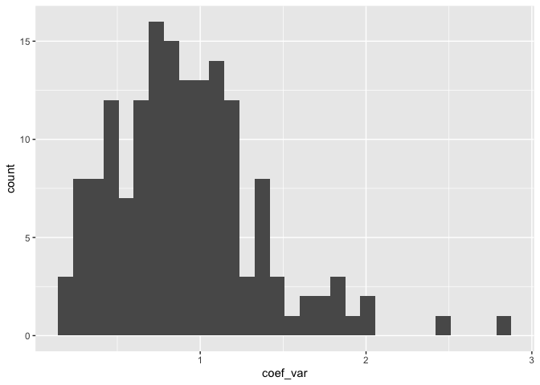

For once, it’s looking pretty good!

<details class="code-fold">
<summary>Code</summary>

``` r
conc_TDN_export_ready <- conc_mean_TDN |> 
  # get relevant categorical data
  left_join(
    Field_t2_TDN_clean |> 
      select(map, dataset, sampling_time, zone, fumigation, dilution) |> 
      unique())
```

</details>

    Joining with `by = join_by(fumigation, map)`

## 3.4 - PNR

# 4 - Export

<details class="code-fold">
<summary>Code</summary>

``` r
raw_field_t2_lab |> write_rds("output/data/3_field_t2_raw_lab.rds")
conc_Nmin_export_ready |> write_rds("output/data/3_field_t2_Nmin_clean.rds")
conc_PMN_export_ready |> write_rds("output/data/3_field_PMN_clean.rds")
conc_TDN_export_ready |> write_rds("output/data/3_field_TDN_clean.rds")
yield_tidy |> write_rds("output/data/3_field_yield_clean.rds")
```

</details>
