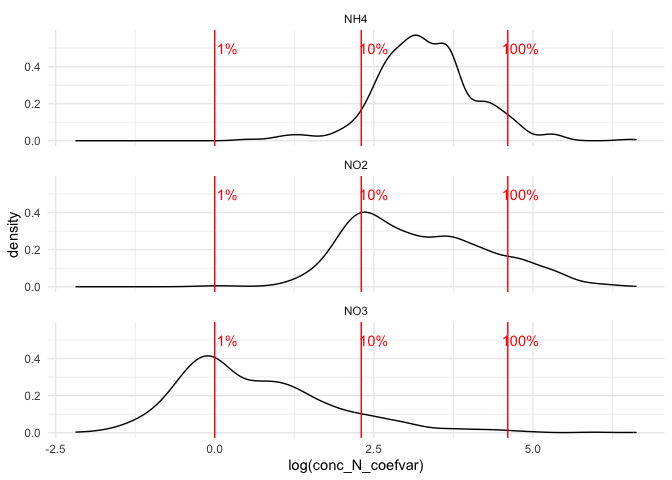
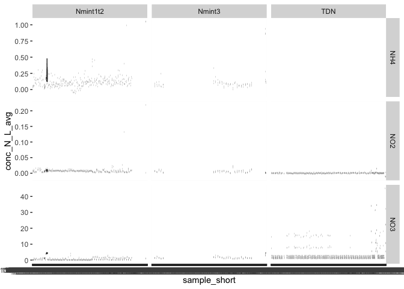
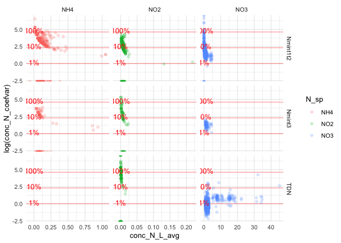

# III. Data Tidying


- [1 - Set up](#1---set-up)
  - [1.1 - Load packages and
    functions](#11---load-packages-and-functions)
  - [1.2 - Import data](#12---import-data)
  - [1.3 - Retrieve dataset information into absorbance
    dataframe](#13---retrieve-dataset-information-into-absorbance-dataframe)
- [2 - Compute new variables on per-sample
  basis](#2---compute-new-variables-on-per-sample-basis)
  - [2.1 - Means of concentrations (across 4
    wells)](#21---means-of-concentrations-across-4-wells)
- [3 - Greenhouse, t2](#3---greenhouse-t2)
  - [3.1 - Extract subsets of data](#31---extract-subsets-of-data)
    - [3.1.1 - Lab data (non absorbance
      data)](#311---lab-data-non-absorbance-data)
    - [3.1.2 - Absorbance data](#312---absorbance-data)
  - [3.2 - Re-format tables](#32---re-format-tables)
    - [TDN](#tdn-1)
    - [3.2.1 - TDN: extract fumigation and dilution information in new
      variables](#321---tdn-extract-fumigation-and-dilution-information-in-new-variables)
  - [3.3 - Join tables for each data
    set](#33---join-tables-for-each-data-set)
    - [3.3.1 - Option: re-append several datasets in
      one](#331---option-re-append-several-datasets-in-one)
    - [3.3.2 - Join absorbance data](#332---join-absorbance-data)
    - [3.3.3 - Join lab data and absorbance
      data](#333---join-lab-data-and-absorbance-data)
  - [3.4 - Export](#34---export)

In this script we tidy data sets into the shape that we need for data
transformation and following analysis and visualization

# 1 - Set up

## 1.1 - Load packages and functions

<details class="code-fold">
<summary>Code</summary>

``` r
rm(list = ls())

library(tidyverse)
```

</details>

    ── Attaching core tidyverse packages ──────────────────────── tidyverse 2.0.0 ──
    ✔ dplyr     1.1.4     ✔ readr     2.1.5
    ✔ forcats   1.0.1     ✔ stringr   1.6.0
    ✔ ggplot2   4.0.0     ✔ tibble    3.3.0
    ✔ lubridate 1.9.4     ✔ tidyr     1.3.1
    ✔ purrr     1.2.0     
    ── Conflicts ────────────────────────────────────────── tidyverse_conflicts() ──
    ✖ dplyr::filter() masks stats::filter()
    ✖ dplyr::lag()    masks stats::lag()
    ℹ Use the conflicted package (<http://conflicted.r-lib.org/>) to force all conflicts to become errors

<details class="code-fold">
<summary>Code</summary>

``` r
library(janitor)
```

</details>


    Attaching package: 'janitor'

    The following objects are masked from 'package:stats':

        chisq.test, fisher.test

## 1.2 - Import data

<details class="code-fold">
<summary>Code</summary>

``` r
#lm_output <- read_rds("output/data/Nmin_std_curves_lm.rds")

# import absorbance data + initiate an empty column for data set
N_data <- read_rds("output/data/Nmin_conc.rds") |> 
  # add any column to be taken from metadata
  mutate(
    dataset = NA,
    sampling_time = NA) |> 
  rename(sample_short = plate_map)

N_metadata <- read_rds("output/data/N_all_metadata.rds")

# import other "wet lab" raw data
lab_data <- read_rds("output/data/2_lab_data.rds") 
```

</details>

## 1.3 - Retrieve dataset information into absorbance dataframe

<details class="code-fold">
<summary>Code</summary>

``` r
for (i in 1:nrow(N_data)) {
  plate <- N_data$plate_id[i]
  line <- N_metadata |> filter(plate_id == plate)
  
  N_data$dataset[i] <- line$dataset[1]
  N_data$sampling_time[i] <- line$sampling_time[1]
    
}

#check that works:
N_data$dataset |> unique()
```

</details>

    [1] "Nmint1t2" "Nmint3"   "TDN"     

<details class="code-fold">
<summary>Code</summary>

``` r
N_data$sampling_time |> unique()
```

</details>

    [1] "t1" "t2" "t3"

# 2 - Compute new variables on per-sample basis

This is the place to compute new variables that will be needed for
several downstream analyses

## 2.1 - Means of concentrations (across 4 wells)

First, it makes no sense to compute new variables based on all 4 wells
of the plate attributed to a single sample (e.g., rep tech 1 of
non-fumigated does not related to rep tech 1 of fumigated). So we start
by computing the mean of each concentration of N species on a per sample
/ per plate basis.

<details class="code-fold">
<summary>Code</summary>

``` r
conc_columns <- N_data |> 
  select(starts_with("conc")) |> 
  names()

N_data_avg <- N_data |> 
  rowwise() |> 
  mutate(
    conc_N_L_avg = mean(c_across(conc_columns)),
    conc_N_L_stdev = sd(c_across(conc_columns)),
    conc_N_coefvar = 100 * conc_N_L_stdev / conc_N_L_avg
  ) |> 
  arrange(desc(conc_N_coefvar))
```

</details>

    Warning: There was 1 warning in `mutate()`.
    ℹ In argument: `conc_N_L_avg = mean(c_across(conc_columns))`.
    ℹ In row 1.
    Caused by warning:
    ! Using an external vector in selections was deprecated in tidyselect 1.1.0.
    ℹ Please use `all_of()` or `any_of()` instead.
      # Was:
      data %>% select(conc_columns)

      # Now:
      data %>% select(all_of(conc_columns))

    See <https://tidyselect.r-lib.org/reference/faq-external-vector.html>.

Then, we have a look. Actually, datasets are a bit too diverse, so it
would be probably best to look at them separately. But for now, general
observation:

- for NO3: the vast majority of samples present coefficient of variation
  below 10%, acceptable.

- In general: extreme coefficient of variation occur not so much from
  high stdev but from very low averages. This is extreme for NO2 and
  NH4, which score at virtually zero for most samples

The question then remains: how to spot and remove outliers? This is
maybe something to do on a per data set basis.

<details class="code-fold">
<summary>Code</summary>

``` r
N_data_avg |> 
  ggplot(aes(x = log(conc_N_coefvar))) +
  theme_minimal() +
  #geom_histogram() +
  geom_density() +
  geom_vline(xintercept = log(c(1,10,100)), colour = "red") +
  annotate(geom = "text", x = log(1) + 0.2, y = 0.5, colour = "red", label = "1%") +
  annotate(geom = "text", x = log(10) + 0.2, y = 0.5, colour = "red", label = "10%") +
  annotate(geom = "text", x = log(100) + 0.2, y = 0.5, colour = "red", label = "100%") +
  facet_wrap(~N_sp, nrow = 3) 
```

</details>

    Warning in log(conc_N_coefvar): NaNs produced

    Warning: Removed 413 rows containing non-finite outside the scale range
    (`stat_density()`).



<details class="code-fold">
<summary>Code</summary>

``` r
N_data_avg |> 
  ggplot(aes(x = sample_short, y = conc_N_L_avg)) +
  geom_boxplot() +
 # ylim(c(-3,))
  facet_grid(N_sp~dataset, scales = "free_y")
```

</details>



<details class="code-fold">
<summary>Code</summary>

``` r
N_data_avg |> 
  ggplot(aes(x = conc_N_L_avg, y = log(conc_N_coefvar), colour = N_sp)) +
  theme_minimal() +
  geom_hline(yintercept = log(c(1,10,100)), colour = "red", alpha = 0.4) +
  geom_point(alpha = 0.2) +
  annotate(geom = "text", y = log(1) + 0.2, x = 0, colour = "red", label = "1%") +
  annotate(geom = "text", y = log(10) + 0.2, x = 0, colour = "red", label = "10%") +
  annotate(geom = "text", y = log(100) + 0.2, x = 0, colour = "red", label = "100%") +
  facet_grid(dataset~N_sp, scales = "free_x")
```

</details>

    Warning in log(conc_N_coefvar): NaNs produced

    Warning: Removed 172 rows containing missing values or values outside the scale range
    (`geom_point()`).



# 3 - Greenhouse, t2

We first focus on data from the greenhouse trial at t2. It follows a
complete randomized block design, with modalities: 4 soils x 3 crop
stands x 5 blocs

## 3.1 - Extract subsets of data

The N_data does not contain explicitly the info on experiment
(greenhouse vs field), although it is contained in most plate names (but
not for TDN). So we start by subsetting t2 and single datasets,
filtering for the greenhouse will be possible when all data is joined in
one data frame.

### 3.1.1 - Lab data (non absorbance data)

First, raw data (lab_data): this will apply to all datasets. We subset
based on t2 and pot experiment, then clean a little but:

- exclude bare soil (only for t2!)

- exclude soil and sand standards for now (select only experimental
  soils)

- correct sample number

- remove clutter (amf and root data)

<details class="code-fold">
<summary>Code</summary>

``` r
# raw data
lab_data_t2_pot <- lab_data |> 
  # keep only t2 and pot, remove bare soil
  filter(sampling_time == "t2", expe == "Pot", cs != "B") |> 
  # tidy: 
  # For now, only actual samples (no std soil with weird number)
  filter(soil %in% c("Conv", "Ref", "Auto", "ABC")) |> 
  # sample number was made unique, not practical here
  mutate(
    sample_short = paste0(biol_unit_nb - 200, "_", sampling_time)
  ) |> 
  select(!starts_with(c("amf", "rt")))
```

</details>

### 3.1.2 - Absorbance data

#### Nmin

<details class="code-fold">
<summary>Code</summary>

``` r
# Nmin: plate data
Nmin_plate_data <- N_data_avg |> 
  filter(dataset == "Nmint1t2", sampling_time == "t2")

# Nmin: metadata
Nmin_metadata <- N_metadata |> 
  filter(dataset == "Nmint1t2", sampling_time == "t2")
```

</details>

#### TDN

<details class="code-fold">
<summary>Code</summary>

``` r
# For TDN and MBN: plate data
TDN_plate_data <- N_data_avg |> 
  filter(dataset == "TDN", sampling_time == "t2")
# For TDN and MBN: metadata
TDN_metadata <- N_metadata |> 
  filter(dataset == "TDN", sampling_time == "t2")
```

</details>

## 3.2 - Re-format tables

We want to have only one row per sample per N_sp.

### TDN

For TDN, we need to pivot wider NF and CFE. At the moment, measurements
for NF and CFE for a single sample constitute separate rows. The same
goes for 1x and 2x dilutions. Because the analytical replicates (wells)
of NF, CFE, and different dilutions do not relate to each other, it
makes no sense to compute any downstream variable from each replicate.
Therefore, from this pivot on, we do not include the replicates, only
the average value.

<u>**–\> If there is additional QC to be done (exclusion of outlier
wells), this should be done earlier in the pipeline)**</u>

### 3.2.1 - TDN: extract fumigation and dilution information in new variables

first, extract dilution and NF/CFE info in separate column

<details class="code-fold">
<summary>Code</summary>

``` r
TDN_plate_data_clean <- TDN_plate_data |> 
  #** Separate info on dilution and fumigation and clean sample names *
  mutate(
    fumigation = str_extract(sample_short, "NF|CFE"),
    dilution = str_extract(sample_short, "1x|2x"),
    sample_short = str_replace(sample_short, "_NF.1x|_CFE.1x|_NF.2x|_CFE.2x", "")
  ) |> 
  # some samples do not have the info on fumigation: they are the glycine etc. tests on TDN --> to be studied separately
  filter(!is.na(fumigation)) 
```

</details>

Then, we pivot the table

<details class="code-fold">
<summary>Code</summary>

``` r
# then pivot table

TDN_plate_data_wider <- TDN_plate_data_clean |> ungroup() |> 
  pivot_wider(
    names_from = c(fumigation, dilution),
    values_from = contains("avg"), 
    names_prefix = "conc.N.L.avg_",
    names_sort = TRUE,
    names_sep = "_",
    id_cols = c(sample_short, dataset, sampling_time, N_sp)
   # values_fn = mean
  ) |> arrange(sample_short) 

TDN_plate_data_wider
```

</details>

    # A tibble: 354 × 8
       sample_short dataset sampling_time N_sp  conc.N.L.avg_CFE_1x
       <chr>        <chr>   <chr>         <chr>               <dbl>
     1 100_t2_z1    TDN     t2            NO2             -0.000591
     2 100_t2_z1    TDN     t2            NO3              2.77    
     3 100_t2_z2    TDN     t2            NO2              0.000560
     4 100_t2_z2    TDN     t2            NO3              2.61    
     5 100_t2_z3    TDN     t2            NO3              2.68    
     6 100_t2_z3    TDN     t2            NO2             -0.000591
     7 101_t2_z1    TDN     t2            NO2              0.000836
     8 101_t2_z1    TDN     t2            NO3              2.65    
     9 101_t2_z2    TDN     t2            NO3              2.71    
    10 101_t2_z2    TDN     t2            NO2             -0.00118 
    # ℹ 344 more rows
    # ℹ 3 more variables: conc.N.L.avg_CFE_2x <dbl>, conc.N.L.avg_NF_1x <dbl>,
    #   conc.N.L.avg_NF_2x <dbl>

<details class="code-fold">
<summary>Code</summary>

``` r
# version to pivot on all analytical replicates
# TDN_plate_data_clean |> ungroup() |> 
#   pivot_wider(
#     names_from = c(N_sp, fumigation, dilution),
#     values_from = starts_with("conc"),   
#     names_sort = TRUE,
#     names_vary = "slowest", 
#     names_sep = ".",
#     id_cols = sample_short:sampling_time
#    # values_fn = mean
#   ) |> arrange(sample_short) |> view()
```

</details>

Nmin is already in the desired format of one row per sample per N sp.
But here, we just reduce and rename columns to have the same format as
the TDN table (only required information). For the sake of coherent
variable names, we call the new table “Nmin_plate_data_wider”, although
there is no pivotting involved.

<details class="code-fold">
<summary>Code</summary>

``` r
Nmin_plate_data_wider <- Nmin_plate_data |> 
  select(sample_short, dataset, sampling_time, N_sp, conc_N_L_avg) |> 
  rename(conc.N.L.avg_Nmin = conc_N_L_avg)
Nmin_plate_data_wider
```

</details>

    # A tibble: 533 × 5
    # Rowwise: 
       sample_short dataset  sampling_time N_sp  conc.N.L.avg_Nmin
       <chr>        <chr>    <chr>         <chr>             <dbl>
     1 78_t2        Nmint1t2 t2            NO3             0      
     2 59_t2        Nmint1t2 t2            NO3             0      
     3 54_t2        Nmint1t2 t2            NO3             0.00370
     4 109_t2_MR_R1 Nmint1t2 t2            NH4             0.0109 
     5 77_t2        Nmint1t2 t2            NO3             0.0192 
     6 75_t2        Nmint1t2 t2            NO3             0.0111 
     7 75_t2        Nmint1t2 t2            NH4             0.196  
     8 109_t2_MR_R6 Nmint1t2 t2            NH4             0.0217 
     9 109_t2_MR_R5 Nmint1t2 t2            NH4             0.0217 
    10 66_t2        Nmint1t2 t2            NH4             0.0544 
    # ℹ 523 more rows

<details class="code-fold">
<summary>Code</summary>

``` r
### version with Nmin stored in NF_1x
# Nmin_plate_data_wider <- Nmin_plate_data |> 
#   select(sample_short, dataset, sampling_time, N_sp, conc_N_L_avg) |> 
#   rename(conc.N.L.avg_NF_1x = conc_N_L_avg) |> 
#   mutate(
#     conc.N.L.avg_CFE_1x = NA,
#     conc.N.L.avg_CFE_2x = NA, 
#     conc.N.L.avg_NF_2x = NA
#   ) |> 
#   relocate(conc.N.L.avg_NF_1x, .before = conc.N.L.avg_NF_2x)
```

</details>

## 3.3 - Join tables for each data set

### 3.3.1 - Option: re-append several datasets in one

First, metadata.

<u>**–\> At this stage, we have lost the info on plate_id. This means
that we cannot re-link samples to plate. Indeed, one sample will appear
on several plates (CFE, NF, NO2, NO3, NH4…).**</u>

<u>**–\> This also means that from here on, the metadata is relatively
useless. However, it still contains informations on units of
concentration. If this info needs to be found, then we can go back to
metadata**</u>

We join the data anyway just to check that there is no red flag.

Here we see that, with one exception of a single plate with KCl as an
extractant (test for Elsa), all parameters are the same, so probably we
will not need metadata anymore

<details class="code-fold">
<summary>Code</summary>

``` r
# check how many column names are different in metadata
sum(names(TDN_metadata) != names(Nmin_metadata))
```

</details>

    [1] 0

<details class="code-fold">
<summary>Code</summary>

``` r
#all_metadata <- bind_rows(list(Nmin = Nmin_metadata, TDN = TDN_metadata), .id = "dataset")
all_metadata <- bind_rows(Nmin_metadata, TDN_metadata)

all_metadata |> 
  group_by(std_unit, extractant_sp, extractant_conc, extractant_unit) |> 
  summarise(n = n())
```

</details>

    `summarise()` has grouped output by 'std_unit', 'extractant_sp',
    'extractant_conc'. You can override using the `.groups` argument.

    # A tibble: 4 × 5
    # Groups:   std_unit, extractant_sp, extractant_conc [4]
      std_unit    extractant_sp extractant_conc extractant_unit     n
      <chr>       <chr>                   <dbl> <chr>           <int>
    1 mg NH4+ L-1 K2SO4                     0.5 M                  22
    2 mg NO2- L-1 K2SO4                     0.5 M                  42
    3 mg NO3- L-1 K2SO4                     0.5 M                  60
    4 mg NO3- L-1 KCl                       1   M                   1

Then, absorbance data. I keep this here for now, but I think that we
don’t need this. This would end up in multiplied rows again. We want 1
row per sample per N sp, this means that Nmin should have its own
column, separate from NF and CFE

The next chunk only works with an old version of Nmin_plate_data_wider
(see above)

<details class="code-fold">
<summary>Code</summary>

``` r
# check how many column names are different in metadata
# sum(names(TDN_plate_data_wider) != names(Nmin_plate_data_wider))
# 
# all_plate_data <- bind_rows(Nmin_plate_data_wider, TDN_plate_data_wider)
```

</details>

### 3.3.2 - Join absorbance data

Here we loose the explicit info on data set (TDN and Nmin compressed on
one line), but it is implicit in variable names (TDN: CFE or NF)

<details class="code-fold">
<summary>Code</summary>

``` r
Nmin_plate_data_wider
```

</details>

    # A tibble: 533 × 5
    # Rowwise: 
       sample_short dataset  sampling_time N_sp  conc.N.L.avg_Nmin
       <chr>        <chr>    <chr>         <chr>             <dbl>
     1 78_t2        Nmint1t2 t2            NO3             0      
     2 59_t2        Nmint1t2 t2            NO3             0      
     3 54_t2        Nmint1t2 t2            NO3             0.00370
     4 109_t2_MR_R1 Nmint1t2 t2            NH4             0.0109 
     5 77_t2        Nmint1t2 t2            NO3             0.0192 
     6 75_t2        Nmint1t2 t2            NO3             0.0111 
     7 75_t2        Nmint1t2 t2            NH4             0.196  
     8 109_t2_MR_R6 Nmint1t2 t2            NH4             0.0217 
     9 109_t2_MR_R5 Nmint1t2 t2            NH4             0.0217 
    10 66_t2        Nmint1t2 t2            NH4             0.0544 
    # ℹ 523 more rows

<details class="code-fold">
<summary>Code</summary>

``` r
TDN_plate_data_wider
```

</details>

    # A tibble: 354 × 8
       sample_short dataset sampling_time N_sp  conc.N.L.avg_CFE_1x
       <chr>        <chr>   <chr>         <chr>               <dbl>
     1 100_t2_z1    TDN     t2            NO2             -0.000591
     2 100_t2_z1    TDN     t2            NO3              2.77    
     3 100_t2_z2    TDN     t2            NO2              0.000560
     4 100_t2_z2    TDN     t2            NO3              2.61    
     5 100_t2_z3    TDN     t2            NO3              2.68    
     6 100_t2_z3    TDN     t2            NO2             -0.000591
     7 101_t2_z1    TDN     t2            NO2              0.000836
     8 101_t2_z1    TDN     t2            NO3              2.65    
     9 101_t2_z2    TDN     t2            NO3              2.71    
    10 101_t2_z2    TDN     t2            NO2             -0.00118 
    # ℹ 344 more rows
    # ℹ 3 more variables: conc.N.L.avg_CFE_2x <dbl>, conc.N.L.avg_NF_1x <dbl>,
    #   conc.N.L.avg_NF_2x <dbl>

<details class="code-fold">
<summary>Code</summary>

``` r
all_plate_data <- full_join(
  Nmin_plate_data_wider |> select(!dataset), 
  TDN_plate_data_wider |> select(!dataset),
  by = join_by(sample_short, sampling_time, N_sp))

all_plate_data
```

</details>

    # A tibble: 597 × 8
    # Rowwise: 
       sample_short sampling_time N_sp  conc.N.L.avg_Nmin conc.N.L.avg_CFE_1x
       <chr>        <chr>         <chr>             <dbl>               <dbl>
     1 78_t2        t2            NO3             0                     15.5 
     2 59_t2        t2            NO3             0                     15.5 
     3 54_t2        t2            NO3             0.00370               15.5 
     4 109_t2_MR_R1 t2            NH4             0.0109                NA   
     5 77_t2        t2            NO3             0.0192                 2.33
     6 75_t2        t2            NO3             0.0111                 2.22
     7 75_t2        t2            NH4             0.196                 NA   
     8 109_t2_MR_R6 t2            NH4             0.0217                NA   
     9 109_t2_MR_R5 t2            NH4             0.0217                NA   
    10 66_t2        t2            NH4             0.0544                NA   
    # ℹ 587 more rows
    # ℹ 3 more variables: conc.N.L.avg_CFE_2x <dbl>, conc.N.L.avg_NF_1x <dbl>,
    #   conc.N.L.avg_NF_2x <dbl>

### 3.3.3 - Join lab data and absorbance data

<u>**–\> For now, I don’t extract Field data, because I am unsure that
it was kept throughout all steps of this pipeline.**</u>

<details class="code-fold">
<summary>Code</summary>

``` r
all_plate_data
```

</details>

    # A tibble: 597 × 8
    # Rowwise: 
       sample_short sampling_time N_sp  conc.N.L.avg_Nmin conc.N.L.avg_CFE_1x
       <chr>        <chr>         <chr>             <dbl>               <dbl>
     1 78_t2        t2            NO3             0                     15.5 
     2 59_t2        t2            NO3             0                     15.5 
     3 54_t2        t2            NO3             0.00370               15.5 
     4 109_t2_MR_R1 t2            NH4             0.0109                NA   
     5 77_t2        t2            NO3             0.0192                 2.33
     6 75_t2        t2            NO3             0.0111                 2.22
     7 75_t2        t2            NH4             0.196                 NA   
     8 109_t2_MR_R6 t2            NH4             0.0217                NA   
     9 109_t2_MR_R5 t2            NH4             0.0217                NA   
    10 66_t2        t2            NH4             0.0544                NA   
    # ℹ 587 more rows
    # ℹ 3 more variables: conc.N.L.avg_CFE_2x <dbl>, conc.N.L.avg_NF_1x <dbl>,
    #   conc.N.L.avg_NF_2x <dbl>

<details class="code-fold">
<summary>Code</summary>

``` r
lab_data_t2_pot
```

</details>

    # A tibble: 60 × 92
       biol_unit_nb expe  sample_short cra_trial sd_c  soil  crop_diversity cs   
              <dbl> <chr> <chr>        <chr>     <chr> <chr> <chr>          <chr>
     1          201 Pot   1_t2         SyCI      Conv  Conv  SC             F    
     2          202 Pot   2_t2         SyCI      Conv  Conv  SC             W    
     3          203 Pot   3_t2         SyCI      Conv  Conv  IC             IC   
     4          205 Pot   5_t2         SyCBio    SdC1  Ref   SC             F    
     5          206 Pot   6_t2         SyCBio    SdC1  Ref   SC             W    
     6          207 Pot   7_t2         SyCBio    SdC1  Ref   IC             IC   
     7          209 Pot   9_t2         SyCBio    SdC2  Auto  SC             F    
     8          210 Pot   10_t2        SyCBio    SdC2  Auto  SC             W    
     9          211 Pot   11_t2        SyCBio    SdC2  Auto  IC             IC   
    10          213 Pot   13_t2        SyCBio    SdC3  ABC   SC             F    
    # ℹ 50 more rows
    # ℹ 84 more variables: bloc <chr>, sampling_time <chr>, zone <chr>,
    #   incub_time <chr>, researcher <chr>, sample_name <chr>,
    #   metadata_comment <chr>, whc_tare_tube_g <dbl>, whc_g_fw_g <dbl>,
    #   whc_tare_dish_g <dbl>, whc_g_sw_g <dbl>, whc_g_dw_g <dbl>,
    #   whc_comment <chr>, run_id_mr <chr>, flush_dm_comment <chr>,
    #   npool_mg_no3_per_l <dbl>, npool_mg_no2_per_l <dbl>, …

<details class="code-fold">
<summary>Code</summary>

``` r
all_data <- full_join(lab_data_t2_pot, all_plate_data)
```

</details>

    Joining with `by = join_by(sample_short, sampling_time)`

<details class="code-fold">
<summary>Code</summary>

``` r
all_data_pot <- all_data |> filter(expe == "Pot")
```

</details>

Now we join those tables in one big table per data set (done separately
because the logic is different (pivot necessary for TDN)

## 3.4 - Export

<details class="code-fold">
<summary>Code</summary>

``` r
# Nmin |>  write_rds("output/data/3_Nmin_tidy.rds")
# TDN |> write_rds("output/data/TDN_tidy.rds")

all_data_pot |> write_rds("output/data/3_Ndata_tidy.rds")
```

</details>
