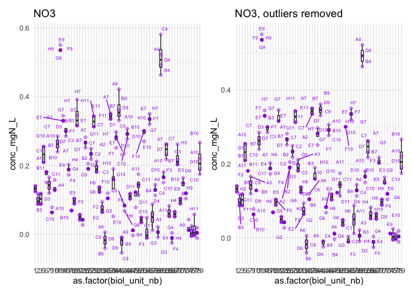
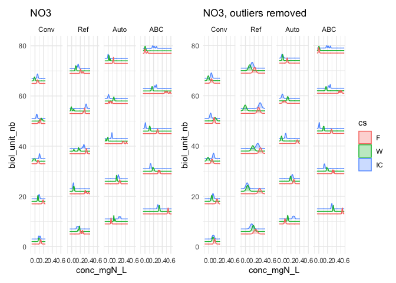
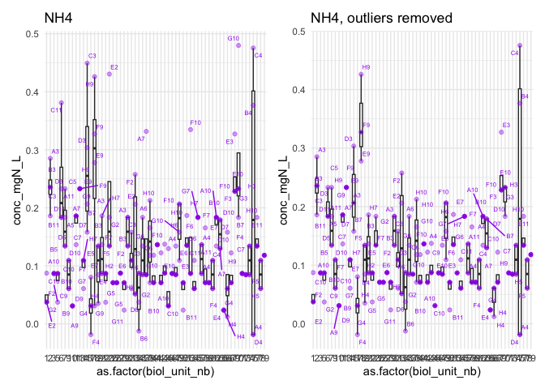
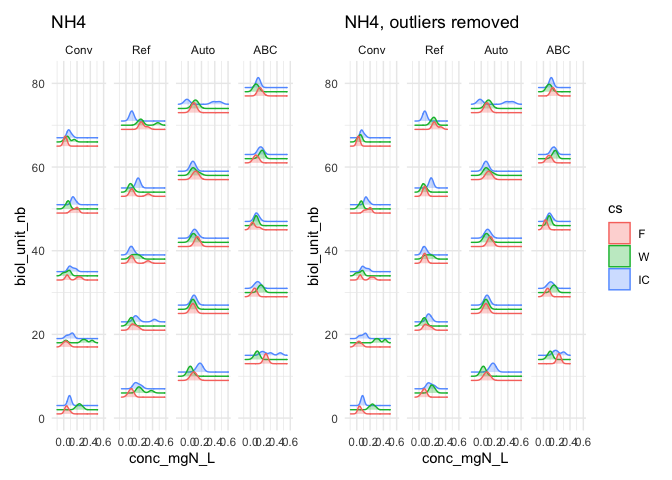
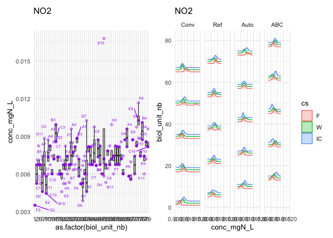
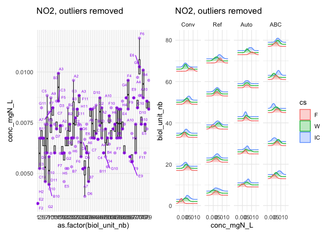
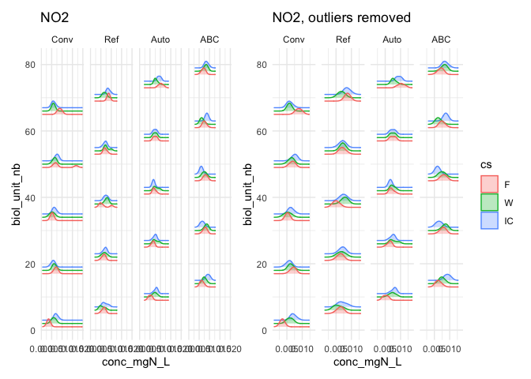
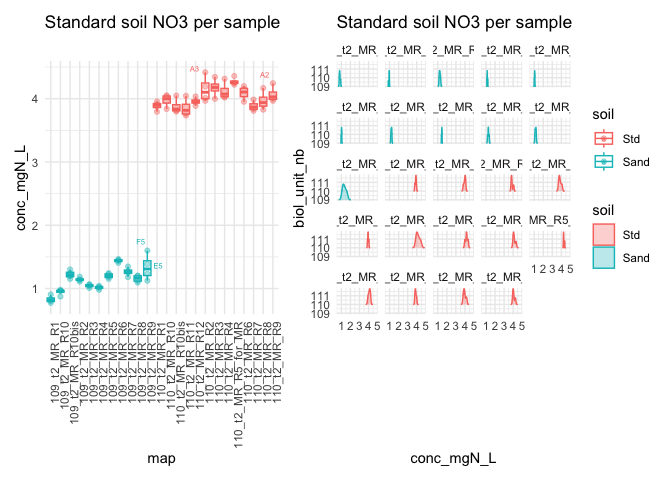

# 3 Greenhouse, t2 - Import non-absorbance data


- [To Do](#to-do)
- [Set up](#set-up)
- [1 - Non-absorbance data from
  AELab](#1---non-absorbance-data-from-aelab)
- [2 - Microresp Data](#2---microresp-data)
- [3 - Absorbance data](#3---absorbance-data)
  - [3.1 - Subset t2, greenhouse data set, no bare
    soil](#31---subset-t2-greenhouse-data-set-no-bare-soil)
  - [3.2 - Per-sample outlier removal](#32---per-sample-outlier-removal)
    - [3.2.1 - NO3](#321---no3)
    - [3.2.2 - NH4](#322---nh4)
    - [3.2.4 - NO2](#324---no2)
    - [3.2.3 - Standard soils](#323---standard-soils)
  - [3.3 - Per-sample mean](#33---per-sample-mean)
- [3 - Export](#3---export)

# To Do

- Link to a MicroResp pipeline!

# Set up

<details class="code-fold">
<summary>Code</summary>

``` r
rm(list = ls())

library(plate2N) # for remove_wells
library(tidyverse)
library(janitor)
library(roperators) # for %ni%
library(ggrepel) # for geom_text_repel()
library(ggridges) # for geom_density_ridges()
library(patchwork) # for the "+" layout and plot_layout()
```

</details>

# 1 - Non-absorbance data from AELab

<details class="code-fold">
<summary>Code</summary>

``` r
# import other "wet lab" raw data
raw_data_pot <- read_csv(
  "../raw_data/2024_raw.csv", show_col_types = TRUE,
  col_types = list(
    Soil = col_factor(),
    crop_diversity = col_factor(),
    CS = col_factor(),
    bloc = col_factor()
  )
  ) |> clean_names() |> 
  rename(sample_short = short) |> 
  filter(expe == "Pot")
```

</details>

    New names:
    Rows: 660 Columns: 173
    ── Column specification
    ──────────────────────────────────────────────────────── Delimiter: "," chr
    (29): Expe, short, CRA_trial, SdC, sampling_time, zone, incub_time, Res... dbl
    (138): Biol_unit_Nb, WHC_Tare_tube_g, WHC_gFW_g, WHC_Tare_dish_g, WHC_gS... lgl
    (2): Yd_grain_W_unit, Yd_Comment fct (4): Soil, crop_diversity, CS, bloc
    ℹ Use `spec()` to retrieve the full column specification for this data. ℹ
    Specify the column types or set `show_col_types = FALSE` to quiet this message.
    • `` -> `...173`

<details class="code-fold">
<summary>Code</summary>

``` r
raw_greenhouse_t2 <- raw_data_pot |> 
  filter(sampling_time == "t2") |> 
  # remove bare soil
  filter_out(cs == "B") |> 
  # correct biological unit
  mutate(biol_unit_nb = case_when(
    biol_unit_nb < 200 ~ biol_unit_nb,
    biol_unit_nb > 200 ~ biol_unit_nb - 200
  )) |> 
  arrange(biol_unit_nb) |> 
  # remove useless columns
  select(
    biol_unit_nb:sampling_time, 
    sample_name, #useful?
   starts_with(c("whc", "flush", "yd_rs"))
    )

# Check it out
raw_greenhouse_t2
```

</details>

    # A tibble: 88 × 44
       biol_unit_nb expe  sample_short cra_trial sd_c  soil  crop_diversity cs   
              <dbl> <chr> <chr>        <chr>     <chr> <fct> <fct>          <fct>
     1            1 Pot   t2_201_F     SyCI      Conv  Conv  SC             F    
     2            2 Pot   t2_202_W     SyCI      Conv  Conv  SC             W    
     3            3 Pot   t2_203_IC    SyCI      Conv  Conv  IC             IC   
     4            5 Pot   t2_205_F     SyCBio    SdC1  Ref   SC             F    
     5            6 Pot   t2_206_W     SyCBio    SdC1  Ref   SC             W    
     6            7 Pot   t2_207_IC    SyCBio    SdC1  Ref   IC             IC   
     7            9 Pot   t2_209_F     SyCBio    SdC2  Auto  SC             F    
     8           10 Pot   t2_210_W     SyCBio    SdC2  Auto  SC             W    
     9           11 Pot   t2_211_IC    SyCBio    SdC2  Auto  IC             IC   
    10           13 Pot   t2_213_F     SyCBio    SdC3  ABC   SC             F    
    # ℹ 78 more rows
    # ℹ 36 more variables: bloc <fct>, sampling_time <chr>, sample_name <chr>,
    #   whc_tare_tube_g <dbl>, whc_g_fw_g <dbl>, whc_tare_dish_g <dbl>,
    #   whc_g_sw_g <dbl>, whc_g_dw_g <dbl>, whc_comment <chr>,
    #   flush_dm_tare_tr1 <dbl>, flush_dm_g_fw_tr1 <dbl>, flush_dm_g_dw_tr1 <dbl>,
    #   flush_dm_tare_tr2 <dbl>, flush_dm_g_fw_tr2 <dbl>, flush_dm_g_dw_tr2 <dbl>,
    #   flush_dm_tare_tr3 <dbl>, flush_dm_g_fw_tr3 <dbl>, …

# 2 - Microresp Data

Then, MicroResp data may need to be added, probably with its own
pipeline

# 3 - Absorbance data

This data needs tidying, because we still have 4 values per sample
(corresponding to the 4 wells given to each sample for analytical
replicates on the absorbance plate.

First, we import this dataset

<details class="code-fold">
<summary>Code</summary>

``` r
raw_Nmin <- read_rds("output/data/2_mgNL_noTDN.rds") |> filter_out(dataset == "Nmint3")
```

</details>

## 3.1 - Subset t2, greenhouse data set, no bare soil

Then we take a subset (t2 only, greenhouse only, no bare soil)

<details class="code-fold">
<summary>Code</summary>

``` r
cs_map <- raw_greenhouse_t2 |> select(biol_unit_nb, cs, soil) |> unique()

raw_greenhouse_t2_Nmin <- raw_Nmin |> 
  # create sampling_time and expe variables from plate_ids (first number and first letter after N species)
  mutate(
    sampling_time = paste0(
      "t", 
      str_extract(plate_id, "\\w_(\\d)(\\w).*", group = 1)),
    expe = str_extract(plate_id, "\\w_(\\d)(\\w).*", group = 2),
    expe = case_when(expe %in% c("P", "G") ~ "Pot", .default = expe),
    .before = plate_id) |>
  # filter based on sampling_time
  filter(sampling_time == "t2", expe == "Pot") |> 
  separate_wider_delim(
    cols = map,
    names = c("biol_unit_nb"),
    delim = "_",
    too_many = "drop", 
    cols_remove = FALSE
  ) |> 
  mutate(biol_unit_nb = as.double(biol_unit_nb)) |> 
  # remove bare soils (multiples of 4)
  filter_out(biol_unit_nb %ni% cs_map$biol_unit_nb) |> 
  # add info on crop stand and soil
  left_join(cs_map) #|> 
```

</details>

    Joining with `by = join_by(biol_unit_nb)`

<details class="code-fold">
<summary>Code</summary>

``` r
  # remove 
```

</details>

## 3.2 - Per-sample outlier removal

So we will compute the per-sample average, for the greenhouse dataset.
But first, let’s have a look at the distribution of concentrations
before taking the average: are there clear outliers?

### 3.2.1 - NO3

<details class="code-fold">
<summary>Code</summary>

``` r
boxplot_no3 <- raw_greenhouse_t2_Nmin |> 
  filter(biol_unit_nb < 100) |> # exclude sand and conv soil std
  filter_out(std_sp == "NO2") |> 
  filter(std_sp == "NO3") |> 
  ggplot(aes(x = as.factor(biol_unit_nb), y = conc_mgN_L)) + 
  theme_minimal() +
  #geom_violin() +
  geom_boxplot(outliers = FALSE) +
  geom_point(alpha = 0.4, colour = "purple") +
  geom_text_repel(
    aes(label = well_id), 
    size = 2,
    colour = "purple", alpha = 1, 
    min.segment.length = 1)  + labs(title = "NO3")

ridges_no3 <- raw_greenhouse_t2_Nmin |> 
  filter(biol_unit_nb < 100) |> # exclude sand and conv soil std
  filter_out(std_sp == "NO2") |> 
  filter(std_sp == "NO3") |> 
  ggplot(aes(x = conc_mgN_L, groups = as.factor(biol_unit_nb), color = cs, fill = cs)) + 
  theme_minimal() +
  geom_density_ridges(aes(y = biol_unit_nb), alpha = 0.3) + facet_wrap(~soil, ncol = 4) + labs(title = "NO3")
```

</details>

I see some points that are a little bit off compared to the other three.

- samples where the highest concentration seems to be an outlier:

  - 21(H7), 54(H3), 15(A3), 61(C4), 77(H11), 69(H3), 10(A9), 41(A9),
    74(A9)

- samples where the lowest concentration seems to be an outlier:

  - 49(E10), 6(D11), 38(E10), 53(E10), 71(F9), 42(C9)

Manually removing those points, then re-running the plotting

<details class="code-fold">
<summary>Code</summary>

``` r
biol_unit <- c(21, 54, 15, 61, 77, 69, 10, 41, 74, 49, 6, 38, 53, 71, 42)
wells <- c("H7", "H3", "A3", "C4", "H11", "H3", "A9", "A9", "A9", "E10", "D11", "E10", "E10", "F9", "C9")
names(wells) <- biol_unit

to_remove <- tibble(
  biol_unit_nb = biol_unit,
  well_id = wells
) |> left_join(
  raw_greenhouse_t2_Nmin |> 
    filter(std_sp == "NO3") |> 
    select(biol_unit_nb, plate_id, dataset) |> 
    unique())
```

</details>

    Joining with `by = join_by(biol_unit_nb)`

<details class="code-fold">
<summary>Code</summary>

``` r
test_outlier_no3 <- remove_wells(
  table_to_clean = raw_greenhouse_t2_Nmin,
  well_table = to_remove) 

boxplot_no3_outlierfree <- test_outlier_no3 |> 
  filter(biol_unit_nb < 100) |> # exclude sand and conv soil std
  filter_out(std_sp == "NO2") |> 
  filter(std_sp == "NO3") |> 
  ggplot(aes(x = as.factor(biol_unit_nb), y = conc_mgN_L)) + 
  theme_minimal() +
  #geom_violin() +
  geom_boxplot(outliers = FALSE) +
  geom_point(alpha = 0.4, colour = "purple") +
  geom_text_repel(
    aes(label = well_id), 
    size = 2,
    colour = "purple", alpha = 1, 
    min.segment.length = 1) + labs(title = "NO3, outliers removed")

boxplot_no3 + boxplot_no3_outlierfree
```

</details>



<details class="code-fold">
<summary>Code</summary>

``` r
ridges_no3_outlierfree <- test_outlier_no3 |> 
  filter(biol_unit_nb < 100) |> # exclude sand and conv soil std
  #filter(biol_unit_nb < 5) |> 
  filter_out(std_sp == "NO2") |> 
  filter(std_sp == "NO3") |> 
  ggplot(aes(x = conc_mgN_L, groups = as.factor(biol_unit_nb), colour = cs, fill = cs )) + 
  theme_minimal() +
  geom_density_ridges(aes(y = biol_unit_nb), alpha = 0.3) +
  #geom_density(position = "stack")
  #geom_boxplot(outliers = FALSE) +
  #geom_point(alpha = 0.4, colour = "purple")# +
  facet_wrap(~soil, ncol = 4) + labs(title = "NO3, outliers removed")


ridges_no3 + ridges_no3_outlierfree + plot_layout(guides = "collect")
```

</details>

    Picking joint bandwidth of 0.00978
    Picking joint bandwidth of 0.00923
    Picking joint bandwidth of 0.00644
    Picking joint bandwidth of 0.00902
    Picking joint bandwidth of 0.0153
    Picking joint bandwidth of 0.029
    Picking joint bandwidth of 0.0115
    Picking joint bandwidth of 0.00758



### 3.2.2 - NH4

Now same, for NH4.

<details class="code-fold">
<summary>Code</summary>

``` r
boxplot_nh4 <- test_outlier_no3 |> 
  filter(biol_unit_nb < 100) |> # exclude sand and conv soil std
  filter_out(std_sp == "NO2") |> 
  filter(std_sp == "NH4") |> 
  ggplot(aes(x = as.factor(biol_unit_nb), y = conc_mgN_L)) +
  theme_minimal() +
  #geom_violin() +
  geom_boxplot(outliers = FALSE) +
  geom_point(alpha = 0.4, colour = "purple") +
  geom_text_repel(
    aes(label = well_id), 
    size = 2,
    colour = "purple", alpha = 1, 
    min.segment.length = 1)  + labs(title = "NH4")

ridges_nh4 <- test_outlier_no3 |> 
  filter(biol_unit_nb < 100) |> # exclude sand and conv soil std
  #filter(biol_unit_nb < 5) |> 
  filter_out(std_sp == "NO2") |> 
  filter(std_sp == "NH4") |> 
  ggplot(aes(x = conc_mgN_L, groups = as.factor(biol_unit_nb), colour = cs, fill = cs )) + 
  theme_minimal() +
  geom_density_ridges(aes(y = biol_unit_nb), alpha = 0.3) +
  #geom_density(position = "stack")
  #geom_boxplot(outliers = FALSE) +
  #geom_point(alpha = 0.4, colour = "purple")# +
  facet_wrap(~soil, ncol = 4) + labs(title = "NH4")
```

</details>

Here are those where I would remove

- the highest concentration:

  - 6(C11), 15(C3), 23(E2), 37(A7), 45(D10), 53(F10), 66(F4), 70(G10)

- the lowest concentration:

  - 18(G9)

- those where I am really unsure:

  - 33, 75 –\> should I remove those samples all together?

<details class="code-fold">
<summary>Code</summary>

``` r
biol_unit <- c(6, 15, 23, 37, 45, 53, 66, 70, 18)
wells <- c("C11", "C3", "E2", "A7", "D10", "F10", "F4", "G10", "G9")
names(wells) <- biol_unit

to_remove <- tibble(
  biol_unit_nb = biol_unit,
  well_id = wells
) |> left_join(
  test_outlier_no3 |> 
    filter(std_sp == "NH4") |> 
    select(biol_unit_nb, plate_id, dataset) |> 
    unique())
```

</details>

    Joining with `by = join_by(biol_unit_nb)`

<details class="code-fold">
<summary>Code</summary>

``` r
test_outlier_nh4 <- remove_wells(
  table_to_clean = test_outlier_no3,
  well_table = to_remove) 

boxplot_nh4_outlierfree <- test_outlier_nh4 |> 
  filter(biol_unit_nb < 100) |> # exclude sand and conv soil std
  filter_out(std_sp == "NO2") |> 
  filter(std_sp == "NH4") |> 
  ggplot(aes(x = as.factor(biol_unit_nb), y = conc_mgN_L)) +
  theme_minimal() +
  #geom_violin() +
  geom_boxplot(outliers = FALSE) +
  geom_point(alpha = 0.4, colour = "purple") +
  geom_text_repel(
    aes(label = well_id), 
    size = 2,
    colour = "purple", alpha = 1, 
    min.segment.length = 1)  + labs(title = "NH4, outliers removed")

ridges_nh4_outlierfree <- test_outlier_nh4 |> 
  filter(biol_unit_nb < 100) |> # exclude sand and conv soil std
  #filter(biol_unit_nb < 5) |> 
  filter_out(std_sp == "NO2") |> 
  filter(std_sp == "NH4") |> 
  ggplot(aes(x = conc_mgN_L, groups = as.factor(biol_unit_nb), colour = cs, fill = cs )) + 
  theme_minimal() +
  geom_density_ridges(aes(y = biol_unit_nb), alpha = 0.3) +
  #geom_density(position = "stack")
  #geom_boxplot(outliers = FALSE) +
  #geom_point(alpha = 0.4, colour = "purple")# +
  facet_wrap(~soil, ncol = 4) + labs(title = "NH4, outliers removed")

boxplot_nh4 + boxplot_nh4_outlierfree
```

</details>



<details class="code-fold">
<summary>Code</summary>

``` r
ridges_nh4 + ridges_nh4_outlierfree + plot_layout(guides = "collect")
```

</details>

    Picking joint bandwidth of 0.0274
    Picking joint bandwidth of 0.0348
    Picking joint bandwidth of 0.0429
    Picking joint bandwidth of 0.0337
    Picking joint bandwidth of 0.0251
    Picking joint bandwidth of 0.0323
    Picking joint bandwidth of 0.0429
    Picking joint bandwidth of 0.0321



### 3.2.4 - NO2

Because NO2 readings are virtually zero, there is only little point in
removing outliers. Nevertheless, we can have a look at the data

Per sample

<details class="code-fold">
<summary>Code</summary>

``` r
boxplot_no2 <- test_outlier_nh4 |> 
  filter(biol_unit_nb < 100) |> # exclude sand and conv soil std
  filter(std_sp == "NO2") |> 
  ggplot(aes(x = as.factor(biol_unit_nb), y = conc_mgN_L)) + 
  theme_minimal() +
  #geom_violin() +
  geom_boxplot(outliers = FALSE) +
  geom_point(alpha = 0.4, colour = "purple") +
  geom_text_repel(
    aes(label = well_id), 
    size = 2,
    colour = "purple", alpha = 1, 
    min.segment.length = 1)  + labs(title = "NO2")

ridges_no2 <- test_outlier_nh4 |> 
  filter(biol_unit_nb < 100) |> # exclude sand and conv soil std
  filter(std_sp == "NO2") |> 
  ggplot(aes(x = conc_mgN_L, groups = as.factor(biol_unit_nb), color = cs, fill = cs)) + 
  theme_minimal() +
  geom_density_ridges(aes(y = biol_unit_nb), alpha = 0.3) + facet_wrap(~soil, ncol = 4) + labs(title = "NO2")

boxplot_no2 + ridges_no2 + plot_layout(guides = "collect")
```

</details>

    Picking joint bandwidth of 0.000951

    Picking joint bandwidth of 0.000811

    Picking joint bandwidth of 0.000718

    Picking joint bandwidth of 0.000924



Few to remove

<details class="code-fold">
<summary>Code</summary>

``` r
biol_unit <- c(37, 42, 49, 54)
wells <- c("D7", "C9", "E10", "H3")

to_remove <- tibble(
  biol_unit_nb = biol_unit,
  well_id = wells, 
  std_sp = rep("NO2")
) |> left_join(test_outlier_nh4)
```

</details>

    Joining with `by = join_by(biol_unit_nb, well_id, std_sp)`

<details class="code-fold">
<summary>Code</summary>

``` r
test_outlier_no2 <- test_outlier_nh4 |> remove_wells(to_remove)

boxplot_no2_2 <- test_outlier_no2 |> 
  filter(biol_unit_nb < 100) |> # exclude sand and conv soil std
  filter(std_sp == "NO2") |> 
  ggplot(aes(x = as.factor(biol_unit_nb), y = conc_mgN_L)) + 
  theme_minimal() +
  #geom_violin() +
  geom_boxplot(outliers = FALSE) +
  geom_point(alpha = 0.4, colour = "purple") +
  geom_text_repel(
    aes(label = well_id), 
    size = 2,
    colour = "purple", alpha = 1, 
    min.segment.length = 1)  + labs(title = "NO2, outliers removed")

ridges_no2_2 <- test_outlier_no2 |> 
  filter(biol_unit_nb < 100) |> # exclude sand and conv soil std
  filter(std_sp == "NO2") |> 
  ggplot(aes(x = conc_mgN_L, groups = as.factor(biol_unit_nb), color = cs, fill = cs)) + 
  theme_minimal() +
  geom_density_ridges(aes(y = biol_unit_nb), alpha = 0.3) + facet_wrap(~soil, ncol = 4) + labs(title = "NO2, outliers removed")

boxplot_no2_2 + ridges_no2_2 + plot_layout(guides = "collect")
```

</details>

    Picking joint bandwidth of 0.000883
    Picking joint bandwidth of 0.00108
    Picking joint bandwidth of 0.000684
    Picking joint bandwidth of 0.000924



<details class="code-fold">
<summary>Code</summary>

``` r
boxplot_no2 + boxplot_no2_2 + plot_layout(guides = "collect")
```

</details>


<details class="code-fold">
<summary>Code</summary>

``` r
ridges_no2 + ridges_no2_2 + plot_layout(guides = "collect")
```

</details>

    Picking joint bandwidth of 0.000951
    Picking joint bandwidth of 0.000811
    Picking joint bandwidth of 0.000718
    Picking joint bandwidth of 0.000924
    Picking joint bandwidth of 0.000883
    Picking joint bandwidth of 0.00108
    Picking joint bandwidth of 0.000684
    Picking joint bandwidth of 0.000924



### 3.2.3 - Standard soils

For NO3,

<details class="code-fold">
<summary>Code</summary>

``` r
boxplot_std_no3 <- test_outlier_no2 |> 
  filter(biol_unit_nb > 100) |> # 
  filter_out(std_sp == "NO2") |> 
  filter(std_sp == "NO3") |> 
  ggplot(aes(x = soil, y = conc_mgN_L, colour = soil)) +
  theme_minimal() +
  #geom_violin() +
  geom_boxplot(outliers = FALSE) +
  geom_point(alpha = 0.4, aes(colour = soil)) +
  geom_text_repel(
    aes(label = well_id, colour = soil), 
    size = 2, alpha = 1, 
    min.segment.length = 1)  + labs(title = "Standard soil NO3")

ridges_std_no3 <- test_outlier_no2 |> 
  filter(biol_unit_nb > 100) |> # exclude sand and conv soil std
  filter_out(std_sp == "NO2") |> 
  filter(std_sp == "NO3") |> 
  ggplot(aes(x = conc_mgN_L, groups = as.factor(biol_unit_nb), colour = soil, fill = soil)) + 
  theme_minimal() +
  geom_density_ridges(aes(y = biol_unit_nb), alpha = 0.3) + labs(title = "Standard soil NO3")

boxplot_std_no3 + ridges_std_no3
```

</details>

    Picking joint bandwidth of 0.0687


I find that it looks good on a per-standard basis. But each had many
samples, let’s look at a per-sample basis

<details class="code-fold">
<summary>Code</summary>

``` r
boxplot_std_no3_2 <- test_outlier_no2 |> 
  filter(biol_unit_nb > 100) |> # 
  filter_out(std_sp == "NO2") |> 
  filter(std_sp == "NO3") |> 
  ggplot(aes(x = map, y = conc_mgN_L, colour = soil)) +
  theme_minimal() +
  #geom_violin() +
  geom_boxplot(outliers = FALSE) +
  geom_point(alpha = 0.4, aes(colour = soil)) +
  geom_text_repel(
    aes(label = well_id, colour = soil), 
    size = 2, alpha = 1, 
    min.segment.length = 1,)  + labs(title = "Standard soil NO3 per sample") + theme(axis.text.x = element_text(angle = 90, hjust = 1))

ridges_std_no3_2 <- test_outlier_no2 |> 
  filter(biol_unit_nb > 100) |> # exclude sand and conv soil std
  filter_out(std_sp == "NO2") |> 
  filter(std_sp == "NO3") |> 
  ggplot(aes(x = conc_mgN_L, groups = as.factor(map), colour = soil, fill = soil)) + 
  theme_minimal() +
  geom_density_ridges(aes(y = biol_unit_nb), alpha = 0.3) + facet_wrap(~map) + labs(title = "Standard soil NO3 per sample")

boxplot_std_no3_2 + ridges_std_no3_2 + plot_layout(guides = "collect")
```

</details>

    Picking joint bandwidth of 0.0283

    Picking joint bandwidth of 0.0134

    Picking joint bandwidth of 0.0359

    Picking joint bandwidth of 0.00975

    Picking joint bandwidth of 0.0134

    Picking joint bandwidth of 0.0139

    Picking joint bandwidth of 0.0279

    Picking joint bandwidth of 0.0132

    Picking joint bandwidth of 0.0271

    Picking joint bandwidth of 0.0372

    Picking joint bandwidth of 0.119

    Picking joint bandwidth of 0.032

    Picking joint bandwidth of 0.0566

    Picking joint bandwidth of 0.0491

    Picking joint bandwidth of 0.0791

    Picking joint bandwidth of 0.0246

    Picking joint bandwidth of 0.126

    Picking joint bandwidth of 0.0554

    Picking joint bandwidth of 0.0673

    Picking joint bandwidth of 0.0174

    Picking joint bandwidth of 0.0666

    Picking joint bandwidth of 0.0452

    Picking joint bandwidth of 0.0718

    Picking joint bandwidth of 0.0588



Still looks good, we keep it.

For NH4, same, first per standard

<details class="code-fold">
<summary>Code</summary>

``` r
boxplot_std_nh4 <- test_outlier_no2 |> 
  filter(biol_unit_nb > 100) |> # 
  filter_out(std_sp == "NO2") |> 
  filter(std_sp == "NH4") |> 
  ggplot(aes(x = soil, y = conc_mgN_L, colour = soil)) +
  theme_minimal() +
  #geom_violin() +
  geom_boxplot(outliers = FALSE) +
  geom_point(alpha = 0.4, aes(colour = soil)) +
  geom_text_repel(
    aes(label = well_id, colour = soil), 
    size = 2, alpha = 1, 
    min.segment.length = 1)  + labs(title = "Standard soil NH4")

ridges_std_nh4 <- test_outlier_no2 |> 
  filter(biol_unit_nb > 100) |> # exclude sand and conv soil std
  filter_out(std_sp == "NO2") |> 
  filter(std_sp == "NH4") |> 
  ggplot(aes(x = conc_mgN_L, groups = as.factor(biol_unit_nb), colour = soil, fill = soil)) + 
  theme_minimal() +
  geom_density_ridges(aes(y = biol_unit_nb), alpha = 0.3) + labs(title = "Standard soil NH4")

boxplot_std_nh4 + ridges_std_nh4 + plot_layout(guides = "collect")
```

</details>

    Picking joint bandwidth of 0.0297


Multimodal curve –\> dig into per-sample view

<details class="code-fold">
<summary>Code</summary>

``` r
boxplot_std_nh4_2 <- test_outlier_no2 |> 
  filter(biol_unit_nb > 100) |> # 
  filter_out(std_sp == "NO2") |> 
  filter(std_sp == "NH4") |> 
  ggplot(aes(x = map, y = conc_mgN_L, colour = soil)) +
  theme_minimal() +
  #geom_violin() +
  geom_boxplot(outliers = FALSE) +
  geom_point(alpha = 0.4, aes(colour = soil)) +
  geom_text_repel(
    aes(label = well_id, colour = soil), 
    size = 2, alpha = 1, 
    min.segment.length = 1,)  + labs(title = "Standard soil NH4, per sample") + theme(axis.text.x = element_text(angle = 90, hjust = 1))

ridges_std_nh4_2 <- test_outlier_no2 |> 
  filter(biol_unit_nb > 100) |> # exclude sand and conv soil std
  filter_out(std_sp == "NO2") |> 
  filter(std_sp == "NH4") |> 
  ggplot(aes(x = conc_mgN_L, groups = as.factor(map), colour = soil, fill = soil)) + 
  theme_minimal() +
  geom_density_ridges(aes(y = biol_unit_nb), alpha = 0.3) + facet_wrap(~map) + labs(title = "Standard soil NH4, per sample")

boxplot_std_nh4_2 + ridges_std_nh4_2 + plot_layout(guides = "collect")
```

</details>

    Picking joint bandwidth of 0.00618

    Picking joint bandwidth of 0.0131

    Picking joint bandwidth of 0.0195

    Picking joint bandwidth of 0.0186

    Picking joint bandwidth of 0.00655

    Picking joint bandwidth of 0.00635

    Picking joint bandwidth of 0.0195
    Picking joint bandwidth of 0.0195

    Picking joint bandwidth of 0.0126

    Picking joint bandwidth of 0.018

    Picking joint bandwidth of 0.0161

    Picking joint bandwidth of 0.0191

    Picking joint bandwidth of 0.00601

    Picking joint bandwidth of 0.00629

    Picking joint bandwidth of 0.0191

    Picking joint bandwidth of 0.00629
    Picking joint bandwidth of 0.00629

    Picking joint bandwidth of 0.00655
    Picking joint bandwidth of 0.00655

    Picking joint bandwidth of 0.0936

    Picking joint bandwidth of 0.296

    Picking joint bandwidth of 0.0126

    Picking joint bandwidth of 0.0804

    Picking joint bandwidth of 0.0126

    Picking joint bandwidth of 0.159


I find 2 wells to remove:

- plate 109_t2_MR_R8, well A5

- plate 110_t2_MR_R7, well G9

Let’s remove them and re-run the analysis

<details class="code-fold">
<summary>Code</summary>

``` r
samples <- c("109_t2_MR_R8", "110_t2_MR_R7")
wells <- c("A5", "G9")

to_remove <- test_outlier_no2 |> filter(
  ((map == samples[1] & well_id == wells[1]) |
    (map == samples[2] & well_id == wells[2])) &
    std_sp == "NH4"
)

test_outlier_nh4_std <- test_outlier_no2 |> remove_wells(to_remove)

boxplot_std_nh4_3 <- test_outlier_nh4_std |> 
  filter(biol_unit_nb > 100) |> # 
  filter_out(std_sp == "NO2") |> 
  filter(std_sp == "NH4") |> 
  ggplot(aes(x = map, y = conc_mgN_L, colour = soil)) +
  theme_minimal() +
  #geom_violin() +
  geom_boxplot(outliers = FALSE) +
  geom_point(alpha = 0.4, aes(colour = soil)) +
  geom_text_repel(
    aes(label = well_id, colour = soil), 
    size = 2, alpha = 1, 
    min.segment.length = 1,)  + labs(title = "Standard soil NH4\nPer sample, outliers removed") + theme(axis.text.x = element_text(angle = 90, hjust = 1))

ridges_std_nh4_3 <- test_outlier_nh4_std |> 
  filter(biol_unit_nb > 100) |> # exclude sand and conv soil std
  filter_out(std_sp == "NO2") |> 
  filter(std_sp == "NH4") |> 
  ggplot(aes(x = conc_mgN_L, groups = as.factor(map), colour = soil, fill = soil)) + 
  theme_minimal() +
  geom_density_ridges(aes(y = biol_unit_nb), alpha = 0.3) + facet_wrap(~map) + labs(title = "Standard soil NH4\nPer sample, outliers removed")

boxplot_std_nh4_3 + ridges_std_nh4_3 + plot_layout(guides = "collect")
```

</details>

    Picking joint bandwidth of 0.00618

    Picking joint bandwidth of 0.0131

    Picking joint bandwidth of 0.0195

    Picking joint bandwidth of 0.0186

    Picking joint bandwidth of 0.00655

    Picking joint bandwidth of 0.00635

    Picking joint bandwidth of 0.0195
    Picking joint bandwidth of 0.0195

    Picking joint bandwidth of 0.0126

    Picking joint bandwidth of 0.0171

    Picking joint bandwidth of 0.0161

    Picking joint bandwidth of 0.0191

    Picking joint bandwidth of 0.00601

    Picking joint bandwidth of 0.00629

    Picking joint bandwidth of 0.0191

    Picking joint bandwidth of 0.00629
    Picking joint bandwidth of 0.00629

    Picking joint bandwidth of 0.00655
    Picking joint bandwidth of 0.00655

    Picking joint bandwidth of 0.0936

    Picking joint bandwidth of 0.296

    Picking joint bandwidth of 0.0126

    Picking joint bandwidth of 0.149

    Picking joint bandwidth of 0.0126

    Picking joint bandwidth of 0.159


Compare before/after outlier removal

<details class="code-fold">
<summary>Code</summary>

``` r
boxplot_std_nh4_2 + boxplot_std_nh4_3 + plot_layout(guides = "collect")
```

</details>


<details class="code-fold">
<summary>Code</summary>

``` r
ridges_std_nh4_2 + ridges_std_nh4_3 + plot_layout(guides = "collect")
```

</details>

    Picking joint bandwidth of 0.00618

    Picking joint bandwidth of 0.0131

    Picking joint bandwidth of 0.0195

    Picking joint bandwidth of 0.0186

    Picking joint bandwidth of 0.00655

    Picking joint bandwidth of 0.00635

    Picking joint bandwidth of 0.0195
    Picking joint bandwidth of 0.0195

    Picking joint bandwidth of 0.0126

    Picking joint bandwidth of 0.018

    Picking joint bandwidth of 0.0161

    Picking joint bandwidth of 0.0191

    Picking joint bandwidth of 0.00601

    Picking joint bandwidth of 0.00629

    Picking joint bandwidth of 0.0191

    Picking joint bandwidth of 0.00629
    Picking joint bandwidth of 0.00629

    Picking joint bandwidth of 0.00655
    Picking joint bandwidth of 0.00655

    Picking joint bandwidth of 0.0936

    Picking joint bandwidth of 0.296

    Picking joint bandwidth of 0.0126

    Picking joint bandwidth of 0.0804

    Picking joint bandwidth of 0.0126

    Picking joint bandwidth of 0.159

    Picking joint bandwidth of 0.00618

    Picking joint bandwidth of 0.0131

    Picking joint bandwidth of 0.0195

    Picking joint bandwidth of 0.0186

    Picking joint bandwidth of 0.00655

    Picking joint bandwidth of 0.00635

    Picking joint bandwidth of 0.0195
    Picking joint bandwidth of 0.0195

    Picking joint bandwidth of 0.0126

    Picking joint bandwidth of 0.0171

    Picking joint bandwidth of 0.0161

    Picking joint bandwidth of 0.0191

    Picking joint bandwidth of 0.00601

    Picking joint bandwidth of 0.00629

    Picking joint bandwidth of 0.0191

    Picking joint bandwidth of 0.00629
    Picking joint bandwidth of 0.00629

    Picking joint bandwidth of 0.00655
    Picking joint bandwidth of 0.00655

    Picking joint bandwidth of 0.0936

    Picking joint bandwidth of 0.296

    Picking joint bandwidth of 0.0126

    Picking joint bandwidth of 0.149

    Picking joint bandwidth of 0.0126

    Picking joint bandwidth of 0.159


For NO2, per standard

<details class="code-fold">
<summary>Code</summary>

``` r
boxplot_std_no2 <- test_outlier_nh4_std |> 
  filter(biol_unit_nb > 100) |> # 
  filter(std_sp == "NO2") |> 
  ggplot(aes(x = soil, y = conc_mgN_L, colour = soil)) +
  theme_minimal() +
  #geom_violin() +
  geom_boxplot(outliers = FALSE) +
  geom_point(alpha = 0.4, aes(colour = soil)) +
  geom_text_repel(
    aes(label = well_id, colour = soil), 
    size = 2, alpha = 1, 
    min.segment.length = 1)  + labs(title = "Standard soil NO2")

ridges_std_no2 <- test_outlier_nh4_std |> 
  filter(biol_unit_nb > 100) |> # exclude sand and conv soil std
  filter(std_sp == "NO2") |> 
  ggplot(aes(x = conc_mgN_L, groups = as.factor(biol_unit_nb), colour = soil, fill = soil)) + 
  theme_minimal() +
  geom_density_ridges(aes(y = biol_unit_nb), alpha = 0.3) + labs(title = "Standard soil NO2")

boxplot_std_no2 + ridges_std_no2 + plot_layout(guides = "collect")
```

</details>

    Picking joint bandwidth of 0.000704


Then per sample

<details class="code-fold">
<summary>Code</summary>

``` r
boxplot_std_no2_2 <- test_outlier_nh4_std |> 
  filter(biol_unit_nb > 100) |> # 
  filter(std_sp == "NO2") |> 
  ggplot(aes(x = map, y = conc_mgN_L, colour = soil)) +
  theme_minimal() +
  #geom_violin() +
  geom_boxplot(outliers = FALSE) +
  geom_point(alpha = 0.4, aes(colour = soil)) +
  geom_text_repel(
    aes(label = well_id, colour = soil), 
    size = 2, alpha = 1, 
    min.segment.length = 1,)  + labs(title = "Standard soil NO2 per sample") + theme(axis.text.x = element_text(angle = 90, hjust = 1))

ridges_std_no2_2 <- test_outlier_nh4_std |> 
  filter(biol_unit_nb > 100) |> # exclude sand and conv soil std
  filter(std_sp == "NO2") |> 
  ggplot(aes(x = conc_mgN_L, groups = as.factor(map), colour = soil, fill = soil)) + 
  theme_minimal() +
  geom_density_ridges(aes(y = biol_unit_nb), alpha = 0.3) + facet_wrap(~map) + labs(title = "Standard soil NO2 per sample")

boxplot_std_no2_2 + ridges_std_no2_2 + plot_layout(guides = "collect")
```

</details>

    Picking joint bandwidth of 0.00054

    Picking joint bandwidth of 0.000887

    Picking joint bandwidth of 0.00408

    Picking joint bandwidth of 0.000904

    Picking joint bandwidth of 0.000177

    Picking joint bandwidth of 0.00336

    Picking joint bandwidth of 0.000348

    Picking joint bandwidth of 0.000174

    Picking joint bandwidth of 0.00059

    Picking joint bandwidth of 0.000559

    Picking joint bandwidth of 0.000181

    Picking joint bandwidth of 0.000174

    Picking joint bandwidth of 0.00848

    Picking joint bandwidth of 0.000539

    Picking joint bandwidth of 0.00054

    Picking joint bandwidth of 0.00408

    Picking joint bandwidth of 0.000549
    Picking joint bandwidth of 0.000549

    Picking joint bandwidth of 0.00744

    Picking joint bandwidth of 0.000191

    Picking joint bandwidth of 0.00018

    Picking joint bandwidth of 0.000174

    Picking joint bandwidth of 0.00226

    Picking joint bandwidth of 0.00018


to remove: plate 110_t2_MR_R8, well H6

<details class="code-fold">
<summary>Code</summary>

``` r
to_remove <- test_outlier_nh4_std |> 
  filter(
    map == "110_t2_MR_R8",
    well_id == "H6",
    std_sp == "NO2")

test_outlier_no2_std <- test_outlier_nh4_std |> remove_wells(to_remove)

boxplot_std_no2_3 <- test_outlier_no2_std |> 
  filter(biol_unit_nb > 100) |> # 
  filter(std_sp == "NO2") |> 
  ggplot(aes(x = map, y = conc_mgN_L, colour = soil)) +
  theme_minimal() +
  #geom_violin() +
  geom_boxplot(outliers = FALSE) +
  geom_point(alpha = 0.4, aes(colour = soil)) +
  geom_text_repel(
    aes(label = well_id, colour = soil), 
    size = 2, alpha = 1, 
    min.segment.length = 1,)  + labs(title = "Standard soil NO2\nPer sample, outliers removed") + theme(axis.text.x = element_text(angle = 90, hjust = 1))

ridges_std_no2_3 <- test_outlier_no2_std |> 
  filter(biol_unit_nb > 100) |> # exclude sand and conv soil std
  filter(std_sp == "NO2") |> 
  ggplot(aes(x = conc_mgN_L, groups = as.factor(map), colour = soil, fill = soil)) + 
  theme_minimal() +
  geom_density_ridges(aes(y = biol_unit_nb), alpha = 0.3) + facet_wrap(~map) + labs(title = "Standard soil NO2\nPer sample, outliers removed")

boxplot_std_no2_2 + boxplot_std_no2_3 + plot_layout(guides = "collect")
```

</details>


<details class="code-fold">
<summary>Code</summary>

``` r
ridges_std_no2_2 + ridges_std_no2_3 + plot_layout(guides = "collect")
```

</details>

    Picking joint bandwidth of 0.00054

    Picking joint bandwidth of 0.000887

    Picking joint bandwidth of 0.00408

    Picking joint bandwidth of 0.000904

    Picking joint bandwidth of 0.000177

    Picking joint bandwidth of 0.00336

    Picking joint bandwidth of 0.000348

    Picking joint bandwidth of 0.000174

    Picking joint bandwidth of 0.00059

    Picking joint bandwidth of 0.000559

    Picking joint bandwidth of 0.000181

    Picking joint bandwidth of 0.000174

    Picking joint bandwidth of 0.00848

    Picking joint bandwidth of 0.000539

    Picking joint bandwidth of 0.00054

    Picking joint bandwidth of 0.00408

    Picking joint bandwidth of 0.000549
    Picking joint bandwidth of 0.000549

    Picking joint bandwidth of 0.00744

    Picking joint bandwidth of 0.000191

    Picking joint bandwidth of 0.00018

    Picking joint bandwidth of 0.000174

    Picking joint bandwidth of 0.00226

    Picking joint bandwidth of 0.00018

    Picking joint bandwidth of 0.00054

    Picking joint bandwidth of 0.000887

    Picking joint bandwidth of 0.00408

    Picking joint bandwidth of 0.000904

    Picking joint bandwidth of 0.000177

    Picking joint bandwidth of 0.00336

    Picking joint bandwidth of 0.000348

    Picking joint bandwidth of 0.000174

    Picking joint bandwidth of 0.00059

    Picking joint bandwidth of 0.000559

    Picking joint bandwidth of 0.000181

    Picking joint bandwidth of 0.000174

    Picking joint bandwidth of 0.00848

    Picking joint bandwidth of 0.000539

    Picking joint bandwidth of 0.00054

    Picking joint bandwidth of 0.00408

    Picking joint bandwidth of 0.000549
    Picking joint bandwidth of 0.000549

    Picking joint bandwidth of 0.00744

    Picking joint bandwidth of 0.000191

    Picking joint bandwidth of 0.00018

    Picking joint bandwidth of 0.000174

    Picking joint bandwidth of 0.000369

    Picking joint bandwidth of 0.00018


Visually, I am satisfied with this outlier removal, so I save this
cleaned table

<details class="code-fold">
<summary>Code</summary>

``` r
greenhouse_t2_Nmin_clean <- test_outlier_no2_std
```

</details>

## 3.3 - Per-sample mean

<details class="code-fold">
<summary>Code</summary>

``` r
conc_mean <- greenhouse_t2_Nmin_clean |> 
  select(biol_unit_nb, std_sp, conc_mgN_L) |> 
  group_by(biol_unit_nb, std_sp) |> 
  summarise(
    mean = mean(conc_mgN_L),
    st_dev = sd(conc_mgN_L)) |> 
  mutate(coef_var = 100*st_dev / mean) |> 
  rename(conc_mgN_L = mean)
```

</details>

    `summarise()` has regrouped the output.
    ℹ Summaries were computed grouped by biol_unit_nb and std_sp.
    ℹ Output is grouped by biol_unit_nb.
    ℹ Use `summarise(.groups = "drop_last")` to silence this message.
    ℹ Use `summarise(.by = c(biol_unit_nb, std_sp))` for per-operation grouping
      (`?dplyr::dplyr_by`) instead.

<details class="code-fold">
<summary>Code</summary>

``` r
conc_mean |> arrange(desc(std_sp), desc(coef_var))
```

</details>

    # A tibble: 186 × 5
    # Groups:   biol_unit_nb [62]
       biol_unit_nb std_sp conc_mgN_L  st_dev coef_var
              <dbl> <chr>       <dbl>   <dbl>    <dbl>
     1           77 NO3       0.00128 0.00889    693. 
     2           78 NO3       0.00370 0.0121     327. 
     3           75 NO3       0.00557 0.0142     255. 
     4           59 NO3       0.00575 0.0125     218. 
     5           47 NO3       0.00770 0.00770    100  
     6           57 NO3       0.0494  0.0316      64.1
     7           65 NO3       0.0632  0.0147      23.2
     8           51 NO3       0.0413  0.00867     21.0
     9           23 NO3       0.0385  0.00770     20  
    10           33 NO3       0.0751  0.0144      19.1
    # ℹ 176 more rows

<details class="code-fold">
<summary>Code</summary>

``` r
conc_mean |> filter(coef_var > 10) |> 
  ggplot(aes(x = coef_var)) + geom_histogram()
```

</details>

    `stat_bin()` using `bins = 30`. Pick better value `binwidth`.


We still have quite a few samples with a high between-wells coefficient
of variation. But with only 3 to 4 wells and sometimes very low values,
this is unavoidable, so we move on

# 3 - Export

<details class="code-fold">
<summary>Code</summary>

``` r
raw_greenhouse_t2 |> write_rds("output/data/3_greenhouse_t2_raw_lab.rds")
conc_mean |> write_rds("output/data/3_greenhouse_t2_conc_clean.rds")
```

</details>
