# 3 Greenhouse, t2 - Import and tidy data


- [To Do](#to-do)
- [Set up](#set-up)
- [1 - Import data](#1---import-data)
  - [1.1 - Non-absorbance data from
    AELab](#11---non-absorbance-data-from-aelab)
    - [1.1.1 - Raw data](#111---raw-data)
    - [1.1.2 - Lab data on a per pot
      basis](#112---lab-data-on-a-per-pot-basis)
    - [1.1.3 - Lab data to get water content needed for
      PMN.](#113---lab-data-to-get-water-content-needed-for-pmn)
  - [1.2 - Microresp Data (TO DO?)](#12---microresp-data-to-do)
  - [1.3 - Absorbance data](#13---absorbance-data)
    - [1.3.1 - Nmin: Subset t2, greenhouse data set, no bare
      soil](#131---nmin-subset-t2-greenhouse-data-set-no-bare-soil)
    - [1.3.2 - PMN: Subset greenhouse](#132---pmn-subset-greenhouse)
- [2 - Tidy data: per-sample outlier
  removal](#2---tidy-data-per-sample-outlier-removal)
  - [2.1 - Nmin (samples)](#21---nmin-samples)
    - [2.1.1 - NO3](#211---no3)
    - [2.1.2 - NH4](#212---nh4)
    - [2.1.3 - NO2](#213---no2)
  - [2.2 - Nmin (Standard Soils)](#22---nmin-standard-soils)
    - [2.2.1 - NO3](#221---no3)
    - [2.2.2 - NH4](#222---nh4)
    - [2.2.3 - NO2](#223---no2)
    - [2.2.4 - All outliers removed
      Nmin](#224---all-outliers-removed-nmin)
  - [2.3 - PMN](#23---pmn)
    - [2.3.1 - NO3](#231---no3)
    - [2.3.2 - NH4](#232---nh4)
    - [2.3.3 - NO2](#233---no2)
    - [2.3.4 - All outliers removed
      PMN](#234---all-outliers-removed-pmn)
- [3 - Per-sample mean](#3---per-sample-mean)
  - [3.1 - Nmin](#31---nmin)
  - [3.2 - PMN](#32---pmn)
- [4 - Export](#4---export)

# To Do

- Link to a MicroResp pipeline!

# Set up

<details class="code-fold">
<summary>Code</summary>

``` r
rm(list = ls())

library(plate2N) # for remove_wells
library(tidyverse)
library(janitor)
library(roperators) # for %ni%
library(ggrepel) # for geom_text_repel()
library(ggridges) # for geom_density_ridges()
library(patchwork) # for the "+" layout and plot_layout()

# functions
source("functions/plot_qc_sample_conc.R")
```

</details>

# 1 - Import data

## 1.1 - Non-absorbance data from AELab

### 1.1.1 - Raw data

<details class="code-fold">
<summary>Code</summary>

``` r
# import other "wet lab" raw data
raw_data_pot <- read_csv(
  "../raw_data/2024_raw.csv", show_col_types = TRUE,
  col_types = list(
    Soil = col_factor(),
    crop_diversity = col_factor(),
    CS = col_factor(),
    bloc = col_factor()
  ),
  na = c("", "NA", "Na")
  ) |> clean_names() |> 
  rename(sample_short = short) |> 
  filter(expe == "Pot")
```

</details>

    New names:
    Rows: 660 Columns: 173
    ── Column specification
    ──────────────────────────────────────────────────────── Delimiter: "," chr
    (28): Expe, short, CRA_trial, SdC, sampling_time, zone, incub_time, Res... dbl
    (139): Biol_unit_Nb, WHC_Tare_tube_g, WHC_gFW_g, WHC_Tare_dish_g, WHC_gS... lgl
    (2): Yd_grain_W_unit, Yd_Comment fct (4): Soil, crop_diversity, CS, bloc
    ℹ Use `spec()` to retrieve the full column specification for this data. ℹ
    Specify the column types or set `show_col_types = FALSE` to quiet this message.
    • `` -> `...173`

### 1.1.2 - Lab data on a per pot basis

(biological units = pots of t2)

<details class="code-fold">
<summary>Code</summary>

``` r
raw_greenhouse_t2 <- raw_data_pot |> 
  filter(sampling_time == "t2") |> 
  # remove bare soil
  filter_out(cs == "B") |> 
  # correct biological unit
  mutate(biol_unit_nb = case_when(
    biol_unit_nb < 200 ~ biol_unit_nb,
    biol_unit_nb > 200 ~ biol_unit_nb - 200
  )) |> 
  arrange(biol_unit_nb) |> 
  # remove useless columns
  select(
    biol_unit_nb:sampling_time, 
    sample_name, #useful?
   starts_with(c("whc", "flush", "yd_rs"))
    )

# Check it out
raw_greenhouse_t2
```

</details>

    # A tibble: 88 × 44
       biol_unit_nb expe  sample_short cra_trial sd_c  soil  crop_diversity cs   
              <dbl> <chr> <chr>        <chr>     <chr> <fct> <fct>          <fct>
     1            1 Pot   t2_201_F     SyCI      Conv  Conv  SC             F    
     2            2 Pot   t2_202_W     SyCI      Conv  Conv  SC             W    
     3            3 Pot   t2_203_IC    SyCI      Conv  Conv  IC             IC   
     4            5 Pot   t2_205_F     SyCBio    SdC1  Ref   SC             F    
     5            6 Pot   t2_206_W     SyCBio    SdC1  Ref   SC             W    
     6            7 Pot   t2_207_IC    SyCBio    SdC1  Ref   IC             IC   
     7            9 Pot   t2_209_F     SyCBio    SdC2  Auto  SC             F    
     8           10 Pot   t2_210_W     SyCBio    SdC2  Auto  SC             W    
     9           11 Pot   t2_211_IC    SyCBio    SdC2  Auto  IC             IC   
    10           13 Pot   t2_213_F     SyCBio    SdC3  ABC   SC             F    
    # ℹ 78 more rows
    # ℹ 36 more variables: bloc <fct>, sampling_time <chr>, sample_name <chr>,
    #   whc_tare_tube_g <dbl>, whc_g_fw_g <dbl>, whc_tare_dish_g <dbl>,
    #   whc_g_sw_g <dbl>, whc_g_dw_g <dbl>, whc_comment <chr>,
    #   flush_dm_tare_tr1 <dbl>, flush_dm_g_fw_tr1 <dbl>, flush_dm_g_dw_tr1 <dbl>,
    #   flush_dm_tare_tr2 <dbl>, flush_dm_g_fw_tr2 <dbl>, flush_dm_g_dw_tr2 <dbl>,
    #   flush_dm_tare_tr3 <dbl>, flush_dm_g_fw_tr3 <dbl>, …

### 1.1.3 - Lab data to get water content needed for PMN.

Unfortunately, WC was not computed separately, but can only be derived
from the WHC manip.

<details class="code-fold">
<summary>Code</summary>

``` r
pmn_wc <- raw_data_pot |> 
  select(biol_unit_nb, expe, soil, sampling_time, starts_with("whc")) |> 
  filter(sampling_time == "t0", !is.na(whc_tare_tube_g)) |> 
  #dm = g dry soil / g fresh soil       
  # wc = 1 - dm
  mutate(
    dm = (whc_g_dw_g - whc_tare_dish_g) / (whc_g_fw_g - whc_tare_tube_g),
    wc = 1-dm,
    .keep = "unused",
    .after = sampling_time
  ) |> 
  summarize(
    .by = "soil",
    dm = mean(dm),
    wc = mean(wc)
  ) |> 
  mutate(biol_unit_nb = paste0("Pot_", soil))
```

</details>

## 1.2 - Microresp Data (TO DO?)

Then, MicroResp data may need to be added, probably with its own
pipeline

## 1.3 - Absorbance data

This data needs tidying, because we still have 4 values per sample
(corresponding to the 4 wells given to each sample for analytical
replicates on the absorbance plate.

First, we import this dataset

<details class="code-fold">
<summary>Code</summary>

``` r
raw_Nmin <- read_rds("output/data/2_mgNL_noTDN.rds") |> filter_out(dataset == "Nmint3")
```

</details>

### 1.3.1 - Nmin: Subset t2, greenhouse data set, no bare soil

Then we take a subset (t2 only, greenhouse only, no bare soil).

This complex pipeline is only necessary because I was not very
consistent in plate-naming structure.

<details class="code-fold">
<summary>Code</summary>

``` r
cs_map <- raw_greenhouse_t2 |> select(biol_unit_nb, cs, soil) |> unique()


raw_greenhouse_t2_Nmin <- raw_Nmin |> 
  filter_out(dataset == "PMN") |> 
  # create sampling_time and expe variables from plate_ids (first number and first letter after N species)
  mutate(
    # paste "t" and the sampling time as number: for t1 and t2: is stored in plate data (--> str_extract)
    sampling_time = paste0(
      "t", 
      str_extract(plate_id, "\\w_(\\d)(\\w).*", group = 1)
      ),
    # for expe: will work for t1 and t2, 
    expe = str_extract(plate_id, "\\w_(\\d)(\\w).*", group = 2),
    # rephrase "P", "G" into "Pot" (G was for greenhouse)
    expe = case_when(expe %in% c("P", "G") ~ "Pot", .default = expe),
    .before = plate_id) |> 
  # filter based on sampling_time
  filter(sampling_time == "t2", expe == "Pot") |> 
  separate_wider_delim(
    cols = map,
    names = c("biol_unit_nb"),
    delim = "_",
    too_many = "drop", 
    cols_remove = FALSE
  ) |> 
  mutate(
    biol_unit_nb = as.double(biol_unit_nb)) |> 
  # remove bare soils (multiples of 4)
  filter_out(biol_unit_nb %ni% cs_map$biol_unit_nb) |> 
  # add info on crop stand and soil
  left_join(cs_map)
```

</details>

    Joining with `by = join_by(biol_unit_nb)`

### 1.3.2 - PMN: Subset greenhouse

<details class="code-fold">
<summary>Code</summary>

``` r
raw_greenhouse_PMN <- raw_Nmin |> 
  filter(dataset == "PMN") |> 
  separate_wider_delim(
    cols = map,
    names = c("expe", "soil", "incubation_time", "tech_rep"),
    delim = "_",
    cols_remove = FALSE
  ) |> 
  mutate(
    sampling_time = rep("t0"),
    biol_unit_nb = paste0(expe, "_", soil),
    .before = well_id) |> 
  filter_out(expe == "Field")
```

</details>

Check out both subsets. First, Nmin data

<details class="code-fold">
<summary>Code</summary>

``` r
raw_greenhouse_t2_Nmin
```

</details>

    # A tibble: 1,012 × 18
       dataset sampling_time expe  plate_id biol_unit_nb map   well_id abs_corrected
       <chr>   <chr>         <chr> <chr>           <dbl> <chr> <chr>           <dbl>
     1 Nmint1… t2            Pot   NH4_2P1           110 110_… A2           0.00362 
     2 Nmint1… t2            Pot   NH4_2P2           110 110_… A2           0.00471 
     3 Nmint1… t2            Pot   NH4_2P3            46 46_t2 A2           0.00175 
     4 Nmint1… t2            Pot   NH4_2P4           110 110_… A2           0.00425 
     5 Nmint1… t2            Pot   NH4_2P5            26 26_t2 A2           0.00150 
     6 Nmint1… t2            Pot   NH4_2P7…           27 27_t2 A2           0.00175 
     7 Nmint1… t2            Pot   NH4_2P1           109 109_… A3           0.000625
     8 Nmint1… t2            Pot   NH4_2P2            30 30_t2 A3           0.00371 
     9 Nmint1… t2            Pot   NH4_2P3             2 2_t2  A3           0.00575 
    10 Nmint1… t2            Pot   NH4_2P4            15 15_t2 A3           0.00425 
    # ℹ 1,002 more rows
    # ℹ 10 more variables: std_sp <chr>, target_sp <chr>, std_unit <chr>,
    #   slope <dbl>, adj_r_squared <dbl>, lm_p <dbl>, conc_mgNsp_L <dbl>,
    #   conc_mgN_L <dbl>, cs <fct>, soil <fct>

Then, PMN data

<details class="code-fold">
<summary>Code</summary>

``` r
raw_greenhouse_PMN
```

</details>

    # A tibble: 960 × 19
       dataset plate_id expe  soil  incubation_time tech_rep map       sampling_time
       <chr>   <chr>    <chr> <chr> <chr>           <chr>    <chr>     <chr>        
     1 PMN     NH4_PC1  Pot   Conv  i0              rt1      Pot_Conv… t0           
     2 PMN     NH4_PC2  Pot   Conv  i0              rt4      Pot_Conv… t0           
     3 PMN     NH4_PP1  Pot   Ref   i0              rt1      Pot_Ref_… t0           
     4 PMN     NH4_PP2  Pot   Ref   i0              rt2      Pot_Ref_… t0           
     5 PMN     NH4_PP3  Pot   Ref   i0              rt3      Pot_Ref_… t0           
     6 PMN     NH4_PP4  Pot   Ref   i0              rt4      Pot_Ref_… t0           
     7 PMN     NH4_PC1  Pot   Conv  i0              rt2      Pot_Conv… t0           
     8 PMN     NH4_PP1  Pot   Auto  i0              rt1      Pot_Auto… t0           
     9 PMN     NH4_PP2  Pot   Auto  i0              rt2      Pot_Auto… t0           
    10 PMN     NH4_PP3  Pot   Auto  i0              rt3      Pot_Auto… t0           
    # ℹ 950 more rows
    # ℹ 11 more variables: biol_unit_nb <chr>, well_id <chr>, abs_corrected <dbl>,
    #   std_sp <chr>, target_sp <chr>, std_unit <chr>, slope <dbl>,
    #   adj_r_squared <dbl>, lm_p <dbl>, conc_mgNsp_L <dbl>, conc_mgN_L <dbl>

# 2 - Tidy data: per-sample outlier removal

## 2.1 - Nmin (samples)

So we will compute the per-sample average, for the greenhouse dataset.
But first, let’s have a look at the distribution of concentrations
before taking the average: are there clear outliers?

### 2.1.1 - NO3

<details class="code-fold">
<summary>Code</summary>

``` r
boxplot_no3 <- raw_greenhouse_t2_Nmin |> 
  filter(biol_unit_nb < 100, std_sp == "NO3") |> 
  boxplot_conc() + labs(title = "NO3")

ridges_no3 <- raw_greenhouse_t2_Nmin |> 
  filter(biol_unit_nb < 100, std_sp == "NO3") |>  # exclude sand and conv soil std
  plot_ridges_conc() + facet_wrap(~soil, ncol = 4) + labs(title = "NO3")
```

</details>

I see some points that are a little bit off compared to the other three.

- samples where the highest concentration seems to be an outlier:

  - 21(H7), 54(H3), 15(A3), 61(C4), 77(H11), 69(H3), 10(A9), 41(A9),
    74(A9)

- samples where the lowest concentration seems to be an outlier:

  - 49(E10), 6(D11), 38(E10), 53(E10), 71(F9), 42(C9)

Manually removing those points, then re-running the plotting

<details class="code-fold">
<summary>Code</summary>

``` r
biol_unit <- c(21, 54, 15, 61, 77, 69, 10, 41, 74, 49, 6, 38, 53, 71, 42)
wells <- c("H7", "H3", "A3", "C4", "H11", "H3", "A9", "A9", "A9", "E10", "D11", "E10", "E10", "F9", "C9")
names(wells) <- biol_unit

to_remove <- tibble(
  biol_unit_nb = biol_unit,
  well_id = wells
) |> left_join(
  raw_greenhouse_t2_Nmin |> 
    filter(std_sp == "NO3") |> 
    select(biol_unit_nb, plate_id, dataset) |> 
    unique())
```

</details>

    Joining with `by = join_by(biol_unit_nb)`

<details class="code-fold">
<summary>Code</summary>

``` r
Nmin_wash1 <- remove_wells(
  table_to_clean = raw_greenhouse_t2_Nmin,
  well_table = to_remove) 


boxplot_no3_outlierfree <- Nmin_wash1 |> 
  filter(biol_unit_nb < 100, std_sp == "NO3") |> # exclude sand and conv soil std
  boxplot_conc(x = "biol_unit_nb", y = "conc_mgN_L") + labs(title = "NO3, outliers removed")

boxplot_no3 + boxplot_no3_outlierfree
```

</details>

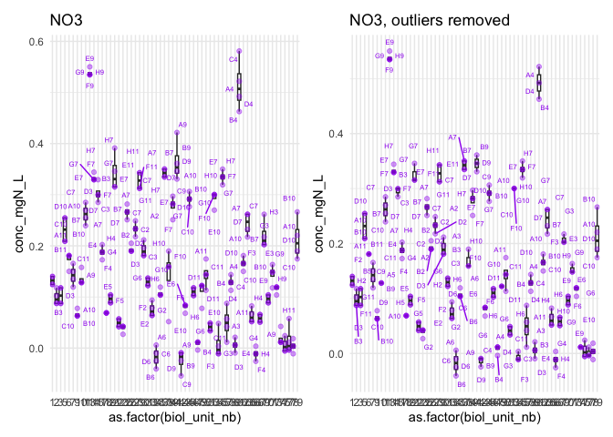

<details class="code-fold">
<summary>Code</summary>

``` r
ridges_no3_outlierfree <- Nmin_wash1 |> 
  filter(biol_unit_nb < 100, std_sp == "NO3") |> # exclude sand and conv soil std
  plot_ridges_conc() + facet_wrap(~soil, ncol = 4) + labs(title = "NO3, outliers removed")

ridges_no3 + ridges_no3_outlierfree + plot_layout(guides = "collect")
```

</details>

    Picking joint bandwidth of 0.00978
    Picking joint bandwidth of 0.00923
    Picking joint bandwidth of 0.00644
    Picking joint bandwidth of 0.00902
    Picking joint bandwidth of 0.0153
    Picking joint bandwidth of 0.029
    Picking joint bandwidth of 0.0115
    Picking joint bandwidth of 0.00758


### 2.1.2 - NH4

Now same, for NH4.

<details class="code-fold">
<summary>Code</summary>

``` r
boxplot_nh4 <- Nmin_wash1 |> 
  filter(biol_unit_nb < 100, std_sp == "NH4") |> # exclude sand and conv soil std
  boxplot_conc() + labs(title = "NH4")
  
ridges_nh4 <- Nmin_wash1 |> 
  filter(biol_unit_nb < 100, std_sp == "NH4") |> # exclude sand and conv soil std
  plot_ridges_conc() + facet_wrap(~soil, ncol = 4) + labs(title = "NH4")
```

</details>

Here are those where I would remove

- the highest concentration:

  - 6(C11), 15(C3), 23(E2), 37(A7), 45(D10), 53(F10), 66(F4), 70(G10)

- the lowest concentration:

  - 18(G9)

- those where I am really unsure:

  - 33, 75 –\> should I remove those samples all together?

<details class="code-fold">
<summary>Code</summary>

``` r
biol_unit <- c(6, 15, 23, 37, 45, 53, 66, 70, 18)
wells <- c("C11", "C3", "E2", "A7", "D10", "F10", "F4", "G10", "G9")
names(wells) <- biol_unit

to_remove <- tibble(
  biol_unit_nb = biol_unit,
  well_id = wells
) |> left_join(
  Nmin_wash1 |> 
    filter(std_sp == "NH4") |> 
    select(biol_unit_nb, plate_id, dataset) |> 
    unique())
```

</details>

    Joining with `by = join_by(biol_unit_nb)`

<details class="code-fold">
<summary>Code</summary>

``` r
Nmin_wash2 <- remove_wells(
  table_to_clean = Nmin_wash1,
  well_table = to_remove) 

boxplot_nh4_outlierfree <- Nmin_wash2 |> 
  filter(biol_unit_nb < 100, std_sp == "NH4") |> # exclude sand and conv soil std
  boxplot_conc() + labs(title = "NH4, outliers removed")

ridges_nh4_outlierfree <- Nmin_wash2 |> 
  filter(biol_unit_nb < 100, std_sp == "NH4") |> # exclude sand and conv soil std
  plot_ridges_conc() + facet_wrap(~soil, ncol = 4) + labs(title = "NH4, outliers removed")

boxplot_nh4 + boxplot_nh4_outlierfree
```

</details>

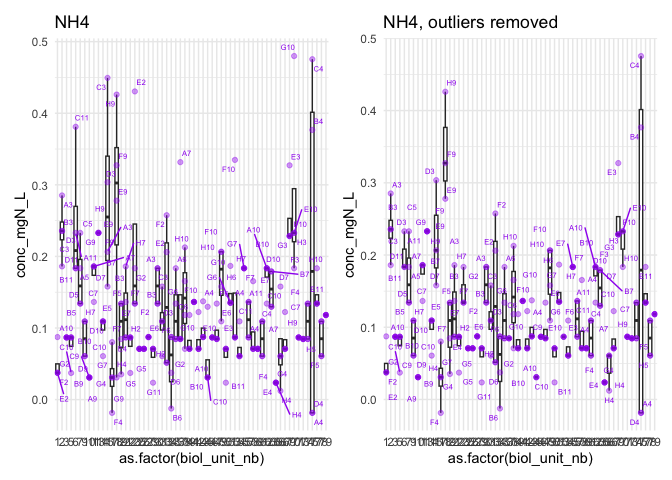

<details class="code-fold">
<summary>Code</summary>

``` r
ridges_nh4 + ridges_nh4_outlierfree + plot_layout(guides = "collect")
```

</details>

    Picking joint bandwidth of 0.0274
    Picking joint bandwidth of 0.0348
    Picking joint bandwidth of 0.0429
    Picking joint bandwidth of 0.0337
    Picking joint bandwidth of 0.0251
    Picking joint bandwidth of 0.0323
    Picking joint bandwidth of 0.0429
    Picking joint bandwidth of 0.0321


### 2.1.3 - NO2

Because NO2 readings are virtually zero, there is only little point in
removing outliers. Nevertheless, we can have a look at the data

Per sample

<details class="code-fold">
<summary>Code</summary>

``` r
boxplot_no2 <- Nmin_wash2 |> 
  filter(biol_unit_nb < 100, std_sp == "NO2") |> # exclude sand and conv soil std
  boxplot_conc() + labs(title = "NO2")

ridges_no2 <- Nmin_wash2 |> 
  filter(biol_unit_nb < 100, std_sp == "NO2") |> # exclude sand and conv soil std
  plot_ridges_conc() + facet_wrap(~soil, ncol = 4) + labs(title = "NO2")

boxplot_no2 + ridges_no2 + plot_layout(guides = "collect")
```

</details>

    Picking joint bandwidth of 0.000951

    Picking joint bandwidth of 0.000811

    Picking joint bandwidth of 0.000718

    Picking joint bandwidth of 0.000924

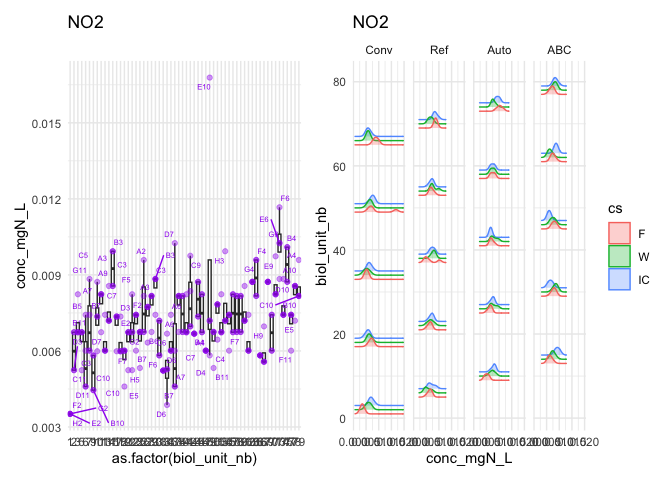

Few to remove

<details class="code-fold">
<summary>Code</summary>

``` r
biol_unit <- c(37, 42, 49, 54)
wells <- c("D7", "C9", "E10", "H3")

to_remove <- tibble(
  biol_unit_nb = biol_unit,
  well_id = wells, 
  std_sp = rep("NO2")
) |> left_join(Nmin_wash2)
```

</details>

    Joining with `by = join_by(biol_unit_nb, well_id, std_sp)`

<details class="code-fold">
<summary>Code</summary>

``` r
Nmin_wash3 <- Nmin_wash2 |> remove_wells(to_remove)

boxplot_no2_2 <- Nmin_wash3 |> 
  filter(biol_unit_nb < 100, std_sp == "NO2") |> # exclude sand and conv soil std
  boxplot_conc() + labs(title = "NO2, outliers removed")

ridges_no2_2 <- Nmin_wash3 |> 
  filter(biol_unit_nb < 100, std_sp == "NO2") |> # exclude sand and conv soil std
  plot_ridges_conc() + facet_wrap(~soil, ncol = 4) + labs(title = "NO2, outliers removed")

boxplot_no2_2 + ridges_no2_2 + plot_layout(guides = "collect")
```

</details>

    Picking joint bandwidth of 0.000883
    Picking joint bandwidth of 0.00108
    Picking joint bandwidth of 0.000684
    Picking joint bandwidth of 0.000924

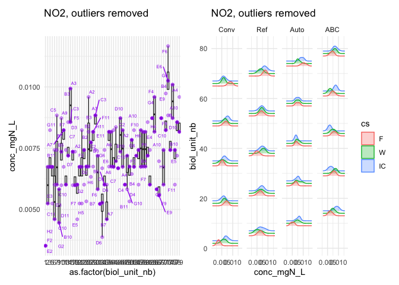

<details class="code-fold">
<summary>Code</summary>

``` r
boxplot_no2 + boxplot_no2_2 + plot_layout(guides = "collect")
```

</details>

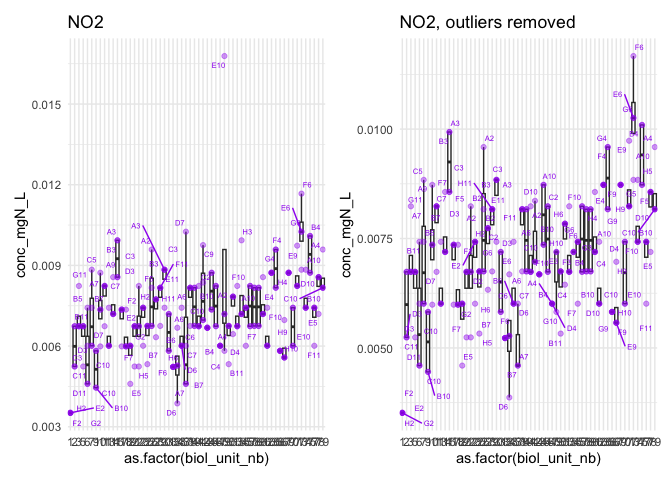

<details class="code-fold">
<summary>Code</summary>

``` r
ridges_no2 + ridges_no2_2 + plot_layout(guides = "collect")
```

</details>

    Picking joint bandwidth of 0.000951
    Picking joint bandwidth of 0.000811
    Picking joint bandwidth of 0.000718
    Picking joint bandwidth of 0.000924
    Picking joint bandwidth of 0.000883
    Picking joint bandwidth of 0.00108
    Picking joint bandwidth of 0.000684
    Picking joint bandwidth of 0.000924


## 2.2 - Nmin (Standard Soils)

### 2.2.1 - NO3

For NO3,

<details class="code-fold">
<summary>Code</summary>

``` r
boxplot_std_no3 <- Nmin_wash3 |> 
  filter(biol_unit_nb > 100, std_sp == "NO3") |> # 
  boxplot_conc(x = "soil", colour = "soil") + labs(title = "Standard soil NO3")

ridges_std_no3 <- Nmin_wash3 |> 
  filter(biol_unit_nb > 100, std_sp == "NO3") |> # exclude sand and conv soil std
  plot_ridges_conc(colour = "soil") + labs(title = "Standard soil NO3")

boxplot_std_no3 + ridges_std_no3
```

</details>

    Picking joint bandwidth of 0.0687

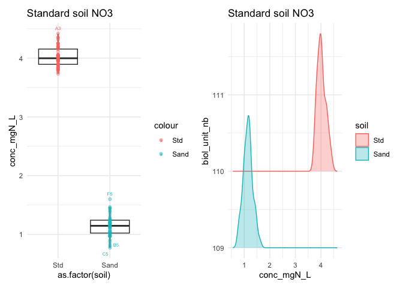

I find that it looks good on a per-standard basis. But each had many
samples, let’s look at a per-sample basis

<details class="code-fold">
<summary>Code</summary>

``` r
boxplot_std_no3_2 <- Nmin_wash3 |> 
  filter(biol_unit_nb > 100, std_sp == "NO3") |> # 
  boxplot_conc(x = "map", colour = "soil") + 
  labs(title = "Standard soil NO3 per sample") + 
  theme(axis.text.x = element_text(angle = 90, hjust = 1))

ridges_std_no3_2 <- Nmin_wash3 |> 
  filter(biol_unit_nb > 100, std_sp == "NO3") |> # exclude sand and conv soil std
  plot_ridges_conc(groups = "map", colour = "soil") + 
  facet_wrap(~map) + labs(title = "Standard soil NO3 per sample") 

boxplot_std_no3_2 + ridges_std_no3_2 + plot_layout(guides = "collect")
```

</details>

    Picking joint bandwidth of 0.0283

    Picking joint bandwidth of 0.0134

    Picking joint bandwidth of 0.0359

    Picking joint bandwidth of 0.00975

    Picking joint bandwidth of 0.0134

    Picking joint bandwidth of 0.0139

    Picking joint bandwidth of 0.0279

    Picking joint bandwidth of 0.0132

    Picking joint bandwidth of 0.0271

    Picking joint bandwidth of 0.0372

    Picking joint bandwidth of 0.119

    Picking joint bandwidth of 0.032

    Picking joint bandwidth of 0.0566

    Picking joint bandwidth of 0.0491

    Picking joint bandwidth of 0.0791

    Picking joint bandwidth of 0.0246

    Picking joint bandwidth of 0.126

    Picking joint bandwidth of 0.0554

    Picking joint bandwidth of 0.0673

    Picking joint bandwidth of 0.0174

    Picking joint bandwidth of 0.0666

    Picking joint bandwidth of 0.0452

    Picking joint bandwidth of 0.0718

    Picking joint bandwidth of 0.0588

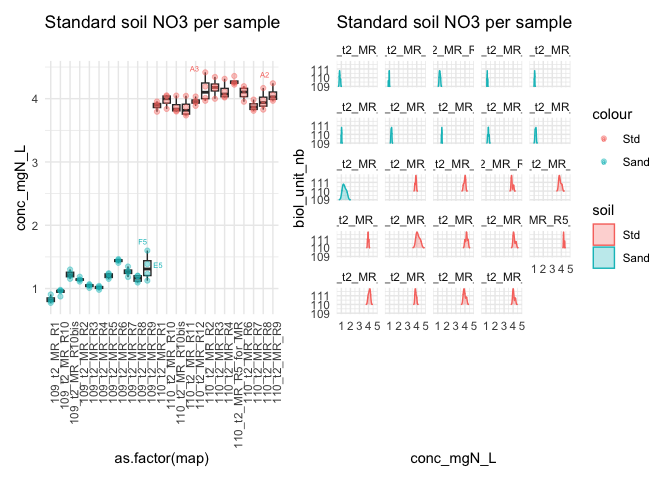

Still looks good, we keep it.

### 2.2.2 - NH4

For NH4, same, first per standard

<details class="code-fold">
<summary>Code</summary>

``` r
boxplot_std_nh4 <- Nmin_wash3 |> 
  filter(biol_unit_nb > 100, std_sp == "NH4") |> # 
  boxplot_conc(x = "soil", colour = "soil") + labs(title = "Standard soil NH4")

ridges_std_nh4 <- Nmin_wash3 |> 
  filter(biol_unit_nb > 100, std_sp == "NH4") |> # exclude sand and conv soil std
  plot_ridges_conc(colour = "soil") + labs(title = "Standard soil NH4")

boxplot_std_nh4 + ridges_std_nh4 + plot_layout(guides = "collect")
```

</details>

    Picking joint bandwidth of 0.0297

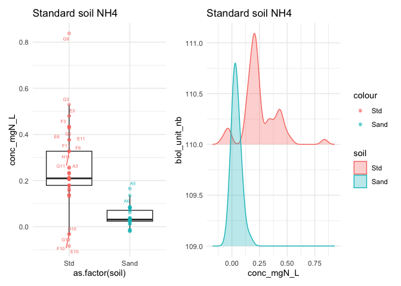

Multimodal curve –\> dig into per-sample view

<details class="code-fold">
<summary>Code</summary>

``` r
boxplot_std_nh4_2 <- Nmin_wash3 |> 
  filter(biol_unit_nb > 100, std_sp == "NH4") |> # 
  boxplot_conc(x = "map", colour = "soil") + 
  labs(title = "Standard soil NH4, per sample") + 
  theme(axis.text.x = element_text(angle = 90, hjust = 1))

ridges_std_nh4_2 <- Nmin_wash3 |> 
  filter(biol_unit_nb > 100, std_sp == "NH4") |> # exclude sand and conv soil std
  plot_ridges_conc(groups = "map", colour = "soil") + facet_wrap(~map) + 
  labs(title = "Standard soil NH4, per sample")

boxplot_std_nh4_2 + ridges_std_nh4_2 + plot_layout(guides = "collect")
```

</details>

    Picking joint bandwidth of 0.00618

    Picking joint bandwidth of 0.0131

    Picking joint bandwidth of 0.0195

    Picking joint bandwidth of 0.0186

    Picking joint bandwidth of 0.00655

    Picking joint bandwidth of 0.00635

    Picking joint bandwidth of 0.0195
    Picking joint bandwidth of 0.0195

    Picking joint bandwidth of 0.0126

    Picking joint bandwidth of 0.018

    Picking joint bandwidth of 0.0161

    Picking joint bandwidth of 0.0191

    Picking joint bandwidth of 0.00601

    Picking joint bandwidth of 0.00629

    Picking joint bandwidth of 0.0191

    Picking joint bandwidth of 0.00629
    Picking joint bandwidth of 0.00629

    Picking joint bandwidth of 0.00655
    Picking joint bandwidth of 0.00655

    Picking joint bandwidth of 0.0936

    Picking joint bandwidth of 0.296

    Picking joint bandwidth of 0.0126

    Picking joint bandwidth of 0.0804

    Picking joint bandwidth of 0.0126

    Picking joint bandwidth of 0.159

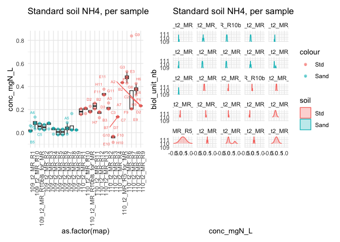

I find 2 wells to remove:

- plate 109_t2_MR_R8, well A5

- plate 110_t2_MR_R7, well G9

Let’s remove them and re-run the analysis

<details class="code-fold">
<summary>Code</summary>

``` r
samples <- c("109_t2_MR_R8", "110_t2_MR_R7")
wells <- c("A5", "G9")

to_remove <- Nmin_wash3 |> filter(
  ((map == samples[1] & well_id == wells[1]) |
    (map == samples[2] & well_id == wells[2])) &
    std_sp == "NH4"
)

Nmin_wash4 <- Nmin_wash3 |> remove_wells(to_remove)

boxplot_std_nh4_3 <- Nmin_wash4 |> 
  filter(biol_unit_nb > 100, std_sp == "NH4") |> 
  boxplot_conc(x = "map", colour = "soil") + 
  labs(title = "Standard soil NH4\nPer sample, outliers removed") + 
  theme(axis.text.x = element_text(angle = 90, hjust = 1))

ridges_std_nh4_3 <- Nmin_wash4 |> 
  filter(biol_unit_nb > 100, std_sp == "NH4") |> 
  plot_ridges_conc(groups = "map", colour = "soil") + 
  facet_wrap(~map) + labs(title = "Standard soil NH4\nPer sample, outliers removed")

boxplot_std_nh4_3 + ridges_std_nh4_3 + plot_layout(guides = "collect")
```

</details>

    Picking joint bandwidth of 0.00618

    Picking joint bandwidth of 0.0131

    Picking joint bandwidth of 0.0195

    Picking joint bandwidth of 0.0186

    Picking joint bandwidth of 0.00655

    Picking joint bandwidth of 0.00635

    Picking joint bandwidth of 0.0195
    Picking joint bandwidth of 0.0195

    Picking joint bandwidth of 0.0126

    Picking joint bandwidth of 0.0171

    Picking joint bandwidth of 0.0161

    Picking joint bandwidth of 0.0191

    Picking joint bandwidth of 0.00601

    Picking joint bandwidth of 0.00629

    Picking joint bandwidth of 0.0191

    Picking joint bandwidth of 0.00629
    Picking joint bandwidth of 0.00629

    Picking joint bandwidth of 0.00655
    Picking joint bandwidth of 0.00655

    Picking joint bandwidth of 0.0936

    Picking joint bandwidth of 0.296

    Picking joint bandwidth of 0.0126

    Picking joint bandwidth of 0.149

    Picking joint bandwidth of 0.0126

    Picking joint bandwidth of 0.159

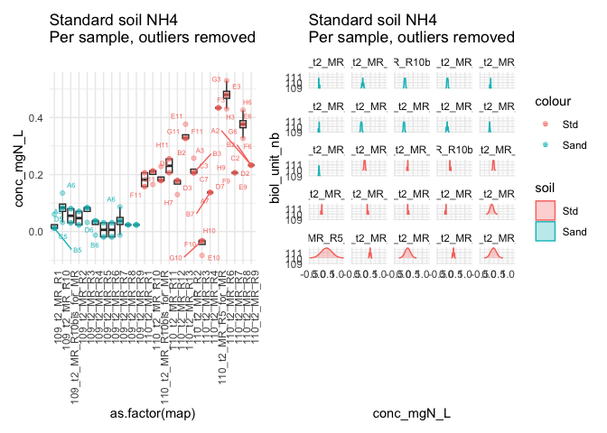

Compare before/after outlier removal

<details class="code-fold">
<summary>Code</summary>

``` r
boxplot_std_nh4_2 + boxplot_std_nh4_3 + plot_layout(guides = "collect")
```

</details>

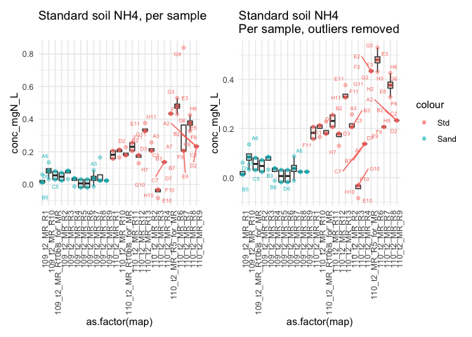

<details class="code-fold">
<summary>Code</summary>

``` r
ridges_std_nh4_2 + ridges_std_nh4_3 + plot_layout(guides = "collect")
```

</details>

    Picking joint bandwidth of 0.00618

    Picking joint bandwidth of 0.0131

    Picking joint bandwidth of 0.0195

    Picking joint bandwidth of 0.0186

    Picking joint bandwidth of 0.00655

    Picking joint bandwidth of 0.00635

    Picking joint bandwidth of 0.0195
    Picking joint bandwidth of 0.0195

    Picking joint bandwidth of 0.0126

    Picking joint bandwidth of 0.018

    Picking joint bandwidth of 0.0161

    Picking joint bandwidth of 0.0191

    Picking joint bandwidth of 0.00601

    Picking joint bandwidth of 0.00629

    Picking joint bandwidth of 0.0191

    Picking joint bandwidth of 0.00629
    Picking joint bandwidth of 0.00629

    Picking joint bandwidth of 0.00655
    Picking joint bandwidth of 0.00655

    Picking joint bandwidth of 0.0936

    Picking joint bandwidth of 0.296

    Picking joint bandwidth of 0.0126

    Picking joint bandwidth of 0.0804

    Picking joint bandwidth of 0.0126

    Picking joint bandwidth of 0.159

    Picking joint bandwidth of 0.00618

    Picking joint bandwidth of 0.0131

    Picking joint bandwidth of 0.0195

    Picking joint bandwidth of 0.0186

    Picking joint bandwidth of 0.00655

    Picking joint bandwidth of 0.00635

    Picking joint bandwidth of 0.0195
    Picking joint bandwidth of 0.0195

    Picking joint bandwidth of 0.0126

    Picking joint bandwidth of 0.0171

    Picking joint bandwidth of 0.0161

    Picking joint bandwidth of 0.0191

    Picking joint bandwidth of 0.00601

    Picking joint bandwidth of 0.00629

    Picking joint bandwidth of 0.0191

    Picking joint bandwidth of 0.00629
    Picking joint bandwidth of 0.00629

    Picking joint bandwidth of 0.00655
    Picking joint bandwidth of 0.00655

    Picking joint bandwidth of 0.0936

    Picking joint bandwidth of 0.296

    Picking joint bandwidth of 0.0126

    Picking joint bandwidth of 0.149

    Picking joint bandwidth of 0.0126

    Picking joint bandwidth of 0.159

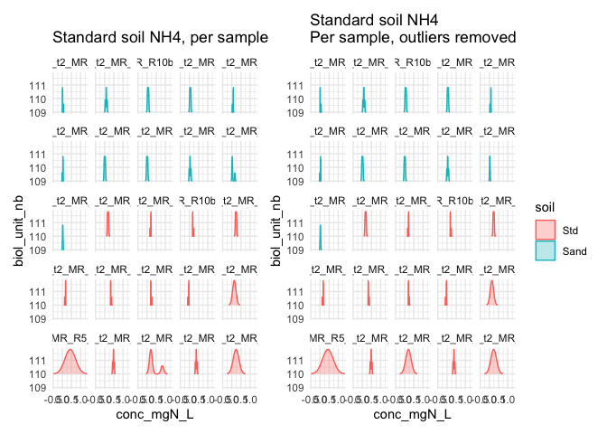

### 2.2.3 - NO2

For NO2, per standard

<details class="code-fold">
<summary>Code</summary>

``` r
boxplot_std_no2 <- Nmin_wash4 |> 
  filter(biol_unit_nb > 100, std_sp == "NO2") |> 
  boxplot_conc(x = "soil", colour = "soil") + labs(title = "Standard soil NO2")

ridges_std_no2 <- Nmin_wash4 |> 
  filter(biol_unit_nb > 100, std_sp == "NO2") |> 
  plot_ridges_conc(colour = "soil") + labs(title = "Standard soil NO2")

boxplot_std_no2 + ridges_std_no2 + plot_layout(guides = "collect")
```

</details>

    Picking joint bandwidth of 0.000704


Then per sample

<details class="code-fold">
<summary>Code</summary>

``` r
boxplot_std_no2_2 <- Nmin_wash4 |> 
  filter(biol_unit_nb > 100, std_sp == "NO2") |> 
  boxplot_conc(x = "map", colour = "soil") + 
  labs(title = "Standard soil NO2 per sample") + 
  theme(axis.text.x = element_text(angle = 90, hjust = 1))

ridges_std_no2_2 <- Nmin_wash4 |> 
  filter(biol_unit_nb > 100, std_sp == "NO2") |> 
  plot_ridges_conc(groups = "map", colour = "soil") + facet_wrap(~map) + 
  labs(title = "Standard soil NO2 per sample")

boxplot_std_no2_2 + ridges_std_no2_2 + plot_layout(guides = "collect")
```

</details>

    Picking joint bandwidth of 0.00054

    Picking joint bandwidth of 0.000887

    Picking joint bandwidth of 0.00408

    Picking joint bandwidth of 0.000904

    Picking joint bandwidth of 0.000177

    Picking joint bandwidth of 0.00336

    Picking joint bandwidth of 0.000348

    Picking joint bandwidth of 0.000174

    Picking joint bandwidth of 0.00059

    Picking joint bandwidth of 0.000559

    Picking joint bandwidth of 0.000181

    Picking joint bandwidth of 0.000174

    Picking joint bandwidth of 0.00848

    Picking joint bandwidth of 0.000539

    Picking joint bandwidth of 0.00054

    Picking joint bandwidth of 0.00408

    Picking joint bandwidth of 0.000549
    Picking joint bandwidth of 0.000549

    Picking joint bandwidth of 0.00744

    Picking joint bandwidth of 0.000191

    Picking joint bandwidth of 0.00018

    Picking joint bandwidth of 0.000174

    Picking joint bandwidth of 0.00226

    Picking joint bandwidth of 0.00018

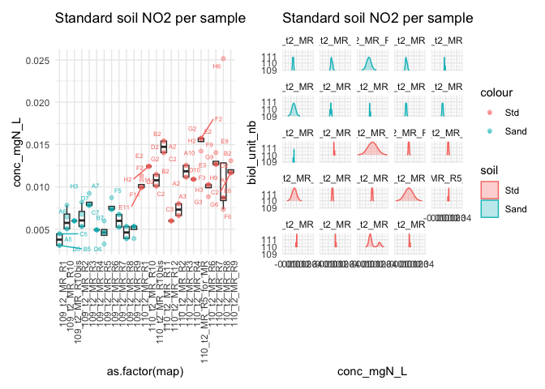

to remove: plate 110_t2_MR_R8, well H6

<details class="code-fold">
<summary>Code</summary>

``` r
to_remove <- Nmin_wash4 |> 
  filter(
    map == "110_t2_MR_R8",
    well_id == "H6",
    std_sp == "NO2")

Nmin_wash5 <- Nmin_wash4 |> remove_wells(to_remove)

boxplot_std_no2_3 <- Nmin_wash5 |> 
  filter(biol_unit_nb > 100, std_sp == "NO2") |> 
  boxplot_conc(x = "map", colour = "soil") + 
  labs(title = "Standard soil NO2\nPer sample, outliers removed") + 
  theme(axis.text.x = element_text(angle = 90, hjust = 1))

ridges_std_no2_3 <- Nmin_wash5 |> 
  filter(biol_unit_nb > 100, std_sp == "NO2") |> 
  plot_ridges_conc(groups = "map", colour = "soil") + facet_wrap(~map) + 
  labs(title = "Standard soil NO2\nPer sample, outliers removed")

boxplot_std_no2_2 + boxplot_std_no2_3 + plot_layout(guides = "collect")
```

</details>


<details class="code-fold">
<summary>Code</summary>

``` r
ridges_std_no2_2 + ridges_std_no2_3 + plot_layout(guides = "collect")
```

</details>

    Picking joint bandwidth of 0.00054

    Picking joint bandwidth of 0.000887

    Picking joint bandwidth of 0.00408

    Picking joint bandwidth of 0.000904

    Picking joint bandwidth of 0.000177

    Picking joint bandwidth of 0.00336

    Picking joint bandwidth of 0.000348

    Picking joint bandwidth of 0.000174

    Picking joint bandwidth of 0.00059

    Picking joint bandwidth of 0.000559

    Picking joint bandwidth of 0.000181

    Picking joint bandwidth of 0.000174

    Picking joint bandwidth of 0.00848

    Picking joint bandwidth of 0.000539

    Picking joint bandwidth of 0.00054

    Picking joint bandwidth of 0.00408

    Picking joint bandwidth of 0.000549
    Picking joint bandwidth of 0.000549

    Picking joint bandwidth of 0.00744

    Picking joint bandwidth of 0.000191

    Picking joint bandwidth of 0.00018

    Picking joint bandwidth of 0.000174

    Picking joint bandwidth of 0.00226

    Picking joint bandwidth of 0.00018

    Picking joint bandwidth of 0.00054

    Picking joint bandwidth of 0.000887

    Picking joint bandwidth of 0.00408

    Picking joint bandwidth of 0.000904

    Picking joint bandwidth of 0.000177

    Picking joint bandwidth of 0.00336

    Picking joint bandwidth of 0.000348

    Picking joint bandwidth of 0.000174

    Picking joint bandwidth of 0.00059

    Picking joint bandwidth of 0.000559

    Picking joint bandwidth of 0.000181

    Picking joint bandwidth of 0.000174

    Picking joint bandwidth of 0.00848

    Picking joint bandwidth of 0.000539

    Picking joint bandwidth of 0.00054

    Picking joint bandwidth of 0.00408

    Picking joint bandwidth of 0.000549
    Picking joint bandwidth of 0.000549

    Picking joint bandwidth of 0.00744

    Picking joint bandwidth of 0.000191

    Picking joint bandwidth of 0.00018

    Picking joint bandwidth of 0.000174

    Picking joint bandwidth of 0.000369

    Picking joint bandwidth of 0.00018

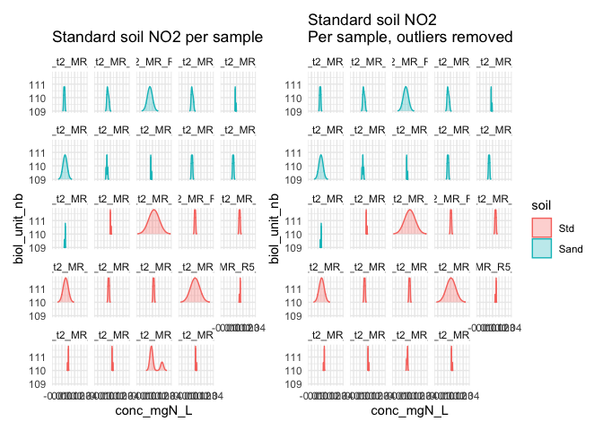

### 2.2.4 - All outliers removed Nmin

Visually, I am satisfied with this outlier removal, so I save this
cleaned table

<details class="code-fold">
<summary>Code</summary>

``` r
greenhouse_t2_Nmin_clean <- Nmin_wash5
```

</details>

## 2.3 - PMN

### 2.3.1 - NO3

<details class="code-fold">
<summary>Code</summary>

``` r
boxplot_pmn_no3 <- raw_greenhouse_PMN |> 
  filter(std_sp == "NO3") |> 
  boxplot_conc(x = "tech_rep") + facet_wrap(soil~incubation_time, scales = "free_y") + 
  labs(title = "NO3")

ridges_pmn_no3 <- raw_greenhouse_PMN |> 
  filter(std_sp == "NO3") |> 
  plot_ridges_conc(groups = "soil", colour = "tech_rep", y = "map") + 
  facet_wrap(~incubation_time, nrow = 1) + labs(title = "NO3")

# to be sure which well was out
# raw_greenhouse_PMN |> 
#   filter(std_sp == "NO3", soil == "Ref", incubation_time == "i4", tech_rep == "rt2") |> 
#   boxplot_conc(x = "tech_rep") + facet_wrap(soil~incubation_time) + labs(title = "NO3")


boxplot_pmn_no3 + ridges_pmn_no3 
```

</details>

    Picking joint bandwidth of 0.00936

    Picking joint bandwidth of 0.0127

    Picking joint bandwidth of 0.00953

    Picking joint bandwidth of 0.0145

    Picking joint bandwidth of 0.0161

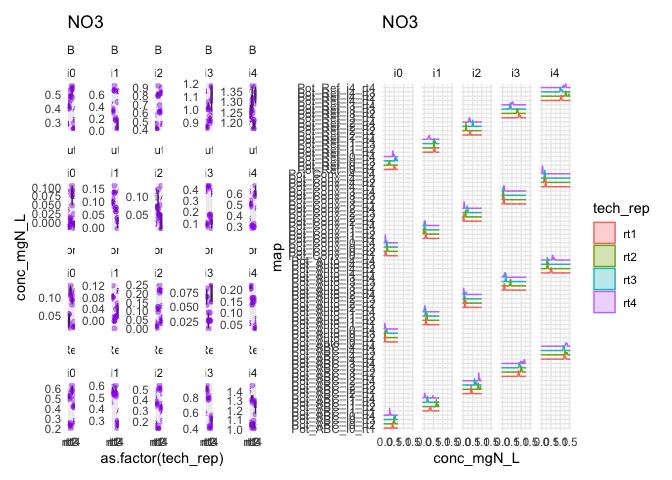

- Pot_ABC_i1_rt4: C7

- Pot_Ref_i4_rt2: H5

- Pot_Auto_i2_rt4: A10

<details class="code-fold">
<summary>Code</summary>

``` r
to_remove <- raw_greenhouse_PMN |> 
  filter((std_sp == "NO3") & 
    ((map == "Pot_ABC_i1_rt4" & well_id == "C7") | 
       (map == "Pot_Ref_i4_rt2" & well_id == "H5") |
       (map == "Pot_Auto_i2_rt4" & well_id == "A10")) 
  )

PMN_wash1 <- raw_greenhouse_PMN |> remove_wells(to_remove)

# check it out again
boxplot_pmn_no3_outlierfree <- PMN_wash1 |> 
  filter(std_sp == "NO3") |> 
  boxplot_conc(x = "tech_rep") + facet_wrap(soil~incubation_time, scales = "free_y") + 
  labs(title = "NO3, outlier removed")

ridges_pmn_no3_outlierfree <- PMN_wash1 |> 
  filter(std_sp == "NO3") |> 
  plot_ridges_conc(groups = "soil", colour = "tech_rep", y = "map") + 
  facet_wrap(~incubation_time, nrow = 1) + labs(title = "NO3, outlier removed")

boxplot_pmn_no3_outlierfree + ridges_pmn_no3_outlierfree
```

</details>

    Picking joint bandwidth of 0.00936

    Picking joint bandwidth of 0.00895

    Picking joint bandwidth of 0.00847

    Picking joint bandwidth of 0.0145

    Picking joint bandwidth of 0.0148

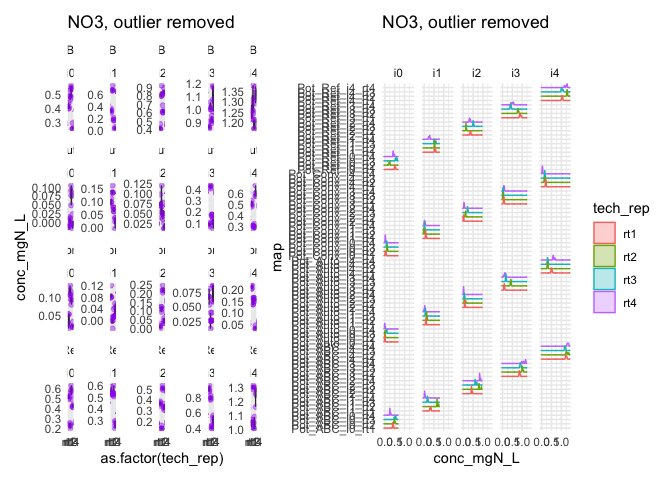

Compare before/after

<details class="code-fold">
<summary>Code</summary>

``` r
boxplot_pmn_no3 + boxplot_pmn_no3_outlierfree + plot_layout(guides = "collect")
```

</details>

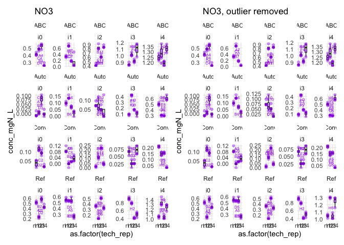

<details class="code-fold">
<summary>Code</summary>

``` r
ridges_pmn_no3 + ridges_pmn_no3_outlierfree + plot_layout(guides = "collect")
```

</details>

    Picking joint bandwidth of 0.00936

    Picking joint bandwidth of 0.0127

    Picking joint bandwidth of 0.00953

    Picking joint bandwidth of 0.0145

    Picking joint bandwidth of 0.0161

    Picking joint bandwidth of 0.00936

    Picking joint bandwidth of 0.00895

    Picking joint bandwidth of 0.00847

    Picking joint bandwidth of 0.0145

    Picking joint bandwidth of 0.0148

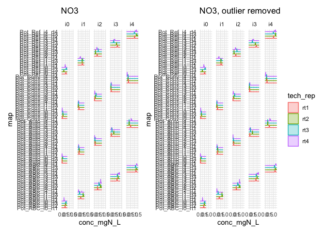

### 2.3.2 - NH4

<details class="code-fold">
<summary>Code</summary>

``` r
boxplot_pmn_nh4 <- PMN_wash1 |> 
  filter(std_sp == "NH4") |> 
  boxplot_conc(x = "tech_rep") + facet_wrap(soil~incubation_time) + 
  labs(title = "NH4")

ridges_pmn_nh4 <- PMN_wash1 |> 
  filter(std_sp == "NH4") |> 
  plot_ridges_conc(groups = "soil", colour = "tech_rep", y = "map") + 
  facet_wrap(~incubation_time, nrow = 1) + labs(title = "NH4")


boxplot_pmn_nh4 + ridges_pmn_nh4 
```

</details>

    Picking joint bandwidth of 0.0128

    Picking joint bandwidth of 0.0144

    Picking joint bandwidth of 0.016

    Picking joint bandwidth of 0.0138

    Picking joint bandwidth of 0.0188

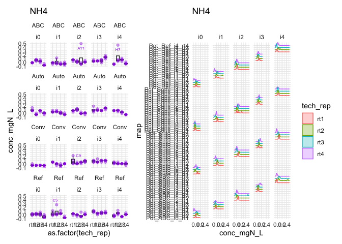

- Pot_ABC_i2_rt3: A11

- Pot_ABC_i4_rt2: H7

- Pot_Ref_i1_rt2: C5

<details class="code-fold">
<summary>Code</summary>

``` r
to_remove <- PMN_wash1 |> filter(
  (std_sp == "NH4") & 
    ((map == "Pot_ABC_i2_rt3" & well_id == "A11") |
    (map == "Pot_ABC_i4_rt2" & well_id == "H7") |
    (map == "Pot_Ref_i1_rt2" & well_id == "C5")))

PMN_wash2 <- PMN_wash1 |> remove_wells(to_remove)

boxplot_pmn_nh4_outlierfree <- PMN_wash2 |> 
  filter(std_sp == "NH4") |> 
  boxplot_conc(x = "tech_rep") + facet_wrap(soil~incubation_time) + 
  labs(title = "NH4, outliers removed")

ridges_pmn_nh4_outlierfree <- PMN_wash2 |> 
  filter(std_sp == "NH4") |> 
  plot_ridges_conc(groups = "soil", colour = "tech_rep", y = "map") + 
  facet_wrap(~incubation_time, nrow = 1) + labs(title = "NH4, outliers removed")


boxplot_pmn_nh4_outlierfree + ridges_pmn_nh4_outlierfree
```

</details>

    Picking joint bandwidth of 0.0128

    Picking joint bandwidth of 0.012

    Picking joint bandwidth of 0.0114

    Picking joint bandwidth of 0.0138

    Picking joint bandwidth of 0.0152


Compare before/after

<details class="code-fold">
<summary>Code</summary>

``` r
boxplot_pmn_nh4 + boxplot_pmn_nh4_outlierfree + plot_layout(guides = "collect")
```

</details>


<details class="code-fold">
<summary>Code</summary>

``` r
ridges_pmn_nh4 + ridges_pmn_nh4_outlierfree + plot_layout(guides = "collect")
```

</details>

    Picking joint bandwidth of 0.0128

    Picking joint bandwidth of 0.0144

    Picking joint bandwidth of 0.016

    Picking joint bandwidth of 0.0138

    Picking joint bandwidth of 0.0188

    Picking joint bandwidth of 0.0128

    Picking joint bandwidth of 0.012

    Picking joint bandwidth of 0.0114

    Picking joint bandwidth of 0.0138

    Picking joint bandwidth of 0.0152

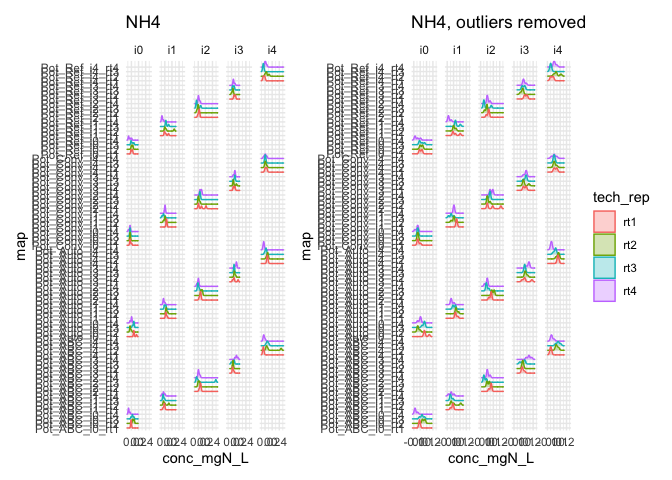

### 2.3.3 - NO2

<details class="code-fold">
<summary>Code</summary>

``` r
boxplot_pmn_no2 <- PMN_wash2 |> 
  filter(std_sp == "NO2") |> 
  boxplot_conc(x = "tech_rep") + facet_wrap(soil~incubation_time) + 
  labs(title = "NO2")

ridges_pmn_no2 <- PMN_wash2 |> 
  filter(std_sp == "NO2") |> 
  plot_ridges_conc(groups = "soil", colour = "tech_rep", y = "map") + 
  facet_wrap(~incubation_time, nrow = 1) + labs(title = "NO2")


boxplot_pmn_no2 + ridges_pmn_no2 
```

</details>

    Picking joint bandwidth of 0.00398

    Picking joint bandwidth of 0.00192

    Picking joint bandwidth of 0.0433

    Picking joint bandwidth of 0.0431

    Picking joint bandwidth of 0.0858

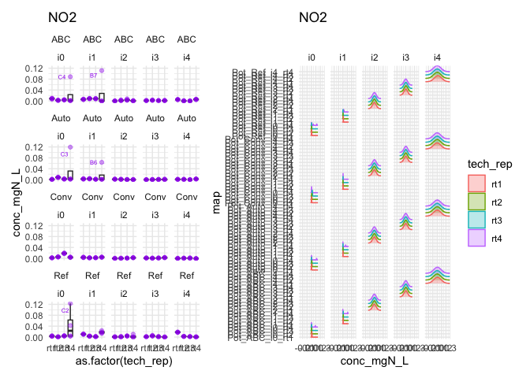

- Pot_ABC_i0_rt4: C4

- Pot_ABC_i1_rt4: B7

- Pot_Auto_i0_rt4: C3

- Pot_Auto_i1_rt4: B6

- Pot_Ref_i0_rt4: C2 & B2

<details class="code-fold">
<summary>Code</summary>

``` r
to_remove <- PMN_wash2 |> filter(
  (std_sp == "NO2") &
    ((map == "Pot_ABC_i0_rt4" & well_id == "C4") |
    (map == "Pot_ABC_i1_rt4" & well_id == "B7") |
    (map == "Pot_Auto_i0_rt4" & well_id == "C3") |
    (map == "Pot_Auto_i1_rt4" & well_id == "B6") |
    (map == "Pot_Ref_i0_rt4" & well_id %in% c("B2", "C2")))
)

PMN_wash3 <- PMN_wash2 |> remove_wells(to_remove)

boxplot_pmn_no2_outlierfree <- PMN_wash3 |> 
  filter(std_sp == "NO2") |> 
  boxplot_conc(x = "tech_rep") + facet_wrap(soil~incubation_time) + 
  labs(title = "NO2, outliers removed")

ridges_pmn_no2_outlierfree <- PMN_wash3 |> 
  filter(std_sp == "NO2") |> 
  plot_ridges_conc(groups = "soil", colour = "tech_rep", y = "map") + 
  facet_wrap(~incubation_time, nrow = 1) + labs(title = "NO2, outliers removed")


boxplot_pmn_no2_outlierfree + ridges_pmn_no2_outlierfree 
```

</details>

    Picking joint bandwidth of 0.000737

    Picking joint bandwidth of 0.000599

    Picking joint bandwidth of 0.0433

    Picking joint bandwidth of 0.0431

    Picking joint bandwidth of 0.0858

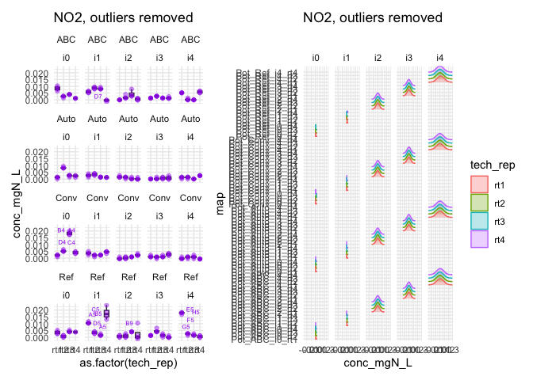

Compare before / after

<details class="code-fold">
<summary>Code</summary>

``` r
boxplot_pmn_no2 + boxplot_pmn_no2_outlierfree + plot_layout(guides = "collect")
```

</details>

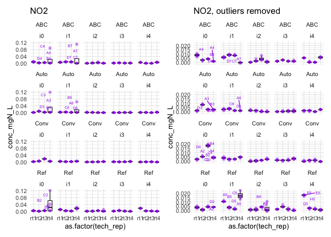

<details class="code-fold">
<summary>Code</summary>

``` r
ridges_pmn_no2 + ridges_pmn_no2_outlierfree + plot_layout(guides = "collect")
```

</details>

    Picking joint bandwidth of 0.00398

    Picking joint bandwidth of 0.00192

    Picking joint bandwidth of 0.0433

    Picking joint bandwidth of 0.0431

    Picking joint bandwidth of 0.0858

    Picking joint bandwidth of 0.000737

    Picking joint bandwidth of 0.000599

    Picking joint bandwidth of 0.0433

    Picking joint bandwidth of 0.0431

    Picking joint bandwidth of 0.0858

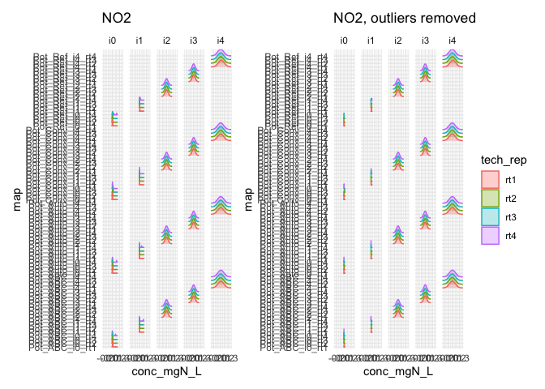

### 2.3.4 - All outliers removed PMN

Visually, I am satisfied with this outlier removal, so I save this
cleaned table

<details class="code-fold">
<summary>Code</summary>

``` r
greenhouse_t2_PMN_clean <- PMN_wash3
```

</details>

# 3 - Per-sample mean

## 3.1 - Nmin

<details class="code-fold">
<summary>Code</summary>

``` r
conc_mean_Nmin <- greenhouse_t2_Nmin_clean |> 
  select(map, plate_id, biol_unit_nb, std_sp, conc_mgN_L) |> 
  group_by(plate_id, map, biol_unit_nb, std_sp) |> 
  summarise(
    mean = mean(conc_mgN_L),
    st_dev = sd(conc_mgN_L)) |> 
  mutate(coef_var = 100*st_dev / mean) |> 
  rename(conc_mgN_L = mean)
```

</details>

    `summarise()` has regrouped the output.
    ℹ Summaries were computed grouped by plate_id, map, biol_unit_nb, and std_sp.
    ℹ Output is grouped by plate_id, map, and biol_unit_nb.
    ℹ Use `summarise(.groups = "drop_last")` to silence this message.
    ℹ Use `summarise(.by = c(plate_id, map, biol_unit_nb, std_sp))` for
      per-operation grouping (`?dplyr::dplyr_by`) instead.

<details class="code-fold">
<summary>Code</summary>

``` r
conc_mean_Nmin |> arrange(desc(std_sp), desc(coef_var))
```

</details>

    # A tibble: 253 × 7
    # Groups:   plate_id, map, biol_unit_nb [253]
       plate_id  map   biol_unit_nb std_sp conc_mgN_L  st_dev coef_var
       <chr>     <chr>        <dbl> <chr>       <dbl>   <dbl>    <dbl>
     1 NO3_2P2   77_t2           77 NO3       0.00128 0.00889    693. 
     2 NO3_2P4   78_t2           78 NO3       0.00370 0.0121     327. 
     3 NO3_2P1   75_t2           75 NO3       0.00557 0.0142     255. 
     4 NO3_2P5   59_t2           59 NO3       0.00575 0.0125     218. 
     5 NO3_2P2   47_t2           47 NO3       0.00770 0.00770    100  
     6 NO3_2P3   57_t2           57 NO3       0.0494  0.0316      64.1
     7 NO3_2P5   65_t2           65 NO3       0.0632  0.0147      23.2
     8 NO3_2P6_2 51_t2           51 NO3       0.0413  0.00867     21.0
     9 NO3_2P2   23_t2           23 NO3       0.0385  0.00770     20  
    10 NO3_2P6_1 33_t2           33 NO3       0.0751  0.0144      19.1
    # ℹ 243 more rows

<details class="code-fold">
<summary>Code</summary>

``` r
conc_mean_Nmin |> filter(coef_var > 10) |> 
  ggplot(aes(x = coef_var)) + geom_histogram()
```

</details>

    `stat_bin()` using `bins = 30`. Pick better value `binwidth`.


We still have quite a few samples with a high between-wells coefficient
of variation. But with only 3 to 4 wells and sometimes very low values,
this is unavoidable, so we move on

Now, finally, we re-join this mean value to the rest of the relevant
information from the absorbance dataset

<details class="code-fold">
<summary>Code</summary>

``` r
conc_Nmin_export_ready <- conc_mean_Nmin |> 
  inner_join(
    raw_greenhouse_t2_Nmin |> 
      select(!c(well_id:abs_corrected, starts_with("conc"))) |> 
      unique())
```

</details>

    Joining with `by = join_by(plate_id, map, biol_unit_nb, std_sp)`

## 3.2 - PMN

<details class="code-fold">
<summary>Code</summary>

``` r
conc_mean_PMN <- greenhouse_t2_PMN_clean |> 
  select(map, plate_id, biol_unit_nb, std_sp, conc_mgN_L) |> 
  group_by(map, biol_unit_nb, std_sp) |> 
  summarise(
    mean = mean(conc_mgN_L),
    st_dev = sd(conc_mgN_L)) |> 
  mutate(coef_var = 100*st_dev / mean) |> 
  rename(conc_mgN_L = mean)
```

</details>

    `summarise()` has regrouped the output.
    ℹ Summaries were computed grouped by map, biol_unit_nb, and std_sp.
    ℹ Output is grouped by map and biol_unit_nb.
    ℹ Use `summarise(.groups = "drop_last")` to silence this message.
    ℹ Use `summarise(.by = c(map, biol_unit_nb, std_sp))` for per-operation
      grouping (`?dplyr::dplyr_by`) instead.

<details class="code-fold">
<summary>Code</summary>

``` r
conc_mean_PMN |> arrange(desc(std_sp), desc(coef_var))
```

</details>

    # A tibble: 240 × 6
    # Groups:   map, biol_unit_nb [80]
       map             biol_unit_nb std_sp conc_mgN_L  st_dev coef_var
       <chr>           <chr>        <chr>       <dbl>   <dbl>    <dbl>
     1 Pot_Auto_i0_rt2 Pot_Auto     NO3       0.00507 0.00781    154. 
     2 Pot_Conv_i2_rt1 Pot_Conv     NO3       0.0120  0.0112      93.3
     3 Pot_Auto_i1_rt4 Pot_Auto     NO3       0.0236  0.0191      80.8
     4 Pot_Conv_i1_rt3 Pot_Conv     NO3       0.0188  0.0137      72.7
     5 Pot_Conv_i1_rt4 Pot_Conv     NO3       0.0345  0.0207      60  
     6 Pot_Conv_i0_rt1 Pot_Conv     NO3       0.0359  0.0205      57.1
     7 Pot_Auto_i2_rt4 Pot_Auto     NO3       0.0146  0.00779     53.3
     8 Pot_Auto_i2_rt2 Pot_Auto     NO3       0.0693  0.0356      51.3
     9 Pot_ABC_i1_rt4  Pot_ABC      NO3       0.0326  0.0156      47.8
    10 Pot_Conv_i3_rt2 Pot_Conv     NO3       0.0256  0.0112      43.5
    # ℹ 230 more rows

<details class="code-fold">
<summary>Code</summary>

``` r
conc_mean_PMN |> filter(coef_var > 10) |> 
  ggplot(aes(x = coef_var)) + geom_histogram()
```

</details>

    `stat_bin()` using `bins = 30`. Pick better value `binwidth`.

    Warning: Removed 1 row containing non-finite outside the scale range
    (`stat_bin()`).

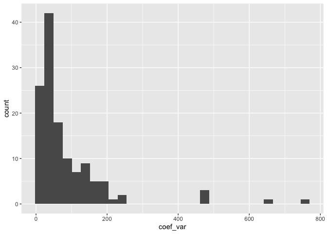

Same here, there are still quite a few samples with a high coefficient
of variation, but with only 3 to 4 wells and sometimes very low values,
this is unavoidable, so we move on

Now, we can add the data on wc to get a full dataset

<details class="code-fold">
<summary>Code</summary>

``` r
conc_PMN_export_ready <- conc_mean_PMN |> left_join(pmn_wc)
```

</details>

    Joining with `by = join_by(biol_unit_nb)`

# 4 - Export

<details class="code-fold">
<summary>Code</summary>

``` r
raw_greenhouse_t2 |> write_rds("output/data/3_greenhouse_t2_raw_lab.rds")
conc_Nmin_export_ready |> write_rds("output/data/3_greenhouse_t2_Nmin_clean.rds")
conc_PMN_export_ready |> write_rds("output/data/3_greenhouse_PMN_clean.rds")
```

</details>
