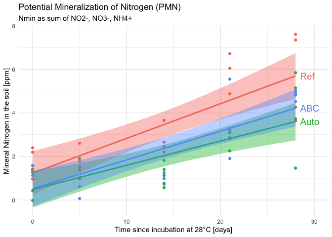
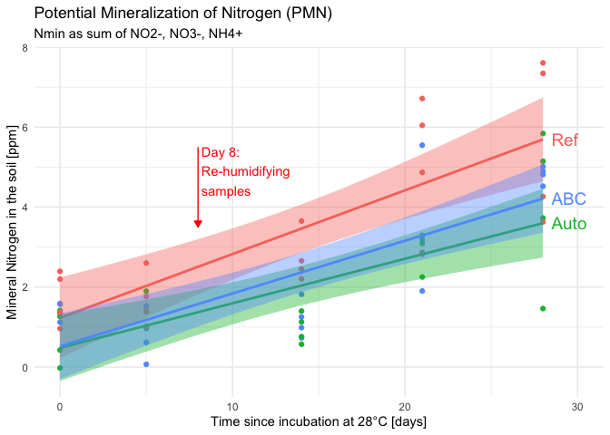
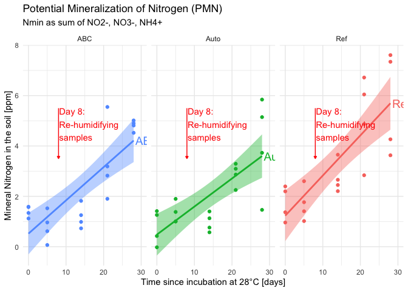

# 4.1 Field t2 - Data wrangling


- [TO DO](#to-do)
- [Intro](#intro)
- [Set up](#set-up)
- [1 - Subset data](#1---subset-data)
  - [1.1 - Flush data (from K2SO4
    extraction)](#11---flush-data-from-k2so4-extraction)
  - [1.2 - Nmin data (from absorbance
    pipeline)](#12---nmin-data-from-absorbance-pipeline)
  - [1.3 - fw for PMN](#13---fw-for-pmn)
- [2 - Compute new variables](#2---compute-new-variables)
  - [2.1 - dry matter content (t2
    samples)](#21---dry-matter-content-t2-samples)
    - [2.1.1 - Principle and equations](#211---principle-and-equations)
    - [2.1.2 - Pivot data so that technical replicates are above each
      other, not next to each
      other](#212---pivot-data-so-that-technical-replicates-are-above-each-other-not-next-to-each-other)
  - [2.2 - Nmin concentrations in ppm (t2
    samples)](#22---nmin-concentrations-in-ppm-t2-samples)
    - [TO DO: deal with standard soils](#to-do-deal-with-standard-soils)
  - [2.3 - PMN concentration in ppm](#23---pmn-concentration-in-ppm)
  - [2.4 - Derive MBC from TDN](#24---derive-mbc-from-tdn)
    - [TO DO: check dilution etc. in the TDN protocol: diluted 2x at
      hood, but also headspace etc. –\> think it
      through!](#to-do-check-dilution-etc-in-the-tdn-protocol-diluted-2x-at-hood-but-also-headspace-etc--think-it-through)
  - [2.5 - Yield variables](#25---yield-variables)
  - [2.6 - Join all data (except PMN)](#26---join-all-data-except-pmn)
    - [TODO: Missing samples from the start ? –\>
      check!](#todo-missing-samples-from-the-start---check)
- [3 - Deal with standard soils](#3---deal-with-standard-soils)
- [**°°° !!! TO DO !!! °°°**](#--to-do--)
- [4 - Export](#4---export)

# TO DO

- Incorporate

  - PNR

  - Nmin t3?

  - MicroResp

- Deal with standard soils.

  - Problem: they have same biological unit nb. –\> a preliminary
    outlier removal needs to be ran separately, then average per
    biol_unit_nb, then it can be rejoined…

- Move the PMN curve to script nb 5 ?

# Intro

What failed:

- PMN? (see graphs below) –\> re-humidification necessary, curve failed

- yield at t2

  - quadrat: mess in the data - misunderstanding from colleagues at the
    field

  - plant-level: was interesting to compare to RS measurements, but
    possibly biased as an absolute measure of yield bc in IC: plants
    were selected for being close to each other -\> possibly not
    representative of the field

# Set up

<details class="code-fold">
<summary>Code</summary>

``` r
# clean environment
rm(list = ls())

# packages
library(tidyverse)
library(ggridges) # for geom_density_ridges()
library(ggrepel) # for geom_text_repel()
library(patchwork)
library(janitor)

# data
lab <- read_rds("output/data/3_field_t2_raw_lab.rds")
Nmin <- read_rds("output/data/3_field_t2_Nmin_clean.rds") 
PMN <- read_rds("output/data/3_field_PMN_clean.rds")
TDN <- read_rds("output/data/3_field_TDN_clean.rds")
yield <- read_rds("output/data/3_field_yield_clean.rds")
PMN_fw <- read_csv("raw_data/PMN/PMN_fw.csv") |> clean_names()
#lm_output <- read_rds("output/data/2_lm_output_noTDN.rds")
```

</details>

# 1 - Subset data

## 1.1 - Flush data (from K2SO4 extraction)

<details class="code-fold">
<summary>Code</summary>

``` r
raw_flush <- lab |> 
  select(!starts_with(c("yd", "whc", "rt")) & !run_id_mr) |> 
  # remove bloc 1
  filter_out(bloc == "B1")
```

</details>

## 1.2 - Nmin data (from absorbance pipeline)

<details class="code-fold">
<summary>Code</summary>

``` r
Nmin_sample <- Nmin |> 
  filter(biol_unit_nb < 112) 
Nmin_std <- Nmin |> filter_out(biol_unit_nb < 112) 
```

</details>

## 1.3 - fw for PMN

The PMN data is missing 1 key information: weight of fresh soil in the
sub-sample that undergoes the KCl extraction.

<details class="code-fold">
<summary>Code</summary>

``` r
PMN_fw_field <- PMN_fw |> filter(expe == "Field")
```

</details>

# 2 - Compute new variables

## 2.1 - dry matter content (t2 samples)

### 2.1.1 - Principle and equations

In this data set, dry matter and water content have not yet been
computed. The raw data with 3 technical replicates is encoded, in
separate columns starting with `flush_dm...`\`. In this section, we
compute average dry matter and water content for the sample (across
technical replicates). We add additional columns with intermediary
results:

- FW<sub>neat</sub> = FW<sub>gross</sub> - tare ; DW<sub>neat</sub> =
  DW<sub>gross</sub> - tare

- average (FW, then DW) = sum(3 technical replicates) / 3

- DM = avg<sub>DW</sub> / avg<sub>FW</sub>

- WC = 1 - DM

- With

  - FW = fresh weight \[g\]

  - DW = dry weight \[g\],

  - DM = dry matter content \[g<sub>dry soil</sub> /
    g<sub>fresh soil</sub>\],

  - WC = water content \[g<sub>water</sub> / g<sub>fresh soil</sub>\]
    <u>**!! UNIT: per g fresh soil !!**</u>

- ratio = fresh weight of soil added into tubes for extraction (~10g) /
  volume of extractant added (=20ml)

Then, we can finally convert concentrations in mg/L into concentrations
in ppm (mg/kg dry soil)

- see <https://mycloud.ulb.be/index.php/s/9ZKaJg9rXJg4iB7> for equation

### 2.1.2 - Pivot data so that technical replicates are above each other, not next to each other

First, we select relevant columns and pivot to get

- one column respectively for tare, gross fresh weight (g_fw) and gross
  dry weight (g_dw)

- 1 row per technical replicate

<details class="code-fold">
<summary>Code</summary>

``` r
raw_subset_wc <- raw_flush |> 
  select(sample_short, flush_dm_tare_tr1:flush_dm_g_dw_tr3) |> 
  pivot_longer(
    cols = !sample_short,
    names_pattern = "flush_dm_(g_fw|g_dw|tare)_tr(\\d)",
    names_to = c(".value", "tech_rep"),
    values_to = "weight") 

# check it out
raw_subset_wc 
```

</details>

    # A tibble: 186 × 5
       sample_short tech_rep  tare  g_fw  g_dw
       <chr>        <chr>    <dbl> <dbl> <dbl>
     1 t2_81_z1     1         4.16  15    13  
     2 t2_81_z1     2         4.14  14.8  12.9
     3 t2_81_z1     3         4.16  13.5  11.8
     4 t2_81_z2     1         4.1   14.7  12.8
     5 t2_81_z2     2         4.18  15.5  13.4
     6 t2_81_z2     3         4.17  13.3  11.6
     7 t2_81_z3     1         4.16  12.6  11  
     8 t2_81_z3     2         4.15  13.6  11.9
     9 t2_81_z3     3         4.14  14    12.2
    10 t2_82_z1     1         4.15  14.2  12.4
    # ℹ 176 more rows

Then, we

- compute the neat fresh weight and dry weight for each row, and the dry
  matter content and water content

- Compute the average per sample (over the technical triplicate)

<details class="code-fold">
<summary>Code</summary>

``` r
wc <- raw_subset_wc |> 
  # compute neat values
  mutate(
    n_fw = g_fw - tare,
    n_dw = g_dw - tare,
    dm = n_dw / n_fw,
    wc = 1 - dm,
    .keep = "unused"
  ) |> 
  # compute mean per sample
  summarize(
    .by = sample_short,
    dm = mean(dm),
    wc = mean(wc)
  ) 

# check it out
wc 
```

</details>

    # A tibble: 62 × 3
       sample_short    dm    wc
       <chr>        <dbl> <dbl>
     1 t2_81_z1     0.819 0.181
     2 t2_81_z2     0.819 0.181
     3 t2_81_z3     0.816 0.184
     4 t2_82_z1     0.821 0.179
     5 t2_82_z2     0.822 0.178
     6 t2_82_z3     0.824 0.176
     7 t2_83_z1     0.823 0.177
     8 t2_83_z2     0.829 0.171
     9 t2_83_z3     0.818 0.182
    10 t2_84_z1     0.831 0.169
    # ℹ 52 more rows

Now that we have that clean data, we can

- remove useless columns (raw data used above)

- rejoin it to the complete greenhouse data (with all columns)

- compute each sample’s individual “ratio” (~10g/20ml)

<details class="code-fold">
<summary>Code</summary>

``` r
# Volume of extractant used in the K2SO4 extraction
vol_extr <- 20 

flush_clean <- raw_flush |> 
  select(
    !flush_dm_tare_tr1:flush_dm_g_dw_tr3 & 
      !ends_with("comment")) |> 
  left_join(wc) |> 
  mutate(
    ratio_nf = flush_fw_nf_g / vol_extr,
    ratio_cfe = flush_fw_cfe_g / vol_extr,
    .keep = "unused") 
```

</details>

    Joining with `by = join_by(sample_short)`

<details class="code-fold">
<summary>Code</summary>

``` r
flush_clean
```

</details>

    # A tibble: 62 × 14
       biol_unit_nb expe  sample_short soil  crop_diversity cs    bloc 
              <dbl> <chr> <chr>        <fct> <fct>          <fct> <fct>
     1           81 Field t2_81_z1     ABC   IC             IC    B2   
     2           81 Field t2_81_z2     ABC   IC             IC    B2   
     3           81 Field t2_81_z3     ABC   IC             IC    B2   
     4           82 Field t2_82_z1     ABC   SC             W     B2   
     5           82 Field t2_82_z2     ABC   SC             W     B2   
     6           82 Field t2_82_z3     ABC   SC             W     B2   
     7           83 Field t2_83_z1     ABC   SC             W     B3   
     8           83 Field t2_83_z2     ABC   SC             W     B3   
     9           83 Field t2_83_z3     ABC   SC             W     B3   
    10           84 Field t2_84_z1     ABC   IC             IC    B4   
    # ℹ 52 more rows
    # ℹ 7 more variables: sampling_time <chr>, zone <chr>, sample_name <chr>,
    #   dm <dbl>, wc <dbl>, ratio_nf <dbl>, ratio_cfe <dbl>

Now, we divide the data in 2 subsets: sample data and standard soil data
(several reps, messes up the analysis (for now))

<details class="code-fold">
<summary>Code</summary>

``` r
flush_sample <- flush_clean |> filter(biol_unit_nb < 112)
flush_std <- flush_clean |> filter_out(biol_unit_nb < 112)
```

</details>

## 2.2 - Nmin concentrations in ppm (t2 samples)

First, we

- join absorbance data and flush data,

- Compute the N-sp N concentration in ppm (e.g. mg NO3-N / kg dry soil)

- do some data housecleaning

<details class="code-fold">
<summary>Code</summary>

``` r
Nmin_sample |> arrange(biol_unit_nb, zone) 
```

</details>

    # A tibble: 202 × 12
       plate_id  map      biol_unit_nb zone  std_sp conc_mgN_L dataset  cs    soil 
       <chr>     <chr>           <dbl> <chr> <chr>       <dbl> <chr>    <fct> <fct>
     1 NH4_2F4_2 81_t2_z1           81 z1    NH4       0.117   Nmint1t2 IC    ABC  
     2 NO2_2F4_2 81_t2_z1           81 z1    NO2       0.00290 Nmint1t2 IC    ABC  
     3 NO3_2F4_2 81_t2_z1           81 z1    NO3       1.37    Nmint1t2 IC    ABC  
     4 NH4_2F3_2 81_t2_z2           81 z2    NH4       0.121   Nmint1t2 IC    ABC  
     5 NO2_2F3_2 81_t2_z2           81 z2    NO2       0.00346 Nmint1t2 IC    ABC  
     6 NO3_2F3_2 81_t2_z2           81 z2    NO3       2.01    Nmint1t2 IC    ABC  
     7 NH4_2F4_1 81_t2_z3           81 z3    NH4       0.0493  Nmint1t2 IC    ABC  
     8 NO2_2F4_1 81_t2_z3           81 z3    NO2       0.00256 Nmint1t2 IC    ABC  
     9 NO3_2F4_1 81_t2_z3           81 z3    NO3       1.96    Nmint1t2 IC    ABC  
    10 NH4_2F3_2 82_t2_z1           82 z1    NH4       0.121   Nmint1t2 W     ABC  
    # ℹ 192 more rows
    # ℹ 3 more variables: sampling_time <chr>, expe <chr>, std_unit <chr>

<details class="code-fold">
<summary>Code</summary>

``` r
Nmin_ppm_sample <- Nmin_sample |> 
  # join both data tables
  left_join(flush_sample) |> 
  # remove bloc 1 again
  filter_out(is.na(bloc)) |> 
  # compute concentration in ppm
  mutate(conc_ppm = conc_mgN_L / (ratio_nf * dm)) |> 
  # select relevant columns
  select(!c(
    #dataset, 
    expe, 
    std_unit, 
    starts_with("sampl"), starts_with("ratio"),
    map, plate_id, conc_mgN_L)) |> 
  arrange(biol_unit_nb)
```

</details>

    Joining with `by = join_by(biol_unit_nb, zone, cs, soil, sampling_time, expe)`

<details class="code-fold">
<summary>Code</summary>

``` r
# Check it out
Nmin_ppm_sample
```

</details>

    # A tibble: 148 × 11
       biol_unit_nb zone  std_sp dataset  cs    soil  crop_diversity bloc     dm
              <dbl> <chr> <chr>  <chr>    <fct> <fct> <fct>          <fct> <dbl>
     1           81 z2    NH4    Nmint1t2 IC    ABC   IC             B2    0.819
     2           81 z3    NH4    Nmint1t2 IC    ABC   IC             B2    0.816
     3           81 z1    NH4    Nmint1t2 IC    ABC   IC             B2    0.819
     4           81 z2    NO2    Nmint1t2 IC    ABC   IC             B2    0.819
     5           81 z3    NO2    Nmint1t2 IC    ABC   IC             B2    0.816
     6           81 z1    NO2    Nmint1t2 IC    ABC   IC             B2    0.819
     7           81 z2    NO3    Nmint1t2 IC    ABC   IC             B2    0.819
     8           81 z3    NO3    Nmint1t2 IC    ABC   IC             B2    0.816
     9           81 z1    NO3    Nmint1t2 IC    ABC   IC             B2    0.819
    10           82 z2    NH4    Nmint1t2 W     ABC   SC             B2    0.822
    # ℹ 138 more rows
    # ℹ 2 more variables: wc <dbl>, conc_ppm <dbl>

Now, we pivot the data so that each N-sp receives its own column

<details class="code-fold">
<summary>Code</summary>

``` r
Nmin_ppm_wider <- Nmin_ppm_sample |>
  pivot_wider(
    names_from = std_sp,
    values_from = conc_ppm,
    names_prefix = "ppm_"
  ) |> 
  # to make obvious that NO3 is still uncorrected
  rename(ppm_NO3_uncorrected = ppm_NO3)
```

</details>

Then we can compute final Nmin variables:

- correct NO3 value (what is measured is the sum of NO3 and NO2, bc we
  measure NO2 after reduction of NO3 to NO2)

- Compute Nmin (= NO3 + NO2 + NH4)

- Compute ratio, e.g., NO3/Nmin, NH4/Nmin, NO3/NH4

<details class="code-fold">
<summary>Code</summary>

``` r
Nmin_all_variables <- Nmin_ppm_wider |> 
  mutate(
    ppm_NO3 = ppm_NO3_uncorrected - ppm_NO2,
    ppm_Nmin = ppm_NO3_uncorrected + ppm_NH4,
    NO3_Nmin = ppm_NO3 / ppm_Nmin,
    NH4_Nmin = ppm_NH4 / ppm_Nmin,
    NO3_NH4 = ppm_NO3 / ppm_NH4
  ) |> 
  # remove uncorrected NO3
  select(!ppm_NO3_uncorrected)
```

</details>

### TO DO: deal with standard soils

## 2.3 - PMN concentration in ppm

Here, we

- join PMN_fw (data set containing fresh weight of the subsample that
  underwent the incubation) with the absorbance derived concentration
  data in mg N / L
- compute the ratio between weight of fresh soil and volume of
  extractant (150ml) –\> ~30g/150ml
- Derive the concentration in ppm from mg N/L, ratio and dry matter

<details class="code-fold">
<summary>Code</summary>

``` r
volume_kcl <- 150
PMN_ppm <- PMN |> 
  left_join(PMN_fw_field) |> 
  mutate(
    ratio = fw / volume_kcl,
    conc_ppm = conc_mgN_L / (ratio * dm)
  )
```

</details>

    Joining with `by = join_by(map, soil, expe)`

Now, we want the concentration in separate columns as above for Nmin,

<details class="code-fold">
<summary>Code</summary>

``` r
PMN_wider <- PMN_ppm |> 
  pivot_wider(
  names_from = std_sp,
  names_prefix = "ppm_",
  values_from = conc_ppm,
  id_cols = c(map, biol_unit_nb, soil, dm, wc, expe, incub_time, tech_rep, fw, ratio)
) |> 
  rename(ppm_NO3_uncorrected = ppm_NO3)
```

</details>

Then, we can do the NO3 correction and other computation of variables

<details class="code-fold">
<summary>Code</summary>

``` r
dates <- c("2023-12-12", "2023-12-17", "2023-12-26", "2024-01-02", "2024-01-09") |> as.Date()
incub_days <- dates - dates[1]
names(incub_days) <- PMN_wider$incub_time |> unique() |> sort()

PMN_all_variables <- PMN_wider |> 
  mutate(
    ppm_NO3 = ppm_NO3_uncorrected - ppm_NO2,
    ppm_Nmin = ppm_NO3_uncorrected + ppm_NH4,
    NO3_Nmin = ppm_NO3 / ppm_Nmin,
    NH4_Nmin = ppm_NH4 / ppm_Nmin,
    NO3_NH4 = ppm_NO3 / ppm_NH4,
    incub_day = incub_days[incub_time],
    soil = factor(soil, levels = c("Ref", "Auto", "ABC"))
  ) |> 
  # remove uncorrected NO3
  select(!ppm_NO3_uncorrected) #|> 
  # test with only last 3 incub times
  #filter(incub_time %in% c("i2", "i3", "i4"))

#check correspondence incubation vs dates
PMN_all_variables |> ungroup() |> select(incub_time, incub_day) |> unique()
```

</details>

    # A tibble: 5 × 2
      incub_time incub_day
      <chr>      <drtn>   
    1 i0          0 days  
    2 i1          5 days  
    3 i2         14 days  
    4 i3         21 days  
    5 i4         28 days  

Finally, we ca compute the slope of the curve.

> [!IMPORTANT]
>
> ### Statistical issue
>
> We have 4 technical replicates per incubation time, but rep 1 of
> incubation time 1 has no particular relationship to rep 1 of
> incubation time 2. It would make little sense to compute 4 different
> slopes and then take the mean of the 4 slopes to get a boxplot and the
> option of an anova with comparison of means (of slopes).

According to AI (see full doc):

- ANCOVA, (independant measurements bc subsamples evolve separately) .

  - linear model with interaction term: outcome ~ group \* predictor

  - –\> try with lm(ppm_Nmin ~ soil \* incub_days)

  - Details see doc

Finally, we can plot the curve of the potential mineralization of
Nitrogen (PMN)

<details class="code-fold">
<summary>Code</summary>

``` r
PMN_plot <- PMN_all_variables |> 
  ggplot(aes(x = incub_day, y = ppm_Nmin, group = soil, colour = soil, fill = soil)) +
  theme_minimal() +
  geom_point() +
  geom_smooth(method = "lm") +
  labs(
    title = "Potential Mineralization of Nitrogen (PMN)",
    subtitle = "Nmin as sum of NO2-, NO3-, NH4+") +
  xlab("Time since incubation at 28°C [days]") +
  ylab("Mineral Nitrogen in the soil [ppm]")

# for annotation: extract data from smooth curve
smooth_data <- ggplot_build(PMN_plot)$data[[2]]
```

</details>

    Don't know how to automatically pick scale for object of type <difftime>.
    Defaulting to continuous.
    `geom_smooth()` using formula = 'y ~ x'

<details class="code-fold">
<summary>Code</summary>

``` r
# get its maximum value to anker the annotation
annotations <- smooth_data |> 
  slice_max(x, by = group) |> 
  mutate(soil = levels(PMN_all_variables$soil))
#c("#F8766D", "#7CAE00", "#00BFC4", "#C77CFF") 

# Also annotate date of humidification
day_water <- as.Date("2023-12-20")
  
PMN_plot_all <- PMN_plot + 
  geom_text(
    data = annotations,
    aes(x = x+0.5, y = y, colour = soil, label = soil), 
    hjust = 0, size = 5) +
  xlim(c(0,30)) +
  theme(legend.position = "none") 
```

</details>

Looks nice, but if we facet… The curves… are not linear at all. Probably
due to re-humidification in-between:

<details class="code-fold">
<summary>Code</summary>

``` r
PMN_plot_all_annotated <- PMN_plot_all +
  annotate(
    geom = "segment", colour = "red",
    x = day_water - dates[1], xend = day_water - dates[1],
    y = 5.5, yend = 3.5,
    arrow = arrow(type = "closed", length = unit(0.02, "npc"))) +
  annotate(
    geom = "text", colour = "red",
    x = day_water - dates[1] + 0.2,
    y = 5.5, hjust = 0, vjust = 1,
    label = paste0("Day ", day_water - dates[1],":\nRe-humidifying\nsamples")
  )

PMN_plot_all_annotated
```

</details>

    `geom_smooth()` using formula = 'y ~ x'


Look at all 3 versions

<details class="code-fold">
<summary>Code</summary>

``` r
PMN_plot_all
```

</details>

    `geom_smooth()` using formula = 'y ~ x'



<details class="code-fold">
<summary>Code</summary>

``` r
PMN_plot_all_annotated
```

</details>

    `geom_smooth()` using formula = 'y ~ x'



<details class="code-fold">
<summary>Code</summary>

``` r
PMN_plot_all_annotated + facet_wrap(~soil)
```

</details>

    `geom_smooth()` using formula = 'y ~ x'



–\> I would plead for the abandon of this measure

## 2.4 - Derive MBC from TDN

First, as for the other data sets, we need to derive N concentration in
ppm, using `conc_mgN_L`, `ratio` and `dm`. For this, we can re-use the
flush data

<details class="code-fold">
<summary>Code</summary>

``` r
# no ratio nor dm in TDN data set
TDN
```

</details>

    # A tibble: 160 × 11
    # Groups:   std_sp, fumigation, biol_unit_nb [50]
       std_sp fumigation biol_unit_nb map         conc_mgN_L st_dev coef_var dataset
       <chr>  <chr>             <dbl> <chr>            <dbl>  <dbl>    <dbl> <chr>  
     1 NO3    CFE                  81 81_t2_z1_C…       11.3 0.132     1.17  TDN    
     2 NO3    CFE                  81 81_t2_z2_C…       11.8 0.0299    0.255 TDN    
     3 NO3    CFE                  81 81_t2_z3_C…       11.3 0.190     1.67  TDN    
     4 NO3    CFE                  82 82_t2_z1_C…       12.0 0.139     1.16  TDN    
     5 NO3    CFE                  82 82_t2_z2_C…       11.8 0.137     1.16  TDN    
     6 NO3    CFE                  82 82_t2_z3_C…       10.9 0.0897    0.820 TDN    
     7 NO3    CFE                  83 83_t2_z1_C…       11.7 0.0527    0.452 TDN    
     8 NO3    CFE                  83 83_t2_z2_C…       11.2 0.0409    0.366 TDN    
     9 NO3    CFE                  83 83_t2_z3_C…       11.4 0.0325    0.285 TDN    
    10 NO3    CFE                  84 84_t2_z1_C…       10.8 0.0621    0.576 TDN    
    # ℹ 150 more rows
    # ℹ 3 more variables: sampling_time <chr>, zone <chr>, dilution <chr>

<details class="code-fold">
<summary>Code</summary>

``` r
# ratio and dm in flush data
flush_clean
```

</details>

    # A tibble: 62 × 14
       biol_unit_nb expe  sample_short soil  crop_diversity cs    bloc 
              <dbl> <chr> <chr>        <fct> <fct>          <fct> <fct>
     1           81 Field t2_81_z1     ABC   IC             IC    B2   
     2           81 Field t2_81_z2     ABC   IC             IC    B2   
     3           81 Field t2_81_z3     ABC   IC             IC    B2   
     4           82 Field t2_82_z1     ABC   SC             W     B2   
     5           82 Field t2_82_z2     ABC   SC             W     B2   
     6           82 Field t2_82_z3     ABC   SC             W     B2   
     7           83 Field t2_83_z1     ABC   SC             W     B3   
     8           83 Field t2_83_z2     ABC   SC             W     B3   
     9           83 Field t2_83_z3     ABC   SC             W     B3   
    10           84 Field t2_84_z1     ABC   IC             IC    B4   
    # ℹ 52 more rows
    # ℹ 7 more variables: sampling_time <chr>, zone <chr>, sample_name <chr>,
    #   dm <dbl>, wc <dbl>, ratio_nf <dbl>, ratio_cfe <dbl>

Because samples work by zone, but standard soils do not, we work
separately on the 2. Starting with samples

### TO DO: check dilution etc. in the TDN protocol: diluted 2x at hood, but also headspace etc. –\> think it through!

<details class="code-fold">
<summary>Code</summary>

``` r
TDN_sample <- 
  TDN |> 
  # take only sample data
  filter(biol_unit_nb < 112) |> 
  # join to flush data to add dm and ratios
  left_join(flush_sample) |> 
  # remove bloc 1 again
  filter_out(is.na(bloc)) |> 
  # declutter, keep only relevant columns
  select(!c(map, st_dev, coef_var, sample_name)) |> 
  ungroup() |> 
  # translate concentration to ppm
  # here NO3 was dosed, after oxidation of all N-compounds to NO3, so TDN is indeed measured
  # multiply by 2 because samples were diluted 2x before dosage
  mutate(
    conc_ppm = case_when(
      fumigation == "CFE" ~ 2 * conc_mgN_L / (ratio_cfe * dm),
      fumigation == "NF" ~ 2 * conc_mgN_L / (ratio_nf * dm),
      .default = NA)
    ) |> 
  # drop useless columns
  select(!c(conc_mgN_L, dm, starts_with("ratio"), wc)) |> 
  # pivot to get ppm of CFE and ppm of NF in separate columns
  pivot_wider(
    values_from = conc_ppm,
    names_from = fumigation,
    names_prefix = "ppm_"
  ) |> 
  # compute MBN
  mutate(
    MBN_ppm = ppm_CFE - ppm_NF,
    TDN_ppm = ppm_CFE,
    .keep = "unused")
```

</details>

    Joining with `by = join_by(biol_unit_nb, sampling_time, zone)`

<details class="code-fold">
<summary>Code</summary>

``` r
# Check it out
TDN_sample
```

</details>

    # A tibble: 54 × 14
       std_sp biol_unit_nb dataset sampling_time zone  dilution expe  sample_short
       <chr>         <dbl> <chr>   <chr>         <chr> <chr>    <chr> <chr>       
     1 NO3              81 TDN     t2            z1    2x       Field t2_81_z1    
     2 NO3              81 TDN     t2            z2    2x       Field t2_81_z2    
     3 NO3              81 TDN     t2            z3    2x       Field t2_81_z3    
     4 NO3              82 TDN     t2            z1    2x       Field t2_82_z1    
     5 NO3              82 TDN     t2            z2    2x       Field t2_82_z2    
     6 NO3              82 TDN     t2            z3    2x       Field t2_82_z3    
     7 NO3              83 TDN     t2            z1    2x       Field t2_83_z1    
     8 NO3              83 TDN     t2            z2    2x       Field t2_83_z2    
     9 NO3              83 TDN     t2            z3    2x       Field t2_83_z3    
    10 NO3              84 TDN     t2            z1    2x       Field t2_84_z1    
    # ℹ 44 more rows
    # ℹ 6 more variables: soil <fct>, crop_diversity <fct>, cs <fct>, bloc <fct>,
    #   MBN_ppm <dbl>, TDN_ppm <dbl>

## 2.5 - Yield variables

Compute per plant clean yield data: Only if we are interested in the
per-plant yield information –\> then get started from the greenhouse
script

## 2.6 - Join all data (except PMN)

Overview of all generated data

<details class="code-fold">
<summary>Code</summary>

``` r
flush_clean
```

</details>

    # A tibble: 62 × 14
       biol_unit_nb expe  sample_short soil  crop_diversity cs    bloc 
              <dbl> <chr> <chr>        <fct> <fct>          <fct> <fct>
     1           81 Field t2_81_z1     ABC   IC             IC    B2   
     2           81 Field t2_81_z2     ABC   IC             IC    B2   
     3           81 Field t2_81_z3     ABC   IC             IC    B2   
     4           82 Field t2_82_z1     ABC   SC             W     B2   
     5           82 Field t2_82_z2     ABC   SC             W     B2   
     6           82 Field t2_82_z3     ABC   SC             W     B2   
     7           83 Field t2_83_z1     ABC   SC             W     B3   
     8           83 Field t2_83_z2     ABC   SC             W     B3   
     9           83 Field t2_83_z3     ABC   SC             W     B3   
    10           84 Field t2_84_z1     ABC   IC             IC    B4   
    # ℹ 52 more rows
    # ℹ 7 more variables: sampling_time <chr>, zone <chr>, sample_name <chr>,
    #   dm <dbl>, wc <dbl>, ratio_nf <dbl>, ratio_cfe <dbl>

<details class="code-fold">
<summary>Code</summary>

``` r
Nmin_all_variables
```

</details>

    # A tibble: 52 × 16
       biol_unit_nb zone  dataset  cs    soil  crop_diversity bloc     dm    wc
              <dbl> <chr> <chr>    <fct> <fct> <fct>          <fct> <dbl> <dbl>
     1           81 z2    Nmint1t2 IC    ABC   IC             B2    0.819 0.181
     2           81 z3    Nmint1t2 IC    ABC   IC             B2    0.816 0.184
     3           81 z1    Nmint1t2 IC    ABC   IC             B2    0.819 0.181
     4           82 z2    Nmint1t2 W     ABC   SC             B2    0.822 0.178
     5           82 z3    Nmint1t2 W     ABC   SC             B2    0.824 0.176
     6           82 z1    Nmint1t2 W     ABC   SC             B2    0.821 0.179
     7           83 z2    Nmint1t2 W     ABC   SC             B3    0.829 0.171
     8           83 z1    Nmint1t2 W     ABC   SC             B3    0.823 0.177
     9           83 z3    Nmint1t2 W     ABC   SC             B3    0.818 0.182
    10           84 z1    Nmint1t2 IC    ABC   IC             B4    0.831 0.169
    # ℹ 42 more rows
    # ℹ 7 more variables: ppm_NH4 <dbl>, ppm_NO2 <dbl>, ppm_NO3 <dbl>,
    #   ppm_Nmin <dbl>, NO3_Nmin <dbl>, NH4_Nmin <dbl>, NO3_NH4 <dbl>

<details class="code-fold">
<summary>Code</summary>

``` r
PMN_all_variables
```

</details>

    # A tibble: 60 × 18
    # Groups:   map, biol_unit_nb [60]
       map      biol_unit_nb soil     dm    wc expe  incub_time tech_rep    fw ratio
       <chr>    <chr>        <fct> <dbl> <dbl> <chr> <chr>      <chr>    <dbl> <dbl>
     1 Field_A… Field_ABC    ABC   0.813 0.187 Field i0         rt1       30   0.2  
     2 Field_A… Field_ABC    ABC   0.813 0.187 Field i0         rt2       30.2 0.201
     3 Field_A… Field_ABC    ABC   0.813 0.187 Field i0         rt3       29.7 0.198
     4 Field_A… Field_ABC    ABC   0.813 0.187 Field i0         rt4       30   0.2  
     5 Field_A… Field_ABC    ABC   0.813 0.187 Field i1         rt1       29.8 0.199
     6 Field_A… Field_ABC    ABC   0.813 0.187 Field i1         rt2       30   0.2  
     7 Field_A… Field_ABC    ABC   0.813 0.187 Field i1         rt3       30.1 0.201
     8 Field_A… Field_ABC    ABC   0.813 0.187 Field i1         rt4       30.5 0.203
     9 Field_A… Field_ABC    ABC   0.813 0.187 Field i2         rt1       30.2 0.201
    10 Field_A… Field_ABC    ABC   0.813 0.187 Field i2         rt2       30   0.2  
    # ℹ 50 more rows
    # ℹ 8 more variables: ppm_NH4 <dbl>, ppm_NO2 <dbl>, ppm_NO3 <dbl>,
    #   ppm_Nmin <dbl>, NO3_Nmin <dbl>, NH4_Nmin <dbl>, NO3_NH4 <dbl>,
    #   incub_day <drtn>

<details class="code-fold">
<summary>Code</summary>

``` r
TDN_sample
```

</details>

    # A tibble: 54 × 14
       std_sp biol_unit_nb dataset sampling_time zone  dilution expe  sample_short
       <chr>         <dbl> <chr>   <chr>         <chr> <chr>    <chr> <chr>       
     1 NO3              81 TDN     t2            z1    2x       Field t2_81_z1    
     2 NO3              81 TDN     t2            z2    2x       Field t2_81_z2    
     3 NO3              81 TDN     t2            z3    2x       Field t2_81_z3    
     4 NO3              82 TDN     t2            z1    2x       Field t2_82_z1    
     5 NO3              82 TDN     t2            z2    2x       Field t2_82_z2    
     6 NO3              82 TDN     t2            z3    2x       Field t2_82_z3    
     7 NO3              83 TDN     t2            z1    2x       Field t2_83_z1    
     8 NO3              83 TDN     t2            z2    2x       Field t2_83_z2    
     9 NO3              83 TDN     t2            z3    2x       Field t2_83_z3    
    10 NO3              84 TDN     t2            z1    2x       Field t2_84_z1    
    # ℹ 44 more rows
    # ℹ 6 more variables: soil <fct>, crop_diversity <fct>, cs <fct>, bloc <fct>,
    #   MBN_ppm <dbl>, TDN_ppm <dbl>

<details class="code-fold">
<summary>Code</summary>

``` r
yield
```

</details>

    # A tibble: 32 × 10
    # Rowwise: 
        year crop      soil  biol_unit_nb harvest_date grain_yield_15p_t_per_ha
       <dbl> <chr>     <chr>        <dbl> <chr>                           <dbl>
     1  2024 Wheat     ABC             81 13/08/2024                      1.00 
     2  2024 Wheat     ABC             82 13/08/2024                      1.07 
     3  2024 Wheat     ABC             83 13/08/2024                      0.927
     4  2024 Wheat     ABC             84 13/08/2024                      1.05 
     5  2024 Wheat     ABC             85 13/08/2024                      0.927
     6  2024 Wheat     ABC             86 13/08/2024                      0.950
     7  2024 Wheat     ABC             87 13/08/2024                      1.11 
     8  2024 Wheat     ABC             88 13/08/2024                      0.992
     9  2024 Faba bean ABC             81 13/08/2024                      0.554
    10  2024 Faba bean ABC             84 13/08/2024                      0.343
    # ℹ 22 more rows
    # ℹ 4 more variables: protein_percent_dw <dbl>, grain_yield_t_per_ha <dbl>,
    #   water_content_percent <dbl>, test_weight_kg_per_hl <dbl>

We only need to export Nmin and TDN for now.

- We don’t export PMN data for now, as it seems like a dead-end..

- Yield has not been changed for now –\> no need to re-export it

- flush data has been used and is probably not necessary anymore.
  Anyway, possibly useful stuff is also in other data sets (dm, wc)

TDN_sample has 2 observations more than Nmin_all_variables. Let’s see
which ones

- 99-z1

- 101-z3

<details class="code-fold">
<summary>Code</summary>

``` r
obs_Nmin <- Nmin_all_variables |> select(biol_unit_nb, zone) |> unique()
obs_TDN <- TDN_sample |> select(biol_unit_nb, zone) |> unique()

# find missing ones
anti_join(obs_TDN, obs_Nmin)
```

</details>

    Joining with `by = join_by(biol_unit_nb, zone)`

    # A tibble: 2 × 2
      biol_unit_nb zone 
             <dbl> <chr>
    1           99 z1   
    2          101 z3   

### TODO: Missing samples from the start ? –\> check!

Now we join both datasets

<details class="code-fold">
<summary>Code</summary>

``` r
Npools_t2 <- TDN_sample |> 
  # remove dataset info because both tables have different info stored
  select(!dataset) |> 
  left_join(
  Nmin_all_variables |> select(!dataset), 
  by = join_by(biol_unit_nb, zone, soil, crop_diversity, cs, bloc))
```

</details>

# 3 - Deal with standard soils

# **°°° !!! TO DO !!! °°°**

# 4 - Export

<details class="code-fold">
<summary>Code</summary>

``` r
Npools_t2 |> write_rds("output/data/4.1_t2_field_Npools.rds")
```

</details>
