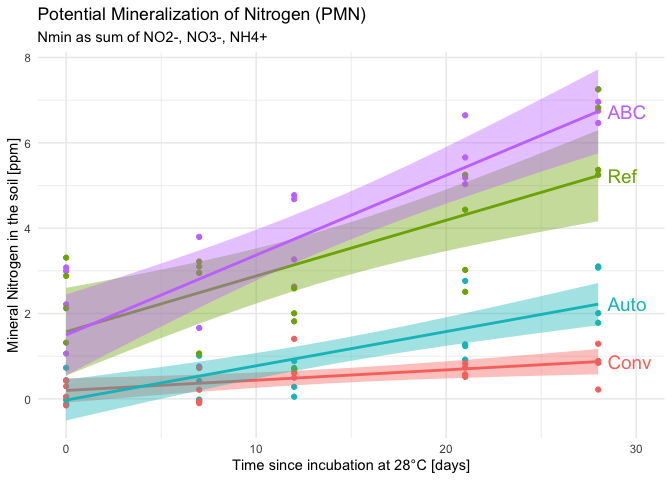
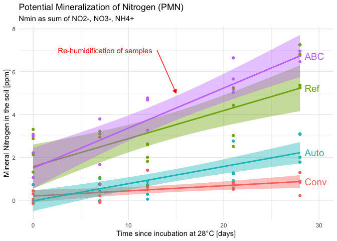
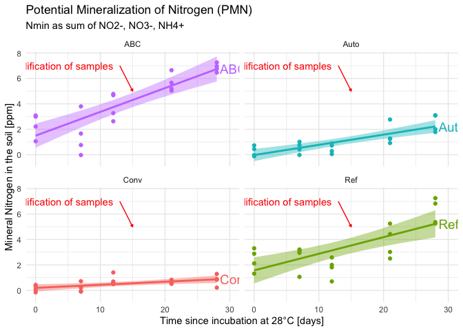

# 4 Greenhouse t2 - Data wrangling


- [TO DO](#to-do)
- [Set up](#set-up)
- [1 - Subset data](#1---subset-data)
  - [1.1 - Yield data](#11---yield-data)
  - [1.2 - Flush data (from K2SO4
    extraction)](#12---flush-data-from-k2so4-extraction)
  - [1.3 - Nmin data (from absorbance
    pipeline)](#13---nmin-data-from-absorbance-pipeline)
  - [1.4 - PMN data (from absorbance
    pipeline)](#14---pmn-data-from-absorbance-pipeline)
- [2 - Compute new variables](#2---compute-new-variables)
  - [2.1 - dry matter content (t2
    samples)](#21---dry-matter-content-t2-samples)
    - [2.1.1 - Principle and equations](#211---principle-and-equations)
    - [2.1.2 - Pivot data so that technical replicates are above each
      other, not next to each
      other](#212---pivot-data-so-that-technical-replicates-are-above-each-other-not-next-to-each-other)
  - [2.2 - Nmin concentrations in ppm (t2
    samples)](#22---nmin-concentrations-in-ppm-t2-samples)
  - [2.3 - PMN concentration in ppm](#23---pmn-concentration-in-ppm)
  - [2.3 - Yield variables](#23---yield-variables)
    - [2.3.1 - Human error check](#231---human-error-check)
    - [2.3.2 - Compute per plant clean yield
      data](#232---compute-per-plant-clean-yield-data)
  - [2.4 - Join all data (except PMN)](#24---join-all-data-except-pmn)
- [3 - Deal with standard soils](#3---deal-with-standard-soils)
- [**°°° !!! TO DO !!! °°°**](#--to-do--)
- [4 - Export](#4---export)

# TO DO

Move the PMN curve to script nb 5 !

Deal with standard soils.

- Problem: they have same biological unit nb. –\> a preliminary outlier
  removal needs to be ran separately, then average per biol_unit_nb,
  then it can be rejoined…

# Set up

<details class="code-fold">
<summary>Code</summary>

``` r
# clean environment
rm(list = ls())

# packages
library(tidyverse)
library(ggridges) # for geom_density_ridges()
library(ggrepel) # for geom_text_repel()
library(patchwork)
library(janitor)

# data
lab <- read_rds("output/data/3_greenhouse_t2_raw_lab.rds")
Nmin <- read_rds("output/data/3_greenhouse_t2_Nmin_clean.rds") 
PMN <- read_rds("output/data/3_greenhouse_PMN_clean.rds")
PMN_fw <- read_csv("raw_data/PMN/PMN_fw.csv") |> clean_names()
#lm_output <- read_rds("output/data/2_lm_output_noTDN.rds")
```

</details>

# 1 - Subset data

## 1.1 - Yield data

<details class="code-fold">
<summary>Code</summary>

``` r
yield_data <- lab |> 
  select(biol_unit_nb:sampling_time, starts_with("yd")) 
```

</details>

## 1.2 - Flush data (from K2SO4 extraction)

<details class="code-fold">
<summary>Code</summary>

``` r
raw_flush <- lab |> 
  select(
    !starts_with(c("yd", "whc")) &
      !cra_trial:sd_c)
```

</details>

## 1.3 - Nmin data (from absorbance pipeline)

<details class="code-fold">
<summary>Code</summary>

``` r
Nmin_sample <- Nmin |> filter(biol_unit_nb < 100)
Nmin_std <- Nmin |> filter_out(biol_unit_nb < 100)
```

</details>

## 1.4 - PMN data (from absorbance pipeline)

The PMN data is missing 1 key information: weight of fresh soil in the
sub-sample that undergoes the KCl extraction.

<details class="code-fold">
<summary>Code</summary>

``` r
PMN_fw_greenhouse <- PMN_fw |> filter_out(expe == "Field")
```

</details>

# 2 - Compute new variables

## 2.1 - dry matter content (t2 samples)

### 2.1.1 - Principle and equations

In this data set, dry matter and water content have not yet been
computed. The raw data with 3 technical replicates is encoded, in
separate columns starting with `flush_dm...`\`. In this section, we
compute average dry matter and water content for the sample (across
technical replicates). We add additional columns with intermediary
results:

- FW<sub>neat</sub> = FW<sub>gross</sub> - tare ; DW<sub>neat</sub> =
  DW<sub>gross</sub> - tare

- average (FW, then DW) = sum(3 technical replicates) / 3

- DM = avg<sub>DW</sub> / avg<sub>FW</sub>

- WC = 1 - DM

- With

  - FW = fresh weight \[g\]

  - DW = dry weight \[g\],

  - DM = dry matter content \[g<sub>dry soil</sub> /
    g<sub>fresh soil</sub>\],

  - WC = water content \[g<sub>water</sub> / g<sub>fresh soil</sub>\]
    <u>**!! UNIT: per g fresh soil !!**</u>

- ratio = fresh weight of soil added into tubes for extraction (~10g) /
  volume of extractant added (=20ml)

Then, we can finally convert concentrations in mg/L into concentrations
in ppm (mg/kg dry soil)

- see <https://mycloud.ulb.be/index.php/s/9ZKaJg9rXJg4iB7> for equation

### 2.1.2 - Pivot data so that technical replicates are above each other, not next to each other

First, we select relevant columns and pivot to get

- one column respectively for tare, gross fresh weight (g_fw) and gross
  dry weight (g_dw)

- 1 row per technical replicate

<details class="code-fold">
<summary>Code</summary>

``` r
raw_subset_wc <- raw_flush |> 
  select(sample_short, flush_dm_tare_tr1:flush_dm_g_dw_tr3) |> 
  pivot_longer(
    cols = !sample_short,
    names_pattern = "flush_dm_(g_fw|g_dw|tare)_tr(\\d)",
    names_to = c(".value", "tech_rep"),
    values_to = "weight") 

# check it out
raw_subset_wc 
```

</details>

    # A tibble: 264 × 5
       sample_short tech_rep  tare  g_fw  g_dw
       <chr>        <chr>    <dbl> <dbl> <dbl>
     1 t2_201_F     1         4.18  12.4  11.6
     2 t2_201_F     2         4.16  12.9  12.1
     3 t2_201_F     3         4.16  12.4  11.6
     4 t2_202_W     1         4.12  12    11.4
     5 t2_202_W     2         4.13  12.1  11.5
     6 t2_202_W     3         4.14  12.8  12.2
     7 t2_203_IC    1         4.14  12.6  11.9
     8 t2_203_IC    2         4.11  12.5  11.8
     9 t2_203_IC    3         4.13  13.6  12.8
    10 t2_205_F     1         4.15  12.3  11.6
    # ℹ 254 more rows

Then, we

- compute the neat fresh weight and dry weight for each row, and the dry
  matter content and water content

- Compute the average per sample (over the technical triplicate)

<details class="code-fold">
<summary>Code</summary>

``` r
wc <- raw_subset_wc |> 
  # compute neat values
  mutate(
    n_fw = g_fw - tare,
    n_dw = g_dw - tare,
    dm = n_dw / n_fw,
    wc = 1 - dm,
    .keep = "unused"
  ) |> 
  # compute mean per sample
  summarize(
    .by = sample_short,
    dm = mean(dm),
    wc = mean(wc)
  ) 

# check it out
wc 
```

</details>

    # A tibble: 88 × 3
       sample_short    dm     wc
       <chr>        <dbl>  <dbl>
     1 t2_201_F     0.904 0.0963
     2 t2_202_W     0.926 0.0741
     3 t2_203_IC    0.923 0.0767
     4 t2_205_F     0.919 0.0807
     5 t2_206_W     0.906 0.0940
     6 t2_207_IC    0.902 0.0982
     7 t2_209_F     0.899 0.101 
     8 t2_210_W     0.923 0.0772
     9 t2_211_IC    0.922 0.0780
    10 t2_213_F     0.909 0.0910
    # ℹ 78 more rows

Now that we have that clean data, we can

- remove useless columns (raw data used above)

- rejoin it to the complete greenhouse data (with all columns)

- compute each sample’s individual “ratio” (~10g/20ml)

<details class="code-fold">
<summary>Code</summary>

``` r
# Volume of extractant used in the K2SO4 extraction
vol_extr <- 20 

flush_clean <- raw_flush |> 
  select(
    !flush_dm_tare_tr1:flush_dm_g_dw_tr3 & 
      !ends_with("comment")) |> 
  left_join(wc) |> 
  mutate(
    ratio_nf = flush_fw_nf_g / vol_extr,
    ratio_cfe = flush_fw_cfe_g / vol_extr,
    .keep = "unused") 
```

</details>

    Joining with `by = join_by(sample_short)`

<details class="code-fold">
<summary>Code</summary>

``` r
flush_clean
```

</details>

    # A tibble: 88 × 13
       biol_unit_nb expe  sample_short soil  crop_diversity cs    bloc 
              <dbl> <chr> <chr>        <fct> <fct>          <fct> <fct>
     1            1 Pot   t2_201_F     Conv  SC             F     B1   
     2            2 Pot   t2_202_W     Conv  SC             W     B1   
     3            3 Pot   t2_203_IC    Conv  IC             IC    B1   
     4            5 Pot   t2_205_F     Ref   SC             F     B1   
     5            6 Pot   t2_206_W     Ref   SC             W     B1   
     6            7 Pot   t2_207_IC    Ref   IC             IC    B1   
     7            9 Pot   t2_209_F     Auto  SC             F     B1   
     8           10 Pot   t2_210_W     Auto  SC             W     B1   
     9           11 Pot   t2_211_IC    Auto  IC             IC    B1   
    10           13 Pot   t2_213_F     ABC   SC             F     B1   
    # ℹ 78 more rows
    # ℹ 6 more variables: sampling_time <chr>, sample_name <chr>, dm <dbl>,
    #   wc <dbl>, ratio_nf <dbl>, ratio_cfe <dbl>

Now, we divide the data in 2 subsets: sample data and standard soil data
(several reps, messes up the analysis (for now))

<details class="code-fold">
<summary>Code</summary>

``` r
flush_sample <- flush_clean |> filter(biol_unit_nb < 100)
flush_std <- flush_clean |> filter_out(biol_unit_nb < 100)
```

</details>

## 2.2 - Nmin concentrations in ppm (t2 samples)

First, we

- join absorbance data and flush data,

- Compute the N-sp N concentration in ppm (e.g. mg NO3-N / kg dry soil)

- do some data housecleaning

<details class="code-fold">
<summary>Code</summary>

``` r
Nmin_sample |> arrange(biol_unit_nb) 
```

</details>

    # A tibble: 180 × 17
    # Groups:   plate_id, map, biol_unit_nb [180]
       plate_id  map   biol_unit_nb std_sp conc_mgN_L   st_dev coef_var dataset 
       <chr>     <chr>        <dbl> <chr>       <dbl>    <dbl>    <dbl> <chr>   
     1 NH4_2P7_1 1_t2             1 NH4       0.0499  0.0250      50    Nmint1t2
     2 NO2_2P7_1 1_t2             1 NO2       0.00352 0            0    Nmint1t2
     3 NO3_2P7_1 1_t2             1 NO3       0.132   0.00898      6.79 Nmint1t2
     4 NH4_2P3   2_t2             2 NH4       0.236   0.0405      17.2  Nmint1t2
     5 NO2_2P3   2_t2             2 NO2       0.00599 0.000865    14.4  Nmint1t2
     6 NO3_2P3   2_t2             2 NO3       0.0988  0.0146      14.7  Nmint1t2
     7 NH4_2P3   3_t2             3 NH4       0.0868  0            0    Nmint1t2
     8 NO2_2P3   3_t2             3 NO2       0.00711 0.000749    10.5  Nmint1t2
     9 NO3_2P3   3_t2             3 NO3       0.103   0.0176      17.1  Nmint1t2
    10 NH4_2P3   5_t2             5 NH4       0.0744  0.0248      33.3  Nmint1t2
    # ℹ 170 more rows
    # ℹ 9 more variables: sampling_time <chr>, expe <chr>, target_sp <chr>,
    #   std_unit <chr>, slope <dbl>, adj_r_squared <dbl>, lm_p <dbl>, cs <fct>,
    #   soil <fct>

<details class="code-fold">
<summary>Code</summary>

``` r
Nmin_ppm_sample <- Nmin_sample |> 
  # join both data tables
  left_join(flush_sample) |> 
  # compute concentration in ppm
  mutate(conc_ppm = conc_mgN_L / (ratio_nf * dm)) |> 
  # remove again the bare soils
  filter_out(is.na(sample_short)) |> 
  # select relevant columns
  select(!c(
    #dataset, 
    expe, 
    target_sp:lm_p, 
    starts_with("sampl"), starts_with("ratio"),
    map, plate_id, conc_mgN_L)) |> 
  arrange(biol_unit_nb)
```

</details>

    Joining with `by = join_by(biol_unit_nb, sampling_time, expe, cs, soil)`
    Adding missing grouping variables: `plate_id`, `map`

<details class="code-fold">
<summary>Code</summary>

``` r
# Check it out
Nmin_ppm_sample
```

</details>

    # A tibble: 180 × 14
    # Groups:   plate_id, map, biol_unit_nb [180]
       plate_id  map   biol_unit_nb std_sp   st_dev coef_var dataset  cs    soil 
       <chr>     <chr>        <dbl> <chr>     <dbl>    <dbl> <chr>    <fct> <fct>
     1 NH4_2P7_1 1_t2             1 NH4    0.0250      50    Nmint1t2 F     Conv 
     2 NO2_2P7_1 1_t2             1 NO2    0            0    Nmint1t2 F     Conv 
     3 NO3_2P7_1 1_t2             1 NO3    0.00898      6.79 Nmint1t2 F     Conv 
     4 NH4_2P3   2_t2             2 NH4    0.0405      17.2  Nmint1t2 W     Conv 
     5 NO2_2P3   2_t2             2 NO2    0.000865    14.4  Nmint1t2 W     Conv 
     6 NO3_2P3   2_t2             2 NO3    0.0146      14.7  Nmint1t2 W     Conv 
     7 NH4_2P3   3_t2             3 NH4    0            0    Nmint1t2 IC    Conv 
     8 NO2_2P3   3_t2             3 NO2    0.000749    10.5  Nmint1t2 IC    Conv 
     9 NO3_2P3   3_t2             3 NO3    0.0176      17.1  Nmint1t2 IC    Conv 
    10 NH4_2P3   5_t2             5 NH4    0.0248      33.3  Nmint1t2 F     Ref  
    # ℹ 170 more rows
    # ℹ 5 more variables: crop_diversity <fct>, bloc <fct>, dm <dbl>, wc <dbl>,
    #   conc_ppm <dbl>

Now, we pivot the data so that each N-sp receives its own column

<details class="code-fold">
<summary>Code</summary>

``` r
Nmin_ppm_wider <- Nmin_ppm_sample |>
  ungroup() |>  
  select(!c(plate_id, map, st_dev, coef_var)) |> 
  pivot_wider(
    names_from = std_sp,
    values_from = conc_ppm,
    names_prefix = "ppm_"
  ) |> 
  # to make obvious that NO3 is still uncorrected
  rename(ppm_NO3_uncorrected = ppm_NO3)
```

</details>

Then we can compute final Nmin variables:

- correct NO3 value (what is measured is the sum of NO3 and NO2, bc we
  measure NO2 after reduction of NO3 to NO2)

- Compute Nmin (= NO3 + NO2 + NH4)

- Compute ratio, e.g., NO3/Nmin, NH4/Nmin, NO3/NH4

<details class="code-fold">
<summary>Code</summary>

``` r
Nmin_all_variables <- Nmin_ppm_wider |> 
  mutate(
    ppm_NO3 = ppm_NO3_uncorrected - ppm_NO2,
    ppm_Nmin = ppm_NO3_uncorrected + ppm_NH4,
    NO3_Nmin = ppm_NO3 / ppm_Nmin,
    NH4_Nmin = ppm_NH4 / ppm_Nmin,
    NO3_NH4 = ppm_NO3 / ppm_NH4
  ) |> 
  # remove uncorrected NO3
  select(!ppm_NO3_uncorrected)
```

</details>

## 2.3 - PMN concentration in ppm

Here, we

- join PMN_fw (data set containing fresh weight of the subsample that
  underwent the incubation) with the absorbance derived concentration
  data in mg N / L

<!-- -->

- compute the ratio between weight of fresh soil and volume of
  extractant (150ml) –\> ~30g/150ml

- Derive the concentration in ppm from mg N/L, ratio and dry matter

<details class="code-fold">
<summary>Code</summary>

``` r
volume_kcl <- 150
PMN_ppm <- PMN |> 
  left_join(PMN_fw_greenhouse) |> 
  mutate(
    ratio = fw / 150,
    conc_ppm = conc_mgN_L / (ratio * dm)
  )
```

</details>

    Joining with `by = join_by(map, soil)`

Now, we want the concentration in separate columns as above for Nmin,

<details class="code-fold">
<summary>Code</summary>

``` r
PMN_wider <- PMN_ppm |> 
  pivot_wider(
  names_from = std_sp,
  names_prefix = "ppm_",
  values_from = conc_ppm,
  id_cols = c(map, biol_unit_nb, soil, dm, wc, expe, incub_time, rep_tech, fw, ratio)
) |> 
  rename(ppm_NO3_uncorrected = ppm_NO3)
```

</details>

Then, we can do the NO3 correction and other computation of variables

<details class="code-fold">
<summary>Code</summary>

``` r
dates <- c("2023-12-5", "2023-12-12", "2023-12-17", "2023-12-26", "2024-01-02") |> as.Date()
incub_days <- dates - dates[1]
names(incub_days) <- PMN_wider$incub_time |> unique() |> sort()

PMN_all_variables <- PMN_wider |> 
  mutate(
    ppm_NO3 = ppm_NO3_uncorrected - ppm_NO2,
    ppm_Nmin = ppm_NO3_uncorrected + ppm_NH4,
    NO3_Nmin = ppm_NO3 / ppm_Nmin,
    NH4_Nmin = ppm_NH4 / ppm_Nmin,
    NO3_NH4 = ppm_NO3 / ppm_NH4,
    incub_day = incub_days[incub_time],
    soil = factor(soil, levels = c("Conv", "Ref", "Auto", "ABC"))
  ) |> 
  # remove uncorrected NO3
  select(!ppm_NO3_uncorrected) 

#check correspondence incubation vs dates
PMN_all_variables |> ungroup() |> select(incub_time, incub_day) |> unique()
```

</details>

    # A tibble: 5 × 2
      incub_time incub_day
      <chr>      <drtn>   
    1 i0          0 days  
    2 i1          7 days  
    3 i2         12 days  
    4 i3         21 days  
    5 i4         28 days  

Finally, we ca compute the slope of the curve.

> [!IMPORTANT]
>
> ### Statistical issue
>
> We have 4 technical replicates per incubation time, but rep 1 of
> incubation time 1 has no particular relationship to rep 1 of
> incubation time 2. It would make little sense to compute 4 different
> slopes and then take the mean of the 4 slopes to get a boxplot and the
> option of an anova with comparison of means (of slopes).

According to AI (see full doc):

- ANCOVA, (independant measurements bc subsamples evolve separately) .

  - linear model with interaction term: outcome ~ group \* predictor

  - –\> try with lm(ppm_Nmin ~ soil \* incub_days)

  - Details see doc

Finally, we can plot the curve of the potential mineralization of
Nitrogen (PMN)

<details class="code-fold">
<summary>Code</summary>

``` r
PMN_plot <- PMN_all_variables |> 
  ggplot(aes(x = incub_day, y = ppm_Nmin, group = soil, colour = soil, fill = soil)) +
  theme_minimal() +
  geom_point() +
  geom_smooth(method = "lm") +
  labs(
    title = "Potential Mineralization of Nitrogen (PMN)",
    subtitle = "Nmin as sum of NO2-, NO3-, NH4+") +
  xlab("Time since incubation at 28°C [days]") +
  ylab("Mineral Nitrogen in the soil [ppm]")

# for annotation: extract data from smooth curve
smooth_data <- ggplot_build(PMN_plot)$data[[2]]
```

</details>

    Don't know how to automatically pick scale for object of type <difftime>.
    Defaulting to continuous.
    `geom_smooth()` using formula = 'y ~ x'

<details class="code-fold">
<summary>Code</summary>

``` r
# get its maximum value to anker the annotation
annotations <- smooth_data |> 
  slice_max(x, by = group) |> 
  mutate(soil = levels(PMN_all_variables$soil))
#c("#F8766D", "#7CAE00", "#00BFC4", "#C77CFF") 

# Also annotate date of humidification
day_water <- as.Date("2023-12-20")
  
PMN_plot_all <- PMN_plot + 
  geom_text(
    data = annotations,
    aes(x = x+0.5, y = y, colour = soil, label = soil), 
    hjust = 0, size = 5) +
  xlim(c(0,30)) +
  theme(legend.position = "none") 
```

</details>

Looks nice, but if we facet… The curves… are not linear at all. Probably
due to re-humidification in-between:

<details class="code-fold">
<summary>Code</summary>

``` r
PMN_plot_all_annotated <- PMN_plot_all +
  annotate(
    geom = "segment", colour = "red",
    x = day_water - dates[1] - 2, xend = day_water - dates[1],
    y = 7, yend = 5,
    arrow = arrow(type = "closed", length = unit(0.02, "npc"))) +
  annotate(
    geom = "text", colour = "red",
    x = day_water - dates[1] - 2,
    y = 7, hjust = 1.05,
    label = "Re-humidification of samples"
  )

#PMN_plot_all_annotated
```

</details>

Look at all 3 versions

<details class="code-fold">
<summary>Code</summary>

``` r
PMN_plot_all
```

</details>

    `geom_smooth()` using formula = 'y ~ x'



<details class="code-fold">
<summary>Code</summary>

``` r
PMN_plot_all_annotated
```

</details>

    `geom_smooth()` using formula = 'y ~ x'



<details class="code-fold">
<summary>Code</summary>

``` r
PMN_plot_all_annotated + facet_wrap(~soil)
```

</details>

    `geom_smooth()` using formula = 'y ~ x'



–\> I would plead for the abandon of this measure !

## 2.3 - Yield variables

### 2.3.1 - Human error check

First, we compute the number of plants of each species in each pot

<details class="code-fold">
<summary>Code</summary>

``` r
nb_plant <- yield_data |> 
  rowwise() |> 
  relocate(starts_with(c("yd_rs_f_h", "yd_rs_f_s", "yd_rs_w_h", "yd_rs_w_ti"))) |> 
  mutate(
    # compute nb of plants of each sp
    nb_fb = case_when(
      !is.na(yd_rs_f_stem1) & !is.na(yd_rs_f_stem2) ~ 2,
      !is.na(yd_rs_f_stem1) & is.na(yd_rs_f_stem2) ~ 1
    ),
    nb_w = case_when(
      !is.na(yd_rs_w_till1) & !is.na(yd_rs_w_till2) ~ 2,
      !is.na(yd_rs_w_till1) & is.na(yd_rs_w_till2) ~ 1
    ))
```

</details>

First, we check the comments written during experimentation

<details class="code-fold">
<summary>Code</summary>

``` r
nb_plant |> 
  select(biol_unit_nb, soil, cs, crop_diversity, nb_w, nb_fb, yd_rs_comment) |> 
  filter(!is.na(yd_rs_comment)) |> print(width = 110)
```

</details>

    # A tibble: 5 × 7
    # Rowwise: 
      biol_unit_nb soil  cs    crop_diversity  nb_w nb_fb
             <dbl> <fct> <fct> <fct>          <dbl> <dbl>
    1           14 ABC   W     SC                 2    NA
    2           19 Conv  IC    IC                 1     1
    3           27 Auto  IC    IC                 2    NA
    4           30 ABC   W     SC                 2    NA
    5           55 Ref   IC    IC                NA     2
      yd_rs_comment                                                                 
      <chr>                                                                         
    1 1 seule vraie plante. Autre toute sèche (donc feuille pas mesurée) --> check …
    2 1 féverole supplémentaire dont on n'a pas tenu compte (non prélevée)          
    3 pas de féverole mais 2 froments --> pas IC, un SC_F supplémentaire --> change…
    4 trouvé nodules dans racines --> mauvaise herbe légumineuse. Léger IC quand mê…
    5 2 féveroles, pas de froment. Colonnes à corriger                              

And we correct the data accordingly

- pot \#14: change nb of wheat plants to 1

- pot \#19: on n’en fait rien de cette info…?

- Pot \#27: Changer IC en W pour cs, et IC en SC pour crop_diversity

- Pot \#30: on ne fait rien de cette info, mais si nb est outlier, on
  sait pourquoi…

- Pot \#55: changer IC en F (cs) et en SC (crop_diversity)

<details class="code-fold">
<summary>Code</summary>

``` r
nb_plant_clean <- nb_plant |> 
  mutate(
    nb_w = case_when(biol_unit_nb == 14 ~ 1, .default = nb_w),
    cs = case_when(
      biol_unit_nb == 27 ~ "W",
      biol_unit_nb == 55 ~ "F",
      .default = cs
    ),
    crop_diversity = case_when(
      biol_unit_nb %in% c(27, 55) ~ "SC",
      .default = crop_diversity
    )
  )
```

</details>

Check the modifications

<details class="code-fold">
<summary>Code</summary>

``` r
nb_plant_clean |> 
  select(biol_unit_nb, soil, cs, crop_diversity, nb_w, nb_fb, yd_rs_comment) |> 
  filter(!is.na(yd_rs_comment)) |> print(width = 110)
```

</details>

    # A tibble: 5 × 7
    # Rowwise: 
      biol_unit_nb soil  cs    crop_diversity  nb_w nb_fb
             <dbl> <fct> <chr> <chr>          <dbl> <dbl>
    1           14 ABC   W     SC                 1    NA
    2           19 Conv  IC    IC                 1     1
    3           27 Auto  W     SC                 2    NA
    4           30 ABC   W     SC                 2    NA
    5           55 Ref   F     SC                NA     2
      yd_rs_comment                                                                 
      <chr>                                                                         
    1 1 seule vraie plante. Autre toute sèche (donc feuille pas mesurée) --> check …
    2 1 féverole supplémentaire dont on n'a pas tenu compte (non prélevée)          
    3 pas de féverole mais 2 froments --> pas IC, un SC_F supplémentaire --> change…
    4 trouvé nodules dans racines --> mauvaise herbe légumineuse. Léger IC quand mê…
    5 2 féveroles, pas de froment. Colonnes à corriger                              

All good.

### 2.3.2 - Compute per plant clean yield data

Compute per plant versions of weight, plant height and stem/till number

<details class="code-fold">
<summary>Code</summary>

``` r
yield_per_plant <- nb_plant_clean |> 
  rowwise() |> 
  mutate(
    height_per_fb = mean(c_across(starts_with("yd_rs_f_h")), na.rm = TRUE),
    stem_per_fb = mean(c_across(starts_with("yd_rs_f_s")), na.rm = TRUE),
    height_per_w = mean(c_across(starts_with("yd_rs_w_h")), na.rm = TRUE),
    till_per_w = mean(c_across(starts_with("yd_rs_w_ti")), na.rm = TRUE),
    
    fw_fb_per_pot = yd_rs_f_biom_1_2plants_raw_fw_g - yd_rs_f_tare_g,
    fw_w_per_pot = yd_rs_w_biom_1_2plants_raw_fw_g - yd_rs_w_tare_g,
    dw_fb_per_pot = yd_rs_f_biom_1_2plants_raw_dw_g - yd_rs_f_tare_g,
    dw_w_per_pot = yd_rs_w_biom_1_2plants_raw_dw_g - yd_rs_w_tare_g,
    
    fw_fb_per_plant = fw_fb_per_pot / nb_fb,
    fw_w_per_plant = fw_w_per_pot / nb_w,
    dw_fb_per_plant = dw_fb_per_pot / nb_fb,
    dw_w_per_plant = dw_w_per_pot / nb_w,
    
    .keep = "unused"
    ) 

# check it out
yield_per_plant
```

</details>

    # A tibble: 88 × 23
    # Rowwise: 
       biol_unit_nb expe  sample_short cra_trial sd_c  soil  crop_diversity cs   
              <dbl> <chr> <chr>        <chr>     <chr> <fct> <chr>          <chr>
     1            1 Pot   t2_201_F     SyCI      Conv  Conv  SC             F    
     2            2 Pot   t2_202_W     SyCI      Conv  Conv  SC             W    
     3            3 Pot   t2_203_IC    SyCI      Conv  Conv  IC             IC   
     4            5 Pot   t2_205_F     SyCBio    SdC1  Ref   SC             F    
     5            6 Pot   t2_206_W     SyCBio    SdC1  Ref   SC             W    
     6            7 Pot   t2_207_IC    SyCBio    SdC1  Ref   IC             IC   
     7            9 Pot   t2_209_F     SyCBio    SdC2  Auto  SC             F    
     8           10 Pot   t2_210_W     SyCBio    SdC2  Auto  SC             W    
     9           11 Pot   t2_211_IC    SyCBio    SdC2  Auto  IC             IC   
    10           13 Pot   t2_213_F     SyCBio    SdC3  ABC   SC             F    
    # ℹ 78 more rows
    # ℹ 15 more variables: bloc <fct>, sampling_time <chr>, yd_rs_comment <chr>,
    #   height_per_fb <dbl>, stem_per_fb <dbl>, height_per_w <dbl>,
    #   till_per_w <dbl>, fw_fb_per_pot <dbl>, fw_w_per_pot <dbl>,
    #   dw_fb_per_pot <dbl>, dw_w_per_pot <dbl>, fw_fb_per_plant <dbl>,
    #   fw_w_per_plant <dbl>, dw_fb_per_plant <dbl>, dw_w_per_plant <dbl>

Save it in clean data set to join and export

<details class="code-fold">
<summary>Code</summary>

``` r
yield_clean <- yield_per_plant
```

</details>

## 2.4 - Join all data (except PMN)

<details class="code-fold">
<summary>Code</summary>

``` r
data_to_export <- Nmin_all_variables |> left_join(yield_clean)
```

</details>

    Joining with `by = join_by(biol_unit_nb, cs, soil, crop_diversity, bloc)`

# 3 - Deal with standard soils

# **°°° !!! TO DO !!! °°°**

# 4 - Export

We don’t export PMN data for now, as it seems like a dead-end..

<details class="code-fold">
<summary>Code</summary>

``` r
data_to_export |> write_rds("output/data/4_t2_greenhouse_transformed.rds")
```

</details>
