# 5.1 exploratory analysis for t2 field


- [TO DO](#to-do)
- [0 - Intro](#0---intro)
- [Set up](#set-up)
- [1 - Load and clean data](#1---load-and-clean-data)
- [2 - Compute LER](#2---compute-ler)
- [3 - PMN](#3---pmn)
- [°°° !!! FROM HERE - TO ADAPT FROM GREENHOUSE !!!
  °°°](#--from-here---to-adapt-from-greenhouse--)
- [4 - PCA](#4---pca)
  - [4.1 - Check assumptions](#41---check-assumptions)
  - [4.2 - Run PCA](#42---run-pca)
    - [4.2.1 - Graphical parameters](#421---graphical-parameters)
    - [4.2.2 - Faba Bean](#422---faba-bean)
    - [3.2.3 - Wheat](#323---wheat)
    - [3.2.4 - All plots](#324---all-plots)
- [What now?](#what-now)

# TO DO

- Correct LER with seeding rates (now relative values ok, absolute are
  off)

- Review notes PI meeting validation stat: 2 modèles

  - effet de système sur froment seul (1 facteur = 3 sols)

  - effet du labour sur effet de IC (Auto et ABC uniquement) –\> 2
    facteurs 2 niveaux (2 sols, 2 cs)

  - SO: remove all Ref & IC !

Still missing:

- PNR

- MicroResp

- Nmin t3 ?

# 0 - Intro

For the field data sets, some bits and pieces are dropped along the way:

- MicroResp experiment: still needs calibration (maybe)

- PMN: samples had to be re-humidified because the container system was
  not optimal and samples had become basically dry (see script on data
  wrangling: curves show interesting trends, but don’t know what to do
  with them)

- TDN & MBN: I believe that the blank was not digested

- WHC is not intrinsically interesting, though we have the data as well
  (was needed for MicroResp)

In the end, what is left here is:

- yield data (harvest: grain, grain protein, PS)

- Nmin data at t2 (NO2, NO3, NH4 –\> Nmin and ratios)

- LER can be derived from yield data (but = aggregated data –\> no
  incorporation in PCA possible)

- Question mark on:

  - slurry test (upcoming)

  - AMF quantification

  - Leghemoglobin quantification

What is still dormant is weed data. Relevant? not sure…

# Set up

``` r
# clean environment
rm(list = ls())

# packages
library(tidyverse)
library(vegan) # for rda()
library(patchwork)
library(RColorBrewer)

# function
source("functions/plot_pca.R")
```

# 1 - Load and clean data

``` r
field_Npools <- read_rds("output/data/4.1_t2_field_Npools.rds") |> 
  select(!c(expe, sampling_time, dilution)) 

field_yield <- read_rds("output/data/3_field_yield_clean.rds")

PMN <- read_rds("output/data/4.1_t2_field_PMN.rds")

#str(field_Npools)
```

``` r
# check out graphically that not too many outliers
field_Npools |> 
  ggplot(aes(x = soil, colour = cs, y = NO3_Nmin)) + 
  facet_wrap(~bloc) +
  geom_boxplot() +
  geom_point()
```

    Warning: Removed 6 rows containing non-finite outside the scale range
    (`stat_boxplot()`).

    Warning: Removed 6 rows containing missing values or values outside the scale range
    (`geom_point()`).

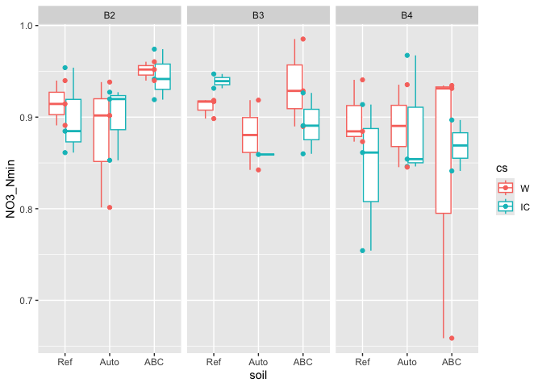

``` r
field_Npools |> 
  ggplot(aes(x = soil, colour = cs, y = NH4_Nmin)) + 
  facet_wrap(~bloc) +
  geom_boxplot() +
  geom_point()
```

    Warning: Removed 6 rows containing non-finite outside the scale range
    (`stat_boxplot()`).
    Removed 6 rows containing missing values or values outside the scale range
    (`geom_point()`).

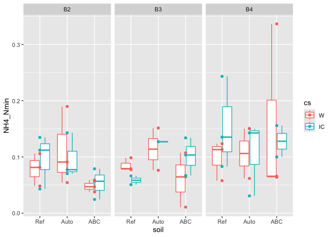

``` r
field_yield |> 
  ggplot(aes(x = soil, colour = crop, y = grain_yield_15p_t_per_ha)) +   geom_boxplot() +
  geom_point()
```

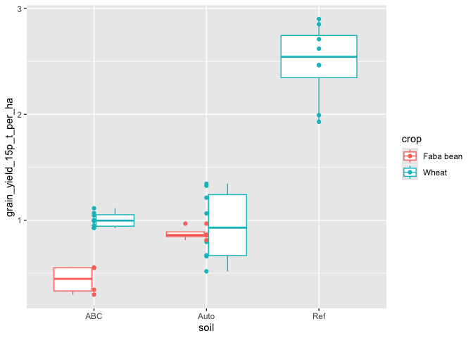

``` r
field_yield |> 
  ggplot(aes(x = soil, colour = crop, y = protein_percent_dw)) +   
  geom_boxplot() +
  geom_point()
```

    Warning: Removed 1 row containing non-finite outside the scale range
    (`stat_boxplot()`).

    Warning: Removed 1 row containing missing values or values outside the scale range
    (`geom_point()`).

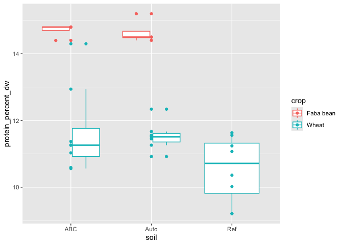

Now we want to get soil and yield data together, per crop (starting with
Faba Bean, then Wheat). For that, we need to compute the mean soil
values across the 3 zones (bc yield was taken once per plot).

``` r
field_Npools_mean <- field_Npools |> 
  group_by(soil, cs, bloc, biol_unit_nb) |> 
  summarise(
    MBN_ppm = mean(MBN_ppm, na.rm = TRUE),
    TDN_ppm = mean(TDN_ppm, na.rm = TRUE),
    ppm_NH4 = mean(ppm_NH4, na.rm = TRUE),
    ppm_NO3 = mean(ppm_NO3, na.rm = TRUE),
    ppm_NO2 = mean(ppm_NO2, na.rm = TRUE)
  ) |> 
  mutate(
    Nmin_ppm = ppm_NH4 + ppm_NO3 + ppm_NO2,
    Norg_ppm = TDN_ppm - Nmin_ppm,
    NO3_NH4 = ppm_NO3 / ppm_NH4,
    NO3_Nmin = ppm_NO3 / Nmin_ppm,
    Nmin_TDN = Nmin_ppm / TDN_ppm) |> 
  ungroup()
```

    `summarise()` has regrouped the output.
    ℹ Summaries were computed grouped by soil, cs, bloc, and biol_unit_nb.
    ℹ Output is grouped by soil, cs, and bloc.
    ℹ Use `summarise(.groups = "drop_last")` to silence this message.
    ℹ Use `summarise(.by = c(soil, cs, bloc, biol_unit_nb))` for per-operation
      grouping (`?dplyr::dplyr_by`) instead.

``` r
#pairs(field_Npools_mean |> select(!c(soil,cs, biol_unit_nb)))
```

We subset yield per plant and join the corresponding soil data

``` r
data_fb <- field_yield |> 
  filter(crop == "Faba bean") |> 
  arrange(biol_unit_nb) |> 
  left_join(field_Npools_mean)
```

    Joining with `by = join_by(soil, biol_unit_nb)`

``` r
data_w <- field_yield |> 
  filter(crop == "Wheat") |> 
  arrange(biol_unit_nb) |> 
  left_join(field_Npools_mean)
```

    Joining with `by = join_by(soil, biol_unit_nb)`

``` r
# check it out
data_fb
```

    # A tibble: 8 × 22
    # Rowwise: 
       year crop      soil  biol_unit_nb harvest_date grain_yield_15p_t_per_ha
      <dbl> <chr>     <chr>        <dbl> <chr>                           <dbl>
    1  2024 Faba bean ABC             81 13/08/2024                      0.554
    2  2024 Faba bean ABC             84 13/08/2024                      0.343
    3  2024 Faba bean ABC             86 13/08/2024                      0.297
    4  2024 Faba bean ABC             87 13/08/2024                      0.549
    5  2024 Faba bean Auto            98 13/08/2024                      0.812
    6  2024 Faba bean Auto           100 13/08/2024                      0.858
    7  2024 Faba bean Auto           102 13/08/2024                      0.968
    8  2024 Faba bean Auto           104 13/08/2024                      0.863
    # ℹ 16 more variables: protein_percent_dw <dbl>, grain_yield_t_per_ha <dbl>,
    #   water_content_percent <dbl>, test_weight_kg_per_hl <dbl>, cs <fct>,
    #   bloc <fct>, MBN_ppm <dbl>, TDN_ppm <dbl>, ppm_NH4 <dbl>, ppm_NO3 <dbl>,
    #   ppm_NO2 <dbl>, Nmin_ppm <dbl>, Norg_ppm <dbl>, NO3_NH4 <dbl>,
    #   NO3_Nmin <dbl>, Nmin_TDN <dbl>

``` r
data_w
```

    # A tibble: 24 × 22
    # Rowwise: 
        year crop  soil  biol_unit_nb harvest_date grain_yield_15p_t_per_ha
       <dbl> <chr> <chr>        <dbl> <chr>                           <dbl>
     1  2024 Wheat ABC             81 13/08/2024                      1.00 
     2  2024 Wheat ABC             82 13/08/2024                      1.07 
     3  2024 Wheat ABC             83 13/08/2024                      0.927
     4  2024 Wheat ABC             84 13/08/2024                      1.05 
     5  2024 Wheat ABC             85 13/08/2024                      0.927
     6  2024 Wheat ABC             86 13/08/2024                      0.950
     7  2024 Wheat ABC             87 13/08/2024                      1.11 
     8  2024 Wheat ABC             88 13/08/2024                      0.992
     9  2024 Wheat Ref             89 30/07/2024                      1.99 
    10  2024 Wheat Ref             90 30/07/2024                      2.62 
    # ℹ 14 more rows
    # ℹ 16 more variables: protein_percent_dw <dbl>, grain_yield_t_per_ha <dbl>,
    #   water_content_percent <dbl>, test_weight_kg_per_hl <dbl>, cs <fct>,
    #   bloc <fct>, MBN_ppm <dbl>, TDN_ppm <dbl>, ppm_NH4 <dbl>, ppm_NO3 <dbl>,
    #   ppm_NO2 <dbl>, Nmin_ppm <dbl>, Norg_ppm <dbl>, NO3_NH4 <dbl>,
    #   NO3_Nmin <dbl>, Nmin_TDN <dbl>

# 2 - Compute LER

Only possible for wheat, because we don’t have sole faba bean in the
field.

But this needs to consider seeding rates, so I’m not sure it will be
correct in terms of absolute values (yet).

<u>**!! TO DO: correct LER based on seeding rates !!**</u>

``` r
ler_w <- data_w |> 
  select(cs, soil, bloc, grain_yield_15p_t_per_ha, protein_percent_dw) |> 
  filter_out(is.na(bloc)) |> # remove empty blocs (= bloc 1, still here bc info on bloc was not stored in yield data --> not removed yet)
  pivot_wider(
    names_from = cs,
    values_from = c(grain_yield_15p_t_per_ha, protein_percent_dw)) |> 
  mutate(
    ler_w_off = grain_yield_15p_t_per_ha_IC / grain_yield_15p_t_per_ha_W,
    ler_w_n = protein_percent_dw_IC / protein_percent_dw_W
  )
```

Plot it

``` r
plot_ler_yield <- ler_w |> 
  ggplot(aes(x = soil, y = ler_w_off)) +
  theme_minimal() +
  geom_boxplot() +
  geom_point() +
  labs(title = "LER wheat", subtitle = "Field, harvest\n! Uncorrected values (seeding rates missing)")

plot_ler_protein <- ler_w |> 
  ggplot(aes(x = soil, y = ler_w_n)) +
  theme_minimal() +
  geom_boxplot() +
  geom_point() +
  labs(title = "LER wheat, grain protein", subtitle = "Field, harvest")

plot_ler_yield + plot_ler_protein 
```

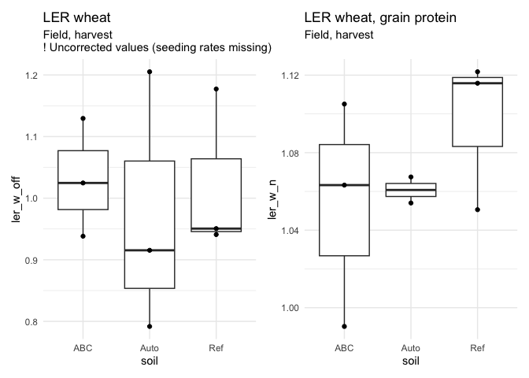

We shouldn’t look at the Ref in theory, because the Faba Bean did not
take, although it was re-sown. Still, it was harvested. Interesting that
it shows the highest gain in protein in the case of intercrops. Could it
be that because the Fababean was way overshadowed, it really
over-regulated the N fixation? Or is it just the slighly lower seeding
density of the wheat that gave it a highest share of the available soil
N? Possibly a bit of both?

Though of course: Ref has lower yield (per ha) in IC bc of the lower
density?

# 3 - PMN

With the PMN data, we can compute the slope of the curve.

> [!IMPORTANT]
>
> ### Statistical issue
>
> We have 4 technical replicates per incubation time, but rep 1 of
> incubation time 1 has no particular relationship to rep 1 of
> incubation time 2. It would make little sense to compute 4 different
> slopes and then take the mean of the 4 slopes to get a boxplot and the
> option of an anova with comparison of means (of slopes).

According to AI (see full doc):

- ANCOVA, (independant measurements bc subsamples evolve separately) .

  - linear model with interaction term: outcome ~ group \* predictor

  - –\> try with lm(ppm_Nmin ~ soil \* incub_days)

  - Details see doc

``` r
my_lm <- lm(data = PMN, ppm_Nmin ~ soil * incub_time)
summary(my_lm)
```


    Call:
    lm(formula = ppm_Nmin ~ soil * incub_time, data = PMN)

    Residuals:
        Min      1Q  Median      3Q     Max 
    -2.5812 -0.4075 -0.0050  0.5297  2.1830 

    Coefficients:
                          Estimate Std. Error t value Pr(>|t|)    
    (Intercept)             1.7302     0.6344   2.727 0.011088 *  
    soilAuto               -0.9608     0.8972  -1.071 0.293707    
    soilABC                -0.3253     0.8972  -0.363 0.719779    
    incub_timei3            3.3870     0.8972   3.775 0.000800 ***
    incub_timei4            3.9813     0.8972   4.437 0.000138 ***
    soilAuto:incub_timei3  -1.2809     1.2689  -1.009 0.321708    
    soilABC:incub_timei3   -1.4266     1.2689  -1.124 0.270770    
    soilAuto:incub_timei4  -0.7066     1.2689  -0.557 0.582211    
    soilABC:incub_timei4   -0.5735     1.2689  -0.452 0.654907    
    ---
    Signif. codes:  0 '***' 0.001 '**' 0.01 '*' 0.05 '.' 0.1 ' ' 1

    Residual standard error: 1.269 on 27 degrees of freedom
    Multiple R-squared:  0.6936,    Adjusted R-squared:  0.6028 
    F-statistic:  7.64 on 8 and 27 DF,  p-value: 2.625e-05

``` r
anova(my_lm)
```

    Analysis of Variance Table

    Response: ppm_Nmin
                    Df Sum Sq Mean Sq F value    Pr(>F)    
    soil             2 16.071   8.035  4.9909   0.01431 *  
    incub_time       2 79.814  39.907 24.7869 7.733e-07 ***
    soil:incub_time  4  2.524   0.631  0.3919   0.81258    
    Residuals       27 43.470   1.610                      
    ---
    Signif. codes:  0 '***' 0.001 '**' 0.01 '*' 0.05 '.' 0.1 ' ' 1

The Anova (in this case ANCOVA) says:

- effect of soil

- effect of incub_time ++ (duh)

- but no effect of the interaction –\> slopes are not different (no
  rejection of H0 = slopes are the same)

``` r
dates <- c("2023-12-12", "2024-01-02", "2024-01-09") |> as.Date()
incub_days <- dates - dates[1]
names(incub_days) <- PMN$incub_time |> unique() |> sort()

# plot again
PMN_plot <- PMN |> 
  ggplot(aes(x = incub_day, y = ppm_Nmin, group = soil, colour = soil, fill = soil)) +
  theme_minimal() +
  geom_point() +
  geom_smooth(method = "lm") +
  labs(
    title = "Potential Mineralization of Nitrogen (PMN) - Field",
    subtitle = "Mineral N as sum of NO2-, NO3-, NH4+\nNo statistical difference between slopes, only intercept",
    caption = "Modelled with lm(ppm_Nmin ~ soil * incub_time)") +
  xlab("Time since incubation at 28°C [days]") +
  ylab("Mineral Nitrogen in the soil [ppm]")

# for annotation: extract data from smooth curve
smooth_data <- ggplot_build(PMN_plot)$data[[2]]
```

    Don't know how to automatically pick scale for object of type <difftime>.
    Defaulting to continuous.
    `geom_smooth()` using formula = 'y ~ x'

``` r
# get its maximum value to anker the annotation
annotations <- smooth_data |> 
  slice_max(x, by = group) |> 
  mutate(soil = levels(PMN$soil))
#c("#F8766D", "#7CAE00", "#00BFC4", "#C77CFF") 

PMN_plot_all <- PMN_plot + 
  geom_text(
    data = annotations,
    aes(x = x+0.5, y = y, colour = soil, label = soil), 
    hjust = 0, size = 5) +
  xlim(c(0,30)) +
  theme(legend.position = "none") 
```

Look at both plots

``` r
PMN_plot_all
```

    `geom_smooth()` using formula = 'y ~ x'

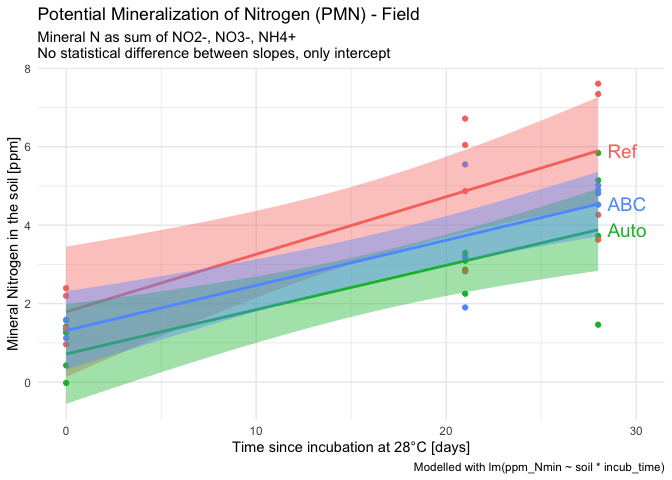

``` r
PMN_plot_all + facet_wrap(~soil) +
  xlim(c(0,38))
```

    Scale for x is already present.
    Adding another scale for x, which will replace the existing scale.
    `geom_smooth()` using formula = 'y ~ x'

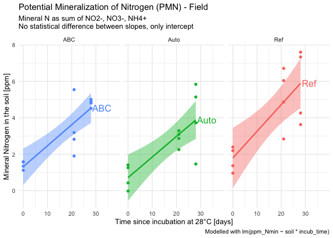

Save PMN plot

``` r
ggsave("output/figures/field/PMN.pdf", plot = PMN_plot_all)
```

    Saving 7 x 5 in image
    `geom_smooth()` using formula = 'y ~ x'

# °°° !!! FROM HERE - TO ADAPT FROM GREENHOUSE !!! °°°

# 4 - PCA

## 4.1 - Check assumptions

…. UPCOMING?

## 4.2 - Run PCA

### 4.2.1 - Graphical parameters

``` r
library(RColorBrewer)
display.brewer.all(n = 2, type = "qual")
```

    Warning in display.brewer.all(n = 2, type = "qual"): Illegal vector of color
    numbers

    [1] "2 2 2 2 2 2 2 2"


``` r
display.brewer.pal(n = 3, name = "Accent")
```


``` r
cs_colors <- brewer.pal(n = 3, name = "Accent")[2:3]
names(cs_colors) <- c("IC", "W")

display.brewer.all(n = 4, type = "qual")
```

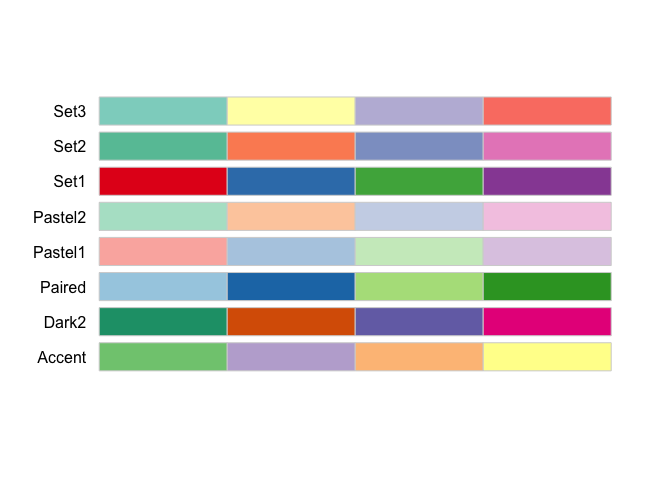

``` r
display.brewer.pal(n = 4, name = "Set1")
```

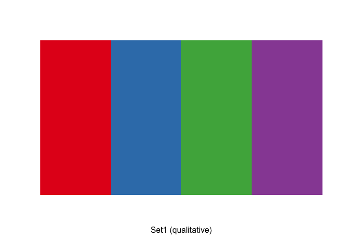

``` r
soil_colors <- brewer.pal(n = 4, name = "Set1")[2:4]
names(soil_colors) <- c("Ref", "Auto", "ABC")
```

### 4.2.2 - Faba Bean

``` r
rda_matrix_fb <- data_fb |> 
  select(
    biol_unit_nb,
    ppm_NO3, ppm_NH4, 
    #stem_per_fb, 
    grain_yield_15p_t_per_ha, protein_percent_dw) |> 
  column_to_rownames("biol_unit_nb") |> 
  drop_na()
  
pca_fb <- pca(rda_matrix_fb, scale = TRUE)

summary(pca_fb)
```


    Call:
    pca(X = rda_matrix_fb, scale = TRUE) 

    Partitioning of correlations:
                  Inertia Proportion
    Total               4          1
    Unconstrained       4          1

    Eigenvalues, and their contribution to the correlations 

    Importance of components:
                             PC1    PC2    PC3      PC4
    Eigenvalue            2.0687 1.5027 0.4146 0.013942
    Proportion Explained  0.5172 0.3757 0.1036 0.003485
    Cumulative Proportion 0.5172 0.8929 0.9965 1.000000

``` r
screeplot(pca_fb, bstick = TRUE, npcs = length(pca_fb$CA$eig))
```

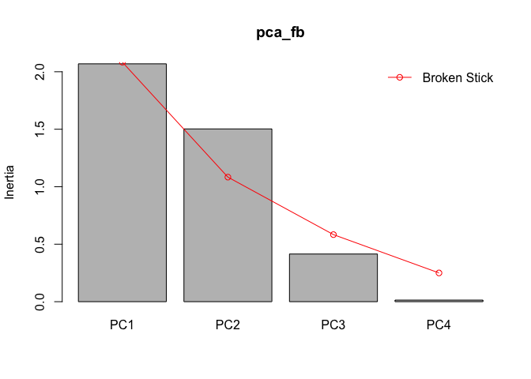

``` r
#biplot(pca_fb, scaling = 1, main = "PCA - scaling 1 = object relationships preserved")
biplot(pca_fb, main = "PCA FB - scaling 2 = variable relationships preserved")
```

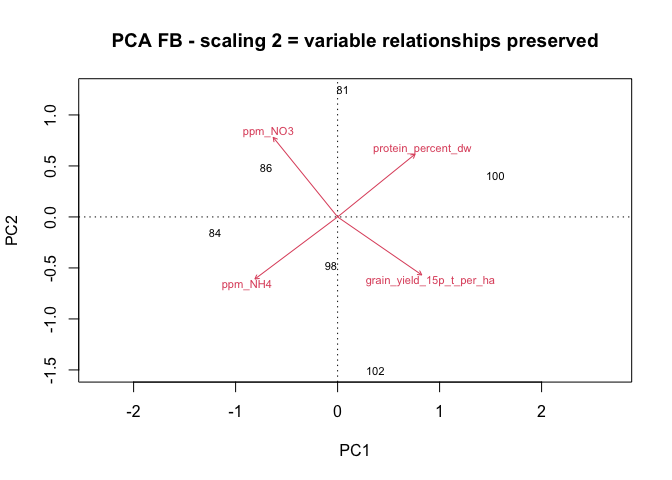

Prepare data for plotting

``` r
#non_pca <- greenhouse |> select(!ppm_NH4:NO3_NH4)
pot_scores <- scores(pca_fb, display = "sites", scaling = 2) 
biol_unit <- rownames(pot_scores) |> as.double()
pot_scores <- pot_scores |> 
  as_tibble() |> 
  mutate(biol_unit_nb = biol_unit)

var_scores <- scores(pca_fb, display = "species", scaling = 2)
variables <- rownames(var_scores)
var_scores <- var_scores |> 
  as_tibble() |> 
  mutate(variable = variables)

PC_percent <- pca_fb$CA$eig / sum(pca_fb$CA$eig)

data_fb_pca <- left_join(data_fb, pot_scores, by = join_by(biol_unit_nb))
```

Plot it

``` r
#dev.new()
plot_pca_fb_cs <- plot_pca(data_fb_pca, var_scores, PC_percent) +
  geom_point(aes( colour = cs)) +
  labs(title = "PCA - Faba Bean") +
  scale_color_discrete(palette = c(cs_colors["FB"], cs_colors["IC"])) 

plot_pca_fb_cs
```

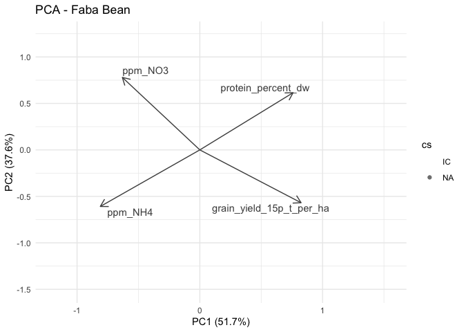

``` r
plot_pca_fb_soil <- plot_pca(data_fb_pca, var_scores, PC_percent) +
  geom_point(aes( colour = soil, shape = cs)) +
  labs(title = "PCA - Faba Bean") +
  scale_color_discrete(palette = c(soil_colors)) 

plot_pca_fb_soil
```

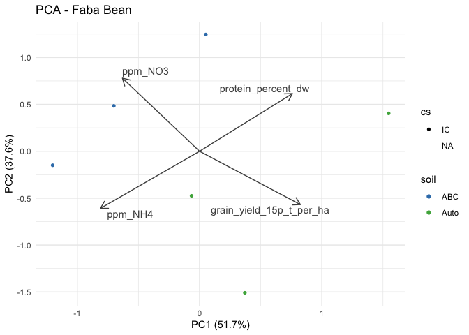

### 3.2.3 - Wheat

``` r
rda_matrix_w <- data_w |> 
  select(
    biol_unit_nb,
    ppm_NO3, ppm_NH4, 
    #till_per_w, 
    grain_yield_15p_t_per_ha, protein_percent_dw) |> 
  column_to_rownames("biol_unit_nb") |> 
  drop_na()
  
pca_w <- pca(rda_matrix_w, scale = TRUE)

summary(pca_w)
```


    Call:
    pca(X = rda_matrix_w, scale = TRUE) 

    Partitioning of correlations:
                  Inertia Proportion
    Total               4          1
    Unconstrained       4          1

    Eigenvalues, and their contribution to the correlations 

    Importance of components:
                             PC1    PC2    PC3    PC4
    Eigenvalue            1.5726 1.2139 0.7185 0.4950
    Proportion Explained  0.3932 0.3035 0.1796 0.1238
    Cumulative Proportion 0.3932 0.6966 0.8762 1.0000

``` r
screeplot(pca_w, bstick = TRUE, npcs = length(pca_w$CA$eig))
```

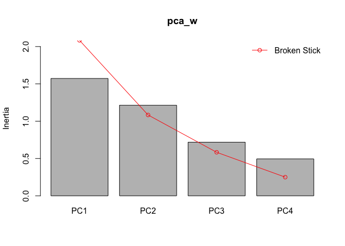

``` r
#biplot(pca_fb, scaling = 1, main = "PCA - scaling 1 = object relationships preserved")
biplot(pca_w, main = "PCA Wheat - scaling 2 = variable relationships preserved")
```

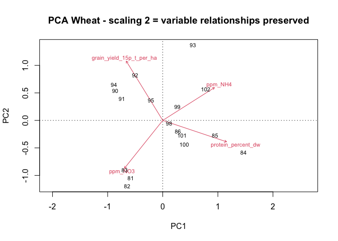

Prepare data for plotting

``` r
#non_pca <- greenhouse |> select(!ppm_NH4:NO3_NH4)
pot_scores <- scores(pca_w, display = "sites", scaling = 2) 
biol_unit <- rownames(pot_scores) |> as.double()
pot_scores <- pot_scores |> 
  as_tibble() |> 
  mutate(biol_unit_nb = biol_unit)

var_scores <- scores(pca_w, display = "species", scaling = 2)
variables <- rownames(var_scores)
var_scores <- var_scores |> 
  as_tibble() |> 
  mutate(variable = variables)

PC_percent <- pca_w$CA$eig / sum(pca_w$CA$eig)

data_w_pca <- left_join(data_w, pot_scores, by = join_by(biol_unit_nb))
```

Plot it

``` r
#dev.new()
plot_pca_w_cs <- plot_pca(data_w_pca, var_scores, PC_percent) +
  geom_point(aes( colour = cs)) +
  scale_color_discrete(palette = c(cs_colors["IC"], cs_colors["W"])) +
  labs(title = "PCA - Wheat")
  
#plot_pca_w_cs

plot_pca_w_soil <- plot_pca(data_w_pca, var_scores, PC_percent) +
  geom_point(aes( colour = soil, shape = cs)) +
  labs(title = "PCA - Wheat") +
  scale_color_discrete(palette = c(soil_colors)) 

#plot_pca_w_soil
```

### 3.2.4 - All plots

``` r
plot_pca_fb_cs + plot_pca_w_cs + plot_layout(guides = "collect")
```

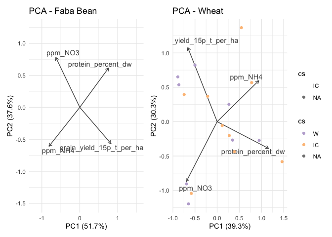

``` r
plot_pca_fb_soil + plot_pca_w_soil + plot_layout(guides = "collect")
```

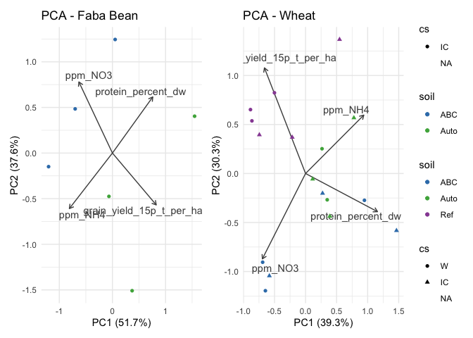

# What now?

According to the screeplots, I shouldn’t even represent the first PCA
(at least not with this version with only 4 variables).

``` r
# TEST CHUNK
```
