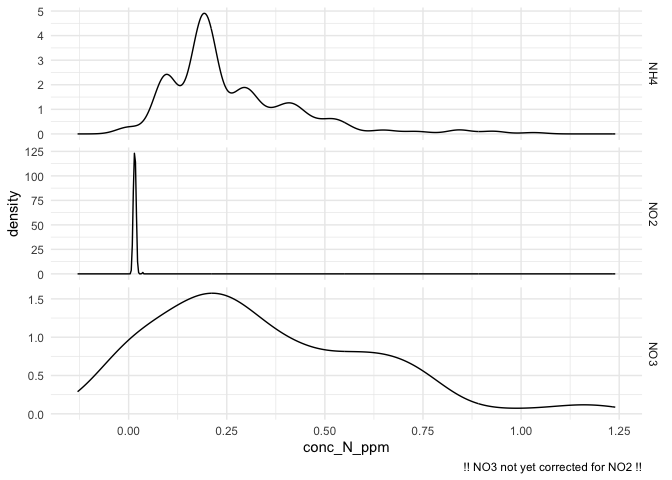
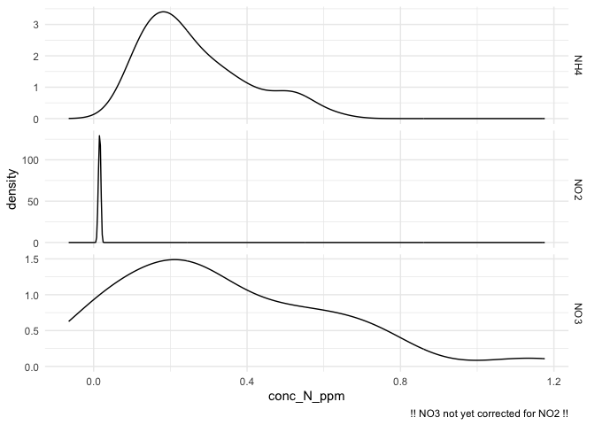
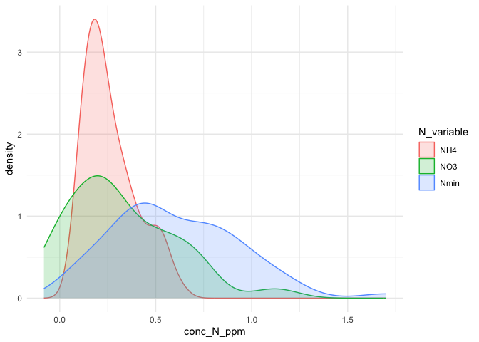
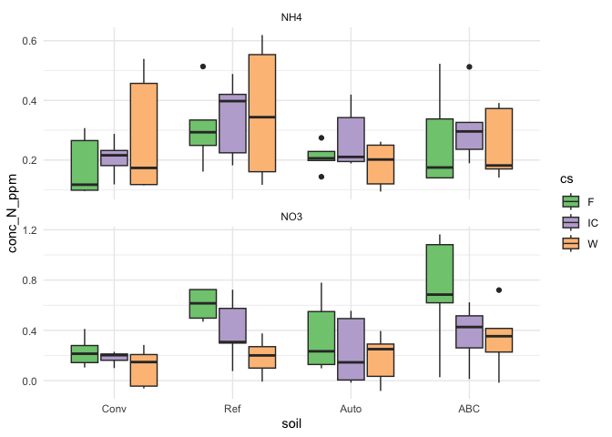
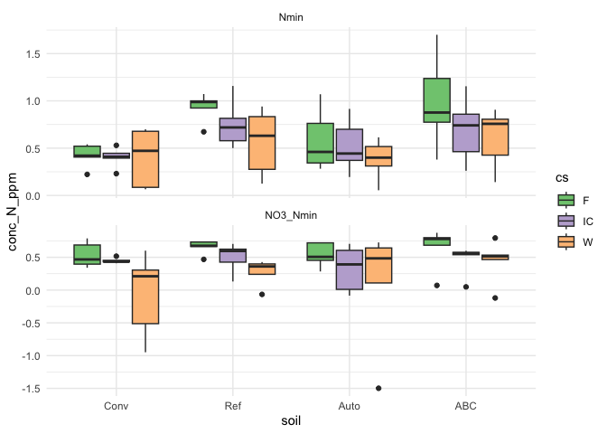
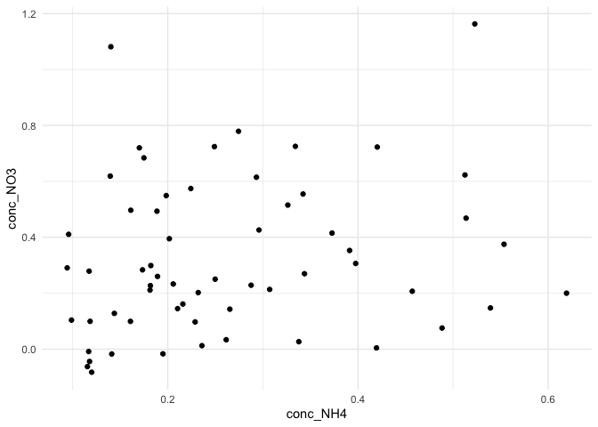
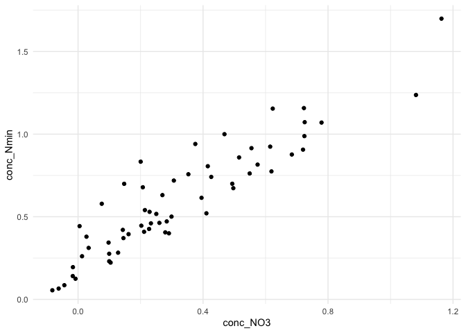

# V. Exploratory data analysis


- [To Do](#to-do)
- [Set up](#set-up)
- [1 - Nmin](#1---nmin)
  - [1.1 - import data](#11---import-data)
  - [1.2 - plots](#12---plots)
    - [1.2.1 - Raw distributions](#121---raw-distributions)
    - [1.2.2 - Distributions of Nmin and N
      species](#122---distributions-of-nmin-and-n-species)
    - [1.2.3 -](#123--)

# To Do

- move transformation to pivot_wider (compute new variables) to the
  transformation script & adapt this one

# Set up

<details class="code-fold">
<summary>Code</summary>

``` r
rm(list = ls())

library(tidyverse)
```

</details>

    ── Attaching core tidyverse packages ──────────────────────── tidyverse 2.0.0 ──
    ✔ dplyr     1.1.4     ✔ readr     2.1.5
    ✔ forcats   1.0.1     ✔ stringr   1.6.0
    ✔ ggplot2   4.0.0     ✔ tibble    3.3.0
    ✔ lubridate 1.9.4     ✔ tidyr     1.3.1
    ✔ purrr     1.2.0     
    ── Conflicts ────────────────────────────────────────── tidyverse_conflicts() ──
    ✖ dplyr::filter() masks stats::filter()
    ✖ dplyr::lag()    masks stats::lag()
    ℹ Use the conflicted package (<http://conflicted.r-lib.org/>) to force all conflicts to become errors

<details class="code-fold">
<summary>Code</summary>

``` r
library(roperators)
```

</details>


    Attaching package: 'roperators'

    The following object is masked from 'package:tibble':

        num

    The following object is masked from 'package:ggplot2':

        %+%

<details class="code-fold">
<summary>Code</summary>

``` r
library(RColorBrewer)
```

</details>

# 1 - Nmin

## 1.1 - import data

<details class="code-fold">
<summary>Code</summary>

``` r
Nmin_tfo1 <- read_rds("output/data/4_Nmin_tfo1.rds")
Nmin_tfo2 <- read_rds("output/data/4_Nmin_tfo2.rds")

#Nmin_tfo1
```

</details>

## 1.2 - plots

### 1.2.1 - Raw distributions

First, distribution of values (taking all technical reps = wells and of
average) per N species

! NO3 was not yet corrected for NO2

<details class="code-fold">
<summary>Code</summary>

``` r
# need to pivot to get 4 tech rep in one column. But !! also average will be taken
#** °°°°° Pivot according to rep tech °°°°° *
Nmin_rep_tech_longer <- Nmin_tfo1 |> pivot_longer(
  cols = starts_with("conc"),
  values_to = "conc_N_ppm",
  names_to = "rep_tech"
) 

# plot with all rep techs
Nmin_rep_tech_longer |> 
  # filter out the average
  filter(rep_tech != "conc_N_ppm_avg") |> 
  ggplot(aes(x = conc_N_ppm)) +
  theme_minimal() +
  labs(caption = "!! NO3 not yet corrected for NO2 !!") +
  #geom_histogram(fill = "white", color = "grey70", bins = 50) +
  geom_density() +
  facet_wrap(~N_sp, nrow = 3, strip.position = "right", scales = "free_y")
```

</details>



<details class="code-fold">
<summary>Code</summary>

``` r
# plot with averages
Nmin_rep_tech_longer |> 
  # filter out the average
  filter(rep_tech == "conc_N_ppm_avg") |> 
  ggplot(aes(x = conc_N_ppm)) +
  theme_minimal() +
  labs(caption = "!! NO3 not yet corrected for NO2 !!") +
#  geom_histogram(fill = "white", color = "grey70", bins = 50) +
  geom_density() +
  facet_wrap(~N_sp, nrow = 3, strip.position = "right", scales = "free_y")
```

</details>



### 1.2.2 - Distributions of Nmin and N species

<details class="code-fold">
<summary>Code</summary>

``` r
Nmin_N_variable_longer <- Nmin_tfo2 |> 
  # then we re-pivot so plotting will wrap is easily (and without also --° use filter)
  #** °°°°° Pivot according to N_variable
  pivot_longer(
    cols = starts_with("conc"),
    names_to = "N_variable",
    names_prefix = "conc_",
    values_to = "conc_N_ppm") |> 
  # make N_sp a factor with correct order
  mutate(N_variable = factor(N_variable, levels = c("NO2", "NH4", "NO3", "Nmin", "NO3_Nmin", "NH4_NO3")))

Nmin_N_variable_longer  
```

</details>

    # A tibble: 360 × 10
       expe  sample_short sd_c  soil  crop_diversity cs    bloc  sampling_time
       <chr> <chr>        <chr> <fct> <fct>          <fct> <fct> <chr>        
     1 Pot   1_t2         Conv  Conv  SC             F     B1    t2           
     2 Pot   1_t2         Conv  Conv  SC             F     B1    t2           
     3 Pot   1_t2         Conv  Conv  SC             F     B1    t2           
     4 Pot   1_t2         Conv  Conv  SC             F     B1    t2           
     5 Pot   1_t2         Conv  Conv  SC             F     B1    t2           
     6 Pot   1_t2         Conv  Conv  SC             F     B1    t2           
     7 Pot   2_t2         Conv  Conv  SC             W     B1    t2           
     8 Pot   2_t2         Conv  Conv  SC             W     B1    t2           
     9 Pot   2_t2         Conv  Conv  SC             W     B1    t2           
    10 Pot   2_t2         Conv  Conv  SC             W     B1    t2           
    # ℹ 350 more rows
    # ℹ 2 more variables: N_variable <fct>, conc_N_ppm <dbl>

<details class="code-fold">
<summary>Code</summary>

``` r
Nmin_N_variable_longer |> 
  filter(N_variable %ni% c("NO2", "NO3_Nmin", "NH4_NO3")) |> # comment this line to add NO2 again
  ggplot(aes(x = conc_N_ppm)) +
  theme_minimal() +
  geom_density(aes(color = N_variable, fill = N_variable), alpha = 0.2) #+
```

</details>



<details class="code-fold">
<summary>Code</summary>

``` r
#  facet_wrap(~N_sp, nrow = 4, strip.position = "right", scales = "free_y")
```

</details>

### 1.2.3 -

Look at NO3 and NH4

<details class="code-fold">
<summary>Code</summary>

``` r
Nmin_N_variable_longer |> 
  filter(N_variable %in% c("NH4", "NO3")) |> 
  ggplot(aes(x = soil, y = conc_N_ppm)) +
  theme_minimal() +
  geom_boxplot(aes(fill = cs)) +
  facet_wrap(~N_variable, nrow = 2, scales = "free_y") +
  scale_fill_discrete(palette = "Accent")
```

</details>



Look at Nmin and ratios

<details class="code-fold">
<summary>Code</summary>

``` r
Nmin_N_variable_longer |> 
  filter(N_variable %in% c("Nmin", "NO3_Nmin")) |> 
  ggplot(aes(x = soil, y = conc_N_ppm)) +
  theme_minimal() +
  geom_boxplot(aes(fill = cs)) +
  facet_wrap(~N_variable, nrow = 2, scales = "free_y") +
  scale_fill_discrete(palette = "Accent")
```

</details>



Look at relationship between NO3 and NH4

<details class="code-fold">
<summary>Code</summary>

``` r
Nmin_tfo2 |>
  ggplot(aes(x = conc_NH4, y = conc_NO3)) +
  theme_minimal() +
  geom_point() #+
```

</details>



<details class="code-fold">
<summary>Code</summary>

``` r
#  facet_wrap(~cs)
```

</details>

And between NO3 and Nmin

<details class="code-fold">
<summary>Code</summary>

``` r
Nmin_tfo2 |>
  ggplot(aes(x = conc_NO3, y = conc_Nmin)) +
  theme_minimal() +
  geom_point() #+
```

</details>



<details class="code-fold">
<summary>Code</summary>

``` r
#  facet_wrap(~cs)
```

</details>
