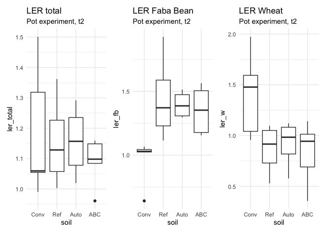
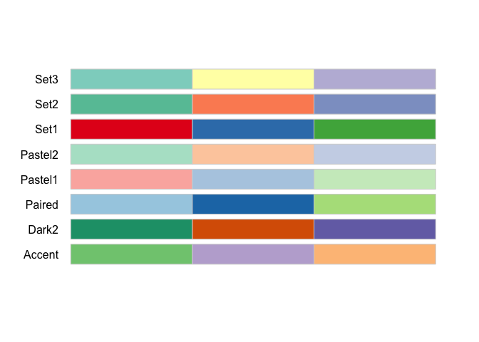
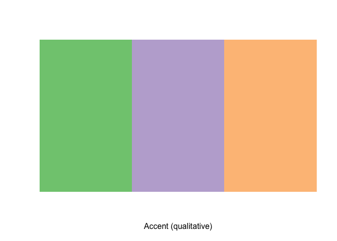
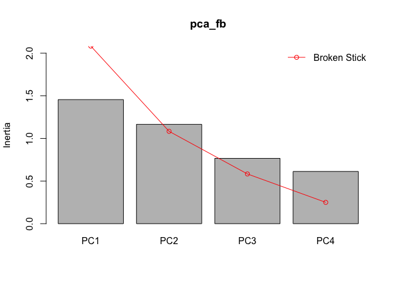
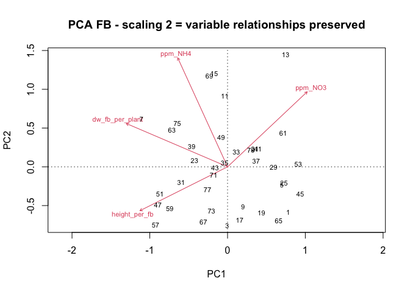
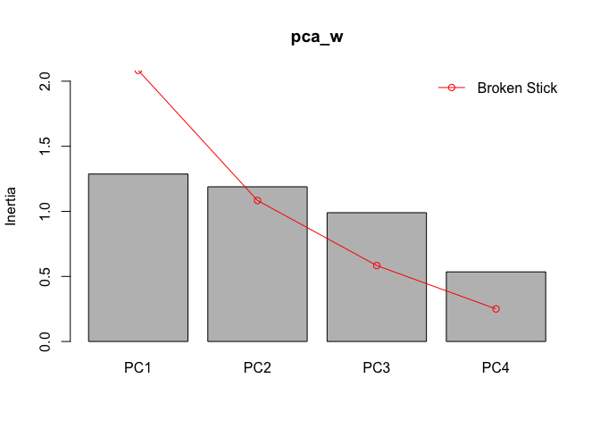
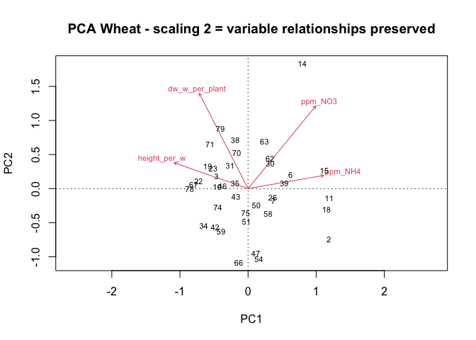
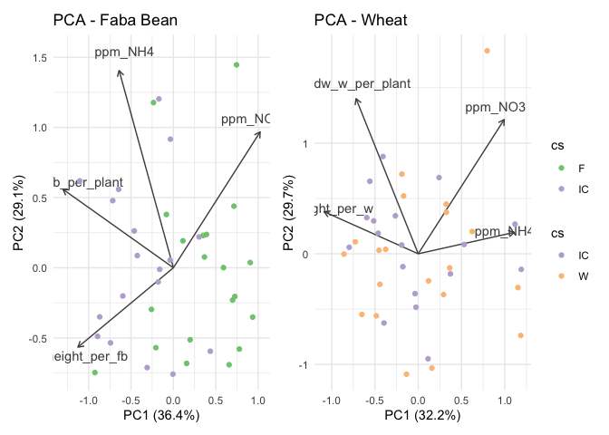

# 5 PCA and LER for t2 greenhouse


- [TO DO](#to-do)
- [Set up](#set-up)
- [1 - Load and clean data](#1---load-and-clean-data)
- [2 - Compute LER](#2---compute-ler)
- [3 - PCA](#3---pca)
  - [3.1 - Check assumptions](#31---check-assumptions)
  - [3.2 - Run PCA](#32---run-pca)
    - [3.2.1 - Graphical parameters](#321---graphical-parameters)
    - [3.2.2 - Faba Bean](#322---faba-bean)
    - [3.2.3 - Wheat](#323---wheat)
    - [3.2.4 - Both plots](#324---both-plots)
- [What now?](#what-now)

# TO DO

# Set up

``` r
# clean environment
rm(list = ls())

# packages
library(tidyverse)
library(vegan) # for rda()
library(patchwork)
library(RColorBrewer)

# data
```

# 1 - Load and clean data

``` r
greenhouse <- read_rds("output/data/4_t2_greenhouse_transformed.rds") |> 
  select(!c(
    dataset, expe:sampling_time
  )) |> 
  relocate(yd_rs_comment, .after = last_col())

str(greenhouse)
```

    tibble [60 × 27] (S3: tbl_df/tbl/data.frame)
     $ biol_unit_nb   : num [1:60] 1 2 3 5 6 7 9 10 11 13 ...
     $ cs             : chr [1:60] "F" "W" "IC" "F" ...
     $ soil           : Factor w/ 7 levels "Conv","Ref","Auto",..: 1 1 1 2 2 2 3 3 3 4 ...
     $ crop_diversity : chr [1:60] "SC" "SC" "IC" "SC" ...
     $ bloc           : Factor w/ 41 levels "pooled_rt1","pooled_rt2",..: 13 13 13 13 13 13 13 13 13 13 ...
     $ dm             : num [1:60] 0.904 0.926 0.923 0.919 0.906 ...
     $ wc             : num [1:60] 0.0963 0.0741 0.0767 0.0807 0.094 ...
     $ ppm_NH4        : num [1:60] 0.11 0.509 0.186 0.162 0.438 ...
     $ ppm_NO2        : num [1:60] 0.00773 0.01294 0.01524 0.01385 0.01239 ...
     $ ppm_NO3        : num [1:60] 0.283 0.2 0.205 0.49 0.384 ...
     $ ppm_Nmin       : num [1:60] 0.4 0.722 0.406 0.666 0.834 ...
     $ NO3_Nmin       : num [1:60] 0.707 0.278 0.504 0.736 0.46 ...
     $ NH4_Nmin       : num [1:60] 0.274 0.705 0.458 0.243 0.525 ...
     $ NO3_NH4        : num [1:60] 2.578 0.394 1.1 3.029 0.876 ...
     $ height_per_fb  : num [1:60] 32.8 NaN 44.5 34.8 NaN ...
     $ stem_per_fb    : num [1:60] 3.5 NaN 3 3 NaN 3 3 NaN 4 3.5 ...
     $ height_per_w   : num [1:60] NaN 37.8 54 NaN 48.5 ...
     $ till_per_w     : num [1:60] NaN 1 2 NaN 1 1 NaN 1 1 NaN ...
     $ fw_fb_per_pot  : num [1:60] 36.3 NA 17.7 39.5 NA ...
     $ fw_w_per_pot   : num [1:60] NA 4.45 4.64 NA 6.34 2.72 NA 6.99 2.47 NA ...
     $ dw_fb_per_pot  : num [1:60] 6.1 NA 3.14 6.58 NA 6.34 7.01 NA 5.12 6.29 ...
     $ dw_w_per_pot   : num [1:60] NA 1.4 1.38 NA 2.26 0.9 NA 2.49 0.72 NA ...
     $ fw_fb_per_plant: num [1:60] 18.2 NA 17.7 19.7 NA ...
     $ fw_w_per_plant : num [1:60] NA 2.22 4.64 NA 3.17 ...
     $ dw_fb_per_plant: num [1:60] 3.05 NA 3.14 3.29 NA ...
     $ dw_w_per_plant : num [1:60] NA 0.7 1.38 NA 1.13 ...
     $ yd_rs_comment  : chr [1:60] NA NA NA NA ...

Problem: for now, the statistical unit is the pot (1 row per pot). But
some variables cannot be regrouped for both plant species. Consequently,
there are some missing data, see here:

``` r
greenhouse |> select(cs, fw_fb_per_pot:dw_w_per_plant)
```

    # A tibble: 60 × 9
       cs    fw_fb_per_pot fw_w_per_pot dw_fb_per_pot dw_w_per_pot fw_fb_per_plant
       <chr>         <dbl>        <dbl>         <dbl>        <dbl>           <dbl>
     1 F              36.3        NA             6.1        NA                18.2
     2 W              NA           4.45         NA           1.4              NA  
     3 IC             17.7         4.64          3.14        1.38             17.7
     4 F              39.5        NA             6.58       NA                19.7
     5 W              NA           6.34         NA           2.26             NA  
     6 IC             26.2         2.72          6.34        0.900            26.2
     7 F              40.4        NA             7.01       NA                20.2
     8 W              NA           6.99         NA           2.49             NA  
     9 IC             29.7         2.47          5.12        0.72             29.7
    10 F              34.5        NA             6.29       NA                17.2
    # ℹ 50 more rows
    # ℹ 3 more variables: fw_w_per_plant <dbl>, dw_fb_per_plant <dbl>,
    #   dw_w_per_plant <dbl>

A PCA cannot be ran with missing data.

A solution is to change the statistical unit to be the plant, and have 2
data sets: dataset fababean (`data_fb`) and dataset wheat (`data_w`).
Anyway, it makes little sense to compare the 2 plant species, but it is
interesting to see if effects are similar or not. To be considered: bulk
soil data of intercrops will appear twice, so that the 2 datasets are
not to be combined in downstream analyses.

So we do that subsetting

``` r
data_fb <- greenhouse |> 
  select(!contains("_w")) |> 
  filter(cs != "W") |> 
  arrange(biol_unit_nb)

data_w <- greenhouse |> 
  select(!contains("_f")) |> 
  filter(cs != "F") |> 
  arrange(biol_unit_nb)

# check it out
str(data_fb) ; str(data_w)
```

    tibble [40 × 21] (S3: tbl_df/tbl/data.frame)
     $ biol_unit_nb   : num [1:40] 1 3 5 7 9 11 13 15 17 19 ...
     $ cs             : chr [1:40] "F" "IC" "F" "IC" ...
     $ soil           : Factor w/ 7 levels "Conv","Ref","Auto",..: 1 1 2 2 3 3 4 4 1 1 ...
     $ crop_diversity : chr [1:40] "SC" "IC" "SC" "IC" ...
     $ bloc           : Factor w/ 41 levels "pooled_rt1","pooled_rt2",..: 13 13 13 13 13 13 13 13 14 14 ...
     $ dm             : num [1:40] 0.904 0.923 0.919 0.902 0.899 ...
     $ wc             : num [1:40] 0.0963 0.0767 0.0807 0.0982 0.1012 ...
     $ ppm_NH4        : num [1:40] 0.11 0.186 0.162 0.377 0.187 ...
     $ ppm_NO2        : num [1:40] 0.00773 0.01524 0.01385 0.01558 0.01133 ...
     $ ppm_NO3        : num [1:40] 0.283 0.205 0.49 0.298 0.136 ...
     $ ppm_Nmin       : num [1:40] 0.4 0.406 0.666 0.69 0.334 ...
     $ NO3_Nmin       : num [1:40] 0.707 0.504 0.736 0.432 0.405 ...
     $ NH4_Nmin       : num [1:40] 0.274 0.458 0.243 0.546 0.561 ...
     $ NO3_NH4        : num [1:40] 2.578 1.1 3.029 0.791 0.723 ...
     $ height_per_fb  : num [1:40] 32.8 44.5 34.8 42 37 ...
     $ stem_per_fb    : num [1:40] 3.5 3 3 3 3 4 3.5 3 3 3 ...
     $ fw_fb_per_pot  : num [1:40] 36.3 17.7 39.5 26.1 40.4 ...
     $ dw_fb_per_pot  : num [1:40] 6.1 3.14 6.58 6.34 7.01 5.12 6.29 4.92 8.2 2.63 ...
     $ fw_fb_per_plant: num [1:40] 18.2 17.7 19.7 26.1 20.2 ...
     $ dw_fb_per_plant: num [1:40] 3.05 3.14 3.29 6.34 3.5 ...
     $ yd_rs_comment  : chr [1:40] NA NA NA NA ...

    tibble [40 × 21] (S3: tbl_df/tbl/data.frame)
     $ biol_unit_nb  : num [1:40] 2 3 6 7 10 11 14 15 18 19 ...
     $ cs            : chr [1:40] "W" "IC" "W" "IC" ...
     $ soil          : Factor w/ 7 levels "Conv","Ref","Auto",..: 1 1 2 2 3 3 4 4 1 1 ...
     $ crop_diversity: chr [1:40] "SC" "IC" "SC" "IC" ...
     $ bloc          : Factor w/ 41 levels "pooled_rt1","pooled_rt2",..: 13 13 13 13 13 13 13 13 14 14 ...
     $ dm            : num [1:40] 0.926 0.923 0.906 0.902 0.923 ...
     $ wc            : num [1:40] 0.0741 0.0767 0.094 0.0982 0.0772 ...
     $ ppm_NH4       : num [1:40] 0.509 0.186 0.4379 0.3769 0.0669 ...
     $ ppm_NO2       : num [1:40] 0.0129 0.0152 0.0124 0.0156 0.0159 ...
     $ ppm_NO3       : num [1:40] 0.2 0.205 0.384 0.298 0.262 ...
     $ ppm_Nmin      : num [1:40] 0.722 0.406 0.834 0.69 0.345 ...
     $ NO3_Nmin      : num [1:40] 0.278 0.504 0.46 0.432 0.76 ...
     $ NH4_Nmin      : num [1:40] 0.705 0.458 0.525 0.546 0.194 ...
     $ NO3_NH4       : num [1:40] 0.394 1.1 0.876 0.791 3.911 ...
     $ height_per_w  : num [1:40] 37.8 54 48.5 52.5 51.1 ...
     $ till_per_w    : num [1:40] 1 2 1 1 1 1 1.5 1 2 1 ...
     $ fw_w_per_pot  : num [1:40] 4.45 4.64 6.34 2.72 6.99 2.47 6.72 2.78 5.91 4.54 ...
     $ dw_w_per_pot  : num [1:40] 1.4 1.38 2.26 0.9 2.49 0.72 2.38 0.85 1.99 1.47 ...
     $ fw_w_per_plant: num [1:40] 2.22 4.64 3.17 2.72 3.49 ...
     $ dw_w_per_plant: num [1:40] 0.7 1.38 1.13 0.9 1.24 ...
     $ yd_rs_comment : chr [1:40] NA NA NA NA ...

# 2 - Compute LER

This also cannot go into the PCA since we get only data that agregates
on SC + IC

``` r
ler_fb <- data_fb |> 
  select(crop_diversity, soil, bloc, dw_fb_per_plant) |> 
  pivot_wider(
    names_from = crop_diversity,
    values_from = dw_fb_per_plant) |> 
  mutate(
    ler_fb = IC / SC
  )
  
ler_w <- data_w |> 
  select(crop_diversity, soil, bloc, dw_w_per_plant) |> 
  pivot_wider(
    names_from = crop_diversity,
    values_from = dw_w_per_plant) |> 
  mutate(
    ler_w = IC / SC
  )

ler_total <- ler_w |> 
  select(!SC:IC) |> 
  left_join(ler_fb |> select(!SC:IC)) |> 
  mutate(ler_total = (ler_w + ler_fb)/2)
```

Plot it

``` r
plot_ler_total <- ler_total |> 
  ggplot(aes(x = soil, y = ler_total)) +
  theme_minimal() +
  geom_boxplot() +
  labs(title = "LER total", subtitle = "Pot experiment, t2")

plot_ler_fb <- ler_total |> 
  ggplot(aes(x = soil, y = ler_fb)) +
  theme_minimal() +
  geom_boxplot() +
  labs(title = "LER Faba Bean", subtitle = "Pot experiment, t2")

plot_ler_w <- ler_total |> 
  ggplot(aes(x = soil, y = ler_w)) +
  theme_minimal() +
  geom_boxplot() +
  labs(title = "LER Wheat", subtitle = "Pot experiment, t2")

plot_ler_total + plot_ler_fb + plot_ler_w
```



# 3 - PCA

## 3.1 - Check assumptions

…. UPCOMING?

## 3.2 - Run PCA

### 3.2.1 - Graphical parameters

``` r
library(RColorBrewer)
display.brewer.all(n = 3, type = "qual")
```



``` r
display.brewer.pal(n = 3, name = "Accent")
```



``` r
cs_colors <- brewer.pal(n = 3, name = "Accent")
names(cs_colors) <- c("FB", "IC", "W")
```

### 3.2.2 - Faba Bean

``` r
rda_matrix_fb <- data_fb |> 
  select(
    biol_unit_nb,
    ppm_NO3, ppm_NH4, 
    #stem_per_fb, 
    height_per_fb, dw_fb_per_plant) |> 
  column_to_rownames("biol_unit_nb") |> 
  drop_na()
  
pca_fb <- pca(rda_matrix_fb, scale = TRUE)

summary(pca_fb)
```


    Call:
    pca(X = rda_matrix_fb, scale = TRUE) 

    Partitioning of correlations:
                  Inertia Proportion
    Total               4          1
    Unconstrained       4          1

    Eigenvalues, and their contribution to the correlations 

    Importance of components:
                             PC1    PC2    PC3    PC4
    Eigenvalue            1.4556 1.1654 0.7662 0.6127
    Proportion Explained  0.3639 0.2914 0.1916 0.1532
    Cumulative Proportion 0.3639 0.6553 0.8468 1.0000

``` r
screeplot(pca_fb, bstick = TRUE, npcs = length(pca_fb$CA$eig))
```



``` r
#biplot(pca_fb, scaling = 1, main = "PCA - scaling 1 = object relationships preserved")
biplot(pca_fb, main = "PCA FB - scaling 2 = variable relationships preserved")
```



Plot it

``` r
#non_pca <- greenhouse |> select(!ppm_NH4:NO3_NH4)
pot_scores <- scores(pca_fb, display = "sites", scaling = 2) 
biol_unit <- rownames(pot_scores) |> as.double()
pot_scores <- pot_scores |> 
  as_tibble() |> 
  mutate(biol_unit_nb = biol_unit)

var_scores <- scores(pca_fb, display = "species", scaling = 2)
variables <- rownames(var_scores)
var_scores <- var_scores |> 
  as_tibble() |> 
  mutate(variable = variables)

PC_percent <- pca_fb$CA$eig / sum(pca_fb$CA$eig)

#Nmin_w <- hclust(dist(scale(rda_matrix)), "ward.D")
#cutree(Nmin_w, k = 4)

#variable <- greenhouse$soil
#var_lev <- levels(factor(variable))

data_fb_pca <- left_join(data_fb, pot_scores, by = join_by(biol_unit_nb))


#dev.new()
plot_pca_fb <- data_fb_pca |> 
  ggplot(aes(x = PC1, y = PC2)) +
  theme_minimal() +
  geom_segment(
    data = var_scores,
    aes(xend = PC1, yend = PC2, x = 0, y =0),
    colour = "grey30", linetype = 1,
    arrow = arrow(length = unit(0.03, "npc"))
  ) +
  geom_text(
    data = var_scores,
    aes(x = PC1*0.9, y = PC2*1.1, label = variable),
    colour = "grey30"
  ) +
  geom_point(aes( colour = cs)) +
  scale_color_discrete(palette = c(cs_colors["FB"], cs_colors["IC"])) +
  labs(title = "PCA - Faba Bean") +
  xlab(paste0("PC1 (", signif(PC_percent[1]*100, digits = 3), "%)")) +
  ylab(paste0("PC2 (", signif(PC_percent[2]*100, digits = 3), "%)"))

#plot_pca_fb
```

### 3.2.3 - Wheat

``` r
rda_matrix_w <- data_w |> 
  select(
    biol_unit_nb,
    ppm_NO3, ppm_NH4, 
    #till_per_w, 
    height_per_w, dw_w_per_plant) |> 
  column_to_rownames("biol_unit_nb") |> 
  drop_na()
  
pca_w <- pca(rda_matrix_w, scale = TRUE)

summary(pca_w)
```


    Call:
    pca(X = rda_matrix_w, scale = TRUE) 

    Partitioning of correlations:
                  Inertia Proportion
    Total               4          1
    Unconstrained       4          1

    Eigenvalues, and their contribution to the correlations 

    Importance of components:
                             PC1    PC2    PC3    PC4
    Eigenvalue            1.2868 1.1888 0.9896 0.5349
    Proportion Explained  0.3217 0.2972 0.2474 0.1337
    Cumulative Proportion 0.3217 0.6189 0.8663 1.0000

``` r
screeplot(pca_w, bstick = TRUE, npcs = length(pca_w$CA$eig))
```



``` r
#biplot(pca_fb, scaling = 1, main = "PCA - scaling 1 = object relationships preserved")
biplot(pca_w, main = "PCA Wheat - scaling 2 = variable relationships preserved")
```



Plot it

``` r
#non_pca <- greenhouse |> select(!ppm_NH4:NO3_NH4)
pot_scores <- scores(pca_w, display = "sites", scaling = 2) 
biol_unit <- rownames(pot_scores) |> as.double()
pot_scores <- pot_scores |> 
  as_tibble() |> 
  mutate(biol_unit_nb = biol_unit)

var_scores <- scores(pca_w, display = "species", scaling = 2)
variables <- rownames(var_scores)
var_scores <- var_scores |> 
  as_tibble() |> 
  mutate(variable = variables)

PC_percent <- pca_w$CA$eig / sum(pca_w$CA$eig)

data_w_pca <- left_join(data_w, pot_scores, by = join_by(biol_unit_nb))

#dev.new()
plot_pca_w <- data_w_pca |> 
  ggplot(aes(x = PC1, y = PC2)) +
  theme_minimal() +
  geom_segment(
    data = var_scores,
    aes(xend = PC1, yend = PC2, x = 0, y =0),
    colour = "grey30", linetype = 1,
    arrow = arrow(length = unit(0.03, "npc"))
  ) +
  geom_text(
    data = var_scores,
    aes(x = PC1*0.9, y = PC2*1.1, label = variable),
    colour = "grey30"
  ) +
  geom_point(aes( colour = cs)) +
  scale_color_discrete(palette = c(cs_colors["IC"], cs_colors["W"])) +
  labs(title = "PCA - Wheat") +
  xlab(paste0("PC1 (", signif(PC_percent[1]*100, digits = 3), "%)")) +
  ylab(paste0("PC2 (", signif(PC_percent[2]*100, digits = 3), "%)"))

#plot_pca_w
```

### 3.2.4 - Both plots

``` r
plot_pca_fb + plot_pca_w + plot_layout(guides = "collect")
```



# What now?
